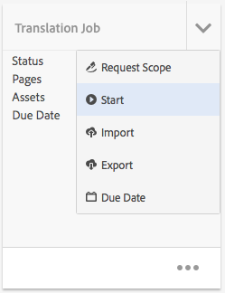

# Administración de proyectos de traducción{#managing-translation-projects}

Después de preparar el contenido para la traducción, debe completar la estructura lingüística creando las copias de idioma que faltan y crear proyectos de traducción.

Los proyectos de traducción le permiten administrar la traducción del contenido de AEM. Un proyecto de traducción es un tipo de [proyecto](/help/sites-authoring/projects.md) de AEM que contiene recursos que se van a traducir a otros idiomas. Estos recursos son las páginas y activos de las [copias de idioma](/help/sites-administering/tc-prep.md) que se crean a partir del idioma principal.

Cuando se añaden recursos a un proyecto de traducción, se crea un trabajo de traducción para ellos. Los trabajos proporcionan comandos e información de estado que se utilizan para administrar los flujos de trabajo de traducción humana y traducción automática que se ejecutan en los recursos.

>[!NOTE]
>
>Un proyecto de traducción puede contener varios trabajos de traducción.

Los proyectos de traducción son elementos de larga duración, definidos por el idioma y el método/proveedor de traducción para alinearse con la gobernanza organizativa para la globalización. Deben iniciarse una vez, ya sea durante la traducción inicial o a mano, y permanecer en vigor durante todas las actividades de actualización de contenido y traducción.

Los proyectos y trabajos de traducción se crean con los flujos de trabajo de preparación de la traducción. Estos flujos de trabajo tienen tres opciones, tanto para la traducción inicial (Crear y traducir) como para las actualizaciones (Actualizar traducción):

1. [Creación de un nuevo proyecto](#creating-translation-projects-using-the-references-panel)
1. [Adición a un proyecto existente](#adding-pages-to-a-translation-project)
1. [Solo estructura de contenido](#creating-the-structure-of-a-language-copy)

>[!NOTE]
>
>La opción 3 no está relacionada con el trabajo o proyecto de traducción. Permite copiar el contenido y los cambios estructurales del idioma principal en copias de idioma (no traducidas). Puede usar esto para mantener a los maestros de idiomas sincronizados, incluso sin traducción.

## Realización de traducciones iniciales y actualización de traducciones existentes {#performing-initial-translations-and-updating-existing-translations}

AEM detecta si se está creando un proyecto de traducción para la traducción inicial del contenido o para actualizar las copias de idioma ya traducidas. Cuando se crea un proyecto de traducción para una página y se indican las copias de idioma para las que se está traduciendo, AEM detecta si la página de origen ya existe en las copias de idioma de destino:

* **La copia de idioma no incluye la página:** AEM trata esta situación como la traducción inicial. La página se copia inmediatamente en el texto del idioma y se incluye en el proyecto. Cuando la página traducida se importa a AEM, AEM la copia directamente en la copia del idioma.
* **La copia de idioma ya incluye la página:** AEM trata esta situación como una traducción actualizada. Se crea un lanzamiento, se añade una copia de la página a este y se incluye en el proyecto. Los lanzamientos permiten revisar las traducciones actualizadas antes de enviarlas a la copia de idioma:

   * Cuando la página traducida se importa a AEM, sobrescribe la página en el lanzamiento.
   * La página traducida sobrescribe la copia de idioma solo cuando se promociona el lanzamiento.

Por ejemplo, la raíz de idioma /content/geometrixx/fr se crea para la traducción al francés del idioma principal /content/geometrixx/en. No hay más páginas en la copia en francés.

* Se crea un proyecto de traducción para la página /content/geometrixx/en/products y todas las páginas secundarias, destinado a la copia en francés. AEM Dado que la copia de idioma no incluye la página /content/geometrixx/fr/products, copia inmediatamente la página /content/geometrixx/en/products y todas las páginas secundarias a la copia en francés. Las copias también se incluyen en el proyecto de traducción.
* Se crea un proyecto de traducción para la página /content/geometrixx/en y todas las páginas secundarias, destinado a la copia en francés. AEM Como la copia de idioma incluye la página que corresponde con la página /content/geometrixx/en (la raíz del idioma), copia la página /content/geometrixx/en y todas las páginas secundarias y las añade a un lanzamiento. Las copias también se incluyen en el proyecto de traducción.

## Creación de proyectos de traducción mediante el panel Referencias {#creating-translation-projects-using-the-references-panel}

Cree proyectos de traducción para poder ejecutar y administrar el flujo de trabajo de traducción de los recursos del idioma principal. Cuando cree proyectos, especifique la página en el idioma principal que está traduciendo y las copias de idioma para las que va a hacer la traducción:

* La configuración de nube del marco de trabajo de integración de traducciones asociado a la página seleccionada determina muchas propiedades de los proyectos de traducción, como el flujo de trabajo de traducción que se va a utilizar.
* Se crea un proyecto para cada copia de idioma seleccionada.
* Se genera una copia de la página seleccionada y de los recursos asociados, que se añaden a cada proyecto. Estas copias se envían después al proveedor de traducciones para que las traduzca.

Puede especificar que las páginas secundarias de la página seleccionada también estén seleccionadas. En este caso, también se añaden copias de las páginas secundarias a cada proyecto para que se traduzcan. Cuando alguna página secundaria está asociada con diferentes configuraciones del marco de trabajo de integración de traducciones, AEM crea proyectos adicionales.

También puede [crear proyectos de traducción manualmente](#creating-a-translation-project-using-the-projects-console).

>[!NOTE]
>
>Para crear un proyecto, la cuenta debe ser miembro del grupo `project-administrators`.

**Traducciones iniciales y actualización de traducciones**

El panel Referencias indica si está actualizando las copias de idioma existentes o creando la primera versión de estas. Cuando existe una copia de idioma para la página seleccionada, aparece la pestaña Actualizar copias de idioma para proporcionar acceso a los comandos relacionados con el proyecto.

Después de traducir, puede [revisar la traducción](#reviewing-and-promoting-updated-content) antes de sobrescribir la copia de idioma con ella. Cuando no existe ninguna copia de idioma para la página seleccionada, aparece la pestaña Crear y traducir para dar acceso a los comandos relacionados con el proyecto.

### Creación de proyectos de traducción para una copia de idioma nueva {#create-translation-projects-for-a-new-language-copy}

1. Utilice la consola Sites para seleccionar la página que está añadiendo a los proyectos de traducción.

   Por ejemplo, para traducir las páginas en inglés de Geometrixx Demo Site, seleccione Geometrixx Demo Site > Inglés.

1. En la barra de herramientas, haga clic en Referencias.

   

1. Seleccione Copias de idioma y, a continuación, las copias de idioma para las que está traduciendo las páginas de origen.
1. Haga clic en Crear y traducir y, a continuación, configure el trabajo de traducción:

   * Utilice la lista desplegable Idiomas para seleccionar la copia de idioma que desea traducir. Seleccione otros idiomas según sea necesario. Los idiomas que aparecen en la lista se corresponden con las [raíces de idioma que ha creado](/help/sites-administering/tc-prep.md#creating-a-language-root).
   * Para traducir la página seleccionada y todas las secundarias, seleccione Seleccionar todas las páginas secundarias. Para traducir solo la página que ha seleccionado, desactive la opción.
   * En Proyecto, seleccione Crear nuevo proyecto de traducción.
   * Escriba un nombre para el proyecto.

   

1. Haga clic en Crear.

### Creación de proyectos de traducción para una copia de idioma existente {#create-translation-projects-for-an-existing-language-copy}

1. Utilice la consola Sites para seleccionar la página que está añadiendo a los proyectos de traducción.

   Por ejemplo, para traducir las páginas en inglés de Geometrixx Demo Site, seleccione Geometrixx Demo Site > Inglés.

1. En la barra de herramientas, haga clic en Referencias.

   

1. Seleccione Copias de idioma y, a continuación, las copias de idioma para las que está traduciendo las páginas de origen.
1. Haga clic en Actualizar copias de idioma y configure el trabajo de traducción:

   * Para traducir la página seleccionada y todas las secundarias, seleccione Seleccionar todas las páginas secundarias. Para traducir solo la página que ha seleccionado, desactive la opción.
   * En Proyecto, seleccione Crear nuevo proyecto de traducción.
   * Escriba un nombre para el proyecto.

   

1. Haga clic en Start.

## Adición de páginas a un proyecto de traducción {#adding-pages-to-a-translation-project}

Después de crear un proyecto de traducción, puede utilizar el panel Recursos para agregar páginas al proyecto. Agregarlas resulta útil cuando se incluyen páginas de distintas ramas en el mismo proyecto.

Al añadir páginas a un proyecto de traducción, estas se incluyen en un nuevo trabajo de traducción. También puede [agregar páginas a un trabajo existente](#adding-pages-assets-to-a-translation-job).

Al igual que al crear un proyecto, al añadir páginas, se añaden copias de las páginas a un lanzamiento cuando es necesario para evitar sobrescribir las copias de idioma existentes. Consulte [Creación de proyectos de traducción para copias de idiomas existentes](#performing-initial-translations-and-updating-existing-translations).

1. Utilice la consola Sites para seleccionar la página que está agregando al proyecto de traducción.

   Por ejemplo, para traducir las páginas en inglés de Geometrixx Demo Site, seleccione Geometrixx Demo Site > Inglés.

1. En la barra de herramientas, haga clic en Referencias.

   

1. Seleccione Copias de idioma y, a continuación, las copias de idioma para las que está traduciendo las páginas de origen.

   

1. Haga clic en Actualizar copias de idioma y, a continuación, configure las propiedades:

   * Para traducir la página seleccionada y todas las secundarias, seleccione Seleccionar todas las páginas secundarias. Para traducir solo la página que ha seleccionado, desactive la opción.
   * En Proyecto, seleccione Agregar a proyecto de traducción existente.
   * Seleccione el proyecto.

   >[!NOTE]
   >
   >El idioma de destino definido en el proyecto de traducción debe coincidir con la ruta de la copia de idioma, como se muestra en el panel Referencias.

   

1. Haga clic en Start.

## Adición de páginas o Assets a un trabajo de traducción {#adding-pages-assets-to-a-translation-job}

Puede añadir páginas, recursos, etiquetas o diccionarios i18n al trabajo de traducción de su proyecto de traducción. Para agregar páginas o activos:

1. En la parte inferior del mosaico Trabajo de traducción del proyecto de traducción, haga clic en los puntos suspensivos.

   

1. Haga clic en Agregar y en Páginas/Assets.

   

1. Seleccione el elemento superior de la rama que desee agregar y, a continuación, haga clic en el icono de marca de verificación. Puede hacer una selección múltiple.

   

1. También puede seleccionar el icono de búsqueda para buscar fácilmente páginas o activos que desee agregar a su trabajo de traducción.

   

Sus páginas o recursos se añaden a su trabajo de traducción.

## Adición de diccionarios i18n a un trabajo de traducción {#adding-i-n-dictionaries-to-a-translation-job}

Puede añadir páginas, recursos, etiquetas o diccionarios i18n al trabajo de traducción de su proyecto de traducción. Para añadir un diccionario i18n:

1. En la parte inferior del mosaico Trabajo de traducción del proyecto de traducción, haga clic en los puntos suspensivos.

   

1. Haga clic en Agregar y en Diccionario I18N.

   

1. Seleccione el **directorio raíz** y el diccionario (si es necesario) que desea agregar y, a continuación, seleccione **Agregar**.

   

1. Si se solicita, seleccione la naturaleza de la actualización:

   

El diccionario está ahora en su trabajo de traducción.

>[!NOTE]
>
>Para obtener más información sobre diccionarios i18n, lea [Uso del traductor para administrar diccionarios](/help/sites-developing/i18n-translator.md).

## Adición de etiquetas a un trabajo de traducción {#adding-tags-to-a-translation-job}

Puede añadir páginas, recursos, etiquetas o diccionarios i18n al trabajo de traducción de su proyecto de traducción. Para agregar etiquetas:

1. En la parte inferior del mosaico Trabajo de traducción del proyecto de traducción, haga clic en los puntos suspensivos.

   

1. Haga clic en Agregar y luego en Etiquetas.

   

1. Seleccione las etiquetas que desee agregar y, a continuación, haga clic en el icono de marca de verificación. Puede hacer una selección múltiple.

   

Las etiquetas se añadirán ahora al trabajo de traducción.

## Ver detalles del proyecto de traducción {#seeing-translation-project-details}

El mosaico Resumen de traducción contiene las propiedades configuradas para un proyecto de traducción. Además de la [información del proyecto](/help/sites-authoring/projects.md#project-info) genérica, la ficha Traducción contiene propiedades específicas de la traducción:

* Idioma de Source: el idioma de las páginas que se están traduciendo.
* Idioma de destino: el idioma al que se traducen las páginas.
* Método de traducción: flujo de trabajo de traducción. Se admite la traducción humana o la traducción automática.
* Proveedor de traducción: el proveedor de servicios de traducción que realiza la traducción.
* Categoría de contenido (traducción automática): la categoría de contenido que se utiliza para la traducción.
* Configuración de nube: la configuración de nube para el conector del servicio de traducción que se utiliza para el proyecto.

Cuando se crea un proyecto utilizando el panel Recursos de una página, estas propiedades se configuran automáticamente en función de las propiedades de la página de origen.

## Monitorización del estado de un trabajo de traducción {#monitoring-the-status-of-a-translation-job}

El mosaico Trabajo de traducción de un proyecto de traducción proporciona el estado de un trabajo de traducción y la cantidad de páginas y activos en el trabajo.

En la tabla siguiente se describe cada estado que puede tener un trabajo o elemento del trabajo:

| Estado | Descripción |
|---|---|
| Borrador | El trabajo de traducción no se ha iniciado. Los trabajos de traducción están en estado BORRADOR cuando se crean. |
| Enviado | Los archivos del trabajo de traducción tienen este estado cuando se han enviado correctamente al servicio de traducción. Este estado se puede producir después de que se emita el comando Ámbito de la solicitud o Inicio. |
| Previsión solicitada | Para el flujo de trabajo de traducción humana, los archivos del trabajo se han enviado al proveedor de traducción para que los examine. Este estado aparece después de que se emita el comando Ámbito de la solicitud. |
| Previsión finalizada | El proveedor ha creado un ámbito para el trabajo de traducción. |
| Asignado para traducción | El propietario del proyecto ha aceptado el ámbito. Este estado indica que el proveedor de traducción debe empezar a traducir los archivos del trabajo. |
| Traducción en curso | Para un trabajo, la traducción de uno o más archivos del trabajo aún no está completa. Para un elemento del trabajo, el artículo se está traduciendo. |
| Traducido | Para un trabajo, se ha completado la traducción de todos los archivos del trabajo. Para un artículo del trabajo, el artículo se traduce. |
| Listo para revisión | El elemento del trabajo se traduce y el archivo se ha importado a AEM. |
| Completado | El propietario del proyecto ha indicado que el contrato de traducción ha concluido. |
| Cancelar | Indica que el proveedor de traducción debe dejar de trabajar en un trabajo de traducción. |
| Actualización de error | Se ha producido un error al transferir archivos entre AEM y el servicio de traducción. |
| Estado desconocido | Se ha producido un error desconocido. |

Para ver el estado de cada archivo en el trabajo, haga clic en los puntos suspensivos en la parte inferior del mosaico.

## Configuración de la fecha de entrega de los trabajos de traducción {#setting-the-due-date-of-translation-jobs}

Especifique la fecha antes de la cual el proveedor de traducción debe devolver los archivos traducidos. Puede establecer la fecha límite del proyecto o de un trabajo específico:

* **Proyecto:** Los trabajos de traducción del proyecto heredan la fecha de vencimiento.
* **Trabajo:** La fecha límite que estableció para el trabajo anula la fecha límite establecida para el proyecto.

La configuración de la fecha de entrega funciona correctamente solo cuando el proveedor de traducción que está utilizando admite esta función.

El siguiente procedimiento establece la fecha límite de un proyecto.

1. Haga clic en los puntos suspensivos en la parte inferior del mosaico Resumen de la traducción.

   

1. En la pestaña Básico, utilice el selector de fechas de la propiedad Fecha de entrega para seleccionar la fecha de entrega.

   

1. Haga clic en Listo.

El siguiente procedimiento establece la fecha límite de un trabajo de traducción.

1. En el mosaico Trabajo de traducción, haga clic en el menú de comandos y, a continuación, haga clic en Fecha de vencimiento.

   

1. En el cuadro de diálogo, haga clic en el icono de calendario, seleccione la fecha y la hora que desea utilizar como fecha de vencimiento y, a continuación, haga clic en Guardar.

   

## Creación de ámbitos para un trabajo de traducción {#scoping-a-translation-job}

Defina un trabajo de traducción para obtener una estimación del coste de su proveedor de servicios de traducción. Cuando se define un trabajo, los archivos de origen se envían al proveedor de traducción que compara el texto con su grupo de traducciones almacenadas (memoria de traducción). Normalmente, el ámbito es el número de palabras que se deben traducir.

Para obtener más información sobre los resultados de ámbito, póngase en contacto con el proveedor de traducción.

>[!NOTE]
>
>El ámbito es opcional. Puede comenzar un trabajo de traducción sin ámbitos.

Cuando se define un trabajo de traducción, el estado del trabajo es `Scope Requested`. Cuando el proveedor de traducción devuelve el ámbito, el estado se cambia a `Scope Completed`. Cuando finalice el ámbito, puede utilizar el comando Mostrar ámbito para revisar los resultados de creación de ámbitos.

El ámbito funciona correctamente solo cuando el proveedor de traducción que está utilizando admite esta función.

1. En la consola Proyectos, abra el proyecto de traducción.
1. En el mosaico Trabajo de traducción, haga clic en el menú de comandos y, a continuación, haga clic en Solicitar ámbito.

   

1. Cuando el estado del trabajo cambie a SCOPE_COMPLETED, en el mosaico Trabajo de traducción, haga clic en el menú de comandos y, a continuación, haga clic en Mostrar ámbito.

## Inicio de un trabajo de traducción {#starting-a-translation-job}

Inicie un trabajo de traducción para traducir las páginas de origen al idioma de destino. La traducción se realiza según los valores de propiedad del mosaico Resumen de la traducción.

Después de iniciar el trabajo de traducción, el mosaico Trabajo de traducción muestra el estado Traducción en curso.

1. En la consola Proyectos, abra el proyecto de traducción.
1. En el mosaico Trabajo de traducción, haga clic en el menú de comandos y, a continuación, haga clic en Iniciar.

   

1. En el cuadro de diálogo Acción que confirma el inicio de la traducción, haga clic en Cerrar.

## Cancelación de un trabajo de traducción {#canceling-a-translation-job}

Cancelar un trabajo de traducción para detener el proceso de traducción e impedir que el proveedor de traducción realice más traducciones. Puede cancelar un trabajo cuando el trabajo tenga el estado `Committed For Translation` o `Translation In Progress`.

1. En la consola Proyectos, abra el proyecto de traducción.
1. En el mosaico Trabajo de traducción, haga clic en el menú de comandos y, a continuación, haga clic en Cancelar.
1. En el cuadro de diálogo Acción que confirma la cancelación de la traducción, haga clic en Aceptar.

## Aceptar/rechazar flujo de trabajo {#accept-reject-workflow}

Cuando el contenido vuelve después de la traducción y está en el estado Listo para revisión, puede ir al trabajo de traducción y aceptar/rechazar contenido.

Si selecciona Rechazar traducción, tiene la opción de agregar un comentario.

El rechazo de contenido lo devuelve al proveedor de traducción, donde podrá ver el comentario.

## Revisión y promoción del contenido actualizado {#reviewing-and-promoting-updated-content}

Cuando el contenido se traduce para una copia de idioma existente, revise las traducciones, realice cambios si es necesario y, a continuación, promueva las traducciones para moverlo a la copia de idioma. Puede revisar los archivos traducidos cuando el trabajo de traducción muestre el estado Listo para revisión.

1. Seleccione la página en el patrón de idioma, haga clic en Referencias y, a continuación, haga clic en Copias de idioma.
1. Haga clic en la copia de idioma para revisarla.

   

1. Haga clic en Iniciar para mostrar los comandos relacionados con el inicio.

   

1. Para abrir la copia de lanzamiento de la página para revisar y editar el contenido, haga clic en Abrir página.
1. Después de revisar el contenido y de realizar los cambios necesarios, para promocionar la copia de lanzamiento, haga clic en Promocionar.
1. En la página Promocionar lanzamiento, especifique qué páginas promocionar y, a continuación, haga clic en Promocionar.

## Comparación de copias de idioma {#comparing-language-copies}

Para comparar las copias de idioma con el idioma principal:

1. En la consola **Sites**, vaya a la copia de idioma que desee comparar.
1. Abra el panel **[Referencias](/help/sites-authoring/basic-handling.md#references)**.
1. En el encabezado **Copias**, seleccione **Copias de idioma.**
1. Seleccione la copia de idioma específica y, a continuación, puede hacer clic en **Comparar con maestro &#x200B;** o **Comparar con anterior &#x200B;** si procede.

   

1. Las dos páginas (inicio y origen) se abrirán una junto a la otra.

   Para obtener información completa sobre el uso de esta funcionalidad, consulte [Diferencias de página](/help/sites-authoring/page-diff.md).

## Finalización y archivado de trabajos de traducción {#completing-and-archiving-translation-jobs}

Complete un trabajo de traducción después de haber revisado los archivos traducidos del proveedor. Para los flujos de trabajo de traducción humana, completar una traducción indica al proveedor que el contrato de traducción se ha cumplido y que debe guardar la traducción en su memoria de traducción.

Una vez finalizado el trabajo, el trabajo pasará al estado Completado.

Archive el trabajo de traducción una vez completado para ya no ver los detalles del estado del trabajo. Al archivar el trabajo, el mosaico Trabajo de traducción se elimina del proyecto.

## Creación de la estructura de una copia de idioma {#creating-the-structure-of-a-language-copy}

Rellene la copia de idioma para que albergue contenido de la lengua principal que está traduciendo. Antes de rellenar la copia de idioma, debe tener [creada su raíz del idioma](/help/sites-administering/tc-prep.md#creating-a-language-root).

1. Utilice la consola Sitios para seleccionar la raíz de idioma del idioma principal que está utilizando como origen. Por ejemplo, para traducir las páginas en inglés del sitio de demostración de Geometrixx, seleccione Contenido > Sitio de demostración de Geometrixx > Inglés.
1. En la barra de herramientas, haga clic en Referencias.

   

1. Seleccione Copias de idioma y, a continuación, las copias de idioma que desee rellenar.

   

1. Haga clic en Actualizar copias de idioma para mostrar las herramientas de traducción y configurar las propiedades:

   * Seleccione la opción Seleccionar todas las páginas secundarias.
   * Para Proyecto, seleccione Crear solo estructura.

   

1. Haga clic en Start.

## Mover una página de origen o cambiarle el nombre {#move-source}

Si una página de origen ya traducida necesita [cambiarle el nombre o moverla](/help/sites-authoring/managing-pages.md#moving-or-renaming-a-page), al volver a traducir la página después del traslado se creará una copia de idioma basada en el nuevo nombre/ubicación de la página. La copia de idioma antigua basada en el nombre/ubicación anterior sigue ahí. Para evitarlo, puede utilizar la funcionalidad de actualización de copia de idioma después del movimiento:

1. Mueva una página que tenga una copia de idioma.
1. Seleccione la raíz de la copia de idioma.
1. Abra el panel **Referencias**.
1. Seleccione **Copias de idiomas**.
1. Seleccione los idiomas de destino que desee actualizar.
1. Seleccione **Actualizar copias de idioma**.

   

1. Haga clic en **Actualizar**. Se creará un [lanzamiento](/help/sites-authoring/launches-promoting.md).
1. Vaya a la raíz de idioma necesaria y selecciónela.
1. En el panel **Referencias**, seleccione **Inicios**.

   

1. Haga clic en el lanzamiento que creó y luego en **Promocionar lanzamiento**.

Ahora se ha movido la página de origen y se ha copiado la copia de idioma asociada.

## Creación de un proyecto de traducción mediante la consola Proyectos {#creating-a-translation-project-using-the-projects-console}

Puede crear manualmente un proyecto de traducción si prefiere utilizar la consola Proyectos.

>[!NOTE]
>
>Para crear un proyecto, la cuenta debe ser miembro del grupo `projects-administrators`.

Cuando cree manualmente un proyecto de traducción, debe proporcionar valores para las siguientes propiedades relacionadas con la traducción, además de las [propiedades básicas](/help/sites-authoring/touch-ui-managing-projects.md#creating-a-project):

* **Nombre:** Nombre del proyecto.
* **Idioma de Source:** El idioma del contenido de origen.
* **Idioma de destino:** Idioma al que se está traduciendo el contenido.
* **Método de traducción:** Seleccione Traducción humana para indicar que la traducción se debe realizar manualmente.

1. En la barra de herramientas de la consola Proyectos, haga clic en Crear.
1. Seleccione la plantilla Proyecto de traducción y haga clic en Siguiente.
1. Introduzca valores para las propiedades Básicas.
1. Haga clic en Avanzadas y proporcione valores para las propiedades relacionadas con la traducción.
1. Haga clic en Crear. En el cuadro de confirmación, haga clic en Listo para volver a la consola Proyectos o haga clic en Abrir proyecto para abrir y comenzar a administrar el proyecto.

## Exportación de un trabajo de traducción {#exporting-a-translation-job}

AEM Puede descargar el contenido de un trabajo de traducción, por ejemplo, para enviarlo a un proveedor de traducción que no esté integrado con a través de un conector o para revisar el contenido.

1. En el menú desplegable del mosaico Trabajo de traducción, haga clic en Exportar.
1. En el cuadro de diálogo Exportar, haga clic en Descargar archivo exportado y, si es necesario, utilice el cuadro de diálogo del explorador web para guardar el archivo.
1. En el cuadro de diálogo Exportar, haga clic en Cerrar.

## Importación de un trabajo de traducción {#importing-a-translation-job}

AEM AEM Se puede importar contenido traducido a los recursos, por ejemplo, cuando el proveedor de traducción se lo envía porque no están integrados con los recursos a través de un conector de la aplicación de traducción de los recursos de la aplicación de la traducción de los recursos de la red de.

1. En el menú desplegable del mosaico Trabajo de traducción, haga clic en Importar.
1. Utilice el cuadro de diálogo del explorador web para seleccionar el archivo que desea importar.
1. En el cuadro de diálogo Importar, haga clic en Cerrar.
