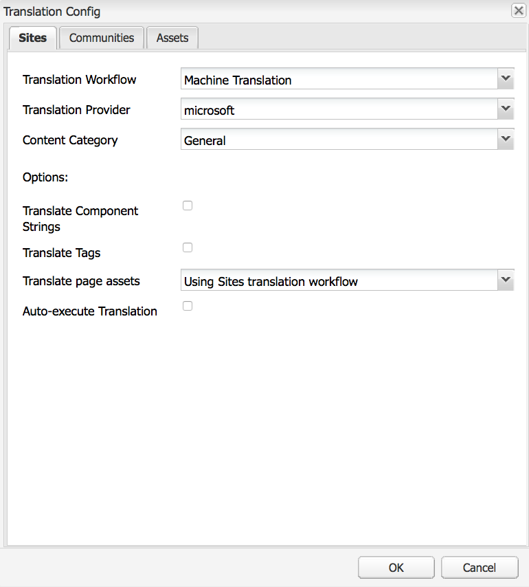

# Configuración del módulo de integración de traducción{#configuring-the-translation-integration-framework}

El módulo de integración de traducción se integra con los servicios de traducción de terceros para organizar la traducción del contenido de AEM.

* Conéctese a su proveedor de servicios de traducción.
* Cree una configuración del módulo de integración de traducción.
* Asocie las configuraciones de nube con sus páginas.

Para obtener una descripción general de las funciones de traducción de contenido en AEM, consulte [Traducción de contenido para sitios](/help/sites-administering/translation.md)multilingües.

## Conexión a un proveedor de servicios de traducción {#connecting-to-a-translation-service-provider}

Cree una configuración de nube que conecte AEM con su proveedor de servicios de traducción. AEM incluye la capacidad de conectarse a Microsoft Translator de forma predeterminada. Para otros proveedores de traducción, descargue el paquete de conector desde Uso compartido de [paquetes](/help/sites-administering/package-manager.md#package-share).
Los siguientes proveedores de traducción proporcionan una implementación de la nueva API para los proyectos de traducción. Vínculos para obtener más información sobre la integración y cómo descargar desde Package Share:

* [Clay Tablet Technologies](https://marketing.adobe.com/resources/content/resources/en/exchange/marketplace/apps/clay-tablet-translation-connector-for-aem.html) (no en PackageShare, póngase en contacto directamente con el proveedor)
* [Lionbridge](https://marketing.adobe.com/resources/content/resources/en/exchange/marketplace/apps/lionbridge-for-adobe-experience-manager.html)
* [Palabras clave](https://marketing.adobe.com/resources/content/resources/en/exchange/marketplace/apps/cloudwords-for-adobe-translations-connector.html)
* [CrossLang NV](https://marketing.adobe.com/resources/content/resources/en/exchange/marketplace/apps/crosslang-xtm-for-adobe-experience-manager.html)
* [Lingotek](https://marketing.adobe.com/resources/content/resources/en/exchange/marketplace/apps/lingotek-for-adobe-experience-manager.html)
* Microsoft (Microsoft Translator está preinstalado en AEM)
* [Smartling](https://marketing.adobe.com/resources/content/resources/en/exchange/marketplace/apps/smartling-connector-for-adobe-experience-manager.html)
* [Translations.com](https://marketing.adobe.com/resources/content/resources/en/exchange/marketplace/apps/globallink-connect-for-adobe-experience-manager.html)
* [SDL WorldServer](https://marketing.adobe.com/resources/content/resources/en/exchange/marketplace/apps/sdlworldserver-connector.html)
* [SDL TMS](https://marketing.adobe.com/resources/content/resources/en/exchange/marketplace/apps/sdl-tms-translation-connector-for-adobe-experience-manager.html)
* [Systran](https://marketing.adobe.com/resources/content/resources/en/exchange/marketplace/apps/systran-for-adobe-experience-manager.html)
* [Altlang](https://marketing.adobe.com/resources/content/resources/en/exchange/marketplace/apps/Altlang.html)

>[!NOTE]
>
>Para encontrar la lista más reciente de proveedores de traducción automática y humana, eche un vistazo a estas páginas:
>
>
>* [Traducción humana de AEM](https://www.adobe.com/go/aem-human-translation-connectors)
>* [AEM Machine Translation](https://www.adobe.com/go/aem-machine-translation-connectors)
>

Después de instalar un paquete de conector, puede crear una configuración de nube para el conector. Normalmente, debe proporcionar sus credenciales para autenticarse con el servicio de traducción. Para obtener información sobre cómo agregar una configuración de nube para el conector de Microsoft Translator, consulte [Integración con Microsoft Translator](/help/sites-administering/tc-msconf.md).

Puede crear varias configuraciones de nube para el mismo conector si es necesario. Por ejemplo, cree una configuración para cada una de las cuentas o proyectos que tenga con el mismo proveedor.

Después de configurar una conexión, puede crear la configuración del marco de integración de traducción que la utiliza.

## Creación de una configuración de integración de traducción {#creating-a-translation-integration-configuration}

Cree una configuración del marco de integración de traducción para especificar cómo traducir el contenido. La configuración incluye la siguiente información:

* Qué proveedor de servicios de traducción utilizar.
* Si se debe realizar la traducción humana o automática.
* Indica si se traducirán otros contenidos asociados a una página o recurso, como las etiquetas.

Después de crear una configuración de marco, asocia la configuración de nube con las páginas que desea traducir según la configuración. Cuando se inicia el proceso de traducción, el flujo de trabajo de traducción continúa según la configuración del marco asociada.

Cuando diferentes secciones del sitio web tengan diferentes requisitos de traducción, cree varias configuraciones de marco según corresponda. Por ejemplo, un sitio web multilingüe incluye copias en inglés, español y japonés. El propietario del sitio utiliza dos proveedores de servicios de traducción diferentes para las traducciones al español y al japonés. Por lo tanto, se configuran dos configuraciones del marco. Cada configuración utiliza un proveedor de servicios de traducción diferente.

Después de configurar un marco de integración de traducción, puede [asociarlo con las páginas](/help/sites-administering/tc-prep.md) que lo utilizan.

**** Nota:Para obtener una descripción general de las funciones de traducción de contenido en AEM, consulte [Traducción de contenido para sitios](/help/sites-administering/translation.md)multilingües.

Una sola configuración del marco controla cómo traducir el contenido de la página, el contenido de la comunidad y los recursos.

### Propiedades de configuración de sitios {#sites-configuration-properties}

Las propiedades Sitios controlan cómo se realiza la traducción del contenido de la página.

<table>
 <tbody>
  <tr>
   <th>Propiedad</th>
   <th>Descripción</th>
  </tr>
  <tr>
   <td>Flujo de trabajo de traducción</td>
   <td>
Seleccione el método de traducción que realiza el marco para el contenido del sitio:

    <ul>
     <li>Traducción automática: El proveedor de traducción realiza la traducción mediante traducción automática en tiempo real.</li>
     <li>Traducción humana: El contenido se envía al proveedor de traducción para que lo traduzcan los traductores. </li>
     <li>No traducir: El contenido no se envía para su traducción. Esto sirve para omitir ciertas ramas de contenido que no se traducirían pero que podrían actualizarse con el contenido más reciente.</li>
    </ul> </td>
  </tr>
  <tr>
   <td>Proveedor de traducciones</td>
   <td>Seleccione el proveedor de traducción para realizar la traducción. Cuando se instala el conector correspondiente, aparece un proveedor en la lista.</td>
  </tr>
  <tr>
   <td>Categoría de contenido</td>
   <td>(Solo traducción automática) Categoría que describe el contenido que está traduciendo. La categoría puede afectar a la elección de terminología y frases al traducir contenido.</td>
  </tr>
  <tr>
   <td>Traducir etiquetas</td>
   <td>Seleccione esta opción para traducir las etiquetas asociadas con la página.</td>
  </tr>
  <tr>
   <td>Traducir recursos de la página</td>
   <td>
Seleccione cómo traducir recursos que se agregan a componentes del sistema de archivos o a los que se hace referencia desde Recursos:

    <ul>
     <li>No traducir: Los recursos de página no se traducen.</li>
     <li>Uso del flujo de trabajo de traducción de sitios: Los recursos se gestionan según las propiedades de configuración de la ficha Sitios.</li>
     <li>Uso del flujo de trabajo de traducción de recursos: Los recursos se gestionan según la configuración de las propiedades de la ficha Recursos.</li>
    </ul> </td>
  </tr>
  <tr>
   <td>Traducción de ejecución automática</td>
   <td>Seleccione ejecutar los trabajos de traducción automáticamente después de crear los proyectos de traducción. No tiene la oportunidad de revisar y definir el ámbito del trabajo de traducción al seleccionar esta opción.</td>
  </tr>
 </tbody>
</table>

### Propiedades de configuración de comunidades {#communities-configuration-properties}

Las propiedades de comunidades controlan cómo se realiza la traducción del contenido generado por el usuario. La traducción del contenido generado por el usuario siempre utiliza la traducción automática. Para obtener más información, consulte [Traducción de contenido](/help/communities/translate-ugc.md)generado por el usuario.

| Propiedad | Descripción |
|---|---|
| Proveedor de traducciones | Seleccione el proveedor de traducción para realizar la traducción. El proveedor para el que se crean las configuraciones de nube aparece en la lista. |
| Categoría de contenido | Categoría que describe el contenido que está traduciendo. La categoría puede afectar a la elección de terminología y frases al traducir contenido. |
| Elija Una Configuración Regional Para Utilizarla Como Tienda Compartida Global | (Opcional) Al seleccionar una configuración regional para almacenar UGC, las publicaciones de todas las copias de idioma aparecerán en una conversación global. Por convención, elija la configuración regional para el idioma  base del sitio web. Si elige Sin tienda común, se deshabilitará la traducción global. De forma predeterminada, la traducción global está deshabilitada. |

### Propiedades de configuración de recursos {#assets-configuration-properties}

Las propiedades de recursos controlan cómo configurar los recursos. Para obtener más información sobre la traducción de recursos, consulte [Creación de copias de idioma para recursos](/help/assets/translation-projects.md).

<table>
 <tbody>
  <tr>
   <th>Propiedad</th>
   <th>Descripción</th>
  </tr>
  <tr>
   <td>Flujo de trabajo de traducción</td>
   <td>
Seleccione el tipo de traducción que realiza la estructura para los recursos:

    <ul>
     <li>Traducción automática: El proveedor de traducción realiza la traducción inmediatamente mediante traducción automática.</li>
     <li>Traducción humana: El contenido se envía automáticamente al proveedor de traducción para su traducción manual. </li>
     <li>No traducir: Los recursos no se envían para su traducción.</li>
    </ul> </td>
  </tr>
  <tr>
   <td>Proveedor de traducciones</td>
   <td>Seleccione el proveedor de traducción para realizar la traducción. Cuando se instala el conector correspondiente, aparece un proveedor en la lista.</td>
  </tr>
  <tr>
   <td>Categoría de contenido</td>
   <td>(Solo traducción automática) Categoría que describe el contenido que está traduciendo. La categoría puede afectar a la elección de terminología y frases al traducir contenido.</td>
  </tr>
  <tr>
   <td>Traducir recursos</td>
   <td>Seleccione esta opción para incluir recursos en el proyecto de traducción. </td>
  </tr>
  <tr>
   <td>Traducir metadatos</td>
   <td>Seleccione esta opción para traducir metadatos de recursos.</td>
  </tr>
  <tr>
   <td>Traducir etiquetas</td>
   <td>Seleccione esta opción para traducir las etiquetas asociadas al recurso.</td>
  </tr>
  <tr>
   <td>Traducción de ejecución automática</td>
   <td>Seleccione ejecutar los trabajos de traducción automáticamente después de crear los proyectos de traducción. No tiene la oportunidad de revisar o definir el ámbito del trabajo de traducción cuando selecciona esta opción.</td>
  </tr>
 </tbody>
</table>

1. En la barra lateral, toque o haga clic en Herramientas > Operaciones > Nube > Servicios de nube.
1. En el área Integración de traducción, si se ha creado alguna configuración determina qué vínculo aparece:

   * Si no se ha creado ninguna configuración, toque o haga clic en Configurar ahora.
   * Si ya existen configuraciones, toque o haga clic en Mostrar configuraciones y, a continuación, toque o haga clic en el vínculo + que aparece junto a Configuraciones disponibles.

1. Escriba un nombre para la configuración y toque o haga clic en Crear.
1. Configure las propiedades en la ficha Sitios, comunidades y recursos y, a continuación, toque o haga clic en Aceptar.

## Configuración de páginas para traducción {#configuring-pages-for-translation}

Para configurar la traducción de las páginas de origen a otros idiomas, asocie las páginas con las siguientes configuraciones de nube:

* La configuración de nube que conecta AEM con su proveedor de traducción.
* Marco de integración de traducción que configura los detalles de la traducción.

Tenga en cuenta que la configuración de nube del marco de integración de traducción identifica la configuración de nube que se utilizará para la conexión con el proveedor de servicios. Cuando asocia una página de origen con una configuración de nube de marco de trabajo, la página debe asociarse con la configuración de nube del proveedor de servicios que utiliza la configuración de nube de marco de trabajo.

Al asociar una página con una configuración de nube, los descendientes de la página heredan la asociación. Por ejemplo, si asocia la página /content/geometrixx/en/products con un módulo de integración de traducción, la página Productos y todas las páginas que se encuentran debajo se traducen de acuerdo con el marco de trabajo.

Si es necesario, puede anular la asociación en una página de descendientes. Por ejemplo: el contenido de un sitio Web se trata principalmente de ropa. Sin embargo, una rama de páginas describe la empresa. La página raíz del sitio está asociada con un módulo de integración de traducción que especifica la traducción automática mediante la categoría Ropa. La rama que describe a la empresa utiliza un marco que realiza la traducción automática mediante la categoría General.

Además, para cualquier comunidad de componentes  SCF en las páginas, el contenido generado por el usuario (UGC) incluirá la capacidad de los usuarios para traducir contenido. Para obtener más información, consulte [Traducción de contenido](/help/communities/translate-ugc.md)generado por el usuario.

### Asociación de una página con un proveedor de traducción {#associating-a-page-with-a-translation-provider}

Asocie una página con el proveedor de traducción que está utilizando para traducir la página y las páginas descendientes.

1. En la consola Sitios, seleccione la página que desee configurar y toque o haga clic en Ver propiedades.
1. Toque o haga clic en Editar y, a continuación, en la ficha Servicios de nube o puntee en ella.
1. Toque o haga clic en Agregar configuración > Integración de traducción.
1. Seleccione el proveedor de traducción que desea utilizar y, a continuación, toque o haga clic en Finalizado.

### Asociación de páginas con un marco de integración de traducción {#associating-pages-with-a-translation-integration-framework}

Asocie una página con el módulo de integración de traducción que define cómo desea realizar la traducción de la página y de las páginas descendientes.

1. En la consola Sitios, seleccione la página que desee configurar y toque o haga clic en Ver propiedades.
1. Toque o haga clic en Editar y, a continuación, en la ficha Servicios de nube o puntee en ella.
1. Toque o haga clic en Agregar configuración > Integración de traducción.
1. Seleccione el marco de integración de traducción que desea utilizar y, a continuación, toque o haga clic en Finalizado.

