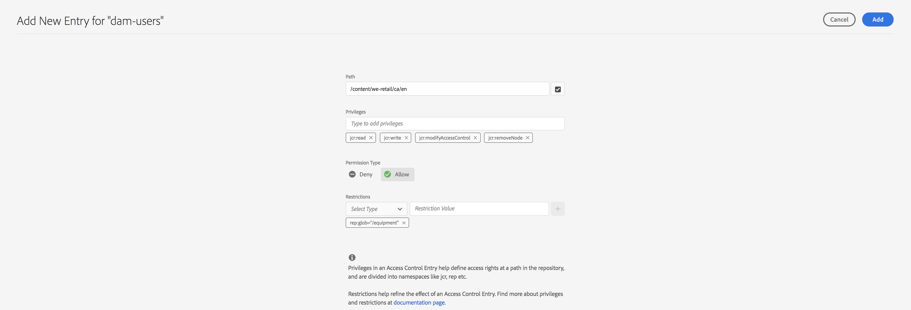

# Vista principal para la administración de permisos{#principal-view-for-permissions-management}

## Información general {#overview}

AEM 6.5 presenta la administración de permisos para usuarios y grupos. La funcionalidad principal sigue siendo la misma que la IU clásica, pero es más fácil de usar y eficaz.

## Usos {#how-to-use}

### Acceso a la interfaz de usuario {#accessing-the-ui}

Se accede a la nueva administración de permisos basada en la interfaz de usuario a través de la tarjeta Permisos en Seguridad, como se muestra a continuación:

La nueva vista facilita la visualización de todo el conjunto de privilegios y restricciones para una entidad de seguridad determinada en todas las rutas en las que se han concedido permisos explícitamente. Esto elimina la necesidad de ir a

CRXDE para administrar privilegios y restricciones avanzados. Se ha consolidado en la misma opinión. El valor predeterminado de la vista es &quot;todos&quot; en el grupo.

Existe un filtro que permite al usuario seleccionar el tipo de entidades principales para ver **Usuarios**, **Grupos** o **Todos** y buscar cualquier entidad de seguridad **.**

### Visualización de permisos para una entidad de seguridad {#viewing-permissions-for-a-principal}

El marco de la izquierda permite a los usuarios desplazarse hacia abajo para encontrar cualquier principal o buscar un grupo o un usuario según el filtro seleccionado, como se muestra a continuación:

Al hacer clic en el nombre se muestran los permisos asignados a la derecha. El panel Permisos muestra la lista de Entradas de control de acceso en rutas específicas junto con las restricciones configuradas.

### Adición de una nueva entrada de control de acceso para una entidad de seguridad {#adding-new-access-control-entry-for-a-principal}

Para agregar nuevos permisos, agregue una nueva entrada de control de acceso haciendo clic en el botón Agregar ACE.

Esto abre la ventana que se muestra a continuación. El siguiente paso es elegir una ruta en la que se debe configurar el permiso.

Aquí seleccionamos una ruta en la que queremos configurar un permiso para **los usuarios** de presas:

Una vez seleccionada la ruta, el flujo de trabajo regresa a esta pantalla, donde el usuario puede seleccionar uno o varios de los privilegios de los espacios de nombres disponibles (como `jcr`, `rep` o `crx`) como se muestra a continuación.

Los privilegios se pueden agregar buscando utilizando el campo de texto y seleccionando una opción de la lista.

>[!NOTE]
>
>Para obtener una lista completa de privilegios y descripciones, consulte [esta página](/help/sites-administering/user-group-ac-admin.md#access-right-management).

 

Una vez seleccionada la lista de privilegios, el usuario puede elegir el tipo de permiso : Denegar o Permitir, como se muestra a continuación.

 

### Uso de restricciones {#using-restrictions}

Además de la lista de privilegios y el tipo de permiso en una ruta determinada, esta pantalla también permite agregar restricciones para un control de acceso preciso, como se muestra a continuación:

>[!NOTE]
>
>Para obtener más información sobre el significado de cada restricción, consulte [esta página](/help/sites-administering/user-group-ac-admin.md#restrictions).

Las restricciones se pueden agregar como se muestra a continuación seleccionando el tipo de restricción, introduciendo el valor y pulsando el icono **+** .  

El nuevo ACE se refleja en la lista de control de acceso, como se muestra a continuación. Tenga en cuenta que `jcr:write` es un privilegio agregado que incluye `jcr:removeNode` que se agregó arriba, pero que no se muestra debajo como cubierto en `jcr:write`.

### Edición de ACE {#editing-aces}

Las entradas de control de acceso se pueden editar seleccionando una entidad de seguridad y eligiendo la ACE que desee editar.

Por ejemplo, aquí podemos editar la entrada siguiente para usuarios **de** presas haciendo clic en el icono de lápiz de la derecha:

La pantalla de edición se muestra con las ACE configuradas preseleccionadas, se pueden eliminar haciendo clic en el icono de cruz que hay junto a ellas o se pueden agregar nuevos privilegios para la ruta dada, como se muestra a continuación.

Aquí estamos agregando el `addChildNodes` privilegio para los usuarios **de** presas en el camino dado.

Los cambios se pueden guardar haciendo clic en el botón **Guardar** en la parte superior derecha, y los cambios se reflejarán en los nuevos permisos para **usuarios de represa **como se muestra a continuación:

### Eliminación de ACE {#deleting-aces}

Las entradas de control de acceso se pueden eliminar para eliminar todos los permisos otorgados a una entidad de seguridad en una ruta específica. El icono X situado junto a ACE se puede utilizar para eliminarlo como se muestra a continuación:

 

### Combinaciones de privilegios de la IU clásica {#classic-ui-privilege-combinations}

Tenga en cuenta que la nueva interfaz de usuario de permisos utiliza explícitamente el conjunto básico de privilegios en lugar de combinaciones predefinidas que no reflejan realmente los privilegios subyacentes exactos que se concedieron.

Causó confusión sobre qué es exactamente lo que se está configurando. En la tabla siguiente se muestra la asignación entre las combinaciones de privilegios de la IU clásica y los privilegios reales que las constituyen:

<table>
 <tbody>
  <tr>
   <th>Combinaciones de privilegios de la IU clásica</th>
   <th>Privilegio de la interfaz de usuario de permisos</th>
  </tr>
  <tr>
   <td>Lectura</td>
   <td><code>jcr:read</code></td>
  </tr>
  <tr>
   <td>Modificar</td>
   <td>
<code>jcr:modifyProperties</code>
 
<code>jcr:lockManagement</code>
 
<code>jcr:versionManagement</code>
 </td>
  </tr>
  <tr>
   <td>Crear</td>
   <td>
<code>jcr:addChildNodes</code>
 
<code>jcr:nodeTypeManagement</code>
 </td>
  </tr>
  <tr>
   <td>Eliminar</td>
   <td>
<code>jcr:removeNode</code>
 
<code>jcr:removeChildNodes</code>
 </td>
  </tr>
  <tr>
   <td>Leer ACL</td>
   <td><code>jcr:readAccessControl</code></td>
  </tr>
  <tr>
   <td>Editar ACL</td>
   <td><code>jcr:modifyAccessControl</code></td>
  </tr>
  <tr>
   <td>Replicar</td>
   <td><code>crx:replicate</code></td>
  </tr>
 </tbody>
</table>

