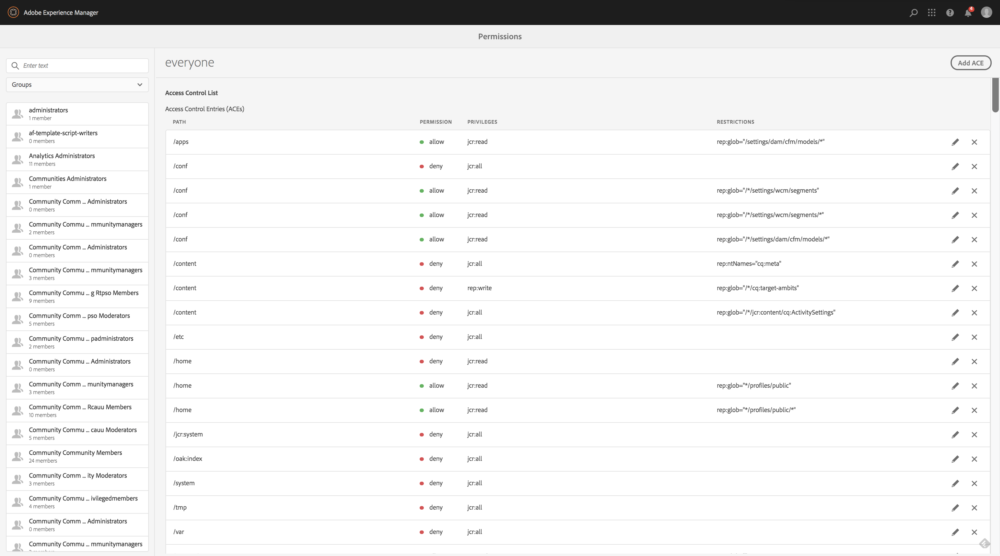
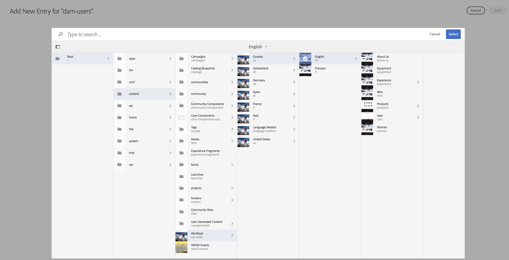
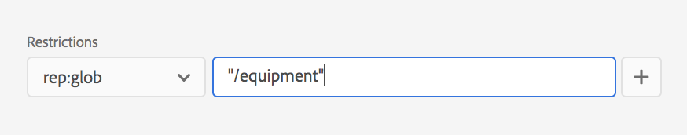
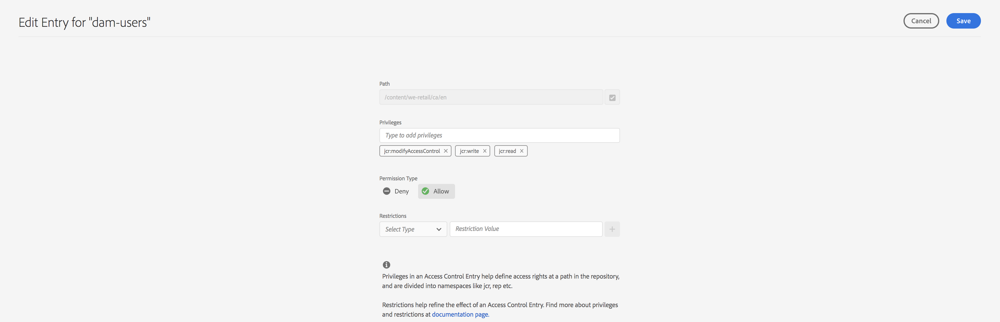
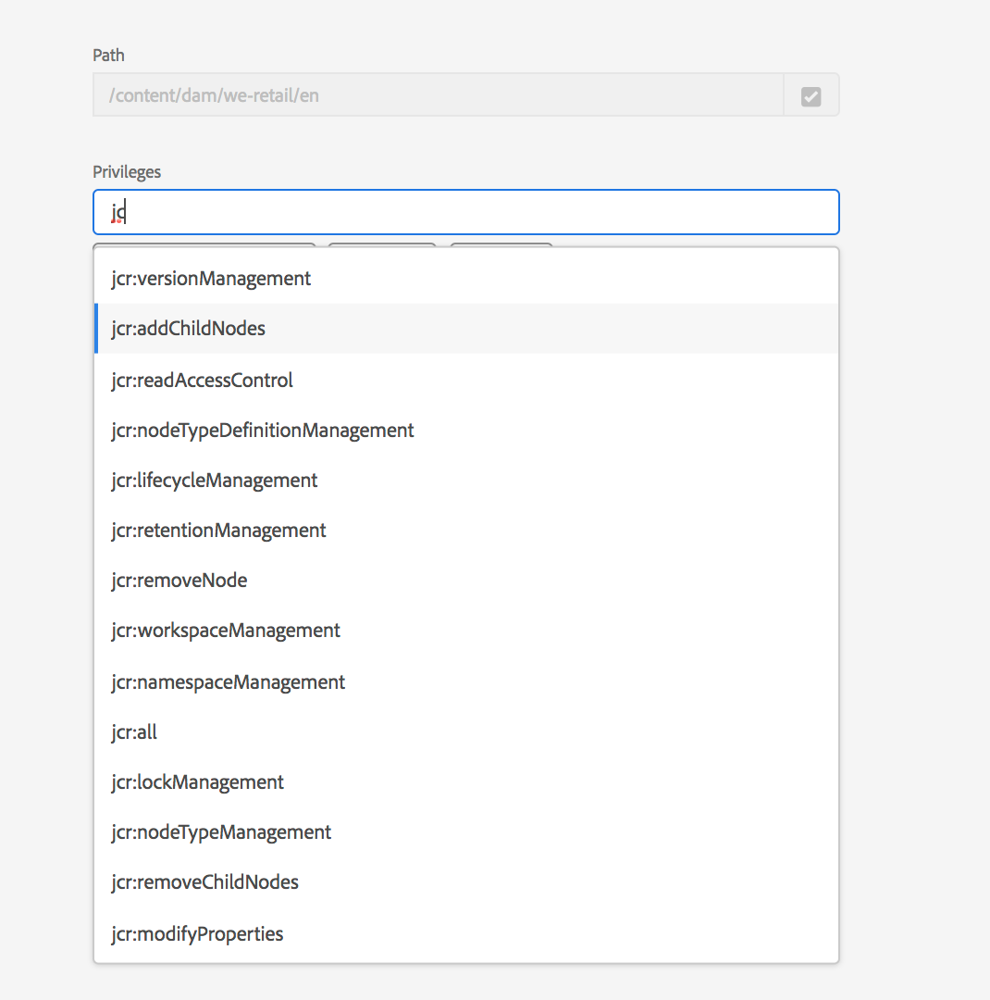
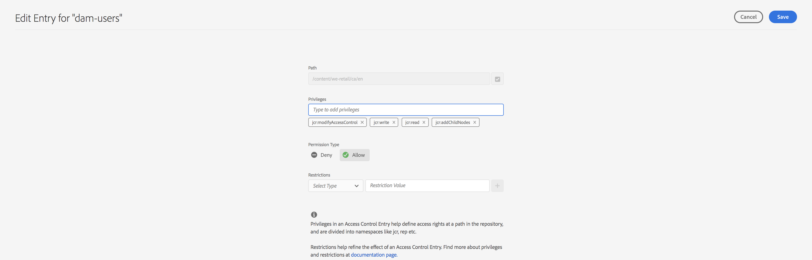
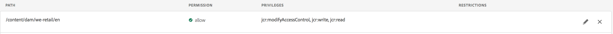

# Vista principal para la administración de permisos{#principal-view-for-permissions-management}

## Información general {#overview}

AEM 6.5 presenta la Administración de permisos para usuarios y grupos. La funcionalidad principal sigue siendo la misma que la de la interfaz de usuario clásica, pero es más fácil de usar y eficaz.

## Usos {#how-to-use}

### Acceso a la interfaz de usuario {#accessing-the-ui}

Se accede a la nueva administración de permisos basada en la interfaz de usuario a través de la tarjeta Permisos, en Seguridad, como se muestra a continuación:

La nueva vista facilita la visualización de todo el conjunto de privilegios y restricciones para un principal determinado en todas las rutas en las que se han concedido permisos explícitamente. Esto elimina la necesidad de ir a

CRXDE para administrar privilegios y restricciones avanzados. Se ha consolidado en la misma vista. La vista predeterminada es Grupo &quot;todos&quot;.

Hay un filtro que permite al usuario seleccionar el tipo de principales para ver **Usuarios**, **Grupos** o **Todos** y buscar cualquier principal **.**

### Visualización de permisos para un principal {#viewing-permissions-for-a-principal}

El marco de la izquierda permite a los usuarios desplazarse hacia abajo para encontrar cualquier principal o buscar un grupo o un usuario en función del filtro seleccionado, como se muestra a continuación:

Al hacer clic en el nombre, se muestran los permisos asignados a la derecha. El panel de permisos muestra la lista de entradas de control de acceso en rutas específicas junto con las restricciones configuradas.

### Añadir una nueva entrada de control de acceso para un principal {#adding-new-access-control-entry-for-a-principal}

Se pueden añadir nuevos permisos añadiendo una entrada de control de acceso. Basta con hacer clic en el botón Añadir ACE.

Esto abre la ventana que se muestra a continuación. El siguiente paso es elegir una ruta en la que se debe configurar el permiso.

Aquí se selecciona una ruta donde puede configurar un permiso para **dam-users**:

Una vez seleccionada la ruta, el flujo de trabajo vuelve a esta pantalla, donde el usuario puede seleccionar uno o varios de los privilegios de los espacios de nombres disponibles (como `jcr`, `rep` o `crx`), como se muestra a continuación.

Los privilegios pueden añadirse buscándolos mediante el campo de texto y seleccionándolos después en la lista.

>[!NOTE]
>
>Para obtener una lista completa de privilegios y descripciones, consulte [Administración de usuarios, grupos y derechos de acceso](/help/sites-administering/user-group-ac-admin.md#access-right-management).

 

Una vez seleccionada la lista de privilegios, el usuario puede elegir el Tipo de permiso: Denegar o Permitir, como se muestra a continuación.

 

### Uso de restricciones {#using-restrictions}

Además de la lista de privilegios y el Tipo de permiso en una ruta determinada, esta pantalla también le permite agregar restricciones para un control de acceso preciso, como se muestra a continuación:

>[!NOTE]
>
>Para obtener más información sobre el significado de cada restricción, consulte [la documentación de Jackrabbit Oak](https://jackrabbit.apache.org/oak/docs/security/authorization/restriction.html?lang=es).

Las restricciones se pueden añadir como se muestra a continuación eligiendo el tipo de restricción, introduciendo el valor y pulsando el icono **+**.

 

La nueva ACE se refleja en la Lista de control de acceso como se muestra a continuación. Tenga en cuenta que `jcr:write` es un privilegio agregado que incluye `jcr:removeNode` que se agregó anteriormente, pero no se muestra a continuación, ya que está cubierto en `jcr:write`.

### Edición de ACE {#editing-aces}

Las entradas de control de acceso se pueden editar seleccionando un principal y eligiendo la entrada que desea editar.

Por ejemplo, aquí puede editar la siguiente entrada para **dam-users** haciendo clic en el icono de lápiz de la derecha:

La pantalla de edición se muestra con las ACE configuradas preseleccionadas, que se pueden eliminar haciendo clic en el icono en forma de cruz junto a ellas, o se pueden añadir nuevos privilegios para la ruta dada, como se muestra a continuación.

Aquí se añade el privilegio `addChildNodes` para **dam-users** en la ruta dada.

Los cambios se pueden guardar haciendo clic en el botón **Guardar** en la parte superior derecha y se reflejan en los nuevos permisos para **dam-users**, como se muestra a continuación:

### Eliminación de ACE {#deleting-aces}

Las entradas de control de acceso se pueden eliminar para quitar todos los permisos otorgados a un principal en una ruta específica. El icono X situado junto a la ACE puede utilizarse para eliminarla, como se muestra a continuación:

 

### Combinaciones de privilegios de IU clásica {#classic-ui-privilege-combinations}

La nueva IU de permisos utiliza explícitamente el conjunto básico de privilegios en lugar de combinaciones predefinidas que no reflejan realmente los privilegios subyacentes exactos que se concedieron.

Causaba confusión respecto a qué se estaba configurando exactamente. En la tabla siguiente se muestra la asignación entre las combinaciones de privilegios de la IU clásica a los privilegios reales que las constituyen:

<table>
 <tbody>
  <tr>
   <th>Combinaciones de privilegios de IU clásica</th>
   <th>Privilegio de IU de permisos</th>
  </tr>
  <tr>
   <td>Lectura</td>
   <td><code>jcr:read</code></td>
  </tr>
  <tr>
   <td>Modificar</td>
   <td>
<code>jcr:modifyProperties</code>
 
<code>jcr:lockManagement</code>
 
<code>jcr:versionManagement</code>
 </td>
  </tr>
  <tr>
   <td>Crear</td>
   <td>
<code>jcr:addChildNodes</code>
 
<code>jcr:nodeTypeManagement</code>
 </td>
  </tr>
  <tr>
   <td>Eliminar</td>
   <td>
<code>jcr:removeNode</code>
 
<code>jcr:removeChildNodes</code>
 </td>
  </tr>
  <tr>
   <td>Leer ACL</td>
   <td><code>jcr:readAccessControl</code></td>
  </tr>
  <tr>
   <td>Editar ACL</td>
   <td><code>jcr:modifyAccessControl</code></td>
  </tr>
  <tr>
   <td>Replicar</td>
   <td><code>crx:replicate</code></td>
  </tr>
 </tbody>
</table>
