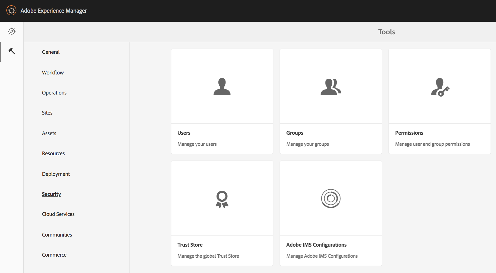

# Vista principal para la administración de permisos{#principal-view-for-permissions-management}

## Información general {#overview}

AEM 6.5 presenta la Administración de permisos para usuarios y grupos. La funcionalidad principal sigue siendo la misma que la IU clásica, pero es más fácil de usar y eficaz.

## Usos {#how-to-use}

### Acceso a la IU {#accessing-the-ui}

Se accede a la nueva administración de permisos basada en la interfaz de usuario a través de la tarjeta Permisos en Seguridad como se muestra a continuación:

La nueva vista facilita la visualización de todo el conjunto de privilegios y restricciones para una entidad de seguridad determinada en todas las rutas en las que los permisos se han concedido explícitamente. Esto elimina la necesidad de ir a

CRXDE para administrar privilegios y restricciones avanzados. Se ha consolidado en la misma vista. El valor predeterminado de la vista es &quot;todos&quot;.

Hay un filtro que permite al usuario seleccionar el tipo de entidades principales para ver **Usuarios**, **Grupos** o **Todo** y buscar cualquier principal **.**

### Visualización de permisos para un director {#viewing-permissions-for-a-principal}

El marco de la izquierda permite a los usuarios desplazarse hacia abajo para encontrar cualquier entidad de seguridad o buscar un grupo o un usuario en función del filtro seleccionado, como se muestra a continuación:

Al hacer clic en el nombre se muestran los permisos asignados a la derecha. El panel de permisos muestra la lista de entradas de control de acceso en rutas específicas junto con las restricciones configuradas.

### Adición de una nueva entrada de control de acceso para un principal {#adding-new-access-control-entry-for-a-principal}

Se pueden agregar nuevos permisos agregando una nueva Entrada de control de acceso haciendo clic en el botón Añadir ACE .

Esto abre la ventana que se muestra a continuación; el siguiente paso es elegir una ruta en la que se debe configurar el permiso.

Aquí seleccionamos una ruta en la que queremos configurar un permiso para **dam-users**:

Una vez seleccionada la ruta, el flujo de trabajo vuelve a esta pantalla, en la que el usuario puede seleccionar uno o más de los privilegios de las áreas de nombres disponibles (como `jcr`, `rep` o `crx`) como se muestra a continuación.

Los privilegios se pueden agregar buscando utilizando el campo de texto y luego seleccionando en la lista.

>[!NOTE]
>
>Para obtener una lista completa de privilegios y descripciones, consulte [esta página](/help/sites-administering/user-group-ac-admin.md#access-right-management).

 

Una vez seleccionada la lista de privilegios, el usuario puede elegir el Tipo de permiso : Denegar o Permitir, como se muestra a continuación.

 

### Uso de restricciones {#using-restrictions}

Además de la lista de privilegios y el tipo de permiso en una ruta determinada, esta pantalla también permite añadir restricciones para el control de acceso de grano fino como se muestra a continuación:

>[!NOTE]
>
>Para obtener más información sobre qué significa cada restricción, consulte [la documentación de Jackrabbit Oak](http://jackrabbit.apache.org/oak/docs/security/authorization/restriction.html).

Las restricciones se pueden agregar como se muestra a continuación; para ello, elija el tipo de restricción, introduzca el valor y pulse la variable **+** icono.

 

El nuevo ACE se refleja en la lista de control de acceso como se muestra a continuación. Tenga en cuenta que `jcr:write` es un privilegio agregado que incluye `jcr:removeNode` que se agregó anteriormente, pero que no se muestra a continuación como cubierto en `jcr:write`.

### Edición de ACE {#editing-aces}

Las Entradas de control de acceso se pueden editar seleccionando una entidad de seguridad y eligiendo el ACE que desee editar.

Por ejemplo, aquí podemos editar la siguiente entrada para **dam-users** haciendo clic en el icono de lápiz de la derecha:

La pantalla de edición se muestra con los ACE configurados preseleccionados, estos se pueden eliminar haciendo clic en el icono cruzado junto a ellos o se pueden añadir nuevos privilegios para la ruta dada, como se muestra a continuación.

A continuación, agregamos la variable `addChildNodes` privilegio para **dam-users** en la ruta dada.

Los cambios se pueden guardar haciendo clic en el botón **Guardar** en la parte superior derecha, y los cambios se reflejarán en los nuevos permisos para **dam-users **como se muestra a continuación:

### Eliminación de ACE {#deleting-aces}

Las Entradas de control de acceso se pueden eliminar para eliminar todos los permisos otorgados a una entidad de seguridad en una ruta específica. El icono X situado junto a ACE se puede usar para eliminarlo como se muestra a continuación:

 

### Combinaciones de privilegios de la IU clásica {#classic-ui-privilege-combinations}

Tenga en cuenta que la nueva interfaz de usuario de permisos utiliza explícitamente el conjunto básico de privilegios en lugar de combinaciones predefinidas que no reflejaban realmente los privilegios subyacentes exactos que se concedieron.

Provocó confusión sobre qué se está configurando exactamente. La tabla siguiente muestra la asignación entre las combinaciones de privilegios de la IU clásica y los privilegios reales que las constituyen:

<table>
 <tbody>
  <tr>
   <th>Combinaciones de privilegios de la IU clásica</th>
   <th>Privilegio de IU de permisos</th>
  </tr>
  <tr>
   <td>Lectura</td>
   <td><code>jcr:read</code></td>
  </tr>
  <tr>
   <td>Modificar</td>
   <td>
<code>jcr:modifyProperties</code>
 
<code>jcr:lockManagement</code>
 
<code>jcr:versionManagement</code>
 </td>
  </tr>
  <tr>
   <td>Crear</td>
   <td>
<code>jcr:addChildNodes</code>
 
<code>jcr:nodeTypeManagement</code>
 </td>
  </tr>
  <tr>
   <td>Eliminar</td>
   <td>
<code>jcr:removeNode</code>
 
<code>jcr:removeChildNodes</code>
 </td>
  </tr>
  <tr>
   <td>Leer ACL</td>
   <td><code>jcr:readAccessControl</code></td>
  </tr>
  <tr>
   <td>Editar ACL</td>
   <td><code>jcr:modifyAccessControl</code></td>
  </tr>
  <tr>
   <td>Replicar</td>
   <td><code>crx:replicate</code></td>
  </tr>
 </tbody>
</table>
