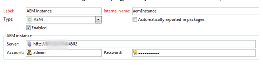

# Resolución de problemas de la integración de Adobe Campaign{#troubleshooting-your-adobe-campaign-integration}

>[!NOTE]
>
>Esta página se aplica al Campaign Classic .

Las siguientes sugerencias para la solución de problemas ayudan a resolver los problemas más comunes que puede encontrar al integrar AEM con Adobe Campaign:

## Sugerencias generales para la resolución de problemas {#general-troubleshooting-tips}

Para ambas integraciones, puede comprobar si se envían llamadas HTTP (AEM > Adobe Campaign, Adobe Campaign > AEM):

* Cuando las integraciones fallen, asegúrese de que estas llamadas llegan al otro extremo (para evitar problemas de firewall/SSL).
* Para AEM funcionalidad, verá que las llamadas json se solicitan desde la interfaz de creación de AEM; estos no deben generar un error HTTP-500. Si ve errores HTTP-500, consulte la `error.log` para obtener más información sobre esto.
* El aumento del nivel de depuración de las clases de campaña en AEM también ayuda a solucionar problemas.

## Si la conexión falla {#if-the-connection-fails}

Compruebe que ha configurado la variable **aemserver** en Adobe Campaign.

## Si las imágenes no aparecen en la consola de Adobe Campaign {#if-images-do-not-appear-in-the-adobe-campaign-console}

Compruebe el origen del HTML y valide que puede abrir la URL desde el equipo cliente. Si la URL tiene localhost:4503 en ella, cambie la configuración del Day CQ Link Externalizer en la instancia de autor para que apunte a una instancia de publicación a la que se pueda acceder desde el equipo de la consola de Adobe Campaign.

Consulte [Configuración del externalizador.](/help/sites-administering/campaignstandard.md#configuring-the-externalizer)

## Si no puede conectarse de AEM a Adobe Campaign {#if-you-cannot-connect-from-aem-to-adobe-campaign}

Busque el siguiente mensaje de error en Adobe Campaign:

`No datasource defined in the instance 'default'.`

`Make sure the DNS alias used to access the server is correct (for example, avoid hard-coded IP addresses). (iRc=16384)`

Para solucionar este problema, cambie lo siguiente en **$CAMPAIGN_HOME/conf/config-&lt;instance-name>.xml**:

`<dataStore hosts="*" lang="en_GB">`

## Si no se muestran datos en el cuadro de diálogo de Adobe Campaign {#if-no-data-displays-in-the-adobe-campaign-dialog}

En Adobe Campaign, asegúrese de que no hay ninguna barra diagonal (/) después del número de puerto.



## Si recibe una advertencia sobre la configuración regional {#if-you-get-a-warning-about-your-setlocale}

Si está iniciando el servicio HTTP de Apache y ve el error `"Warning: setlocale: LC_CTYPE cannot change locale"` asegúrese de tener su **configuración regional en_CA.ISO-8859-15** instalado en el sistema.

Puede comprobar si está instalado utilizando `local -a`. Si no está instalado, puede parches **/usr/local/neolane/nl6/env.sh** y cambie la configuración regional a una instalada.

## Si se produce un error al compilar el script &#39;get_nms_amcGetSeedMetaData_jssp&#39; {#if-you-get-an-error-while-compiling-script-get-nms-amcgetseedmetadata-jssp}

Si ve el siguiente mensaje de error en el archivo de registro de AEM:

`com.day.cq.mcm.campaign.impl.CampaignConnectorImpl Internal Adobe Campaign error: response body is Error while compiling script 'get_nms_amcGetSeedMetaData_jssp' line 45: String.prototype.toJSON called on incompatible XML.`

Utilice la siguiente solución:

1. Abrir archivo **$CAMPAIGN_HOME/datakit/nms/fra/js/amcIntegration.js**
1. Modificar la línea 467 del método &quot;amcGetSeedMetaData&quot;
1. Cambiar `label : [inclView.@label](mailto:inclView.@label)` a `label : String([inclView.@label](mailto:inclView.@label))`

1. Guardar.
1. Vuelva a iniciar el servidor.

## Si Adobe Campaign muestra un error al hacer clic en el botón Sincronizar {#if-adobe-campaign-displays-an-error-when-clicking-the-synchronize-button}

Si al hacer clic en el botón **Sincronizar** en Adobe Campaign Classic, verá el siguiente error:

`Error while executing the method ‘aemListContent' of service [nms:delivery](https://nmsdelivery/)`

Para solucionar este problema, asegúrese de que la AEM connection-url configurada en Cuentas externas está disponible desde el equipo.

Un interruptor de **localhost** a una dirección IP solucionó este problema.

## Si aparece el error &quot;No se puede analizar la fecha y la hora XTK &quot;sin definir&quot; {#if-you-get-a-cannot-parse-xtk-date-time-undefined-error}

Después de hacer clic en Sincronizar, aparece un error que ha producido una secuencia de comandos en las páginas: No se puede analizar la fecha y la hora XTK &#39;sin definir&#39;: no es un valor XTK válido.

Esto sucede si todavía hay información obsoleta de Adobe Campaign en la instancia de AEM. Resuelva este problema eliminando todas las configuraciones de integración de campañas que están en AEM y reconstruyéndolas. A continuación, cree una nueva plantilla.

## Si una conexión a SSL muestra un error al configurar el servicio en la nube {#if-a-connection-to-ssl-displays-an-error-when-setting-up-the-cloud-service}

En el archivo error.log de AEM, si ve lo siguiente:

```xml
javax.net.ssl.SSLProtocolException: handshake alert:  unrecognized_name
at sun.security.ssl.ClientHandshaker.handshakeAlert(Unknown Source)
at sun.security.ssl.SSLSocketImpl.recvAlert(Unknown Source)
at sun.security.ssl.SSLSocketImpl.readRecord(Unknown Source)
at sun.security.ssl.SSLSocketImpl.performInitialHandshake(Unknown Source)
at sun.security.ssl.SSLSocketImpl.writeRecord(Unknown Source)
at sun.security.ssl.AppOutputStream.write(Unknown Source)
```

Envíe un ticket al equipo de asistencia de Adobe Campaign.

## Si ve http en lugar de los vínculos https esperados en el cuadro de diálogo de sincronización {#if-you-see-http-instead-of-an-expected-https-links-in-the-synchronization-dialog}

Con la siguiente configuración:

* Alojado en Adobe Campaign mediante https para la comunicación con AEM Author
* El proxy inverso termina SSL
* Instancia de AEM Author local

Cuando se intenta sincronizar contenido en Adobe Campaign delivery, AEM devuelve una lista de newsletters. Sin embargo, las direcciones URL de los boletines de la lista son direcciones http. Al seleccionar uno de los elementos de la lista, se produce un error.

Para resolver este problema:

* El Dispatcher o el proxy inverso deben configurarse para pasar el protocolo original como un encabezado.
* La variable *Filtro SSL del servicio HTTP Apache Felix* en la configuración OSGi ([https://&lt;host>:&lt;port>/system/console/configMgr](http://localhost:4502/system/console/configMgr)) debe configurarse con la configuración de encabezado correspondiente. Consulte [https://felix.apache.org/documentation/subprojects/apache-felix-http-service.html#using-the-ssl-filter](https://felix.apache.org/documentation/subprojects/apache-felix-http-service.html#using-the-ssl-filter)

## Si la plantilla personalizada que he creado no se puede seleccionar en Propiedades de página {#if-the-custom-template-i-created-cannot-be-selected-in-page-properties}

Al crear una plantilla de correo para Adobe Campaign, debe incluir la propiedad **acMapping** con el valor **mapRecipient** en el **jcr:content** de la plantilla, o no podrá seleccionar la plantilla Adobe Campaign en **Propiedades de página** de AEM (el campo está deshabilitado).

## Si aparece el error &quot;com.day.cq.mcm.campaign.servlets.util.ParameterMapper&quot; en los registros {#if-you-get-the-error-com-day-cq-mcm-campaign-servlets-util-parametermapper-in-your-logs}

Al utilizar la plantilla personalizada, aparece el error &quot;com.day.cq.mcm.campaign.servlets.util.ParameterMapper&quot; en los registros. En este caso, asegúrese de instalar Featurepack 6576 desde [Uso compartido de paquetes](/help/sites-administering/package-manager.md#package-share). Se trata de un problema en el que, si la propiedad acMapping se establece en un valor distinto de recipient.firstName, se crea un valor en blanco en el Administrador de Adobe Campaign.
