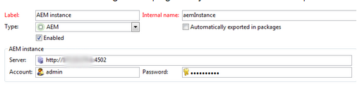

# Solución de problemas de integración de Adobe Campaign Classic{#troubleshooting-your-adobe-campaign-classic-integration}

Obtenga información sobre cómo solucionar problemas con la integración de Adobe Campaign Classic (ACC).

Las siguientes sugerencias para la resolución de problemas le ayudarán a solucionar los problemas más comunes que pueda encontrar al integrar AEM con ACC.

## Sugerencias generales de resolución de problemas {#general-troubleshooting-tips}

Compruebe si ambas soluciones envían y reciben llamadas HTTP (AEM > Adobe Campaign Classic, Adobe Campaign Classic > AEM). Esta sugerencia le ayuda a evitar problemas de firewall/SSL.

* Para la funcionalidad de AEM, puede ver que las llamadas JSON se solicitan desde la interfaz de autor de AEM
   * Estas llamadas no deberían provocar el error HTTP-500.
   * Si ve errores HTTP-500, compruebe `error.log` para obtener más información.
* Elevar el nivel de depuración de las clases de campaña en AEM también puede ayudar a solucionar problemas.

## Si la conexión falla {#when-the-connection-fails}

Compruebe que ha configurado el operador **`aemserver`** en Adobe Campaign Classic.

## Si las imágenes no aparecen en la consola de Adobe Campaign Classic {#if-images-do-not-appear-in-the-adobe-campaign-console}

Compruebe el origen de HTML y compruebe que puede abrir la dirección URL desde el equipo cliente. Si la dirección URL contiene `localhost:4503`, cambie la configuración de Day CQ Link Externalizer en la instancia de autor de AEM. Haga que apunte a una instancia de publicación a la que se pueda acceder desde el equipo de consola de Adobe Campaign Classic.

Consulte [Configuración del externalizador.](/help/sites-administering/campaignstandard.md#configuring-the-externalizer)

## Si no puede conectarse desde AEM a Adobe Campaign Classic  {#if-you-cannot-connect-from-aem-to-adobe-campaign}

Busque el siguiente mensaje de error en Adobe Campaign Classic.

* `No datasource defined in the instance 'default'.`

* `Make sure the DNS alias used to access the server is correct (for example, avoid hard-coded IP addresses). (iRc=16384)`

Para solucionar este problema, cambie lo siguiente en `$CAMPAIGN_HOME/conf/config-<instance-name>.xml`:

* `<dataStore hosts="*" lang="en_GB">`

## Si no se muestran datos en el cuadro de diálogo Adobe Campaign Classic {#if-no-data-displays-in-the-adobe-campaign-dialog}

En Adobe Campaign Classic, asegúrese de que no tiene una barra diagonal (`/`) después del número de puerto.



## Si recibe una advertencia sobre setlocale {#if-you-get-a-warning-about-your-setlocale}

Al iniciar el servicio Apache HTTPD para Adobe Campaign Classic, puede ver el error `Warning: setlocale: LC_CTYPE cannot change locale`

Asegúrese de que tiene `en_CA.ISO-8859-15 locale` instalado en el servidor de Adobe Campaign Classic.

* Puede comprobar si está instalado usando `local -a`.
* Si no está instalado, puede aplicar parches al script `/usr/local/neolane/nl6/env.sh` y cambiar la configuración regional a una instalada.

## Si se produce un error al compilar el script &quot;get_nms_amcGetSeedMetaData_jssp&quot; {#if-you-get-an-error-while-compiling-script-get-nms-amcgetseedmetadata-jssp}

Si ve el siguiente mensaje de error en el archivo de registro de AEM:

`com.day.cq.mcm.campaign.impl.CampaignConnectorImpl Internal Adobe Campaign error: response body is Error while compiling script 'get_nms_amcGetSeedMetaData_jssp' line 45: String.prototype.toJSON called on incompatible XML.`

Utilice la siguiente solución en el servidor de Adobe Campaign Classic.

1. Abrir archivo `$CAMPAIGN_HOME/datakit/nms/fra/js/amcIntegration.js`
1. Modificar línea 467 del método `amcGetSeedMetaData`
1. Cambiar `label : [inclView.@label](mailto:inclView.@label)` a `label : String([inclView.@label](mailto:inclView.@label))`
1. Guardar.
1. Vuelva a iniciar el servidor.

## Si Adobe Campaign Classic muestra un error al hacer clic en el botón Sincronizar {#if-adobe-campaign-displays-an-error-when-clicking-the-synchronize-button}

Al hacer clic en el botón **Sincronizar** en Adobe Campaign Classic, es posible que vea el siguiente error.

* `Error while executing the method 'aemListContent' of service [nms:delivery](https://nmsdelivery/)`

Para solucionar este problema, asegúrese de que la dirección URL de conexión de AEM configurada en **Cuentas externas** en Adobe Campaign Classic es accesible desde el equipo.

Este problema se suele resolver cambiando de `localhost` a una dirección IP para la dirección URL.

## Si recibe un error &quot;No se puede analizar la fecha y hora XTK &quot;indefinido&quot;&quot; {#if-you-get-a-cannot-parse-xtk-date-time-undefined-error}

Después de hacer clic en **Sincronizar** en AEM, es posible que reciba un error que indica que se ha producido un script en las páginas.

* `Cannot parse XTK Date+Time 'undefined': not a valid XTK value.`

Este error se produce si hay información de Adobe Campaign Classic obsoleta en la instancia de AEM. Puede resolver este problema haciendo lo siguiente:

1. Elimine todas las configuraciones de integración de Adobe Campaign Classic que se encuentran en AEM.
1. Vuelva a compilar la integración.
1. Cree una plantilla.

## Si una conexión a SSL muestra un error al configurar Cloud Service {#if-a-connection-to-ssl-displays-an-error-when-setting-up-the-cloud-service}

Envíe un ticket al equipo de asistencia de Adobe Campaign si ve lo siguiente en `error.log` de AEM.

```text
javax.net.ssl.SSLProtocolException: handshake alert:  unrecognized_name
at sun.security.ssl.ClientHandshaker.handshakeAlert(Unknown Source)
at sun.security.ssl.SSLSocketImpl.recvAlert(Unknown Source)
at sun.security.ssl.SSLSocketImpl.readRecord(Unknown Source)
at sun.security.ssl.SSLSocketImpl.performInitialHandshake(Unknown Source)
at sun.security.ssl.SSLSocketImpl.writeRecord(Unknown Source)
at sun.security.ssl.AppOutputStream.write(Unknown Source)
```

## Si ve HTTP en lugar de los vínculos HTTPS esperados en el cuadro de diálogo de sincronización {#if-you-see-http-instead-of-an-expected-https-links-in-the-synchronization-dialog}

Al intentar sincronizar contenido en una entrega de Adobe Campaign Classic, AEM devuelve una lista de boletines informativos. Sin embargo, las direcciones URL de los boletines de la lista pueden ser direcciones HTTP en lugar de HTTPS. Se produce un error al seleccionar uno de los elementos de la lista. Este error puede ocurrir con la siguiente configuración.

* Adobe Campaign alojado mediante https para la comunicación con AEM Author
* SSL de terminación de proxy inverso
* Instancia de autor de AEM on-premise

Para resolver este problema, haga lo siguiente:

* El Dispatcher de AEM o el proxy inverso deben configurarse para pasar el protocolo original como encabezado.
* El **filtro SSL del servicio Http Apache Felix** en la configuración OSGi de AEM debe estar configurado con la configuración de encabezado requerida.
   * `https://<host>:<port>/system/console/configMgr`
   * Ver [https://github.com/apache/felix-dev/tree/master/http#using-the-ssl-filter](https://github.com/apache/felix-dev/tree/master/http#using-the-ssl-filter)

## No se puede seleccionar una plantilla personalizada en las propiedades de la página {#if-the-custom-template-i-created-cannot-be-selected-in-page-properties}

Al crear una plantilla de correo electrónico en AEM para Adobe Campaign Classic, debe incluir la propiedad `acMapping` con el valor `mapRecipient` en el nodo `jcr:content` de la plantilla. Si no lo hace, no podrá seleccionar la plantilla Adobe Campaign Classic en **Propiedades de página** de AEM. El campo aparece desactivado.

## Si ve el error &quot;com.day.cq.mcm.campaign.servlets.util.ParameterMapper&quot; en los registros de AEM {#if-you-get-the-error-com-day-cq-mcm-campaign-servlets-util-parametermapper-in-your-logs}

Puede ver el error `com.day.cq.mcm.campaign.servlets.util.ParameterMapper` en los registros de AEM al utilizar una plantilla personalizada.

Este error se produce si la propiedad `acMapping` se establece en un valor distinto de `recipient.firstName` y se crea un valor en blanco en el Administrador de Adobe Campaign.

Si ocurre este error, instale el paquete de funciones 6576 para AEM desde [Uso compartido de paquetes](/help/sites-administering/package-manager.md#package-share).
