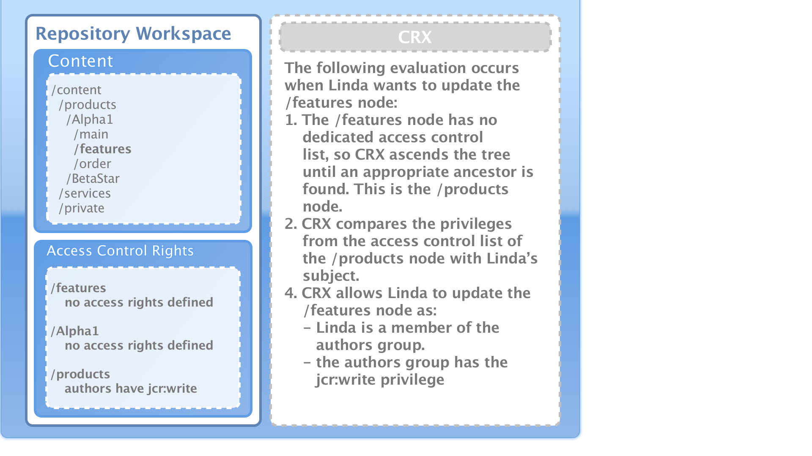
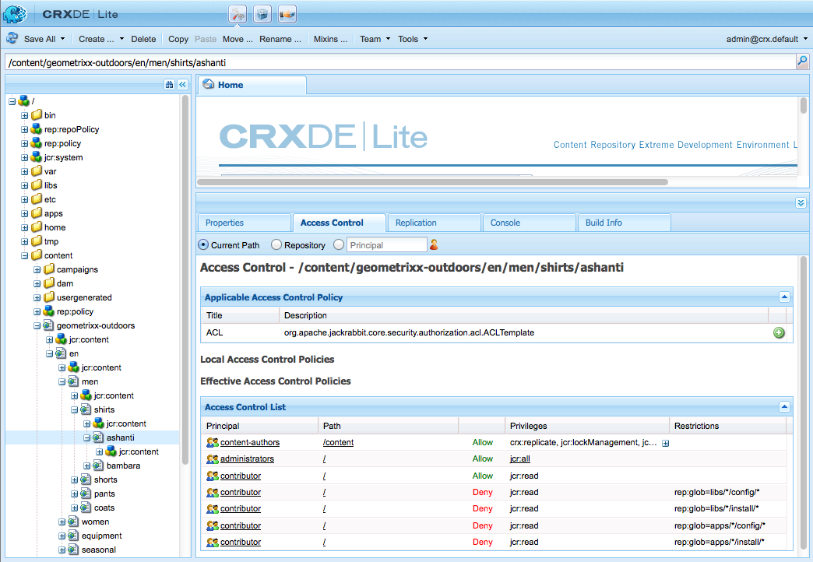
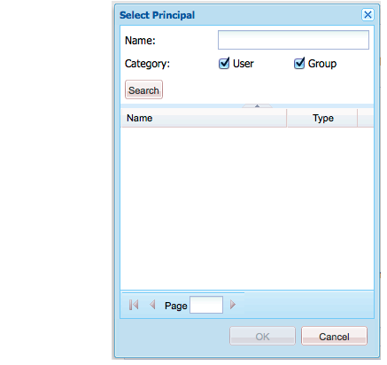
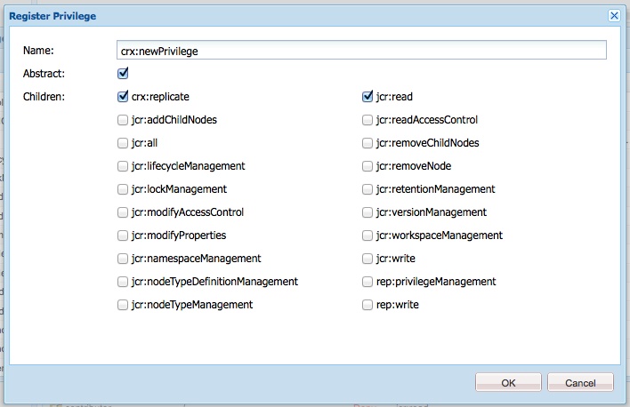

# Administración de derechos de usuario, grupo y acceso{#user-group-and-access-rights-administration}

Habilitar el acceso a un repositorio CRX implica varios temas:

* [Derechos de acceso](#how-access-rights-are-evaluated) : los conceptos de cómo se definen y evalúan
* [Administración de usuarios](#user-administration) : administración de las cuentas individuales utilizadas para el acceso
* [Administración de grupos](#group-administration) : simplifique la administración de usuarios mediante la formación de grupos
* [Administración de derechos de acceso](#access-right-management) : definición de políticas que controlan la forma en que estos usuarios y grupos pueden acceder a los recursos

Los elementos básicos son:

**User** AccountsCRX autentica el acceso identificando y verificando a un usuario (por esa persona u otra aplicación) según los detalles que se tengan en la cuenta de usuario.

En CRX, cada cuenta de usuario es un nodo en el espacio de trabajo. Una cuenta de usuario CRX tiene las siguientes propiedades:

* Representa a un usuario de CRX.
* Contiene un nombre de usuario y una contraseña.
* Se aplica a ese espacio de trabajo.
* No puede tener subusuarios. Para los derechos de acceso jerárquicos debe utilizar grupos.

* Puede especificar derechos de acceso para la cuenta de usuario.

   Sin embargo, para simplificar la administración, recomendamos que (en la mayoría de los casos) asigne derechos de acceso a cuentas de grupo. La asignación de derechos de acceso para cada usuario individual se vuelve muy difícil de administrar rápidamente (las excepciones son ciertos usuarios del sistema cuando solo existen una o dos instancias).

**Las cuentas de** grupo son colecciones de usuarios y/u otros grupos. Se utilizan para simplificar la administración, ya que el cambio en los derechos de acceso asignados a un grupo se aplica automáticamente a todos los usuarios de ese grupo. Un usuario no tiene que pertenecer a ningún grupo, pero a menudo pertenece a varios.

En CRX, un grupo tiene las siguientes propiedades:

* Representa un grupo de usuarios con derechos de acceso comunes. Por ejemplo, autores o desarrolladores.
* Se aplica a ese espacio de trabajo.
* Puede tener miembros; pueden ser usuarios individuales u otros grupos.
* La agrupación jerárquica se puede lograr con relaciones de miembros. No puede colocar un grupo directamente debajo de otro grupo en el repositorio.
* Puede definir los derechos de acceso para todos los miembros del grupo.

**Access** RightsCRX utiliza los derechos de acceso para controlar el acceso a áreas específicas del repositorio.

Esto se realiza asignando privilegios para permitir o denegar el acceso a un recurso (nodo o ruta) en el repositorio. Como se pueden asignar varios privilegios, deben evaluarse para determinar qué combinación es aplicable a la solicitud actual.

CRX le permite configurar los derechos de acceso para las cuentas de usuario y de grupo. Los mismos principios básicos de evaluación se aplican entonces a ambos.

## Cómo se evalúan los derechos de acceso {#how-access-rights-are-evaluated}

>[!NOTE]
>
>CRX implementa [control de acceso como se define en JSR-283](https://docs.adobe.com/content/docs/en/spec/jcr/2.0/16_Access_Control_Management.html).
>
>Se configura una instalación estándar de un repositorio CRX para utilizar listas de control de acceso basadas en recursos. Esta es una posible implementación del control de acceso JSR-283 y una de las implementaciones presentes con Jackrabbit.

### Sujetos y principios {#subjects-and-principals}

CRX utiliza dos conceptos clave al evaluar los derechos de acceso:

* Una **principal** es una entidad que tiene derechos de acceso. Los principales son:

   * Una cuenta de usuario
   * Una cuenta de grupo

      Si una cuenta de usuario pertenece a uno o más grupos, también se asocia a cada uno de esos principales grupos.

* Se utiliza un **subject** para representar el origen de una solicitud.

   Se utiliza para consolidar los derechos de acceso aplicables a esa solicitud. Estos se extraen de:

   * La entidad de seguridad del usuario

      Los derechos que asigna directamente a la cuenta de usuario.

   * Todos los grupos principales asociados a ese usuario

      Todos los derechos asignados a cualquiera de los grupos a los que pertenece el usuario.
   El resultado se utiliza para permitir o denegar el acceso al recurso solicitado.

#### Recopilación de la lista de derechos de acceso para un sujeto {#compiling-the-list-of-access-rights-for-a-subject}

En CRX, el asunto depende de:

* la entidad de seguridad del usuario
* todas las entidades principales de grupo asociadas a ese usuario

La lista de derechos de acceso aplicables al sujeto se elabora a partir de:

* los derechos que asigna directamente a la cuenta de usuario
* además de todos los derechos asignados a cualquiera de los grupos a los que pertenece el usuario


>[!NOTE]
>
>* CRX no tiene en cuenta ninguna jerarquía de usuarios cuando compila la lista.
>* CRX utiliza una jerarquía de grupos solo cuando incluye un grupo como miembro de otro grupo. No hay herencia automática de los permisos de grupo.
>* El orden en que especifique los grupos no afecta a los derechos de acceso.

>


### Resolución de solicitudes y derechos de acceso {#resolving-request-and-access-rights}

Cuando CRX gestiona la solicitud, compara la solicitud de acceso del sujeto con la lista de control de acceso en el nodo del repositorio:

Por lo tanto, si Linda solicita actualizar el nodo `/features` en la siguiente estructura de repositorios:



### Orden de prioridad {#order-of-precedence}

Los derechos de acceso en CRX se evalúan de la siguiente manera:

* Las entidades de seguridad de usuario siempre tienen prioridad sobre las entidades de seguridad de grupo, independientemente de:

   * su orden en la lista de control de acceso
   * su posición en la jerarquía de nodos

* Para una entidad de seguridad determinada existe (como máximo) 1 denegación y 1 entrada de permiso en un nodo determinado. La implementación siempre borra las entradas redundantes y se asegura de que el mismo privilegio no aparezca en las entradas de permitir y denegar.

>[!NOTE]
>
>Este proceso de evaluación es apropiado para el control de acceso basado en recursos de una instalación CRX estándar.

Tomando dos ejemplos en los que el usuario `aUser` es miembro del grupo `aGroup`:

```xml
   + parentNode
     + acl
       + ace: aUser - deny - write
     + childNode
       + acl
         + ace: aGroup - allow - write
       + grandChildNode
```

En el caso anterior:

* `aUser` no se le concede permiso de escritura en  `grandChildNode`.

```xml
   + parentNode
     + acl
       + ace: aUser - deny - write
     + childNode
       + acl
         + ace: aGroup - allow - write
         + ace: aUser - deny - write
       + grandChildNode
```

En este caso:

* `aUser` no se le concede permiso de escritura en  `grandChildNode`.
* El segundo ACE para `aUser` es redundante.

Los derechos de acceso de varias entidades principales de grupo se evalúan en función de su orden, tanto dentro de la jerarquía como dentro de una única lista de control de acceso.

### Prácticas recomendadas   {#best-practices}

En la tabla siguiente se enumeran algunas recomendaciones y prácticas recomendadas:

<table>
 <tbody>
  <tr>
   <td>Recomendación...</td>
   <td>Motivo...</td>
  </tr>
  <tr>
   <td><i>Usar grupos</i></td>
   <td><p>Evite asignar derechos de acceso usuario por usuario. Esto se debe a varios motivos:</p>
    <ul>
     <li>Tiene muchos más usuarios que grupos, por lo que los grupos simplifican la estructura.</li>
     <li>Los grupos ayudan a proporcionar información general sobre todas las cuentas.</li>
     <li>La herencia es más sencilla con los grupos.</li>
     <li>Los usuarios van y vienen. Los grupos son de largo plazo.</li>
    </ul> </td>
  </tr>
  <tr>
   <td><i>Ser positivo</i></td>
   <td><p>Utilice siempre las instrucciones Allow para especificar los derechos de acceso de la entidad de seguridad del grupo (siempre que sea posible). Evite utilizar una instrucción Deny.</p> <p>Las entidades principales de grupo se evalúan en orden, tanto dentro de la jerarquía como dentro de una única lista de control de acceso.</p> </td>
  </tr>
  <tr>
   <td><i>Manténgalo simple</i></td>
   <td><p>Invertir un poco de tiempo y pensamiento al configurar una nueva instalación será bien pagado.</p> <p>La aplicación de una estructura clara simplificará el mantenimiento y la administración en curso, lo que garantiza que tanto sus colegas actuales como los futuros sucesores puedan comprender fácilmente qué se está implementando.</p> </td>
  </tr>
  <tr>
   <td><i>Probar</i></td>
   <td>Utilice una instalación de prueba para practicar y asegurarse de que comprende las relaciones entre los distintos usuarios y grupos.</td>
  </tr>
  <tr>
   <td><i>Usuarios/grupos predeterminados</i></td>
   <td>Actualice siempre los usuarios y grupos predeterminados inmediatamente después de la instalación para ayudar a evitar problemas de seguridad.</td>
  </tr>
 </tbody>
</table>

## Administración de usuarios {#user-administration}

Se utiliza un cuadro de diálogo estándar para **Administración de usuarios**.

Debe iniciar sesión en el espacio de trabajo correspondiente y, a continuación, puede acceder al cuadro de diálogo desde:

* el enlace **User Administration** en la consola principal de CRX
* el menú **Security** del Explorador CRX


**Propiedades**

* **UserID**

   Nombre corto para la cuenta, utilizado al acceder a CRX.

* **Nombre principal**

   Un nombre de texto completo para la cuenta.

* **Contraseña**

   Necesario al acceder a CRX con esta cuenta.

* **ntlmhash**

   Se asigna automáticamente a cada cuenta nueva y se actualiza cuando se cambia la contraseña.

* Puede agregar nuevas propiedades definiendo un nombre, tipo y valor. Haga clic en Guardar (símbolo de visto verde) para cada nueva propiedad.

**Pertenencia a grupos**

Muestra todos los grupos a los que pertenece la cuenta. La columna Heredado indica la pertenencia que se ha heredado como resultado de la pertenencia a otro grupo.

Al hacer clic en un GroupID (cuando esté disponible) se abrirá [Administración de grupos](#group-administration) para ese grupo.

**Suplantadores**

Con la funcionalidad Suplantar un usuario puede trabajar en nombre de otro usuario.

Esto significa que una cuenta de usuario puede especificar otras cuentas (usuario o grupo) que pueden operar con su cuenta. En otras palabras, si el usuario B puede suplantar al usuario A, el usuario B puede realizar acciones utilizando los detalles completos de la cuenta del usuario A (incluidos el ID, el nombre y los derechos de acceso).

Esto permite que las cuentas del imitador completen tareas como si estuvieran utilizando la cuenta que están suplantando; por ejemplo, durante una ausencia o para compartir una carga excesiva a corto plazo.

Si una cuenta se hace pasar por otra, es muy difícil de ver. Los archivos de registro no contienen información sobre el hecho de que se ha producido una suplantación en los eventos. Por lo tanto, si el usuario B está suplantando al usuario A, todos los eventos parecerán como si fueran realizados personalmente por el usuario A.

### Creación de una cuenta de usuario {#creating-a-user-account}

1. Abra el cuadro de diálogo **Administración de usuarios**.
1. Haga clic en **Crear usuario**.
1. A continuación, puede introducir las Propiedades:

   * **** UserIDusado como nombre de cuenta.
   * **** Contraseña necesaria al iniciar sesión.
   * **Nombre principal** para proporcionar un nombre textual completo.
   * **Rutas intermedias** que se pueden utilizar para formar una estructura de árbol.

1. Haga clic en Guardar (símbolo de visto verde).
1. El cuadro de diálogo se ampliará para que pueda:

   1. Configure **Properties**.
   1. Consulte **Pertenencia a un grupo**.
   1. Defina **Suplantadores**.

>[!NOTE]
>
>A veces se puede observar una pérdida de rendimiento al registrar nuevos usuarios en instalaciones que tienen un número elevado de ambos:
>
>* usuarios
>* grupos con muchos miembros

>


### Actualización de una cuenta de usuario {#updating-a-user-account}

1. Con el cuadro de diálogo **Administración de usuarios**, abra la vista de lista de todas las cuentas.
1. Navegue por la estructura de árbol.
1. Haga clic en la cuenta requerida para abrirla y editarla.
1. Realice un cambio y haga clic en Guardar (símbolo de marca de graduación verde) para esa entrada.
1. Haga clic en **Cerrar** para finalizar o en **Lista...** para volver a la lista de todas las cuentas de usuario.

### Eliminación de una cuenta de usuario {#removing-a-user-account}

1. Con el cuadro de diálogo **Administración de usuarios**, abra la vista de lista de todas las cuentas.
1. Navegue por la estructura de árbol.
1. Seleccione la cuenta requerida y haga clic en **Quitar usuario**; la cuenta se eliminará inmediatamente.

>[!NOTE]
>
>Esto elimina el nodo de esta entidad de seguridad del repositorio.
>
>Las entradas de acceso correctas no se eliminan. Esto garantiza la integridad histórica.

### Definición de propiedades {#defining-properties}

Puede definir **Propiedades** para cuentas nuevas o existentes:

1. Abra el cuadro de diálogo **Administración de usuarios** para la cuenta adecuada.
1. Defina un nombre **Property**.
1. Seleccione **Type** en la lista desplegable.
1. Defina el **Valor**.
1. Haga clic en Guardar (símbolo de clic verde) para la nueva propiedad.

Las propiedades existentes se pueden eliminar con el símbolo de papelera.

A excepción de la contraseña, las propiedades no se pueden editar, se deben eliminar y volver a crear.

#### Cambio de la contraseña {#changing-the-password}

La **Contraseña** es una propiedad especial que se puede cambiar haciendo clic en el enlace **Cambiar contraseña**.

También puede cambiar la contraseña a su propia cuenta de usuario desde el menú **Security** en el Explorador CRX.

### Definición de un suplantador {#defining-an-impersonator}

Puede definir Suplantadores para cuentas nuevas o existentes:

1. Abra el cuadro de diálogo **Administración de usuarios** para la cuenta adecuada.
1. Especifique la cuenta a la que se permitirá suplantar esa cuenta.

   Puede utilizar Examinar... para seleccionar una cuenta existente.

1. Haga clic en Guardar (símbolo de visto verde) para la nueva propiedad.

## Administración de grupos {#group-administration}

Se utiliza un cuadro de diálogo estándar para **Administración de grupos**.

Debe iniciar sesión en el espacio de trabajo correspondiente y, a continuación, puede acceder al cuadro de diálogo desde:

* el enlace **Administración de grupo** en la Consola principal de CRX
* el menú **Security** del Explorador CRX


**Propiedades**

* **GroupID**

   Nombre corto para la cuenta de grupo.

* **Nombre principal**

   Un nombre de texto completo para la cuenta de grupo.

* Puede agregar nuevas propiedades definiendo un nombre, tipo y valor. Haga clic en Guardar (símbolo de visto verde) para cada nueva propiedad.

* **Miembros**

   Puede agregar usuarios u otros grupos como miembros de este grupo.

**Pertenencia a grupos**

Esto muestra todos los grupos a los que pertenece la cuenta de grupo actual. La columna Heredado indica la pertenencia que se ha heredado como resultado de la pertenencia a otro grupo.

Al hacer clic en un GroupID se abrirá el cuadro de diálogo para ese grupo.

**Miembros**

Enumera todas las cuentas (usuarios y/o grupos) que son miembros del grupo actual.

La columna **Heredada** indica la pertenencia que se ha heredado como resultado de la pertenencia a otro grupo.

>[!NOTE]
>
>Cuando la función Propietario, Editor o Visualizador se asigna a un usuario en cualquier carpeta de recursos, se crea un nuevo grupo. El nombre del grupo tiene el formato `mac-default-<foldername>` para cada carpeta en la que se definen las funciones.

### Creación de una cuenta de grupo {#creating-a-group-account}

1. Abra el cuadro de diálogo **Administración de grupos**.
1. Haga clic en **Crear grupo**.
1. A continuación, puede introducir las Propiedades:

   * **Nombre principal** para proporcionar un nombre textual completo.
   * **Rutas intermedias** que se pueden utilizar para formar una estructura de árbol.

1. Haga clic en Guardar (símbolo de visto verde).
1. El cuadro de diálogo se ampliará para que pueda:

   1. Configure **Properties**.
   1. Consulte **Pertenencia a un grupo**.
   1. Administrar **Miembros**.

### Actualización de una cuenta de grupo {#updating-a-group-account}

1. Con el cuadro de diálogo **Administración de grupos**, abra la vista de lista de todas las cuentas.
1. Navegue por la estructura de árbol.
1. Haga clic en la cuenta requerida para abrirla y editarla.
1. Realice un cambio y haga clic en Guardar (símbolo de marca de graduación verde) para esa entrada.
1. Haga clic en **Cerrar** para finalizar o en **Lista...** para volver a la lista de todas las cuentas de grupo.

### Eliminación de una cuenta de grupo {#removing-a-group-account}

1. Con el cuadro de diálogo **Administración de grupos**, abra la vista de lista de todas las cuentas.
1. Navegue por la estructura de árbol.
1. Seleccione la cuenta requerida y haga clic en **Quitar grupo**; la cuenta se eliminará inmediatamente.

>[!NOTE]
>
>Esto elimina el nodo de esta entidad de seguridad del repositorio.
>
>Las entradas de acceso correctas no se eliminan. Esto garantiza la integridad histórica.

### Definición de propiedades {#defining-properties-1}

Puede definir Propiedades para cuentas nuevas o existentes:

1. Abra el cuadro de diálogo **Administración de grupos** para la cuenta adecuada.
1. Defina un nombre **Property**.
1. Seleccione **Type** en la lista desplegable.
1. Defina el **Valor**.
1. Haga clic en Guardar (símbolo de visto verde) para la nueva propiedad.

Las propiedades existentes se pueden eliminar con el símbolo de papelera.

### Miembros {#members}

Puede agregar miembros al grupo actual:

1. Abra el cuadro de diálogo **Administración de grupos** para la cuenta adecuada.
1. O bien:

   * Introduzca el nombre del miembro requerido (cuenta de usuario o de grupo).
   * O utilice **Browse...** para buscar y seleccionar el principal (cuenta de usuario o grupo) que desea agregar.

1. Haga clic en Guardar (símbolo de visto verde) para la nueva propiedad.

O elimine un miembro existente con el símbolo de papelera.

## Administración de derechos de acceso {#access-right-management}

Con la pestaña **Control de acceso** del CRXDE Lite puede definir las políticas de control de acceso y asignar los privilegios relacionados.

Por ejemplo, para **Ruta actual** seleccione el recurso necesario en el panel izquierdo, la pestaña Control de acceso en el panel inferior derecho:



Las políticas se clasifican según:

* **Políticas de control de acceso aplicables**

   Estas políticas se pueden aplicar.

   Son directivas disponibles para crear una directiva local. Una vez seleccionada y añadida una directiva aplicable, esta se convierte en una directiva local.

* **Políticas de control de acceso local**

   Son directivas de control de acceso que ha aplicado. A continuación, puede actualizarlos, ordenarlos o eliminarlos.

   Una directiva local anulará cualquier directiva heredada del elemento principal.

* **Políticas de control de acceso efectivas**

   Estas son las políticas de control de acceso que están actualmente en vigor para cualquier solicitud de acceso. Muestran las políticas agregadas derivadas de las políticas locales y de cualquier heredada del elemento principal.

### Selección de directivas {#policy-selection}

Las políticas se pueden seleccionar para:

* **Ruta actual**

   Como en el ejemplo anterior, seleccione un recurso dentro del repositorio. Se mostrarán las políticas para esta &quot;ruta actual&quot;.

* **Repositorio**

   Selecciona el control de acceso a nivel de repositorio. Por ejemplo, al configurar el privilegio `jcr:namespaceManagement`, que solo es relevante para el repositorio, no para un nodo.

* **Principal**

   Una entidad de seguridad registrada en el repositorio.

   Puede escribir el nombre **Principal** o hacer clic en el icono a la derecha del campo para abrir el cuadro de diálogo **Seleccionar Principal**.

   Esto le permite **Buscar** para un **Usuario** o **Grupo**. Seleccione la entidad de seguridad necesaria de la lista resultante y haga clic en **OK** para devolver el valor al cuadro de diálogo anterior.



>[!NOTE]
>
>Para simplificar la administración, le recomendamos que asigne derechos de acceso a cuentas de grupo, no a cuentas de usuario individuales.
>
>Es más fácil administrar algunos grupos que muchas cuentas de usuario.

### Privilegios {#privileges}

Los siguientes privilegios están disponibles para su selección al añadir una entrada de control de acceso (consulte la [Security API](https://docs.adobe.com/docs/en/spec/javax.jcr/javadocs/jcr-2.0/javax/jcr/security/Privilege.html) para obtener más información):

<table>
 <tbody>
  <tr>
   <th><strong>Nombre del privilegio</strong></th>
   <th><strong>Que controla el privilegio a...</strong></th>
  </tr>
  <tr>
   <td><code>jcr:read</code></td>
   <td>Recupere un nodo y lea sus propiedades y sus valores.</td>
  </tr>
  <tr>
   <td><code>rep:write</code></td>
   <td>Este es un privilegio de agregado específico de jackrabbit de jcr:write y jcr:nodeTypeManagement.<br /> </td>
  </tr>
  <tr>
   <td><code>jcr:all</code></td>
   <td>Se trata de un privilegio agregado que contiene todos los demás privilegios predefinidos.</td>
  </tr>
  <tr>
   <td><strong>Avanzado </strong></td>
   <td> </td>
  </tr>
  <tr>
   <td><code>crx:replicate</code></td>
   <td>Realizar la replicación de un nodo.</td>
  </tr>
  <tr>
   <td><code>jcr:addChildNodes</code></td>
   <td>Cree nodos secundarios de un nodo.</td>
  </tr>
  <tr>
   <td><code>jcr:lifecycleManagement</code></td>
   <td>Realizar operaciones de ciclo vital en un nodo.</td>
  </tr>
  <tr>
   <td><code>jcr:lockManagement</code></td>
   <td>Bloqueo y desbloqueo de un nodo; actualice un bloqueo.</td>
  </tr>
  <tr>
   <td><code>jcr:modifyAccessControl</code></td>
   <td>Modifique las directivas de control de acceso de un nodo.</td>
  </tr>
  <tr>
   <td><code>jcr:modifyProperties</code></td>
   <td>Cree, modifique y elimine las propiedades de un nodo.</td>
  </tr>
  <tr>
   <td><code>jcr:namespaceManagement</code></td>
   <td>Registre, quite el registro y modifique las definiciones de espacio de nombres.</td>
  </tr>
  <tr>
   <td><code>jcr:nodeTypeDefinitionManagement</code></td>
   <td>Importar definiciones de tipo de nodo al repositorio.</td>
  </tr>
  <tr>
   <td><code>jcr:nodeTypeManagement</code></td>
   <td>Agregue y elimine tipos de nodos mixtos y cambie el tipo de nodo principal de un nodo. Esto también incluye cualquier llamada a los métodos de importación de Node.addNode y XML donde se especifique explícitamente la mezcla o el tipo principal del nuevo nodo.</td>
  </tr>
  <tr>
   <td><code>jcr:readAccessControl</code></td>
   <td>Lea la directiva de control de acceso de un nodo.</td>
  </tr>
  <tr>
   <td><code>jcr:removeChildNodes</code></td>
   <td>Elimine los nodos secundarios de un nodo.</td>
  </tr>
  <tr>
   <td><code>jcr:removeNode</code></td>
   <td>Elimine un nodo.</td>
  </tr>
  <tr>
   <td><code>jcr:retentionManagement</code></td>
   <td>Realizar operaciones de administración de retención en un nodo.</td>
  </tr>
  <tr>
   <td><code>jcr:versionManagement</code></td>
   <td>Realizar operaciones de versiones en un nodo.</td>
  </tr>
  <tr>
   <td><code>jcr:workspaceManagement</code></td>
   <td>La creación y eliminación de espacios de trabajo a través de la API de JCR.</td>
  </tr>
  <tr>
   <td><code>jcr:write</code></td>
   <td>Es un privilegio de agregado que contiene:<br /> - jcr:modifyProperties<br /> - jcr:addChildNodes<br /> - jcr:removeNode<br /> - jcr:removeChildNodes</td>
  </tr>
  <tr>
   <td><code>rep:privilegeManagement</code></td>
   <td>Registre un nuevo privilegio.</td>
  </tr>
 </tbody>
</table>

### Registro de nuevos privilegios {#registering-new-privileges}

También puede registrar nuevos privilegios:

1. En la barra de herramientas, seleccione **Tools** y luego **Privileges** para mostrar los privilegios registrados actualmente.

   

1. Utilice el icono **Register Privilege** (**+**) para abrir el cuadro de diálogo y definir un nuevo privilegio:

   

1. Haga clic en **Aceptar** para guardar. El privilegio ahora estará disponible para la selección.

### Adición de una entrada de control de acceso {#adding-an-access-control-entry}

1. Seleccione el recurso y abra la pestaña **Control de acceso**.

1. Para agregar una **Política de control de acceso local** nueva, haga clic en el icono **+** situado a la derecha de la lista **Política de control de acceso aplicable**:

   

1. Aparece una nueva entrada en **Directivas de control de acceso local:**

   

1. Haga clic en el icono **+** para añadir una nueva entrada:

   

   >[!NOTE]
   >
   >Actualmente se necesita una solución para especificar una cadena vacía.
   >
   >Para ello, debe utilizar &quot;&quot;.

1. Defina su política de control de acceso y haga clic en **OK** para guardar. La nueva directiva:

   * debe aparecer en **Política de control de acceso local**
   * los cambios se reflejarán en las **Políticas efectivas de control de acceso**.

CRX validará su selección; para una entidad de seguridad determinada existe (como máximo) 1 denegación y 1 entrada de permiso en un nodo determinado. La implementación siempre borra las entradas redundantes y se asegura de que el mismo privilegio no aparezca en las entradas de permitir y denegar.

### Solicitud de directivas de control de acceso local {#ordering-local-access-control-policies}

El orden de la lista indica el orden en que se aplican las políticas.

1. En la tabla **Local Access Control Policies** seleccione la entrada requerida y arrástrela a la nueva posición de la tabla.

   

1. Los cambios se mostrarán en las tablas **Local** y **Políticas efectivas de control de acceso**.

### Eliminación de una directiva de control de acceso {#removing-an-access-control-policy}

1. En la tabla **Local Access Control Policies** haga clic en el icono rojo (-) a la derecha de la entrada.
1. La entrada se eliminará de las tablas **Local** y **Políticas efectivas de control de acceso**.

### Prueba de una directiva de control de acceso {#testing-an-access-control-policy}

1. En la barra de herramientas del CRXDE Lite, seleccione **Tools**, luego **Test Access Control...**.
1. Se abre un nuevo cuadro de diálogo en el panel superior derecho. Seleccione la **Ruta** o **Principal** que desea probar.
1. Haga clic en **Test** para ver los resultados de la selección:

   
