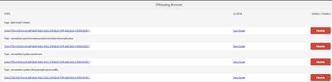

# Descarga del flujo de trabajo de recursos{#assets-workflow-offloader}

El cargador de flujo de trabajo de recursos le permite activar varias instancias de Recursos Adobe Experience Manager (AEM) para reducir la carga de procesamiento en la instancia principal (líder). La carga de procesamiento se distribuye entre la instancia de encabezado y las distintas instancias de descargador (trabajador) que se le agregan. La distribución de la carga de procesamiento de los recursos aumenta la eficacia y la velocidad con que AEM Assets procesa los recursos. Además, ayuda a asignar recursos dedicados para procesar recursos de un tipo MIME concreto. Por ejemplo, puede asignar un nodo específico de la topología para procesar solo recursos de InDesign.

## Configuración de la topología de descarga {#configure-offloader-topology}

Utilice Configuration Manager para agregar la dirección URL de la instancia de encabezado y los nombres de host de las instancias de descarga para las solicitudes de conexión en la instancia de encabezado.

1. Toque o haga clic en el logotipo de AEM y elija **Herramientas** > **Operaciones** > Consola **** web para abrir Configuration Manager.
1. En la consola web, seleccione **Sling** > Administración **de topología**.

   

1. En la página Administración de topología, toque o haga clic en el vínculo **Configurar el servicio** Discovery.Oak.

   

1. En la página de configuración de Discovery Service, especifique la dirección URL del conector para la instancia de encabezado en el campo Direcciones URL **del conector de** topología.

   

1. En el campo Lista blanca **del conector de** topología, especifique la dirección IP o los nombres de host de las instancias de descargador que pueden conectarse con la instancia de encabezado. Tap/click **Save**.

   

1. Para ver las instancias de descarga conectadas a la instancia de encabezado, vaya a **Herramientas** > **Implementación** > **Topología** y toque o haga clic en la vista de clúster.

## Deshabilitar descarga {#disable-offloading}

1. Toque o haga clic en el logotipo de AEM y elija **Herramientas** > **Implementación** > **Descarga**. La página **Navegador** de descarga muestra los temas y las instancias de servidor que pueden consumir los temas.

   

1. Desactive el tema *com/adobe/granite/workflow/offloading* en las instancias de encabezado con las que los usuarios interactúan para cargar o cambiar recursos de AEM.

   

## Configuración de lanzadores de flujo de trabajo en la instancia de líder {#configure-workflow-launchers-on-the-leader-instance}

Configure los iniciadores de flujo de trabajo para utilizar el flujo de trabajo de descarga **de recursos de actualización de** DAM en la instancia de encabezado en lugar del flujo de trabajo de actualización de recursos **de** DAM.

1. Toque o haga clic en el logotipo de AEM y elija **Herramientas** > **Flujo de trabajo** > **Iniciadores** para abrir la consola **de iniciadores** de flujo de trabajo.

   

1. Busque las dos configuraciones del iniciador con el tipo de evento **Nodo creado** y **Nodo modificado** respectivamente, que ejecutan el flujo de trabajo de recursos **de actualización de** DAM.
1. Para cada configuración, seleccione la casilla de verificación que hay antes y toque o haga clic en el icono **Ver propiedades** de la barra de herramientas para mostrar el cuadro de diálogo Propiedades **del** iniciador.

   

1. En la lista **Flujo de trabajo** , seleccione Descarga **de recursos de actualización de** DAM y toque o haga clic en **Guardar**.

   

1. Toque o haga clic en el logotipo de AEM y elija **Herramientas** > **Flujo de trabajo** > **Modelos** para abrir la página Modelos **de** flujo de trabajo.
1. Seleccione el flujo de trabajo de descarga **de recursos de actualización de** DAM y toque o haga clic en **Editar** en la barra de herramientas para mostrar sus detalles.

   

1. Muestre el menú contextual para el paso Descarga **de flujo de trabajo de** DAM y elija **Editar**. Compruebe la entrada en el campo Tema **de** trabajo de la ficha Argumentos **** genéricos del cuadro de diálogo de configuración.

   

## Deshabilitar los iniciadores de flujo de trabajo en las instancias de descargador {#disable-the-workflow-launchers-on-the-offloader-instances}

Desactive los iniciadores de flujo de trabajo que ejecutan el flujo de trabajo de recursos **de actualización de** DAM en la instancia de encabezado.

1. Toque o haga clic en el logotipo de AEM y elija **Herramientas** > **Flujo de trabajo** > **Iniciadores** para abrir la consola **de iniciadores** de flujo de trabajo.

   

1. Busque las dos configuraciones del iniciador con el tipo de evento **Nodo creado** y **Nodo modificado** respectivamente, que ejecutan el flujo de trabajo de recursos **de actualización de** DAM.
1. Para cada configuración, seleccione la casilla de verificación que hay antes y toque o haga clic en el icono **Ver propiedades** de la barra de herramientas para mostrar el cuadro de diálogo Propiedades **del** iniciador.

   

1. En la sección **Activar** , arrastre el control deslizante para desactivar el iniciador del flujo de trabajo y toque o haga clic en **Guardar** para deshabilitarlo.

   

1. Cargue cualquier recurso de tipo imagen en la instancia de encabezado. Compruebe las miniaturas generadas y devueltas para el recurso por la instancia descargada.

