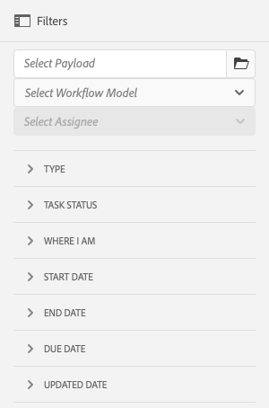

# Administración de instancias de flujo de trabajo{#administering-workflow-instances}

La consola de flujo de trabajo proporciona varias herramientas para administrar instancias de flujo de trabajo a fin de garantizar que se ejecuten según lo esperado.

>[!NOTE]
>
>La variable [Consola JMX](/help/sites-administering/jmx-console.md#workflow-maintenance) proporciona operaciones de mantenimiento de flujo de trabajo adicionales.

Hay una serie de consolas disponibles para administrar los flujos de trabajo. Utilice la variable [navegación global](/help/sites-authoring/basic-handling.md#global-navigation) para abrir el panel **Herramientas** y, a continuación, seleccione **Flujo de trabajo**:

* **Modelos**: Administrar definiciones de flujo de trabajo
* **Instancias**: Ver y administrar la ejecución de instancias de flujo de trabajo
* **Lanzadores**: Administrar el lanzamiento de los flujos de trabajo
* **Archivo**: Ver el historial de los flujos de trabajo que finalizaron correctamente
* **Errores**: Ver el historial de los flujos de trabajo que finalizaron con errores
* **Autoasignación**: Configurar los flujos de trabajo de autoasignación en las plantillas

## Monitorización del estado de las instancias de flujo de trabajo {#monitoring-the-status-of-workflow-instances}

1. Uso de la selección Navegación **Herramientas**, luego **Flujo de trabajo**.
1. Seleccione **Instancias** para mostrar la lista de instancias de flujo de trabajo en progreso.

   

<!--
## Search Workflow Instances {#search-workflow-instances}

1. Using Navigation select **Tools**, then **Workflow**.
1. Select **Instances** to display the list of workflow instances currently in progress. On the top rail, in the left corner, select **Filters**. Alternatively, you can use the keystrokes alt+1. The following dialog is displayed:

   

1. In the Filter dialog, select the workflow search criteria. You can search based on these inputs:

   * Payload path: Select a specific path
   * Workflow model: Select a workflow model
   * Assignee: Select a workflow Assignee
   * Type: Task, Workflow item, or Workflow Failure
   * Task Status: Active, Complete, or Terminated
   * Where I Am: Owner AND Assignee, Owner only, Assignee only
   * Start Date: Start date before or after a specified date
   * End Date: End date before or after a specified date
   * Due Date: Due date before or after a specified date
   * Updated Date: Updated date before or after a specified date
-->

## Suspender, reanudar y finalizar una instancia de flujo de trabajo {#suspending-resuming-and-terminating-a-workflow-instance}

1. Uso de la selección Navegación **Herramientas**, luego **Flujo de trabajo**.
1. Seleccione **Instancias** para mostrar la lista de instancias de flujo de trabajo en progreso.

   

1. Seleccione un elemento específico y, a continuación, utilice **Finalizar**, **Suspender** o **Reanudar**, según proceda; confirmación o más detalles:

   

## Visualización de flujos de trabajo archivados {#viewing-archived-workflows}

1. Uso de la selección Navegación **Herramientas**, luego **Flujo de trabajo**.
1. Seleccione **Archivo** para mostrar la lista de instancias de flujo de trabajo que se completaron correctamente.

   

   >[!NOTE]
   >
   >El estado de anulación se considera una terminación satisfactoria, ya que ocurre como resultado de la acción del usuario; por ejemplo:
   >
   >* uso de la acción **Finalizar**
   >* cuando se elimina una página sujeta a un flujo de trabajo, este se cierra y el flujo de trabajo finaliza


1. Seleccione un elemento específico y luego **Abrir historial** para ver más detalles:

   

## Corrección de errores de instancias de flujo de trabajo {#fixing-workflow-instance-failures}

Cuando falla un flujo de trabajo, AEM proporciona la consola **Errores** para que pueda investigar y tomar las medidas adecuadas una vez que se haya manejado la causa original:

* **Detalles del error**
Abre una ventana para mostrar el 
**Mensaje de error**, **Paso** y **Pila de errores**.

* **Abrir historial**
Muestra detalles del historial del flujo de trabajo.

* **Paso de reintento** Ejecuta de nuevo la instancia del componente Paso de script. Utilice el comando Paso de reintento después de haber corregido la causa del error original. Por ejemplo, vuelva a intentar el paso después de corregir un error en el script que ejecuta el Paso de proceso.
* **Finalizar** Finalice el flujo de trabajo si el error ha provocado una situación irreconciliable. Por ejemplo, el flujo de trabajo puede depender de condiciones ambientales como la información del repositorio, que ya no son válidas para la instancia de flujo de trabajo.
* **Finalizar y reintentar** Similar a **Finalizar**, excepto que se inicia una nueva instancia de flujo de trabajo utilizando la carga útil, el título y la descripción originales.

Para investigar los errores y luego reanudar o finalizar el flujo de trabajo más tarde, siga estos pasos:

1. Mediante la Navegación, seleccione **Herramientas** y, luego, **Flujo de trabajo**.
1. Seleccione **Errores** para mostrar la lista de instancias de flujo de trabajo que no se completaron correctamente.
1. Seleccione un elemento específico y luego la acción apropiada:

   

## Depuración regular de instancias de flujo de trabajo {#regular-purging-of-workflow-instances}

Al minimizar el número de instancias de flujo de trabajo, aumenta el rendimiento del motor de flujo de trabajo, por lo que puede depurar con regularidad las instancias de flujo de trabajo completadas o en ejecución desde el repositorio.

Configurar **Configuración de depuración del flujo de trabajo de Adobe Granite** para depurar instancias de flujo de trabajo según su edad y estado. También puede depurar instancias de flujo de trabajo de todos los modelos o de uno específico.

También puede crear varias configuraciones del servicio para depurar instancias de flujo de trabajo que cumplan distintos criterios. Por ejemplo, cree una configuración que depure las instancias de un modelo de flujo de trabajo concreto cuando se ejecuten durante mucho más tiempo del esperado. Cree otra configuración que depure todos los flujos de trabajo completados después de un determinado número de días para minimizar el tamaño del repositorio.

Para configurar el servicio, puede utilizar la variable [Consola web](/help/sites-deploying/configuring-osgi.md#osgi-configuration-with-the-web-console) o [añadir una configuración OSGi al repositorio](/help/sites-deploying/configuring-osgi.md#osgi-configuration-in-the-repository). En la tabla siguiente se describen las propiedades que necesita para cualquiera de los métodos.

>[!NOTE]
>
>Para añadir la configuración al repositorio, el PID de servicio es este:
>
>`com.adobe.granite.workflow.purge.Scheduler`
>
>Como el servicio es un servicio de fábrica, el nombre del nodo `sling:OsgiConfig` requiere un sufijo de identificador, por ejemplo:
>
>`com.adobe.granite.workflow.purge.Scheduler-myidentifier`

<table>
 <tbody>
  <tr>
   <th>Nombre de propiedad (consola web)</th>
   <th>Nombre de propiedad OSGi</th>
   <th>Descripción</th>
  </tr>
  <tr>
   <td>Nombre del trabajo</td>
   <td>scheduledpurge.name</td>
   <td>Un nombre descriptivo para la depuración programada.</td>
  </tr>
  <tr>
   <td>Estado de flujo de trabajo</td>
   <td>scheduledpurge.workflowStatus</td>
   <td><p>El estado de las instancias de flujo de trabajo que se van a purgar. Los siguientes valores son válidos:</p>
    <ul>
     <li>COMPLETADO: las instancias de flujo de trabajo completadas se depuran.</li>
     <li>EN EJECUCIÓN: las instancias de flujo de trabajo en ejecución se depuran.</li>
    </ul> </td>
  </tr>
  <tr>
   <td>Modelos para purgar</td>
   <td>scheduledpurge.modelIds</td>
   <td><p>El ID de los modelos de flujo de trabajo que se van a depurar. El ID es la ruta al nodo del modelo, por ejemplo:<br /> /var/workflow/models/dam/update_asset<br /> </p> <p>Para especificar varios modelos, haga clic en el botón + de la consola web. </p> <p>No especifique ningún valor para depurar instancias de todos los modelos de flujo de trabajo.</p> </td>
  </tr>
  <tr>
   <td>Edad del flujo de trabajo</td>
   <td>scheduledpurge.daysell</td>
   <td>La antigüedad de las instancias de flujo de trabajo que se van a purgar, en días.</td>
  </tr>
 </tbody>
</table>

## Configuración del tamaño máximo de la bandeja de entrada {#setting-the-maximum-size-of-the-inbox}

Puede configurar el tamaño máximo de la bandeja de entrada configurando la variable **Servicio de flujo de trabajo de Adobe Granite**, usando la variable [Consola web](/help/sites-deploying/configuring-osgi.md#osgi-configuration-with-the-web-console) o [añadir una configuración OSGi al repositorio](/help/sites-deploying/configuring-osgi.md#osgi-configuration-in-the-repository). En la tabla siguiente se describe la propiedad que se configura para cualquiera de los métodos.

>[!NOTE]
>
>Para añadir la configuración al repositorio, el PID de servicio es este:
>
>`com.adobe.granite.workflow.core.WorkflowSessionFactory`.

| Nombre de propiedad (consola web) | Nombre de propiedad OSGi |
|---|---|
| Tamaño máximo de consulta de la bandeja de entrada | granite.workflow.inboxQuerySize |

## Uso de variables de flujo de trabajo para almacenes de datos propiedad del cliente {#using-workflow-variables-customer-datastore}

Los datos procesados por flujos de trabajo se almacenan en el almacenamiento proporcionado por el Adobe (JCR). Estos datos pueden ser de naturaleza delicada. Es posible que desee guardar todos los metadatos/datos definidos por el usuario en su propio almacenamiento administrado en lugar del almacenamiento proporcionado por el Adobe. Estas secciones describen cómo configurar estas variables para el almacenamiento externo.

### Establecer el modelo para que utilice el almacenamiento externo de metadatos {#set-model-for-external-storage}

En el nivel del modelo de flujo de trabajo, se proporciona un indicador para indicar que el modelo (y sus instancias de tiempo de ejecución) tiene almacenamiento externo de metadatos. Las variables de flujo de trabajo no se mantendrán en JCR para las instancias de flujo de trabajo de los modelos marcados para almacenamiento externo.

La propiedad *userMetadataPersistenceEnabled* se almacenará en la variable *jcr:nodo de contenido* del modelo de flujo de trabajo. Este indicador se mantendrá en los metadatos del flujo de trabajo como *cq:userMetaDataCustomPersistenceEnabled*.

La siguiente ilustración muestra cómo establecer el indicador en un flujo de trabajo.


### API para metadatos en almacenamiento externo {#apis-for-metadata-external-storage}

Para almacenar las variables de forma externa, debe implementar las API que expone el flujo de trabajo.

UserMetaDataPersistenceContext

Los siguientes ejemplos muestran cómo utilizar la API.

```
@ProviderType
public interface UserMetaDataPersistenceContext {
 
    /**
     * Gets the workflow for persistence
     * @return workflow
     */
    Workflow getWorkflow();
 
    /**
     * Gets the workflow id for persistence
     * @return workflowId
     */
    String getWorkflowId();
 
    /**
     * Gets the user metadata persistence id
     * @return userDataId
     */
    String getUserDataId();
}
```

UserMetaDataPersistenceProvider

```
/**
 * This provider can be implemented to store the user defined workflow-data metadata in a custom storage location
 */
@ConsumerType
public interface UserMetaDataPersistenceProvider {
 
   /**
    * Retrieves the metadata using a unique identifier
    * @param userMetaDataPersistenceContext
    * @param metaDataMap of user defined workflow data metaData
    * @throws WorkflowException
    */
   void get(UserMetaDataPersistenceContext userMetaDataPersistenceContext, MetaDataMap metaDataMap) throws WorkflowException;
 
   /**
    * Stores the given metadata to the custom storage location
    * @param userMetaDataPersistenceContext
    * @param metaDataMap metadata map
    * @return the unique identifier that can be used to retrieve metadata. If null is returned, then workflowId is used.
    * @throws WorkflowException
    */
   String put(UserMetaDataPersistenceContext userMetaDataPersistenceContext, MetaDataMap metaDataMap) throws WorkflowException;
} 
```
