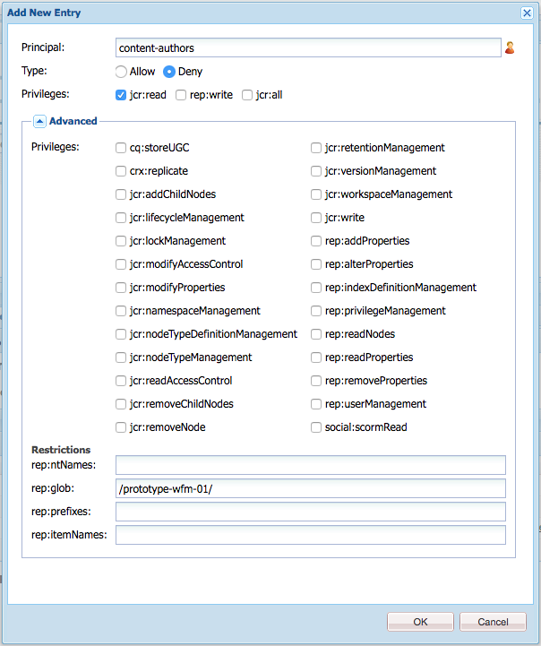
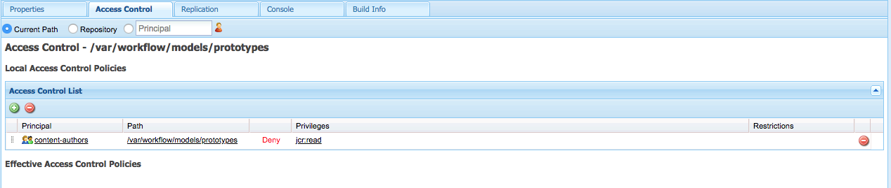

# Administración del acceso a los flujos de trabajo{#managing-access-to-workflows}

Configure las ACL según las cuentas de usuario para permitir (o deshabilitar) el inicio y la participación en flujos de trabajo.

## Permisos de usuario requeridos para flujos de trabajo {#required-user-permissions-for-workflows}

Se pueden realizar acciones en los flujos de trabajo si:

* está trabajando con la `admin` cuenta
* la cuenta se ha asignado al grupo predeterminado `workflow-users`:

   * este grupo tiene todos los privilegios necesarios para que los usuarios realicen acciones de flujo de trabajo.
   * cuando la cuenta está en este grupo, solo tiene acceso a los flujos de trabajo que ha iniciado.

* la cuenta se ha asignado al grupo predeterminado `workflow-administrators`:

   * este grupo tiene todos los privilegios necesarios para que los usuarios con privilegios puedan supervisar y administrar flujos de trabajo.
   * cuando la cuenta está en este grupo, tiene acceso a todos los flujos de trabajo.

>[!NOTE]
>
>Estos son los requisitos mínimos. Su cuenta también debe ser el participante asignado o un miembro del grupo asignado para realizar pasos específicos.

## Configuración del acceso a los flujos de trabajo {#configuring-access-to-workflows}

Los modelos de flujo de trabajo heredan una lista de control de acceso (ACL) predeterminada para controlar cómo los usuarios pueden interactuar con los flujos de trabajo. Para personalizar el acceso del usuario para un flujo de trabajo, modifique la lista de control de acceso (ACL) en el repositorio de la carpeta que contiene el nodo del modelo de flujo de trabajo:

* [Aplicar una ACL para el modelo de flujo de trabajo específico a /var/workflow/models](/help/sites-administering/workflows-managing.md#apply-an-acl-for-the-specific-workflow-model-to-var-workflow-models)
* [Cree una subcarpeta en /var/workflow/models y aplique la ACL a esa](/help/sites-administering/workflows-managing.md#create-a-subfolder-in-var-workflow-models-and-apply-the-acl-to-that)

>[!NOTE]
>
>Para obtener información sobre el uso de CRXDE Lite para configurar ACL, consulte Administración de derechos de [acceso](/help/sites-administering/user-group-ac-admin.md#access-right-management).

### Aplicar una ACL para el modelo de flujo de trabajo específico a /var/workflow/models {#apply-an-acl-for-the-specific-workflow-model-to-var-workflow-models}

Si el modelo de flujo de trabajo está almacenado en `/var/workflow/models` , puede asignar una ACL específica, relevante sólo para ese flujo de trabajo, en la carpeta:

1. Abra CRXDE Lite en el navegador web (por ejemplo, [http://localhost:4502/crx/de](http://localhost:4502/crx/de)).
1. En el árbol de nodos, seleccione el nodo de la carpeta de modelos de flujo de trabajo:

   `/var/workflow/models`

1. Haga clic en la ficha Control **de** acceso.
1. En la tabla Directivas **de control de acceso** local (Lista **de control de** acceso), haga clic en el icono del signo más para **agregar entrada**.
1. En el cuadro de diálogo **Agregar nueva entrada** , agregue una nueva ACE con las siguientes propiedades:

   * **Principal**: `content-authors`
   * **Tipo**: `Deny`
   * **Privilegios**: `jcr:read`
   * **rep:glob**: referencia al flujo de trabajo específico
   

   La tabla Lista **de control de** acceso ahora incluye la restricción para `content-authors` el modelo de `prototype-wfm-01` flujo de trabajo.

   

1. Haga clic en **Guardar todo**.

   El flujo de trabajo ya no está disponible para los miembros del `prototype-wfm-01` `content-authors` grupo.

### Cree una subcarpeta en /var/workflow/models y aplique la ACL a esa {#create-a-subfolder-in-var-workflow-models-and-apply-the-acl-to-that}

El equipo [de desarrollo puede crear los flujos de trabajo en una subcarpeta](/help/sites-developing/workflows-models.md#creating-a-new-workflow) de

`/var/workflow/models`

Comparable con los flujos de trabajo DAM almacenados en

`/var/workflow/models/dam/`

Luego puede agregar una ACL a la propia carpeta.

1. Abra CRXDE Lite en el navegador web (por ejemplo, [http://localhost:4502/crx/de](http://localhost:4502/crx/de)).
1. En el árbol de nodos, seleccione el nodo de la carpeta individual en la carpeta de modelos de flujo de trabajo; por ejemplo:

   `/var/workflow/models/prototypes`

1. Haga clic en la ficha Control **de** acceso.
1. En la tabla Directiva **de control de acceso** aplicable, haga clic en el icono del signo más para **agregar** una entrada.
1. En la tabla Directivas **de control de acceso** local (Lista **de control de** acceso), haga clic en el icono del signo más para **agregar entrada**.
1. En el cuadro de diálogo **Agregar nueva entrada** , agregue una nueva ACE con las siguientes propiedades:

   * **Principal**: `content-authors`
   * **Tipo**: `Deny`
   * **Privilegios**: `jcr:read`
   >[!NOTE]
   >
   >Al igual que con [Aplicar una ACL para el modelo de flujo de trabajo específico a /var/workflow/models](/help/sites-administering/workflows-managing.md#apply-an-acl-for-the-specific-workflow-model-to-var-workflow-models) , puede incluir un rep:glob para limitar el acceso a un flujo de trabajo específico.

   

   La tabla Lista **de control de** acceso ahora incluye la restricción para `content-authors` la `prototypes` carpeta.

   

1. Haga clic en **Guardar todo**.

   Los modelos de la `prototypes` carpeta ya no están disponibles para los miembros del `content-authors` grupo.

