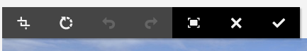
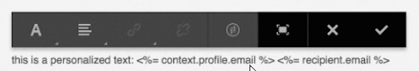
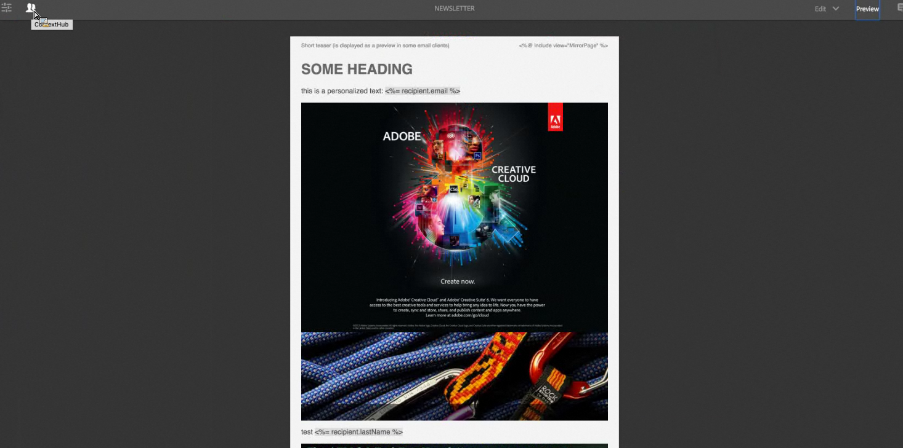
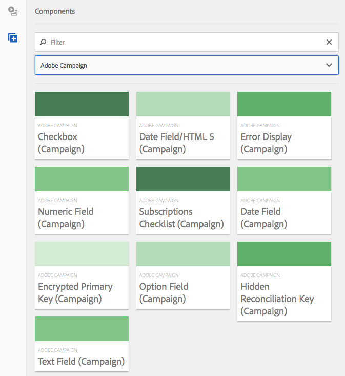
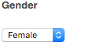

# Componentes de Adobe Campaign{#adobe-campaign-components}

Cuando integre un elemento con Adobe Campaign, tendrá componentes disponibles para cuando trabaje con boletines y formularios. Ambas opciones se describen en este documento.

>[!CAUTION]
>
>Los componentes de correo electrónico AEM han quedado obsoletos. Debido a la naturaleza del correo electrónico, que combina contenido y estilo, los componentes de correo electrónico proporcionados de forma predeterminada por AEM se vuelven de reutilización limitada para los clientes debido a la necesidad de implementar estilos personalizados en los componentes necesarios para los proyectos.
>
>Los componentes de correo electrónico se pueden implementar en el nivel de proyecto y los componentes de correo electrónico AEM obsoletos ilustran cómo se puede lograr. Sin embargo, estos componentes obsoletos no deben utilizarse en proyectos.

## Componentes del boletín de Adobe Campaign {#adobe-campaign-newsletter-components}

Todos los componentes de Campaign siguen las prácticas recomendadas que se describen en [Plantillas de prácticas recomendadas para el correo electrónico](/help/sites-administering/best-practices-for-email-templates.md) y se basan en el lenguaje de marcado [HTL](https://helpx.adobe.com/es/experience-manager/htl/using/overview.html) de Adobe.

Cuando abra un boletín o mensaje de correo que esté configurado para ser integrado con Adobe Campaign, debe comprobar los siguientes componentes de la sección **Boletín de Adobe Campaign**:

* Encabezado (Campaign)
* Imagen (Campaign)
* Vínculo (Campaign)
* Plantilla de imagen de Scene7 (Campaign)
* Referencia de destino (Campaign)
* Texto e imagen (Campaign)
* Texto y personalización (Campaign)

Una descripción de estos componentes se encuentra en la sección siguiente.

Los componentes se presentan del modo siguiente:

### Encabezado (Campaign) {#heading-campaign}

El componente Encabezado puede:

* Mostrar el nombre de la página actual; para ello, deje en blanco el campo **Título**.
* Mostrar un texto especificado en el campo **Título**.

Edite el componente **Encabezado (Campaign)** directamente. Déjelo vacío para utilizar el título de página.

Puede configurar lo siguiente:

* **Título** Si quiere utilizar un nombre distinto al del título de la página, introdúzcalo aquí.

* **Nivel de encabezado (1, 2, 3, 4)** Nivel de encabezado basado en los tamaños 1-4 del encabezado HTML.

En el siguiente ejemplo se muestra el componente Encabezado (Campaign) que se está visualizando.

### Imagen (Campaign) {#image-campaign}

El componente de imagen (Campaign) muestra una imagen y un texto de acompañamiento en función de los parámetros especificados.

Puede cargar una imagen y luego editarla y manipularla (por ejemplo, recortar, rotar y añadir un vínculo/título/texto).

Es posible arrastrar y soltar una imagen del [navegador](/help/sites-authoring/author-environment-tools.md#assetsbrowsertouchoptimizedui) directamente al componente o a su [cuadro de diálogo de configuración](/help/sites-authoring/editing-content.md#editconfigurecopycutdeletepastetouchoptimizedui). También es posible cargar una imagen del cuadro de diálogo de configuración; dicho cuadro de diálogo también controla las definiciones y manipulación de la imagen:

>[!NOTE]
>
>Debe introducir la información en el campo **Texto alternativo** o la imagen no se puede guardar.

Después de cargar la imagen (y no antes), puede utilizar [edición in situ](/help/sites-authoring/editing-content.md#editcontenttouchoptimizedui) para recortar/rotar la imagen según sea necesario:

>[!NOTE]
>
>El editor de la aplicación utiliza el tamaño original y la relación de aspecto de la imagen cuando se edita. También es posible especificar las propiedades de altura y anchura. Cualquier restricción de tamaño y de relación de aspecto se aplica cuando se guardan los cambios de edición.
>
>Según el caso, las restricciones mínimas y máximas se pueden imponer también mediante el [diseño de la página](/help/sites-developing/designer.md); se desarrollan durante la implementación del proyecto.

Dispone de varias opciones adicionales en el modo de edición de pantalla completa; por ejemplo, mapa y zoom: 

Al cargar una imagen, se pueden configurar los aspectos siguientes:

* **Planificar**
Para planificar una imagen, seleccione Planificar. Es posible especificar cómo será el mapa de imagen (un rectángulo, un polígono, etc.) y hacia dónde debe apuntar la zona.

* **Recortar**
Seleccione Recortar para recortar una imagen. Utilice el ratón para recortar la imagen.

* **Rotar**
Para rotar una imagen, seleccione Rotar. Utilícelo repetidamente hasta que la imagen rote hacia el lado que prefiera.

* **Borrar** Eliminar la imagen actual.

* Barra de zoom (solo clásica) Para hacer zoom en una imagen, utilice la barra desplegable debajo de la imagen (encima de los botones de Aceptar y Cancelar).
* **Título** Título de la imagen.

* **Texto alternativo** Texto alternativo para utilizar cuando se crea contenido accesible.

* **Vínculo a** Cree un vínculo a recursos u otras páginas en su página web.

* **Descripción** Descripción de la imagen.

* **Tamaño** Configure la altura y la anchura de la imagen.

>[!NOTE]
>
>Debe introducir la información en el campo **Texto alternativo** de la ficha **Avanzado**, o la imagen no se podrá guardar y verá el siguiente mensaje de error:
>
>`Validation failed. Verify the values of the marked fields.`

En el siguiente ejemplo se muestra el componente Imagen (Campaign) que se está visualizando.

### Vínculo (Campaign) {#link-campaign}

El componente Vínculo (Campaign) le permite añadir un vínculo al boletín.

Puede configurar lo siguiente en las fichas **Visualización**, **Información de la dirección URL** o **Avanzado**:

* **Pie de ilustración del vínculo** Es el pie de ilustración del vínculo. Este es el texto que los usuarios ven.

* **Información sobre herramientas del vínculo** Añade información adicional sobre cómo utilizar el vínculo.

* ****
LinkTypeEn la lista desplegable, seleccione entre una 
**Dirección** URL personalizada y un  **documento adaptable**. Este campo es obligatorio. Si selecciona una dirección URL personalizada, puede proporcionar la URL del vínculo. Si selecciona el documento adaptable, puede proporcionar la ruta de acceso del documento.

* **Parámetro de URL adicional** Añada cualquier parámetro de URL adicional. Haga clic en Añadir elemento para añadir varios elementos.

>[!NOTE]
>
>Debe introducir la información en el campo **Tipo de vínculo** en la pestaña **Información de URL**, o el componente no se puede guardar y verá el siguiente mensaje de error:
>
>`Validation failed. Verify the values of the marked fields.`

En el siguiente ejemplo se muestra el componente Vínculo (Campaign) que se está visualizando.

### Plantilla de imagen de Dynamic Media Classic (Scene7) (Campaign) {#scene-image-template-campaign}

Las plantillas de imagen de Dynamic Media Classic (Scene7) son archivos de imagen en capas, en los que el contenido y las propiedades se pueden parametrizar para la variabilidad. El componente **[!UICONTROL Plantilla de imagen]** le permite usar plantillas de Scene7 en los boletines y cambiar los valores de los parámetros de las plantillas. Además, puede utilizar variables de metadatos de Adobe Campaign dentro de los parámetros para que cada usuario experimente la imagen de forma personalizada.

Haga clic en **Editar** para configurar el componente. Puede configurar las opciones que se describen en esta sección. Esta plantilla de imagen de Scene7 se describe detalladamente en [Componente de plantilla de imagen de Scene7](/help/assets/scene7.md#image-template).

Además, el panel de parámetros muestra todos los parámetros de plantilla que se han definido para la plantilla en Scene7. Puede adaptar el valor, las variables a insertar o bien restaurarlas a su valor predeterminado en cada uno de esos parámetros.

### Referencia de destino (Campaign) {#targeted-reference-campaign}

El componente Referencia de destino (Campaign) le permite crear una referencia de un párrafo de destino.

En este componente, deberá ir al párrafo de destino para seleccionarlo.

Haga clic en el icono de carpeta para desplazarse hasta el párrafo al que desea hacer referencia. Cuando termine, haga clic en la marca de verificación.

### Texto e imagen (Campaign) {#text-image-campaign}

El componente Texto e imagen (Campaign) añade un bloque de texto y una imagen.

Cuando haga clic para configurar el componente, seleccione Texto o Imagen.

Si selecciona **Texto**, se muestra un editor en línea:

Al seleccionar **Imagen**, se muestra el editor in-situ de las imágenes:

Consulte [Componente de imagen (Campaign)](#image-campaign) para obtener más información sobre la utilización de imágenes. Consulte [Componente de texto y personalización (Campaign)](#text-personalization-campaign) para obtener más información sobre el trabajo con texto.

Al igual que con los componentes de texto y personalización (Campaign) e imagen (Campaign), puede configurar:

* **Texto**
Introduzca el texto. Utilice la barra de herramientas para modificar el formato, crear listas y añadir vínculos.

* **Imagen**
Arrastre una imagen desde el buscador de contenido o haga clic para echar una ojeada a la imagen. Recorte o gire, según sea necesario.

* **Propiedades de la imagen** (**Propiedades avanzadas de la imagen**)
Permite especificar lo siguiente:

   * **Título** El título del bloque se mostrará al pasar el cursor por encima.

   * **Texto alternativo** El texto alternativo que aparecerá si la imagen no se puede mostrar. 

   * **Vínculo a** Cree un vínculo a los recursos u otras páginas en su página web.

   * **Descripción** Descripción de la imagen.

   * **Tamaño** Configure la altura y la anchura de la imagen.

>[!NOTE]
>
>El campo **Texto alternativo** de la ficha **Avanzado** es necesario; de lo contrario, no se podrá guardar el componente y verá el siguiente mensaje de error:
>
>`Validation failed. Verify the values of the marked fields.`

En el siguiente ejemplo se muestra el componente Texto e imagen (Campaign) que se está visualizando.

### Texto y personalización (Campaign) {#text-personalization-campaign}

El componente Texto y personalización (Campaign) permite introducir un bloque de texto mediante un editor WYSIWYG, con funcionalidad proporcionada por el [editor de texto enriquecido](/help/sites-authoring/rich-text-editor.md). Además, este componente le permite utilizar los campos de contexto y los bloques de personalización disponibles en Adobe Campaign; consulte también [Insertar personalizaciones](/help/sites-authoring/campaign.md#inserting-personalization).

Una selección de iconos le permitirá dar formato a su texto, incluyendo las características de la fuente, la alineación, los vínculos, las listas y la sangría. La funcionalidad básicamente es la misma en [ambas IU](/help/sites-authoring/editing-content.md), aunque la apariencia es diferente:

En el editor directo puede añadir texto, cambiar la justificación, añadir y quitar vínculos, añadir campos de contexto o bloques de personalización y entrar en el modo de pantalla completa. Cuando haya terminado de añadir y personalizar elementos, seleccione la marca de verificación para guardar los cambios (o pulse x para cancelar). Consulte [Edición in situ](/help/sites-authoring/editing-content.md#editcontenttouchoptimizedui) para obtener más información.

>[!NOTE]
>
>* Los campos de personalización estarán disponibles dependiendo de la plantilla de Adobe Campaign a la que está vinculada el boletín.
>* Después de seleccionar una persona de ContextHub, los campos de personalización se sustituyen automáticamente con datos del perfil seleccionado.

>
>
Consulte [Insertar personalización](/help/sites-authoring/campaign.md#inserting-personalization).

>[!NOTE]
>
>Solo los campos definidos en **nms:seedMember** o en una de sus extensiones se tienen en cuentan. Los atributos de las tablas vinculadas a **nms:seedMember** no están disponibles.

## Componentes del formulario de Adobe Campaign {#adobe-campaign-form-components}

Utilice componentes de Adobe Campaign para crear un formulario que los usuarios deberán rellenar para suscribirse al boletín, cancelar la suscripción al mismo o actualizar sus perfiles. Consulte [Crear formularios de Adobe Campaign](/help/sites-authoring/adobe-campaign-forms.md) para obtener más información.

Cada campo del componente se puede vincular al campo de una base de datos de Adobe Campaign. Los campos disponibles varían según el tipo de datos que contienen, tal como se describe en la sección [Componentes y tipo de datos](#components-and-data-type). Si amplía el esquema de destinatarios en Adobe Campaign, los campos nuevos estarán disponibles en los componentes cuyos tipos de datos coincidan.

Cuando abra un formulario configurado para integrarse con Adobe Campaign, verá los siguientes componentes en la sección **Adobe Campaign**:

* Casilla (Campaign)
* Campo de fecha (Campaign) y Campo de fecha/HTML 5 (Campaign)
* Clave principal cifrada (Campaign)
* Visualización de error (Campaign)
* Clave de reconciliación oculta (Campaign)
* Campo numérico (Campaign)
* Campo de opciones (Campaign)
* Lista de comprobación de suscripciones (Campaign)
* Campo de texto (Campaign)

Los componentes se presentan del modo siguiente:

En esta sección se describe cada componente detalladamente.

### Componentes y tipos de datos {#components-and-data-type}

En la tabla siguiente se describen los componentes que pueden visualizar y modificar los datos de perfil de Adobe Campaign. Cada componente se puede asignar a un campo del perfil de Adobe Campaign para mostrar su valor y así actualizar el campo cuando se envíe el formulario. Los distintos componentes solo pueden coincidir con los campos de un tipo de datos determinado.

<table>
 <tbody>
  <tr>
   <td>
<strong>Componente</strong>
 </td>
   <td>
<strong>Tipo de datos del campo Adobe Campaign</strong>
 </td>
   <td>
<strong>Campo de ejemplo</strong>
 </td>
  </tr>
  <tr>
   <td>
Casilla (Campaign)
 </td>
   <td>
boolean
 </td>
   <td>
Ya no se puede contactar (por ningún canal)
 </td>
  </tr>
  <tr>
   <td>
Campo de fecha (Campaign)
 
Campo de fecha/HTML 5 (Campaign)
 </td>
   <td>
date
 </td>
   <td>
Fecha de nacimiento
 </td>
  </tr>
  <tr>
   <td>
Campo numérico (Campaign)
 </td>
   <td>
numérico (byte, corto, largo, doble)
 </td>
   <td>
Edad
 </td>
  </tr>
  <tr>
   <td>
Campo de opciones (Campaign)
 </td>
   <td>
byte con valores asociados
 </td>
   <td>
Sexo
 </td>
  </tr>
  <tr>
   <td>
Campo de texto (Campaign)
 </td>
   <td>
Cadena
 </td>
   <td>
Correo electrónico
 </td>
  </tr>
 </tbody>
</table>

### Configuración común de la mayoría de componentes {#settings-common-to-most-components}

Los componentes de Adobe Campaign tienen opciones de configuración que son comunes en todos los componentes (excepto la clave principal cifrada y los componentes de la clave de reconciliación oculta).

En la mayoría de los componentes puede configurar lo siguiente:

#### Título y texto {#title-and-text}

* **Título** Si quiere utilizar un nombre distinto al del elemento, introdúzcalo aquí.

* **Ocultar título** Seleccione esta casilla de verificación si no quiere que el título sea visible.

* **Descripción** Añada una descripción en el campo para proporcionar más información para los usuarios.

* **Mostrar solo el valor** Únicamente muestra el valor, si hubiera uno

#### Adobe Campaign {#adobe-campaign}

Puede configurar lo siguiente:

* **Asignar** Seleccione un campo de personalización de Adobe Campaign, si es necesario.

* **Clave de reconciliación** Seleccione esta casilla si este campo forma parte de la clave de reconciliación.

#### Restricciones {#constraints}

* **Obligatorio**  Seleccione esta casilla para que el componente sea obligatorio; es decir, que los usuarios tengan que introducir un valor.
* **Mensaje obligatorio**  De forma opcional, añada un mensaje que indique que el campo es obligatorio.

#### Estilo {#styling}

* **CSS** Incorpore las clases CSS que quiera utilizar para este componente.

### Casilla (Campaign) {#checkbox-campaign}

El componente Casilla (Campaign) permite al usuario modificar los campos de perfil de Adobe Campaign cuyo tipo de datos sea booleano. Por ejemplo, podría tener un componente Casilla (Campaign) que permite al destinatario especificar que no desea que nos pongamos en contacto con él a través de ningún canal.

Puede [configurar las opciones comunes a la mayoría de componentes de Adobe Campaign](#settings-common-to-most-components) en el componente Casilla (Campaign).

En el siguiente ejemplo se muestra el componente Casilla (Campaign) que se está visualizando.

### Campo de fecha (Campaign) y Campo de fecha/HTML 5 (Campaign) {#date-field-campaign-and-date-field-html-campaign}

Utilice el campo de fecha para permitir que los destinatarios especifiquen una fecha; por ejemplo, puede permitir que los destinatarios especifiquen sus fechas de nacimiento. El formato de la fecha coincide con el formato utilizado en la instancia de Adobe Campaign.

Además de [realizar la configuración común en la mayoría de los componentes de Adobe Campaign](#settings-common-to-most-components), puede configurar lo siguiente:

* **Menú desplegable Restricciones -** Restricción Puede seleccionar -  **** Sin  **fecha -** para añadir la restricción de una fecha o no establecerla. Si selecciona la fecha, la respuesta que los usuarios escriban en el campo debe estar en un formato de fecha.

* **Mensaje de restricción**  Además, puede añadir un mensaje de restricción para que los usuarios sepan cómo dar el formato correcto a sus respuestas.
* **Estilo -** AnchuraAjuste la anchura del campo tocando o haciendo clic en los iconos  **+** y  **-** o introduciendo un número.

En el siguiente ejemplo se muestra el componente Campo de fecha (Campaign) con el ancho ajustado que se está visualizando.

### Clave principal cifrada (Campaign) {#encrypted-primary-key-campaign}

Este componente define el nombre del parámetro de URL que contendrá el identificador de un perfil de Adobe Campaign (**identificador del recurso principal** o **clave principal cifrada** en Adobe Campaign Standard y 6.1, respectivamente).

Cada formulario que muestra y modifica los datos de perfil de Adobe Campaign **debe** incluir un componente de clave principal cifrada.

Puede configurar lo siguiente en el componente Clave principal cifrada (Campaign):

* **Título y texto: nombre de elementos** Valores predeterminados en EPK (encryptedPK). Solo debe cambiar el nombre del elemento cuando esté en conflicto con el nombre de otro elemento del formulario. Dos campos de formulario no pueden tener el mismo nombre de elemento.
* **Adobe Campaign: Parámetro de URL** Añadir el parámetro de URL para la EPK. Por ejemplo, puede utilizar el valor **EPK**.

En el siguiente ejemplo se muestra el componente Clave principal cifrada (Campaign) que se está visualizando.

### Visualización de error (Campaign) {#error-display-campaign}

Este componente le permite mostrar los errores de back-end. El control de errores del formulario debe establecerse en Reenviar para que el componente funcione correctamente.

En el siguiente ejemplo se muestra el componente Visualización de error (Campaign) que se está visualizando.

### Clave de reconciliación oculta (Campaign) {#hidden-reconciliation-key-campaign}

El componente Clave de reconciliación oculta (Campaign) le permite añadir campos ocultos como parte de la clave de reconciliación a un formulario.

Puede configurar lo siguiente en el componente Clave de reconciliación oculta (Campaign):

* **Título y texto: nombre de elementos** Valores predeterminados en clave de reconciliación. Solo debe cambiar el nombre del elemento cuando esté en conflicto con el nombre de otro elemento del formulario. Dos campos de formulario no pueden tener el mismo nombre de elemento.
* **Adobe Campaign: Asignación** Asignar a un campo de personalización de Adobe Campaign.

En el siguiente ejemplo se muestra el componente Clave de reconciliación oculta (Campaign) que se está visualizando.

### Campo numérico (Campaign) {#numeric-field-campaign}

Utilice el campo numérico para permitir que los destinatarios introduzcan números como, por ejemplo, su edad.

Además de [realizar la configuración común en la mayoría de los componentes de Adobe Campaign](#settings-common-to-most-components), puede configurar lo siguiente:

* **Menú desplegable Restricciones -** Restricción Puede seleccionar -  **** No  **numérico -** para agregar la restricción de un número o de ninguna restricción. Si selecciona el número, la respuesta que los usuarios escriban en el campo debe ser numérica.

* **Mensaje de restricción**  Además, puede añadir un mensaje de restricción para que los usuarios sepan cómo dar el formato correcto a sus respuestas.
* **Estilo -** AnchuraAjuste la anchura del campo tocando o haciendo clic en los iconos  **+** y  **-** o introduciendo un número.

En el siguiente ejemplo se muestra el componente Campo numérico (Campaign) con el ancho configurado que se está visualizando.

### Campo de opciones (Campaign) {#option-field-campaign}

Esta lista desplegable le permite seleccionar una opción; por ejemplo, el sexo o el estado de un destinatario.

Puede [configurar las opciones comunes a la mayoría de componentes de Adobe Campaign](#settings-common-to-most-components) en el componente Campo de opciones (Campaign). Para rellenar la lista desplegable, seleccione el campo correspondiente en los campos de personalización de Adobe Campaign; para ello, haga clic o pulse el símbolo de Adobe Campaign y desplácese hasta el campo.

En el siguiente ejemplo se muestra el componente Campo de opciones (Campaign) que se está visualizando.

### Lista de comprobación de suscripciones (Campaign) {#subscriptions-checklist-campaign}

Utilice el componente **Lista de comprobación de suscripciones (Campaign)** para modificar las suscripciones asociadas a un perfil de Adobe Campaign.

Cuando se añade a un formulario, este componente muestra todas las suscripciones disponibles a modo de casillas, y permite al usuario seleccionar las suscripciones que desee. Cuando los usuarios envían el formulario, este componente suscribe al usuario o cancela su suscripción de los servicios seleccionados según el tipo de acción del formulario (**Adobe Campaign: Suscripción a Servicios** o **Adobe Campaign: Cancele la suscripción a Servicios**).

>[!NOTE]
>
>El componente no comprueba a qué servicios está suscrito el usuario ni de cuáles canceló la suscripción.

Puede [configurar las opciones comunes a la mayoría de componentes de Adobe Campaign](#settings-common-to-most-components) en el componente Lista de comprobación de suscripciones (Campaign). (No hay ninguna configuración de Adobe Campaign disponible para este componente).

En el siguiente ejemplo se muestra el componente Lista de comprobación de suscripciones (Campaign) que se está visualizando.

### Campo de texto (Campaign) {#text-field-campaign}

El componente Campo de texto (Campaign) que le permite introducir referencias de tipo cadena, como el nombre, el apellido, la dirección, la dirección de correo electrónico, etc.

Además de [realizar la configuración común en la mayoría de los componentes de Adobe Campaign](#settings-common-to-most-components), puede configurar lo siguiente:

* **Menú desplegable Restricciones -** Restricciones Puede seleccionar:  **Ninguno,** **Correo electrónico** o  **Nombre**  (sin diéresis) - para añadir la restricción de una dirección de correo electrónico, un nombre o ninguna restricción. Si selecciona el correo electrónico, la respuesta que los usuarios escriban en el campo debe ser una dirección de correo electrónico. Si selecciona el nombre, la respuesta debe ser un nombre (la diéresis no se admite).

* **Mensaje de restricción**  Además, puede añadir un mensaje de restricción para que los usuarios sepan cómo dar el formato correcto a sus respuestas.
* **Estilo -** AnchuraAjuste la anchura del campo tocando o haciendo clic en los iconos  **+** y  **-** o introduciendo un número.

En el siguiente ejemplo se muestra el componente Campo de texto (Campaign) que se está visualizando.

