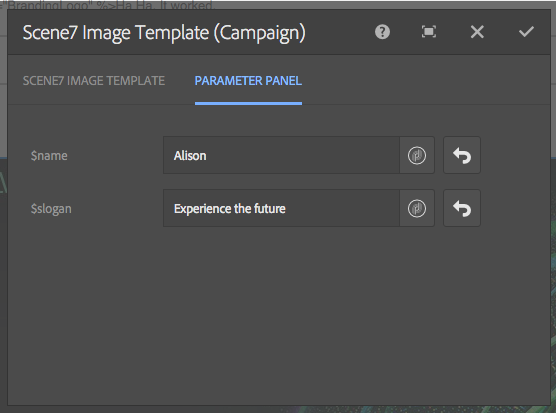

# Componentes de Adobe Campaign{#adobe-campaign-components}

Cuando integre con Adobe Campaign, tendrá componentes disponibles para cuando trabaje con boletines informativos y formularios. Ambas se describen en este documento.

>[!CAUTION]
>
>Los componentes de correo electrónico AEM han quedado obsoletos. Debido a la naturaleza del correo electrónico, que combina contenido y estilo, los componentes de correo electrónico proporcionados de forma predeterminada por AEM se vuelven de reutilización limitada para los clientes debido a la necesidad de implementar estilos personalizados en los componentes necesarios para los proyectos.
>
>Los componentes de correo electrónico se pueden implementar en el nivel de proyecto y los componentes de correo electrónico AEM obsoletos ilustran cómo se puede lograr. Sin embargo, estos componentes obsoletos no deben utilizarse en proyectos.

## Componentes del boletín de Adobe Campaign {#adobe-campaign-newsletter-components}

Todos los componentes de Campaign siguen las prácticas recomendadas descritas en [Prácticas recomendadas para plantillas de correo electrónico](/help/sites-administering/best-practices-for-email-templates.md) y se basan en el lenguaje de marcado de Adobe [HTL](https://helpx.adobe.com/es/experience-manager/htl/using/overview.html).

Cuando abra un boletín o correo electrónico configurado para integrarse con Adobe Campaign, debería ver los siguientes componentes en la sección **Newsletter de Adobe Campaign** sección:

* Encabezado (Campaign)
* Imagen (Campaign)
* Vínculo (campaña)
* Plantilla de imagen de Scene7 (Campaign)
* Referencia de destino (Campaign)
* Texto e imagen (Campaign)
* Texto y personalización (Campaign)

En la siguiente sección se describe estos componentes.

Los componentes aparecen de la siguiente manera:

### Encabezado (Campaign) {#heading-campaign}

El componente Encabezado puede:

* Muestre el nombre de la página actual; para ello, deje la variable **Título** campo en blanco.
* Mostrar un texto especificado en la **Título** campo .

Edite el **Encabezado (Campaign)** directamente. Dejar vacío para utilizar el título de página.

Puede configurar lo siguiente:

* **Título**
Si desea utilizar un nombre que no sea el título de la página, introdúzcalo aquí.

* **Nivel de encabezado (1, 2, 3, 4)**
Nivel de encabezado basado en los tamaños de encabezamiento del HTML 1-4.

En el siguiente ejemplo se muestra el componente Encabezado (Campaign) que se está visualizando.

### Imagen (Campaign) {#image-campaign}

El componente de imagen (campaña) muestra una imagen y un texto de acompañamiento en función de los parámetros especificados.

Puede cargar una imagen y, a continuación, editarla y manipularla (por ejemplo, recortar, rotar y añadir un vínculo/título/texto).

Puede arrastrar y soltar una imagen desde el [Navegador de recursos](/help/sites-authoring/author-environment-tools.md#assetsbrowsertouchoptimizedui) directamente en el componente o su [Cuadro de diálogo Configurar](/help/sites-authoring/editing-content.md#editconfigurecopycutdeletepastetouchoptimizedui). También puede cargar una imagen desde el cuadro de diálogo Configurar ; este cuadro de diálogo también controla todas las definiciones y manipulaciones de la imagen:

>[!NOTE]
>
>Debe introducir la información en el **Texto alternativo** o la imagen no se puede guardar.

Después de cargar la imagen (y no antes), puede usar [edición in situ](/help/sites-authoring/editing-content.md#editcontenttouchoptimizedui) para recortar/rotar la imagen según sea necesario:

>[!NOTE]
>
>El editor de la aplicación utiliza el tamaño original y la relación de aspecto de la imagen al editarla. También puede especificar propiedades de altura y anchura. Cualquier restricción de tamaño y relación de aspecto se aplica cuando se guardan los cambios de edición.
>
>En función de su caso, las restricciones mínimas y máximas también pueden ser impuestas por la variable [diseño de la página](/help/sites-developing/designer.md); estos se desarrollan durante la ejecución del proyecto.

Hay varias opciones adicionales disponibles en el modo de edición de pantalla completa; por ejemplo, mapa y zoom:

Cuando se carga una imagen, se puede configurar lo siguiente:

* **Mapa**
Para asignar una imagen, seleccione Asignar. Puede especificar cómo desea crear el mapa de imagen (rectángulo, polígono, etc.) y hacia dónde debe apuntar el área.

* **Recortar**
Seleccione Recortar para recortar una imagen. Utilice el ratón para recortar la imagen.

* **Rotar**
Para girar una imagen, seleccione Rotar. Utilícelo repetidamente hasta que la imagen gire de la manera que desee.

* **Borrar**
Elimine la imagen actual.

* Barra de zoom (solo clásica) Para acercar y alejar la imagen, utilice la barra de deslizamiento situada debajo de la imagen (encima de los botones Aceptar y Cancelar)
* **Título**
Título de la imagen.

* **Texto alternativo**
Texto alternativo para usar al crear contenido accesible.

* **Vincular a**
Cree un vínculo a los recursos u otras páginas dentro del sitio web.

* **Descripción**
Descripción de la imagen.

* **Tamaño**
Define la altura y la anchura de la imagen.

>[!NOTE]
>
>Debe introducir la información en el **Texto alternativo** en el campo **Avanzadas** o la imagen no se puede guardar y verá el siguiente mensaje de error:
>
>`Validation failed. Verify the values of the marked fields.`

En el siguiente ejemplo se muestra el componente Imagen (Campaign) que se está visualizando.

### Vínculo (campaña) {#link-campaign}

El componente Vínculo (Campaign) le permite añadir un vínculo al boletín informativo.

Puede configurar lo siguiente en la sección **Mostrar**, **Información de URL** o **Avanzadas** pestañas:

* **Rótulo de vínculo**
Pie de ilustración del vínculo. Este es el texto que ven los usuarios.

* **Información del objeto Link**
Agrega información adicional sobre cómo utilizar el vínculo.

* **LinkType**
En la lista desplegable, seleccione entre 
**Dirección URL personalizada** y **Documento adaptable**. Este campo es obligatorio. Si selecciona URL personalizada, puede proporcionar la URL del vínculo. Si selecciona Documento adaptable, puede proporcionar la ruta del documento.

* **Parámetro de URL adicional**
Añada cualquier parámetro de URL adicional. Haga clic en Agregar elemento para agregar varios elementos.

>[!NOTE]
>
>Debe introducir la información en el **Tipo de vínculo** en el campo **Información de URL** o el componente no se puede guardar y verá el siguiente mensaje de error:
>
>`Validation failed. Verify the values of the marked fields.`

En el siguiente ejemplo se muestra el componente Vínculo (Campaign) que se está visualizando.

### Plantilla de imagen de Dynamic Media Classic (Scene7) (Campaign) {#scene-image-template-campaign}

Las plantillas de imagen de Dynamic Media Classic (Scene7) son archivos de imagen en capas, donde el contenido y las propiedades se pueden parametrizar para la variabilidad. La variable **[!UICONTROL Plantilla de imagen]** permite utilizar plantillas de Scene7 en los boletines informativos y cambiar los valores de los parámetros de plantilla. Además, puede utilizar variables de metadatos de Adobe Campaign dentro de los parámetros para que cada usuario experimente la imagen de forma personalizada.

Haga clic en **Editar** para configurar el componente. Puede configurar las opciones que se describen en esta sección. Esta plantilla de imagen de Scene7 se describe detalladamente en [Componente Plantilla de imagen de Scene7](/help/assets/scene7.md#image-template).

Además, el panel de parámetros enumera todos los parámetros de plantilla que se han definido para la plantilla en Scene7. Para cada uno de estos parámetros, puede adaptar el valor, insertar variables o restablecerlas a su valor predeterminado.

### Referencia de destino (Campaign) {#targeted-reference-campaign}

El componente Referencia de destino (Campaign) permite crear una referencia a un párrafo de destino.

En este componente, vaya al párrafo de destino para seleccionarlo.

Haga clic en el icono de la carpeta para desplazarse hasta el párrafo al que desea hacer referencia. Cuando termine, haga clic en la marca de verificación.

### Texto e imagen (Campaign) {#text-image-campaign}

El componente Texto e imagen (Campaign) añade un bloque de texto y una imagen.

Al hacer clic en para configurar el componente, se selecciona Texto o Imagen.

Selección **Texto** muestra un editor en línea:

Selección **Imagen** muestra el editor in-situ para imágenes:

Consulte [Componente de imagen (Campaign)](#image-campaign) para obtener más información sobre cómo trabajar con imágenes. Consulte [Componente Texto y personalización (Campaign)](#text-personalization-campaign) para obtener más información sobre cómo trabajar con texto.

Al igual que con los componentes Texto y personalización (Campaign) e Imagen (Campaign) , puede configurar:

* **Texto**
Escriba texto. Utilice la barra de herramientas para modificar el formato, crear listas y añadir vínculos.

* **Imagen**
Arrastre una imagen desde el buscador de contenido o haga clic para buscar una imagen. Recorte o gire según sea necesario.

* **Propiedades de imagen** (**Propiedades de imagen avanzadas**) Permite especificar lo siguiente:

   * **Título**
Título del bloque; se mostrará pasando el ratón.

   * **Texto alternativo**
Texto alternativo que se mostrará si la imagen no se puede mostrar.

   * **Vincular a**
Cree un vínculo a los recursos u otras páginas dentro del sitio web.

   * **Descripción**
Descripción de la imagen.

   * **Tamaño**
Define la altura y la anchura de la imagen.

>[!NOTE]
>
>La variable **Texto alternativo** en el campo **Avanzadas** es obligatorio o el componente no se puede guardar y verá el siguiente mensaje de error:
>
>`Validation failed. Verify the values of the marked fields.`

En el siguiente ejemplo se muestra el componente Texto e imagen (Campaign) que se está visualizando.

### Texto y personalización (Campaign) {#text-personalization-campaign}

El componente Texto y personalización (Campaign) permite introducir un bloque de texto utilizando un editor WYSIWYG, con la funcionalidad proporcionada por el [Editor de texto enriquecido](/help/sites-authoring/rich-text-editor.md). Además, este componente permite utilizar campos de contexto y bloques de personalización disponibles en Adobe Campaign; también consulte [Inserción de personalización](/help/sites-authoring/campaign.md#inserting-personalization).

La selección de iconos permite dar formato al texto, incluyendo características de fuente, alineación, vínculos, listas y sangría. La funcionalidad básicamente es la misma en [ambas IU](/help/sites-authoring/editing-content.md), aunque la apariencia es diferente:

En el editor in situ puede añadir texto, cambiar la justificación, añadir y quitar vínculos, añadir campos de contexto o bloques de personalización y entrar en el modo de pantalla completa. Cuando termine de agregar texto/personalización, seleccione la marca de verificación para guardar los cambios (o x para cancelar). Consulte [Edición in situ](/help/sites-authoring/editing-content.md#editcontenttouchoptimizedui) para obtener más información.

>[!NOTE]
>
>* Los campos de personalización disponibles dependen de la plantilla de Adobe Campaign a la que esté vinculada la newsletter.
>* Después de seleccionar una persona de ContextHub, los campos de personalización se sustituyen automáticamente por datos del perfil seleccionado.
>
>Consulte [Inserción de personalización](/help/sites-authoring/campaign.md#inserting-personalization).

>[!NOTE]
>
>Solo los campos definidos en la variable **nms:seedMember** se tienen en cuenta el esquema o una de sus extensiones. Los atributos de las tablas vinculadas a **nms:seedMember** no están disponibles.

## Componentes de formulario de Adobe Campaign {#adobe-campaign-form-components}

Los componentes de Adobe Campaign se utilizan para crear un formulario que los usuarios rellenen para suscribirse a un boletín, cancelar la suscripción a un boletín o actualizar sus perfiles de usuario. Consulte [Creación de Adobe Campaign Forms](/help/sites-authoring/adobe-campaign-forms.md) para obtener más información.

Cada campo de componente se puede vincular a un campo de base de datos de Adobe Campaign. Los campos disponibles difieren según el tipo de datos que contienen, tal como se describe en la sección [Componentes y tipo de datos](#components-and-data-type). Si amplía el esquema de destinatarios en Adobe Campaign, los nuevos campos estarán disponibles en los componentes cuyos tipos de datos coincidan.

Cuando abra un formulario configurado para integrarse con Adobe Campaign, verá los siguientes componentes en la variable **Adobe Campaign** sección:

* Casilla (Campaign)
* Campo de fecha (Campaign) y Campo de fecha/HTML5 (Campaign)
* Clave principal cifrada (Campaign)
* Visualización de error (Campaign)
* Clave de reconciliación oculta (Campaign)
* Campo numérico (Campaign)
* Campo de opción (Campaign)
* Lista de comprobación de suscripciones (Sightly)
* Campo de texto (Campaign)

Los componentes aparecen de la siguiente manera:

En esta sección se describe cada componente en detalle.

### Componentes y tipo de datos {#components-and-data-type}

En la tabla siguiente se describen los componentes disponibles para mostrar y modificar los datos de perfil de Adobe Campaign. Cada componente se puede asignar a un campo de perfil de Adobe Campaign para mostrar su valor y actualizar el campo cuando se envíe el formulario. Los distintos componentes solo pueden coincidir con campos de un tipo de datos adecuado.

<table>
 <tbody>
  <tr>
   <td>
<strong>Componente</strong>
 </td>
   <td>
<strong>Tipo de datos del campo Adobe Campaign</strong>
 </td>
   <td>
<strong>Campo de ejemplo</strong>
 </td>
  </tr>
  <tr>
   <td>
Casilla (Campaign)
 </td>
   <td>
booleano
 </td>
   <td>
Ya no se puede contactar (por ningún canal)
 </td>
  </tr>
  <tr>
   <td>
Campo de fecha (Campaign)
 
Campo de fecha/HTML 5 (Campaign)
 </td>
   <td>
fecha
 </td>
   <td>
Fecha de nacimiento
 </td>
  </tr>
  <tr>
   <td>
Campo numérico (Campaign)
 </td>
   <td>
numérico (byte, corto, largo, doble)
 </td>
   <td>
Edad
 </td>
  </tr>
  <tr>
   <td>
Campo de opción (Campaign)
 </td>
   <td>
byte con valores asociados
 </td>
   <td>
Sexo
 </td>
  </tr>
  <tr>
   <td>
Campo de texto (Campaign)
 </td>
   <td>
cadena
 </td>
   <td>
Correo electrónico
 </td>
  </tr>
 </tbody>
</table>

### Configuración común a la mayoría de componentes {#settings-common-to-most-components}

Los componentes de Adobe Campaign tienen configuraciones comunes en todos los componentes (excepto los componentes Clave principal cifrada y Clave de reconciliación oculta).

En la mayoría de los componentes, puede configurar lo siguiente:

#### Título y texto {#title-and-text}

* **Título**
Si desea utilizar un nombre que no sea el nombre del elemento, introdúzcalo aquí.

* **Ocultar título**
Seleccione esta casilla de verificación si no desea que el título sea visible.

* **Descripción**
Añada una descripción al campo para proporcionar más información para los usuarios.

* **Mostrar solo valor**
Solo muestra el valor, si hay uno

#### Adobe Campaign {#adobe-campaign}

Puede configurar lo siguiente:

* **Asignación**
Seleccione un campo de personalización de Adobe Campaign, si corresponde.

* **Clave de reconciliación**
Seleccione esta casilla de verificación si este campo forma parte de la clave de reconciliación.

#### Restricciones {#constraints}

* **Requerido** Seleccione esta casilla de verificación para que este componente sea necesario; es decir, los usuarios deben introducir un valor.
* **Mensaje obligatorio** De forma opcional, añada un mensaje que indique que el campo es obligatorio.

#### Estilo {#styling}

* **CSS**
Introduzca las clases CSS que desee utilizar para este componente.

### Casilla (Campaign) {#checkbox-campaign}

El componente Casilla (Campaign) permite al usuario modificar los campos de perfil de Adobe Campaign que son de tipo booleano de datos. Por ejemplo, puede tener un componente Casilla (Campaign) que permita al destinatario especificar que no desea que se le contacte a través de ningún canal.

Puede [configuración común a la mayoría de componentes de Adobe Campaign](#settings-common-to-most-components) en el componente Casilla (Campaign).

En el siguiente ejemplo se muestra el componente Casilla (Campaign) que se está visualizando.

### Campo de fecha (Campaign) y Campo de fecha/HTML 5 (Campaign) {#date-field-campaign-and-date-field-html-campaign}

Utilice el campo date para permitir que los destinatarios alcancen una fecha; por ejemplo, puede que desee que los destinatarios especifiquen sus fechas de nacimiento. El formato de fecha coincide con el formato utilizado en la instancia de Adobe Campaign.

Además de [configuración común a la mayoría de componentes de Adobe Campaign](#settings-common-to-most-components), puede configurar lo siguiente:

* **Restricciones - Restricción** desplegable Puede seleccionar - **Ninguna** o **Fecha -** para añadir la restricción de una fecha o no añadir ninguna restricción. Si selecciona fecha, la respuesta que los usuarios escriban en el campo debe tener un formato de fecha.

* **Mensaje de restricción** Además, puede añadir un mensaje de restricción para que los usuarios sepan cómo dar formato a sus respuestas.
* **Estilo - Anchura** Ajuste la anchura del campo tocando o haciendo clic en el **+** y **-** o escribir un número.

En el siguiente ejemplo se muestra el componente Campo de fecha (Campaign) con el ancho ajustado que se está visualizando.

### Clave principal cifrada (Campaign) {#encrypted-primary-key-campaign}

Este componente define el nombre del parámetro de URL que contendrá el identificador de un perfil de Adobe Campaign (**Identificador de recurso principal** o **Clave principal cifrada** en Adobe Campaign Standard y 6.1, respectivamente).

Cada formulario que muestra y modifica los datos de perfil de Adobe Campaign **must** incluir un componente Clave principal cifrada.

Puede configurar lo siguiente en el componente Clave principal cifrada (Campaign):

* **Título y texto: Nombre del elemento** El valor predeterminado es encryptionPK. Solo es necesario cambiar el nombre del elemento cuando esté en conflicto con el nombre de otro elemento del formulario. Dos campos de formulario no pueden tener el mismo nombre de elemento.
* **Adobe Campaign: parámetro de URL** Añada el parámetro URL para la EPK. Por ejemplo, puede utilizar el valor **epk**.

En el siguiente ejemplo se muestra el componente Clave principal cifrada (Campaign) que se está visualizando.

### Visualización de error (Campaign) {#error-display-campaign}

Este componente permite mostrar errores de back-end. La gestión de errores del formulario debe configurarse como Reenviar para que el componente funcione correctamente.

En el siguiente ejemplo se muestra el componente Visualización de error (Campaign) que se está visualizando.

### Clave de reconciliación oculta (Campaign) {#hidden-reconciliation-key-campaign}

El componente Clave de reconciliación oculta (Campaign) le permite añadir campos ocultos como parte de la clave de reconciliación a un formulario.

Puede configurar lo siguiente en el componente Clave de reconciliación oculta (Campaign):

* **Título y texto: Nombre del elemento** Toma el valor predeterminado reconcilKey. Solo es necesario cambiar el nombre del elemento cuando esté en conflicto con el nombre de otro elemento del formulario. Dos campos de formulario no pueden tener el mismo nombre de elemento.
* **Adobe Campaign: asignación** Asigne a un campo de personalización de Adobe Campaign.

En el siguiente ejemplo se muestra el componente Clave de reconciliación oculta (Campaign) que se está visualizando.

### Campo numérico (Campaign) {#numeric-field-campaign}

Utilice el campo numérico para permitir que los destinatarios introduzcan números, por ejemplo su edad.

Además de [configuración común a la mayoría de componentes de Adobe Campaign](#settings-common-to-most-components), puede configurar lo siguiente:

* **Restricciones - Restricción** desplegable Puede seleccionar - **Ninguna** o **Numérico -** para añadir la restricción de un número o sin restricción. Si selecciona un número, la respuesta que los usuarios escriban en el campo debe ser numérica.

* **Mensaje de restricción** Además, puede añadir un mensaje de restricción para que los usuarios sepan cómo dar formato a sus respuestas.
* **Estilo - Anchura** Ajuste la anchura del campo tocando o haciendo clic en el **+** y **-** o escribir un número.

En el siguiente ejemplo se muestra un componente Campo numérico (Campaign) con el ancho configurado que se está visualizando.

### Campo de opción (Campaign) {#option-field-campaign}

Esta lista desplegable permite seleccionar una opción; por ejemplo, el sexo o el estado de un destinatario.

Puede [configuración común a la mayoría de componentes de Adobe Campaign](#settings-common-to-most-components) en el componente Campo de opciones (Campaign). Para rellenar la lista desplegable, seleccione el campo correspondiente en los campos de personalización de Adobe Campaign tocando o haciendo clic en el símbolo de Adobe Campaign y navegando hasta el campo .

En el siguiente ejemplo se muestra el componente Campo de opciones (Campaign) que se está visualizando.

### Lista de comprobación de suscripciones (Sightly) {#subscriptions-checklist-campaign}

Utilice la variable **Lista de comprobación de suscripciones (Campaign)** para modificar las suscripciones asociadas a un perfil de Adobe Campaign.

Cuando se agrega a un formulario, este componente muestra todas las suscripciones disponibles como casillas de verificación y permite al usuario seleccionar las suscripciones que desee. Cuando los usuarios envían el formulario, este componente suscribe al usuario o cancela su suscripción de los servicios seleccionados según el tipo de acción del formulario (**Adobe Campaign: Suscripción a servicios** o **Adobe Campaign: Cancelar suscripción a los servicios**).

>[!NOTE]
>
>El componente no comprueba a qué servicios se ha suscrito o dado de baja el usuario.

Puede [configuración común a la mayoría de componentes de Adobe Campaign](#settings-common-to-most-components) en el componente Lista de comprobación de suscripciones (Campaign) . (No hay configuraciones de Adobe Campaign disponibles para este componente).

En el siguiente ejemplo se muestra el componente Lista de comprobación de suscripciones (Campaign) que se está visualizando.

### Campo de texto (Campaign) {#text-field-campaign}

El componente Campo de texto (Campaign) que permite introducir datos de tipo cadena, como nombre, apellidos, dirección, dirección de correo electrónico, etc.

Además de [configuración común a la mayoría de componentes de Adobe Campaign](#settings-common-to-most-components), puede configurar lo siguiente:

* **Restricciones - Restricción** desplegable Puede seleccionar - **Ninguno,** **Correo electrónico** o **Nombre** (sin diéresis): para añadir la restricción de una dirección de correo electrónico, un nombre o ninguna restricción. Si selecciona el correo electrónico, la respuesta que los usuarios escriban en el campo debe ser una dirección de correo electrónico. Si selecciona un nombre, debe ser un nombre (no se permiten diéresis).

* **Mensaje de restricción** Además, puede añadir un mensaje de restricción para que los usuarios sepan cómo dar formato a sus respuestas.
* **Estilo - Anchura** Ajuste la anchura del campo tocando o haciendo clic en el **+** y **-** o escribir un número.

En el siguiente ejemplo se muestra el componente Campo de texto (Campaign) que se está visualizando.

