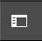
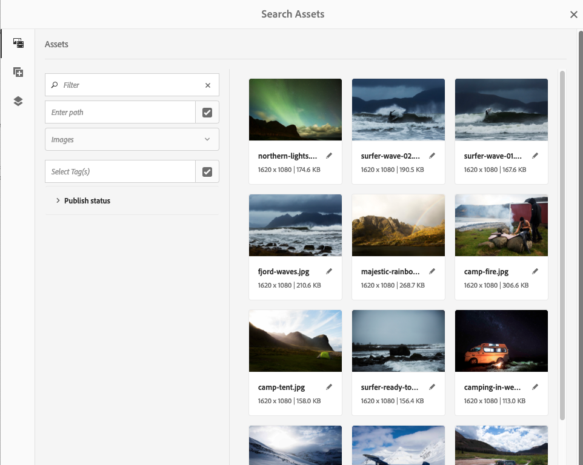
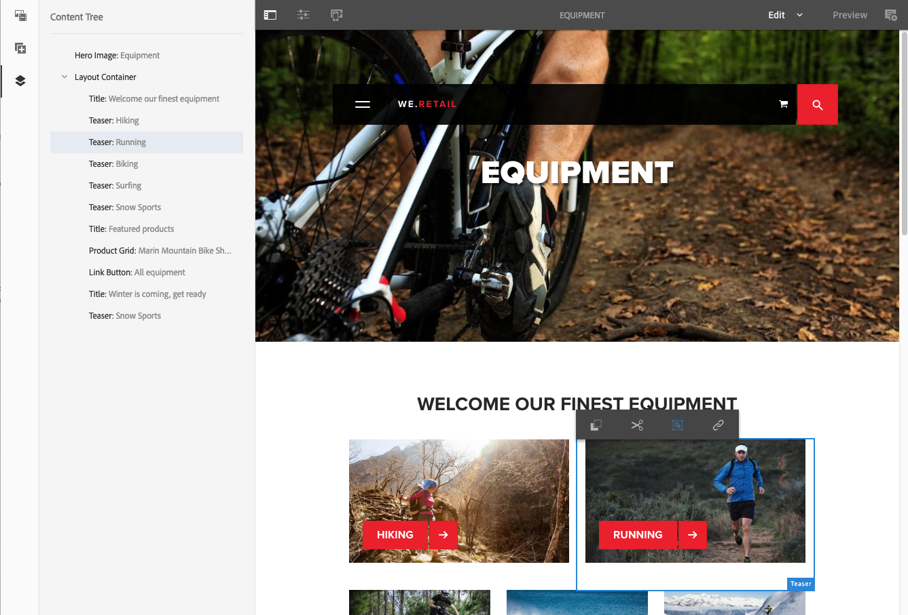
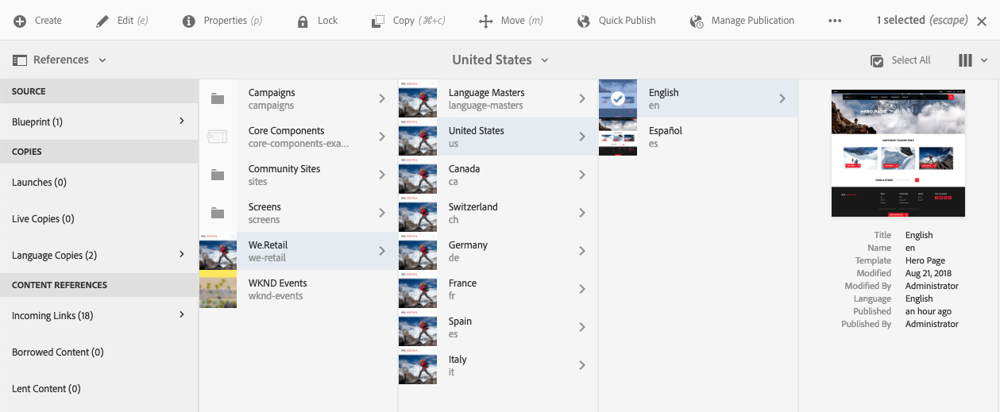

# Creación: entorno y herramientas{#authoring-the-environment-and-tools}

El entorno de creación AEM ofrece varios mecanismos para organizar y editar el contenido. Se puede acceder a las herramientas desde varios editores de páginas y consolas.

## Administración del sitio {#managing-your-site}

La variable **Sitios** consola le permite desplazarse por su sitio web y administrarlo mediante la barra de encabezado, la barra de herramientas, los iconos de acción (aplicables al recurso seleccionado), las rutas de exploración y, cuando se seleccionan, los carriles secundarios (por ejemplo, referencias y línea de tiempo).

Por ejemplo, la vista de columna:

## Edición del contenido de una página {#editing-page-content}

Puede editar una página con el editor de páginas. Por ejemplo:

`https://localhost:4502/editor.html/content/we-retail/us/en/equipment.html`

>[!NOTE]
>
>La primera vez que abra una página para editarla, una serie de diapositivas le proporcionarán un recorrido por las funciones.
>
>Si lo desea, puede omitir la visita y repetirla en cualquier momento seleccionando una de las opciones del **Información de la página** para abrir el Navegador.

## Acceso a la Ayuda   {#accessing-help}

Al editar una página, se puede acceder a la **Ayuda** desde los siguientes puntos:

* el [**Información de la página**](/help/sites-authoring/editing-page-properties.md#page-properties) selector; se mostrarán las diapositivas introductorias (tal y como se muestran la primera vez que se accede al editor).
* el [configuración](/help/sites-authoring/editing-content.md#edit-configure-copy-cut-delete-paste) para componentes específicos (con el icono ? en la barra de herramientas del cuadro de diálogo); esto mostrará ayuda contextual.

Más [los recursos relacionados con la ayuda están disponibles en las consolas](/help/sites-authoring/basic-handling.md#accessing-help).

## Navegador de componentes   {#components-browser}

El navegador de componentes muestra todos los componentes que se pueden utilizar en la página actual. Se pueden arrastrar a la ubicación adecuada y editarse para añadir contenido.

El navegador de componentes es una pestaña del panel lateral (junto con el [explorador de recursos](/help/sites-authoring/author-environment-tools.md#assets-browser) y el [árbol de contenido](/help/sites-authoring/author-environment-tools.md#content-tree)). Para abrir (o cerrar) el panel lateral, utilice el icono de la parte superior izquierda de la barra de herramientas:

Cuando abra el panel lateral, se deslizará para abrirse de izquierda a derecha (seleccione la pestaña **Componentes** si es necesario). Cuando se abra, podrá navegar por todos los componentes disponibles para su página.

El aspecto y el control dependerán del tipo de dispositivo que esté utilizando:

>[!NOTE]
>
>Se detectará un dispositivo móvil si la anchura es inferior a 1024 píxeles. Este también puede ser el caso de una ventana de escritorio pequeña.

* **Dispositivo móvil (por ejemplo, iPad)**

   El navegador de componentes cubre completamente la página que se está editando.

   Para añadir un componente a la página mantenga pulsado el componente requerido y muévalo a la derecha (el navegador de componentes se cerrará para volver a mostrar la página) donde puede colocar el componente.

   

* **Dispositivo de escritorio**

   El navegador de componentes se abre en la parte izquierda de la ventana.

   Para añadir un componente a la página, haga clic en el componente requerido y arrástrelo a la ubicación requerida.

   

   Los componentes se representan mediante

   * Nombre del componente
   * Grupo de componentes (en gris)
   * Icono o abreviatura

      * Los iconos de los componentes estándar son monocromos.
      * Las abreviaturas siempre son los dos primeros caracteres del nombre del componente.

   Desde la barra de herramientas superior del explorador de **componentes**, puede realizar las siguientes acciones:

   * Filtrar componentes por su nombre.
   * Restringir la visualización a un grupo específico mediante la selección desplegable.

   Para obtener una descripción más detallada del componente, puede hacer clic o pulsar el icono de información situado junto al componente en el navegador de **componentes** (si está disponible). Por ejemplo, para el **contenedor de diseños**:

   

   Para obtener más información sobre los componentes disponibles, consulte la [Consola de componentes](/help/sites-authoring/default-components-console.md).

## Navegador de recursos {#assets-browser}

El navegador de recursos muestra todos los [activos](/help/assets/home.md) que están disponibles para su uso directo en su página actual.

El navegador de recursos es una ficha del panel lateral junto con el [navegación por componentes](/help/sites-authoring/author-environment-tools.md#components-browser)r y [árbol de contenido](/help/sites-authoring/author-environment-tools.md#content-tree). Para abrir o cerrar el panel lateral, utilice el icono de la parte superior izquierda de la barra de herramientas:

Cuando abra el panel lateral, se deslizará para abrirse de izquierda a derecha. Seleccione la pestaña **Recursos** si es necesario.

Cuando el navegador de recursos esté abierto, podrá navegar por todos los recursos disponibles para su página. El desplazamiento infinito se utiliza para expandir la lista cuando es necesario.

Para agregar un recurso a la página, selecciónelo y arrástrelo a la ubicación requerida. Esto puede ser:

* Un componente existente del tipo adecuado.

   * Por ejemplo, puede arrastrar un recurso de tipo imagen hacia un componente de imagen.

* Un [marcador de posición](/help/sites-authoring/editing-content.md#component-placeholder) en el sistema de párrafos para crear un componente nuevo del tipo correspondiente.

   * Por ejemplo, puede arrastrar un recurso de tipo imagen al sistema de párrafos para crear un componente de imagen.

>[!NOTE]
>
>Esta opción está disponible para recursos específicos y tipos de componentes. Consulte [Inserción de un componente mediante el navegador de recursos](/help/sites-authoring/editing-content.md#inserting-a-component-using-the-assets-browser) para obtener más información.

Desde la barra de herramientas superior del navegador de recursos, puede filtrar los recursos de la siguiente manera:

* Nombre
* Ruta
* Tipo de recurso, como imágenes, manuscritos, documentos, vídeos, páginas, párrafos y productos
* Características de los recursos, como Orientación (Vertical, Horizontal, Cuadrado) y Estilo (Color, Monocromo, Escala de grises)

   * Disponible solo para determinados tipos de recursos

El aspecto y el control dependerán del tipo de dispositivo que esté utilizando:

>[!NOTE]
>
>Se detectará un dispositivo móvil cuando la anchura sea menor a 1024 píxeles; es decir, también cuando la ventana de escritorio sea pequeña.

* **Dispositivo móvil como iPad**

   El navegador de recursos cubre completamente la página que se está editando.

   Para añadir un recurso a la página mantenga pulsado el recurso en cuestión y muévalo a la derecha; el navegador de recursos se cerrará para volver a mostrar la página, donde puede añadir el recurso al componente en cuestión.

   

* **Dispositivo de escritorio**

   El navegador de recursos se abre en la parte izquierda de la ventana.

   Para agregar un recurso a la página, haga clic en el recurso en cuestión y arrástrelo al componente o la ubicación necesarios.

   

Si necesita realizar rápidamente un cambio en un recurso, puede iniciar el [editor de recursos](/help/assets/manage-assets.md) directamente desde el explorador de recursos haciendo clic en el icono de edición que se muestra al lado del nombre del recurso.

## Árbol de contenido {#content-tree}

La variable **Árbol de contenido** proporciona información general sobre todos los componentes de la página en una jerarquía para que pueda ver de un vistazo cómo está compuesta la página.

El árbol de contenido es una pestaña del panel lateral (junto con el explorador de recursos y componentes). Para abrir (o cerrar) el panel lateral, utilice el icono de la parte superior izquierda de la barra de herramientas:

Cuando abra el panel lateral, se deslizará para abrirse (de izquierda a derecha). Seleccione la pestaña **Árbol de contenido** si es necesario. Cuando se abra, podrá ver una representación de vista de árbol de su página o plantilla, de modo que sea más fácil comprender cómo se estructura jerárquicamente su contenido. Además, en una página compleja, facilita el salto entre componentes de la página.

Una página puede estar compuesta fácilmente por muchos componentes del mismo tipo, por lo que el árbol de contenido (componentes) muestra un texto descriptivo (en gris) después del nombre del tipo de componente (en negro). El texto descriptivo proviene de propiedades comunes del componente, como el título o el texto.

Los tipos de componente se mostrarán en el idioma del usuario, mientras que el texto de la descripción del componente se mostrará en el idioma de la página.

Al hacer clic en el elemento adicional situado junto a un componente, se contraerá o ampliará dicho nivel.

>[!NOTE]
>
>Si edita una página en un dispositivo móvil, el árbol de contenido no está disponible (si el valor de la anchura del explorador es inferior a 1024 píxeles).

Al hacer clic en el componente, se resaltará el componente en el editor de páginas. Las acciones disponibles dependen del estado de la página:

* Por ejemplo, una página básica:

   `https://localhost:4502/editor.html/content/we-retail/language-masters/en/equipment.html`

   

   Si el componente en el que hace clic en el árbol es editable, aparecerá un icono de llave inglesa a la derecha del nombre. Al hacer clic en este icono, se iniciará directamente el cuadro de diálogo de edición del componente.

   

* O una página que forme parte de un [livecopy](/help/sites-administering/msm.md), donde los componentes se heredan de otra página; por ejemplo:

   `https://localhost:4502/editor.html/content/we-retail/us/en/equipment.html`

   

## Fragmentos: navegador de contenido asociado {#fragments-associated-content-browser}

Si la página contiene fragmentos de contenido, también podrá acceder al [navegador de contenido asociado](/help/sites-authoring/content-fragments.md#using-associated-content). 

## Referencias {#references}

**Referencias** muestra las conexiones a la página seleccionada:

* Planes
* Lanzamientos
* Live Copies
* Copias de idioma
* Vínculos entrantes
* Utilización del componente de referencia: contenido prestado
* Referencias a páginas de producto (desde la consola Comercio - Productos)

Abra la consola en cuestión, desplácese hasta el recurso y abra **Referencias** con el procedimiento siguiente:

[Seleccione el recurso necesario](/help/sites-authoring/basic-handling.md#viewing-and-selecting-resources) para mostrar una lista de tipos de datos relevantes para ese recurso:

Seleccione el tipo de referencia adecuado para obtener más información. En determinadas situaciones, hay disponibles acciones adicionales al seleccionar una referencia específica, como:

* La opción **Vínculos entrantes** proporciona una lista de páginas que hacen referencia a la página, así como un acceso directo a la opción **Editar** de una de esas páginas, al seleccionar un vínculo específico

* Instancias de contenido prestado mediante el componente de **referencia**; desde aquí puede navegar hasta la página de referencia o a la que se hace referencia

* [Referencias a páginas de productos](/help/commerce/cif-classic/administering/generic.md#showing-product-references) (disponible en la consola Comercio-Productos)
* [Lanzamientos](/help/sites-authoring/launches.md), que proporciona acceso a lanzamientos relacionados.
* [Live Copies](/help/sites-administering/msm.md) muestra las rutas de todas las Live Copies que se basan en el recurso seleccionado.
* [Modelo](/help/sites-administering/msm-best-practices.md), proporciona detalles y diversas acciones
* [Copias de idiomas](/help/sites-administering/tc-manage.md#creating-translation-projects-using-the-references-panel), proporciona detalles y diversas acciones

Por ejemplo, puede corregir una referencia rota dentro de un componente de referencia:

## Eventos: línea de tiempo {#events-timeline}

Para obtener los recursos adecuados (p. ej. páginas de la consola **Sitios** o recursos de la consola **Recursos**) se puede utilizar la [cronología para mostrar la actividad reciente de cualquier elemento seleccionado](/help/sites-authoring/basic-handling.md#timeline).

Abra la consola en cuestión, desplácese hasta el recurso y abra **Cronología** con el procedimiento siguiente:

[Seleccione el recurso en cuestión](/help/sites-authoring/basic-handling.md#viewing-and-selecting-resources) mediante **Mostrar todo** o **Actividades** para enumerar las acciones recientes en los recursos seleccionados:

## Información de la página {#page-information}

El botón Información de página (icono de ecualizador) abre un menú que también proporciona detalles sobre la última edición y la última publicación. En función de las características de la página, del sitio y de su instancia, habrá más o menos opciones disponibles:

* [Abrir propiedades](/help/sites-authoring/editing-page-properties.md)
* [Desplegar página](/help/sites-administering/msm.md#msm-from-the-ui)
* [Iniciar flujo de trabajo](/help/sites-authoring/workflows-applying.md#starting-a-workflow-from-the-page-editor)
* [Bloquear página](/help/sites-authoring/editing-content.md#locking-a-page)
* [Publicar página](/help/sites-authoring/publishing-pages.md#main-pars-title-10)
* [Cancelar la publicación de la página](/help/sites-authoring/publishing-pages.md#main-pars-title-5)
* [Editar plantilla](/help/sites-authoring/templates.md); cuando la página se basa en un [plantilla editable](/help/sites-authoring/templates.md#editable-and-static-templates)

* [Ver como aparece publicado](/help/sites-authoring/editing-content.md#view-as-published)
* Ver en Administración; abre la página en el [consola Sitios](/help/sites-authoring/basic-handling.md#viewing-and-selecting-resources)
* [Ayuda](/help/sites-authoring/basic-handling.md#accessing-help)

Por ejemplo, cuando corresponda, **Información de la página** también tiene las opciones:

* [Promocionar lanzamiento](/help/sites-authoring/launches-promoting.md) si la página es un lanzamiento.
* [Abrir en la IU clásica](/help/sites-authoring/select-ui.md#switching-to-classic-ui-when-editing-a-page) si estas opciones se han [activado por un administrador](/help/sites-administering/enable-classic-ui-editor.md)

Además, **Información de la página** puede proporcionar acceso a análisis y recomendaciones, cuando corresponda.

## Modos de página   {#page-modes}

Existen varios modos al editar una página que permiten diferentes acciones:

* [Editar](/help/sites-authoring/editing-content.md) : el modo que se debe utilizar al editar el contenido de la página.
* [Diseño](/help/sites-authoring/responsive-layout.md): permite crear y editar su diseño interactivo en función del dispositivo (si la página está basada en un contenedor de diseños).

* [Andamiaje](/help/sites-authoring/scaffolding.md) : le ayuda a crear un conjunto grande de páginas que comparten la misma estructura pero tienen contenido diferente.
* [Desarrollador](/help/sites-developing/developer-mode.md) : le permite realizar varias acciones (requiere privilegios). Entre ellas se incluye la inspección de los detalles técnicos de una página y sus componentes.

* [Diseño](/help/sites-authoring/default-components-designmode.md) : le permite habilitar o deshabilitar componentes para usarlos en una página y configurar el diseño del componente (si la página se basa en un [plantilla estática](/help/sites-authoring/templates.md#editable-and-static-templates)).

* [Segmentación:](/help/sites-authoring/content-targeting-touch.md) aumente la relevancia del contenido mediante la segmentación y efectuando mediciones en todos los canales.
* [Activity Map](/help/sites-authoring/page-analytics-using.md#analyticsvisiblefromthepageeditor) : muestra los datos de Analytics de la página.

* [Deformación de tiempo](/help/sites-authoring/working-with-page-versions.md#timewarp) : le permite ver el estado de una página en un punto específico en el tiempo.
* [Estado de Live Copy](/help/sites-authoring/editing-content.md#live-copy-status) : le permite echar un vistazo al estado de la Live Copy y ver qué componentes se heredan o no.
* [Vista previa](/help/sites-authoring/editing-content.md#previewing-pages): se utiliza para ver la página tal como se mostrará en el entorno de publicación; o para navegar mediante vínculos en el contenido. 

* [Anotar:](/help/sites-authoring/annotations.md) se utiliza para añadir o ver anotaciones en la página.

Puede acceder a estas opciones a través de los iconos de la esquina superior derecha; el icono cambiará para reflejar el modo que esté utilizando:

>[!NOTE]
>
>* Según las características de la página, es posible que algunos modos no estén disponibles.
>* El acceso a algunos modos requiere los permisos/privilegios adecuados.
>* El modo de desarrollador no está disponible en dispositivos móviles debido a restricciones de espacio.
>* Existe un [atajo de teclado](/help/sites-authoring/page-authoring-keyboard-shortcuts.md) (`Ctrl-Shift-M`) para alternar entre **Vista previa** y el modo seleccionado actualmente (p. ej. **Editar**, **Diseño**, etc.).
>

## Selección de la ruta {#path-selection}

A menudo, durante la creación, es necesario seleccionar otro recurso, por ejemplo, al definir un vínculo a otra página o recurso o al seleccionar una imagen. Para seleccionar fácilmente una ruta, [campos de ruta](/help/sites-authoring/author-environment-tools.md#path-fields) oferta de autocompletar y [navegador de rutas](/help/sites-authoring/author-environment-tools.md#path-browser) permite una selección más sólida.

### Campos de rutas   {#path-fields}

El ejemplo que se utiliza aquí para ilustrar es el componente de imagen. Para obtener más información sobre el uso y la edición de componentes, consulte [Componentes para la creación de páginas](/help/sites-authoring/default-components.md).

Los campos de ruta tienen ahora funciones de autocompletar y de futuro para facilitar la localización de un recurso.

Al hacer clic en el botón **Abrir cuadro de diálogo de selección**, en el campo de rutas de acceso se abrirá el cuadro de diálogo del [navegador de rutas de acceso](/help/sites-authoring/author-environment-tools.md#path-browser), en el que dispondrá de opciones de selección más detalladas.

También puede empezar a escribir en el campo de rutas, y AEM le ofrecerá rutas coincidentes a medida que vaya escribiendo.

### Navegador de rutas {#path-browser}

El navegador de rutas está organizado como la [vista de columna](/help/sites-authoring/basic-handling.md#column-view) de la consola Sitios, lo que permite efectuar una selección más detallada de los recursos.

* Una vez seleccionado un recurso, la variable **Select** en la parte superior derecha del cuadro de diálogo se activa. Toque o haga clic para confirmar la selección o **Cancelar** para cancelar.
* Si el contexto permite la selección de varios recursos, al seleccionar un recurso también se activa el botón **Seleccionar**, pero también se agrega un recuento del número de recursos seleccionados a la esquina superior derecha de la ventana. Haga clic en la **X** junto al número para anular toda la selección.
* Cuando navega por el árbol, su ubicación se refleja en las rutas de exploración de la parte superior del cuadro de diálogo. Estas rutas de exploración también se pueden usar para saltar rápidamente dentro de la jerarquía de recursos.
* En cualquier momento puede utilizar el campo de búsqueda situado en la parte superior del cuadro de diálogo. Haga clic en el **X** en el campo de búsqueda para borrar la búsqueda.
* Para limitar la búsqueda, puede mostrar las opciones de filtro y filtrar los resultados en función de una ruta determinada.

   

## Métodos abreviados de teclado {#keyboard-shortcuts}

Hay varios [métodos abreviados del teclado](/help/sites-authoring/page-authoring-keyboard-shortcuts.md) disponibles.
