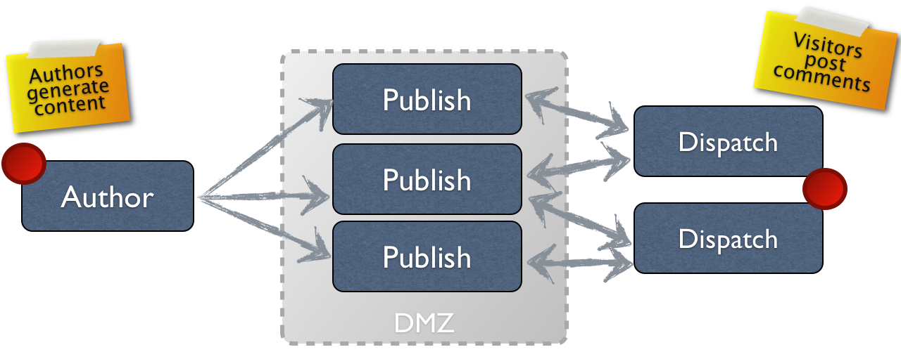

# Creación  {#authoring}

## Conceptos de creación (y publicación) {#concept-of-authoring-and-publishing}

AEM le ofrece dos entornos:

* Autor
* Publicación

Interactúan para permitirle ofrecer contenido en su sitio web para que los visitantes puedan leerlo.

El entorno de creación ofrece mecanismos para crear, actualizar y revisar el contenido antes de publicarlo:

* Un autor crea y revisa el contenido (que puede ser de varios tipos; por ejemplo, páginas, recursos, publicaciones, etc.)
* Este, en algún momento, se publicará en su sitio web.

En el entorno de creación, las funciones de AEM están disponibles mediante dos IU. Desde el entorno de publicación se diseña todo el aspecto y funcionamiento de la interfaz de usuario.

### Entorno de creación {#author-environment}

El creador trabaja en lo que se conoce como **entorno de creación**. Esto proporciona una interfaz fácil de usar (interfaz gráfica de usuario (GUI o IU)) para crear el contenido. Normalmente está detrás del cortafuegos de la empresa, que ofrece protección total y requiere que el autor inicie sesión con una cuenta que tenga los derechos de acceso apropiados.

>[!NOTE]
>
>Su cuenta necesita tener los derechos de acceso correspondientes para crear, editar o publicar contenido.

Según la configuración de su instancia y sus derechos personales de acceso, puede realizar muchas tareas en el contenido, como (entre otras):

* generar contenido nuevo o editar contenido existente en una página
* utilizar plantillas predefinidas para crear páginas de contenido nuevo
* crear, editar y administrar sus recursos y colecciones
* crear, editar y administrar sus publicaciones
* desarrollar sus campañas y los medios relacionados
* desarrollar y administrar sitios de la comunidad
* mover, copiar o eliminar recursos, páginas de contenido, etc.
* publicar (o cancelar la publicación de) páginas, recursos, etc.

Asimismo, hay tareas administrativas que le ayudan a administrar su contenido:

* flujos de trabajo que controlan la administración de cambios; por ejemplo, implementar una revisión antes de la publicación
* proyectos que coordinan tareas individuales

>[!NOTE]
>
>AEM también se [administra](/help/sites-administering/home.md) (para una gran mayoría de tareas) desde el entorno de creación.

#### Entorno de publicación {#publish-environment}

Cuando esté listo, el contenido del sitio AEM se publica en el **entorno de publicación**. Aquí las páginas del sitio web se ponen a disposición de la audiencia objetivo de acuerdo con la apariencia de la interfaz diseñada.

Normalmente, el entorno de publicación se encuentra dentro de la zona desmilitarizada, es decir, disponible para Internet, pero ya no bajo la protección completa de la red interna.

Cuando el sitio de AEM es un [sitio de la comunidad](/help/communities/overview.md) o incluye [componentes de Communities](/help/communities/author-communities.md), los visitantes del sitio que han iniciado sesión (miembros) pueden utilizar las funciones de Communities. Por ejemplo, pueden publicar en un foro, publicar un comentario o seguir a otros miembros. Los miembros pueden recibir permiso para realizar actividades habitualmente limitadas al entorno de creación, como crear páginas nuevas (grupos de la comunidad) y artículos de blog o moderar las publicaciones de otros miembros.

>[!NOTE]
>
>Por desgracia, a veces la terminología utilizada se superpone. Esto puede pasar con:
>
>* **Publicar o cancelar la publicación**
   >  Estos son los términos principales de las acciones que harán que el contenido esté disponible o no para los visitantes en su entorno de publicación.
>
>* **Activar o desactivar**
   >  Estos términos son sinónimos de publicar y cancelar la publicación.
>
>* **Replicar o replicación**
   >  Son los términos técnicos utilizados para indicar el movimiento de datos (p. ej., contenido de la página, archivos, código, comentarios del usuario) de un entorno a otro; es decir, al publicar o replicar a la inversa los comentarios del usuario.
>

#### Dispatcher {#dispatcher}

A fin de optimizar el rendimiento para los usuarios que visiten su sitio web, **[Dispatcher](https://helpx.adobe.com/experience-manager/dispatcher/user-guide.html) implementa almacenamiento en caché y equilibrio de carga.**
