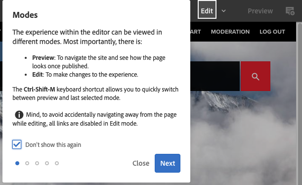

# Gestión básica{#basic-handling}

>[!NOTE]
>
>* Esta página se ha diseñado para ofrecer una descripción general de la gestión básica cuando se utiliza el entorno de creación de Adobe Experience Manager (AEM). Utiliza la consola **Sitios** como base. 
>
>* Algunas funcionalidades no están disponibles en todas las consolas y es posible que otras adicionales estén disponibles en algunas consolas. La información específica acerca de las consolas individuales y sus funciones relacionadas se trata con más detalle en otras páginas.
>* Los métodos abreviados del teclado están disponibles mediante AEM. En particular cuando [usa las consolas](/help/sites-authoring/keyboard-shortcuts.md) y [edita páginas](/help/sites-authoring/page-authoring-keyboard-shortcuts.md).
>

## Introducción {#getting-started}

### Una interfaz con capacidad táctil {#a-touch-enabled-ui}

La interfaz de usuario de AEM se ha habilitado para el tacto. Una interfaz táctil le permite utilizar el tacto para interactuar con el software mediante gestos como seleccionar, pulsar y mantener o deslizar el dedo. Esto contrasta con el funcionamiento de una interfaz de escritorio tradicional con acciones del ratón, como hacer clic, hacer doble clic, hacer clic con el botón secundario y pasar el ratón por encima.

Como la interfaz de usuario de AEM es táctil, puede utilizar los gestos táctiles en sus dispositivos táctiles (por ejemplo, móviles o tabletas) y las acciones del ratón en un dispositivo de escritorio tradicional.

### Primeros pasos {#first-steps}

Inmediatamente después de iniciar sesión, llegará al [Panel de navegación](#navigation-panel). Al seleccionar una de las opciones, se abre la consola correspondiente.

>[!NOTE]
>
>Para comprender bien el uso básico de AEM, este documento se basa en la consola **Sites**.
>
>Para empezar, haga clic en **Sitios**.

### Navegación de productos    {#product-navigation}

Cada vez que se accede por primera vez a una consola, se inicia un tutorial de navegación por los productos. Haga clic aquí para obtener una buena descripción general de la gestión básica de AEM.

Haz clic en **Siguiente** para avanzar a la siguiente página de la descripción general. Haga clic en **Cerrar** o haga clic fuera del cuadro de diálogo de la descripción general para cerrar.

La descripción general se reiniciará la próxima vez que acceda a una consola, a menos que vea todas las diapositivas o marque la opción **No volver a mostrar esto**.

## Navegación global {#global-navigation}

Puede navegar entre las consolas con el panel de navegación global. Se activa como una lista desplegable de pantalla completa al hacer clic en el vínculo Adobe Experience Manager en la parte superior izquierda de la pantalla.

Para volver a la ubicación anterior, puede cerrar el panel de navegación global tocando o haciendo clic en **Cerrar**.

>[!NOTE]
>
>Cuando inicie sesión por primera vez, aparecerá el panel **Navegación**

La navegación global dispone de dos paneles, representados por iconos en el lado izquierdo de la pantalla:

* **[Navegación](/help/sites-authoring/basic-handling.md#navigation-panel)**: se representa mediante una brújula   
* **[Herramientas](/help/sites-authoring/basic-handling.md#tools-panel)**: se representan con un martillo

A continuación, se describen las opciones disponibles en estos paneles.

### Panel de navegación    {#navigation-panel}

El panel Navegación proporciona acceso a las consolas de AEM:

El título de la pestaña del explorador se actualiza para reflejar su ubicación a medida que navega por las consolas y el contenido.

En Navegación, las consolas disponibles son:

<table>
 <tbody>
  <tr>
   <td><strong>Consola</strong></td>
   <td><strong>Función</strong></td>
  </tr>
  <tr>
   <td>Assets  </td>
   <td>Estas consolas le permiten importar y <a href="/help/assets/assets.md">administrar recursos digitales</a>, como imágenes, vídeos, documentos y archivos de audio. Estos recursos se pueden utilizar en cualquier sitio web que ejecute la misma instancia de AEM. </td>
  </tr>
  <tr>
   <td>Comunidades</td>
   <td>Esta consola le permite crear y administrar <a href="/help/communities/sites-console.md">sitios de la comunidad</a> para <a href="/help/communities/overview.md#engagement-community">participación</a> y <a href="/help/communities/overview.md#enablement-community">habilitación</a>.</td>
  </tr>
  <tr>
   <td>Comercio</td>
   <td>Esto le permite administrar productos, catálogos de productos y pedidos relacionados con los sitios de <a href="/help/commerce/cif-classic/administering/ecommerce.md">Commerce</a>.</td>
  </tr>
  <tr>
   <td>Fragmentos de experiencias</td>
   <td>Un <a href="/help/sites-authoring/experience-fragments.md">fragmento de experiencia</a> es una experiencia independiente que se puede reutilizar en varios canales y que puede tener variaciones, de manera que se evita el problema de copiar y pegar repetidas veces experiencias o partes de experiencias.</td>
  </tr>
  <tr>
   <td>Formularios</td>
   <td>Esta consola le permite crear, administrar y procesar sus <a href="/help/forms/using/introduction-aem-forms.md">formularios y documentos</a>.</td>
  </tr>
  <tr>
   <td>Personalización</td>
   <td>Esta consola proporciona un <a href="/help/sites-authoring/personalization.md">marco de herramientas para la creación de contenido de destino y la presentación de experiencias personalizadas</a>.</td>
  </tr>
  <tr>
   <td>Proyectos</td>
   <td>La consola <a href="/help/sites-authoring/touch-ui-managing-projects.md">Proyectos te proporciona acceso directo a tus proyectos</a>. Los proyectos son paneles virtuales. Se pueden utilizar para crear un equipo y, a continuación, darle acceso a los recursos, flujos de trabajo y tareas, lo que permite a las personas trabajar en un objetivo común.   </td>
  </tr>
  <tr>
   <td>Screens</td>
   <td><a href="https://experienceleague.adobe.com/docs/experience-manager-screens/user-guide/authoring/setting-up-projects/creating-a-screens-project.html?lang=es">Screens</a> le permite administrar todas las pantallas del cliente, de cualquier tamaño y en cualquier ubicación.</td>
  </tr>
  <tr>
   <td>Sites</td>
   <td>Las consolas de Sites le permiten <a href="/help/sites-authoring/page-authoring.md">crear, ver y administrar sitios web</a> que se ejecuten en su instancia de AEM. A través de estas consolas puede crear, editar, copiar, mover y eliminar páginas de sitios web, iniciar flujos de trabajo y publicar páginas.  </td>
  </tr>
 </tbody>
</table>

### Panel de herramientas {#tools-panel}

En el panel Herramientas, cada opción del panel lateral contiene una serie de submenús. Las [consolas de herramientas](/help/sites-administering/tools-consoles.md) disponibles aquí proporcionan acceso a varias herramientas y consolas especializadas que le ayudarán a administrar sus sitios web, recursos digitales y otros aspectos de su repositorio de contenido.

## Encabezado {#the-header}

El encabezado de siempre está presente en la parte superior de la pantalla. Aunque la mayoría de las opciones del encabezado no varían en todo el sistema, algunas dependen del contexto.

* [Navegación global](#navigatingconsolesandtools)

  Seleccione el vínculo **Adobe Experience Manager** en el que puede navegar entre consolas.

  

* [Búsqueda](/help/sites-authoring/search.md)

  

  También puede utilizar la [tecla de método abreviado](/help/sites-authoring/keyboard-shortcuts.md) `/` (barra inclinada) para iniciar una búsqueda desde cualquier consola.

* [Soluciones](https://business.adobe.com/es/)

  

* [Ayuda](#accessinghelptouchoptimizedui)

  

* [Notificaciones](/help/sites-authoring/inbox.md)

  

  Este icono se muestra con la cantidad de notificaciones incompletas asignadas actualmente.

  >[!NOTE]
  >
  >AEM viene precargado con tareas administrativas asignadas al grupo de usuarios administradores. Consulte [Su bandeja de entrada - Tareas administrativas listas para usar](/help/sites-authoring/inbox.md#out-of-the-box-administrative-tasks) para obtener más información.

* [Propiedades del usuario](/help/sites-authoring/user-properties.md)

  

* [Selector de raíl](/help/sites-authoring/basic-handling.md#rail-selector)

  

  Las opciones presentadas dependen de la consola actual. Por ejemplo, en **Sitios** puede seleccionar contenido solamente (el valor predeterminado), la cronología, las referencias o el panel lateral de filtro.

  

* Rutas de exploración

  

  Aparece en el centro del carril y, siempre mostrando la descripción del elemento seleccionado, las rutas de exploración le permiten desplazarse dentro de una consola específica. En la consola Sitios puede desplazarse por los niveles del sitio web.

  Al hacer clic en el texto de la ruta de exploración, se abre una lista desplegable que enumera los niveles de la jerarquía del elemento seleccionado actualmente. Para ir a esa ubicación, haga clic en una entrada.

  

* Selección del período de tiempo de Analytics

  

  Esto solo está disponible en la vista de lista. Para obtener más información, consulte la [vista de lista](#list-view).

* Botón **Crear**

  

  Una vez que se ha hecho clic, las opciones que se muestran son apropiadas para la consola o el contexto.

* [Vistas](/help/sites-authoring/basic-handling.md#viewingandselectingyourresourcescardlistcolumn)

  El icono de vista se encuentra en el extremo derecho de la barra de herramientas de AEM. Como indica también la vista actual, cambia. Por ejemplo, en la vista predeterminada, la **vista de columna** muestra lo siguiente:

  

  Puede cambiar entre la vista de columna, la vista de tarjeta y la vista de lista. La vista de lista muestra la configuración de vista.

  

* Navegación por teclado

  Puede navegar por un sitio web utilizando solo el teclado. Esto usa la funcionalidad estándar del explorador de la clave **TAB** (u **OPT+TAB**) para moverlo entre los elementos de la página que se pueden *enfocar*.

  En la consola **Sites**, existe la opción agregada de **Saltar al contenido principal**. Esto se vuelve visible a medida que *tabulador* pasa por las opciones de encabezado y acelera la navegación permitiéndole omitir los elementos estándar en la barra de herramientas (producto), y lo lleva directamente al contenido principal.

  

## Acceso a la Ayuda   {#accessing-help}

Hay varios recursos de ayuda disponibles:

* **Barra de herramientas de la consola**

  Según su ubicación, el icono **Ayuda** abrirá los recursos apropiados:

  

* **Navegación**

  La primera vez que navega por el sistema, [una serie de diapositivas presenta la navegación de AEM](/help/sites-authoring/basic-handling.md#product-navigation).

* **Editor de página**

  La primera vez que se edita una página, se muestra una serie de diapositivas de presentación del editor de páginas.

  

  Desplácese por esta descripción general como haría en la [descripción general de navegación de producto](/help/sites-authoring/basic-handling.md#product-navigation) al acceder por primera vez a una consola.

  En el menú **Información de la página**, puede seleccionar [**Ayuda**](/help/sites-authoring/author-environment-tools.md#accessing-help) para mostrar esto de nuevo en cualquier momento.

* **Consola Herramientas**

  Desde la consola **Herramientas**, también puede obtener acceso a los **recursos** externos:

   * **Documentación**
Ver la documentación de Web Experience Management.

   * **Recursos para desarrolladores**
Recursos y descargas para desarrolladores

  >[!NOTE]
  >
  >Puede acceder a una descripción general de las teclas de método abreviado disponibles en cualquier momento mediante la tecla de marcación rápida `?` (signo de interrogación) en una consola.
  >
  >Para obtener una descripción general de todos los métodos abreviados de teclado, consulte lo siguiente:
  >
  >* [Métodos abreviados del teclado para editar páginas](/help/sites-authoring/page-authoring-keyboard-shortcuts.md)
  >* [Métodos abreviados del teclado para las consolas](/help/sites-authoring/keyboard-shortcuts.md)

## Barra de herramientas Acciones {#actions-toolbar}

Siempre que se selecciona un recurso (por ejemplo, una página o un recurso), varias acciones aparecen indicadas en la barra de herramientas mediante iconos acompañados por un texto explicativo. Estas acciones dependen de lo siguiente:

* La consola actual
* El contexto actual
* Si está en [modo de selección](#navigatingandselectionmode) o no

Las acciones disponibles en la barra de herramientas cambian para reflejar las acciones que se pueden realizar en los elementos específicos seleccionados.

El modo de [seleccionar un recurso](/help/sites-authoring/basic-handling.md#viewing-and-selecting-resources) depende de la vista.

Debido a las restricciones de espacio en algunas ventanas, es posible que la barra de herramientas supere rápidamente la longitud disponible. Cuando esto sucede, aparecen opciones adicionales. Al tocar o hacer clic en los puntos suspensivos (los tres puntos o **...**), se abre un selector desplegable con el resto de las acciones. Por ejemplo, después de seleccionar una página en la consola **Sitios**: 

>[!NOTE]
>
>Los iconos individuales disponibles se documentan de acuerdo con la consola, la función o el escenario en cuestión.

## Acciones rápidas    {#quick-actions}

En [Vista de tarjeta](#cardviewquickactions), ciertas acciones están disponibles como iconos de acción rápida y en la barra de herramientas. Los iconos de acción rápida están disponibles para un único elemento a la vez, con lo que no es necesario preseleccionarlos.

Las acciones rápidas están visibles cuando pasa el ratón sobre una tarjeta de recursos (dispositivo de escritorio). Las acciones rápidas disponibles pueden depender de la consola y del contexto. Por ejemplo, estas son las acciones rápidas para una página de la consola **Sitios**:

## Visualización y selección de los recursos {#viewing-and-selecting-resources}

Conceptualmente, la visualización, la navegación y la selección son iguales en todas las vistas, pero existen pequeñas variaciones en el manejo, dependiendo de la vista utilizada.

Puede visualizar, navegar y seleccionar sus recursos (para efectuar una acción posterior) con cualquiera de las vistas disponibles, que se seleccionan mediante el icono en la parte superior derecha:

* [Vista de columna](#column-view)
* [Vista de tarjeta](#card-view)

* [Vista de lista   &#x200B;](#list-view)

>[!NOTE]
>
>De forma predeterminada, AEM Assets no muestra las representaciones originales de los recursos de la IU como miniaturas en ninguna de las vistas. Si es administrador, puede utilizar superposiciones para configurar AEM Assets de modo que muestren las representaciones originales como miniaturas.

### Selección de recursos    {#selecting-resources}

La selección de un recurso específico depende de una combinación de la vista y el dispositivo:

<table>
 <tbody>
  <tr>
   <td> </td>
   <td>Seleccionar</td>
   <td>Deseleccionar</td>
  </tr>
  <tr>
   <td>Vista de columna  </td>
   <td>
    <ul>
     <li>Escritorio:  Haga clic en la miniatura</li>
     <li>Dispositivos móviles:  Seleccione la miniatura</li>
    </ul> </td>
   <td>
    <ul>
     <li>Escritorio:  Haga clic en la miniatura</li>
     <li>Dispositivos móviles:  Seleccione la miniatura</li>
    </ul> </td>
  </tr>
  <tr>
   <td>Vista de tarjeta  </td>
   <td>
    <ul>
     <li>Escritorio:  , pase el ratón y, a continuación, utilice la acción rápida de marca de verificación</li>
     <li>Dispositivos móviles:   Seleccionar y mantener presionada la tarjeta</li>
    </ul> </td>
   <td>
    <ul>
     <li>Escritorio:  Haga clic en la tarjeta</li>
     <li>Dispositivos móviles:  Seleccione la tarjeta</li>
    </ul> </td>
  </tr>
  <tr>
   <td>Vista de lista   </td>
   <td>
    <ul>
     <li>Escritorio:  Haga clic en la miniatura</li>
     <li>Dispositivos móviles:  Seleccione la miniatura</li>
    </ul> </td>
   <td>
    <ul>
     <li>Escritorio:  Haga clic en la miniatura</li>
     <li>Dispositivos móviles:  Seleccione la miniatura</li>
    </ul> </td>
  </tr>
 </tbody>
</table>

#### Seleccionar todo {#select-all}

Puede seleccionar todos los elementos de cualquier vista haciendo clic en la opción **Seleccionar todo** situada en el ángulo superior derecho de la consola.

* En **Vista de tarjeta**, se seleccionan todas las tarjetas.
* En **Vista de lista**, se seleccionan todos los elementos de la lista.
* En **Vista de columna**, se seleccionan todos los elementos de la columna situada más a la izquierda.

#### Anulación de selección de todo {#deselecting-all}

En todos los casos, el número de elementos que tiene seleccionados se muestra en la parte superior derecha de la barra de herramientas.

Para anular la selección de todos los elementos y salir del modo de selección:

* tocando o haciendo clic en **X** junto al recuento,

* o usando **escape**.

En todas las vistas, es posible anular la selección de todos los elementos presionando ESC en el teclado si utiliza un equipo de escritorio.

#### Ejemplo de selección {#selecting-example}

1. Por ejemplo, en la vista de tarjeta:

   

1. Cuando ha seleccionado un recurso, el encabezado superior se cubre con [acciones de la barra de herramientas](#actionstoolbar), que proporciona acceso a las acciones aplicables actualmente al recurso seleccionado.

   Para salir del modo de selección, selecciona **X** en la parte superior derecha o usa **escape**.

### Vista de columna {#column-view}

La vista de columna permite una navegación visual de un árbol de contenido a través de una serie de columnas en cascada. Esta vista le permite visualizar y recorrer la estructura de árbol del sitio web.

Al seleccionar un recurso en la columna situada más a la izquierda, se muestran los recursos secundarios en una columna situada a la derecha. Al seleccionar un recurso en la columna derecha, se muestran los recursos secundarios en otra columna a la derecha, etc.

* Puede desplazarse hacia arriba y hacia abajo en el árbol tocando o haciendo clic en el nombre del recurso o en las comillas angulares a la derecha del nombre del recurso.

   * El nombre del recurso y las comillas angulares se resaltan al pulsarlas o hacer clic en ellas.

     

   * Los elementos secundarios del recurso en el que se hizo clic o pulsó se muestran en la columna a la derecha del recurso en el que se hizo clic o pulsó.
   * Si hace clic en un nombre de recurso que no tiene tareas secundarias, sus detalles se muestran en la última columna.

* Al tocar o hacer clic en la miniatura, se selecciona el recurso.

   * Cuando se selecciona, se superpone una marca de verificación en la miniatura y el nombre del recurso también se resalta.
   * Los detalles del recurso seleccionado se muestran en la última columna.
   * La barra de herramientas de acciones está disponible.

     

  Cuando se selecciona una página en la vista de columna, la página seleccionada se muestra en la última columna junto con los siguientes detalles:

   * Título de la página
   * Nombre de la página (parte de la dirección URL de la página)
   * Plantilla en la que se basa la página
   * Detalles de modificación
   * Idioma de la página
   * Detalles de publicación

### Vista de tarjeta {#card-view}

* La vista de tarjeta muestra tarjetas de información para cada elemento del nivel actual. Proporcionan información como la siguiente:

   * Una representación visual del contenido de la página.
   * El título de la página.
   * Fechas importantes (como la de la última modificación o la última publicación).
   * La página está bloqueada, oculta o forma parte de una Live Copy.
   * Si procede, cuando tenga que realizar una acción como parte de un flujo de trabajo.

      * Los marcadores que indican las acciones requeridas pueden estar relacionados con las entradas de su [Bandeja de entrada](/help/sites-authoring/inbox.md).

* Las [acciones rápidas](#quick-actions) también están disponibles en esta vista, como la selección y acciones comunes como la edición.

  

* Se puede navegar hacia abajo en el árbol tocando o haciendo clic en las tarjetas (con cuidado de evitar las acciones rápidas), o hacia arriba de nuevo mediante las [rutas de exploración del encabezado](/help/sites-authoring/basic-handling.md#the-header).

### Vista de lista    {#list-view}

* La vista de lista muestra información sobre cada recurso en el nivel actual.
* Puede navegar hacia abajo en el árbol tocando o haciendo clic en el nombre del recurso y en la copia de seguridad mediante las [rutas de exploración en el encabezado](/help/sites-authoring/basic-handling.md#the-header).

* Para seleccionar fácilmente todos los elementos de la lista, utilice la casilla de verificación que hay en la parte superior izquierda de la misma.

  

   * Cuando se seleccionan todos los elementos de la lista, esta casilla de verificación aparece activada.

      * Para anular la selección de todo, haga clic en la casilla de verificación.

   * Cuando solo se seleccionan algunos elementos, aparece con un signo menos.

      * Para seleccionar todo, haga clic en la casilla de verificación.
      * Para anular la selección de todo, vuelva a hacer clic en la casilla de verificación.

* Seleccione las columnas que se mostrarán con la opción **Ver configuración** ubicada debajo del botón Vistas. Las siguientes columnas están disponibles para su visualización:

   * **Nombre**: nombre de la página, que puede resultar útil en un entorno de creación multilingüe, ya que forma parte de la dirección URL de la página y no cambia, independientemente del idioma
   * **Modificado**: fecha de la última modificación y de la última modificación del usuario
   * **Publicado**: estado de publicación
   * **Plantilla**: plantilla en la que se basa la página
   * **Flujo de trabajo**: flujo de trabajo aplicado actualmente a la página. Hay más información disponible cuando pasa el ratón sobre o abre Cronología.

   * **Análisis de la página**
   * **Visitantes únicos**
   * **Tiempo empleado en la página**

  

  De forma predeterminada se muestra la columna **Nombre**, que es parte de la dirección URL de la página. A veces, el autor debe acceder a páginas que están en un idioma diferente. Ver el nombre de la página (que no suele variar) puede ser de gran ayuda si el autor no conoce el idioma de la página.

* Cambie el orden de los elementos mediante la barra vertical de puntos en la parte más a la derecha de cada elemento en la lista.

  >[!NOTE]
  >
  >Solo es posible cambiar el orden en una carpeta ordenada que tiene el valor `jcr:primaryType` establecido como `sling:OrderedFolder`.

  

  Haga clic en la barra de selección vertical y arrastre el elemento a una nueva posición en la lista.

  

* Puede mostrar los datos de Analytics mostrando las columnas adecuadas en el cuadro de diálogo **Ver configuración**.

  Puede filtrar datos de Analytics de los últimos 30, 90 o 365 días mediante las opciones de filtro a la derecha del encabezado.

  

## Selector de carril {#rail-selector}

El **Selector de carril** está disponible en la parte superior izquierda de la ventana y las opciones que muestra dependen de tus consolas actuales.

Por ejemplo, en Sitios puede seleccionar contenido solamente (el valor predeterminado), el árbol de contenido, la cronología, las referencias o el panel lateral de filtro.

Si se selecciona contenido solamente, después solo aparece el icono de raíl. Cuando se selecciona cualquier otra opción, el nombre de la opción aparece al lado del icono de raíl.

>[!NOTE]
>
>[Los métodos abreviados del teclado](/help/sites-authoring/keyboard-shortcuts.md) están disponibles para cambiar rápidamente entre las opciones de visualización de raíl.

### Árbol de contenido {#content-tree}

El árbol de contenido se puede utilizar para navegar rápidamente por la jerarquía del sitio dentro del panel lateral y ver mucha información sobre las páginas de la carpeta actual.

Mediante el panel lateral del árbol de contenido con una vista de lista o de tarjetas, los usuarios pueden ver fácilmente la estructura jerárquica del proyecto. Pueden navegar fácilmente por la estructura de contenido con el panel lateral del árbol de contenido y ver información detallada de la página en la vista de lista.

>[!NOTE]
>
>Una vez seleccionada una entrada en la vista de jerarquía, las teclas de flecha sirven para desplazarse rápidamente por la jerarquía.
>
>Consulte los [métodos abreviados de teclado](/help/sites-authoring/keyboard-shortcuts.md) para obtener más información.

### Escala de cronología {#timeline}

La cronología puede utilizarse para ver o iniciar eventos que se hayan producido en el recurso seleccionado. Para abrir la columna de cronología, utilice el selector de raíl:

La columna de cronología le permite:

* [Ver varios eventos](#timelineviewevents) relacionados con el elemento seleccionado.

   * Los tipos de eventos se pueden seleccionar desde la lista desplegable:

      * [Comentarios](#timelineaddingandviewingcomments)
      * Anotaciones
      * Actividades
      * [Lanzamientos](/help/sites-authoring/launches.md)
      * [Versiones](/help/sites-authoring/working-with-page-versions.md)
      * [Flujos de trabajo](/help/sites-authoring/workflows-applying.md)

         * excepto [flujos de trabajo transitorios](/help/sites-developing/workflows.md#transient-workflows) porque no se guardó ninguna información de historial para estos

      * y Mostrar todo

* [Agregar o ver comentarios](#timelineaddingandviewingcomments) sobre el elemento seleccionado. El cuadro **Comentario** se muestra en la parte inferior de la lista de eventos. Escribir un comentario seguido de Retorno registra el comentario. Se muestra cuando se selecciona **Comentarios** o **Mostrar todo**.

* Determinadas consolas tienen funciones adicionales. Por ejemplo, en la consola Sitios puede hacer lo siguiente:

   * [Guardar una versión](/help/sites-authoring/working-with-page-versions.md#creatinganewversiontouchoptimizedui).
   * [Iniciar un flujo de trabajo](/help/sites-authoring/workflows-applying.md#startingaworkflowfromtherail).

Se puede acceder a estas opciones mediante las comillas angulares que aparecen junto al campo **Comentario**.

### Referencias {#references}

**Referencias** muestran conexiones al recurso seleccionado. Por ejemplo, en la consola **Sitios**, [Referencias](/help/sites-authoring/author-environment-tools.md#showingpagereferences) muestra lo siguiente para páginas:

* [Planes](/help/sites-administering/msm.md)
* [Lanzamientos](/help/sites-authoring/launches.md#launches-in-references-sites-console)
* [Live Copies](/help/sites-administering/msm-livecopy-overview.md#openingthelivecopyoverviewfromreferences)
* [Copias de idioma](/help/sites-administering/tc-prep.md#seeing-the-status-of-language-roots)
* Referencias de contenido:

   * Vínculos directos de otras páginas a la página seleccionada
   * Contenido que el componente de referencia extrae de la página seleccionada, que entrega a esta o ambas

### Filter {#filter}

Se abre un panel similar a [search](/help/sites-authoring/search.md), con los filtros de ubicación apropiados establecidos, lo que le permite filtrar aún más el contenido que desea ver.

