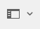
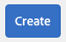
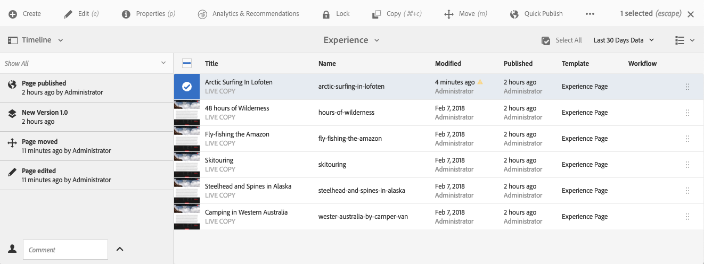

# Gestión básica{#basic-handling}

>[!NOTE]
>
>* AEM Esta página se ha diseñado para ofrecer una descripción general de la gestión básica cuando se utiliza el entorno de creación de. Utiliza la consola **Sitios** como base. 
>
>* Algunas funcionalidades no están disponibles en todas las consolas y es posible que otras funcionalidades adicionales estén disponibles en algunas consolas. La información específica acerca de las consolas individuales y sus funciones relacionadas se tratará con más detalle en otras páginas.
>* Los métodos abreviados del teclado están disponibles mediante AEM, sobre todo al [utilizar las consolas](/help/sites-authoring/keyboard-shortcuts.md) y [al editar páginas](/help/sites-authoring/page-authoring-keyboard-shortcuts.md).
>

## Introducción {#getting-started}

### Una interfaz con capacidad táctil {#a-touch-enabled-ui}

AEM Se ha habilitado la interfaz de usuario para el contacto con el usuario. Una interfaz con capacidad táctil le permite utilizar el tacto para interactuar con el software mediante gestos como pulsar, pulsar y mantener o deslizar el dedo. Esto contrasta con el funcionamiento de una interfaz de escritorio tradicional con acciones del ratón, como hacer clic, hacer doble clic, hacer clic con el botón secundario y pasar el ratón por encima.

AEM Como la interfaz de usuario de la pantalla es táctil, puede utilizar los gestos táctiles en sus dispositivos táctiles (por ejemplo, móviles o tabletas) y las acciones del ratón en un dispositivo de escritorio tradicional.

### Primeros pasos {#first-steps}

Inmediatamente después de iniciar sesión, llegará a la [Panel de navegación](#navigation-panel). Al seleccionar una de las opciones, se abre la consola correspondiente.

>[!NOTE]
>
>Para comprender bien el uso básico de AEM, este documento se basa en la consola **Sitios.**
>
>Pulse o haga clic en **Sitios** para comenzar.

### Navegación de productos    {#product-navigation}

Cada vez que un usuario accede por primera vez a una consola, se inicia un tutorial de navegación de productos. AEM Tómese un minuto para hacer clic o tocar para obtener una buena descripción general de la gestión básica de los problemas de la.

Toque o haga clic en **Siguiente** para avanzar a la siguiente página de la descripción general. Para cerrar, pulse o haga clic en **Cerrar**, o pulse o haga clic fuera del cuadro de diálogo de la descripción general.

La descripción general se reiniciará la próxima vez que acceda a una consola, a menos que vea todas las diapositivas o marque la opción **No volver a mostrar esto**.

## Navegación global {#global-navigation}

Puede navegar entre las consolas con el panel de navegación global. Se activa como una lista desplegable de pantalla completa cuando se hace clic o se pulsa en el vínculo de Adobe Experience Manager en la parte superior izquierda de la pantalla.

Para volver a la ubicación anterior, puede cerrar el panel de navegación global tocando o haciendo clic en **Cerrar**.

>[!NOTE]
>
>Cuando inicie sesión por primera vez, presentó el **Navegación** panel.

La navegación global dispone de dos paneles, representados por iconos en el lado izquierdo de la pantalla:

* **[Navegación](/help/sites-authoring/basic-handling.md#navigation-panel)**: se representa mediante una brújula   
* **[Herramientas](/help/sites-authoring/basic-handling.md#tools-panel)** - Representado por un martillo

A continuación, se describen las opciones disponibles en estos paneles.

### Panel de navegación    {#navigation-panel}

AEM El panel Navegación proporciona acceso a las consolas de la:

El título de la pestaña del navegador se actualizará para reflejar su ubicación a medida que navegue por las consolas y el contenido.

En Navegación, las consolas disponibles son:

<table>
 <tbody>
  <tr>
   <td><strong>Consola</strong></td>
   <td><strong>Función</strong></td>
  </tr>
  <tr>
   <td>Assets  </td>
   <td>Estas consolas permiten importar y <a href="/help/assets/home.md">administrar recursos digitales</a> como imágenes, vídeos, documentos y archivos de audio. AEM Estos recursos se pueden utilizar en cualquier sitio web que ejecute la misma instancia de. </td>
  </tr>
  <tr>
   <td>Communities</td>
   <td>Esta consola le permite crear y administrar <a href="/help/communities/sites-console.md">sitios de la comunidad</a> para <a href="/help/communities/overview.md#engagement-community">participación</a> y <a href="/help/communities/overview.md#enablement-community">habilitación</a>.</td>
  </tr>
  <tr>
   <td>Comercio</td>
   <td>Esto le permite administrar productos, catálogos de productos y pedidos relacionados con su <a href="/help/commerce/cif-classic/administering/ecommerce.md">Comercio</a> sitios.</td>
  </tr>
  <tr>
   <td>Fragmentos de experiencias</td>
   <td>Un <a href="/help/sites-authoring/experience-fragments.md">fragmento de experiencias</a> es una experiencia independiente que se puede reutilizar en todos los canales y que tiene variaciones, de modo que se evita el problema de copiar y pegar repetidas veces experiencias o partes de experiencias.</td>
  </tr>
  <tr>
   <td>Forms</td>
   <td>Esta consola le permite crear, administrar y procesar su <a href="/help/forms/home.md">formularios y documentos</a>.</td>
  </tr>
  <tr>
   <td>Personalización</td>
   <td>Esta consola proporciona un <a href="/help/sites-authoring/personalization.md">marco de herramientas para crear contenido dirigido y presentar experiencias personalizadas</a>.</td>
  </tr>
  <tr>
   <td>Proyectos</td>
   <td>El <a href="/help/sites-authoring/touch-ui-managing-projects.md">La consola Proyectos le proporciona acceso directo a sus proyectos</a>. Los proyectos son paneles virtuales. Se pueden utilizar para crear un equipo y, a continuación, darle acceso a los recursos, flujos de trabajo y tareas, lo que permite a las personas trabajar en un objetivo común.   </td>
  </tr>
  <tr>
   <td>Screens</td>
   <td><a href="https://experienceleague.adobe.com/docs/experience-manager-screens/user-guide/authoring/setting-up-projects/creating-a-screens-project.html">Screens</a> le permitirá gestionar todas las pantallas del cliente, de cualquier tamaño y en cualquier ubicación.</td>
  </tr>
  <tr>
   <td>Sites</td>
   <td>Las consolas Sitios le permiten <a href="/help/sites-authoring/page-authoring.md">creación, visualización y administración de sitios web</a> AEM ejecución en la instancia de la. A través de estas consolas puede crear, editar, copiar, mover y eliminar páginas de sitios web, iniciar flujos de trabajo y publicar páginas.  </td>
  </tr>
 </tbody>
</table>

### Panel de herramientas {#tools-panel}

En el panel Herramientas, cada opción del panel lateral contiene una serie de submenús. El [Herramientas consolas](/help/sites-administering/tools-consoles.md) Las disponibles aquí proporcionan acceso a una serie de herramientas y consolas especializadas que le ayudan a administrar sus sitios web, recursos digitales y otros aspectos de su repositorio de contenido.

## Encabezado {#the-header}

El encabezado de siempre está presente en la parte superior de la pantalla. Aunque la mayoría de las opciones del encabezado siguen siendo las mismas independientemente del lugar del sistema, algunas son específicas del contexto.

* [Navegación global](#navigatingconsolesandtools)

  Seleccione el vínculo **Adobe Experience Manager** para navegar entre consolas.

  

* [Búsqueda](/help/sites-authoring/search.md)

  

  También puede utilizar la [tecla de método abreviado](/help/sites-authoring/keyboard-shortcuts.md) `/` (barra inclinada) para iniciar una búsqueda desde cualquier consola.

* [Soluciones](https://www.adobe.com/es/experience-cloud.html)

  

* [Ayuda](#accessinghelptouchoptimizedui)

  

* [Notificaciones](/help/sites-authoring/inbox.md)

  

  Este icono se mostrará con la cantidad de notificaciones incompletas asignadas actualmente.

  >[!NOTE]
  >
  >AEM La configuración predeterminada viene precargada con tareas administrativas asignadas al grupo de usuarios del administrador. Consulte [Su bandeja de entrada: tareas administrativas listas para usar](/help/sites-authoring/inbox.md#out-of-the-box-administrative-tasks) para obtener más información.

* [Propiedades del usuario](/help/sites-authoring/user-properties.md)

  

* [Selector de raíl](/help/sites-authoring/basic-handling.md#rail-selector)

  

  Las opciones presentadas dependen de la consola actual. Por ejemplo, en **Sites** puede seleccionar contenido solamente (el valor predeterminado), la cronología, las referencias o el panel lateral de filtro.

  

* Rutas de exploración

  

  Las rutas de exploración, que se encuentran en el centro del raíl y siempre muestran la descripción del elemento seleccionado, le permiten desplazarse dentro de una consola específica. Desde la consola Sitios puede desplazarse por los niveles de su sitio web.

  Simplemente haga clic en el texto de la ruta de exploración para mostrar una lista desplegable con los niveles de la jerarquía del elemento seleccionado actualmente. Haga clic en una entrada para ir a esa ubicación.

  

* Selección del período de tiempo de Analytics

  

  Esto solo está disponible en la vista de lista. Consulte [vista de lista](#list-view) para obtener más información.

* Botón **Crear**

  

  Una vez que se ha hecho clic, las opciones que se muestran son apropiadas para la consola o el contexto.

* [Vistas](/help/sites-authoring/basic-handling.md#viewingandselectingyourresourcescardlistcolumn)

  El icono de vista se encuentra en el extremo derecho de la barra de herramientas de AEM. Como también indica la vista actual, cambia. Por ejemplo, en la vista predeterminada, la **vista de columna** muestra lo siguiente:

  

  Puede cambiar entre la vista de columna, la vista de tarjeta y la vista de lista; en la vista de lista también muestra la configuración de vista.

  

* Navegación por teclado

  Puede navegar por un sitio web utilizando solo el teclado. Utiliza la funcionalidad estándar del explorador de **TABULACIÓN** clave (o **OPT+TAB**) para desplazarlo entre los elementos de la página que *enfocable*.

  En la consola **Sites** hay una opción agregada para **Omitir al contenido principal**. Esto se hace visible a medida que *pestaña* a través de las opciones de encabezado y acelera la navegación permitiéndole omitir los elementos estándar en la barra de herramientas (producto), y lo lleva directamente al contenido principal.

  

## Acceso a la Ayuda   {#accessing-help}

Hay varios medios de ayuda disponibles:

* **Barra de herramientas de consola**

  Según su ubicación, la variable **Ayuda** abrirá los recursos adecuados:

  

* **Navegación**

  La primera vez que navega por el sistema, se muestra [una serie de diapositivas en que se presenta la navegación por AEM](/help/sites-authoring/basic-handling.md#product-navigation).

* **Editor de página**

  La primera vez que edita una página, se muestra una serie de diapositivas con el editor de páginas.

  

  Desplácese por esta descripción general como haría en la [descripción general de navegación de producto](/help/sites-authoring/basic-handling.md#product-navigation) al acceder por primera vez a una consola.

  En el menú [**Información de página** puede seleccionar **Ayuda**](/help/sites-authoring/author-environment-tools.md#accessing-help) para que se vuelva a mostrar esto en cualquier momento.

* **Consola Herramientas**

  Desde el **Herramientas** consola también puede acceder a la **Recursos**:

   * **Documentación**
Ver la documentación de Web Experience Management.

   * **Recursos para desarrolladores**
Recursos y descargas para desarrolladores

  >[!NOTE]
  >
  >Puede acceder a una descripción general de las teclas de método abreviado disponibles en cualquier momento mediante la tecla de marcación rápida `?` (signo de interrogación) en una consola.
  >
  >Para obtener una descripción general de todos los métodos abreviados de teclado, consulte la siguiente documentación:
  >
  >* [Métodos abreviados del teclado para editar páginas](/help/sites-authoring/page-authoring-keyboard-shortcuts.md)
  >* [Métodos abreviados del teclado para las consolas](/help/sites-authoring/keyboard-shortcuts.md)

## Barra de herramientas Acciones {#actions-toolbar}

Siempre que se selecciona un recurso (por ejemplo, una página o un recurso), varias acciones se indican mediante iconos con texto explicativo en la barra de herramientas. Estas acciones dependen de lo siguiente:

* La consola actual.
* El contexto actual.
* Si se encuentra en el [modo de selección](#navigatingandselectionmode).

La acción disponible en la barra de herramientas cambia para reflejar las acciones que se pueden llevar a cabo en los elementos específicos seleccionados.

El modo de [seleccionar un recurso](/help/sites-authoring/basic-handling.md#viewing-and-selecting-resources) depende de la vista.

Debido a las restricciones de espacio en algunas ventanas, es posible que la barra de herramientas supere rápidamente la longitud disponible. Cuando esto ocurre, aparecen opciones adicionales. Al tocar o hacer clic en el símbolo de elipsis (los tres puntos o **...**), se abre un selector desplegable con el resto de las acciones. Por ejemplo, después de seleccionar una página en la consola **Sitios**: 

>[!NOTE]
>
>Los iconos individuales disponibles se documentan de acuerdo con la consola, la función o el escenario en cuestión.

## Acciones rápidas    {#quick-actions}

Entrada [Vista de tarjeta](#cardviewquickactions) algunas acciones están disponibles como iconos de acción rápida y se encuentran en la barra de herramientas. Los iconos de acción rápida están disponibles para un solo elemento a la vez y eliminan la necesidad de preseleccionar.

Las acciones rápidas están visibles al pasar el ratón (dispositivo de escritorio) por una tarjeta de recursos. Las acciones rápidas disponibles pueden depender de la consola y del contexto. Por ejemplo, estas son las acciones rápidas para una página de la consola **Sitios**:

## Visualización y selección de los recursos {#viewing-and-selecting-resources}

Conceptualmente, la visualización, la navegación y la selección son iguales en todas las vistas, pero existen pequeñas variaciones en el manejo, dependiendo de la vista utilizada.

Puede visualizar, navegar y seleccionar sus recursos (para efectuar una acción posterior) con cualquiera de las vistas disponibles, que se seleccionan mediante el icono en la parte superior derecha:

* [Vista de columna](#column-view)
* [Vista de tarjeta](#card-view)

* [Vista de lista   ](#list-view)

>[!NOTE]
>
>De forma predeterminada, AEM Assets no muestra las representaciones originales de los recursos en la interfaz de usuario como miniaturas en ninguna de las vistas. Si es administrador, puede utilizar superposiciones para configurar AEM Assets de modo que muestre las representaciones originales como miniaturas.

### Selección de recursos    {#selecting-resources}

La selección de un recurso específico depende de la vista y el dispositivo combinados:

<table>
 <tbody>
  <tr>
   <td> </td>
   <td>Seleccionar</td>
   <td>Deseleccionar</td>
  </tr>
  <tr>
   <td>Vista de columna  </td>
   <td>
    <ul>
     <li>Escritorio:  Haga clic en la miniatura</li>
     <li>Dispositivo móvil:  Pulsar la miniatura</li>
    </ul> </td>
   <td>
    <ul>
     <li>Escritorio:  Haga clic en la miniatura</li>
     <li>Dispositivo móvil:  Pulsar la miniatura</li>
    </ul> </td>
  </tr>
  <tr>
   <td>Vista de tarjeta  </td>
   <td>
    <ul>
     <li>Escritorio:  Pase el ratón sobre él y utilice la acción rápida de marca</li>
     <li>Dispositivo móvil:  Pulsar y mantener pulsada la tarjeta</li>
    </ul> </td>
   <td>
    <ul>
     <li>Escritorio:  Haga clic en la tarjeta</li>
     <li>Dispositivo móvil:  Pulsar la tarjeta</li>
    </ul> </td>
  </tr>
  <tr>
   <td>Vista de lista   </td>
   <td>
    <ul>
     <li>Escritorio:  Haga clic en la miniatura</li>
     <li>Dispositivo móvil:  Pulsar la miniatura</li>
    </ul> </td>
   <td>
    <ul>
     <li>Escritorio:  Haga clic en la miniatura</li>
     <li>Dispositivo móvil:  Pulsar la miniatura</li>
    </ul> </td>
  </tr>
 </tbody>
</table>

#### Seleccionar todo {#select-all}

Para seleccionar todos los elementos de cualquier vista, haga clic en el icono **Seleccionar todo** en la esquina superior derecha de la consola.

* Entrada **Vista de tarjeta** se seleccionan todas las tarjetas.
* Entrada **Vista de lista** se seleccionan todos los elementos de la lista.
* En **Vista de columna**, se seleccionan todos los elementos de la columna situada más a la izquierda.

#### Anulación de selección de todo {#deselecting-all}

En todos los casos, el número de elementos que tiene seleccionados se muestra en la parte superior derecha de la barra de herramientas.

Para anular la selección de todos los elementos y salir del modo de selección:

* al tocar o hacer clic en **X** junto al recuento,

* o usando **escapar**.

En todas las vistas, es posible anular la selección de todos los elementos pulsando ESC en el teclado si utiliza un dispositivo de escritorio.

#### Ejemplo de selección {#selecting-example}

1. Por ejemplo, en la vista de tarjeta:

   

1. Una vez que haya seleccionado un recurso, el encabezado superior se cubre con [acciones de la barra de herramientas](#actionstoolbar) para proporcionar acceso a las acciones aplicables actualmente al recurso seleccionado.

   Para salir del modo de selección, pulse o haga clic en la **X** situada en la parte superior derecha o use la tecla **Esc**.

### Vista de columna {#column-view}

La vista de columna permite una navegación visual de un árbol de contenido a través de una serie de columnas en cascada. Esta vista le permite visualizar y recorrer la estructura de árbol del sitio web.

Si se selecciona un recurso en la columna situada más a la izquierda, se muestran los recursos secundarios en una columna situada a la derecha. Si se selecciona un recurso en la columna derecha, se muestran los recursos secundarios en otra columna a la derecha, etc.

* Puede desplazarse hacia arriba y hacia abajo en el árbol tocando o haciendo clic en el nombre del recurso o en las comillas angulares a la derecha del nombre del recurso.

   * El nombre del recurso y las comillas angulares se resaltarán cuando se pulse o haga clic en él.

     

   * Los elementos secundarios del recurso en el que se hizo clic o pulsó se muestran en la columna a la derecha del recurso en el que se hizo clic o pulsó.
   * Si pulsa o hace clic en un nombre de recurso que no tiene tareas secundarias, sus detalles se mostrarán en la última columna.

* Al tocar o hacer clic en la miniatura, se selecciona el recurso.

   * Cuando se selecciona, se superpone una marca de verificación en la miniatura y el nombre del recurso también se resalta.
   * Los detalles del recurso seleccionado se mostrarán en la última columna.
   * La barra de herramientas de acciones estará disponible.

     

  Cuando se selecciona una página en la vista de columna, la página seleccionada se muestra en la última columna junto con los siguientes detalles:

   * Título de página
   * Nombre de página (parte de la dirección URL de la página)
   * Plantilla en la que se basa la página
   * Detalles de modificación
   * Idioma de la página
   * Detalles de publicación

### Vista de tarjeta {#card-view}

* La vista de tarjeta muestra tarjetas de información para cada elemento del nivel actual. Proporcionan información como:

   * Una representación visual del contenido de la página.
   * El título de la página.
   * Fechas importantes (como la de la última modificación o la última publicación).
   * Si la página está bloqueada u oculta, o si es parte de una Live Copy.
   * Si procede, cuando tenga que realizar una acción como parte de un flujo de trabajo.

      * Los marcadores que indican las acciones requeridas pueden estar relacionados con las entradas de su [Bandeja de entrada](/help/sites-authoring/inbox.md).

* [Acciones rápidas](#quick-actions) también están disponibles en esta vista, como la selección y acciones comunes como la edición.

  

* Se puede navegar hacia abajo en el árbol tocando o haciendo clic en las tarjetas (con cuidado de evitar las acciones rápidas), o hacia arriba de nuevo mediante las [rutas de exploración del encabezado](/help/sites-authoring/basic-handling.md#the-header).

### Vista de lista    {#list-view}

* La vista de lista muestra información sobre cada recurso en el nivel actual.
* Puede navegar hacia abajo en el árbol tocando o haciendo clic en el nombre del recurso, y hacia arriba utilizando las [rutas de exploración en el encabezado](/help/sites-authoring/basic-handling.md#the-header).

* Para seleccionar fácilmente todos los elementos de la lista, utilice la casilla de verificación que hay en la parte superior izquierda de la misma.

  

   * Cuando se seleccionan todos los elementos de la lista, esta casilla de verificación aparece activada.

      * Toque o haga clic en la casilla de verificación para anular toda la selección.

   * Cuando sólo se seleccionan algunos elementos, aparece con un signo menos.

      * Toque o haga clic en la casilla de verificación para seleccionar todo.
      * Vuelva a tocar o hacer clic en la casilla de verificación para anular toda la selección.

* Seleccione las columnas a mostrar mediante la opción **Ajustes de visualización**, que se encuentra debajo del botón Vistas. Las siguientes columnas están disponibles para su visualización:

   * **Nombre** : Nombre de página, que puede resultar útil en un entorno de creación multilingüe, ya que forma parte de la dirección URL de la página y no cambia independientemente del idioma
   * **Modificado** - Fecha de la última modificación y última modificación del usuario
   * **Publicado** - Estado de publicación
   * **Plantilla**: plantilla en la que se basa la página
   * **Flujo de trabajo** - Flujo de trabajo aplicado actualmente a la página. Tiene más información disponible al pasar el ratón o abrir la línea de tiempo.

   * **Análisis de página**
   * **Visitantes únicos**
   * **Tiempo en la página**

  

  De forma predeterminada se muestra la columna **Nombre**, que es parte de la dirección URL de la página. En algunos casos, el autor puede tener que acceder a páginas en un idioma diferente y ver el nombre de la página (que no suele variar) puede ser de buena ayuda si no conoce el idioma de la página.

* Cambie el orden de los elementos mediante la barra vertical de puntos en la parte más a la derecha de cada elemento en la lista.

  >[!NOTE]
  >
  >Solo es posible cambiar el orden en una carpeta ordenada que tiene el valor `jcr:primaryType` establecido como `sling:OrderedFolder`.

  

  Toque o haga clic en la barra de selección vertical y arrastre el elemento hasta una nueva posición en la lista.

  

* Puede mostrar los datos de Analytics mostrando las columnas adecuadas mediante la variable **Configuración de vista** diálogo.

  Puede filtrar datos de Analytics de los últimos 30, 90 o 365 días mediante las opciones de filtro a la derecha del encabezado.

  

## Selector de carril {#rail-selector}

El **Selector de carril** está disponible en la parte superior izquierda de la ventana y las opciones que muestra dependen de tus consolas actuales.

Por ejemplo, en Sitios puede seleccionar contenido solamente (el valor predeterminado), el árbol de contenido, la cronología, las referencias o el panel lateral de filtro.

Si se selecciona contenido solamente, después solo aparece el icono de raíl. Cuando se selecciona cualquier otra opción, el nombre de la opción aparece al lado del icono de raíl.

>[!NOTE]
>
>[Los métodos abreviados del teclado](/help/sites-authoring/keyboard-shortcuts.md) están disponibles para cambiar rápidamente entre las opciones de visualización de raíl.

### Árbol de contenido {#content-tree}

El árbol de contenido se puede utilizar para navegar rápidamente por la jerarquía del sitio dentro del panel lateral y ver mucha información sobre las páginas de la carpeta actual.

Con el panel lateral del árbol de contenido junto con una vista de lista o una vista de tarjetas, los usuarios pueden ver fácilmente la estructura jerárquica del proyecto y navegar fácilmente por la estructura de contenido con el panel lateral del árbol de contenido, así como ver información detallada de la página en la vista de lista.

>[!NOTE]
>
>Una vez seleccionada una entrada en la vista de jerarquía, se pueden utilizar las teclas de flecha para desplazarse rápidamente por la jerarquía.
>
>Consulte la [métodos abreviados del teclado](/help/sites-authoring/keyboard-shortcuts.md) para obtener más información.

### Escala de cronología {#timeline}

La cronología puede utilizarse para ver o iniciar eventos que se hayan producido en el recurso seleccionado. Para abrir la columna de cronología, utilice el selector del raíl:

La columna de línea de tiempo le permite:

* [Ver varios eventos relacionados con el elemento seleccionado.](#timelineviewevents)

   * Los tipos de eventos se pueden seleccionar desde la lista desplegable:

      * [Comentarios](#timelineaddingandviewingcomments)
      * Anotaciones
      * Actividades
      * [Lanzamientos](/help/sites-authoring/launches.md)
      * [Versiones](/help/sites-authoring/working-with-page-versions.md)
      * [Flujos de trabajo](/help/sites-authoring/workflows-applying.md)

         * con la excepción de [flujos de trabajo transitorios](/help/sites-developing/workflows.md#transient-workflows) ya que no se guarda información de historial para estos

      * y Mostrar todo

* [Agregar o ver comentarios sobre el elemento seleccionado. ](#timelineaddingandviewingcomments) El cuadro **Comentario** se muestra en la parte inferior de la lista de eventos. Si se escribe un comentario y se presiona Retorno, el comentario se registra. Se mostrará cuando seleccione **Comentarios** o **Mostrar todo**.

* Determinadas consolas tienen funciones adicionales. Por ejemplo, en la consola Sitios puede:

   * [Guardar una versión](/help/sites-authoring/working-with-page-versions.md#creatinganewversiontouchoptimizedui).
   * [Iniciar un flujo de trabajo](/help/sites-authoring/workflows-applying.md#startingaworkflowfromtherail).

Se puede acceder a estas opciones mediante las comillas angulares que hay junto a la variable **Comentario** field.

### Referencias {#references}

**Referencias** muestra las conexiones con el recurso seleccionado. Por ejemplo, en la consola **Sitios**, [Referencias](/help/sites-authoring/author-environment-tools.md#showingpagereferences) muestra lo siguiente para páginas:

* [Lanzamientos](/help/sites-authoring/launches.md#launches-in-references-sites-console)
* [Live Copies](/help/sites-administering/msm-livecopy-overview.md#openingthelivecopyoverviewfromreferences)
* [Copias de idioma](/help/sites-administering/tc-prep.md#seeing-the-status-of-language-roots)
* Referencias de contenido:

   * vínculos de otras páginas a la página seleccionada
   * contenido que el componente de referencia extrae de la página seleccionada o que entrega en la misma

### Filtro {#filter}

Se abrirá un panel similar al de [Buscar](/help/sites-authoring/search.md) con filtros de ubicación apropiados ya establecidos, lo que le permite filtrar aún más el contenido que desea ver.

