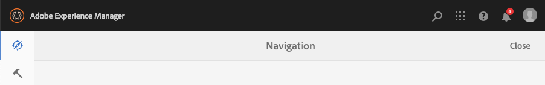
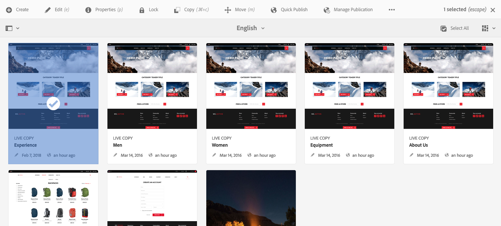
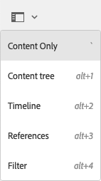

# Gestión básica{#basic-handling}

>[!NOTE]
>
>* Esta página se ha diseñado para ofrecer una descripción general de la gestión básica cuando se utiliza el entorno de creación AEM. Utiliza la consola **Sitios** como base. 
   >
   >
* Algunas funciones no están disponibles en todas las consolas y determinadas consolas pueden disponer de funciones adicionales. La información específica sobre consolas concretas y sus funciones se tratará en más detalle en otras páginas.
>* Los métodos abreviados del teclado están disponibles mediante AEM, sobre todo al [utilizar las consolas](/help/sites-authoring/keyboard-shortcuts.md) y [al editar páginas](/help/sites-authoring/page-authoring-keyboard-shortcuts.md).

>

## Introducción {#getting-started}

### Una interfaz con capacidad táctil {#a-touch-enabled-ui}

La interfaz de usuario de AEM tiene capacidad táctil. Una interfaz con capacidad táctil le permite utilizar el tacto para interactuar con el software mediante gestos como pulsar, pulsar y mantener o deslizar el dedo. Este funcionamiento contrasta con el de una interfaz de escritorio tradicional, la cual cuenta con acciones de ratón como clic, doble clic, clic con el botón secundario o pasar el ratón.

Como la interfaz de usuario de AEM es táctil, puede utilizar gestos táctiles en dispositivos que lo permitan (por ejemplo, el móvil o la tablet); asimismo, puede usar las acciones del ratón en un dispositivo de escritorio tradicional.

### Primeros pasos {#first-steps}

Inmediatamente después del inicio de sesión llega al [panel Navegación](#navigation-panel). Al hacer clic en una de las opciones, se abre la consola correspondiente.

>[!NOTE]
>
>Para comprender bien el uso básico de AEM, este documento se basa en la consola **Sitios.**
>
>Pulse o haga clic en **Sitios** para comenzar.

### Navegación de productos    {#product-navigation}

Cuando un usuario accede por primera vez a una consola, se inicia un tutorial de navegación por el producto. Dedíquele un momento para ver una buena descripción general del funcionamiento básico de AEM.

Toque o haga clic en **Siguiente** para avanzar a la siguiente página de la descripción general. Para cerrar, pulse o haga clic en **Cerrar**, o pulse o haga clic fuera del cuadro de diálogo de la descripción general.

La descripción general se reiniciará la próxima vez que acceda a una consola, a menos que vea todas las diapositivas o marque la opción **No volver a mostrar esto**.

## Navegación global {#global-navigation}

Puede navegar entre las consolas con el panel de navegación global. Se activa como un desplegable a pantalla completa cuando toca o hace clic en el vínculo Adobe Experience Manager, en la parte superior izquierda de la pantalla.

Para volver a la ubicación anterior, puede cerrar el panel de navegación global tocando o haciendo clic en **Cerrar**.

>[!NOTE]
>
>La primera vez que inicia sesión se le presenta el panel **Navegación**.

La navegación global dispone de dos paneles, representados por iconos en el lado izquierdo de la pantalla:

* **[Navegación](/help/sites-authoring/basic-handling.md#navigation-panel)**: se representa mediante una brújula   
* **[Herramientas](/help/sites-authoring/basic-handling.md#tools-panel)**: se representa mediante un martillo

Las opciones disponibles en estos paneles se describen a continuación.

### Panel de navegación     {#navigation-panel}

El panel Navegación proporciona acceso a las consolas de AEM:

El título de la pestaña del navegador se actualizará para reflejar su ubicación a medida que navegue por las consolas y el contenido.

En Navegación, las consolas disponibles son:

<table>
 <tbody>
  <tr>
   <td><strong>Consola</strong></td>
   <td><strong>Función</strong></td>
  </tr>
  <tr>
   <td>Assets  </td>
   <td>Estas consolas le permiten importar y <a href="/help/assets/home.md">administrar recursos digitales</a>, como imágenes, vídeos, documentos y archivos de audio. Estos recursos se pueden utilizar en cualquier sitio web que ejecute la misma instancia de AEM. </td>
  </tr>
  <tr>
   <td>Communities</td>
   <td>Esta consola permite crear y administrar <a href="/help/communities/sites-console.md">sitios de comunidad</a> para <a href="/help/communities/overview.md#engagement-community">participar</a> en ellos según se vayan <a href="/help/communities/overview.md#enablement-community">activando</a>.</td>
  </tr>
  <tr>
   <td>Comercio</td>
   <td>Esto le permite administrar productos, catálogos de productos y pedidos relacionados con sus sitios de <a href="/help/commerce/cif-classic/administering/ecommerce.md">comercio</a>.</td>
  </tr>
  <tr>
   <td>Fragmentos de experiencias</td>
   <td>Un <a href="/help/sites-authoring/experience-fragments.md">fragmento de experiencia</a> es una experiencia independiente que puede reutilizarse en diversos canales y tener variaciones, de manera que se evita el problema de copiar y pegar repetidas veces experiencias o partes de experiencias.</td>
  </tr>
  <tr>
   <td>Forms</td>
   <td>Esta consola permite crear, administrar y procesar sus <a href="/help/forms/home.md">formularios y documentos</a>.</td>
  </tr>
  <tr>
   <td>Personalización</td>
   <td>Esta consola ofrece un <a href="/help/sites-authoring/personalization.md">marco de herramientas para crear contenido dirigido y presentar experiencias personalizadas</a>.</td>
  </tr>
  <tr>
   <td>Proyectos</td>
   <td>La <a href="/help/sites-authoring/touch-ui-managing-projects.md">consola Proyectos le permite acceder directamente a sus proyectos</a>. Los proyectos son tableros virtuales. Se pueden utilizar para crear un equipo y permitirle acceder a medios, flujos de trabajo y tareas, para que todos los miembros puedan trabajar en un objetivo común.   </td>
  </tr>
  <tr>
   <td>Pantallas</td>
   <td>Las <a href="https://docs.adobe.com/content/help/en/experience-manager-screens/user-guide/authoring/setting-up-projects/creating-a-screens-project.html">pantallas</a> le permiten administrar todas sus pantallas de cliente, de cualquier tamaño y en cualquier lugar.</td>
  </tr>
  <tr>
   <td>Sites</td>
   <td>La consola Sitios le permite <a href="/help/sites-authoring/page-authoring.md">crear, ver y administrar sitios web</a> que se ejecuten en su instancia de AEM. Mediante estas consolas puede crear, editar, copiar, mover y eliminar páginas de sitios web, iniciar flujos de trabajo y publicar páginas.  </td>
  </tr>
 </tbody>
</table>

### Panel de herramientas {#tools-panel}

En el panel Herramientas, todas las opciones del panel lateral contienen distintos submenús. Las [consolas Herramientas](/help/sites-administering/tools-consoles.md) disponibles aquí permiten acceder a toda una serie de consolas y herramientas personalizadas que le ayudan a administrar sus sitios web, recursos digitales y otros aspectos de su repositorio de contenido.

## Encabezado {#the-header}

El encabezado siempre está presente en la parte superior de la pantalla. Aunque la mayoría de las opciones del encabezado no varían en todo el sistema, algunas dependen del contexto.

* [Navegación global](#navigatingconsolesandtools)

   Seleccione el vínculo **Adobe Experience Manager** para navegar entre consolas.

   

* [Buscar](/help/sites-authoring/search.md)

   

   También puede utilizar la [tecla de método abreviado](/help/sites-authoring/keyboard-shortcuts.md) `/` (barra inclinada) para iniciar una búsqueda desde cualquier consola.

* [Soluciones](https://www.adobe.com/experience-cloud.html)

   

* [Ayuda](#accessinghelptouchoptimizedui)

   

* [Notificaciones](/help/sites-authoring/inbox.md)

   

   Este icono se mostrará con la cantidad de notificaciones incompletas asignadas actualmente.

   >[!NOTE]
   >
   >La versión de AEM lista para usar incluye tareas administrativas que se asignan al grupo de usuarios administradores. Consulte [Su Bandeja de entrada: tareas administrativas listas para usar](/help/sites-authoring/inbox.md#out-of-the-box-administrative-tasks) para obtener información.

* [Propiedades del usuario](/help/sites-authoring/user-properties.md)

   

* [Selector de raíl](/help/sites-authoring/basic-handling.md#rail-selector)

   

   Las opciones presentadas dependen de la consola actual. Por ejemplo, en **Sitios** puede seleccionar contenido solamente (el valor predeterminado), la línea de tiempo, las referencias o el panel lateral de filtro.

   

* Rutas de exploración

   

   Las rutas de exploración, que se encuentran en el centro del raíl y siempre muestran la descripción del elemento seleccionado, le permiten desplazarse dentro de una consola específica. Desde la consola Sitios puede desplazarse por los niveles de su sitio web.

   Solo tiene que hacer clic en el texto de la ruta de exploración para ver una lista desplegable que enumera los niveles de la jerarquía del elemento seleccionado. Haga clic en una entrada para ir a esa ubicación.

   

* Selección de período de tiempo de Analytics

   

   Esta opción solo está disponible en la vista de lista. Consulte [vista de lista](#list-view) para obtener más información.

* Botón **Crear**

   

   Una vez que se ha hecho clic, las opciones que se muestran son apropiadas para la consola o el contexto.

* [Vistas](/help/sites-authoring/basic-handling.md#viewingandselectingyourresourcescardlistcolumn)

   El icono de vista se encuentra en el extremo derecho de la barra de herramientas de AEM. Como también indica la vista actual, este puede cambiar. Por ejemplo, en la vista predeterminada, la **vista de columna** muestra lo siguiente:

   

   Puede cambiar entre la vista de columna, la vista de tarjeta y la vista de lista; tenga en cuenta que en la vista de lista también se muestra la configuración de la vista.

   

* Navegación por teclado

   Puede navegar por un sitio web utilizando solo el teclado. Utiliza la funcionalidad estándar del explorador de la tecla **TAB** (u **OPT+TAB**) para desplazarlo entre los elementos de la página que son *enfocables*.

   En la consola **Sites** hay una opción agregada para **Omitir al contenido principal**. Esto se hace visible a medida que *tab* pasa por las opciones de encabezado y acelera la navegación al permitirle omitir los elementos estándar en la barra de herramientas (del producto) y llevarle directamente al contenido principal.

   

## Acceso a la Ayuda {#accessing-help}

Hay varios medios de ayuda disponibles:

* **Barra de herramientas de la consola**

   Según su ubicación, el icono **Ayuda** abrirá los recursos correspondientes.

   

* **Navegación**

   La primera vez que navega por el sistema, se muestra [una serie de diapositivas en que se presenta la navegación por AEM](/help/sites-authoring/basic-handling.md#product-navigation).

* **Editor de página**

   La primera vez que edita una página, un conjunto de diapositivas presenta el editor de páginas.

   

   Desplácese por esta descripción general como haría en la [descripción general de navegación de producto](/help/sites-authoring/basic-handling.md#product-navigation) al acceder por primera vez a una consola.

   En el menú [**Información de página** puede seleccionar **Ayuda**](/help/sites-authoring/author-environment-tools.md#accessing-help) para que se vuelva a mostrar esto en cualquier momento.

* **Consola Herramientas**

   Desde la consola **Herramientas** también puede acceder a los **recursos externos**:

   * **Documentación**
Ver la documentación de Web Experience Management

   * **Recursos de desarrollador**
Recursos y descargas para desarrolladores
   >[!NOTE]
   >
   >Puede acceder a una descripción general de las teclas de método abreviado disponibles en cualquier momento mediante la tecla de marcación rápida `?` (signo de interrogación) en una consola.
   >
   >Para obtener información general sobre todos los métodos abreviados del teclado, consulte la documentación siguiente:
   >
   >    * [Métodos abreviados del teclado para editar páginas](/help/sites-authoring/page-authoring-keyboard-shortcuts.md)
   >    * [Métodos abreviados del teclado para las consolas](/help/sites-authoring/keyboard-shortcuts.md)

## Barra de herramientas Acciones {#actions-toolbar}

Siempre que se selecciona un recurso (por ejemplo, una página o un recurso), varias acciones aparecen indicadas en la barra de herramientas mediante iconos acompañados por un texto explicativo. Estas acciones dependen de:

* La consola actual.
* El contexto actual.
* Si se encuentra en el [modo de selección](#navigatingandselectionmode).

La acción disponible en la barra de herramientas cambia para reflejar las acciones que se pueden llevar a cabo en los elementos específicos seleccionados.

El modo de [seleccionar un recurso](/help/sites-authoring/basic-handling.md#viewing-and-selecting-resources) depende de la vista.

Debido a las restricciones de espacio en algunas ventanas, es posible que la barra de herramientas supere rápidamente la longitud disponible. Cuando esto ocurre, aparecen opciones adicionales. Al tocar o hacer clic en el símbolo de elipsis (los tres puntos o **...**), se abre un selector desplegable con el resto de las acciones. Por ejemplo, después de seleccionar una página en la consola **Sitios**: 

>[!NOTE]
>
>Los iconos individuales disponibles se documentan de acuerdo con la consola, la función o el escenario en cuestión.

## Acciones rápidas     {#quick-actions}

En la [vista de tarjeta](#cardviewquickactions), determinadas acciones están disponibles como iconos de acción rápida, además de en la barra de herramientas. Los iconos de acción rápida aparecen disponibles para un único elemento cada vez, con lo que no es necesario preseleccionar. 

Las acciones rápidas se pueden ver al pasar el ratón (dispositivo de escritorio) por encima de la tarjeta de un recurso. Las acciones rápidas disponibles pueden depender de la consola y del contexto. Por ejemplo, estas son las acciones rápidas para una página de la consola **Sitios**:

## Visualización y selección de los recursos {#viewing-and-selecting-resources}

Conceptualmente, la visualización, la navegación y la selección son iguales en todas las vistas, pero existen pequeñas variaciones en el manejo, dependiendo de la vista utilizada.

Puede visualizar, navegar y seleccionar sus recursos (para efectuar una acción posterior) con cualquiera de las vistas disponibles, que se seleccionan mediante el icono en la parte superior derecha:

* [Vista de columna](#column-view)
* [Vista de tarjeta](#card-view)

* [Vista de lista  ](#list-view)

>[!NOTE]
>
>De forma predeterminada, en ninguna de las vistas los recursos de AEM Assets muestran como miniaturas las representaciones originales de los recursos. Un administrador puede utilizar superposiciones para configurar los recursos de AEM Assets de forma que muestren las representaciones originales como miniaturas.

### Selección de recursos     {#selecting-resources}

La selección de un recurso específico depende de la vista y el dispositivo combinados:

<table>
 <tbody>
  <tr>
   <td> </td>
   <td>Seleccionar</td>
   <td>Deseleccionar</td>
  </tr>
  <tr>
   <td>Vista de columna  </td>
   <td>
    <ul>
     <li>Escritorio:   haga clic en la miniatura.</li>
     <li>Dispositivo móvil:   toque la miniatura.</li>
    </ul> </td>
   <td>
    <ul>
     <li>Escritorio:   haga clic en la miniatura.</li>
     <li>Dispositivo móvil:   toque la miniatura.</li>
    </ul> </td>
  </tr>
  <tr>
   <td>Vista de tarjeta  </td>
   <td>
    <ul>
     <li>Escritorio:  pase el ratón por encima y utilice la acción rápida de marca de verificación</li>
     <li>Dispositivo móvil:   toque y mantenga pulsada la tarjeta.</li>
    </ul> </td>
   <td>
    <ul>
     <li>Escritorio:  Haga clic en la tarjeta</li>
     <li>Dispositivo móvil:  Toque la tarjeta</li>
    </ul> </td>
  </tr>
  <tr>
   <td>Vista de lista   </td>
   <td>
    <ul>
     <li>Escritorio:   haga clic en la miniatura.</li>
     <li>Dispositivo móvil:   toque la miniatura.</li>
    </ul> </td>
   <td>
    <ul>
     <li>Escritorio:   haga clic en la miniatura.</li>
     <li>Dispositivo móvil:   toque la miniatura.</li>
    </ul> </td>
  </tr>
 </tbody>
</table>

#### Seleccionar todo {#select-all}

Puede seleccionar todos los elementos de cualquier vista haciendo clic en la opción **Seleccionar todo** situada en la esquina superior derecha de la consola.

* En **Vista de tarjeta**, se seleccionan todas las tarjetas.
* En **Vista de lista**, se seleccionan todos los elementos de la lista.
* En **Vista de columna**, se seleccionan todos los elementos de la columna situada más a la izquierda.

#### Anulación de selección de todo {#deselecting-all}

En todos los casos, el número de elementos que tiene seleccionados se muestra en la parte superior derecha de la barra de herramientas.

Para anular la selección de todos los elementos y salir del modo de selección:

* Toque o haga clic en la **X** situada junto al recuento 

* o utilice la tecla **Esc**.

En todas las vistas, es posible anular la selección de todos los elementos presionando ESC en el teclado si utiliza un equipo de escritorio.

#### Ejemplo de selección {#selecting-example}

1. Por ejemplo, en la vista de tarjeta:

   

1. Una vez que haya seleccionado un recurso, el encabezado superior se cubre con [acciones de la barra de herramientas](#actionstoolbar) para proporcionar acceso a las acciones aplicables actualmente al recurso seleccionado.

   Para salir del modo de selección, pulse o haga clic en la **X** situada en la parte superior derecha o use la tecla **Esc**.

### Vista de columna {#column-view}

La vista de columna permite una navegación visual de un árbol de contenido mediante una serie de columnas en cascada. Esta vista le permite visualizar y recorrer la estructura de árbol de su sitio web.

Si selecciona un recurso en la columna más a la izquierda, en una columna a la derecha se mostrarán los recursos secundarios. A su vez, seleccionar un recurso en esta columna derecha mostrará los recursos secundarios en otra columna a la derecha, y así sucesivamente.

* Puede desplazarse hacia arriba y hacia abajo por el árbol tocando o haciendo clic en el nombre del recurso o en las comillas angulares a la derecha de este nombre.

   * El nombre del recurso y las comillas angulares se resaltarán cuando los toque o haga clic en ellos.

   

   * Los elementos secundarios del recurso que ha tocado o en el que ha hecho clic se muestran en la columna a la derecha de dicho recurso.
   * Si toca o hace clic en el nombre de un recurso sin elementos secundarios, sus detalles se muestran en la última columna.

* Si toca o hace clic en la miniatura, se selecciona el recurso.

   * Cuando se selecciona una miniatura, sobre ella se superpone una casilla de verificación y el nombre del recurso se muestra resaltado.
   * Los detalles del recurso seleccionado se mostrarán en la última columna.
   * La barra de herramientas de acciones estará disponible.

   

   Cuando en la vista de columna hay una página seleccionada, esta se muestra en la última columna, junto a los datos siguientes:

   * Título de página
   * Nombre de página (parte de la URL de la página)
   * La plantilla de la página se basa en
   * Detalles de la modificación
   * Idioma de la página
   * Detalles de la publicación

### Vista de tarjeta {#card-view}

* La vista de tarjeta muestra tarjetas de información para cada elemento del nivel actual. Proporcionan información como:

   * Una representación visual del contenido de la página.
   * El título de la página.
   * Fechas importantes (como la de la última modificación o la última publicación).
   * Si la página está bloqueada u oculta, o si es parte de una Live Copy.
   * Si procede, cuando tenga que realizar una acción como parte de un flujo de trabajo.

      * Los marcadores que indican las acciones necesarias pueden estar relacionados con elementos en su [bandeja de entrada](/help/sites-authoring/inbox.md).

* En esta vista también hay disponibles [acciones rápidas](#quick-actions) como la selección y otras acciones comunes, por ejemplo la edición.

   

* Se puede navegar hacia abajo en el árbol tocando o haciendo clic en las tarjetas (con cuidado de evitar las acciones rápidas), o hacia arriba de nuevo mediante las [rutas de exploración del encabezado](/help/sites-authoring/basic-handling.md#the-header).

### Vista de lista     {#list-view}

* La vista de lista muestra información sobre cada recurso en el nivel actual.
* Puede navegar hacia abajo en el árbol tocando o haciendo clic en el nombre del recurso, y hacia arriba utilizando las [rutas de exploración en el encabezado](/help/sites-authoring/basic-handling.md#the-header).

* Para seleccionar fácilmente todos los elementos de la lista, utilice la casilla de verificación que hay en la parte superior izquierda de la misma.

   

   * Si todos los elementos de la lista están seleccionados, la casilla aparece marcada.

      * Toque o haga clic en la casilla para anular todas las selecciones.
   * Cuando solo hay seleccionados algunos elementos, aparece un signo menos.

      * Toque o haga clic en la casilla para seleccionarlo todo.
      * Toque o haga clic en la casilla de nuevo para anular todas las selecciones.

* Seleccione las columnas a mostrar mediante la opción **Ajustes de visualización**, que se encuentra debajo del botón Vistas. Las siguientes columnas están disponibles para la visualización:

   * **Nombre**: nombre de página, que puede resultar útil en un entorno de creación multilingüe, ya que forma parte de la dirección URL de la página y no cambia con el idioma
   * **Modificada**: fecha de la última modificación y el usuario que la efectuó
   * **Publicada**: estado de publicación
   * **Plantilla**: plantilla en la que se basa la página
   * **Flujo de trabajo**: flujo de trabajo aplicado actualmente en la página. Tiene más información disponible al pasar el ratón o abrir la línea de tiempo.

   * **Análisis de la página**
   * **Visitantes únicos**
   * **Tiempo empleado en la página**

   

   De forma predeterminada se muestra la columna **Nombre**, que es parte de la dirección URL de la página. En algunos casos, el autor puede tener que acceder a páginas en un idioma distinto, y ver el nombre de las mismas (que no suele variar) puede suponer una gran ayuda si se desconoce el idioma de la página.

* Cambie el orden de los elementos mediante la barra vertical de puntos en la parte más a la derecha de cada elemento en la lista.

   >[!NOTE]
   >
   >Solo es posible cambiar el orden en una carpeta ordenada que tiene el valor `jcr:primaryType` establecido como `sling:OrderedFolder`.

   

   Toque o haga clic en la barra de selección vertical y arrastre el elemento hasta una nueva posición en la lista.

   

* Puede ver los datos de Analytics si muestra las columnas apropiadas con el cuadro de diálogo **Configuración de vista**.

   Puede filtrar los datos de Analytics de los últimos 30, 90 o 365 días mediante las opciones de filtro que hay a la derecha del encabezado.

   

## Selector de raíl {#rail-selector}

El **Selector de carril** está disponible en la parte superior izquierda de la ventana y las opciones que muestra dependen de tus consolas actuales.

Por ejemplo, en Sitios puede seleccionar contenido solamente (el valor predeterminado), el árbol de contenido, la cronología, las referencias o el panel lateral de filtro.

Si se selecciona contenido solamente, después solo aparece el icono de raíl. Cuando se selecciona cualquier otra opción, el nombre de la opción aparece al lado del icono de raíl.

>[!NOTE]
>
>[Los métodos abreviados del teclado](/help/sites-authoring/keyboard-shortcuts.md) están disponibles para cambiar rápidamente entre las opciones de visualización de raíl.

### Árbol de contenido {#content-tree}

El árbol de contenido se puede utilizar para desplazarse con rapidez por la jerarquía del sitio dentro del panel lateral y para ver mucha información sobre las páginas en la carpeta actual.

Al utilizar el panel lateral del árbol de contenido junto con una vista de lista o de tarjetas, los usuarios pueden ver fácilmente la estructura jerárquica del proyecto y navegar con facilidad por la estructura del contenido con el panel lateral del árbol de contenido, así como ver información de página detallada en la vista de lista.

>[!NOTE]
>
>Una vez seleccionada una entrada en la vista de jerarquía, las teclas de flecha se pueden utilizar para desplazarse con rapidez por la jerarquía.
>
>Consulte los [métodos abreviados del teclado](/help/sites-authoring/keyboard-shortcuts.md) para obtener más información.

### Escala de tiempo {#timeline}

La línea de tiempo puede utilizarse para ver o iniciar eventos que se hayan producido en el recurso seleccionado. Para abrir la columna de cronología, utilice el selector del raíl:

La columna de línea de tiempo le permite:

* [Ver varios eventos relacionados con el elemento seleccionado.](#timelineviewevents)

   * Los tipos de eventos se pueden seleccionar desde la lista desplegable:

      * [Comentarios](#timelineaddingandviewingcomments)
      * Anotaciones
      * Actividades
      * [Lanzamientos](/help/sites-authoring/launches.md)
      * [Versiones](/help/sites-authoring/working-with-page-versions.md)
      * [Flujos de trabajo](/help/sites-authoring/workflows-applying.md)

         * con la excepción de los [flujos de trabajo transitorios](/help/sites-developing/workflows.md#transient-workflows), ya que para estos no se guarda información de historial
      * Mostrar todos

* [Agregar o ver comentarios sobre el elemento seleccionado. ](#timelineaddingandviewingcomments) El cuadro **Comentario** se muestra en la parte inferior de la lista de eventos. Si se escribe un comentario y se presiona Retorno, el comentario se registra. Se mostrará cuando seleccione **Comentarios** o **Mostrar todo**.

* Determinadas consolas tienen funciones adicionales. Por ejemplo, en la consola Sitios puede:

   * [Guardar una versión](/help/sites-authoring/working-with-page-versions.md#creatinganewversiontouchoptimizedui).
   * [Iniciar un flujo de trabajo](/help/sites-authoring/workflows-applying.md#startingaworkflowfromtherail).

Estas opciones están disponibles mediante las comillas angulares que hay junto al campo **Comentario**.

### Referencias {#references}

La sección **Referencias** muestra cualquier conexión con el recurso seleccionado. Por ejemplo, en la consola **Sitios**, [Referencias](/help/sites-authoring/author-environment-tools.md#showingpagereferences) muestra lo siguiente para páginas:

* [Lanzamientos](/help/sites-authoring/launches.md#launches-in-references-sites-console)
* [Live Copies](/help/sites-administering/msm-livecopy-overview.md#openingthelivecopyoverviewfromreferences)
* [Copias de idioma](/help/sites-administering/tc-prep.md#seeing-the-status-of-language-roots)
* Referencias de contenido:

   * Vínculos de otras páginas a la página seleccionada
   * Contenido que el componente de referencia extrae de la página seleccionada o que entrega en la misma

### Filtro {#filter}

Se abrirá un panel similar al de [Buscar](/help/sites-authoring/search.md) con filtros de ubicación apropiados ya establecidos, lo que le permite filtrar aún más el contenido que desea ver.

