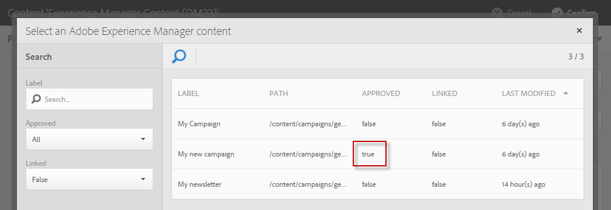

# Trabajo con Adobe Campaign Classic y Adobe Campaign Standard{#working-with-adobe-campaign-classic-and-adobe-campaign-standard}

Puede crear contenido de correo electrónico en AEM y procesarlo en los mensajes de correo electrónico de Adobe Campaign. Para ello, debe hacer lo siguiente:

1. Cree una newsletter nueva en AEM a partir de una plantilla específica de Adobe Campaign.
1. Seleccione [un servicio de Adobe Campaign](#selecting-the-adobe-campaign-cloud-service-and-template) antes de editar el contenido para acceder a toda la funcionalidad.
1. Edite el contenido.
1. Valide el contenido.

A continuación, el contenido se puede sincronizar con un envío en Adobe Campaign. Las instrucciones detalladas se describen en este documento.

Consulte también [Creación de formularios de Adobe Campaign en AEM](/help/sites-authoring/adobe-campaign-forms.md).

>[!NOTE]
>
>Antes de poder usar esta funcionalidad, debe configurar AEM para integrarse con [Adobe Campaign](/help/sites-administering/campaignonpremise.md) o [Adobe Campaign Standard](/help/sites-administering/campaignstandard.md).

## Enviar el contenido de correo electrónico a través de Adobe Campaign {#sending-email-content-via-adobe-campaign}

Después de configurar AEM y Adobe Campaign, puede crear contenido de envío de correo electrónico directamente en AEM y, a continuación, procesarlo en Adobe Campaign.

Al crear contenido de Adobe Campaign en AEM, debe vincular a un servicio de Adobe Campaign antes de editar el contenido para acceder a todas las funciones.

Existen dos casos posibles:

* El contenido se puede sincronizar con un envío de Adobe Campaign. Esto le permite utilizar el contenido de AEM en un envío.
* (solo instalación de Adobe Campaign Classic) El contenido se puede enviar directamente a Adobe Campaign, que genera automáticamente un nuevo envío de correo electrónico. Este modo tiene limitaciones.

Las instrucciones detalladas se describen en este documento.

### Creación de nuevo contenido de correo electrónico  {#creating-new-email-content}

>[!NOTE]
>
>Al agregar plantillas de correo electrónico, asegúrese de agregarlas en **/content/campañas** para que estén disponibles.

#### Creación de nuevo contenido de correo electrónico {#creating-new-email-content-1}

1. En AEM seleccione **Sitios** y luego **Campañas**, luego busque dónde se administran sus campañas de correo electrónico. En el ejemplo siguiente, la ruta es **Sitios** > **Campañas** > **Geometrixx Outdoors** > **Campañas de correo electrónico**.

   >[!NOTE]
   >
   >[Los ejemplos de correo electrónico solo están disponibles en Geometrixx](/help/sites-developing/we-retail.md). Descargue el contenido de ejemplo de Geometrixx de Uso compartido de paquetes.

   

1. Seleccione **Crear** y, a continuación, **Crear página**.
1. Seleccione una de las plantillas disponibles específicas de la instancia de Adobe Campaign a la que se está conectando y, luego, haga clic en **Siguiente**. De forma predeterminada, están disponibles tres plantillas:

   * **Correo electrónico de Adobe Campaign Classic**: le permite añadir contenido a una plantilla predefinida (dos columnas) antes de dirigirlo a Adobe Campaign Classic para enviarlo.
   * **Correo electrónico de Adobe Campaign Standard**: le permite añadir contenido a una plantilla predefinida (dos columnas) antes de dirigirlo a Adobe Campaign Standard para enviarlo.

1. Rellene el **Título** y opcionalmente **Descripción** y haga clic en **Crear**. El título se utiliza como asunto de la newsletter o del mensaje de correo electrónico, salvo que lo sobrescriba mientras edite el mensaje de correo electrónico.

### Selección del servicio de nube y de la plantilla de Adobe Campaign  {#selecting-the-adobe-campaign-cloud-service-and-template}

Para integrar con Adobe Campaign, debe añadir un servicio de nube de Adobe Campaign a la página. Al hacerlo, tendrá acceso a la personalización y a otro tipo de información de Adobe Campaign.

Además, puede que deba seleccionar la plantilla de Adobe Campaign, cambiar el asunto y añadir contenido con texto sin formato para aquellos usuarios que no puedan ver el correo electrónico en HTML.

Puede seleccionar el servicio de nube en la pestaña **Sitios** o en el correo electrónico o la newsletter una vez creados.

El método recomendado es seleccionar el servicio de nube en la pestaña **Sitios**. Seleccionar el servicio de nube en el correo electrónico o la newsletter requiere un método alternativo.

Desde la página **Sitios**:

1. En AEM, seleccione la página de correo electrónico y haga clic en **Ver propiedades**.

   

1. Seleccione **Editar** y, a continuación, la ficha **Servicios de nube**, desplácese hacia abajo hasta la parte inferior y haga clic en el signo + para agregar una configuración y, a continuación, seleccione **Adobe Campaign**.

   

1. Seleccione la configuración que coincida con su instancia de Adobe Campaign de la lista desplegable y haga clic en **Guardar** para confirmar.
1. Para ver la plantilla que el correo electrónico le ha aplicado, puede hacer clic en la pestaña **Adobe Campaign**. Si desea seleccionar otra plantilla, puede acceder a ella desde el correo electrónico durante la edición.

   Si desea aplicar una Plantilla de envíos de correo electrónico específica (de Adobe Campaign), que no sea la plantilla de correo predeterminada, en **Propiedades**, seleccione la ficha **Adobe Campaign**. Introduzca el nombre interno de la plantilla de envío de correo electrónico en la instancia de Adobe Campaign relacionada.

   La plantilla que seleccione determina qué campos de personalización están disponibles en Adobe Campaign.

   

En modo de creación, es posible que no pueda seleccionar en la newsletter o el correo electrónico la configuración del servicio de nube de Adobe Campaign en **Propiedades de página** debido a un problema de diseño. Puede utilizar el método alternativo descrito aquí:

1. En AEM, seleccione la página de correo electrónico y haga clic en **Editar**. Haga clic en **Abrir propiedades**.

   

1. Seleccione **Cloud services** y haga clic en **+** para agregar una configuración. Seleccione cualquier configuración visible (no importa cuál). Toque o haga clic en el signo **+** para añadir otra configuración y, a continuación, seleccione **Adobe Campaign**.

   >[!NOTE]
   >
   >Como alternativa, para seleccionar los servicios de nube, puede seleccionar **Ver propiedades** en la pestaña **Sitios**.

1. Seleccione la configuración que coincida con la instancia de Adobe Campaign en la lista desplegable, elimine la primera configuración que haya creado que no sea para Adobe Campaign y, a continuación, haga clic en la marca de verificación para confirmarla.
1. Continúe con el paso 4 del procedimiento anterior para seleccionar plantillas y añadir texto sin formato.

### Edición del contenido de correo electrónico {#editing-email-content}

Para editar el contenido de correo electrónico:

1. Abra el correo electrónico y, de forma predeterminada, entrará al modo de edición.

   

1. Si desea cambiar el asunto del correo electrónico o agregar texto sin formato para los usuarios que no lo harán en HTML, seleccione **Correo electrónico** y agregue un asunto y texto. Seleccione el icono de página para generar automáticamente una versión de texto sin formato HTML. Haga clic en la marca de verificación cuando termine.

   Puede personalizar la newsletter con los campos de personalización de Adobe Campaign. Para añadir un campo de personalización, haga clic en el botón en que se muestra el logotipo de Adobe Campaign para abrir el selector de campo de personalización. A continuación, puede elegir entre todos los campos disponibles para esta newsletter.

   >[!NOTE]
   >
   >Si los campos de personalización de la pestaña Propiedades del editor se muestran atenuados, vuelva a revisar la configuración.

   

1. Abra el panel Componentes en la parte izquierda de la pantalla y seleccione **Adobe Campaign Newsletter** en el menú desplegable para buscar esos componentes.

   

1. Arrastre los componentes directamente a la página y edítelos en consecuencia. Por ejemplo, puede arrastrar un componente **Texto y personalización (campaña)** y añadir texto personalizado.

   

   Consulte [Componentes de Adobe Campaign](/help/sites-authoring/adobe-campaign-components.md) para obtener una descripción detallada de cada componente.

   

### Inserción de personalización {#inserting-personalization}

Al editar el contenido, puede insertar:

* Campos de contexto de Adobe Campaign. Son campos que se pueden insertar en el texto y que se adaptarán según los datos del destinatario (por ejemplo, nombre, apellidos o cualquier dato de la dimensión de destinatario).
* Bloques de personalización de Adobe Campaign. Son bloques de contenido predefinido que no están relacionados con los datos del destinatario, como un logotipo de marca o un vínculo a una página espejo.

Consulte [Componentes de Adobe Campaign](/help/sites-authoring/adobe-campaign-components.md) para obtener una descripción exhaustiva de los componentes de Campaign.

>[!NOTE]
>
>* Solo se tienen en cuenta los campos de la dimensión objetivo **Perfiles** de Adobe Campaign.
>* Al ver Propiedades desde **Sitios**, no tiene acceso a los campos de contexto de Adobe Campaign. Puede acceder a ellos directamente desde el correo electrónico durante la edición.

Para insertar personalización:

1. Inserte un nuevo componente **Newsletter** > **Texto y personalización (Campaña)** arrastrándolo a la página.

   

1. Para abrir el componente, haga clic en el icono de lápiz. Se abrirá el editor incorporado.

   

   >[!NOTE]
   >
   >**Para Adobe Campaign Standard**:
   >
   >* Los campos de contexto disponibles corresponden a la dimensión objetivo **Perfiles** de Adobe Campaign.
   >* Consulte [Vinculación de una página AEM a un correo electrónico de Adobe Campaign](#linking-an-aem-page-to-an-adobe-campaign-email-adobe-campaign-standard).

   >
   >**Para Adobe Campaign Classic:**
   >
   >* Los campos de contexto disponibles se recuperan de forma dinámica del esquema Adobe Campaign **nms:startingMember**. Los datos de la extensión objetivo se recuperan dinámicamente del flujo de trabajo que contiene el envío sincronizado con el contenido. (Consulte la sección [Sincronización del contenido creado en AEM con un envío de Adobe Campaign](#synchronizing-content-created-in-aem-with-a-delivery-from-adobe-campaign-classic)).
      >
      >
   * Para agregar u ocultar elementos de personalización, consulte [Administración de campos de personalización y bloques](/help/sites-administering/campaignonpremise.md#managing-personalization-fields-and-blocks).
   >* **Importante**: todos los campos de la tabla de origen también deben estar en la tabla de destino (o la tabla de contacto correspondiente).

1. Escriba para insertar texto. Para insertar campos de contexto o bloques de personalización, haga clic en los componentes de Adobe Campaign y selecciónelos. Cuando haya terminado, seleccione la marca.

   

   Después de insertar campos de contexto o bloques de personalización, puede disponer de una vista previa de la newsletter y probar los campos. Consulte [Vista previa de una newsletter](#previewing-a-newsletter).

### Vista previa de un formulario {#previewing-a-newsletter}

Puede previsualizar el aspecto que tendrá la newsletter, así como la personalización.

1. Con la newsletter abierta, haga clic en **Vista previa** en la esquina superior derecha de AEM. AEM muestra el aspecto que tendrá la newsletter cuando los usuarios la reciban.

   

   >[!NOTE]
   >
   >Si utiliza Adobe Campaign Standard y la plantilla de muestra, dos bloques de personalización que muestran contenido inicial (**&quot;&lt;%@ include view=&quot;MirrorPage&quot; %>&quot;** y **&quot;&lt;%@ include view=&quot;UnsubscriptionLink&quot; %>&quot;**) producirán errores al importar el contenido durante el envío. Para ajustarlos, seleccione los bloques correspondientes con el selector de bloque de personalización.

1. Para disponer de una vista previa de la personalización, toque o haga clic en el icono correspondiente de la barra de herramientas para abrir ContextHub. Ahora, los datos de origen de los perfiles seleccionados sustituyen a las etiquetas de campo de personalización. Consulte cómo se adaptan las variables al cambiar perfiles de ContextHub.

   

1. Puede ver los datos de origen de Adobe Campaign asociados al perfil seleccionado actualmente. Para ello, toque o haga clic en el módulo de Adobe Campaign de la barra de ContextHub. Se abrirá un cuadro de diálogo en que se muestran todos los datos de origen del perfil actual. Una vez más, los datos se adaptan al cambiar de perfil.

   

### Aprobación de contenido en AEM {#approving-content-in-aem}

Una vez terminado el contenido, puede iniciar el proceso de aprobación. Vaya a la ficha **Flujo de trabajo** del cuadro de herramientas y seleccione el flujo de trabajo **Aprobar para Adobe Campaign**.

Este flujo de trabajo listo para usar tiene dos pasos: revisión y aprobación, o revisión y rechazo. Sin embargo, este flujo de trabajo puede ampliarse y adaptarse a un proceso más complejo.

Para aprobar contenido para Adobe Campaign, aplique el flujo de trabajo seleccionando **Flujo de trabajo** y seleccionando **Aprobar para Adobe Campaign** y haciendo clic en **Flujo de trabajo de Inicio**. Siga los pasos y apruebe el contenido. También puede rechazar el contenido. Para ello, seleccione **Rechazar** en lugar de **Aprobar** en el último paso del flujo de trabajo.

Una vez aprobado el contenido, aparece como aprobado en Adobe Campaign. A continuación, se puede enviar el correo electrónico.

En Adobe Campaign Standard:

En Adobe Campaign Classic:

>[!NOTE]
El contenido no aprobado se puede sincronizar con un envío en Adobe Campaign, pero el envío no se puede ejecutar. Solo se puede enviar contenido aprobado a través de envíos de Campaign.

## Vinculación de AEM con Adobe Campaign Standard y Adobe Campaign Classic  {#linking-aem-with-adobe-campaign-standard-and-adobe-campaign-classic}

Cómo se vincula o se sincroniza AEM con Adobe Campaign depende de si está utilizando Adobe Campaign Standard basado en suscripción o Adobe Campaign Classic basado en una instalación local.

Consulte las secciones siguientes para obtener instrucciones basadas en la solución de Adobe Campaign:

* [Vinculación de una página de AEM a un correo electrónico de Adobe Campaign (Adobe Campaign Standard)](#linking-an-aem-page-to-an-adobe-campaign-email-adobe-campaign-standard)
* [Sincronización del contenido creado en AEM con un envío de Adobe Campaign Classic](#synchronizing-content-created-in-aem-with-a-delivery-from-adobe-campaign-classic)

### Vinculación de una página de AEM a un correo electrónico de Adobe Campaign (Adobe Campaign Standard) {#linking-an-aem-page-to-an-adobe-campaign-email-adobe-campaign-standard}

Adobe Campaign Standard le permite recuperar el contenido creado en AEM y vincularlo con:

* Un mensaje de correo electrónico.
* Una plantilla de correo electrónico.

De esta manera, puede enviar el contenido. Puede ver si una newsletter está vinculada a un solo envío por el código que se muestra en la página.

>[!NOTE]
Si una newsletter está vinculada a varios envíos, se muestra el número de envíos vinculados (pero no todos los ID).

Para vincular una página creada en AEM a un correo electrónico de Adobe Campaign:

1. Cree un nuevo mensaje de correo electrónico basado en una plantilla de correo electrónico específica de AEM. Consulte [Creación de correos electrónicos en Adobe Campaign Standard](https://helpx.adobe.com/campaign/standard/channels/using/creating-an-email.html) para obtener más información.

   

1. Abra el bloque **Contenido** desde el tablero de envío.

   

1. Seleccione **Vínculo con un contenido de Adobe Experience Manager** en la barra de herramientas para acceder a la lista de contenido disponible en AEM.

   >[!NOTE]
   Si la opción **Vínculo con un Adobe Experience Manager** no aparece en la barra de acciones, compruebe que el **modo de edición de contenido** está configurado correctamente en **Adobe Experience Manager** en las propiedades de correo electrónico.

   

1. Seleccione el contenido que desea utilizar en su correo electrónico.

   Esta lista especifica:

   * La etiqueta del contenido en AEM.
   * El estado de aprobación del contenido en AEM. Si el contenido no se ha aprobado, puede sincronizarlo, pero tendrá que aprobarse antes de que se efectúe el envío. Sin embargo, puede realizar ciertas operaciones, como enviar una prueba o la prueba de vista previa.
   * La fecha de la última modificación del contenido.
   * Cualquier contenido que ya esté vinculado a un envío.

   >[!NOTE]
   De forma predeterminada, se oculta el contenido que ya está sincronizado con un envío. Sin embargo, puede mostrarlo y utilizarlo. Por ejemplo, si desea utilizar el contenido como una plantilla para varios envíos.

   Si el correo electrónico está vinculado a un contenido de AEM, el contenido no se puede editar en Adobe Campaign.

1. Especifique los otros parámetros del mensaje de correo electrónico en su tablero (públicos, programación de ejecución).
1. Implemente el envío de correo electrónico. Durante el análisis de envío, se recupera la versión más actualizada del contenido de AEM.

   >[!NOTE]
   Si el contenido se actualiza en AEM mientras está vinculado a un mensaje de correo electrónico, se actualiza automáticamente en Adobe Campaign durante el análisis. La sincronización también se puede implementar manualmente mediante **Actualizar el contenido de Adobe Experience Manager** desde la barra de acciones de contenido.
   Puede cancelar el vínculo entre un mensaje de correo electrónico y el contenido de AEM mediante **Eliminar el vínculo al contenido de Adobe Experience Manager** desde la barra de acciones de contenido. Este botón solo está disponible si el contenido ya está vinculado al envío. Para vincular un contenido diferente a un envío, debe eliminar el vínculo al contenido actual antes de poder establecer un vínculo nuevo.
   Al borrar el vínculo, el contenido local se mantiene y se puede editar en Adobe Campaign. Si vuelve a vincular el contenido después de haberlo modificado, se perderán todos los cambios.

### Sincronización del contenido creado en AEM con un envío de Adobe Campaign Classic  {#synchronizing-content-created-in-aem-with-a-delivery-from-adobe-campaign-classic}

Adobe Campaign le permite recuperar el contenido creado en AEM y sincronizarlo con:

* Un envío de la campaña
* Una actividad de envío en el flujo de trabajo de una campaña
* Un envío recurrente
* Un envío continuo
* Un envío del Centro de mensajes
* Una plantilla de envío

En AEM, si una newsletter se vincula a un solo envío, el código de envío se muestra en la página.

>[!NOTE]
Si la newsletter está vinculada a varios envíos, se muestra el número de envíos vinculados (pero no todos los ID).
[!NOTE]
Se desaprueba utilizar en 6.1 el paso de flujo de trabajo **Publicar en Adobe Campaign**. Este paso era una parte de la integración de AEM 6.0 con Adobe Campaign y ya no es necesario.

Para sincronizar el contenido creado en AEM con un envío de Adobe Campaign:

1. Cree un envío o agregue una actividad de envío a un flujo de trabajo de campaña seleccionando la Plantilla de envíos **envío de correo electrónico con contenido AEM (mailAEMContent)**.

   

1. Seleccione **Sincronizar** en la barra de herramientas para acceder a la lista de contenido disponible en AEM.

   >[!NOTE]
   Si la opción **Sincronizar** no aparece en la barra de herramientas del envío, compruebe que el campo **Modo de edición de contenido** esté correctamente configurado en **AEM** seleccionando **Propiedades** > **Avanzadas**.

   

1. Seleccione el contenido que desea sincronizar con su envío.

   Esta lista especifica:

   * La etiqueta del contenido en AEM.
   * El estado de aprobación del contenido en AEM. Si el contenido no se ha aprobado, puede sincronizarlo, pero tendrá que aprobarse antes de que se efectúe el envío. Sin embargo, puede realizar ciertas operaciones, como enviar un BAT o la prueba de vista previa.
   * La fecha de la última modificación del contenido.
   * Cualquier contenido que ya esté vinculado a un envío.

   >[!NOTE]
   De forma predeterminada, se oculta el contenido que ya está sincronizado con un envío. Sin embargo, puede mostrarlo y utilizarlo. Por ejemplo, si desea utilizar el contenido como una plantilla para varios envíos.

   

1. Especifique los otros parámetros del envío (destino, etc.)
1. Si es necesario, comience el proceso de aprobación del envío en Adobe Campaign. Además de las aprobaciones configuradas en Adobe Campaign (presupuesto, destino, etc.), es necesaria la aprobación del contenido en AEM. La aprobación del contenido en Adobe Campaign solo es posible si el contenido ya se ha aprobado en AEM.
1. Implemente el envío. Durante el análisis de envío, se recupera la versión más actualizada del contenido de AEM.

   >[!NOTE]
   * Una vez sincronizados envío y contenido, el contenido del envío en Adobe Campaign es de solo lectura. El asunto del correo electrónico, así como su contenido, ya no se pueden modificar.
   * Si el contenido se actualiza en AEM mientras está vinculado a un envío en Adobe Campaign, se actualiza automáticamente en el envío durante el análisis de envío. La sincronización también se puede ejecutar manualmente con el botón **Actualizar contenido ahora**.
   * Puede cancelar la sincronización entre un envío y AEM contenido mediante el botón **Dessincronizar**. Esto solo está disponible si el contenido ya está sincronizado con el envío. Para sincronizar un contenido diferente a un envío, debe cancelar la sincronización con el contenido actual antes de poder establecer un vínculo nuevo.
   * Si se ha cancelado la sincronización, el contenido local se mantiene y se puede editar en Adobe Campaign. Si vuelve a sincronizar el contenido después de haberlo modificado, se perderán todos los cambios.
   * En el caso de los envíos recurrentes y continuos, la sincronización con el contenido de AEM se detiene cada vez que se ejecuta el envío.

