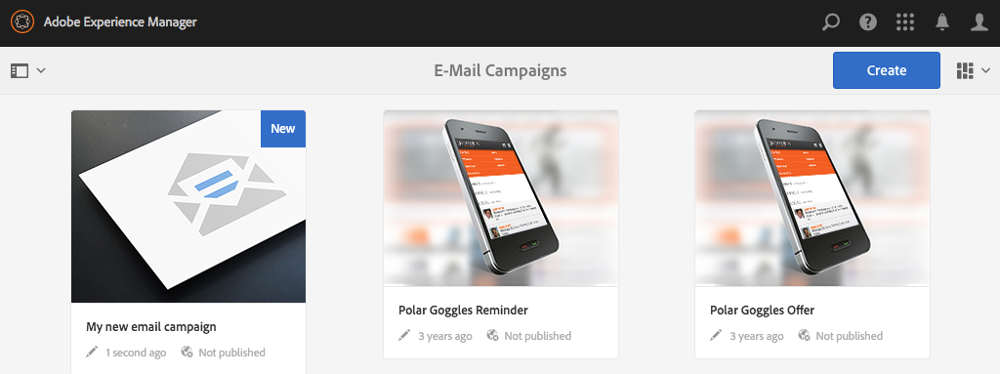
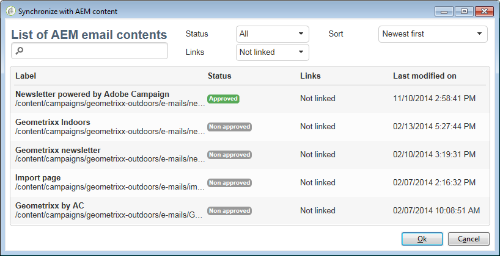

# Uso de Adobe Campaign Classic y Adobe Campaign Standard{#working-with-adobe-campaign-classic-and-adobe-campaign-standard}

AEM Puede crear contenido de correo electrónico en y procesarlo en correos electrónicos de Adobe Campaign. Para ello, debe:

1. AEM Cree un boletín informativo en el que se le asigne un nombre a partir de una plantilla específica de Adobe Campaign.
1. Seleccionar [un servicio de Adobe Campaign](#selecting-the-adobe-campaign-cloud-service-and-template) antes de editar el contenido para acceder a todas las funcionalidades.
1. Edite el contenido.
1. Valide el contenido.

A continuación, el contenido se puede sincronizar con una entrega en Adobe Campaign. Las instrucciones detalladas se describen en este documento.

Consulte también [Creación de Adobe Campaign Forms AEM en](/help/sites-authoring/adobe-campaign-forms.md).

>[!NOTE]
>
>AEM Antes de poder utilizar esta funcionalidad, debe configurar la integración de con el para que se integre con [Adobe Campaign](/help/sites-administering/campaignonpremise.md) o [Adobe Campaign Standard](/help/sites-administering/campaignstandard.md).

## Envío de contenido de correo electrónico mediante Adobe Campaign {#sending-email-content-via-adobe-campaign}

AEM Después de configurar la y Adobe Campaign AEM, puede crear contenido de envío de correo electrónico directamente en la dirección de correo electrónico y, a continuación, procesarlo en Adobe Campaign.

Al crear contenido de Adobe Campaign AEM en la, debe vincular a un servicio de Adobe Campaign antes de editar el contenido para acceder a todas las funcionalidades.

Hay dos casos posibles:

* El contenido se puede sincronizar con una entrega desde Adobe Campaign. AEM Esto permite utilizar contenido de la en una entrega.
* (Solo Adobe Campaign Classic) El contenido se puede enviar directamente a Adobe Campaign, que genera automáticamente un nuevo envío de correo electrónico. Este modo tiene limitaciones.

Las instrucciones detalladas se describen en este documento.

### Creación de nuevo contenido de correo electrónico {#creating-new-email-content}

>[!NOTE]
>
>Al añadir plantillas de correo electrónico, asegúrese de añadirlas en **/content/campaigns** para que estén disponibles.

#### Creación de nuevo contenido de correo electrónico {#creating-new-email-content-1}

1. AEM En la selección **Sites** entonces **Campañas**, luego vaya a donde se administran las campañas de correo electrónico. En el ejemplo siguiente, la ruta es **Sites** > **Campañas** > **Geometrixx Outdoors** > **Campañas de correo electrónico**.

   >[!NOTE]
   >
   >[Los ejemplos de correo electrónico solo están disponibles en Geometrixx](/help/sites-developing/we-retail.md). Descargar contenido de Geometrixx de muestra desde Package Share.

   

1. Seleccionar **Crear** entonces **Crear página**.
1. Seleccione una de las plantillas disponibles específicas a la que se está conectando Adobe Campaign y haga clic en **Siguiente**. Hay tres plantillas disponibles de forma predeterminada:

   * **Correo electrónico de Adobe Campaign Classic**: permite añadir contenido a una plantilla predefinida (dos columnas) antes de enviarlo a Adobe Campaign Classic para su envío.
   * **Correo electrónico de Adobe Campaign Standard**: permite añadir contenido a una plantilla predefinida (dos columnas) antes de enviarlo a Adobe Campaign Standard para su envío.

1. Rellene el **Título** y, opcionalmente, el **Descripción** y haga clic en **Crear**. El título se utiliza como asunto de la newsletter/correo electrónico a menos que lo sobrescriba al editar el correo electrónico.

### Selección del servicio en la nube y la plantilla de Adobe Campaign {#selecting-the-adobe-campaign-cloud-service-and-template}

Para integrarse con Adobe Campaign, debe añadir un servicio de nube de Adobe Campaign a la página. Al hacerlo, puede acceder a la personalización y a otra información de Adobe Campaign.

Además, es posible que también tenga que seleccionar la plantilla de Adobe Campaign, cambiar el asunto y añadir contenido de texto sin formato para los usuarios que no verán el correo electrónico en HTML.

Puede seleccionar el servicio en la nube desde el **Sites** o desde el correo electrónico/newsletter después de crearlo.

Selección del servicio en la nube desde el **Sites** es el método recomendado. La selección del servicio en la nube desde el correo electrónico/newsletter requiere una solución alternativa.

Desde el **Sites** página:

1. AEM En, seleccione la página de correo electrónico y haga clic en **Ver propiedades**.

   

1. Seleccionar **Editar** y luego el **Cloud Services** y desplácese hacia abajo hasta la parte inferior y haga clic en el signo + para agregar una configuración y, a continuación, seleccione **Adobe Campaign**.

   

1. Seleccione la configuración que coincida con la instancia de Adobe Campaign en la lista desplegable y confirme haciendo clic en **Guardar**.
1. Puede ver la plantilla que el correo electrónico le ha aplicado haciendo clic en el **Adobe Campaign** pestaña. Si desea seleccionar otra plantilla, puede acceder a ella desde el correo electrónico mientras la edita.

   Si desea aplicar una plantilla de envíos de correo electrónico específica (de Adobe Campaign), distinta de la plantilla de correo predeterminada, en **Propiedades**, seleccione la **Adobe Campaign** pestaña. Introduzca el nombre interno de la plantilla de envíos de correo electrónico en la instancia de Adobe Campaign relacionada.

   La plantilla que seleccione determinará qué campos de personalización están disponibles en Adobe Campaign.

   

Desde la newsletter/el correo electrónico de creación, es posible que no pueda seleccionar la configuración del servicio en la nube de Adobe Campaign en **Propiedades de página** debido a un problema de diseño. Puede utilizar la solución que se describe aquí:

1. AEM En, seleccione la página de correo electrónico y haga clic en **Editar**. Clic **Abrir propiedades**.

   

1. Seleccionar **Cloud Services** y haga clic en **+** para añadir una configuración. Seleccione cualquier configuración visible (no importa cuál). Haga clic en **+** inicie sesión para añadir otra configuración y seleccione **Adobe Campaign**.

   >[!NOTE]
   >
   >También puede seleccionar los servicios en la nube seleccionando **Ver propiedades** en el **Sites** pestaña.

1. Seleccione la configuración que coincida con la instancia de Adobe Campaign en la lista desplegable, elimine la primera configuración que creó que no era para Adobe Campaign y, a continuación, confirme haciendo clic en la marca de verificación.
1. Siga con el paso 4 del procedimiento anterior para seleccionar plantillas y agregar texto sin formato.

### Edición de contenido de correo electrónico {#editing-email-content}

Para editar el contenido del correo electrónico:

1. Abra el correo electrónico y, de forma predeterminada, introduzca el modo Editar.

   

1. Si desea cambiar el asunto del correo electrónico o añadir texto sin formato para los usuarios que no verán el correo electrónico en HTML, seleccione **Correo electrónico** y añada un asunto y un texto. Seleccione el icono de página para generar automáticamente una versión de texto sin formato desde HTML. Haga clic en la marca de verificación cuando termine.

   Puede personalizar la newsletter mediante los campos de personalización de Adobe Campaign. Para agregar un campo de personalización, abra el selector de campos de personalización haciendo clic en el botón que muestra el logotipo de Adobe Campaign. A continuación, puede elegir entre todos los campos disponibles para esta newsletter.

   >[!NOTE]
   >
   >Si los campos de personalización de las propiedades desde el editor están atenuados, vuelva a examinar la configuración.

   

1. Abra el panel Componentes en el lado izquierdo de la pantalla y seleccione **Newsletter de Adobe Campaign** en el menú desplegable para buscar esos componentes.

   

1. Arrastre los componentes directamente a la página y edítelos en consecuencia. Por ejemplo, puede arrastrar un **Texto y personalización (Campaign)** y agregue texto personalizado.

   

   Consulte [Componentes de Adobe Campaign](/help/sites-authoring/adobe-campaign-components.md) para obtener una descripción detallada de cada componente.

   

### Inserción de personalización {#inserting-personalization}

Al editar el contenido, puede insertar:

* Campos de contexto de Adobe Campaign. Son campos que se pueden insertar dentro del texto y que se adaptan a los datos del destinatario (por ejemplo, nombre, apellidos o cualquier dato de la dimensión objetivo).
* Bloques de personalización de Adobe Campaign. Son bloques de contenido predefinido que no están relacionados con los datos del destinatario, como un logotipo de una marca o un vínculo a una página espejo.

Consulte [Componentes de Adobe Campaign](/help/sites-authoring/adobe-campaign-components.md) para obtener una descripción completa de los componentes de Campaign.

>[!NOTE]
>
>* Solo los campos de Adobe Campaign **Perfiles** se tienen en cuenta las dimensiones de segmentación.
>* Al ver las propiedades de **Sites**, no tiene acceso a los campos de contexto de Adobe Campaign. Puede acceder a ellas directamente desde el correo electrónico mientras edita.

Para insertar una personalización:

1. Insertar un nuevo **Newsletter** > **Texto y personalización (Campaign)** al arrastrarlo a la página.

   

1. Abra el componente haciendo clic en el icono Lápiz. Se abre el editor en contexto.

   

   >[!NOTE]
   >
   >**Para Adobe Campaign Standard:**
   >
   >* Los campos de contexto disponibles corresponden a la variable **Perfiles** dimensión de segmentación en Adobe Campaign.
   >* Consulte [AEM Vinculación de una página de a un correo electrónico de Adobe Campaign](#linking-an-aem-page-to-an-adobe-campaign-email-adobe-campaign-standard).
   >
   >**Para Adobe Campaign Classic:**
   >
   >* Los campos de contexto disponibles se recuperan dinámicamente desde Adobe Campaign **nms:seedMember** esquema. Los datos de la extensión de Target se recuperan dinámicamente del flujo de trabajo que contiene la entrega sincronizada con el contenido. (Consulte la [AEM Sincronización del contenido creado en la con un envío de Adobe Campaign](#synchronizing-content-created-in-aem-with-a-delivery-from-adobe-campaign-classic) ).
   >
   >* Para añadir u ocultar elementos de personalización, consulte [Administración de campos y bloques de personalización](/help/sites-administering/campaignonpremise.md#managing-personalization-fields-and-blocks).
   >* **Importante**: todos los campos de la tabla semilla también deben estar en la tabla de destinatarios (o la tabla de contacto correspondiente).

1. Inserte texto escribiendo. Inserte campos de contexto o bloques de personalización haciendo clic en los componentes de Adobe Campaign y seleccionándolos. Cuando termine, seleccione la marca de verificación.

   

   Después de insertar campos de contexto o bloques de personalización, puede obtener una vista previa del boletín informativo y probar los campos. Consulte [Previsualización de una newsletter](#previewing-a-newsletter).

### Previsualización de una newsletter {#previewing-a-newsletter}

Puede obtener una vista previa del aspecto que tendrá la newsletter y previsualizar la personalización.

1. Con la newsletter abierta, haga clic en **Previsualizar** AEM en la esquina superior derecha de la. AEM Muestra el aspecto que tendrá la newsletter cuando los usuarios la reciban.

   

   >[!NOTE]
   >
   >Si utiliza Adobe Campaign Standard y la plantilla de ejemplo, dos bloques personalizados que muestran contenido inicial: **&quot;&lt;%@ include view=&quot;MirrorPage&quot; %>&quot;** y **&quot;&lt;%@ include view=&quot;UnsubscriptionLink&quot; %>&quot;** : generará errores al importar el contenido durante la entrega. Puede ajustarlos seleccionando los bloques correspondientes con el selector de bloques personalizado.

1. Para obtener una vista previa de la personalización, abra ContextHub tocando o haciendo clic en el icono correspondiente de la barra de herramientas. Las etiquetas de los campos de personalización ahora se sustituyen por los datos semilla de la persona seleccionada. Consulte cómo se adaptan las variables al cambiar de perfil en ContextHub.

   

1. Puede ver los datos semilla procedentes de Adobe Campaign que están asociados al usuario seleccionado actualmente. Para ello, haga clic en el módulo Adobe Campaign en la barra de ContextHub. Se abrirá un cuadro de diálogo en el que se mostrarán todos los datos semilla del perfil actual. De nuevo, los datos se adaptan cuando se cambia a una persona diferente.

   

### AEM Aprobación de contenido en la {#approving-content-in-aem}

Una vez finalizado el contenido, puede iniciar el proceso de aprobación. Vaya a la **Flujo de trabajo** de la caja de herramientas y seleccione la **Aprobar para Adobe Campaign** flujo de trabajo.

Este flujo de trabajo predeterminado tiene dos pasos: revisión y luego aprobación, o revisión y luego rechazo. Sin embargo, este flujo de trabajo se puede ampliar y adaptar a un proceso más complejo.

Para aprobar el contenido de Adobe Campaign, aplique el flujo de trabajo seleccionando **Flujo de trabajo** y seleccionando **Aprobar para Adobe Campaign** y haga clic en **Iniciar flujo de trabajo**. Siga los pasos y apruebe el contenido. También puede rechazar el contenido seleccionando **Rechazar** en lugar de **Aprobar** en el último paso del flujo de trabajo.

Una vez aprobado el contenido, aparece como aprobado en Adobe Campaign. A continuación, se puede enviar el correo electrónico.

En Adobe Campaign Standard:

En Adobe Campaign Classic:

>[!NOTE]
>
El contenido no aprobado se puede sincronizar con un envío en Adobe Campaign, pero el envío no se puede ejecutar. Solo se puede enviar contenido aprobado a través de envíos de Campaign.

## AEM Vinculación de con Adobe Campaign Standard y Adobe Campaign Classic {#linking-aem-with-adobe-campaign-standard-and-adobe-campaign-classic}

AEM La forma de vincular o sincronizar los con Adobe Campaign depende de si utiliza Adobe Campaign Standard basado en suscripción o Adobe Campaign Classic local.

Consulte las secciones siguientes para obtener instrucciones basadas en la solución de Adobe Campaign:

* [AEM Vinculación de una página de a un correo electrónico de Adobe Campaign (Adobe Campaign Standard)](#linking-an-aem-page-to-an-adobe-campaign-email-adobe-campaign-standard)
* [AEM Sincronización del contenido creado en la con un envío de Adobe Campaign Classic](#synchronizing-content-created-in-aem-with-a-delivery-from-adobe-campaign-classic)

### AEM Vinculación de una página de a un correo electrónico de Adobe Campaign (Adobe Campaign Standard) {#linking-an-aem-page-to-an-adobe-campaign-email-adobe-campaign-standard}

Adobe Campaign Standard AEM le permite recuperar y vincular contenido creado en la con:

* Un correo electrónico.
* Una plantilla de correo electrónico.

Al hacerlo, puede enviar el contenido. Verá si un boletín informativo está vinculado a un único envío por el código que se muestra en la página.

>[!NOTE]
>
Si un boletín informativo está vinculado a varios envíos, se muestra el número de envíos vinculados (pero no todos los ID).

AEM Para vincular una página creada en con un correo electrónico desde Adobe Campaign, haga lo siguiente:

1. AEM Cree un correo electrónico basado en una plantilla de correo electrónico específica de un cliente de correo electrónico. Consulte [Creación de correos electrónicos en Adobe Campaign Standard](https://helpx.adobe.com/campaign/standard/channels/using/creating-an-email.html) para obtener más información.

   

1. Abra el **Contenido** bloque del panel de envío.

   

1. Seleccionar **Vínculo con contenido de Adobe Experience Manager** AEM en la barra de herramientas para acceder a la lista de contenido disponible en las listas de contenido disponibles en las listas de.

   >[!NOTE]
   >
   Si la variable **Vínculo con un Adobe Experience Manager** no aparece en la barra de acciones, compruebe que la variable **Modo de edición de contenido** está configurado correctamente como **Adobe Experience Manager** en las propiedades de correo electrónico.

   

1. Seleccione el contenido que desee utilizar en el correo electrónico.

   Esta lista especifica:

   * AEM La etiqueta del contenido en la.
   * AEM El estado de aprobación del contenido en la. Si el contenido no está aprobado, puede sincronizarlo, pero tendrá que aprobarse antes de realizar la entrega. Sin embargo, puede ejecutar determinadas operaciones, como enviar una prueba o la prueba de previsualización.
   * La fecha de la última modificación del contenido.
   * Cualquier contenido que ya esté vinculado a una entrega.

   >[!NOTE]
   >
   De forma predeterminada, el contenido que ya está sincronizado con una entrega está oculto. Sin embargo, puede mostrarlo y utilizarlo. Por ejemplo, si desea utilizar el contenido como plantilla para varios envíos.

   AEM Cuando el correo electrónico está vinculado a un contenido de, el contenido no se puede editar en Adobe Campaign.

1. Especifique los demás parámetros del correo electrónico desde su panel (audiencias, programación de ejecución).
1. Ejecute la entrega de correo electrónico. AEM Durante el análisis de la entrega, se recupera la versión más actualizada del contenido de la.

   >[!NOTE]
   >
   AEM Si el contenido se actualiza en el tiempo de ejecución mientras está vinculado a un correo electrónico, se actualiza automáticamente en Adobe Campaign durante el análisis. La sincronización también se puede ejecutar manualmente mediante **Actualizar contenido de Adobe Experience Manager** en la barra de acciones de contenido.
   >
   AEM Puede cancelar el vínculo entre un correo electrónico y el contenido de la lista de distribución mediante el uso de **Eliminar el vínculo con el contenido de Adobe Experience Manager** en la barra de acciones de contenido. Este botón solo está disponible si un contenido ya está vinculado con la entrega. Para vincular un contenido diferente a una entrega, debe eliminar el vínculo de contenido actual antes de poder establecer un vínculo nuevo.
   >
   Cuando se elimina el vínculo, el contenido local se conserva y se puede editar en Adobe Campaign. Si vuelve a vincular el contenido después de haberlo modificado, se perderán todos los cambios.

### AEM Sincronización del contenido creado en la con un envío de Adobe Campaign Classic {#synchronizing-content-created-in-aem-with-a-delivery-from-adobe-campaign-classic}

Adobe Campaign AEM le permite recuperar y sincronizar contenido creado en la con:

* Entrega de una campaña
* Una actividad de envío en un flujo de trabajo de campaña
* Un envío recurrente
* Un envío continuo
* Un envío del centro de mensajes
* Una plantilla de envíos

AEM En el caso de los envíos, si un boletín informativo está vinculado a un solo envío, el código de envío se muestra en la página.

>[!NOTE]
>
Si la newsletter está vinculada a varios envíos, se muestra el número de envíos vinculados (pero no todos los ID).
>
[!NOTE]
>
El paso Flujo de trabajo **Publicar en Adobe Campaign** AEM está obsoleto en la versión 6.1 de. AEM Este paso formaba parte de la integración de 6.0 con Adobe Campaign y ya no es necesario.

AEM Para sincronizar el contenido creado en la con un envío de Adobe Campaign:

1. Cree una entrega o añada una actividad de entrega a un flujo de trabajo de campaña seleccionando la **AEM Entrega de correo electrónico con contenido de (mailAEMContent)** plantilla de envíos.

   

1. Seleccionar **Sincronizar** AEM en la barra de herramientas para acceder a la lista de contenido disponible en las listas de contenido disponibles en las listas de.

   >[!NOTE]
   >
   Si la variable **Sincronizar** no aparece en la barra de herramientas de la entrega, compruebe que la variable **Modo de edición de contenido** El campo está configurado correctamente en **AEM** seleccionando **Propiedades** > **Avanzadas**.

   

1. Seleccione el contenido que desea sincronizar con su envío.

   Esta lista especifica:

   * AEM La etiqueta del contenido en la.
   * AEM El estado de aprobación del contenido en la. Si el contenido no está aprobado, puede sincronizarlo, pero tendrá que aprobarse antes de realizar la entrega. Sin embargo, puede ejecutar determinadas operaciones, como enviar una prueba BAT o de vista previa.
   * La fecha de la última modificación del contenido.
   * Cualquier contenido que ya esté vinculado a una entrega.

   >[!NOTE]
   >
   De forma predeterminada, el contenido que ya está sincronizado con una entrega está oculto. Sin embargo, puede mostrarlo y utilizarlo. Por ejemplo, si desea utilizar el contenido como plantilla para varios envíos.

   

1. Especifique los demás parámetros de la entrega (objetivo, etc.)
1. Si es necesario, inicie el proceso de aprobación de la entrega en Adobe Campaign. AEM Además de las aprobaciones configuradas en Adobe Campaign (presupuesto, objetivo, etc.), es necesaria la aprobación de contenido en la. La aprobación de contenido en Adobe Campaign AEM solo es posible si el contenido ya se ha aprobado en la creación de informes de.
1. Ejecute la entrega. AEM Durante el análisis de la entrega, se recupera la versión más actualizada del contenido de la.

   >[!NOTE]
   >
   * Una vez sincronizados el envío y el contenido, el contenido de la entrega en Adobe Campaign se convierte en de solo lectura. El asunto del correo electrónico y su contenido ya no se pueden modificar.
   * AEM Si el contenido se actualiza en el momento de la entrega mientras está vinculado a una entrega en Adobe Campaign, se actualiza automáticamente en la entrega durante el análisis de la entrega. La sincronización también se puede ejecutar manualmente utilizando **Actualizar contenido ahora** botón.
   * AEM Puede cancelar la sincronización entre una entrega y el contenido de la lista de distribución mediante el uso de la variable **Desincronizar** botón. Esto solo está disponible si un contenido ya está sincronizado con el envío. Para sincronizar un contenido diferente con una entrega, debe cancelar la sincronización de contenido actual antes de poder establecer un nuevo vínculo.
   * Si se desincroniza, el contenido local se conserva y se puede editar en Adobe Campaign. Si vuelve a sincronizar el contenido después de haberlo modificado, perderá todos los cambios.
   * AEM En el caso de los envíos recurrentes y continuos, la sincronización con el contenido de la aplicación se detiene cada vez que se ejecuta el envío.
