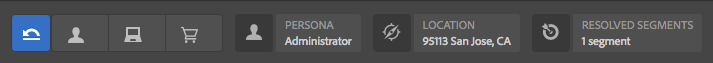

# Vista previa de páginas mediante datos de ContextHub{#previewing-pages-using-contexthub-data} 

La barra de herramientas de [ContextHub](/help/sites-developing/contexthub.md) muestra datos de los almacenes de ContextHub y le permite cambiar datos de los almacenes. La barra de herramientas de ContextHub es útil para obtener una vista previa del contenido determinado por los datos de un almacén de ContextHub.

La barra de herramientas se compone de una serie de modos de IU que contienen uno o más módulos de IU.

* Los modos de IU son iconos que aparecen en la parte izquierda de la barra de herramientas. Al tocar o hacer clic en un icono, la barra de herramientas muestra los módulos de IU que contiene.
* Los módulos de IU muestran datos de uno o más almacenes de ContextHub. Algunos módulos de IU también le permiten manipular los datos de los almacenes.

ContextHub instala varios modos y módulos de IU. Es posible que el administrador haya [configurado ContextHub](/help/sites-administering/contexthub-config.md) para que se muestren otros distintos.

## Mostrar la barra de herramientas de ContextHub {#revealing-the-contexthub-toolbar}

La barra de herramientas de ContextHub está disponible en modo de Vista previa. La barra de herramientas solo está disponible en instancias de autor y únicamente si el administrador la ha activado.

1. Con la página abierta para edición, en la barra de herramientas, toque o haga clic en Vista previa.

   

1. Para mostrar la barra de herramientas, toque o haga clic en el icono de ContextHub.

   

## Funciones del módulo de IU {#ui-module-features}

Cada módulo de IU proporciona un conjunto diferente de funciones, pero los siguientes tipos de funciones son comunes. Dado que los módulos de IU son ampliables, el desarrollador puede implementar otras funciones según sea necesario.

### Contenido de la barra de herramientas {#toolbar-content}

Los módulos de IU pueden mostrar datos de uno o más almacenes de ContextHub en la barra de herramientas. Los módulos de interfaz de usuario utilizan un icono y un título para identificarse.

### Contenido emergente {#popup-content}

Al tocarlos o hacer clic en ellos, algunos módulos de IU muestran una superposición emergente. Normalmente, la ventana emergente contiene información adicional, aparte de lo que aparece en la barra de herramientas.

### Formularios emergentes {#popup-forms}

La superposición emergente de un módulo puede incluir elementos de formulario que le permiten cambiar los datos del almacén de ContextHub. Si el contenido de la página viene determinado por los datos del almacén, puede utilizar el formulario y observar los cambios en el contenido de la página.

### Modo de pantalla completa {#fullscreen-mode}

Las superposiciones emergentes pueden incluir un icono que toca o en el que hace clic para expandir el contenido emergente para cubrir toda la ventana o la pantalla del navegador.

