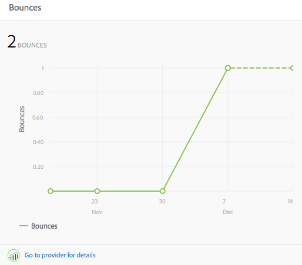

# Perspectiva de contenido{#content-insight}

La perspectiva de contenido proporciona información sobre el rendimiento de la página mediante análisis web y recomendaciones de SEO. Utilice la perspectiva de contenido para tomar decisiones sobre cómo modificar las páginas o saber de qué manera los últimos cambios han influido en el rendimiento. En cada página que se cree, puede abrir la perspectiva de contenido para analizar la página.

El diseño de la página Perspectiva de contenido cambia para adaptarse a las dimensiones de la pantalla y a la orientación del dispositivo que esté utilizando.

## Datos de los informes

La página Perspectiva de contenido incluye informes que utilizan datos de las Adobe SiteCatalyst, Adobe Target, Adobe Social y BrightEdge:

* SiteCatalyst: están disponibles los informes para las métricas siguientes:

   * Vistas de la página
   * Tiempo promedio empleado en la página
   * Orígenes

* Target: informes sobre la actividad de la campaña para la que su página incluye ofertas.
* BrightEdge: informes sobre las funciones de la página que mejoran la visibilidad de la página para los motores de búsqueda; se recomiendan las funciones que deben implementarse.

Consulte [Abrir Analítica y recomendaciones para una página](/help/sites-authoring/ci-analyze.md#opening-analytics-and-recommendations-for-a-page).

## Período de informe

Los informes muestran los datos durante un período de tiempo que usted mismo controla. Al ajustar el período de informe, los informes se actualizan automáticamente con datos para ese período. Los avisos visuales indican el tiempo en que las versiones de la página han cambiado, lo que le permite comparar el rendimiento de cada versión.

También puede especificar la granularidad de los datos del informe; por ejemplo, puede disponer de datos diarios, semanales, mensuales o anuales.

Consulte [Cambio del período de informe](/help/sites-authoring/ci-analyze.md#changing-the-reporting-period).

>[!NOTE]
>
>Los informes de Perspectiva de contenido requieren que el administrador haya integrado AEM con SiteCatalyst, Target y BrightEdge. See [Integrating with SightCatalyst](/help/sites-administering/adobeanalytics.md), [Integrating with Adobe Target](/help/sites-administering/target.md), and [Integrating with BrightEdge](/help/sites-administering/brightedge.md).

## El informe Vistas {#the-views-report}

El informe Vistas incluye las funciones siguientes para evaluar el tráfico de la página:

* La cantidad total de vistas en una página durante el período de informe.
* Un gráfico de la cantidad de vistas a lo largo del período de informe:

   * Cantidad total de vistas.
   * Visitantes únicos.

## El informe Promedio de tiempo de visita a la página {#the-page-average-engaged-report}

El informe Promedio de tiempo de visita a la página incluye las funciones siguientes para evaluar la eficacia de la página:

* El promedio de tiempo que la página permanece abierta durante todo el período de informe.
* Un gráfico del promedio de duración de la vista de una página a lo largo del período de informe.

## El informe Orígenes {#the-sources-report}

En el informe Orígenes se indica cómo los usuarios navegan a la página, por ejemplo, desde los resultados del motor de búsqueda o mediante una dirección URL conocida.

## El informe Devoluciones {#the-bounces-report}

En el informe Devoluciones se incluye un gráfico en que se muestra el número de devoluciones que se han producido en una página durante el período de informe seleccionado.

## El informe Actividad de la campaña {#the-campaign-activity-report}

Para cada campaña para la que la página esté activa, aparece un informe denominado Actividad de *nombre de la campaña*. El informe muestra las impresiones de página y las conversiones de cada segmento para el que se proporciona una oferta.

## El informe Recomendaciones de SEO {#the-seo-recommendations-report}

El informe Recomendaciones de SEO contiene los resultados del análisis de BrightEdge para la página. El informe es una lista de comprobación de funciones de la página en que se indica qué funciones se incluyen y cuáles no se incluyen en la página para maximizar el potencial de que los motores de búsqueda la encuentren.

El informe le permite crear tareas para realizar mejoras que sirvan para aumentar el potencial de que la página se encuentre. En Recomendaciones se indica que las tareas se han creado para implementar la recomendación. Consulte [Asignación de tareas para Recomendaciones de SEO](/help/sites-authoring/ci-analyze.md#assigning-tasks-for-seo-recommendations).

