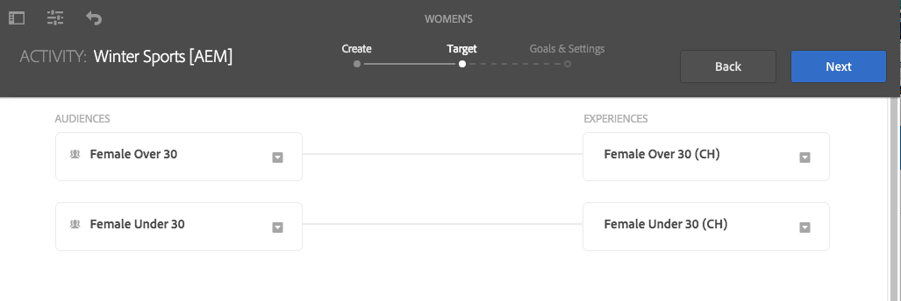
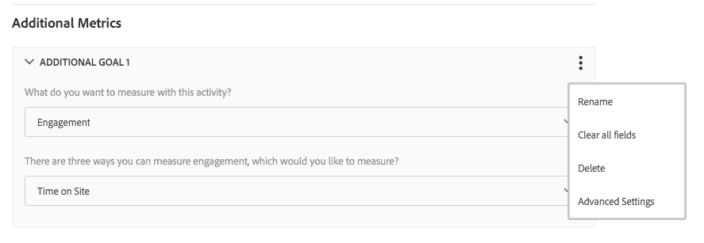

# Creación de contenido orientado mediante el modo de Orientación{#authoring-targeted-content-using-targeting-mode}

Contenido orientado por el autor mediante el modo de Orientación de AEM. El modo de Orientación y el componente Target proporcionan herramientas para crear contenido para las experiencias:

* Reconozca fácilmente el contenido orientado que se encuentra en la página. Una línea discontinua forma un borde alrededor de todo el contenido orientado.
* Seleccione una marca y una actividad para ver las experiencias.
* Añada experiencias a una actividad o quite experiencias.
* Realice la prueba A/B y convierta a los ganadores (solo Adobe Target).
* Para añadir ofertas a una experiencia, créelas o utilice ofertas de una biblioteca.
* Configure los objetivos y controle el rendimiento.
* Simule la experiencia de usuario.
* Para obtener más personalización, configure el componente Target.

Puede utilizar AEM o Adobe Target como motor de orientación (para utilizar Adobe Target, debe tener una cuenta de Adobe Target válida). Si utiliza Adobe Target, primero debe configurar la integración. See [instructions for integrating with Adobe Target](/help/sites-administering/target.md).

Las actividades y experiencias que ve en el modo de Target reflejan la [consola Actividades](/help/sites-authoring/activitylib.md):

* Los cambios que realice en las actividades y experiencias mediante el modo de Orientación se reflejan en la consola Actividades.
* Los cambios que se realizan en la consola Actividades se reflejan en el modo de Orientación.

>[!NOTE]
>
>Al crear una campaña en Adobe Target, se asigna una propiedad denominada `thirdPartyId` a cada campaña. Al eliminar la campaña en Adobe Target, thirdPartyId no se elimina. No puede volver a utilizar `thirdPartyId` para las campañas de distintos tipos (AB, XT) y no se puede quitar manualmente. Para evitar este problema, asigne a cada campaña un nombre único; por lo tanto, los nombres de campaña no se pueden reutilizar en diferentes tipos de campaña.
>
>Si utiliza el mismo nombre en el mismo tipo de campaña, sobrescribirá la campaña existente.
>
>Si al sincronizar se muestra el mensaje de error “Se ha producido un error en la solicitud. `thirdPartyId` ya existe”, cambie el nombre de la campaña y vuelva a sincronizar.

>[!NOTE]
>
>Cuando se selecciona el destino, la combinación de marca y actividad permanecen a nivel de usuario y no a nivel de canal.

## Cambiar al modo de Orientación {#switching-to-targeting-mode}

Cambie al modo de Target para acceder a las herramientas de creación de contenido orientado.

Para cambiar al modo de Target:

1. Abra la página para la que desea crear contenido orientado.
1. En la barra de herramientas situada en la parte superior de la página, toque o haga clic en el menú desplegable de modo para mostrar los tipos de modo disponibles.

   

1. Click or tap **Targeting**. Las opciones de orientación se muestran en la parte superior de la página.

   

## Adición de una actividad con el modo de Orientación {#adding-an-activity-using-targeting-mode}

Utilice el modo de Orientación para añadir una actividad a una marca. Al añadir una actividad, contiene la experiencia predeterminada. Después de añadir la actividad, se inicia el proceso de orientación del contenido para la actividad.

También puede crear y administrar las actividades de Adobe Target desde AEM con la opción de seleccionar el motor de orientación (AEM o Adobe Target) y el tipo de actividad (orientación de la experiencia o prueba A/B).

Además, puede administrar objetivos y métricas para todas las actividades de Adobe Target y administrar los públicos de Adobe Target. También se incluye el informe de actividad de Adobe Target, que incluye la conversión de ganadores para la prueba A/B.

Al añadir una actividad, también aparece en la consola [Actividades](/help/sites-authoring/activitylib.md).

Para añadir una actividad:

1. Utilice el menú desplegable **Marca** para seleccionar la marca para la que desea crear la actividad.

   >[!NOTE]
   >
   >Se recomienda [crear marcas a través de la consola de actividades](/help/sites-authoring/activitylib.md#creating-a-brand-using-the-activities-console).
   >
   >
   >If you create a brand in any other way, make certain that the node `/campaigns/<brand>/master` exists or an error will result when you attempt to create an activity.

1. Toque o haga clic en + junto al menú desplegable **Actividad**.
1. Escriba un nombre para la actividad.

   >[!NOTE]
   >
   >Al crear una actividad nueva y tener una configuración de nube de Adobe Target asociada a la página o a uno de sus elementos raíz, AEM supone automáticamente que Adobe Target es el motor.

1. En el menú desplegable del motor de **Orientación**, seleccione el motor de orientación.

   * If you select **ContextHub AEM**, the remaining fields are dimmed and not available. Haga clic o pulse **Crear**.

   * Si selecciona **Adobe Target**, puede seleccionar una configuración (de forma predeterminada, es la configuración que proporcionó al [configurar la cuenta](/help/sites-administering/opt-in.md)) y el tipo de actividad.

   * Si utiliza la integración AEM/Adobe Campaign y envía contenido orientado (newsletters), seleccione **Adobe Campaign**. Consulte [Integración con Adobe Campaign](/help/sites-administering/campaign.md) para obtener más información.

1. En el menú Actividad, seleccione **Orientación de la experiencia** o **Prueba A/B**.

   * Orientación de la experiencia: administre las actividades de Adobe Target desde AEM.
   * Prueba A/B: cree o administre las actividades de la prueba A/B en Adobe Target desde AEM.

## El proceso de orientación: Crear, Orientar y Objetivos y configuraciones {#the-targeting-process-create-target-and-goals-settings}

El modo de Orientación le permite configurar diversas proporciones de una actividad. Utilice el proceso siguiente que consta de tres pasos para crear contenido orientado para una actividad de marca:

1. [Crear](#create-authoring-the-experiences): añada o quite experiencias y añada ofertas para cada experiencia.
1. [Orientar](#diagramtargetconfiguringtheaudiences): especifique el público al que se orienta cada experiencia. Puede orientar a un público concreto y, si utiliza la prueba A/B, decidir qué porcentaje del tráfico corresponde a cada experiencia.
1. [Objetivos y configuraciones](#settingsgoalssettingsconfiguringtheactivityandsettinggoals): programe la actividad y establezca la prioridad. También puede establecer objetivos de indicadores de éxito.

Utilice el procedimiento siguiente para iniciar el proceso de orientación del contenido para una actividad.

>[!NOTE]
>
>Para utilizar el proceso de segmentación, debe ser miembro del grupo de usuarios Autores de actividad de Target.

Para añadir una actividad:

1. En el menú desplegable **Marca**, seleccione la marca que contiene la actividad en que está trabajando.
1. En el menú desplegable **Actividad**, seleccione la actividad para la que está creando contenido orientado.
1. Para mostrar los controles que lo guiarán a través del proceso de orientación, toque o haga clic en **Iniciar orientación**.

   

   >[!NOTE]
   >
   >Para cambiar la actividad con la que está trabajando, toque o haga clic en **Atrás**.

## Crear: creación de experiencias {#create-authoring-the-experiences}

El paso Crear de la orientación del contenido implica la creación de experiencias. Durante este paso, puede crear o eliminar las experiencias de la actividad y añadir ofertas a cada experiencia.

### Visualización de ofertas de experiencia en el modo de Orientación {#seeing-experience-offers-in-targeting-mode}

Después de [iniciar el proceso de orientación](/help/sites-authoring/content-targeting-touch.md#the-targeting-process-create-target-and-goals-settings), seleccione una experiencia para ver las ofertas que se proporcionan para esa experiencia. Al seleccionar una experiencia, los componentes orientados de la página cambian para mostrar la oferta para esa experiencia.

>[!CAUTION]
>
>Tenga cuidado al desactivar la orientación de un componente que ya está orientado en la instancia del autor. La actividad respectiva también se eliminará automáticamente de la instancia de publicación.

>[!NOTE]
>
>Como oferta se entiende el contenido de un componente orientado.

Las experiencias se muestran en el panel Públicos. In the following example, experiences include **Default**, **Female**, **Female over 30**, and **Female under 30**. This example shows the Default offer of a targeted **Image** component.

Al seleccionar una experiencia distinta, el componente Imagen muestra la oferta para esa experiencia.

Cuando se selecciona una experiencia y el componente orientado no incluye ninguna oferta para esa experiencia, el componente muestra **Añadir oferta** superpuesto a la oferta predeterminada semitransparente. Cuando no se ha creado ninguna oferta para una experiencia, la oferta **Predeterminada** se muestra para el segmento asignado a la experiencia.

La experiencia predeterminada también se muestra cuando las propiedades del visitante no coinciden con ningún segmento asignado a las experiencias. See [Adding Experiences using Targeting Mode](#adding-and-removing-experiences-using-targeting-mode).

### Ofertas personalizadas y ofertas de la biblioteca {#custom-offers-and-library-offers}

Las ofertas que [se crean en la página](/help/sites-authoring/content-targeting-touch.md#adding-a-custom-offer) y se utilizan para una experiencia única se denominan ofertas personalizadas. La imagen siguiente está superpuesta al contenido de una oferta personalizada:

Las ofertas que [se añaden desde una biblioteca de ofertas](/help/sites-authoring/content-targeting-touch.md#adding-an-offer-from-an-offer-library) se superponen a la imagen siguiente:

Puede guardar ofertas personalizadas en una biblioteca de ofertas si decide que quiere volver a utilizarlas. También puede convertir una oferta de la biblioteca en una oferta personalizada si desea modificar el contenido de una experiencia. Tras la edición, puede volver a guardar la oferta en la biblioteca.

### Adición y eliminación de experiencias con el modo de Orientación {#adding-and-removing-experiences-using-targeting-mode}

Con el paso Crear del [proceso de orientación](/help/sites-authoring/content-targeting-touch.md#the-targeting-process-create-target-and-goals-settings), puede añadir y quitar experiencias. Además, puede duplicar una experiencia y también cambiarle el nombre.

#### Adición de experiencias con el modo de Orientación {#adding-experiences-using-targeting-mode}

Para añadir una experiencia:

1. To add an experience, click or tap **+** **Add Experience Targeting** that appears below existing experiences in the **Audiences** pane.
1. Seleccione un público. De forma predeterminada, ese nombre es el nombre de la experiencia. Puede escribir otro nombre, si lo desea. Toque o haga clic en **OK**.

#### Eliminar experiencias con el modo de Orientación {#removing-experiences-using-targeting-mode}

Para eliminar una experiencia:

1. Toque o haga clic en la flecha situada junto al nombre de la experiencia.

   

1. Haga clic en **Eliminar**.

#### Cambiar el nombre de las experiencias con el modo de Orientación {#renaming-experiences-using-targeting-mode}

Para cambiar el nombre de las experiencias con el modo de Orientación:

1. Toque o haga clic en la flecha situada junto al nombre de la experiencia.
1. Click **Rename Experience** and type in the new name.
1. Toque o haga clic en otro lugar de la pantalla para guardar los cambios.

#### Edición de públicos con el modo de Orientación {#editing-audiences-using-targeting-mode}

Para editar los públicos con el modo de Orientación:

1. Toque o haga clic en la flecha situada junto al nombre de la experiencia.
1. Click **Edit Audience** and select a new audience.
1. Haga clic en **OK**.

#### Duplicar experiencias con el modo de Orientación {#duplicating-experiences-using-targeting-mode}

Para copiar experiencias con el modo de Orientación:

1. Toque o haga clic en la flecha situada junto al nombre de la experiencia.
1. Haga clic en **Duplicar** y elija el público.
1. Cambie el nombre de la experiencia, si lo desea, y haga clic en **OK**.

### Creación de ofertas con el modo de Orientación {#creating-offers-using-targeting-mode}

Oriente un componente para crear ofertas para las experiencias. Los componentes orientados proporcionan el contenido que se utiliza como ofertas para las experiencias.

* [Oriente un componente existente](/help/sites-authoring/content-targeting-touch.md#creating-a-default-offer-by-targeting-an-existing-component). El contenido se convierte en la oferta de la experiencia predeterminada.
* [Agregue un componente](/help/sites-authoring/content-targeting-touch.md#creating-an-offer-by-adding-a-target-component)de Target y, a continuación, agregue contenido al componente.

Después de que se oriente un componente, puede añadir ofertas para cada experiencia:

* [Añada ofertas personalizadas](/help/sites-authoring/content-targeting-touch.md#adding-a-custom-offer).
* [Añada ofertas de una biblioteca](/help/sites-authoring/content-targeting-touch.md#adding-an-offer-from-an-offer-library).

Las herramientas siguientes están disponibles para trabajar con ofertas:

* [Añada una oferta personalizada a una biblioteca de ofertas](/help/sites-authoring/content-targeting-touch.md#adding-a-custom-offer-to-a-library).
* [Convierta una oferta de la biblioteca en una oferta personalizada](/help/sites-authoring/content-targeting-touch.md#converting-a-library-offer-to-a-custom-library).
* [Abra una oferta de la biblioteca y modifique el contenido](/help/sites-authoring/content-targeting-touch.md#editing-a-library-offer).

#### Creación de una oferta predeterminada mediante la orientación de un componente existente {#creating-a-default-offer-by-targeting-an-existing-component}

Oriente un componente de la página para utilizarlo como la oferta para la experiencia predeterminada de la actividad. Al orientar un componente, se ajusta en un componente Target y su contenido se convierte en la oferta para la experiencia predeterminada.

Al orientar un componente, solo ese componente se puede utilizar en la oferta. No es posible quitar el componente de la oferta ni añadir otros componentes a la oferta.

Lleve a cabo el procedimiento siguiente después de [iniciar el proceso de orientación](/help/sites-authoring/content-targeting-touch.md#the-targeting-process-create-target-and-goals-settings).

1. Toque o haga clic en el componente que se va a orientar. Se muestra la barra de herramientas para el componente, similar a la del ejemplo siguiente.

   

1. Toque o haga clic en el icono Target.

   

   El contenido del componente es la oferta para la experiencia predeterminada. Cuando se establece un objetivo para un componente, su nodo predeterminado se replicará para cada experiencia. Esto es necesario para editar el nodo de contenido adecuado durante la creación específica de la experiencia. For these non-default experiences, either [add a custom offer](/help/sites-authoring/content-targeting-touch.md#adding-a-custom-offer) or [add a library offer](/help/sites-authoring/content-targeting-touch.md#adding-an-offer-from-an-offer-library).

#### Creación de una oferta mediante la adición de un componente Target {#creating-an-offer-by-adding-a-target-component}

Añada un componente Target para crear la oferta para la experiencia predeterminada. El componente de Target es un contenedor para otros componentes y los componentes que se colocan en él se convierten en objetivos. Al utilizar el componente Target, puede añadir varios componentes para crear una oferta. Asimismo, puede utilizar distintos componentes en cada experiencia para crear diferentes ofertas.

See [Configuring Target component options](/help/sites-authoring/content-targeting-touch.md#configuring-target-component-options) for information on customizing this component.

>[!NOTE]
>
>Offers that you create using the [Offers console](/help/sites-authoring/offerlib.md) can also contain several components. Estas ofertas pertenecen a una biblioteca de ofertas y se pueden utilizar para varias experiencias.

Dado que el componente Target es un contenedor, aparece como un área de colocación de otros componentes.

En el modo de Target, el componente Target tiene un borde azul y el mensaje de destino indica la naturaleza de la orientación.

En el modo de Edición, el componente Target tiene un icono de diana.

Los componentes que arrastra al componente Target son componentes orientados.

Al añadir un componente al componente Target, proporciona contenido para una experiencia determinada. Para especificar la experiencia, debe seleccionarla antes de añadir los componentes.

Puede añadir un componente Target a la página en modo de Edición o en modo de Target. Puede añadir componentes al componente Target solo en modo de Target. El componente Target pertenece al grupo de componentes de personalización.

Antes de poder editar contenido orientado, debe tocar o hacer clic en **Iniciar orientación**.

1. Arrastre el componente Target a la página en la que desea que aparezca la oferta.
1. De forma predeterminada, no se establece ningún identificador de ubicación. Toque o haga clic en la rueda de engranaje de configuración para definir la ubicación.

   >[!NOTE]
   >
   >Si lo ha configurado el administrador, es posible que tenga que establecer la ubicación explícitamente.
   >
   >
   >Administrators can decide whether setting this configuration is required at **https://&lt;host>:&lt;port>/system/console/configMgr/com.day.cq.personalization.impl.servlets.TargetingConfigurationServlet**
   Para requerir que los usuarios introduzcan una ubicación, active la casilla de verificación **Forzar ubicación ****.

1. Seleccione la experiencia para la que desea crear la oferta.
1. Cree la oferta:

   * Para la experiencia predeterminada, arrastre los componentes al área de colocación de destino y edite las propiedades del componente como de costumbre para crear el contenido de la oferta.
   * Para las experiencias no predeterminadas, [añada una oferta personalizada](#adding-a-custom-offer) o [añada una oferta de la biblioteca](/help/sites-authoring/content-targeting-touch.md#adding-an-offer-from-an-offer-library).

#### Adición de una oferta personalizada {#adding-a-custom-offer}

Para crear una oferta, cree el contenido de un componente orientado en modo de Orientación. Al crear una oferta personalizada, se utiliza como la oferta para una sola experiencia.

If you decide that the offer can be used for other experiences, you can create a custom offer and [add it to the library](/help/sites-authoring/content-targeting-touch.md#adding-a-custom-offer-to-a-library). For information about using the Offers console to create a reusable offer, see [Add an Offer to an Offer Library](/help/sites-authoring/offerlib.md#add-an-offer-to-an-offer-library).

1. Seleccione la experiencia a la que añade la oferta.
1. Para mostrar el menú de componentes, toque o haga clic en el componente orientado al que va a añadir la oferta.

   

1. Toque o haga clic en el icono +.

   El contenido de la oferta predeterminada se utiliza como la oferta para la experiencia actual.

1. Toque o haga clic en la oferta para mostrar el menú Oferta y, a continuación, toque o haga clic en el icono Editar.

   

1. Edite el contenido del componente.

#### Adición de una oferta de una biblioteca de ofertas {#adding-an-offer-from-an-offer-library}

Add an offer from the [offer library](/help/sites-authoring/offerlib.md) to an experience. Puede agregar cualquier oferta de la biblioteca de la marca que esté utilizando actualmente.

No puede añadir ofertas de la biblioteca a la experiencia predeterminada.

1. Seleccione la experiencia a la que añade la oferta.
1. Para mostrar el menú de componentes, toque o haga clic en el componente orientado al que va a añadir la oferta.

   

1. Toque o haga clic en el icono Carpeta.

   

1. Seleccione la oferta de la biblioteca y, a continuación, toque o haga clic en el icono de la marca.

   

   El selector de ofertas le permite examinar o filtrar las ofertas. Al examinar o filtrar, puede que también desee clasificar las ofertas y cambiar la manera de verlas. El número que aparece en la parte superior derecha indica la cantidad de ofertas que están disponibles en la biblioteca actual.

   * Click or tap **Browse** to navigate to another folder. Se abrirá el panel de navegación; haga clic en la flecha para navegar por las carpetas. Click or tap **Browse** again to close the navigation pane.
   

   * Toque o haga clic en **Filtrar** para filtrar las ofertas por palabras clave o etiquetas. Introduzca palabras clave y seleccione etiquetas en el menú desplegable. Vuelva a tocar o hacer clic en **Filtrar** para cerrar el panel de filtrado.
   

   * Para cambiar la manera de ordenar las ofertas, toque o haga clic en la flecha al lado de **La más reciente a la más antigua**. Las ofertas se pueden ordenar de más reciente a más antigua o de más antigua a más reciente.
   

   Toque o haga clic en el icono junto a **Ver como** para ver las ofertas como mosaicos o como una lista.

   

#### Adición de una oferta personalizada a una biblioteca {#adding-a-custom-offer-to-a-library}

Añada una oferta personalizada a la [biblioteca de ofertas](/help/sites-authoring/offerlib.md) cuando desee volver a utilizarla como la oferta para experiencias múltiples. Puede añadir ofertas a la biblioteca de la marca actual que está orientando.

For information about using the Offers console to create a reusable offer, see [Add an Offer to an Offer Library](/help/sites-authoring/offerlib.md#add-an-offer-to-an-offer-library).

1. Seleccione la experiencia para mostrar la oferta personalizada.
1. Toque o haga clic en la oferta personalizada para ver el menú Oferta y, a continuación, toque o haga clic en el icono **Guardar oferta en biblioteca de ofertas**.

   

1. Escriba un nombre para la oferta, seleccione la biblioteca a la que va a añadir la oferta y, a continuación, toque o haga clic en el icono de la marca.

#### Conversión de una oferta de la biblioteca en una biblioteca personalizada {#converting-a-library-offer-to-a-custom-library}

Convierta una oferta de la biblioteca en una oferta personalizada para cambiar la oferta para la experiencia actual y sin cambiar la oferta en otras experiencias.

1. Seleccione la experiencia para mostrar la oferta de la biblioteca.
1. Toque o haga clic en la oferta de la biblioteca para ver el menú Oferta y, a continuación, toque o haga clic en el icono Convertir a oferta en línea.

   

#### Edición de una oferta de la biblioteca {#editing-a-library-offer}

Abra una oferta de la biblioteca de una experiencia en modo de Orientación para editar la oferta. Los cambios que realice se muestran en todas las experiencias que utiliza la oferta.

1. Seleccione la experiencia para mostrar la oferta de la biblioteca.
1. Convierta la oferta de la biblioteca en una oferta local o personalizada. See [Converting a Library Offer to a Custom Library](#converting-a-library-offer-to-a-custom-library).
1. Edite el contenido de la oferta.

1. Vuelva a guardarlo en la biblioteca. See [Adding a Custom Offer to a Library](#adding-a-custom-offer-to-a-library).

## Target: configuración de los públicos {#target-configuring-the-audiences}

El paso Target del [proceso de orientación](/help/sites-authoring/content-targeting-touch.md#the-targeting-process-create-target-and-goals-settings) implica la asignación de públicos a las experiencias con que ha trabajado en el paso Crear. En la página Target se muestran los públicos a que se orienta cada experiencia. Puede especificar o cambiar el público para cada experiencia. Si utiliza Adobe Target, también puede crear pruebas A/B que le permiten orientar un porcentaje del tráfico de un público a una experiencia concreta.

### Si usa la orientación de AEM o Adobe Target (orientación de experiencias)… {#if-you-are-using-aem-targeting-or-adobe-target-experience-targeting}

Los públicos aparecen en el lado izquierdo del diagrama de asignación, y las experiencias en el lado derecho.

Defina un público con un segmento. La configuración de nube de la página determina los segmentos que están disponibles. Cuando la página no está asociada a una configuración de nube de Adobe Target, los segmentos de AEM están disponibles para definir públicos. Cuando la página se asocie a una configuración de nube de Adobe Target, use los segmentos de Target.

Para obtener información sobre los motores de orientación, consulte [Motor de orientación](/help/sites-authoring/personalization.md#targeting-engine).

Una experiencia no debe utilizar más de un público. Un símbolo de advertencia se muestra al lado de una experiencia cuando se asigna a un público asignado a otra experiencia.

### Asociación de experiencias a públicos (AEM o Adobe Target) {#associating-experiences-with-audiences-aem-or-adobe-target}

Utilice el procedimiento siguiente para asociar una experiencia a un público al usar la orientación de AEM (o la orientación de experiencias de Adobe Target):

1. Toque o haga clic en la flecha desplegable que hay junto al cuadro de público asignado a la experiencia.
1. (Optional) Click or tap **Edit** and then type a keyword to search for the desired segment.
1. En la lista de públicos, seleccione el público y toque o haga clic en **OK**.

### Si utiliza la prueba A/B (Adobe Target)… {#if-you-are-using-a-b-testing-adobe-target}

Si tiene una actividad de prueba A/B, los públicos se encuentran a la izquierda, el porcentaje de visualización de cada experiencia se muestra en la mitad y las experiencias están a la derecha.

Puede cambiar los porcentajes, siempre que sumen el cien por ciento. En una prueba A/B, varias experiencias pueden utilizar a un público.

### Asociación de públicos y porcentajes de tráfico a la prueba A/B {#associating-audiences-and-traffic-percentages-with-a-b-testing}

1. Toque o haga clic en el cuadro desplegable al lado del público asignado a la experiencia.
1. De manera opcional, haga clic en **Editar** y, a continuación, escriba una palabra clave para buscar el segmento que desee.
1. Toque o haga clic en **OK.**
1. Introduzca porcentajes para configurar la forma en que el tráfico del público se dirige a cada experiencia. El número total debe ser 100.
1. De manera opcional, haga clic en el menú desplegable situado junto al nombre de la experiencia para editarlo.

## Objetivos y configuraciones: configuración de la actividad y definición de objetivos {#goals-settings-configuring-the-activity-and-setting-goals}

The Goals &amp; Settings step of [the targeting process](/help/sites-authoring/content-targeting-touch.md#the-targeting-process-create-target-and-goals-settings) involves configuring the behavior of the brand activity. Especifique cuándo comienza y finaliza la actividad, así como la prioridad de la actividad. Además, realiza un seguimiento de los objetivos. Puede decidir concretamente qué desea medir con sus actividades.

Las métricas de objetivo solo están disponibles si usa Adobe Target como motor de orientación. Debe definir al menos una métrica de objetivo. Si ha configurado Adobe Analytics y tiene una configuración de nube de A4T Analytics, puede seleccionar si desea que el origen del informe sea Adobe Target o Adobe Analytics.

Las métricas de objetivo se miden solo para la campaña publicada.

Si utiliza AEM como motor de orientación:

Si utiliza Adobe Target como motor de orientación:

Si utiliza Adobe Target como motor de orientación y tiene A4T Analytics configurado para la cuenta, dispone de un menú desplegable adicional **Origen del informe**:

Las métricas de éxito siguientes están disponibles (se utilizan para publicar únicamente):

<table>
 <tbody>
  <tr>
   <td><strong>Conversión</strong></td>
   <td>
El porcentaje de visitantes que hicieron clic en cualquier parte de la experiencia que se está probando. Las conversiones se pueden contabilizar una vez por visitante o cada vez que un visitante completa una conversión. La métrica de conversión se establece en uno de los siguientes valores:

    <ul>
     <li><strong>Se ha visto una página</strong> : puede definir qué página ha visto la audiencia seleccionando o bien <strong>URL y, a continuación, definiendo la dirección URL o varias direcciones URL, o bien seleccionando</strong> URL que contiene <strong></strong> y agregando una ruta o palabra clave.</li>
     <li><strong>Se ha visualizado un mbox</strong> : puede definir qué mbox ha visualizado la audiencia introduciendo el nombre del mbox. You can enter multiple mboxes by clicking <strong>Add an Mbox</strong>.</li>
    </ul> </td>
  </tr>
  <tr>
   <td><strong>Ingresos</strong></td>
   <td>
Ingresos generados por la visita. Puede elegir entre las siguientes métricas de ingresos:

    <ul>
     <li>Ingresos por visitante (RPV)</li>
     <li>Valor de pedido promedio (AOV)</li>
     <li>Ventas totales </li>
     <li>Pedidos</li>
    </ul> 
Para cualquiera de estas opciones, si se ha visto un mbox indica que se ha alcanzado el objetivo. Puede definir uno o varios mbox.
 </td>
  </tr>
  <tr>
   <td><strong>Compromiso</strong></td>
   <td>
Puede medir tres tipos de participación:

    <ul>
     <li>Vistas de la página</li>
     <li>Puntuación personalizada</li>
     <li>Tiempo pasado en el sitio</li>
    </ul> </td>
  </tr>
 </tbody>
</table>

Además, hay configuraciones avanzadas que le permiten determinar cómo contar las métricas de éxito. Las opciones incluyen contar la métrica por impresión o una vez por visitante y elegir si conservar al usuario en la actividad o quitarlo.

Use la configuración avanzada para determinar qué sucede **después** de que un usuario llegue a la métrica de objetivo. En la tabla siguiente se muestran las opciones disponibles.

<table>
 <tbody>
  <tr>
   <td><strong>Cuando un usuario encuentra esta métrica de objetivo...</strong></td>
   <td><strong>Selecciona lo siguiente para que suceda...</strong></td>
  </tr>
  <tr>
   <td><strong>Aumentar recuento y mantener el usuario en la actividad</strong></td>
   <td>Especifique cómo se incrementa el recuento:
    <ul>
     <li>Una vez por participante</li>
     <li>En cada impresión, excluyendo las actualizaciones de página</li>
     <li>En cada impresión</li>
    </ul> </td>
  </tr>
  <tr>
   <td><strong>Aumentar recuento, liberar usuario y permitir la reentrada</strong></td>
   <td>Seleccione la experiencia que el visitante verá si vuelve a participar en la actividad:
    <ul>
     <li>Misma experiencia</li>
     <li>Experiencia aleatoria</li>
     <li>Experiencia no vista</li>
    </ul> </td>
  </tr>
  <tr>
   <td><strong>Aumentar recuento, liberar usuario y volver a entrar en la barra</strong></td>
   <td>Determine lo que ve el usuario en lugar del contenido de la actividad:
    <ul>
     <li>La misma experiencia, sin seguimiento</li>
     <li>Contenido predeterminado u otro contenido de actividad</li>
    </ul> </td>
  </tr>
 </tbody>
</table>

Consulte la [documentación de Adobe Target](https://marketing.adobe.com/resources/help/en_US/target/target/r_success_metrics.html) para obtener más información sobre las métricas de éxito.

### Configuración (orientación de AEM) {#configuring-settings-aem-targeting}

Para definir la configuración si utiliza la orientación de AEM:

1. Para especificar el momento en que la actividad comenzará, use el menú desplegable **Iniciar** para seleccionar uno de los valores siguientes:

   * **Al activar**: la actividad se inicia cuando la página que contiene el contenido orientado se activa.
   * **Fecha y hora especificadas**: una hora determinada. Al seleccionar esta opción, toque o haga clic en el icono de calendario, seleccione una fecha y especifique la hora de inicio de la actividad.

1. Para especificar el momento en que la actividad finalizará, use el menú desplegable **Finalizar** para seleccionar uno de los valores siguientes:

   * **Al desactivar**: la actividad finaliza cuando la página que contiene el contenido orientado se desactiva.
   * **Fecha y hora especificadas**: una hora específica. Al seleccionar esta opción, toque o haga clic en el icono de calendario, seleccione una fecha y especifique la hora de finalización de la actividad.

1. Para especificar una prioridad de la actividad, utilice el regulador para seleccionar **Baja**, **Normal** o **Alta**.

### Configuración de Objetivos y configuraciones (Adobe Target) {#configuring-goals-settings-adobe-target}

Para configurar los objetivos y las configuraciones si utiliza Adobe Target:

1. Para especificar el momento en que la actividad comenzará, use el menú desplegable **Iniciar** para seleccionar uno de los valores siguientes:

   * **Al activar**: la actividad se inicia cuando la página que contiene el contenido orientado se activa.
   * **Fecha y hora especificadas**: una hora determinada. Al seleccionar esta opción, toque o haga clic en el icono de calendario, seleccione una fecha y especifique la hora de inicio de la actividad.

1. Para especificar el momento en que la actividad finalizará, use el menú desplegable **Finalizar** para seleccionar uno de los valores siguientes:

   * **Al desactivar**: la actividad finaliza cuando la página que contiene el contenido orientado se desactiva.
   * **Fecha y hora especificadas**: una hora específica. Al seleccionar esta opción, toque o haga clic en el icono de calendario, seleccione una fecha y especifique la hora de finalización de la actividad.

1. Para especificar una prioridad de la actividad, utilice el regulador para seleccionar **Baja**, **Normal** o **Alta**.
1. Si ha configurado Adobe Analytics con la cuenta de Adobe Target, se mostrará el menú desplegable **Origen del informe**. Seleccione **Adobe Target** o **Adobe Analytics** como el origen.

   Si selecciona **Adobe Analytics**, seleccione la empresa y el grupo de informes. Si selecciona **Adobe Target**, no hace falta que haga nada.

   

1. En el área **Métrica de objetivo**, en **Mi objetivo principal**, seleccione la métrica de éxito de la que desea realizar un seguimiento (conversión, ingresos, participación) e introduzca cómo se mide esa métrica (o qué acción debe llevar a cabo el público para indicar que se ha alcanzado un objetivo). Consulte la definición de las métricas de objetivo en la tabla anterior y consulte la [documentación de Adobe Target](https://marketing.adobe.com/resources/help/en_US/target/target/r_success_metrics.html) para obtener información sobre las métricas de éxito.

   You can rename the goal by clicking the three dots in the upper right corner and selecting **Rename**.

   Si es necesario borrar todos los campos, haga clic en los tres puntos en la esquina superior derecha y seleccione **Borrar todos los campos**.

   Todas las métricas también tienen configuraciones avanzadas que puede definir. Seleccione **Configuraciones avanzadas** para acceder a las mismas. See definition of how success metrics are counted in previous table and see [Adobe Target documentation](https://marketing.adobe.com/resources/help/en_US/target/target/r_success_metrics.html).

   >[!NOTE]
   Debe tener un objetivo definido como mínimo.

   

   >[!NOTE]
   Si falta información en la métrica, la rodeará una línea roja.

1. Haga clic en **Añadir nueva métrica** para configurar métricas de éxito adicionales.

   

   >[!NOTE]
   Para quitar los objetivos adicionales, toque o haga clic en los tres puntos y en **Eliminar**. AEM requiere que tenga un objetivo definido como mínimo.

1. If you want more control over how success metrics are counted, click or tap **Advanced Settings** to access those.
1. Haga clic en **Guardar**.

Una vez configuradas, puede [ver el rendimiento de las actividades](/help/sites-authoring/activitylib.md#viewing-performance-and-converting-winning-experiences-a-b-test) que usan Adobe Target (orientación de la experiencia o de la prueba A/B). Además, con la orientación de la prueba A/B, puede [convertir a los ganadores.](/help/sites-authoring/activitylib.md#viewing-performance-and-converting-winning-experiences-a-b-test)

## Simulación de una experiencia {#simulating-an-experience}

Simule la experiencia de un visitante para comprobar que el contenido de la página se muestra como se espera según el diseño del contenido orientado. Al simular, cargue distintos perfiles de usuario y vea el contenido orientado para ese usuario.

Los criterios siguientes determinar el contenido que se muestra al simular la experiencia de un visitante:

* Los datos del almacén de la sesión del usuario (a través de ContextHub).
* Las [actividades que están activadas](/help/sites-authoring/activitylib.md).
* Las [reglas que definen los segmentos](/help/sites-administering/campaign-segmentation.md).
* El contenido de las experiencias en los componentes Target.
* La [configuración del motor de orientación](/help/sites-authoring/activitylib.md).

Si se muestra contenido inesperado en la página al cargar un perfil, compruebe la configuración de cada elemento de la lista.

>[!NOTE]
Si utiliza la prueba A/B, al simular, las experiencias se muestran según el porcentaje de tráfico. Esto se controla mediante Adobe Target, lo que puede dar lugar a resultados inesperados para los autores. (La actividad del autor se sincroniza con las configuraciones específicas que permiten volver a evaluar durante la simulación). Es posible que los autores deban actualizar para ver las otras experiencias según la configuración del tráfico.

Para simular la experiencia del visitante, utilice las herramientas siguientes:

* La actividad Simulación en modo de Orientación: en la página se muestran las ofertas para el usuario seleccionado actualmente en ContextHub. Puede editar las ofertas orientadas al usuario.
* Modo de vista previa: utilice ContextHub para seleccionar a los usuarios y las ubicaciones que cumplen los criterios de los segmentos en que están basadas las experiencias. Al cambiar las selecciones de ContextHub, el contenido orientado cambia según corresponda.

1. To switch to Preview mode, on the toolbar click or tap **Preview**.
1. En la barra de herramientas, toque o haga clic en el icono de ContextHub.

   

1. Utilice ContextHub para cambiar las propiedades del contexto. Por ejemplo, toque o haga clic en la propiedad Perfil para seleccionar a un usuario diferente.

   

   La página cambia para mostrar el contenido orientado al contexto actual.

1. Para realizar cambios en las ofertas que se muestran, cambie al modo de Orientación. Con la actividad Simulación seleccionada, edite las ofertas para el contexto que haya configurado en modo de Vista previa.

## Configuración de las opciones del componente Target {#configuring-target-component-options}

Para personalizar el componente Target, acceda a las opciones del componente de una de las dos formas siguientes:

1. Una vez que haya orientado el componente, en el componente Target, toque o haga clic en el componente y, a continuación, en el icono de configuración (rueda de engranaje).

   

   AEM muestra la ventana de opciones del componente Target.

   

1. Como alternativa, para acceder a estas configuraciones en modo de pantalla completa, en la ventana de opciones del componente Target, toque o haga clic en el icono de pantalla completa.

   

   AEM muestra la ventana de opciones del componente Target a pantalla completa.

   

1. Configure el componente Target tal y como se describe en las tablas siguientes.

<table>
 <tbody>
  <tr>
   <td><strong>Opción</strong></td>
   <td><strong>Descripción</strong></td>
  </tr>
  <tr>
   <td><strong>Lugar de residencia</strong></td>
   <td>
La ubicación es una cadena que da un nombre a la ubicación del contenido de destino y conecta las ofertas con lugares (o ubicaciones o componentes) en la página donde se deben colocar dichas ofertas.
 
Este campo es un valor genérico.
 
Si coloca una oferta en un componente, la oferta recuerda el ID de ubicación. Al ejecutar la página, el motor evalúa los segmentos del usuario y, de acuerdo con ello, soluciona las experiencias de las campañas activas que deben mostrarse. A continuación, comprueba los identificadores de ubicación en la página e intenta hacer coincidir las ofertas con dichos identificadores de ubicación.
 </td>
  </tr>
  <tr>
   <td><strong>Motor</strong></td>
   <td>Seleccione entre las reglas <strong>del lado del cliente (sin seguimiento), Adobe Target, ContextHub </strong>y<strong> Adobe Campaign </strong>según el motor que desee utilizar.</td>
  </tr>
 </tbody>
</table>

Si selecciona Adobe Target como motor:

<table>
 <tbody>
  <tr>
   <td><strong>Opción</strong></td>
   <td><strong>Descripción</strong></td>
  </tr>
  <tr>
   <td><strong>Direccionamiento preciso</strong></td>
   <td>
Al habilitar la segmentación precisa, el componente espera a que los datos de contexto o de concentrador de contexto estén disponibles antes de enviar la solicitud a Adobe Target. Puede aumentar el tiempo de carga. Para la creación, la orientación precisa siempre está activada.
 
If you select the <strong>Accurate targeting</strong> check box, the mbox performs an <code>mboxDefine</code> first and an <code>mboxUpdate</code> later resulting in an Ajax request once the data is available.
 
If you do not select the <strong>Accurate targeting</strong> check box, the mbox performs an <code>mboxCreate</code> resulting in a synchronous request right away (in this case, not all context data may be available yet).
 
<strong></strong> Nota: La activación o desactivación de la segmentación precisa en un componente específico no afecta a la configuración que haya definido de forma global. Siempre puede seleccionar Orientación precisa en el componente para anular la configuración global.
 </td>
  </tr>
  <tr>
   <td><strong>Incluir segmentos resueltos</strong></td>
   <td>
Al seleccionar esta casilla de verificación, se incluyen todos los segmentos resueltos en la llamada de mbox y todos los parámetros configurados en la página y en el marco.
 
Esto solo funciona en situaciones con la API XML en las que se sincronizan segmentos de AEM. Si dispone de segmentos en AEM que Adobe Target no controla (como segmentos de script), esta opción le permite resolver el segmento en AEM y enviar información a Adobe Target de que el segmento está activo.
 </td>
  </tr>
  <tr>
   <td><strong>Parámetros heredados de contexto</strong></td>
   <td>Enumera los parámetros de contexto heredados del marco de Adobe Target, si los hay, asociados a la página seleccionada.</td>
  </tr>
  <tr>
   <td><strong>Parámetros de contexto</strong></td>
   <td>Toque o haga clic en <strong>Agregar campo</strong> para configurar parámetros de contexto adicionales (igual que lo que está disponible en Target framework). Context parameters added to the component apply <i>only</i> to the component and not to other component as would be the case if you added context parameters directly to the framework.</td>
  </tr>
  <tr>
   <td><strong>Parámetros estáticos</strong></td>
   <td>Toque o haga clic en el campo <strong></strong> Agregar para configurar parámetros estáticos adicionales (igual que los disponibles en el marco de Target). Static parameters added to the component apply <i>only</i> to the component and not to other component as would be the case if you added static parameters directly to the framework. Los parámetros estáticos no proceden del contexto (Client Context o ContextHub).</td>
  </tr>
 </tbody>
</table>

>[!NOTE]
Al seleccionar un componente y hacerlo orientable, AEM también reemplaza el componente e introduce un componente de Adobe Target. (El componente de Adobe Target no solo se utiliza al añadirlo manualmente a la página, sino también al orientar un componente existente).

Si selecciona Client Context (cliente) como motor:

<table>
 <tbody>
  <tr>
   <td><strong>Opción</strong></td>
   <td><strong>Descripción</strong></td>
  </tr>
  <tr>
   <td><strong>Opciones de cliente: Estrategia</strong></td>
   <td>
Seleccione una de las siguientes opciones:

    <ul>
     <li><strong>Primero</strong>: La experiencia superior de la lista según se ha ordenado en la campaña.</li>
     <li><strong>Aleatorio</strong>: Se utiliza cualquier experiencia.</li>
     <li><strong>Puntuación</strong>del flujo de navegación: Se utilizan las etiquetas y las visitas de etiquetas relacionadas que se rastrean en el contexto del cliente. Se comparan los porcentajes de visitas para las etiquetas definidas en la página de teaser.</li>
    </ul> </td>
  </tr>
 </tbody>
</table>

Seleccione **Adobe Campaign** como motor si integra AEM con Adobe Campaign. Consulte [Integración de AEM con Adobe Campaign](/help/sites-administering/campaign.md) para obtener más información.

Seleccione **ContextHub** como motor si utiliza ContextHub para orientar. Consulte [Configuración de ContextHub.](/help/sites-administering/contexthub-config.md)

