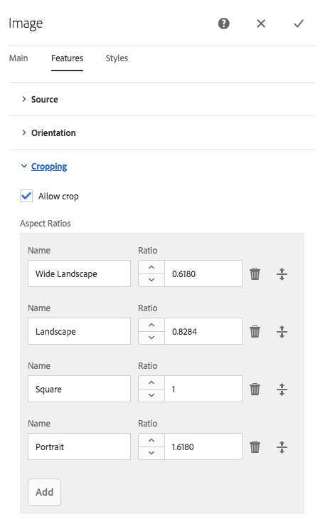
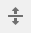

# Configurar componentes en modo Diseño{#configuring-components-in-design-mode}

Si la instancia de AEM está instalada de fábrica, habrá una selección de componentes disponible de inmediato en el explorador de componentes.

Además de estos, también hay otros componentes disponibles. Se puede utilizar el modo Diseño para [activar o desactivar dichos componentes](#enable-disable-components). Cuando se activan y se localizan en su página, se puede utilizar el modo Diseño para [configurar aspectos del diseño de componentes](#configuring-the-design-of-a-component) editando los parámetros del atributo.

>[!NOTE]
>
>Es importante tener cuidado al editar estos componentes. A menudo, las configuraciones del diseño forman una parte integral del diseño de toda la página web, por lo que solo las puede cambiar alguien con los privilegios (y la experiencia) adecuados, como un administrador o un programador. Consulte [Desarrollar componentes](/help/sites-developing/components.md) para obtener más información.

>[!NOTE]
>
>El modo Diseño solo está disponible para las plantillas estáticas. Las plantillas que se crean mediante plantillas editables deben editarse con el [editor de plantillas](/help/sites-authoring/templates.md).

>[!NOTE]
>
>El modo de diseño solo está disponible para las configuraciones de diseño almacenadas como contenido en ( `/etc`).
>
>A partir de AEM 6.4, se recomienda almacenar los diseños como datos de configuración en `/apps` para admitir escenarios de implementación continuos. Los diseños almacenados en `/apps` no se pueden editar durante la ejecución y el modo Diseño no estará disponible para los usuarios que no sean administradores para estas plantillas.

Esto implica añadir o quitar los componentes permitidos en el sistema de párrafos de la página. El sistema de párrafos (`parsys`) es un componente compuesto que contiene todos los demás componentes de párrafos. El sistema de párrafos permite a los autores añadir componentes de distintos tipos a una página, ya que contiene todos los demás componentes de párrafos. Cada tipo de párrafo se representa como un componente.

Por ejemplo, el contenido de la página de un producto puede contener un sistema de párrafos que incluya lo siguiente:

* Una imagen del producto (en forma de imagen o de párrafo de imagen de texto).
* La descripción del producto (como párrafo de texto).
* Una tabla con datos técnicos (como párrafo de tabla).
* Un formulario que rellenan los usuarios (como comienzo de formularios, elemento de formularios y párrafo de final de formulario).

>[!NOTE]
>
>Consulte [Desarrollar componentes](/help/sites-developing/components.md) y [Guías para utilizar plantillas y componentes](/help/sites-developing/dev-guidelines-bestpractices.md#guidelines-for-using-templates-and-components) para obtener más información sobre `parsys`.

>[!CAUTION]
>
>La edición del diseño mediante el modo de diseño tal como se describe en este artículo es la forma recomendada de definir diseños de plantillas estáticas
>
>La modificación de diseños en CRX DE, por ejemplo, no es recomendable y la aplicación de dichos diseños puede diferir del comportamiento esperado. Consulte el documento de desarrollo [Plantillas de página: estáticas](/help/sites-developing/page-templates-static.md#how-template-designs-are-applied) para obtener más información.

## Activar/desactivar componentes {#enable-disable-components}

Para activar o desactivar un componente:

1. Seleccione el modo **Diseño**.

   

1. Toque o haga clic en un componente. El componente seleccionado tendrá un borde azul.

   

1. Toque o haga clic en el icono **Principal**.

   

   Así seleccionará el sistema de párrafos que contiene el componente actual.

1. El icono **Configurar** del sistema de párrafos se mostrará en la barra de acciones del elemento principal.

   

   Seleccione esta opción para mostrar el cuadro de diálogo.

1. Utilice el cuadro de diálogo para definir los componentes disponibles en el buscador de componentes cuando edite la página actual.

   

   El cuadro de diálogo tiene dos fichas:

   * Componentes permitidos
   * Configuración

   **Componentes permitidos**

   En la pestaña **Componentes permitidos**, defina qué componentes están disponibles para parsys.

   * Los componentes se agrupan por grupos de componentes, que se pueden expandir y contraer.
   * Es posible seleccionar un grupo completo marcando la casilla del nombre del grupo, y se puede anular la selección de todo desactivando la casilla de verificación.
   * Un signo menos indica se ha seleccionado al menos uno, pero no todos los elementos de un grupo.
   * Puede realizar búsquedas filtrando por el nombre de los componentes.
   * Los recuentos que aparecen a la derecha del nombre del grupo de componentes representan el número total de componentes seleccionados de dichos grupos, independientemente del filtro.

   La configuración se define por el componente de la página. Si en las páginas infantiles se utiliza la misma plantilla y/o componente de la página (normalmente en formato alineado), se aplicará la misma configuración al sistema de párrafos correspondiente.

   >[!NOTE]
   >
   >Los componentes de los formularios adaptables están diseñados para funcionar en el contenedor del formulario adaptable y aprovechar el ecosistema de los formularios. Por lo tanto, estos componentes deben utilizarse únicamente en el editor de formularios adaptables y no funcionarán en el editor de la página Sitios.

   **Configuración**

   En la ficha **Configuración**, puede definir opciones adicionales como, por ejemplo, para dibujar un anclaje para cada componente y definir el margen de celdas de cada contenedor.

1. Seleccione **Listo** para guardar la configuración.

## Configuración del diseño de un componente {#configuring-the-design-of-a-component}

1. Seleccione el modo **Diseño**.

   

1. Toque o haga clic en un componente con el borde azul. En este ejemplo se ha seleccionado un componente de imagen de muestra.

   

1. Utilice el icono **Configurar** para abrir el cuadro de diálogo.

   

   En el cuadro de diálogo de diseño, puede configurar el componente según los parámetros de diseño disponibles.

   

   El cuadro de diálogo tiene tres fichas:

   * Principal
   * Características
   * Estilos

   **Propiedades**

   La ficha **Propiedades** le permite configurar los parámetros de diseño importantes del componente. Por ejemplo, para un componente de imagen, puede definir el tamaño máximo y mínimo permitido de la imagen.

   **Características**

   La ficha **Características** le permite habilitar o deshabilitar características adicionales del componente. Por ejemplo, para un componente de imagen, puede definir la orientación de la imagen, las opciones de recorte disponibles y si se puede cargar una imagen.

   **Estilos**

   La ficha **Estilos** permite definir las clases y los estilos CSS que se utilizarán con el componente.

   

   Utilice el botón **Añadir** para agregar más entradas a la lista del cuadro de diálogo de entrada múltiple.

   

   Utilice el icono** Eliminar **para eliminar una entrada de una lista de cuadros de diálogo de entrada múltiple.

   

   Utilice el icono **Mover** para cambiar el orden de las entradas en una lista de cuadros de diálogo de entrada múltiple.

   

1. Toque o haga clic en el icono **Listo** para guardar y cerrar el cuadro de diálogo.

