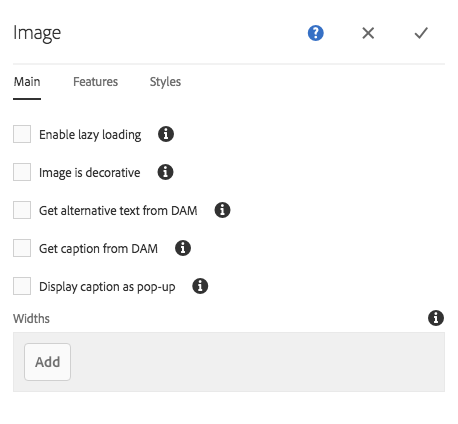

# Configuración de componentes predeterminados en el modo Diseño{#configuring-components-in-design-mode}

Cuando AEM instancia está instalada de forma predeterminada, una selección de componentes está disponible inmediatamente en el navegador de componentes.

Además de estos, también hay otros componentes disponibles. Puede utilizar el modo Diseño para [habilitar/deshabilitar estos componentes](#enable-disable-components). Cuando esté habilitado y ubicado en su página, puede usar el modo Diseño para [configuración de aspectos del diseño de componentes](#configuring-the-design-of-a-component) editando los parámetros del atributo.

>[!NOTE]
>
>Se debe tener cuidado al editar estos componentes. La configuración de diseño suele formar parte integral del diseño de todo el sitio web, por lo que solo debe modificarla alguien con los privilegios y la experiencia adecuados, normalmente un administrador o un desarrollador. Consulte [Desarrollo de componentes](/help/sites-developing/components.md) para obtener más información.

>[!NOTE]
>
>El modo Diseño solo está disponible para plantillas estáticas. Las plantillas que se crean con plantillas editables se deben editar con la variable [editor de plantillas](/help/sites-authoring/templates.md).

>[!NOTE]
>
>El modo Diseño solo está disponible para las configuraciones de diseño almacenadas como contenido en ( `/etc`).
>
>A partir de AEM 6.4, se recomienda almacenar los diseños como datos de configuración en `/apps` para admitir escenarios de implementación continuos. Diseños almacenados en `/apps` no se pueden editar durante la ejecución y el modo Diseño no estará disponible para los usuarios que no sean administradores para estas plantillas.

Esto implica añadir o eliminar los componentes permitidos en el sistema de párrafos de la página. El sistema de párrafos ( `parsys`) es un componente compuesto que contiene todos los demás componentes de párrafo. El sistema de párrafos permite a los autores añadir componentes de distintos tipos a una página, ya que contiene todos los demás componentes de párrafos. Cada tipo de párrafo se representa como un componente.

Por ejemplo, el contenido de una página de producto puede contener un sistema de párrafos que incluya lo siguiente:

* Una imagen del producto (en forma de imagen o párrafo de imagen de texto)
* La descripción del producto (como párrafo de texto)
* Una tabla con datos técnicos (como párrafo de tabla)
* Un formulario que rellenan los usuarios (como comienzo de formulario, elemento de formulario y párrafo final de formulario)

>[!NOTE]
>
>Consulte [Desarrollo de componentes](/help/sites-developing/components.md) y [Directrices para el uso de plantillas y componentes](/help/sites-developing/dev-guidelines-bestpractices.md#guidelines-for-using-templates-and-components) para obtener más información sobre `parsys`.

>[!CAUTION]
>
>La edición del diseño mediante el modo de diseño como se describe en este artículo es la forma recomendada de definir diseños de plantillas estáticas
>
>La modificación de diseños en CRX DE, por ejemplo, no es una práctica recomendada y la aplicación de dichos diseños puede variar del comportamiento esperado. Consulte el documento para desarrolladores [Plantillas de página: estáticas](/help/sites-developing/page-templates-static.md#how-template-designs-are-applied) para obtener más información.

## Habilitar/deshabilitar componentes {#enable-disable-components}

Para activar o desactivar un componente:

1. Seleccione el **Diseño** en el menú contextual.

   

1. Toque o haga clic en un componente. El componente tendrá un borde azul cuando se seleccione.

   

1. Toque o haga clic en **Principal** icono.

   

   Se seleccionará el sistema de párrafos que contiene el componente actual.

1. La variable **Configurar** para el sistema de párrafos se mostrará en la barra de acciones del elemento principal.

   

   Seleccione esta opción para mostrar el cuadro de diálogo.

1. Utilice el cuadro de diálogo para definir los componentes disponibles en el navegador de componentes cuando edite la página actual.

   

   El cuadro de diálogo tiene dos pestañas:

   * Componentes permitidos
   * Configuración

   **Componentes permitidos**

   En el **Componentes permitidos** , puede definir qué componentes están disponibles para parsys.

   * Los componentes se agrupan por grupos de componentes, que se pueden expandir y contraer.
   * Se puede seleccionar un grupo completo marcando el nombre del grupo y se puede anular la selección de todo desmarcando.
   * Un signo menos representa al menos uno, pero no todos los elementos de un grupo están seleccionados.
   * Hay disponible una búsqueda para filtrar por nombre un componente.
   * Los recuentos que aparecen a la derecha del nombre del grupo de componentes representan el número total de componentes seleccionados de esos grupos, independientemente del filtro.

   La configuración se define por componente de página. Si las páginas secundarias utilizan la misma plantilla o componente de página (normalmente alineado), se aplicará la misma configuración al sistema de párrafos correspondiente.

   >[!NOTE]
   >
   >Los componentes de formulario adaptable están diseñados para funcionar dentro del contenedor de formulario adaptable a fin de aprovechar el ecosistema de Forms. Por lo tanto, estos componentes solo deben utilizarse en el editor de formularios adaptables y no funcionarán en el editor de páginas de Sites.

   **Configuración**

   En el **Configuración** puede definir opciones adicionales como, por ejemplo, dibujar un anclaje para cada componente y definir el relleno de celdas de cada contenedor.

1. Select **Listo** para guardar la configuración.

## Configuración del diseño de un componente {#configuring-the-design-of-a-component}

1. Seleccione el **Diseño** en el menú contextual.

   

1. Toque o haga clic en un componente con un borde azul. En este ejemplo, se selecciona un componente de imagen a pantalla completa.

   

1. Utilice la variable **Configurar** para abrir el cuadro de diálogo.

   

   En el cuadro de diálogo de diseño, puede configurar el componente según los parámetros de diseño disponibles.

   

   El cuadro de diálogo tiene tres pestañas:

   * Principal
   * Características
   * Estilos

   **Propiedades**

   La variable **Propiedades** permite configurar los parámetros de diseño importantes del componente. Por ejemplo, para un componente de imagen puede definir el tamaño máximo y mínimo permitido de la imagen.

   **Características**

   La variable **Funciones** permite activar o desactivar funciones adicionales del componente. Por ejemplo, para un componente de imagen puede definir la orientación de la imagen, las opciones de recorte disponibles y si se puede cargar una imagen.

   **Estilos**

   La variable **Estilos** permite definir las clases y los estilos CSS que se van a utilizar con el componente.

   

   Utilice la variable **Agregar** para agregar entradas adicionales a una lista de cuadros de diálogo de entrada múltiple.

   

   Utilice el icono** Eliminar **para eliminar una entrada de una lista de cuadros de diálogo de entrada múltiple.

   

   Utilice la variable **Mover** para reorganizar el orden de las entradas en una lista de cuadros de diálogo de entrada múltiple.

   

1. Toque o haga clic en **Listo** para guardar y cerrar el cuadro de diálogo.
