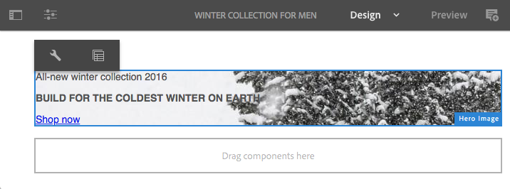

# Configuración de componentes predeterminados en el modo Diseño{#configuring-components-in-design-mode}

AEM Cuando se instala la instancia de forma predeterminada, una selección de componentes está disponible inmediatamente en el explorador de componentes.

Además de estos, también hay otros componentes disponibles. Puede usar el modo Diseño para [habilitar o deshabilitar estos componentes](#enable-disable-components). Cuando esté habilitado y ubicado en su página, puede usar el modo de diseño para [configurar aspectos del diseño del componente](#configuring-the-design-of-a-component) al editar los parámetros de atributo.

>[!NOTE]
>
>Se debe tener cuidado al editar estos componentes. La configuración de diseño suele ser parte integral del diseño de todo el sitio web, por lo que solo debe cambiarla alguien con los privilegios y la experiencia adecuados, a menudo un administrador o un desarrollador. Consulte [Desarrollar componentes](/help/sites-developing/components.md) para obtener más información.

>[!NOTE]
>
>El modo de diseño solo está disponible para plantillas estáticas. Las plantillas creadas con plantillas editables deben editarse con el [editor de plantillas](/help/sites-authoring/templates.md).

>[!NOTE]
>
>El modo Diseño solo está disponible para configuraciones de diseño almacenadas como contenido en ( `/etc`).
>
>AEM A partir de la versión 6.4, se recomienda almacenar diseños como datos de configuración en `/apps` para admitir escenarios de implementación continua. Los diseños almacenados en `/apps` no se pueden editar durante la ejecución y el modo Diseño no estará disponible para los usuarios que no sean administradores para estas plantillas.

Esto implica añadir o eliminar los componentes permitidos en el sistema de párrafos de la página. El sistema de párrafos (`parsys`) es un componente compuesto que contiene todos los demás componentes de párrafo. El sistema de párrafos permite a los autores añadir componentes de diferentes tipos a una página, ya que contiene todos los demás componentes de párrafo. Cada tipo de párrafo se representa como un componente.

Por ejemplo, el contenido de una página de producto puede contener un sistema de párrafos que contenga lo siguiente:

* Una imagen del producto (en forma de imagen o de párrafo de imagen de texto)
* La descripción del producto (como párrafo de texto)
* Una tabla con datos técnicos (como un párrafo de tabla)
* Un formulario que los usuarios rellenan (al comenzar los formularios, el elemento y el párrafo final de los formularios)

>[!NOTE]
>
>Consulte [Desarrollar componentes](/help/sites-developing/components.md) y [Directrices para usar plantillas y componentes](/help/sites-developing/dev-guidelines-bestpractices.md#guidelines-for-using-templates-and-components) para obtener más información sobre `parsys`.

>[!CAUTION]
>
>La edición del diseño mediante el modo de diseño, tal como se describe en este artículo, es la forma recomendada de definir diseños de plantillas estáticas
>
>La modificación de diseños en CRX DE, por ejemplo, no es una práctica recomendada y la aplicación de dichos diseños puede variar del comportamiento esperado. Consulte el documento para desarrolladores [Plantillas de página - Estáticas](/help/sites-developing/page-templates-static.md#how-template-designs-are-applied) para obtener más información.

## Habilitar/deshabilitar componentes {#enable-disable-components}

Para habilitar o deshabilitar un componente:

1. Seleccione el modo **Diseño**.

   

1. Haga clic en un componente. El componente tiene un borde azul cuando se selecciona.

   

1. Haga clic en el icono **Principal**.

   

   Se seleccionará el sistema de párrafos que contiene el componente actual.

1. El icono **Configurar** para el sistema de párrafos se muestra en la barra de acciones del elemento principal.

   

   Seleccione esta opción para mostrar el cuadro de diálogo.

1. Utilice el cuadro de diálogo para definir los componentes disponibles en el explorador de componentes al editar la página actual.

   

   El cuadro de diálogo tiene dos pestañas:

   * Componentes permitidos
   * Ajustes

   **Componentes permitidos**

   En la ficha **Componentes permitidos**, usted define qué componentes están disponibles para parsys.

   * Los componentes se clasifican por grupos de componentes, que pueden ampliarse y contraerse.
   * Es posible seleccionar un grupo completo al marcar la casilla del nombre del grupo, y se puede anular la selección de todo al desactivar la casilla de verificación.
   * Un signo menos representa que se ha seleccionado al menos uno de los elementos de un grupo, pero no todos.
   * Puede realizar búsquedas filtrando por el nombre de los componentes.
   * Los recuentos que aparecen a la derecha del nombre del grupo de componentes representan el número total de componentes seleccionados de dichos grupos, independientemente del filtro.

   La configuración se define por componente de página. Si las páginas secundarias utilizan la misma plantilla o componente de página (normalmente alineado), se aplicará la misma configuración al sistema de párrafos correspondiente.

   >[!NOTE]
   >
   >Los componentes de formulario adaptable están diseñados para funcionar dentro del contenedor de formulario adaptable y utilizar el ecosistema de Forms. Por lo tanto, estos componentes solo deben utilizarse en el editor de formularios adaptables y no funcionarán en el editor de páginas de Sites.

   **Configuración**

   En la ficha **Configuración** puede definir opciones adicionales, como dibujar un anclaje para cada componente y definir el relleno de celda de cada contenedor.

1. Seleccione **Listo** para guardar la configuración.

## Configuración del diseño de un componente {#configuring-the-design-of-a-component}

1. Seleccione el modo **Diseño**.

   

1. Haga clic en un componente con un borde azul. En este ejemplo, se selecciona un componente de imagen a pantalla completa.

   

1. Use el icono **Configurar** para abrir el cuadro de diálogo.

   

   En el cuadro de diálogo de diseño, puede configurar el componente según los parámetros de diseño disponibles.

   

   El cuadro de diálogo tiene tres pestañas:

   * Principal
   * Características
   * Estilos

   **Propiedades**

   La pestaña **Properties** le permite configurar los parámetros de diseño importantes del componente. Por ejemplo, para un componente de imagen puede definir el tamaño máximo y mínimo de la imagen permitido.

   **Características**

   La pestaña **Características** le permite habilitar o deshabilitar características adicionales del componente. Por ejemplo, para un componente de imagen puede definir la orientación de la imagen, las opciones de recorte disponibles y si se puede cargar una imagen.

   **Estilos**

   La pestaña **Styles** le permite definir las clases y los estilos CSS que se utilizarán con el componente.

   

   Utilice el botón **Agregar** para agregar entradas adicionales a una lista de cuadros de diálogo de varias entradas.

   

   Use el icono **Eliminar** para quitar una entrada de una lista de cuadros de diálogo de varias entradas.

   

   Utilice el icono **Mover** para reorganizar el orden de las entradas en una lista de cuadros de diálogo de varias entradas.

   

1. Haga clic en el icono **Listo** para guardar y cerrar el cuadro de diálogo.
