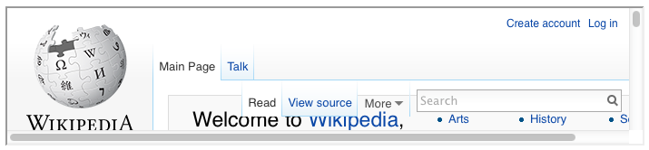
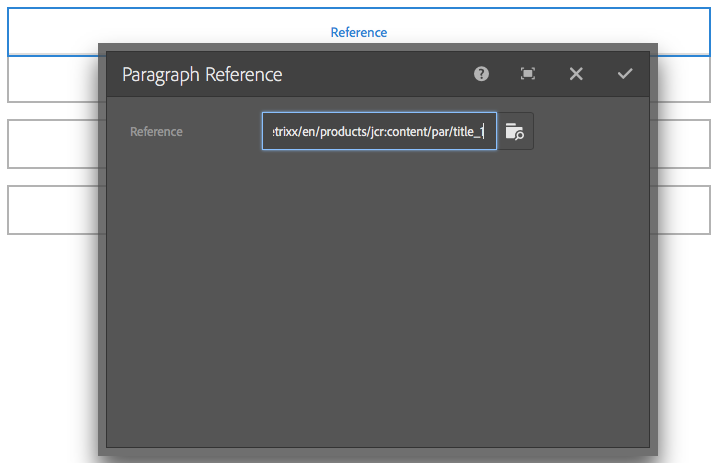
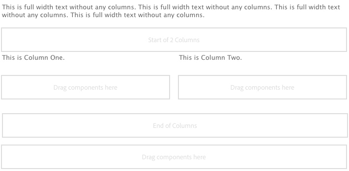
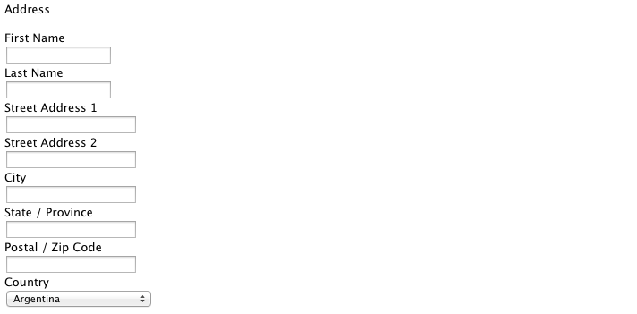

# Componentes de base {#foundation-components}

>[!CAUTION]
>
>La mayoría de los componentes de base ya no se utilizan en AEM 6.5. Consulte las [notas de la versión](/help/release-notes/deprecated-removed-features.md) para obtener más información.
>
>Adobe recomienda usar los [componentes principales](https://experienceleague.adobe.com/docs/experience-manager-core-components/using/introduction.html?lang=es) más modernos y ampliables en los proyectos de AEM. Estos componentes forman parte del [contenido de muestra de We.Retail](/help/sites-developing/we-retail.md) y también se pueden [instalar por separado y el administrador los puede usar para el desarrollo](https://experienceleague.adobe.com/docs/experience-manager-core-components/using/get-started/using.html?lang=es).
>
>Puede usar el [Conjunto de herramientas de modernización de AEM](https://opensource.adobe.com/aem-modernize-tools/) para refactorizar el sitio basado en componentes de base y usar los componentes principales.

Los componentes de base se diseñaron para utilizarse al crear contenido para una página web estándar. Forman un subconjunto de los componentes disponibles de forma predeterminada para una instalación estándar de AEM.

Algunos están disponibles inmediatamente a través del explorador de componentes. También hay otros disponibles usando [modo de diseño](/help/sites-authoring/default-components-designmode.md) (si la página está basada en una plantilla estática) o [editando la plantilla](/help/sites-authoring/templates.md) (si la página está basada en una plantilla editable).

Se admite el uso de componentes de base, pero la mayoría han quedado obsoletos y han sido reemplazados por componentes principales que ofrecen más extensibilidad y flexibilidad.

>[!NOTE]
>
>En esta sección solo se describen los componentes que están disponibles de forma predeterminada en una instalación de AEM estándar.
>
>Según la instancia, puede tener componentes personalizados desarrollados explícitamente para sus necesidades. Estos componentes personalizados pueden incluso tener el mismo nombre que algunos de los componentes mencionados aquí.

Los componentes están disponibles en la pestaña **Componentes** del panel lateral del editor de página al [editar una página](/help/sites-authoring/editing-content.md).

Puede seleccionar un componente y arrastrarlo a la ubicación requerida en la página. A continuación, puede editarlo mediante:

* [Configurar propiedades](/help/sites-authoring/editing-page-properties.md)
* [Editar contenido](/help/sites-authoring/editing-content.md)

* [Editar contenido: modo pantalla completa](/help/sites-authoring/editing-content.md#edit-content-full-screen-mode)

Los componentes se ordenan según varias categorías denominadas grupos de componentes, entre las que se incluyen:

* [General](#general): incluye componentes básicos como texto, imágenes, tablas y gráficos.
* [Columnas](#columns): incluye los componentes necesarios para organizar el diseño del contenido.
* [Formulario](#formgroup): incluye todos los componentes necesarios para crear un formulario.

## General {#general}

Los componentes generales son los componentes básicos que se utilizan para crear contenido.

### Elemento de cuenta {#account-item}

>[!CAUTION]
>
>Este componente de base está obsoleto. Adobe recomienda usar los [componentes principales](https://experienceleague.adobe.com/docs/experience-manager-core-components/using/introduction.html?lang=es) en su lugar.

Puede definir un vínculo con título y descripción.


### Imagen adaptable {#adaptive-image}

>[!CAUTION]
>
>Este componente de base está obsoleto. Adobe recomienda usar el [componente principal de imagen](https://experienceleague.adobe.com/docs/experience-manager-core-components/using/wcm-components/image.html?lang=es) en su lugar.

El componente de base Imagen adaptable genera imágenes cuyo tamaño se ajusta a la ventana en la que se abre la página web. Para utilizar el componente, proporcione un recurso de imagen desde el sistema de archivos o DAM. Cuando se abre la página web, el explorador descarga una copia de la imagen cuyo tamaño se ha cambiado para que sea adecuada a la ventana actual.

Las siguientes características pueden determinar el tamaño de la ventana:

* Pantalla del dispositivo: Los dispositivos móviles suelen mostrar páginas web para que se extiendan a toda la pantalla.
* Tamaño de la ventana del explorador Web: los usuarios de equipos portátiles y de escritorio pueden cambiar el tamaño de las ventanas del explorador Web.

Por ejemplo, el componente genera una imagen pequeña cuando la página web se abre en un teléfono móvil y una imagen de tamaño medio cuando se abre en una tableta. En un ordenador portátil, el componente crea y proporciona una imagen grande cuando la página se abre en un explorador web maximizado. Cuando se cambia el tamaño del explorador web para que quepa en una parte de la pantalla, el componente se adapta proporcionando una imagen más pequeña y actualiza la vista.

#### Formatos de imagen admitidos {#supported-image-formats}

Puede utilizar archivos de imagen de las siguientes extensiones de nombre de archivo con el componente Imagen adaptable:

* .jpg
* .jpeg
* .png
* .gif &#42;&#42;

>[!CAUTION]
>
>Los archivos GIF animados no son compatibles con AEM para representaciones adaptables.

#### Tamaños y calidad de las imágenes {#images-sizes-and-quality}

En la tabla siguiente se muestra la anchura de la imagen que se genera para la anchura de ventanilla determinada. La altura de la imagen generada se calcula para mantener una relación de aspecto constante y no se produce ningún espacio en blanco dentro del borde de la imagen. El recorte se puede utilizar para evitar espacios en blanco.

Cuando la imagen es una imagen de JPEG, el tamaño de la ventanilla también puede influir en la calidad de JPEG. Las siguientes cualidades de JPEG son posibles:

* Baja (0,42)
* Medium (0,82)
* Alta (1)

| **Intervalo de anchura de ventanilla (píxeles)** | **Anchura de la imagen (píxeles)** | **Calidad JPEG** | **Tipo de dispositivo de destino** |
|---|---|---|---|
| anchura &lt;= 319 | 320 | baja |  |
| anchura = 320 | 320 | mediano | Teléfono móvil (vertical) |
| 320 &lt; anchura &lt; 481 | 480 | mediano | Teléfono móvil (horizontal) |
| 480 &lt; anchura &lt; 769 | 476 | alto | Tablet (vertical) |
| 768 &lt; anchura &lt; 1025 | 620 | alto | Tablet (horizontal) |
| anchura &lt;= 1025 | completo (tamaño original) | alto | Escritorio |

#### Propiedades {#properties}

El cuadro de diálogo permite editar las propiedades de la instancia del componente de imagen adaptable, muchas de las cuales son comunes con el componente de imagen en el que se basa. Las propiedades están disponibles en dos pestañas:

* **Imagen**

   * **Imagen**
Arrastre una imagen desde el buscador de contenido o haga clic en para abrir una ventana de exploración en la que pueda cargar una imagen. Una vez cargada la imagen, puede recortarla, girarla o eliminarla. Para acercar y alejar la imagen, utilice la barra deslizante situada debajo de la imagen (encima de los botones Aceptar y Cancelar)

   * **Recortar**
Recortar parte de una imagen. Arrastre el borde para recortar la imagen.

   * **Rotar**
Haga clic en Rotar repetidamente hasta que la imagen gire como desee.

   * **Borrar**
Eliminar la imagen actual.

* **Avanzado**

   * **Título**
El componente de imagen adaptable no utiliza esta propiedad.

   * **Texto alternativo**
Texto alternativo que se utiliza para la imagen.

   * **Vincular A**
El componente de imagen adaptable no utiliza esta propiedad.

   * **Descripción**
El componente de imagen adaptable no utiliza esta propiedad.

#### Ampliación del componente de imagen adaptable {#extending-the-adaptive-image-component}

Para obtener información acerca de cómo personalizar el componente de imagen adaptable, vea [Explicación del componente de imagen adaptable](/help/sites-developing/responsive.md#using-adaptive-images).

### Carrusel {#carousel}

>[!CAUTION]
>
>Este componente de base está obsoleto. Adobe recomienda usar el [componente principal de carrusel](https://experienceleague.adobe.com/docs/experience-manager-core-components/using/wcm-components/carousel.html?lang=es) en su lugar.

El componente Carrusel permite mostrar imágenes asociadas con páginas individuales:

* uno a la vez
* durante un corto periodo de tiempo
* en el orden en que especifique
* con un tiempo de espera que especifique

Los controles en los que se puede hacer clic también permiten al usuario recorrer las páginas mostradas en tiempo real, bajo demanda. Si selecciona la imagen de página visible actualmente, accederá a esa página. En otras palabras, el carrusel actúa como un control de navegación.

#### Propiedades {#properties-1}

Estas propiedades están disponibles en dos pestañas:

* **Carrusel**
Especifique cómo funciona el carrusel:

   * Velocidad de reproducción
Tiempo en milisegundos antes de que se muestre la siguiente diapositiva.
   * Tiempo de transición
Tiempo en milisegundos para la transición entre dos diapositivas.
   * Estilo de controles
Hay varias opciones disponibles en un menú desplegable; por ejemplo, Botones Anterior/Siguiente, Conmutadores superior-derecha.

* **Lista**

  Aquí puede especificar cómo se incluyen las páginas en el carrusel:

   * **Lista de compilación con**
Existen varias formas de crear una lista de páginas: Páginas secundarias, Lista fija, Búsqueda o Búsqueda avanzada (todas ellas descritas a continuación).
Independientemente del método que elija, las páginas que incluya en la lista deben tener ya una imagen asociada con la página. Es esta imagen la que se muestra en el carrusel. Si no hay ninguna imagen para una página determinada debajo de Propiedades de página de esa página, debe asociar una imagen con la página antes de comenzar. Si no lo hace, el carrusel muestra una página en blanco. Consulte [Edición de propiedades de página](/help/sites-authoring/editing-page-properties.md).
Según el elemento que elija, aparecerá un nuevo panel:

      * **Opciones para páginas secundarias**

         * **Página principal**
Especifique una ruta manualmente o con el selector. Dejar vacío para utilizar la página actual como principal.

      * **Opciones de lista fija**

         * **Páginas**
Seleccione una lista de páginas. Use `+` para agregar más entradas y los botones arriba/abajo para ajustar el orden.

      * **Opciones de búsqueda**

         * **Iniciar en**
Introduzca una ruta de inicio, ya sea manualmente o con el selector.

         * **Consulta de búsqueda**
Puede introducir una consulta de búsqueda de texto sin formato.

      * **Opciones de búsqueda avanzada**

         * **Notación de predicado de Querybuilder**
Puede introducir una consulta de búsqueda utilizando la notación de predicado de Querybuilder. Por ejemplo, puede introducir &quot;fulltext=Marketing&quot; para que todas las páginas con &quot;Marketing&quot; en su contenido se muestren en el carrusel.
Consulte [API de QueryBuilder](/help/sites-developing/querybuilder-api.md) para obtener información detallada sobre las expresiones de consulta y otros ejemplos.

   * **Ordenar por**
Seleccione `jcr:title`, `jcr:created`, `cq:lastModified` o `cq:template` en el menú desplegable.

   * **Límite**
Opcional. Número máximo de elementos que desea utilizar en el carrusel.

>[!NOTE]
>
>Puede crear un componente de carrusel personalizado para Adobe Experience Manager que muestre los recursos digitales en AEM DAM. Consulte [Creación de componentes de carrusel personalizados para Adobe Experience Manager](https://experienceleague.adobe.com/docs/experience-manager-learn/getting-started-wknd-tutorial-develop/overview.html?lang=es).

### Gráfico {#chart}

>[!CAUTION]
>
>Este componente de base está obsoleto. Adobe recomienda usar los [componentes principales](https://experienceleague.adobe.com/docs/experience-manager-core-components/using/introduction.html?lang=es) en su lugar.

El componente Gráfico permite agregar un gráfico de barras, de líneas o circular. AEM crea un gráfico a partir de los datos proporcionados. Los datos se proporcionan escribiendo directamente en la ficha Datos o copiando y pegando una hoja de cálculo.

* **Datos**

   * **Datos de gráfico**
Introduzca los datos del gráfico en el formato CSV; el formato de valores separados por comas utiliza comas (&quot;,&quot;) como separador de campos.

* **Avanzado**

   * **Tipo de gráfico**
Seleccione entre Gráfico circular, Gráfico de líneas y Gráfico de barras.

   * **Texto alternativo**
Muestra texto alternativo en lugar del gráfico.

   * **Anchura**
Anchura del gráfico en píxeles.

   * **Altura**
Altura del gráfico en píxeles.

A continuación se muestra un ejemplo de datos de gráfico seguido del gráfico de barras resultante:

 

>[!NOTE]
>
>Puede crear un control de gráfico de AEM personalizado que muestre los datos en el JCR de AEM. Para obtener más información, vea [Mostrar datos de Adobe Experience Manager en un gráfico](https://experienceleague.adobe.com/docs/experience-manager-learn/getting-started-wknd-tutorial-develop/overview.html?lang=es).

### Fragmento de contenido {#content-fragment}

>[!CAUTION]
>
>Este componente de base está obsoleto. Adobe recomienda usar el [componente principal de fragmento de contenido](https://experienceleague.adobe.com/docs/experience-manager-core-components/using/wcm-components/content-fragment-component.html?lang=es) en su lugar.

[Los fragmentos de contenido](/help/sites-authoring/content-fragments.md) se crean y administran como recursos independientes de la página. Después se pueden usar estos fragmentos, y sus variaciones, al crear páginas de contenido.

### Importador de diseños {#design-importer}

>[!CAUTION]
>
>Este componente de base está obsoleto. Adobe recomienda usar los [componentes principales](https://experienceleague.adobe.com/docs/experience-manager-core-components/using/introduction.html?lang=es) en su lugar.

Este componente le permite cargar un archivo zip que contiene un paquete de diseño.

### Descargar {#download}

>[!CAUTION]
>
>Este componente de base está obsoleto. Adobe recomienda usar los [componentes principales](https://experienceleague.adobe.com/docs/experience-manager-core-components/using/introduction.html?lang=es) en su lugar.

El componente Descargar crea un vínculo en la página web seleccionada para descargar un archivo específico. Puede arrastrar un recurso desde el Buscador de contenido o cargar un archivo.

* **Descargar**

   * **Descripción**
Breve descripción que se muestra con el vínculo de descarga.

   * **Archivo**
El archivo disponible para descargar en la página web resultante. Arrastre un recurso desde el buscador de contenido o seleccione el área para que pueda cargar el archivo que desea que esté disponible para descargar.

El siguiente ejemplo muestra el componente Descargar en Geometrixx:


### Externo {#external}

>[!CAUTION]
>
>Este componente de base está obsoleto. Adobe recomienda usar los [componentes principales](https://experienceleague.adobe.com/docs/experience-manager-core-components/using/introduction.html?lang=es) en su lugar.

El componente de integración de aplicaciones externas (**External**) le permite incrustar aplicaciones externas en la página de AEM mediante un iframe.

* **Externo**

   * **Aplicación de destino**
Especifique la URL de la aplicación web que desea integrar; por ejemplo:

     ```
     https://en.wikipedia.org/wiki/Main_Page
     ```

   * **Pasar parámetros**
Marque la casilla para que los parámetros se pasen a la aplicación cuando sea necesario.

   * **Anchura y altura
**Defina el tamaño del iframe

La aplicación externa está integrada en el sistema de párrafos de la página AEM; por ejemplo, al usar una aplicación de destino de `https://en.wikipedia.org/wiki/Main_Page`:



>[!NOTE]
>
>Según el caso de uso, hay otras opciones disponibles para la integración de aplicaciones externas, por ejemplo, la [integración de portlets](/help/sites-administering/aem-as-portal.md).

### Flash {#flash}

>[!CAUTION]
>
>Este componente de base está obsoleto. Adobe recomienda usar los [componentes principales](https://experienceleague.adobe.com/docs/experience-manager-core-components/using/introduction.html?lang=es) en su lugar.

>[!CAUTION]
>
>Ya no se espera que este componente funcione de forma predeterminada sin una amplia personalización en el nivel de proyecto.

El componente Flash permite cargar una película Flash. Puede arrastrar un recurso flash desde el buscador de contenido al componente o utilizar el cuadro de diálogo:

* **Flash**

   * **Película Flash**

     El archivo de película flash. Arrastre un recurso desde el buscador de contenido o haga clic para abrir una ventana de exploración.

   * **Tamaño**

     Dimensiones en píxeles del área de visualización que contiene la película.

* **Imagen alternativa**

  Una imagen alternativa para mostrar

* **Avanzado**

   * **Menú contextual**

     Indica si el menú contextual debe mostrarse u ocultarse.

   * **Modo de ventana**

     Cómo aparece la ventana, por ejemplo, opaca, transparente o como una ventana distinta (sólida).

   * **Color de fondo**

     Se ha seleccionado un color de fondo en la tabla de colores.

   * **Versión mínima**

     La versión mínima de Adobe Flash Player necesaria para ejecutar la película. El valor predeterminado es 9.0.0.

   * **Atributos**

     Cualquier atributo adicional necesario.

### Imagen {#image}

>[!CAUTION]
>
>Este componente de base está obsoleto. Adobe recomienda usar el [componente principal de imagen](https://experienceleague.adobe.com/docs/experience-manager-core-components/using/wcm-components/image.html?lang=es) en su lugar.

El componente de imagen muestra una imagen y el texto que la acompaña según los parámetros especificados.

Puede cargar una imagen y luego editarla y manipularla (por ejemplo, recortar, rotar, agregar vínculo/título/texto).

Puede arrastrar y soltar una imagen del [explorador Assets](/help/sites-authoring/author-environment-tools.md#assets-browser) directamente en el componente o en su [cuadro de diálogo de configuración](/help/sites-authoring/editing-content.md#component-edit-dialog). También puede cargar una imagen desde el cuadro de diálogo Configurar; este cuadro de diálogo también controla todas las definiciones y manipulación de la imagen:


Una vez que la imagen se haya cargado (y no antes), puede usar [edición in situ](/help/sites-authoring/editing-content.md#edit-content) para recortar o girar la imagen según sea necesario:


>[!NOTE]
>
>El editor in situ utiliza el tamaño y la relación de aspecto originales de la imagen al editarla. También puede especificar las propiedades de altura y anchura. Las restricciones de tamaño y proporción de aspecto definidas en las propiedades se aplican al guardar los cambios de edición.
>
>Según la instancia, el [diseño de la página](/help/sites-developing/designer.md) también puede imponer restricciones mínimas y máximas. Estas restricciones se desarrollan durante la ejecución del proyecto.

Hay varias opciones adicionales disponibles en el modo de edición de pantalla completa; por ejemplo, asignación y zoom:


>[!NOTE]
>
>El progreso de la carga no se puede supervisar con Internet Explorer.
>
>Los usuarios de Internet Explorer deben cargar la imagen y hacer clic en **Aceptar**; después, deben volver a abrir la imagen para ver el archivo cargado en la vista previa y poder realizar modificaciones (es decir, recortar).
>
>Consulte la sección [Plataformas certificadas](/help/release-notes/release-notes.md#certifiedplatforms) para obtener más información sobre las funciones de HTML5 que utiliza AEM.

Cuando se carga una imagen, puede configurar lo siguiente:

* **Mapa**

  Para asignar una imagen, seleccione Mapa. Puede especificar cómo desea crear el mapa de imagen (rectángulo, polígono, etc.) y hacia dónde debe apuntar el área.

* **Recortar**

  Para recortar parte de una imagen, seleccione Recortar. Utilice el ratón para recortar la imagen.

* **Rotar**

  Para rotar una imagen, seleccione Rotar. Use repetidamente hasta que la imagen gire de la forma que desee.

* **Borrar**

  Eliminar la imagen actual.

* **Título**

  Título de la imagen.

* **Texto alternativo**

  Texto alternativo que se puede utilizar al crear contenido accesible.

* **Vincular A**

  Cree un vínculo a recursos u otras páginas dentro del sitio web.

* **Descripción**

  Una descripción de la imagen.

* **Tamaño**

  Establece la altura y la anchura de la imagen.

>[!NOTE]
>
>Algunas opciones solo están disponibles en el editor de pantalla completa.

La imagen final (con **Título** y **Descripción**) puede mostrarse de la siguiente manera:


### Contenedor de diseño {#layout-container}

Este componente proporciona un sistema de párrafos de cuadrícula que le permite agregar y colocar componentes en una [cuadrícula adaptable](/help/sites-authoring/responsive-layout.md). Puede definir diferentes diseños de contenido en función de la anchura de los dispositivos de destino, incluidos una amplia gama de teléfonos, tabletas y equipos de escritorio.


>[!NOTE]
>
>Este componente se ha implementado con [Lenguaje de plantilla de HTML (HTL)](https://experienceleague.adobe.com/docs/experience-manager-htl/content/overview.html?lang=es).

### Lista {#list}

>[!CAUTION]
>
>Este componente de base está obsoleto. Adobe recomienda usar el [componente principal de lista](https://experienceleague.adobe.com/docs/experience-manager-core-components/using/wcm-components/list.html?lang=es) en su lugar.

El componente Lista permite configurar los criterios de búsqueda para mostrar una lista:

* **Lista**

   * **Lista de compilación con**

     Aquí puede especificar dónde recupera la lista su contenido. Existen varios métodos:

   * Según el elemento que elija, aparecerá un nuevo panel:

      * **Opciones para páginas secundarias**

         * **Elementos secundarios de** (página principal)

           Especifique una ruta manualmente o con el selector. Dejar vacío para utilizar la página actual como principal.

      * **Opciones de lista fija**

         * **Páginas**

           Seleccione una lista de páginas. Utilice + para añadir más entradas y los botones arriba/abajo para ajustar el orden.

      * **Opciones de búsqueda**

         * Iniciar en

           Introduzca una ruta de inicio, ya sea manualmente o con el selector.

         * Consulta de búsqueda

           Puede introducir una consulta de búsqueda de texto sin formato.

      * **Opciones de búsqueda avanzada**

         * **Notación de predicado de Querybuilder**

           Puede introducir una consulta de búsqueda utilizando la notación de predicado de Querybuilder. Por ejemplo, puede introducir &quot;fulltext=Marketing&quot; para que todas las páginas con &quot;Marketing&quot; en su contenido se muestren en el carrusel.

           Consulte [API de QueryBuilder](/help/sites-developing/querybuilder-api.md) para obtener información detallada sobre las expresiones de consulta y otros ejemplos.

      * **Etiquetas**

        Especifique la **página principal**, **Etiquetas/palabras clave** y los criterios de coincidencia necesarios.

   * **Mostrar como**

     Cómo desea que se incluyan los elementos en la lista; incluye vínculos, teasers y noticias.

   * **Ordenar por**

     Si la lista se va a ordenar y, si es así, los criterios que se van a utilizar para ordenarla. Puede introducir un criterio o seleccionar uno en la lista desplegable proporcionada.

   * **Límite**

     Especifique el número máximo de elementos que desea mostrar en la lista.

   * **Habilitar fuente**

     Indica si se debe activar una fuente RSS para la lista.

   * **Paginar después de**

     Aquí puede especificar el número de elementos de la lista que se mostrarán a la vez. Una lista con más elementos de los especificados utiliza la paginación para mostrar la lista en varias partes.

El ejemplo siguiente muestra un componente **List** de la forma en que puede mostrar una lista de páginas secundarias (el diseño está controlado por las definiciones CSS personalizadas de un diseño de sitio).


### Inicio de sesión {#login}

>[!CAUTION]
>
>Este componente de base está obsoleto. Adobe recomienda usar los [componentes principales](https://experienceleague.adobe.com/docs/experience-manager-core-components/using/introduction.html?lang=es) en su lugar.

>[!CAUTION]
>
>Ya no se espera que este componente funcione de forma predeterminada sin una amplia personalización en el nivel de proyecto.

Proporciona los campos Usuario y Contraseña.


Puede configurar lo siguiente:

* Iniciar sesión

   * Etiqueta de sección

     Texto de entrada para los campos de entrada.

   * Etiqueta de nombre de usuario

     Texto para etiquetar el campo de nombre de usuario.

   * Etiqueta de contraseña

     Texto para etiquetar el campo de contraseña.

   * Etiqueta del botón de inicio de sesión

     Texto para el botón de inicio de sesión.

   * Redirigir a

     Puede especificar la página del sitio web que debe abrirse una vez que el usuario ha iniciado sesión.

* Ya hay una sesión iniciada

   * Etiqueta del botón Continuar

     Texto que indica que el usuario ya ha iniciado sesión.

### Estado de pedidos {#order-status}

>[!CAUTION]
>
>Ya no se espera que este componente funcione de forma predeterminada sin una amplia personalización en el nivel de proyecto.

* **Título**

   * **Título**

     Especifique el texto del título que desea mostrar.

   * **Vincular**

     Especifique la página (producto) para la que se debe mostrar el estado del pedido.

   * **Tipo/Tamaño**

     Seleccione de la selección proporcionada.


### Referencia {#reference}

>[!CAUTION]
>
>Este componente de base está obsoleto. Adobe recomienda usar el [componente principal de fragmento de contenido](https://experienceleague.adobe.com/docs/experience-manager-core-components/using/wcm-components/content-fragment-component.html?lang=es) en su lugar.

El componente **Reference** le permite hacer referencia a texto de otra página del sitio web de AEM (en la instancia actual). A continuación, el contenido del párrafo al que se hace referencia aparece como si se encontrara en la página actual. El contenido se actualiza cuando cambia el párrafo de origen (puede que sea necesario actualizar la página).

* **Referencia de párrafo**

   * **Referencia**

     Especifique la ruta a la página y al párrafo al que desea hacer referencia (incluir contenido).

Para especificar la ruta a un párrafo, debe agregar el siguiente sufijo a la ruta (a la página):

`.../jcr:content/par/<paragraph-ID>`

Por ejemplo:

`/content/geometrixx-outdoors/en/equipment/biking/cajamara/jcr:content/par/similar-products`

Además de hacer referencia a un párrafo específico, la ruta también se puede modificar para especificar un sistema de pares completo. Para ello, añada a la ruta el siguiente sufijo:

`/jcr:content/par`

Por ejemplo:

`/content/geometrixx-outdoors/en/equipment/biking/cajamara/jcr:content/par`

Después de la configuración, el contenido aparece exactamente como en la página de origen. El hecho de que sea una referencia solo se ve al abrir el componente para editarlo:



### Búsqueda {#searching}

>[!CAUTION]
>
>Este componente de base está obsoleto. Adobe recomienda usar el [componente principal de búsqueda rápida](https://experienceleague.adobe.com/docs/experience-manager-core-components/using/wcm-components/quick-search.html?lang=es) en su lugar.

El componente Buscar agrega la capacidad de búsqueda a la página.

Puede configurar lo siguiente:

* Búsqueda

   * **Tipos de nodo**

     Si la búsqueda se va a restringir a un tipo de nodo específico, muéstrelos aquí; por ejemplo, `cq:Page`.

   * **Ruta para buscar en**

     Especifique la página raíz de la rama que desea buscar.

   * **Texto de botón de búsqueda**

     El nombre aparece en el botón de búsqueda real.

   * **Texto de estadísticas**

     El texto mostrado encima de los resultados de búsqueda.

   * **No hay texto de resultados**

     Si no hay resultados, se muestra el texto introducido aquí.

   * **Texto de revisión ortográfica**

     Si alguien introduce un término similar, este texto se muestra antes del término.
Por ejemplo, si escribe `Geometrixxe`, el sistema mostrará &quot;¿Quiso decir? Geometrixx&quot;.

   * **Texto de páginas similares**

     Texto que se muestra junto a un resultado para páginas similares. Para ver páginas con contenido similar, haga clic en este vínculo.

   * **Texto de búsquedas relacionadas**

     El texto que aparece junto a busca términos y temas relacionados.

   * **Texto de tendencias de búsqueda**

     El título encima de los términos de búsqueda que introduce un usuario.

   * **Etiqueta de páginas de resultados**

     Texto que aparece al final de esta lista con vínculos a otras páginas de resultados.

   * **Etiqueta anterior**

     Nombre que aparece en el vínculo a las páginas de búsqueda anteriores.

   * **Etiqueta siguiente**

     El nombre que aparece en el vínculo a las páginas de búsqueda siguientes.

El ejemplo siguiente muestra el componente Buscar después de buscar la palabra *`geometrixx`* en el directorio raíz de una instalación estándar. También ilustra la paginación de los resultados:


El ejemplo siguiente muestra un término de búsqueda que está mal escrito y no está disponible:


### Mapa del sitio {#sitemap}

>[!CAUTION]
>
>Este componente de base está obsoleto. Adobe recomienda usar [Navegación](https://experienceleague.adobe.com/docs/experience-manager-core-components/using/wcm-components/navigation.html?lang=es), [Navegación de idioma](https://experienceleague.adobe.com/docs/experience-manager-core-components/using/wcm-components/language-navigation.html?lang=es) y [Componentes principales de ruta de exploración](https://experienceleague.adobe.com/docs/experience-manager-core-components/using/wcm-components/breadcrumb.html?lang=es) en su lugar.

Lista automática de mapas del sitio que (con la configuración predeterminada) muestra todas las páginas (como vínculos activos) del sitio web actual. Por ejemplo, un extracto muestra:


Si es necesario, puede configurar lo siguiente:

* **Mapa del sitio**

   * **Ruta raíz**

     Ruta desde la que comienza el anuncio.

### Presentación de diapositivas {#slideshow}

>[!CAUTION]
>
>Este componente de base está obsoleto. Adobe recomienda usar el [componente principal de carrusel](https://experienceleague.adobe.com/docs/experience-manager-core-components/using/wcm-components/carousel.html?lang=es) en su lugar.

>[!CAUTION]
>
>Ya no se espera que este componente funcione de forma predeterminada sin una amplia personalización en el nivel de proyecto.

Este componente permite cargar una serie de imágenes para mostrarlas como una presentación en la página. Puede añadir o quitar imágenes y asignar a cada una un título. En Avanzadas, también puede especificar el tamaño del área de visualización.

Puede configurar lo siguiente:

* **Diapositivas**

   * **Nueva diapositiva**

     Puede especificar una selección de diapositivas utilizando los botones **Agregar** (y **Quitar**).

   * **Título**

     Especifique un título si es necesario. El título se superpone en la diapositiva correspondiente.

* **Avanzado**

   * **Tamaño**

     Especifique la anchura y la altura en píxeles.

A continuación, el componente de presentación con diapositivas muestra repetidamente cada una en secuencia, durante un breve tiempo, antes de pasar a la siguiente diapositiva:


### Tabla {#table}

>[!CAUTION]
>
>Este componente de base está obsoleto. Adobe recomienda usar el [Componente principal de texto](https://experienceleague.adobe.com/docs/experience-manager-core-components/using/wcm-components/text.html?lang=es) en su lugar.

>[!NOTE]
>
>El componente de base **Table** se basa en el [Editor de texto enriquecido](/help/sites-authoring/rich-text-editor.md), al igual que el componente de base **[Text](#text)**.

El componente **Table** está preconfigurado para permitirle construir, rellenar y dar formato a una tabla. Con el cuadro de diálogo, puede configurar la tabla y crear el contenido mediante lo siguiente:

* desde cero
* copiar y pegar una hoja de cálculo o una tabla desde un editor externo (como Excel, OpenOffice y Bloc de notas).

Puede realizar cambios básicos en el contenido mediante el editor en línea:


En el modo de pantalla completa puede configurar el diseño de tabla:


La siguiente captura de pantalla muestra un ejemplo del componente de tabla; el diseño está determinado por el CSS específico del sitio:


### Nube de etiquetas {#tag-cloud}

Una nube de etiquetas muestra una selección presentada gráficamente de las etiquetas aplicadas al contenido del sitio web:


Al configurar el componente Nube de etiquetas, puede especificar lo siguiente:

* **Etiquetas para mostrar**

  Lugar desde el que se recopilan las etiquetas que se van a mostrar. Seleccione una página, una página con todos los elementos secundarios o todas las etiquetas.

* **Página**

  Seleccione la página a la que desea hacer referencia.

* **No hay vínculos en las etiquetas**

  Si las etiquetas mostradas deben actuar como vínculos.

Para obtener más información acerca de cómo aplicar etiquetas, visite [Usar etiquetas](/help/sites-authoring/tags.md).

### Texto {#text}

>[!CAUTION]
>
>Este componente de base está obsoleto. Adobe recomienda usar el [Componente principal de texto](https://experienceleague.adobe.com/docs/experience-manager-core-components/using/wcm-components/text.html?lang=es) en su lugar.

>[!NOTE]
>
>El componente de base **Texto** se basa en el [Editor de texto enriquecido](/help/sites-authoring/rich-text-editor.md), al igual que el componente de base **Tabla**.

El componente Texto le permite introducir un bloque de texto mediante un editor de WYSIWYG, con la funcionalidad proporcionada por el [editor de texto enriquecido](/help/sites-authoring/rich-text-editor.md). Una selección de iconos le permite dar formato al texto, incluidas las características de la fuente, la alineación, los vínculos, las listas y la sangría.


Al abrir el cuadro de diálogo **Configurar**, también puede establecer:

* **Espaciador**
* **Estilo de texto**

El texto con formato se muestra en la página. El diseño real depende del CSS del sitio:


Para obtener información más detallada sobre el componente Texto y la funcionalidad proporcionada por el editor de texto enriquecido, consulte la página [Editor de texto enriquecido](/help/sites-authoring/rich-text-editor.md).

#### Edición in situ {#inplace-editing}

Además del modo de edición de texto enriquecido basado en cuadros de diálogo, AEM también proporciona [Edición local](/help/sites-authoring/editing-content.md), que permite la edición directa del texto tal como se muestra en el diseño de la página.

### Texto e imagen {#text-image}

>[!CAUTION]
>
>Este componente de base está obsoleto. Adobe recomienda usar [Image](https://experienceleague.adobe.com/docs/experience-manager-core-components/using/wcm-components/image.html?lang=es) y [Text Core Component](https://experienceleague.adobe.com/docs/experience-manager-core-components/using/wcm-components/text.html?lang=es) en su lugar.

El componente Texto e imagen agrega un bloque de texto y una imagen. También puede agregar y editar texto e imágenes por separado. Vea los componentes [Texto](#text) e [Imagen](#image) para obtener detalles.


Puede configurar lo siguiente:

* **Estilos de componente** (**Estilos**)

  Aquí puede alinear la imagen a la izquierda o a la derecha. El valor predeterminado es **Izquierda** alineada, con la imagen a la izquierda.

* **Propiedades de imagen** (**Propiedades de imagen avanzadas**)

  Permite especificar lo siguiente:

   * **Recurso de imagen**

     Cargue la imagen requerida.

   * **Título**

     Título del bloque, mostrado con el ratón.

   * **Texto alternativo**

     Texto alternativo que se mostrará si no se puede mostrar la imagen. Si se deja vacío, se utiliza el título.

   * **Vínculo a**

     Especifique una ruta de destino.

   * **Descripción**

     Una descripción de la imagen.

   * **Tamaño**

     Establece la altura y anchura de la imagen.

El siguiente ejemplo muestra un componente Imagen de texto que muestra la imagen alineada a la izquierda:


### Título {#title}

>[!CAUTION]
>
>Este componente de base está obsoleto. Adobe recomienda usar el [Componente principal de título](https://experienceleague.adobe.com/docs/experience-manager-core-components/using/wcm-components/list.html?lang=es) en su lugar.

El componente de título puede:

* Muestre el nombre de la página actual dejando el campo Título en blanco.
* Muestre el texto que especifique en el campo Título.

Puede configurar lo siguiente:

* **Título**

  Si desea utilizar un nombre que no sea el título de la página, introdúzcalo aquí.

* **Vincular**

  URI si el título va a funcionar como vínculo.

* **Tipo/Tamaño**

  Seleccione Pequeño o Grande en la lista desplegable. Lo pequeño se genera como imagen. Grande se genera como texto.

El ejemplo siguiente muestra un componente **Title**; el diseño está determinado por el CSS específico del sitio.


### Vídeo {#video}

>[!CAUTION]
>
>Este componente de base está obsoleto. Adobe recomienda usar el [componente incrustado de componentes principales](https://experienceleague.adobe.com/docs/experience-manager-core-components/using/wcm-components/embed.html?lang=es) en su lugar.

>[!CAUTION]
>
>Ya no se espera que este componente funcione de forma predeterminada sin una amplia personalización en el nivel de proyecto.

El componente **Video** le permite colocar un elemento de vídeo predefinido y listo para usar en una página.

Consulte también [Configurar los perfiles de vídeo](/help/sites-administering/config-video.md#configuringvideoprofiles) para usarlos con elementos de HTML5.

Después de colocar una instancia del componente en la página, puede configurar lo siguiente:

* Vídeo

   * **Recurso de vídeo**

     Cargue o suelte el recurso de vídeo.

   * **Tamaño**

     El tamaño nativo del vídeo (anchura x altura en píxeles) aparece en los cuadros junto a Tamaño (ver arriba). Introduzca manualmente las dimensiones de anchura y altura aquí si desea anular las dimensiones nativas del vídeo. Si se selecciona **Aceptar**, se cerrará el cuadro de diálogo.

>[!NOTE]
>
>Los formatos admitidos son:
>
>* `.mp4`
>* `Ogg`
>* `FLV` (vídeo Flash)

## Columnas {#columns}

Las columnas son un mecanismo para controlar el diseño del contenido en AEM. En una instalación estándar, se proporcionan componentes para crear dos o tres columnas.

En el ejemplo siguiente se muestra el componente dos columnas en uso. Puede utilizar los marcadores de posición para los componentes nuevos:



### 2 columnas {#columns-1}

Componente de control de columna que toma como valor predeterminado dos columnas iguales.

### 3 columnas {#columns-2}

Componente de control de columna que tiene tres columnas iguales de forma predeterminada.

### Control de columna {#column-control}

El componente Control de columna permite a los usuarios seleccionar cómo desean dividir el contenido del panel principal de la página web en varias columnas. Los usuarios pueden seleccionar el número de columnas necesarias (de una lista predefinida) y, a continuación, crear, eliminar o mover contenido dentro de cada una de las columnas.

* **Control de columna**

   * **Diseño de columna**

     Seleccione el número de columnas que desea representar. Una vez creada, cada columna tiene su propio vínculo para arrastrar componentes o recursos al añadir contenido.

## Formulario {#form}

>[!CAUTION]
>
>El componente de base está obsoleto. Adobe recomienda usar los [componentes principales](https://experienceleague.adobe.com/docs/experience-manager-core-components/using/introduction.html?lang=es) en su lugar.

Los componentes de formulario se utilizan para crear formularios para que los visitantes envíen entradas. Los componentes de formulario y Forms se pueden utilizar para recopilar información, incluidos los comentarios de los usuarios (por ejemplo, un cuestionario de satisfacción del cliente) e información de los usuarios (por ejemplo, el registro de usuarios).

>[!NOTE]
>
>Consulte la [Ayuda de AEM Forms](/help/forms/using/introduction-aem-forms.md) para obtener información sobre AEM Forms.

Forms se basa en varios componentes diferentes:

* **Formulario**

  El componente Formulario define el principio y el final de un nuevo formulario en una página. Otros componentes se pueden colocar entre estos elementos, como tablas y descargas.

* **Campos y elementos de formulario**

  Los campos y elementos de formulario pueden incluir cuadros de texto, botones de opción e imágenes. El usuario suele completar una acción en un campo de formulario, como escribir texto. Consulte elementos de formulario individuales para obtener más información.

* **Componentes de perfil**

  Los componentes de perfil están relacionados con los perfiles de visitante utilizados para la colaboración social y otras áreas en las que se requiere la personalización del visitante.

A continuación se muestra un formulario de ejemplo. Se compone del componente **Formulario** (inicio y final), con dos campos **Formulario** **Texto** usados para la entrada, un campo **General** **Texto** usado para el texto del posible cliente y un botón **Enviar**.


>[!NOTE]
>
>Encontrará información sobre cómo desarrollar y personalizar formularios en la [página Desarrollo de Forms](/help/sites-developing/developing-forms.md). Esta capacidad incluye la adición de acciones, restricciones, campos de precarga y el uso de secuencias de comandos para llamar a un servicio, entre otras acciones.

### Configuración común a (varios) componentes del formulario {#settings-common-to-many-form-components}

Aunque cada uno de los componentes del formulario tiene un propósito diferente, muchos están compuestos por opciones y parámetros similares.

Al configurar cualquiera de los componentes del formulario, están disponibles las siguientes pestañas en el cuadro de diálogo:

* **Título y texto**

  Aquí debe especificar la información básica, como el título del formulario y el texto que lo acompaña. Si corresponde, también le permite definir otra información clave, como si el campo puede seleccionarse varias veces y los elementos disponibles para su selección.

* **Valores iniciales**

  Permite especificar un valor predeterminado.

* **Restricciones**

  Aquí puede especificar si un campo es obligatorio y colocar restricciones en ese campo (por ejemplo, debe ser numérico).

* **Estilo**

  Indica el tamaño y el estilo de los campos.

>[!NOTE]
>
>Los campos que vea varían significativamente según el componente individual.

Estas pestañas le proporcionan los parámetros necesarios. Las pestañas pueden depender del tipo de componente individual, pero pueden incluir lo siguiente:

* **Título y texto**

   * **Nombre de elemento**

     Nombre del elemento del formulario. Indica en qué parte del repositorio se almacenan los datos.
Este campo es obligatorio y solo debe contener los siguientes caracteres:

      * caracteres alfanuméricos
      * `_ . / : -`

   * **Título**

     El título se muestra con el campo. Si se deja en blanco, se muestra el título predeterminado.

   * **Descripción**

     Permite proporcionar información adicional para el usuario, si es necesario. En el formulario, se muestra debajo del campo, en una fuente más pequeña que el título.

   * **Mostrar/Ocultar**

     Determina cuándo está visible el campo.

* **Valores iniciales**

   * **Valor predeterminado**

     El valor mostrado en el campo cuando se abre el formulario. Es decir, antes de que el usuario haya realizado alguna entrada.

* **Restricciones**

   * **Requerido**

     Las restricciones dependen del tipo de componente del formulario, pero proporciona una o más casillas de verificación para indicar que este campo es obligatorio o que ciertas partes de este campo son obligatorias.

   * **Mensaje obligatorio**

     Un mensaje para informar a los usuarios de que este campo es obligatorio. Un campo obligatorio también se marca con un asterisco.

   * **Restricción**

     Las restricciones disponibles para la selección dependen del tipo de componente del formulario.

   * **Mensaje de restricción**

     Un mensaje para informar a los usuarios de lo que se requiere.

* **Estilo**

   * **Tamaño**

     En filas y columnas.

   * **Anchura**

     En píxeles.

   * **CSS**

### Formulario (componente) {#form-component}

>[!CAUTION]
>
>Este componente de base está obsoleto. Adobe recomienda usar el [componente principal del contenedor de formularios](https://experienceleague.adobe.com/docs/experience-manager-core-components/using/wcm-components/forms/form-container.html?lang=es) en su lugar.

El componente Formulario define el inicio y el final de un formulario con los elementos **Inicio del formulario** y **Fin del formulario**. El inicio y el final siempre están emparejados para garantizar que el formulario esté definido correctamente.


Entre el principio y el final de un formulario, puede agregar componentes de formulario que definan los campos de entrada reales para los usuarios.

>[!NOTE]
>
>El componente de formulario de componentes de base solo admite el uso de otros componentes de formulario de componentes de base (botón, texto, oculto, etc.). No se admite el uso de [componentes principales](https://experienceleague.adobe.com/docs/experience-manager-core-components/using/introduction.html?lang=es) componentes de formulario en un formulario de componente base (y a la inversa).

#### Inicio de formulario {#start-of-form}

Este componente define el inicio de un nuevo formulario en una página. Puede configurar lo siguiente:

* **Formulario**

   * **Página de agradecimiento**

     Página a la que se hace referencia para agradecer a los visitantes por proporcionar sus comentarios. Si se deja en blanco, el formulario se vuelve a mostrar después del envío.

   * **Iniciar flujo de trabajo**

     Determina qué flujo de trabajo se activará una vez enviado un formulario.

* **Avanzado**

   * **Tipo de acción**

     Un formulario necesita una acción. La acción define la operación que se activa para la ejecución con los datos enviados por el usuario (similar a action= en HTML). Algunos necesitan una **Configuración de acción** correspondiente.
En una instalación estándar de AEM se incluye una selección de tipos de acciones:

      * **Solicitud de cuenta**
      * **Crear contenido**
      * **Crear posible cliente**
      * **Crear y actualizar cuenta**
      * **Servicio de correo electrónico: crear suscriptor y agregar a la lista**
      * **Servicio de correo electrónico: enviar correo electrónico de respuesta automática**
      * **Servicio de correo electrónico: cancelar la suscripción del usuario a la lista**
      * **Editar comunidad**
      * **Editar recursos**
      * **Editar recursos controlados por flujo de trabajo**
      * **Correo**
      * **Detalles del pedido realizado**
      * **Actualización de perfil**
      * **Restablecer contraseña**
      * **Establecer contraseña**
      * **Almacenar contenido**

        El tipo de acción predeterminado.

      * **Almacenar contenido con cargas**
      * **Enviar pedido**
      * **Cancelar la suscripción del suscriptor**
      * **Actualizar pedido**

   * **Identificador de formulario**

     El identificador del formulario identifica de forma exclusiva el formulario. Utilice el identificador del formulario si tiene varios formularios en una sola página; asegúrese de que tengan identificadores diferentes.

   * **Ruta de carga**

     Ruta a las propiedades del nodo utilizada para cargar valores predefinidos en los campos del formulario.

     Campo opcional que especifica la ruta a un nodo del repositorio. Cuando este nodo tiene propiedades que coinciden con los nombres de campo, los campos adecuados del formulario se precargan con el valor de esas propiedades. Si no existe ninguna coincidencia, el campo contiene el valor predeterminado.

     Con **Cargar ruta** puede precargar el formulario con valores en los campos obligatorios. Consulte [Precargar valores de formulario](/help/sites-developing/developing-forms.md#preloading-form-values).

   * **Validación de cliente**

     Indica si se requiere la validación del cliente para este formulario (la validación del servidor *siempre* se produce). La validación del cliente se puede lograr con el componente **Forms Captcha**.

   * **Tipo de medio de validación**

     Define el tipo de recurso de validación del formulario si desea validar todo el formulario (en lugar de campos individuales). Si está validando el formulario completo, incluya también una de las siguientes opciones:

      * Una secuencia de comandos para la validación del cliente:

        `/apps/<*myApp*>/form/<*myValidation*>/formclientvalidation.jsp`

      * Una secuencia de comandos para la validación en el servidor:

        `/apps/<*myApp*>/form/<*myValidation*>/formservervalidation.jsp`

   * **Configuración de acción**

     Las opciones disponibles en **Configuración de acción** dependen del **Tipo de acción** seleccionado:

      * **Solicitud de cuenta**

         * **Crear página de cuenta**

           La página utilizada al crear una cuenta.

      * **Crear contenido**

         * Ruta de contenido

           La ruta de contenido para cualquier contenido que vacíe el formulario. Escriba una ruta que termine con una barra diagonal `/`. La barra diagonal significa que, para cada puerto de formulario, se crea un nuevo nodo en la ubicación determinada; por ejemplo:

           `/forms/feedback/`

         * **Tipo**

           Seleccione el tipo requerido.

         * **Formulario**

           Especifique el formulario.

         * **Procesar con**

           Seleccione la opción requerida en la lista.

         * **Tipo de recurso**

           Si se establece, se agrega a cada comentario como `sling:resourceType`

         * **Selector de vista**

      * **Crear posible cliente**

         * **El posible cliente se ha agregado a esta lista**

           Especifique la lista de posibles clientes necesaria.

      * **Crear y actualizar cuenta**

         * **Grupo inicial**

           Grupo al que asignar el nuevo usuario.

         * **Hogar**

           Página para mostrar después de iniciar sesión correctamente.

         * **Ruta**

           La ruta (relativa) donde se crea y almacena la nueva cuenta.

         * **Ver datos...**

           Al seleccionar este botón, se accede a la información sobre los resultados del formulario en el Editor por lotes. Desde aquí, puede exportar la información a un archivo de `.tsv` (separado por tabulaciones) (por ejemplo, en una hoja de cálculo de Excel).

      * **Correo**

         * **De**

           Introduzca la dirección de correo electrónico de la que debe proceder el correo electrónico.

         * **Mailto**

           Escriba una o varias direcciones de correo electrónico a las que se enviará el formulario.

         * **CC**

           Escriba una o varias direcciones de correo electrónico CC.

         * **CCO**

           Escriba una o varias direcciones de correo electrónico CCO.

         * **Asunto**

           Introduzca un asunto para el correo electrónico.

      * **Restablecer contraseña**

         * **Cambiar página de contraseña**

           Página utilizada al cambiar la contraseña.

      * **Almacenar contenido**

         * **Ruta de contenido**

           La ruta de contenido para cualquier contenido que vacíe el formulario. Escriba una ruta que termine con una barra diagonal `/`. La barra diagonal significa que, para cada puerto de formulario, se crea un nuevo nodo en la ubicación determinada; por ejemplo:
           `/forms/feedback/`

         * **Ver datos...**

           Haga clic en este botón para poder acceder a la información sobre los resultados del formulario en el Editor por lotes. Desde aquí, puede exportar la información a un archivo .tsv (separado por tabulaciones) (por ejemplo, para utilizarlo en una hoja de cálculo de Excel).

      * **Almacenar contenido con cargas**

        Tiene las mismas opciones que **Almacenar contenido**.

      * **Cancelar la suscripción del suscriptor**

         * **El posible cliente se ha eliminado de esta lista**

           Especifique la lista de posibles clientes necesaria.

#### Fin de formulario {#end-of-form}

Marca el final del formulario. Puede configurar lo siguiente:

* **Fin de formulario**

   * **Mostrar botón de envío**

     Indica si se debe mostrar o no un botón Enviar.

   * **Nombre de envío**

     Un identificador si utiliza varios botones de envío en un formulario.

   * **Título de envío**

     Nombre que aparece en el botón, como Enviar o Enviar.

   * **Mostrar botón Restablecer**

     Al activar la casilla de verificación, el botón Restablecer queda visible.

   * **Restablecer título**

     Nombre que aparece en el botón Restablecer.

   * **Descripción**

     Información que aparece debajo del botón.

### Nombre de la cuenta {#account-name}

>[!CAUTION]
>
>Este componente de base está obsoleto. Adobe recomienda usar el [componente principal Texto de formulario](https://experienceleague.adobe.com/docs/experience-manager-core-components/using/wcm-components/forms/form-text.html?lang=es) en su lugar.

Permite que el usuario introduzca un nombre de cuenta:


### Dirección {#address}

>[!CAUTION]
>
>Este componente de base está obsoleto. Adobe recomienda usar el [componente principal Texto de formulario](https://experienceleague.adobe.com/docs/experience-manager-core-components/using/wcm-components/forms/form-text.html?lang=es) en su lugar.

Permite agregar un campo de dirección internacional con el siguiente formato:



El componente está configurado para un uso inmediato, pero puede cambiarlo si es necesario. Por ejemplo, se pueden agregar restricciones para los elementos individuales de la dirección. Si deja los campos vacíos, se usará la configuración predeterminada.

### Captcha {#captcha}

>[!CAUTION]
>
>Este componente de base está obsoleto. Adobe recomienda usar los [componentes principales](https://experienceleague.adobe.com/docs/experience-manager-core-components/using/introduction.html?lang=es) en su lugar.

>[!CAUTION]
>
>Ya no se espera que este componente funcione de forma predeterminada sin una amplia personalización en el nivel de proyecto.

El componente Captcha requiere que el usuario escriba una cadena alfanumérica como se muestra en la pantalla. La cadena cambia con cada actualización.


Puede configurar varios parámetros para este componente, incluido un mensaje que se mostrará cuando la cadena captcha no sea válida.

### Grupo de casillas de verificación {#checkbox-group}

>[!CAUTION]
>
>Este componente de base está obsoleto. Adobe recomienda usar el [Componente principal de opciones de formulario](https://experienceleague.adobe.com/docs/experience-manager-core-components/using/wcm-components/forms/form-options.html?lang=es) en su lugar.

Una casilla de verificación permite crear una lista de una o más casillas de verificación, varias de las cuales se pueden seleccionar al mismo tiempo.


Puede especificar varios parámetros, incluido un título, una descripción y un nombre de elemento. Con los botones + y - puede añadir o quitar elementos y, a continuación, colocarlos con las flechas arriba y abajo.

>[!NOTE]
>
>Con **Ruta de carga de elementos**, puede precargar la lista de grupos de casillas de verificación con valores.
>
>Consulte [Carga previa de campos de formulario con varios valores](/help/sites-developing/developing-forms.md#preloading-form-fields-with-multiple-values).

### Detalles de la tarjeta de crédito {#credit-card-details}

>[!CAUTION]
>
>Este componente de base está obsoleto. Adobe recomienda usar los [componentes principales](https://experienceleague.adobe.com/docs/experience-manager-core-components/using/introduction.html?lang=es) en su lugar.

Permite proporcionar los campos necesarios para introducir los datos de la tarjeta de crédito. Puede configurarla para especificar los tipos de tarjeta aceptados y la información necesaria (por ejemplo, el código de seguridad).


### Lista desplegable {#dropdown-list}

>[!CAUTION]
>
>Este componente de base está obsoleto. Adobe recomienda usar el [Componente principal de opciones de formulario](https://experienceleague.adobe.com/docs/experience-manager-core-components/using/wcm-components/forms/form-options.html?lang=es) en su lugar.

Se puede configurar una lista desplegable para proporcionar al usuario un rango de valores para la selección:


Puede especificar un título y elementos para que aparezcan en la lista. Con los botones + y - puede añadir o quitar los elementos de la lista y, a continuación, colocarlos con los botones Arriba y Abajo. Puede especificar si los usuarios pueden seleccionar varios elementos de la lista y los elementos que deben seleccionarse automáticamente la primera vez que abren la lista (valores iniciales).

>[!NOTE]
>
>Con **Ruta de carga de elementos**, puede precargar la lista desplegable con valores.
>
>Consulte [Carga previa de campos de formulario con varios valores](/help/sites-developing/developing-forms.md#preloading-form-fields-with-multiple-values).

### Carga de archivos {#file-upload}

>[!CAUTION]
>
>Este componente de base está obsoleto. Adobe recomienda usar los [componentes principales](https://experienceleague.adobe.com/docs/experience-manager-core-components/using/introduction.html?lang=es) en su lugar.

El componente de carga de archivos proporciona al usuario un mecanismo para seleccionar y cargar un archivo.


>[!NOTE]
>
>Puede crear un componente de carga personalizado para cargar archivos en un servlet Sling. Para obtener más información, consulte [Cargar archivos a Adobe Experience Manager](https://experienceleaguecommunities.adobe.com/t5/adobe-experience-manager/aem-cloud-service-create-asset-servlet-for-uploading-small-files/td-p/404276?profile.language=es).

### Campo oculto {#hidden-field}

>[!CAUTION]
>
>Este componente de base está obsoleto. Adobe recomienda usar el [Componente principal oculto de formulario](https://experienceleague.adobe.com/docs/experience-manager-core-components/using/wcm-components/forms/form-hidden.html?lang=es) en su lugar.

Permite crear un campo oculto. Estos campos ocultos se pueden utilizar para varios fines. Por ejemplo, cuando debe realizar una acción después de enviar el formulario o cuando se requieren datos ocultos en el procesamiento posterior.


>[!NOTE]
>
>También puede personalizar el formulario para mostrar u ocultar componentes específicos del formulario según el valor de otros campos del formulario. Cambiar la visibilidad de un campo de formulario resulta útil cuando el campo solo es necesario en condiciones específicas.
>
>Ver [Mostrar y ocultar componentes de formulario](/help/sites-developing/developing-forms.md#showing-and-hiding-form-components).

### Botón de imagen {#image-button}

>[!CAUTION]
>
>Este componente de base está obsoleto. Adobe recomienda usar el [Componente principal Botón de formulario](https://experienceleague.adobe.com/docs/experience-manager-core-components/using/wcm-components/forms/form-button.html?lang=es) en su lugar.

Un botón de imagen permite crear un botón con su propia imagen y texto:


### Carga de imagen {#image-upload}

>[!CAUTION]
>
>Este componente de base está obsoleto. Adobe recomienda usar los [componentes principales](https://experienceleague.adobe.com/docs/experience-manager-core-components/using/introduction.html?lang=es) en su lugar.

El componente de carga de imágenes proporciona al usuario un mecanismo para seleccionar y cargar un archivo de imagen.


### Campo de vínculo {#link-field}

>[!CAUTION]
>
>Este componente de base está obsoleto. Adobe recomienda usar los [componentes principales](https://experienceleague.adobe.com/docs/experience-manager-core-components/using/introduction.html?lang=es) en su lugar.

El campo link permite al usuario especificar una dirección URL:


Se utiliza principalmente para el formulario de eventos de calendario, donde se utiliza para el campo URL/vínculo de un evento.

### Campo de contraseña {#password-field}

>[!CAUTION]
>
>Este componente de base está obsoleto. Adobe recomienda usar los [componentes principales](https://experienceleague.adobe.com/docs/experience-manager-core-components/using/introduction.html?lang=es) en su lugar.

Permite al usuario introducir su contraseña:


### Restablecimiento de contraseña {#password-reset}

>[!CAUTION]
>
>Este componente de base está obsoleto. Adobe recomienda usar los [componentes principales](https://experienceleague.adobe.com/docs/experience-manager-core-components/using/introduction.html?lang=es) en su lugar.

Este componente proporciona al usuario dos campos para:

* la entrada de una contraseña
* introducción repetida de la contraseña para comprobar que la entrada es correcta.

Con la configuración predeterminada, el componente aparece de la siguiente manera:


### Grupo de opciones {#radio-group}

>[!CAUTION]
>
>Este componente de base está obsoleto. Adobe recomienda usar el [Componente principal de opciones de formulario](https://experienceleague.adobe.com/docs/experience-manager-core-components/using/wcm-components/forms/form-options.html?lang=es) en su lugar.

Un grupo de opciones le proporciona una lista de una o varias casillas de verificación de opciones, de las cuales sólo una se puede seleccionar en un momento determinado.

Puede especificar el nombre del elemento junto con un título y una descripción. Con los botones + y - puede añadir o quitar elementos, colocarlos con las flechas arriba y abajo y especificar un valor predeterminado, si es necesario:


>[!NOTE]
>
>Con **Ruta de carga de elementos**, puede precargar el grupo de opciones con valores.
>
>Consulte [Carga previa de campos de formulario con varios valores](/help/sites-developing/developing-forms.md#preloading-form-fields-with-multiple-values).

### Botón Enviar {#submit-button}

>[!CAUTION]
>
>Este componente de base está obsoleto. Adobe recomienda usar el [Componente principal Botón de formulario](https://experienceleague.adobe.com/docs/experience-manager-core-components/using/wcm-components/forms/form-button.html?lang=es) en su lugar.

Este componente permite crear un botón de envío, con el texto predeterminado:


O con su propio texto:


### Campo de etiquetas {#tags-field}

>[!CAUTION]
>
>Este componente de base está obsoleto. Adobe recomienda usar los [componentes principales](https://experienceleague.adobe.com/docs/experience-manager-core-components/using/introduction.html?lang=es) en su lugar.

Este campo permite seleccionar etiquetas:


Puede especificar varios parámetros, incluidas las áreas de nombres que se pueden utilizar, mediante la pestaña especializada:

* **Campo de etiqueta**

   * **Áreas de nombres permitidas**

      * **Geometrixx Outdoors**
      * **Flujo de trabajo**
      * **Foro**
      * **Fotografías de archivo**
      * **Geometrixx Media**
      * **Etiquetas estándar**
      * **Marketing**
      * **Propiedades del recurso**
      * **Anchura en píxeles**
      * **Tamaño emergente**

### Campo de texto {#text-field}

>[!CAUTION]
>
>Este componente de base está obsoleto. Adobe recomienda usar el [componente principal Texto de formulario](https://experienceleague.adobe.com/docs/experience-manager-core-components/using/wcm-components/forms/form-text.html?lang=es) en su lugar.

El campo de texto estándar se puede configurar según el tamaño requerido y con su propio posible cliente en el mensaje:


### Botones de envío de flujo de trabajo {#workflow-submit-button-s}

>[!CAUTION]
>
>Este componente de base está obsoleto. Adobe recomienda usar el [Componente principal Botón de formulario](https://experienceleague.adobe.com/docs/experience-manager-core-components/using/wcm-components/forms/form-button.html?lang=es) en su lugar.

Permite crear un botón Enviar para utilizarlo en un flujo de trabajo.


