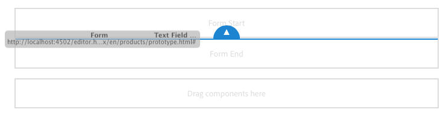

# Componentes de base {#foundation-components}

>[!CAUTION]
>
>La mayoría de los componentes de base ya están en desuso con AEM 6.5. Consulte la [notas de la versión](/help/release-notes/deprecated-removed-features.md) para obtener más información.
>
>Adobe recomienda utilizar más moderno y ampliable [Componentes principales](https://experienceleague.adobe.com/docs/experience-manager-core-components/using/introduction.html?lang=es) en AEM proyectos. Estos componentes forman parte del [Contenido de muestra de We.Retail](/help/sites-developing/we-retail.md) y también [se instala por separado y se utiliza para el desarrollo](https://experienceleague.adobe.com/docs/experience-manager-core-components/using/get-started/using.html) por su administrador.
>
>Puede usar la variable [AEM Modernizar grupo de herramientas](https://opensource.adobe.com/aem-modernize-tools/) para refactorizar el sitio basado en componentes de base y utilizar componentes principales.

Los componentes de base se diseñaron para utilizarse al crear contenido para una página web estándar. Forman un subconjunto de los componentes disponibles para su uso para una instalación estándar de AEM.

Algunos están disponibles inmediatamente mediante el navegador de componentes. Hay otros disponibles mediante [modo de diseño](/help/sites-authoring/default-components-designmode.md) (si la página está basada en una plantilla estática) o [edición de la plantilla](/help/sites-authoring/templates.md) (si la página está basada en una plantilla editable).

Se admite el uso de componentes de base, pero en su mayoría han quedado obsoletos y han sido reemplazados por componentes principales que ofrecen más extensibilidad y flexibilidad.

>[!NOTE]
>
>En esta sección solo se describen los componentes que están disponibles de forma predeterminada en una instalación de AEM estándar.
>
>Según la instancia, puede tener componentes personalizados desarrollados explícitamente para sus necesidades. Estos componentes personalizados pueden tener incluso el mismo nombre que algunos de los componentes mencionados aquí.

Los componentes están disponibles en el **Componentes** del panel lateral del editor de páginas cuando [edición de una página](/help/sites-authoring/editing-content.md).

Puede seleccionar un componente y arrastrarlo a la ubicación requerida en la página. A continuación, puede editarlo mediante:

* [Configurar propiedades](/help/sites-authoring/editing-page-properties.md)
* [Editar contenido](/help/sites-authoring/editing-content.md)

* [Editar contenido: modo pantalla completa](/help/sites-authoring/editing-content.md#edit-content-full-screen-mode)

Los componentes se ordenan según varias categorías denominadas grupos de componentes, entre ellas:

* [General](#general): Incluye componentes básicos, como texto, imágenes, tablas y gráficos.
* [Columnas](#columns): Incluye los componentes necesarios para organizar el diseño del contenido.
* [Formulario](#formgroup): Incluye todos los componentes necesarios para crear un formulario.

## General {#general}

Los componentes generales son los componentes básicos que se utilizan para crear contenido.

### Elemento de cuenta {#account-item}

>[!CAUTION]
>
>Este componente de base está en desuso. Adobe recomienda usar la variable [Componentes principales](https://experienceleague.adobe.com/docs/experience-manager-core-components/using/introduction.html?lang=es) en su lugar.

Puede definir un vínculo con título y descripción.


### Imagen adaptable {#adaptive-image}

>[!CAUTION]
>
>Este componente de base está en desuso. Adobe recomienda usar la variable [Componente principal de imagen](https://experienceleague.adobe.com/docs/experience-manager-core-components/using/wcm-components/image.html?lang=es) en su lugar.

El componente de base de la imagen adaptable genera imágenes que se ajustan al tamaño de la ventana en la que se abre la página web. Para utilizar el componente, proporcione un recurso de imagen desde el sistema de archivos o DAM. Cuando se abre la página web, el explorador web descarga una copia de la imagen cuyo tamaño se ha cambiado para que sea adecuada para la ventana actual.

Las siguientes características pueden determinar el tamaño de la ventana:

* Pantalla del dispositivo: Los dispositivos móviles suelen mostrar páginas web para que se extiendan a toda la pantalla.
* Tamaño de la ventana del explorador web: Los usuarios de equipos portátiles y de escritorio pueden cambiar el tamaño de las ventanas del explorador web.

Por ejemplo, el componente genera una imagen pequeña cuando la página web se abre en un teléfono móvil y una imagen de tamaño medio cuando se abre en una tableta. En un equipo portátil, el componente crea y entrega una imagen grande cuando la página se abre en un explorador web optimizado. Cuando se cambia el tamaño del explorador web para que se ajuste a una parte de la pantalla, el componente se adapta al proporcionar una imagen más pequeña y actualiza la vista.

#### Formatos de imagen compatibles {#supported-image-formats}

Puede utilizar archivos de imagen de las siguientes extensiones de nombre de archivo con el componente de imagen adaptable:

* .jpg
* .jpeg
* .png
* .gif &#42;&#42;

>[!CAUTION]
>
>Los archivos GIF animados no son compatibles con AEM para representaciones adaptables.

#### Calidad y tamaño de las imágenes {#images-sizes-and-quality}

En la tabla siguiente se indica la anchura de la imagen generada para el ancho de la ventanilla. La altura de la imagen generada se calcula para mantener una relación de aspecto constante y no hay espacios en blanco dentro del borde de la imagen. El recorte se puede utilizar para evitar espacios en blanco.

Cuando la imagen es una imagen JPEG, el tamaño de la ventanilla también puede influir en la calidad del JPEG. Las siguientes cualidades de JPEG son posibles:

* Bajo (0,42)
* Medio (0,82)
* Alto (1,00)

| **Intervalo de anchura de la ventanilla (píxeles)** | **Anchura de la imagen (píxeles)** | **Calidad JPEG** | **Tipo de dispositivo de destino** |
|---|---|---|---|
| anchura &lt;= 319 | 320 | baja |  |
| anchura = 320 | 320 | mediano | Teléfono móvil (vertical) |
| 320 &lt; anchura &lt; 481 | 480 | mediano | Teléfono móvil (horizontal) |
| 480 &lt; anchura &lt; 769 | 476 | alto | Comprimido (vertical) |
| 768 &lt; anchura &lt; 1025 | 620 | alto | Tablet (horizontal) |
| anchura &lt;= 1025 | completo (tamaño original) | alto | Escritorio |

#### Propiedades {#properties}

El cuadro de diálogo le permite editar las propiedades de su instancia del componente de imagen adaptable, muchas de las cuales son comunes con el componente Imagen en el que se basa. Las propiedades están disponibles en dos fichas:

* **Imagen**

   * **Imagen**
Arrastre una imagen desde el buscador de contenido o haga clic para abrir una ventana de navegación desde la que podrá cargar una imagen. Una vez cargada la imagen, puede recortarla, girarla o eliminarla. Para acercar y alejar la imagen, utilice la barra de deslizamiento situada debajo de la imagen (encima de los botones Aceptar y Cancelar)

   * **Recortar**
Clip parte de una imagen. Arrastre el borde para recortar la imagen.

   * **Rotar**
Haga clic en Rotar varias veces hasta que la imagen gire como desee.

   * **Borrar**
Elimine la imagen actual.

* **Avanzado**

   * **Título**
El componente de imagen adaptable no utiliza esta propiedad.

   * **Texto alternativo**
Texto alternativo que se utilizará para la imagen.

   * **Vincular a**
El componente de imagen adaptable no utiliza esta propiedad.

   * **Descripción**
El componente de imagen adaptable no utiliza esta propiedad.

#### Ampliación del componente de imagen adaptable {#extending-the-adaptive-image-component}

Para obtener información sobre la personalización del componente de imagen adaptable, consulte [Explicación del componente de imagen adaptable](/help/sites-developing/responsive.md#using-adaptive-images).

### Carrusel {#carousel}

>[!CAUTION]
>
>Este componente de base está en desuso. Adobe recomienda usar la variable [Componente principal de carrusel](https://experienceleague.adobe.com/docs/experience-manager-core-components/using/wcm-components/carousel.html?lang=es) en su lugar.

El componente Carrusel permite mostrar imágenes asociadas con páginas individuales:

* de una en una
* por un breve tiempo
* en el orden que especifique
* con un retraso de tiempo que especifique

Los controles en los que se puede hacer clic también permiten al usuario recorrer las páginas mostradas en tiempo real, según sea necesario. Al seleccionar la imagen de página visible actualmente, se accede a esa página. En otras palabras, el Carrusel actúa como un control de navegación.

#### Propiedades {#properties-1}

Estas propiedades están disponibles en dos fichas:

* **Carrusel**
Aquí especifica el funcionamiento del carrusel:

   * Velocidad de reproducción El tiempo, en milisegundos, antes de que se muestre la siguiente diapositiva.
   * Tiempo de transición El tiempo, en milisegundos, de transición entre dos diapositivas.
   * Estilo de controles Hay varias opciones disponibles en un menú desplegable; por ejemplo, los botones Anterior/Siguiente, los interruptores Superior-Derecha.

* **Lista**

   Aquí especifica cómo se incluyen las páginas en el carrusel:

   * **Lista de creación que utiliza**
Existen varias formas de crear una lista de páginas: páginas secundarias, lista fija, búsqueda o búsqueda avanzada (todas ellas se describen a continuación).
Independientemente del método que elija, las páginas que incluya en la lista ya deben tener una imagen asociada a la página. Esta imagen se muestra en el Carrusel. Si no hay ninguna imagen para una página determinada en las Propiedades de página de esa página, debe asociar una imagen a la página antes de comenzar. Si no lo hace, el carrusel muestra una página casi en blanco. Consulte [Edición de las propiedades de página](/help/sites-authoring/editing-page-properties.md).
Según el elemento que elija, aparecerá un panel nuevo:

      * **Opciones de las páginas secundarias**

         * **Página principal**
Especifique una ruta manualmente o con el selector. Deje vacío para utilizar la página actual como página principal.
      * **Opciones para la lista fija**

         * **Páginas**
Seleccione una lista de páginas. Uso 
`+` para añadir más entradas y los botones de flecha hacia arriba y hacia abajo para ajustar el orden.
      * **Opciones de búsqueda**

         * **Iniciar en**
Introduzca una ruta de inicio manualmente o con el selector.

         * **Consulta de búsqueda**
Puede introducir una consulta de búsqueda de texto sin formato.
      * **Opciones de búsqueda avanzada**

         * **Anotación predicada Querybuilder**
Puede introducir una consulta de búsqueda utilizando la notación de predicado QueryBuilder. Por ejemplo, puede introducir &quot;fulltext=Marketing&quot; para que todas las páginas con &quot;Marketing&quot; en su contenido se muestren en el Carrusel.
Consulte [API de QueryBuilder](/help/sites-developing/querybuilder-api.md) para ver un análisis completo de las expresiones de consulta y más ejemplos.
   * **Ordenar por**
Select 
`jcr:title`, `jcr:created`, `cq:lastModified`o `cq:template` en el menú desplegable.

   * **Límite**
Opcional. El número máximo de elementos que desea utilizar en el Carrusel.


>[!NOTE]
>
>Puede crear un componente de carrusel personalizado para Adobe Experience Manager que muestre recursos digitales en el DAM AEM. Consulte [Creación de componentes de carrusel personalizados para Adobe Experience Manager](https://experienceleague.adobe.com/docs/experience-manager-learn/getting-started-wknd-tutorial-develop/overview.html?lang=en).

### Gráfico {#chart}

>[!CAUTION]
>
>Este componente de base está en desuso. Adobe recomienda usar la variable [Componentes principales](https://experienceleague.adobe.com/docs/experience-manager-core-components/using/introduction.html?lang=es) en su lugar.

El componente Gráfico permite añadir una barra, una línea o un gráfico circular. AEM crea un gráfico a partir de los datos proporcionados. Los datos se proporcionan escribiendo directamente en la ficha Datos o copiando y pegando una hoja de cálculo.

* **Datos**

   * **Datos de gráfico**
Introduzca los datos del gráfico utilizando el formato CSV; el formato Valores separados por comas utiliza comas (&quot;,&quot;) como separador de campos.

* **Avanzado**

   * **Tipo de gráfico**
Seleccione entre Gráfico circular, Gráfico de líneas y Gráfico de barras.

   * **Texto alternativo**
Muestra texto alternativo en lugar del gráfico.

   * **Anchura**
Anchura del gráfico en píxeles.

   * **Altura**
Altura del gráfico en píxeles.

A continuación se muestra un ejemplo de los datos del gráfico seguido del gráfico de barras resultante:

 

>[!NOTE]
>
>Puede crear un control de AEM personalizado que muestre los datos en el JCR de AEM. Para obtener más información, consulte [Visualización de datos de Adobe Experience Manager en un gráfico](https://experienceleague.adobe.com/docs/experience-manager-learn/getting-started-wknd-tutorial-develop/overview.html?lang=en).

### Fragmento de contenido {#content-fragment}

>[!CAUTION]
>
>Este componente de base está en desuso. Adobe recomienda usar la variable [Componente principal del fragmento de contenido](https://experienceleague.adobe.com/docs/experience-manager-core-components/using/wcm-components/content-fragment-component.html) en su lugar.

[Fragmentos de contenido](/help/sites-authoring/content-fragments.md) se crean y administran como recursos independientes de las páginas. Después se pueden usar estos fragmentos, y sus variaciones, al crear páginas de contenido.

### Importador de diseños {#design-importer}

>[!CAUTION]
>
>Este componente de base está en desuso. Adobe recomienda usar la variable [Componentes principales](https://experienceleague.adobe.com/docs/experience-manager-core-components/using/introduction.html?lang=es) en su lugar.

Este componente permite cargar un archivo zip que contiene un paquete de diseño.

### Descargar {#download}

>[!CAUTION]
>
>Este componente de base está en desuso. Adobe recomienda usar la variable [Componentes principales](https://experienceleague.adobe.com/docs/experience-manager-core-components/using/introduction.html?lang=es) en su lugar.

El componente Descargar crea un vínculo en la página web seleccionada para descargar un archivo específico. Puede arrastrar un recurso desde el buscador de contenido o cargar un archivo.

* **Descargar**

   * **Descripción**
Se muestra una breve descripción con el vínculo de descarga.

   * **Archivo**
El archivo disponible para su descarga en la página web resultante. Arrastre un recurso desde el buscador de contenido o seleccione el área para cargar el archivo que desee que esté disponible para la descarga.

El siguiente ejemplo muestra el componente Descargar en Geometrixx:


### Externo {#external}

>[!CAUTION]
>
>Este componente de base está en desuso. Adobe recomienda usar la variable [Componentes principales](https://experienceleague.adobe.com/docs/experience-manager-core-components/using/introduction.html?lang=es) en su lugar.

El componente de integración de aplicaciones externas (**Externo**) permite incrustar aplicaciones externas en la página AEM mediante un iframe.

* **Externo**

   * **Aplicación de destino**
Especifique la URL de la aplicación web que desea integrar; por ejemplo:

      ```
      https://en.wikipedia.org/wiki/Main_Page
      ```

   * **Pasar parámetros**
Marque la casilla para que se pasen parámetros a la aplicación cuando sea necesario.

   * **Anchura y altura **Define el tamaño del iframe

La aplicación externa se integra en el sistema de párrafos de la página AEM; por ejemplo, al usar una aplicación de Target de `https://en.wikipedia.org/wiki/Main_Page`:


>[!NOTE]
>
>Según el caso de uso, hay otras opciones disponibles para la integración de aplicaciones externas, como el [Integración de portlets](/help/sites-administering/aem-as-portal.md).

### Flash {#flash}

>[!CAUTION]
>
>Este componente de base está en desuso. Adobe recomienda usar la variable [Componentes principales](https://experienceleague.adobe.com/docs/experience-manager-core-components/using/introduction.html?lang=es) en su lugar.

>[!CAUTION]
>
>Ya no se espera que este componente funcione de forma predeterminada sin una amplia personalización a nivel de proyecto.

El componente Flash permite cargar una película de Flash. Puede arrastrar un recurso flash desde el buscador de contenido al componente o utilizar el cuadro de diálogo:

* **Flash**

   * **Película Flash**

      Archivo de película flash. Arrastre un recurso desde el buscador de contenido o haga clic para abrir una ventana de navegación.

   * **Tamaño**

      Dimension en píxeles del área de visualización que contiene la película.

* **Imagen alternativa**

   Imagen alternativa que se mostrará

* **Avanzado**

   * **Menú contextual**

      Indica si el menú contextual se debe mostrar u ocultar.

   * **Modo de ventana**

      Cómo aparece la ventana, por ejemplo, opaca, transparente o como una ventana nítida (sólida).

   * **Color de fondo**

      Color de fondo seleccionado en la tabla de colores proporcionada.

   * **Versión mínima**

      Versión mínima del Flash Player de Adobe necesaria para ejecutar la película. El valor predeterminado es 9.0.0.

   * **Atributos**

      Cualquier otro atributo necesario.

### Imagen {#image}

>[!CAUTION]
>
>Este componente de base está en desuso. Adobe recomienda usar la variable [Componente principal de imagen](https://experienceleague.adobe.com/docs/experience-manager-core-components/using/wcm-components/image.html?lang=es) en su lugar.

El componente de imagen muestra una imagen y un texto de acompañamiento en función de los parámetros especificados.

Puede cargar una imagen y, a continuación, editarla y manipularla (por ejemplo, recortar, rotar y añadir un vínculo/título/texto).

Puede arrastrar y soltar una imagen desde el [Navegador de recursos](/help/sites-authoring/author-environment-tools.md#assets-browser) directamente en el componente o su [Cuadro de diálogo Configurar](/help/sites-authoring/editing-content.md#component-edit-dialog). También puede cargar una imagen desde el cuadro de diálogo Configurar ; este cuadro de diálogo también controla todas las definiciones y manipulaciones de la imagen:


Una vez cargada (y no antes) la imagen, puede usar [edición in situ](/help/sites-authoring/editing-content.md#edit-content) para recortar/rotar la imagen según sea necesario:


>[!NOTE]
>
>El editor de la aplicación utiliza el tamaño original y la relación de aspecto de la imagen al editarla. También puede especificar propiedades de altura y anchura. Cualquier restricción de tamaño y relación de aspecto se aplica cuando se guardan los cambios de edición.
>
>En función de su caso, las restricciones mínimas y máximas también pueden ser impuestas por la variable [diseño de la página](/help/sites-developing/designer.md). Estas restricciones se desarrollan durante la ejecución del proyecto.

Hay varias opciones adicionales disponibles en el modo de edición de pantalla completa; por ejemplo, mapa y zoom:


>[!NOTE]
>
>El progreso de la carga no se puede monitorizar con Internet Explorer.
>
>Los usuarios de Internet Explorer deben cargar la imagen y hacer clic en **Ok** y, a continuación, vuelva a abrir la imagen para ver el archivo cargado en la vista previa y para poder realizar modificaciones (es decir, recortar).
>
>Consulte la [Plataformas certificadas](/help/release-notes/release-notes.md#certifiedplatforms) para obtener más información sobre las funciones de HTML5 que utiliza AEM.

Cuando se carga una imagen, se puede configurar lo siguiente:

* **Asignar**

   Para asignar una imagen, seleccione Asignar. Puede especificar cómo desea crear el mapa de imagen (rectángulo, polígono, etc.) y hacia dónde debe apuntar el área.

* **Recortar**

   Para recortar parte de una imagen, seleccione Recortar. Utilice el ratón para recortar la imagen.

* **Rotar**

   Para girar una imagen, seleccione Rotar. Utilícelo repetidamente hasta que la imagen gire de la manera que desee.

* **Borrar**

   Elimine la imagen actual.

* **Título**

   Título de la imagen.

* **Texto alternativo**

   Texto alternativo para usar al crear contenido accesible.

* **Vincular a**

   Cree un vínculo a los recursos u otras páginas dentro del sitio web.

* **Descripción**

   Descripción de la imagen.

* **Tamaño**

   Define la altura y la anchura de la imagen.

>[!NOTE]
>
>Algunas opciones solo están disponibles en el editor de pantalla completa.

La imagen final (con **Título** y **Descripción**) podrá mostrarse como:


### Contenedor de diseño {#layout-container}

Este componente proporciona un sistema de párrafos de cuadrícula que le permite añadir y colocar componentes en una [cuadrícula adaptable](/help/sites-authoring/responsive-layout.md). Puede definir diferentes diseños de contenido en función de la anchura de los dispositivos de destino, incluida una amplia gama de teléfonos, tabletas y equipos de escritorio.


>[!NOTE]
>
>Este componente se ha implementado con [Idioma de plantilla del HTML (HTL)](https://experienceleague.adobe.com/docs/experience-manager-htl/content/overview.html?lang=es).

### Lista {#list}

>[!CAUTION]
>
>Este componente de base está en desuso. Adobe recomienda usar la variable [Componente principal de lista](https://experienceleague.adobe.com/docs/experience-manager-core-components/using/wcm-components/list.html) en su lugar.

El componente Lista permite configurar criterios de búsqueda para mostrar una lista:

* **Lista**

   * **Lista de creación que utiliza**

      Aquí puede especificar dónde recupera el contenido la lista. Existen varios métodos:

   * Según el elemento que elija, aparecerá un panel nuevo:

      * **Opciones de las páginas secundarias**

         * **Hijos de** (Página principal)

            Especifique una ruta manualmente o con el selector. Deje vacío para utilizar la página actual como página principal.
      * **Opciones para la lista fija**

         * **Páginas**

            Seleccione una lista de páginas. Utilice + para añadir más entradas y los botones de flecha hacia arriba y hacia abajo para ajustar el orden.
      * **Opciones de búsqueda**

         * Iniciar en

            Introduzca una ruta de inicio manualmente o con el selector.

         * Consulta de búsqueda

            Puede introducir una consulta de búsqueda de texto sin formato.
      * **Opciones de búsqueda avanzada**

         * **Notación de predicado de Querybuilder**

            Puede introducir una consulta de búsqueda utilizando la notación de predicado QueryBuilder. Por ejemplo, puede introducir &quot;fulltext=Marketing&quot; para que todas las páginas con &quot;Marketing&quot; en su contenido se muestren en el Carrusel.

            Consulte [API de QueryBuilder](/help/sites-developing/querybuilder-api.md) para ver un análisis completo de las expresiones de consulta y más ejemplos.
      * **Etiquetas**

         Especifique la variable **Página principal**, **Etiquetas/Palabras clave** y los criterios de coincidencia necesarios.
   * **Mostrar como**

      ¿Cómo desea que se incluyan los elementos? incluye vínculos, teasers y noticias.

   * **Ordenar por**

      Si la lista se va a ordenar y, si es así, los criterios que se utilizarán para la clasificación. Puede introducir un criterio o seleccionar uno de la lista desplegable proporcionada.

   * **Límite**

      Especifique el número máximo de elementos que desea que se muestren en la lista.

   * **Habilitar fuente**

      Indica si una fuente RSS debe activarse para la lista.

   * **Paginar tras**

      Aquí puede especificar el número de elementos de lista que se mostrarán a la vez. Una lista con más elementos de los especificados utiliza la paginación para mostrar la lista en varias partes.


El siguiente ejemplo muestra una **Lista** para mostrar una lista de páginas secundarias (el diseño se controla mediante las definiciones CSS personalizadas del diseño del sitio).


### Inicio de sesión {#login}

>[!CAUTION]
>
>Este componente de base está en desuso. Adobe recomienda usar la variable [Componentes principales](https://experienceleague.adobe.com/docs/experience-manager-core-components/using/introduction.html?lang=es) en su lugar.

>[!CAUTION]
>
>Ya no se espera que este componente funcione de forma predeterminada sin una amplia personalización a nivel de proyecto.

Proporciona los campos Nombre de usuario y Contraseña .


Puede configurar:

* Iniciar sesión

   * Etiqueta de sección

      Texto introductorio para los campos de entrada.

   * Etiqueta de nombre de usuario

      Texto para etiquetar el campo de nombre de usuario.

   * Etiqueta de contraseña

      Texto para etiquetar el campo de contraseña.

   * Etiqueta del botón de inicio de sesión

      Texto para el botón de inicio de sesión.

   * Redirigir a

      Puede especificar la página del sitio web que debe abrirse una vez que el usuario ha iniciado sesión.

* Ya hay una sesión iniciada

   * Etiqueta del botón Continuar

      Texto para indicar que el usuario ya ha iniciado sesión.

### Estado de pedidos {#order-status}

>[!CAUTION]
>
>Ya no se espera que este componente funcione de forma predeterminada sin una amplia personalización a nivel de proyecto.

* **Título**

   * **Título**

      Especifique el texto del título que desea que se muestre.

   * **Vincular**

      Especifique la página (producto) para la que se debe mostrar el estado de pedido.

   * **Tipo / Tamaño**

      Seleccione en la selección proporcionada.


### Referencia {#reference}

>[!CAUTION]
>
>Este componente de base está en desuso. Adobe recomienda usar la variable [Componente principal del fragmento de contenido](https://experienceleague.adobe.com/docs/experience-manager-core-components/using/wcm-components/content-fragment-component.html) en su lugar.

La variable **Referencia** permite hacer referencia a texto desde otra página del sitio web de AEM (dentro de la instancia actual). A continuación, el contenido del párrafo al que se hace referencia aparece como si estuviera en la página actual. El contenido se actualiza cuando cambia el párrafo de origen (puede que sea necesario actualizar la página).

* **Referencia de párrafo**

   * **Referencia**

      Especifique la ruta a la página y al párrafo al que desea hacer referencia (incluya contenido).

Para especificar la ruta a un párrafo, debe agregar un sufijo a la ruta (a la página) con:

`.../jcr:content/par/<paragraph-ID>`

Por ejemplo:

`/content/geometrixx-outdoors/en/equipment/biking/cajamara/jcr:content/par/similar-products`

Además de hacer referencia a un párrafo específico, la ruta también se puede modificar para especificar un sistema de párrafos completo. Puede hacer esta referencia añadiendo un sufijo a la ruta con lo siguiente:

`/jcr:content/par`

Por ejemplo:

`/content/geometrixx-outdoors/en/equipment/biking/cajamara/jcr:content/par`

Después de la configuración, el contenido aparece exactamente como en la página de origen. Solo se puede comprobar que se trata de una referencia cuando se abre el componente de edición:


### Búsqueda {#searching}

>[!CAUTION]
>
>Este componente de base está en desuso. Adobe recomienda usar la variable [Componente principal de búsqueda rápida](https://experienceleague.adobe.com/docs/experience-manager-core-components/using/wcm-components/quick-search.html) en su lugar.

El componente Búsqueda añade la capacidad de búsqueda a la página.

Puede configurar:

* Búsqueda

   * **Tipos de nodo**

      Si la búsqueda se va a restringir a un tipo de nodo específico, enumérenlos aquí; por ejemplo, `cq:Page`.

   * **Ruta de búsqueda**

      Especifique la página raíz de la rama que desea buscar.

   * **Texto del botón Buscar**

      El nombre que se muestra en el botón de búsqueda real.

   * **Texto de estadísticas**

      Texto que se muestra encima de los resultados de la búsqueda.

   * **No hay texto de resultados**

      Si no hay resultados, se muestra el texto introducido aquí.

   * **Revisar ortografía de texto**

      Si alguien introduce un término similar, este texto se muestra antes del término.
Por ejemplo, si escribe `Geometrixxe`, el sistema muestra &quot;¿Quiso decir? Geometrixx&quot;.

   * **Texto de páginas similares**

      Texto que se muestra al lado de un resultado para páginas similares. Para ver páginas con contenido similar, haga clic en este vínculo.

   * **Texto de búsquedas relacionadas**

      Texto que aparece junto a las búsquedas de términos y temas relacionados.

   * **Texto de tendencias de búsqueda**

      Título sobre los términos de búsqueda que introduce un usuario.

   * **Etiqueta de páginas de resultados**

      Texto que aparece en la parte inferior de esta lista con vínculos a otras páginas de resultados.

   * **Etiqueta anterior**

      Nombre que aparece en el vínculo a páginas de búsqueda anteriores.

   * **Etiqueta siguiente**

      Nombre que aparece en el vínculo a páginas de búsqueda posteriores.

El siguiente ejemplo muestra el componente Buscar después de buscar la palabra *`geometrixx`* desde el directorio raíz de una instalación estándar. También ilustra la paginación de los resultados:


El siguiente ejemplo muestra un término de búsqueda que está mal escrito y no está disponible:


### Sitemap {#sitemap}

>[!CAUTION]
>
>Este componente de base está en desuso. Adobe recomienda usar la variable [Navegación](https://experienceleague.adobe.com/docs/experience-manager-core-components/using/wcm-components/navigation.html), [Navegación por idiomas](https://experienceleague.adobe.com/docs/experience-manager-core-components/using/wcm-components/language-navigation.html)y [Componentes principales de la ruta de navegación](https://experienceleague.adobe.com/docs/experience-manager-core-components/using/wcm-components/breadcrumb.html) en su lugar.

Lista automática del mapa del sitio, que (con la configuración predeterminada) enumera todas las páginas (como vínculos activos) del sitio web actual. Por ejemplo, un extracto muestra:


Si es necesario, puede configurar lo siguiente:

* **Sitemap**

   * **Ruta de acceso raíz**

      Ruta desde la que comienza el listado.

### Presentación de diapositivas {#slideshow}

>[!CAUTION]
>
>Este componente de base está en desuso. Adobe recomienda usar la variable [Componente principal de carrusel](https://experienceleague.adobe.com/docs/experience-manager-core-components/using/wcm-components/carousel.html?lang=es) en su lugar.

>[!CAUTION]
>
>Ya no se espera que este componente funcione de forma predeterminada sin una amplia personalización a nivel de proyecto.

Este componente le permite cargar una serie de imágenes para mostrarlas como una presentación en la página. Puede añadir o eliminar imágenes y asignar un título a cada una. En Avanzado, también puede especificar el tamaño del área de visualización.

Puede configurar:

* **Diapositivas**

   * **Nueva diapositiva**

      Puede especificar una selección de diapositivas utilizando la variable **Agregar** (y **Eliminar**).

   * **Título**

      Especifique un título si es necesario. El título se superpone en la diapositiva adecuada.

* **Avanzado**

   * **Tamaño**

      Especifique la anchura y la altura en píxeles.

A continuación, el componente de presentación de diapositivas se muestra repetidamente en cada secuencia, durante un breve tiempo, antes de pasar a la siguiente diapositiva:


### Tabla {#table}

>[!CAUTION]
>
>Este componente de base está en desuso. Adobe recomienda usar la variable [Componente principal de texto](https://experienceleague.adobe.com/docs/experience-manager-core-components/using/wcm-components/text.html) en su lugar.

>[!NOTE]
>
>La variable **Tabla** El componente de base se basa en la variable [Editor de texto enriquecido](/help/sites-authoring/rich-text-editor.md), al igual que la variable **[Texto](#text)** Componente de base.

La variable **Tabla** está preconfigurado para permitirle construir, rellenar y dar formato a una tabla. Con el cuadro de diálogo puede configurar la tabla y crear el contenido mediante:

* desde cero
* copiar y pegar una hoja de cálculo o una tabla desde un editor externo (como Excel, OpenOffice y Notepad).

Puede realizar cambios básicos en el contenido mediante el editor en línea:


En el modo de pantalla completa puede configurar el diseño de la tabla:


La siguiente captura de pantalla muestra un ejemplo del componente de tabla; el diseño está determinado por el CSS específico del sitio:


### Nube de etiquetas {#tag-cloud}

Una nube de etiquetas muestra una selección de las etiquetas aplicadas al contenido de su sitio web presentada gráficamente:


Al configurar el componente Nube de etiquetas, puede especificar:

* **Etiquetas para mostrar**

   Dónde se recopilan las etiquetas que se van a mostrar. Seleccione una página, una página con todos los elementos secundarios o etiquetas.

* **Página**

   Seleccione la página a la que desea hacer referencia.

* **Sin vínculos ni etiquetas**

   Si las etiquetas mostradas deben actuar como vínculos.

Para obtener más información sobre la aplicación de etiquetas, visite [Uso de etiquetas](/help/sites-authoring/tags.md).

### Texto {#text}

>[!CAUTION]
>
>Este componente de base está en desuso. Adobe recomienda usar la variable [Componente principal de texto](https://experienceleague.adobe.com/docs/experience-manager-core-components/using/wcm-components/text.html) en su lugar.

>[!NOTE]
>
>La variable **Texto** El componente de base se basa en la variable [Editor de texto enriquecido](/help/sites-authoring/rich-text-editor.md), al igual que la variable **Tabla** Componente de base.

El componente Texto permite introducir un bloque de texto utilizando un editor WYSIWYG, con la funcionalidad proporcionada por el [Editor de texto enriquecido](/help/sites-authoring/rich-text-editor.md). Una selección de iconos permite dar formato al texto, incluyendo características de fuente, alineación, vínculos, listas y sangría.


Al abrir el **Configurar** también puede establecer:

* **Espaciador**
* **Estilo de texto**

El texto con formato se muestra en la página. El diseño real depende del CSS del sitio:


Para obtener información más detallada sobre el componente Texto y la funcionalidad proporcionada por el editor de texto enriquecido, consulte la [Editor de texto enriquecido](/help/sites-authoring/rich-text-editor.md) página.

#### Edición in situ {#inplace-editing}

Además del modo de edición de texto enriquecido basado en cuadros de diálogo, AEM también proporciona [Edición in situ](/help/sites-authoring/editing-content.md), que permite editar directamente el texto tal como aparece en el diseño de la página.

### Texto e imagen {#text-image}

>[!CAUTION]
>
>Este componente de base está en desuso. Adobe recomienda usar la variable [Imagen](https://experienceleague.adobe.com/docs/experience-manager-core-components/using/wcm-components/image.html?lang=es) y [Componente principal de texto](https://experienceleague.adobe.com/docs/experience-manager-core-components/using/wcm-components/text.html) en su lugar.

El componente Texto e imagen añade un bloque de texto y una imagen. También puede añadir y editar texto e imágenes por separado. Consulte la [Texto](#text) y [Imagen](#image) componentes para obtener más información.


Puede configurar:

* **Estilos de componente** (**Estilos**)

   Aquí puede alinear la imagen a la izquierda o a la derecha. El valor predeterminado es **Left** alineado, con la imagen a la izquierda.

* **Propiedades de imagen** (**Propiedades de imagen avanzadas**)

   Permite especificar lo siguiente:

   * **Recurso de imagen**

      Cargue la imagen requerida.

   * **Título**

      Título del bloque, que se muestra al pasar el ratón por encima.

   * **Texto alternativo**

      Texto alternativo que se mostrará si la imagen no se puede mostrar. Si se deja vacío, se utiliza el título.

   * **Vincular a**

      Especifique una ruta de destino.

   * **Descripción**

      Descripción de la imagen.

   * **Tamaño**

      Define la altura y la anchura de la imagen.

El siguiente ejemplo muestra un componente de imagen de texto que muestra la imagen alineada a la izquierda:


### Título {#title}

>[!CAUTION]
>
>Este componente de base está en desuso. Adobe recomienda usar la variable [Componente principal de título](https://experienceleague.adobe.com/docs/experience-manager-core-components/using/wcm-components/list.html?lang=en) en su lugar.

El componente de título puede:

* Para mostrar el nombre de la página actual, deje el campo Título en blanco.
* Muestre un texto especificado en el campo Título .

Puede configurar:

* **Título**

   Si desea utilizar un nombre que no sea el título de la página, introdúzcalo aquí.

* **Vincular**

   El URI si el título va a funcionar como vínculo.

* **Tipo / Tamaño**

   Seleccione Pequeño o Grande en la lista desplegable. Pequeño se genera como imagen. Grande se genera como texto.

El siguiente ejemplo muestra una **Título** componente que se muestra; el diseño está determinado por el CSS específico del sitio.


### Vídeo {#video}

>[!CAUTION]
>
>Este componente de base está en desuso. Adobe recomienda usar la variable [Componente incrustado de componentes principales](https://experienceleague.adobe.com/docs/experience-manager-core-components/using/wcm-components/embed.html) en su lugar.

>[!CAUTION]
>
>Ya no se espera que este componente funcione de forma predeterminada sin una amplia personalización a nivel de proyecto.

La variable **Vídeo** permite colocar un elemento de vídeo predefinido y listo para usar en una página.

Consulte también [Configurar los perfiles de vídeo](/help/sites-administering/config-video.md#configuringvideoprofiles) para su uso con elementos HTML5.

Después de colocar una instancia del componente en la página, puede configurar lo siguiente:

* Vídeo

   * **Recurso de vídeo**

      Cargue o suelte su recurso de vídeo.

   * **Tamaño**

      El tamaño nativo del vídeo (anchura x altura en píxeles) aparece en los cuadros junto a Tamaño (ver arriba). Introduzca aquí manualmente las dimensiones de anchura y altura si desea anular las dimensiones nativas del vídeo. Selección **OK** descarta el cuadro de diálogo.

>[!NOTE]
>
>Los formatos admitidos son:
>
>* `.mp4`
>* `Ogg`
>* `FLV` (vídeo de Flash)


## Columnas {#columns}

Las columnas son un mecanismo para controlar el diseño del contenido en AEM. En una instalación estándar, se proporcionan los componentes para crear dos o tres columnas.

El siguiente ejemplo muestra el componente Columnas en uso. Puede utilizar los marcadores de posición para los componentes nuevos:


### 2 columnas {#columns-1}

Componente Control de columna cuyo valor predeterminado es de dos columnas iguales.

### 3 columnas {#columns-2}

Componente Control de columna cuyo valor predeterminado es de tres columnas iguales.

### Control de columna {#column-control}

El componente Control de columna permite a los usuarios seleccionar cómo desean dividir el contenido del panel principal de la página web en varias columnas. Los usuarios pueden seleccionar el número de columnas necesarias (de una lista predefinida) y luego crear, eliminar o mover contenido dentro de cada columna.

* **Control de columna**

   * **Diseño de columna**

      Seleccione el número de columnas que desea procesar. Una vez creada, cada columna tiene su propio vínculo para arrastrar componentes o recursos al añadir contenido.

## Formulario {#form}

>[!CAUTION]
>
>El componente de base está en desuso. Adobe recomienda usar la variable [Componentes principales](https://experienceleague.adobe.com/docs/experience-manager-core-components/using/introduction.html?lang=es) en su lugar.

Los componentes de formulario se utilizan para crear formularios para que los visitantes envíen sus datos. Forms y los componentes de formulario se pueden utilizar para recopilar información, incluidos los comentarios de usuario (por ejemplo, un cuestionario de satisfacción del cliente) e información del usuario (por ejemplo, registro de usuarios).

>[!NOTE]
>
>Consulte [Ayuda de AEM Forms](/help/forms/home.md) para obtener información sobre AEM Forms.

Forms consta de varios componentes diferentes:

* **Formulario**

   El componente de formulario define el principio y el final de un nuevo formulario en una página. A continuación, se pueden colocar otros componentes entre estos elementos, como tablas y descargas.

* **Campos y elementos de formulario**

   Los campos y elementos de formulario pueden incluir cuadros de texto, botones de opción e imágenes. El usuario suele completar una acción en un campo de formulario, como escribir texto. Consulte los elementos de formulario individuales para obtener más información.

* **Componentes de perfil**

   Los componentes Perfil están relacionados con perfiles utilizados para colaboración social y otras áreas en las que es necesaria la personalización de visitantes.

A continuación se muestra un formulario de ejemplo. Se compone de la variable **Formulario** componente (inicio y fin), con dos **Formulario** **Texto** campos utilizados para la entrada, un **General** **Texto** campo utilizado para el texto de introducción y un **Submit** botón.


>[!NOTE]
>
>La información sobre el desarrollo y la personalización de los formularios está disponible en la [Desarrollo de la página de Forms](/help/sites-developing/developing-forms.md). Esta capacidad incluye añadir acciones, restricciones, precargar campos y utilizar secuencias de comandos para llamar a un servicio para que actúe, entre otros.

### Configuración común de (muchos) componentes de formulario {#settings-common-to-many-form-components}

Aunque cada uno de los componentes del formulario tiene un propósito diferente, muchos están compuestos por opciones y parámetros similares.

Al configurar cualquiera de los componentes de formulario, están disponibles las fichas siguientes en el cuadro de diálogo:

* **Título y texto**

   Aquí debe especificar la información básica, como el título del formulario y el texto que lo acompañe, si lo hay. Si procede, también le permite definir otra información clave, como si el campo es multiseleccionable y si los elementos se pueden seleccionar.

* **Valores iniciales**

   Permite especificar un valor predeterminado.

* **Restricciones**

   Aquí puede especificar si un campo es obligatorio y establecer restricciones en ese campo (por ejemplo, debe ser numérico).

* **Estilo**

   Indica el tamaño y el estilo de los campos.

>[!NOTE]
>
>Los campos que se ven dependen en gran medida del componente individual.

Estas pestañas le proporcionan los parámetros necesarios. Las pestañas pueden depender del tipo de componente individual, pero pueden incluir lo siguiente:

* **Título y texto**

   * **Nombre de elemento**

      Nombre del elemento de formulario. Indica en qué parte del repositorio se almacenan los datos.
Este campo es obligatorio y solo debe contener los siguientes caracteres:

      * Caracteres alfanuméricos
      * `_ . / : -`
   * **Título**

      El título que se muestra con el campo . Si se deja en blanco, se muestra el título predeterminado.

   * **Descripción**

      Permite proporcionar información adicional para el usuario, si es necesario. En el formulario, se muestra debajo del campo, en una fuente más pequeña que el título.

   * **Mostrar / Ocultar**

      Determina si el campo está visible.


* **Valores iniciales**

   * **Valor predeterminado**

      Valor que se muestra en el campo cuando se abre el formulario. Es decir, antes de que el usuario introduzca información.

* **Restricciones**

   * **Requerido**

      Las restricciones dependen del tipo de componente del formulario, pero proporciona una o más casillas de verificación para indicar que el campo es obligatorio o que determinadas partes del campo son necesarias.

   * **Mensaje obligatorio**

      Un mensaje para informar a los usuarios de que este campo es obligatorio. Un campo obligatorio también se marca con un asterisco.

   * **Restricción**

      Las restricciones disponibles para la selección dependen del tipo de componente del formulario.

   * **Mensaje de restricción**

      Un mensaje para informar a los usuarios de lo que se requiere.

* **Estilo**

   * **Tamaño**

      En filas y columnas.

   * **Anchura**

      En píxeles.

   * **CSS**

### Formulario (componente) {#form-component}

>[!CAUTION]
>
>Este componente de base está en desuso. Adobe recomienda usar la variable [Componente principal del contenedor de formularios](https://experienceleague.adobe.com/docs/experience-manager-core-components/using/wcm-components/forms/form-container.html) en su lugar.

El componente Formulario define el inicio y el final de un formulario utilizando la variable **Inicio del formulario** y **Final del formulario** elementos. El inicio y el final siempre están emparejados para garantizar que el formulario esté definido correctamente.



Entre el inicio y el final de un formulario, puede agregar componentes de formulario que definan los campos de entrada reales para los usuarios.

>[!NOTE]
>
>El componente de formulario de componentes de base solo admite el uso de otros componentes de formulario de componentes de base (botón, texto, oculto, etc.). Uso [componentes principales](https://experienceleague.adobe.com/docs/experience-manager-core-components/using/introduction.html?lang=es) no se admiten los componentes de formulario dentro de un formulario de componente de base (y a la inversa).

#### Inicio de formulario {#start-of-form}

Este componente define el inicio de un nuevo formulario en una página. Puede configurar:

* **Formulario**

   * **Página de agradecimientos**

      Página a la que se hace referencia para agradecer a los visitantes que hayan proporcionado información. Si se deja en blanco, el formulario se vuelve a mostrar tras el envío.

   * **Iniciar flujo de trabajo**

      Determina qué flujo de trabajo se activa una vez que se envía un formulario.

* **Avanzado**

   * **Tipo de acción**

      Un formulario necesita una acción. La acción define la operación que se activa para la ejecución con los datos enviados por el usuario (similar a action= en HTML). Algunos necesitan un **Configuración de la acción**.
En una instalación AEM estándar se incluye una selección de tipos de acciones:

      * **Solicitud de cuenta**
      * **Crear contenido**
      * **Crear posible cliente**
      * **Crear y actualizar cuenta**
      * **Servicio de correo electrónico: crear suscriptor y agregar a la lista**
      * **Servicio de correo electrónico: enviar correo electrónico de respuesta automática**
      * **Servicio de correo electrónico: cancelar la subscripción del usuario a la lista**
      * **Editar comunidad**
      * **Editar recursos**
      * **Editar recursos controlados de flujo de trabajo**
      * **Correo**
      * **Detalles de pedido realizado**
      * **Actualización de perfil**
      * **Restablecer contraseña**
      * **Definir contraseña**
      * **Almacenar contenido**

         El tipo de acción predeterminado.

      * **Almacenar contenido con cargas**
      * **Enviar pedido**
      * **Cancelar la suscripción del suscriptor**
      * **Actualizar pedido**
   * **Identificador de formulario**

      El identificador del formulario identifica de forma exclusiva el formulario. Utilice el identificador del formulario si tiene varios formularios en una sola página; asegúrese de que tienen identificadores diferentes.

   * **Ruta de carga**

      Ruta a las propiedades del nodo que se utiliza para cargar valores predefinidos en los campos del formulario.

      Campo opcional que especifica la ruta a un nodo en el repositorio. Cuando este nodo tiene propiedades que coinciden con los nombres de campo, los campos correspondientes del formulario se cargan previamente con el valor de esas propiedades. Si no existe coincidencia, el campo contiene el valor predeterminado.

      Uso **Ruta de carga** puede cargar previamente el formulario con valores en los campos obligatorios. Consulte [Precarga de valores de formulario](/help/sites-developing/developing-forms.md#preloading-form-values).

   * **Validación del cliente**

      Indica si se requiere validación de cliente para este formulario (validación de servidor *always* ). La validación del cliente se puede lograr con la variable **Forms Captcha** componente.

   * **Tipo de medio de validación**

      Define el tipo de recurso de validación del formulario si desea validar todo el formulario (en lugar de campos individuales). Si va a validar el formulario completo, incluya también una de las siguientes opciones:

      * Una secuencia de comandos para la validación del cliente:

         `/apps/<*myApp*>/form/<*myValidation*>/formclientvalidation.jsp`

      * Secuencia de comandos para validación en el servidor:

         `/apps/<*myApp*>/form/<*myValidation*>/formservervalidation.jsp`
   * **Configuración de la acción**

      Las opciones disponibles en **Configuración de la acción** dependen de la **Tipo de acción**:

      * **Solicitud de cuenta**

         * **Página Crear cuenta**

            Página que se utiliza al crear una cuenta.
      * **Crear contenido**

         * Ruta de contenido

            Ruta de contenido para cualquier contenido que descargue el formulario. Introduzca una ruta que termine con una barra diagonal `/`. La barra diagonal significa que para cada puerto del formulario, se crea un nuevo nodo en la ubicación dada; por ejemplo:

            `/forms/feedback/`

         * **Tipo**

            Seleccione el tipo requerido.

         * **Formulario**

            Especifique el formulario.

         * **Procesar con**

            Seleccione la opción requerida de la lista.

         * **Tipo de medio**

            Si se configura, se agrega a cada comentario como `sling:resourceType`

         * **Selector de vista**
      * **Crear posible cliente**

         * **El posible cliente se agrega a esta lista**

            Especifique la lista de posibles clientes requerida.
      * **Crear y actualizar cuenta**

         * **Grupo inicial**

            Grupo al que asignar un nuevo usuario.

         * **Página principal**

            Página que se muestra después de iniciar sesión correctamente.

         * **Ruta**

            La ruta (relativa) donde se crea y almacena la nueva cuenta.

         * **Ver datos...**

            Al seleccionar este botón, se accede a la información sobre los resultados del formulario en el Editor por lotes. Desde aquí puede exportar la información a un `.tsv` (separado por tabulaciones) (para su uso, por ejemplo, en una hoja de cálculo de Excel).
      * **Correo**

         * **De**

            Introduzca la dirección de correo electrónico de la que debe proceder el correo.

         * **Mailto**

            Introduzca una o varias direcciones de correo electrónico a las que se envía el formulario.

         * **CC**

            Introduzca una o más direcciones de correo electrónico CC.

         * **CCO**

            Introduzca una o más direcciones de correo electrónico CCO.

         * **Asunto**

            Introduzca un asunto para el correo electrónico.
      * **Restablecer contraseña**

         * **Página Cambiar contraseña**

            La página que se utilizará al cambiar la contraseña.
      * **Almacenar contenido**

         * **Ruta de contenido**

            Ruta de contenido para cualquier contenido que descargue el formulario. Introduzca una ruta que termine con una barra diagonal `/`. La barra diagonal significa que para cada puerto del formulario, se crea un nuevo nodo en la ubicación dada; por ejemplo:
            `/forms/feedback/`

         * **Ver datos...**

            Haga clic en este botón para acceder a la información sobre los resultados del formulario en el Editor por lotes. Desde aquí puede exportar la información en un archivo .tsv (separado por tabulaciones) para utilizarlo en una hoja de cálculo de Excel, por ejemplo.
      * **Almacenar contenido con cargas**

         Tiene las mismas opciones que **Almacenar contenido**.

      * **Cancelar la suscripción del suscriptor**

         * **El posible cliente se elimina de esta lista**

            Especifique la lista de posibles clientes requerida.


#### Fin de formulario {#end-of-form}

Marca el final del formulario. Puede configurar lo siguiente:

* **Fin de formulario**

   * **Mostrar botón Enviar**

      Indica si se debe mostrar o no un botón Enviar.

   * **Nombre de envío**

      Un identificador si utiliza varios botones de envío en un formulario.

   * **Título de envío**

      El nombre que aparece en el botón, como Enviar o Enviar.

   * **Mostrar botón Restablecer**

      Al seleccionar la casilla de verificación, se muestra el botón Restablecer.

   * **Restablecer título**

      Nombre que aparece en el botón Restablecer.

   * **Descripción**

      Información que aparece debajo del botón.

### Nombre de la cuenta {#account-name}

>[!CAUTION]
>
>Este componente de base está en desuso. Adobe recomienda usar la variable [Componente principal de texto de formulario](https://experienceleague.adobe.com/docs/experience-manager-core-components/using/wcm-components/forms/form-text.html) en su lugar.

Permite que el usuario introduzca un nombre de cuenta:


### Dirección {#address}

>[!CAUTION]
>
>Este componente de base está en desuso. Adobe recomienda usar la variable [Componente principal de texto de formulario](https://experienceleague.adobe.com/docs/experience-manager-core-components/using/wcm-components/forms/form-text.html) en su lugar.

Permite agregar un campo de dirección internacional con el siguiente formato:


El componente está configurado para su uso inmediato, pero puede cambiar la configuración si es necesario. Por ejemplo, se pueden añadir restricciones para elementos individuales de la dirección. Dejar los campos vacíos significa que se utiliza la configuración predeterminada.

### Captcha {#captcha}

>[!CAUTION]
>
>Este componente de base está en desuso. Adobe recomienda usar la variable [Componentes principales](https://experienceleague.adobe.com/docs/experience-manager-core-components/using/introduction.html?lang=es) en su lugar.

>[!CAUTION]
>
>Ya no se espera que este componente funcione de forma predeterminada sin una amplia personalización a nivel de proyecto.

El componente Captcha requiere que el usuario escriba una cadena alfanumérica tal y como se muestra en pantalla. La cadena cambia con cada actualización.


Puede configurar varios parámetros para este componente, incluido un mensaje que se mostrará cuando la cadena captcha no sea válida.

### Grupo de casillas de verificación {#checkbox-group}

>[!CAUTION]
>
>Este componente de base está en desuso. Adobe recomienda usar la variable [Componente principal de opciones de formulario](https://experienceleague.adobe.com/docs/experience-manager-core-components/using/wcm-components/forms/form-options.html) en su lugar.

Una casilla de verificación permite crear una lista de una o más casillas de verificación, varias de las cuales pueden seleccionarse al mismo tiempo.


Puede especificar varios parámetros, como título, descripción y nombre del elemento. Con los botones + y - puede añadir o eliminar elementos y posteriormente colocarlos con las flechas arriba y abajo.

>[!NOTE]
>
>Uso **Ruta de carga de elementos** puede cargar previamente la lista de grupos de casillas de verificación con valores.
>
>Consulte [Precarga de campos de formulario con varios valores](/help/sites-developing/developing-forms.md#preloading-form-fields-with-multiple-values).

### Detalles de la tarjeta de crédito {#credit-card-details}

>[!CAUTION]
>
>Este componente de base está en desuso. Adobe recomienda usar la variable [Componentes principales](https://experienceleague.adobe.com/docs/experience-manager-core-components/using/introduction.html?lang=es) en su lugar.

Permite proporcionar los campos necesarios para introducir los detalles de las tarjetas de crédito. Puede configurarla para especificar los tipos de tarjeta aceptadas y la información necesaria (por ejemplo, el código de seguridad).


### Lista desplegable {#dropdown-list}

>[!CAUTION]
>
>Este componente de base está en desuso. Adobe recomienda usar la variable [Componente principal de opciones de formulario](https://experienceleague.adobe.com/docs/experience-manager-core-components/using/wcm-components/forms/form-options.html) en su lugar.

Se puede configurar una lista desplegable para proporcionar a su uso un rango de valores para la selección:


Puede especificar un título y elementos para que aparezcan en la lista. Con los botones + y - puede añadir o quitar los elementos de la lista y posteriormente colocarlos con los botones Subir y Bajar. Puede especificar si los usuarios pueden seleccionar varios elementos de la lista y cualquier elemento que se deba seleccionar automáticamente la primera vez que abran la lista (valores iniciales).

>[!NOTE]
>
>Uso **Ruta de carga de elementos** puede cargar previamente la lista desplegable con valores.
>
>Consulte [Precarga de campos de formulario con varios valores](/help/sites-developing/developing-forms.md#preloading-form-fields-with-multiple-values).

### Carga de archivo {#file-upload}

>[!CAUTION]
>
>Este componente de base está en desuso. Adobe recomienda usar la variable [Componentes principales](https://experienceleague.adobe.com/docs/experience-manager-core-components/using/introduction.html?lang=es) en su lugar.

El componente de carga de archivos proporciona al usuario un mecanismo para seleccionar y cargar un archivo.


>[!NOTE]
>
>Puede crear un componente de carga personalizado para cargar archivos en un Sling Servlet. Para obtener más información, consulte [Carga de archivos a Adobe Experience Manager](https://experienceleaguecommunities.adobe.com/t5/adobe-experience-manager/aem-cloud-service-create-asset-servlet-for-uploading-small-files/td-p/404276).

### Campo oculto {#hidden-field}

>[!CAUTION]
>
>Este componente de base está en desuso. Adobe recomienda usar la variable [Componente principal oculto de formulario](https://experienceleague.adobe.com/docs/experience-manager-core-components/using/wcm-components/forms/form-hidden.html) en su lugar.

Permite crear un campo oculto. Estos campos ocultos se pueden utilizar para varios fines. Por ejemplo, cuando se debe realizar una acción después de enviar el formulario o cuando se requieran datos ocultos en el posprocesamiento.


>[!NOTE]
>
>También puede personalizar el formulario para que se muestren u oculten componentes de formulario específicos según el valor de otros campos del formulario. Cambiar la visibilidad de un campo de formulario resulta útil cuando el campo solo es necesario en condiciones específicas.
>
>Consulte [Mostrar y ocultar componentes del formulario](/help/sites-developing/developing-forms.md#showing-and-hiding-form-components).

### Botón de imagen {#image-button}

>[!CAUTION]
>
>Este componente de base está en desuso. Adobe recomienda usar la variable [Componente principal de botón de formulario](https://experienceleague.adobe.com/docs/experience-manager-core-components/using/wcm-components/forms/form-button.html) en su lugar.

Un botón de imagen le permite crear un botón con su propia imagen y texto:


### Carga de imagen {#image-upload}

>[!CAUTION]
>
>Este componente de base está en desuso. Adobe recomienda usar la variable [Componentes principales](https://experienceleague.adobe.com/docs/experience-manager-core-components/using/introduction.html?lang=es) en su lugar.

El componente de carga de imágenes proporciona al usuario un mecanismo para seleccionar y cargar un archivo de imagen.


### Campo de vínculo {#link-field}

>[!CAUTION]
>
>Este componente de base está en desuso. Adobe recomienda usar la variable [Componentes principales](https://experienceleague.adobe.com/docs/experience-manager-core-components/using/introduction.html?lang=es) en su lugar.

El campo de vínculo permite al usuario especificar una dirección URL:


Se utiliza principalmente para el formulario de eventos de calendario, que se utiliza para el campo URL/vínculo de un evento.

### Campo de contraseña {#password-field}

>[!CAUTION]
>
>Este componente de base está en desuso. Adobe recomienda usar la variable [Componentes principales](https://experienceleague.adobe.com/docs/experience-manager-core-components/using/introduction.html?lang=es) en su lugar.

Permite al usuario introducir su contraseña:


### Restablecimiento de contraseña {#password-reset}

>[!CAUTION]
>
>Este componente de base está en desuso. Adobe recomienda usar la variable [Componentes principales](https://experienceleague.adobe.com/docs/experience-manager-core-components/using/introduction.html?lang=es) en su lugar.

Este componente proporciona al usuario dos campos para:

* la introducción de una contraseña
* introducción repetida de la contraseña para confirmar que la entrada es correcta.

Con la configuración predeterminada, el componente aparece de la siguiente manera:


### Grupo de radio {#radio-group}

>[!CAUTION]
>
>Este componente de base está en desuso. Adobe recomienda usar la variable [Componente principal de opciones de formulario](https://experienceleague.adobe.com/docs/experience-manager-core-components/using/wcm-components/forms/form-options.html) en su lugar.

Un grupo de opciones proporciona una lista de una o más casillas de verificación de opciones, de las cuales solo una se puede seleccionar en un momento determinado.

Puede especificar el nombre del elemento junto con un título y una descripción. Con los botones + y - puede añadir o quitar elementos, colocarlos con las flechas arriba y abajo y especificar un valor predeterminado, si es necesario:


>[!NOTE]
>
>Uso **Ruta de carga de elementos** puede cargar previamente el grupo de opciones con valores.
>
>Consulte [Precarga de campos de formulario con varios valores](/help/sites-developing/developing-forms.md#preloading-form-fields-with-multiple-values).

### Botón Enviar {#submit-button}

>[!CAUTION]
>
>Este componente de base está en desuso. Adobe recomienda usar la variable [Componente principal de botón de formulario](https://experienceleague.adobe.com/docs/experience-manager-core-components/using/wcm-components/forms/form-button.html) en su lugar.

Este componente permite crear un botón de envío, con el texto predeterminado:


O con su propio texto:


### Campo de etiquetas {#tags-field}

>[!CAUTION]
>
>Este componente de base está en desuso. Adobe recomienda usar la variable [Componentes principales](https://experienceleague.adobe.com/docs/experience-manager-core-components/using/introduction.html?lang=es) en su lugar.

Este campo permite seleccionar etiquetas:


Puede especificar varios parámetros, incluidos los espacios de nombres que se pueden utilizar, mediante la pestaña especializada:

* **Campo de etiqueta**

   * **Espacios de nombres permitidos**

      * **Geometrixx Outdoors**
      * **Flujo de trabajo**
      * **Foro**
      * **Fotografía de archivo**
      * **Geometrixx Media**
      * **Etiquetas estándar**
      * **Marketing**
      * **Propiedades del recurso**
      * **Anchura en píxeles**
      * **Tamaño emergente**

### Campo de texto {#text-field}

>[!CAUTION]
>
>Este componente de base está en desuso. Adobe recomienda usar la variable [Componente principal de texto de formulario](https://experienceleague.adobe.com/docs/experience-manager-core-components/using/wcm-components/forms/form-text.html) en su lugar.

El campo de texto estándar se puede configurar con el tamaño necesario y con su propio posible cliente en el mensaje:


### Botones de envío de flujo de trabajo {#workflow-submit-button-s}

>[!CAUTION]
>
>Este componente de base está en desuso. Adobe recomienda usar la variable [Componente principal de botón de formulario](https://experienceleague.adobe.com/docs/experience-manager-core-components/using/wcm-components/forms/form-button.html) en su lugar.

Permite crear un botón Enviar para utilizarlo en un flujo de trabajo.


