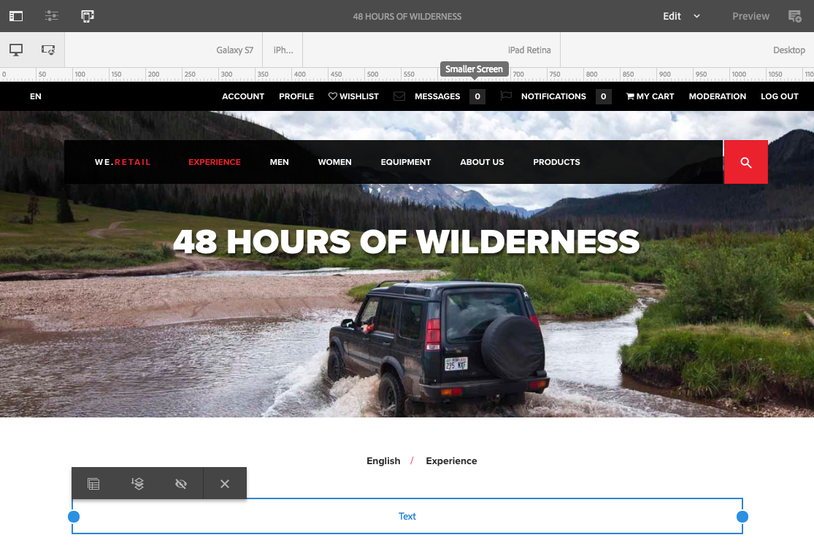

# Edición del contenido de una página{#editing-page-content}

Después de crear una página (nueva o como parte de un lanzamiento o Live Copy), puede editar el contenido para realizar las actualizaciones que requiera.

El contenido se añade mediante [componentes](/help/sites-authoring/default-components-console.md) (según el tipo de contenido) que se puede arrastrar a la página. Después estos se pueden editar local, mover o eliminar.

>[!NOTE]
>
>Su cuenta necesita el [derechos de acceso adecuados](/help/sites-administering/security.md) y [permissions](/help/sites-administering/security.md#permissions) para editar páginas.
>
>Si se producen problemas, le sugerimos que se ponga en contacto con el administrador del sistema.

>[!NOTE]
>
>Si la página o plantilla se han configurado correctamente, podrá utilizar el [diseño interactivo](/help/sites-authoring/responsive-layout.md) cuando esté editando.

>[!NOTE]
>
>En el modo de **edición** puede ver los vínculos en el contenido, pero no puede **acceder** a ellos. Utilice el [modo de vista previa](#previewingpagestouchoptimizedui) si desea navegar utilizando los vínculos del contenido.

## Barra de herramientas de página {#page-toolbar}

La barra de herramientas de página ofrece acceso a las funciones correspondientes, en función de la configuración de la página.

La barra de herramientas ofrece acceso a numerosas opciones. Según el contexto y la configuración actuales, es posible que algunas opciones no estén disponibles.

* **Alternar panel lateral**

   Esto abre/cierra el panel lateral, que contiene la variable [Navegador de recursos](/help/sites-authoring/author-environment-tools.md#assets-browser), [Navegador de componentes](/help/sites-authoring/author-environment-tools.md#components-browser)y [Árbol de contenido](/help/sites-authoring/author-environment-tools.md#content-tree).

   

* **Información de la página**

   Proporciona acceso al [Información de la página](/help/sites-authoring/author-environment-tools.md#page-information) incluido los detalles de la página y las acciones que se pueden realizar en ella, como ver y editar la información de la página, ver las propiedades de la página y publicar o cancelar la publicación de la página.

   

* **Emulador**

   Alterna el [barra de herramientas del emulador](/help/sites-authoring/responsive-layout.md#selecting-a-device-to-emulate), que se utiliza para emular la apariencia de la página en otro dispositivo. Se activa automáticamente en el modo de diseño.

   

* **ContextHub**

   Abre el [centro de contexto](/help/sites-authoring/ch-previewing.md). Solo está disponible en el modo de vista previa.

   

* **Título de página**

   Esto es meramente informativo.

   

* **Selector de modo**

   Muestra el [mode](/help/sites-authoring/author-environment-tools.md#page-modes) y le permite seleccionar otro modo, como edición, diseño, deformación de tiempo o segmentación.

   

* **Vista previa**

   Habilitación [modo de vista previa](/help/sites-authoring/editing-content.md#preview-mode). Esto muestra la página tal como aparecerá cuando se publique.

   

* **Anotar**

   Permite agregar [anotaciones](/help/sites-authoring/annotations.md) a la página al revisar una página. Tras la primera anotación, el icono cambiará a un número que indique el número de anotaciones de la página.

   

### Notificación de estado {#status-notification}

Si una página es parte de uno o varios [flujos de trabajo](/help/sites-authoring/workflows.md), esta información se muestra en una barra de notificación situada en la parte superior de la pantalla cuando edita la página.

>[!NOTE]
>
>La barra de estado solo es visible para las cuentas de usuario con los privilegios adecuados.

La notificación indica el flujo de trabajo que se está ejecutando con la página. Si el usuario participa en el paso actual del flujo de trabajo, las opciones para [afectar al estado del flujo de trabajo](/help/sites-authoring/workflows-participating.md) y obtener más información sobre el flujo de trabajo también están disponibles, como:

* **Completar** - Abre el **Completar elemento de trabajo** cuadro de diálogo

* **Delegar** - Abre el **Completar elemento de trabajo** cuadro de diálogo

* **Ver detalles**: abre la ventana **Detalles** del flujo de trabajo.

Completar y delegar los pasos del flujo de trabajo mediante la barra de notificaciones funciona igual que al [participar en flujos de trabajo](/help/sites-authoring/workflows-participating.md) desde la bandeja de entrada de notificaciones.

Si la página está sujeta a varios flujos de trabajo, el número de los mismos se muestra en el extremo derecho de la notificación, junto a dos botones de flecha que permiten desplazarse por los flujos de trabajo.

## Marcador de posición de componente {#component-placeholder}

El marcador de posición de componente es un indicador para mostrar dónde se colocará un componente cuando lo coloque, encima del componente que está pasando por encima.

* Al añadir un componente nuevo a la página (arrastrándolo desde el navegador de componentes):

   

* Al mover un componente existente:

   

## Insertar un componente {#inserting-a-component}

### Inserción de un componente desde el navegador de componentes {#inserting-a-component-from-the-components-browser}

Puede seleccionar un componente nuevo mediante el [navegador de componentes](/help/sites-authoring/author-environment-tools.md#components-browser). El [marcador de posición de componente](#component-placeholder) le muestra dónde se colocará el componente:

1. Asegúrese de que la página se encuentra en el modo de [**edición**.](/help/sites-authoring/author-environment-tools.md#page-modes)
1. Abra el [navegador de componentes](/help/sites-authoring/author-environment-tools.md#components-browser).
1. Arrastre el componente en cuestión hasta la [posición deseada](#component-placeholder).

1. [Editar](#editmovecopypastedelete) el componente.

>[!NOTE]
>
>En un dispositivo móvil, el navegador de componentes ocupará toda la pantalla. Una vez que comience a arrastrar un componente, el navegador se cerrará para volver a mostrar la página, de modo que pueda colocarlo.

### Inserción de un componente desde el sistema de párrafos {#inserting-a-component-from-the-paragraph-system}

Puede agregar un componente nuevo mediante el cuadro **Arrastrar componentes aquí** del sistema de párrafos:

1. Asegúrese de que la página se encuentra en el modo de [**edición**.](/help/sites-authoring/author-environment-tools.md#page-modes)
1. Existen dos formas de seleccionar y añadir un nuevo componente desde el sistema de párrafos:

   * Seleccione el **Insertar componente** (+) de la barra de herramientas de un componente existente o de la opción **Arrastre los componentes aquí** en la ventana

   

   * En un dispositivo de escritorio puede hacer doble clic en el cuadro **Arrastrar componentes aquí**.

   Se abrirá el cuadro de diálogo **Insertar nuevo componente** para que pueda seleccionar el componente requerido: 

   

1. El componente seleccionado se agregará a la parte inferior de la página. [Editar](#editmovecopypastedelete) el componente según sea necesario.

### Inserción de un componente mediante el navegador de recursos   {#inserting-a-component-using-the-assets-browser}

También puede agregar un componente nuevo a la página arrastrando un recurso desde el [navegador de recursos](/help/sites-authoring/author-environment-tools.md#assets-browser). Esto creará automáticamente un componente nuevo del tipo correspondiente (que contiene el recurso).

Esto es válido para los siguientes tipos de recursos (algunos dependerán del sistema de páginas o párrafos):

<table>
 <tbody>
  <tr>
   <th><strong>Tipo de recurso</strong></th>
   <th><strong>Tipo de componente resultante</strong></th>
  </tr>
  <tr>
   <td>Imagen</td>
   <td>Imagen</td>
  </tr>
  <tr>
   <td>Documento</td>
   <td>Descargar</td>
  </tr>
  <tr>
   <td>Producto</td>
   <td>Producto</td>
  </tr>
  <tr>
   <td>Vídeo</td>
   <td>Flash</td>
  </tr>
  <tr>
   <td>Fragmento de contenido</td>
   <td>Fragmento de contenido  </td>
  </tr>
 </tbody>
</table>

>[!NOTE]
>
>Puede configurar este comportamiento en su instalación. Consulte [Configurar un sistema de párrafos para que al arrastrar un recurso se cree una instancia de componente](/help/sites-developing/developing-components.md#configuring-a-paragraph-system-so-that-dragging-an-asset-creates-a-component-instance) para obtener más información.

Para crear un componente arrastrando uno de los tipos de activo anteriores:

1. Asegúrese de que la página se encuentra en el modo de [**edición**.](/help/sites-authoring/author-environment-tools.md#page-modes)
1. Abra el [navegador de recursos](/help/sites-authoring/author-environment-tools.md#assets-browser).
1. Arrastre el recurso hasta la posición deseada. El [marcador de posición de componente](#component-placeholder) le muestra dónde se colocará el componente.

   Se creará un componente, apropiado para el tipo de recurso, en la ubicación requerida; contendrá el recurso seleccionado.

1. [Editar](#editmovecopypastedelete) el componente si es necesario.

>[!NOTE]
>
>En un dispositivo móvil, el navegador de recursos ocupará toda la pantalla. Una vez que comience a arrastrar un recurso, el explorador se cerrará para volver a mostrar la página, de modo que pueda colocarlo.

Si al examinar los recursos descubre que necesita realizar cambios rápidos en un recurso, puede iniciar la [editor de recursos](/help/assets/manage-assets.md) directamente desde el explorador, haga clic en el icono de edición situado junto al nombre del recurso.

## Editar/configurar/copiar/cortar/eliminar/pegar {#edit-configure-copy-cut-delete-paste}

Si se selecciona un componente, se abrirá la barra de herramientas, que proporciona acceso a distintas acciones que se pueden realizar en el componente.

Las acciones disponibles para el usuario se mostrarán según corresponda y es posible que no todas las acciones se describan aquí.

* **Editar**

   [En función del tipo de componente](/help/sites-authoring/default-components.md), esta opción le permite [editar el contenido del componente](#edit-content). Normalmente se mostrará una barra de herramientas.

   

* **Configurar**

   [En función del tipo de componente](/help/sites-authoring/default-components.md), esta opción le permite editar y configurar las propiedades del componente. A menudo, se abrirá un cuadro de diálogo.

   

* **Copiar**

   Esto copiará el componente en el portapapeles. Tras la acción de pegado, se conservará el componente original.

   

* **Cortar**

   Esto copiará el componente en el portapapeles. Tras la acción de pegado, se eliminará el componente original.

   

* **Eliminar**

   Esto eliminará el componente de la página con su confirmación.

   

* **Insertar componente**

   Esto abre el cuadro de diálogo a [añadir un componente nuevo](/help/sites-authoring/editing-content.md#inserting-a-component-from-the-paragraph-system).

   

* **Pegar**

   Esto pegará el componente del portapapeles en la página. El original se conservará o no, depende de si utilizó copiar o cortar.

   * Puede pegar en la misma página o en otra distinta.
   * El elemento pegado se pegará encima del elemento donde seleccione la acción de pegado.
   * La acción Pegar solo se muestra si hay contenido en el portapapeles.

   

   >[!NOTE]
   >
   >Si pega en una página diferente que ya estaba abierta antes de la operación de cortar/copiar, debe actualizar la página para ver el contenido pegado.

* **Grupo**

   Esto le permite seleccionar varios componentes a la vez. En un dispositivo de escritorio puede conseguir lo mismo haciendo **Control + clic** o **Comando + clic**.

   

* **Principal**

   Permite seleccionar el componente principal del componente seleccionado.

   

* **Diseño**

   Esto le permite modificar el [layout](/help/sites-authoring/editing-content.md#edit-component-layout) del componente seleccionado. Esto solo se aplica al componente seleccionado y no activa el [Modo de diseño](/help/sites-authoring/author-environment-tools.md#page-modes) para toda la página.

   

* **Conversión en una variación de fragmento de experiencia**

   Esto permite crear un nuevo [fragmento de experiencia](/help/sites-authoring/experience-fragments.md) a partir del componente seleccionado o añadirlo a un fragmento de experiencia. 

   

## Editar (contenido) {#edit-content}

Hay dos métodos para añadir y/o editar contenido en los componentes:

* Abra el [cuadro de diálogo de componentes para editar](#component-edit-dialog).
* [Arrastrar y soltar un recurso](#draganddropintocomponent) desde el navegador de recursos para añadir contenido directamente.

### Cuadro de diálogo de edición de contenido   {#component-edit-dialog}

Puede abrir un componente para editar el contenido mediante el icono [Editar (lápiz) de la barra de herramientas](#edit-configure-copy-cut-delete-paste) del componente.

Las opciones exactas de edición dependerán del componente. Para algunos componentes [todas las acciones solo estarán disponibles en el modo de pantalla completa](#edit-content-full-screen-mode). Por ejemplo:

* [Componente de texto](/help/sites-authoring/rich-text-editor.md#main-pars-title-24)

   

* Componente de imagen

   

   >[!NOTE]
   >
   >La edición no funciona con un componente de imagen vacío.
   >
   >
   >Debe [arrastrar o cargar una imagen (mediante Configurar)](/help/sites-authoring/default-components-foundation.md#image) antes de poder empezar a editarlo.

* Componente de imagen: pantalla completa

   [La introducción del modo de pantalla completa](/help/sites-authoring/editing-content.md#edit-content-full-screen-mode) para el componente de imagen permite disponer de más espacio para editar la imagen y mostrar opciones de edición adicionales como **Iniciar mapa** y **Restablecer zoom**. Además, la pantalla completa permite seleccionar ajustes preestablecidos de recorte.

   

* Componentes creados a partir de más de un componente básico, como el [Componente de base de texto e imagen](/help/sites-authoring/default-components-foundation.md#text-image), primero debe confirmar qué conjunto de opciones de edición desea:

   

### Arrastrar y colocar recursos en un componente {#drag-and-drop-assets-into-component}

Para tipos de componentes específicos, puede arrastrar y soltar recursos del navegador de recursos directamente en el componente para actualizar el contenido:

| **Tipo de recurso** | **Tipo de componente** |
|---|---|
| Imagen | Imagen |
| Documento | Descargar |
| Producto | Producto |
| Vídeo | Flash |
| Fragmento de contenido | Fragmento de contenido |

## Editar (contenido) modo de pantalla completa {#edit-content-full-screen-mode}

Se puede acceder y salir del modo de pantalla completa de todos los componentes con la siguiente opción:

Por ejemplo, el componente **Texto**:

>[!NOTE]
>
>Para algunos componentes, el modo de pantalla completa tendrá más opciones disponibles que el editor local básico.

## Mover un componente {#moving-a-component}

Para mover un componente de párrafo:

1. Seleccione el párrafo que desee mover manteniendo pulsado el puntero o pulsando y manteniendo presionado el puntero.
1. Arrastre el párrafo a la nueva ubicación. AEM indica dónde se puede depositar el párrafo. Colóquelo en la ubicación que desee.

   

1. Se mueve el párrafo.

>[!NOTE]
>
>También puede utilizar [Cortar y pegar](/help/sites-authoring/editing-content.md#edit-configure-copy-cut-delete-paste) para mover un componente.

## Editar diseño de componente {#edit-component-layout}

En vez de pasar repetidamente de la edición al [modo de diseño](/help/sites-authoring/responsive-layout.md) para ajustar un componente, puede seleccionar la acción **Diseño** del mismo. Podrá cambiar su diseño sin tener que abandonar el modo de edición, por lo que ahorrará tiempo.

1. En el modo de **edición** de la consola del sitio, si se selecciona un componente, aparece su barra de herramientas.

   

   Pulse o haga clic en la acción **Diseño** para ajustar el diseño del componente.

   

1. Una vez seleccionada la acción Diseño :

   * Se muestran los controles de cambio de tamaño del componente.
   * La barra de herramientas del emulador se muestra en la parte superior de la pantalla.
   * Las acciones de diseño en lugar de las acciones de edición estándar se muestran en la barra de herramientas de componentes.

   

   Ahora puede modificar el diseño del componente como haría en el [modo de diseño](/help/sites-authoring/responsive-layout.md#defining-layouts-layout-mode).

1. Después de realizar los cambios necesarios, haga clic en el botón **Cerrar** del menú de acciones del componente para detener la edición del diseño. La barra de herramientas del componente recuperará su estado de edición normal.

   

>[!NOTE]
>
>El ámbito de la acción Diseño se reduce al componente seleccionado. Por ejemplo, si está editando el diseño de un componente y hace clic en otro componente, se muestra la barra de herramientas de edición estándar (no la barra de herramientas de diseño) del componente recién seleccionado y desaparecen los controles de cambio de tamaño, así como la barra de herramientas del emulador.
>
>Si necesita editar el diseño general de la página y modificar múltiples componentes, cambie al [modo de diseño](/help/sites-authoring/responsive-layout.md).

## Componentes heredados {#inherited-components}

Los componentes heredados pueden ser el producto de distintos escenarios, como por ejemplo:

* [Administración de varios sitios](/help/sites-administering/msm.md)
* [Lanzamientos](/help/sites-authoring/launches.md) (cuando se basan en una Live Copy).
* Componentes específicos, como el sistema de párrafos heredado dentro del Geometrixx.

Puede cancelar (y volver a habilitar) la herencia. Según el componente, esto puede estar disponible en:

* **Live Copy**

   La barra de herramientas de componentes, si el componente está en una página que forma parte de una Live Copy o un lanzamiento (basado en una Live Copy). Por ejemplo:

   

   La opción Cancelar herencia está disponible:

   

   O vuelva a habilitar la herencia si ya se ha cancelado:

   

   La acción Despliegue también está disponible en el modelo o en el origen de Live Copy:

   

* **Un sistema de párrafos heredado**

   El cuadro de diálogo de configuración. Por ejemplo, como con el sistema de párrafos heredado:

   

## Edición de las plantilla de página {#editing-the-page-template}

Si la página se basa en un [plantilla editable](/help/sites-authoring/templates.md#editable-and-static-templates), puede cambiar fácilmente al [editor de plantillas](/help/sites-authoring/templates.md#editing-templates-template-authors) seleccionando **Editar plantilla** en el [Menú Información de página](/help/sites-authoring/author-environment-tools.md#page-information).

Si la página está basada en un [plantilla estática](/help/sites-authoring/templates.md#editable-and-static-templates), puede cambiar a [Modo de diseño](/help/sites-authoring/default-components-designmode.md) usando la variable [selector de modo de página](/help/sites-authoring/author-environment-tools.md#page-modes) en la barra de herramientas para activar o desactivar componentes que se usarán en la página.

Puede ver fácilmente en qué plantilla se basa la página al seleccionar la página en la vista [Columna](/help/sites-authoring/basic-handling.md#column-view) o en la [vista Lista](/help/sites-authoring/basic-handling.md#list-view).

## Estado de Live Copy   {#live-copy-status}

La variable [Modo de página Estado de Live Copy](/help/sites-authoring/author-environment-tools.md#page-modes) le permite echar un vistazo al estado de la Live Copy y ver qué componentes se han heredado o no:

* Borde verde: Heredado
* Borde rosa: Se ha cancelado la herencia

Por ejemplo:

## Agregar anotaciones {#adding-annotations}

[Anotaciones](/help/sites-authoring/annotations.md) permita que los revisores y otros autores hagan comentarios sobre el contenido. A menudo se utilizan con fines de revisión y validación.

## Previsualizar páginas   {#previewing-pages}

Existen dos métodos para visualizar la vista previa de una página:

* [Modo de vista previa](#preview-mode): una vista previa rápida y en el sitio

* [Ver tal y como aparece publicado](#view-as-published) : una vista previa completa que abre la página en una pestaña nueva

>[!NOTE]
>
>* Los vínculos del contenido están visibles en el modo de edición, pero no se puede acceder a ellos.
>* Utilice cualquiera de las opciones de vista previa si desea navegar mediante sus vínculos.
>* Utilice el [atajo de teclado](/help/sites-authoring/keyboard-shortcuts.md) `Ctrl-Shift-M` para cambiar entre la vista previa y el último modo seleccionado.
>

>[!NOTE]
>
>La cookie del modo WCM está establecida para ambas opciones.

### Modo de vista previa {#preview-mode}

Al editar contenido puede obtener una vista previa de la página con la vista previa [mode](/help/sites-authoring/author-environment-tools.md#page-modes). Este modo:

* Oculta los distintos mecanismos de edición para ofrecerle una vista rápida del aspecto que tendrá la página cuando se publique.
* Permite utilizar vínculos para navegar.
* Does **not** actualice el contenido de la página.

Durante la creación, el modo de vista previa está disponible mediante el icono en la parte superior derecha del editor de páginas:

### Ver como aparece publicado {#view-as-published}

La variable **Ver tal y como aparece publicado** está disponible en la [Información de la página](/help/sites-authoring/author-environment-tools.md#page-information) para abrir el Navegador. Esta opción abre la página en una nueva pestaña, actualiza el contenido y muestra la página exactamente como aparecerá en el entorno de publicación.

## Bloquear una página   {#locking-a-page}

AEM le permite bloquear páginas para que nadie más pueda modificar su contenido. Esta función es útil cuando realice muchas ediciones en una página concreta o cuando tenga que congelar una página durante un rato.

Una página puede bloquearse desde:

* consola **Sitios**

   1. Seleccione la página con [modo de selección](/help/sites-authoring/basic-handling.md#viewing-and-selecting-resources).
   1. Seleccione el icono de bloqueo.

   

* **Editor de página**

   1. Seleccione el **Información de la página** para abrir el menú.
   1. Seleccione el **Bloquear página** .

Una vez bloqueada, se actualiza la información de la vista de la consola y, al editar, se muestra un símbolo de bloqueo en la barra de herramientas.

>[!CAUTION]
>
>El bloqueo de una página se puede realizar cuando [suplantar a un usuario](/help/sites-administering/security.md#impersonating-another-user). Sin embargo, una página bloqueada de esta forma solo puede desbloquearla el usuario que haya suplantado o el usuario administrador.
>
>Las páginas no se pueden desbloquear suplantando al usuario que ha bloqueado la página.

## Desbloquear una página {#unlocking-a-page}

Desbloquear una página es muy similar a [bloquearla](#locking-a-page). Cuando una página está bloqueada, las opciones de bloqueo se sustituyen con las acciones de desbloqueo.

El menú Información de página muestra la opción **Desbloquear** y el icono Bloquear de la consola Sitios se reemplaza con el icono **Desbloquear**.

>[!CAUTION]
>
>El bloqueo de una página se puede realizar cuando [suplantar a un usuario](/help/sites-administering/security.md#impersonating-another-user). Sin embargo, una página bloqueada de esta forma solo puede desbloquearla el usuario que haya suplantado o el usuario administrador.
>
>Las páginas no se pueden desbloquear suplantando al usuario que ha bloqueado la página.

## Deshacer y rehacer modificaciones de páginas {#undoing-and-redoing-page-edits}

Los iconos siguientes le permiten deshacer o rehacer una acción. Se muestran en la barra de herramientas cuando corresponde:

>[!NOTE]
>
>La variable [combinación de teclas](/help/sites-authoring/page-authoring-keyboard-shortcuts.md) `Ctrl-Z` también está disponible para deshacer las acciones de edición de página.
>
>El atajo de teclado `Ctrl-Y` también está disponible para rehacer las acciones de edición de página.

>[!NOTE]
>
>Consulte [Deshacer y rehacer ediciones de página: la teoría](#undoing-and-redoing-page-edits-the-theory) para ver toda la información sobre las posibilidades de deshacer y rehacer ediciones de página.

## Deshacer y rehacer ediciones de página: la teoría {#undoing-and-redoing-page-edits-the-theory}

>[!NOTE]
>
>El administrador del sistema puede [configurar varios aspectos de las funciones de Deshacer/Rehacer](/help/sites-administering/config-undo.md) según los requisitos de su instancia.

AEM almacena un historial de las acciones que realiza y la secuencia en que las realizó, de modo que puede deshacer varias acciones en el orden en que se realizaron, y también rehacerlas para volver a aplicar una o más acciones.

Si hay un elemento seleccionado en la página de contenido (por ejemplo, un componente de texto), el comando para deshacer o rehacer se aplica a dicho elemento.

El comportamiento de los comandos deshacer y rehacer es similar al de otros programas de software. Utilice los comandos para restaurar el estado reciente de la página web a medida que toma decisiones sobre el contenido. Por ejemplo, si mueve un párrafo de texto a una ubicación diferente en la página, puede usar el comando Deshacer para mover el párrafo a la posición original. Si a continuación decide que la posición anterior era mejor, utilice el comando Rehacer para &quot;deshacer el deshacer&quot;.

>[!NOTE]
>
>Puede hacer lo siguiente:
>
>* Rehacer acciones siempre y cuando no haya realizado ninguna edición en la página desde que usó el comando Deshacer.
>* Deshacer un máximo de 20 acciones de edición (configuración predeterminada).
>* Utilizar [Métodos abreviados del teclado](/help/sites-authoring/page-authoring-keyboard-shortcuts.md) para deshacer y rehacer.
>

Puede utilizar Deshacer y Rehacer para los siguientes tipos de cambios de página:

* Adición, edición, eliminación y desplazamiento de párrafos
* Edición in situ del contenido de párrafos
* Copiar, cortar y pegar elementos dentro de una página

Los campos de formulario procesados por los componentes de formulario no tienen ningún valor especificado durante la creación de páginas. Por lo tanto, los comandos deshacer y rehacer no afectan a los cambios que realice en los valores de estos tipos de componentes. Por ejemplo, no se puede deshacer la selección de un valor en una lista desplegable.

>[!NOTE]
>
>Se necesitan permisos especiales para deshacer y rehacer cambios en archivos e imágenes.

>[!NOTE]
>
>El historial de cambios en archivos e imágenes dura un mínimo de diez horas. Sin embargo, más allá de este tiempo, no se garantiza que se puedan deshacer los cambios. El administrador puede cambiar el tiempo predeterminado de diez horas.
