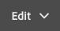

# Edición del contenido de una página{#editing-page-content}

Una vez creada la página (nueva o como parte de un lanzamiento o Live Copy), puede editar el contenido para realizar las actualizaciones que requiera.

El contenido se añade empleando los [componentes](/help/sites-authoring/default-components-console.md) (según el tipo de contenido) que pueden arrastrarse a la página. Después estos se pueden editar local, mover o eliminar.

>[!NOTE]
>
>Su cuenta necesita los [derechos de acceso apropiados](/help/sites-administering/security.md) y [permisos](/help/sites-administering/security.md#permissions) para editar páginas.
>
>Si encuentra algún problema, el Adobe le sugiere que se ponga en contacto con el administrador del sistema.

>[!NOTE]
>
>Si tu página, plantilla o ambas están configuradas correctamente, puedes usar un [diseño interactivo](/help/sites-authoring/responsive-layout.md) al editar.

>[!NOTE]
>
>En el modo de **edición** puede ver los vínculos en el contenido, pero no puede **acceder** a ellos. Utilice el [modo de vista previa](#previewingpagestouchoptimizedui) si desea navegar utilizando los vínculos del contenido.

## Barra de herramientas de página {#page-toolbar}

La barra de herramientas de página ofrece acceso a las funciones correspondientes, en función de la configuración de la página.

La barra de herramientas ofrece acceso a numerosas opciones. En función del contexto y la configuración actuales, puede que algunas opciones no estén disponibles.

* **Alternar panel lateral**

  Se abre o cierra el panel lateral, que contiene el [Explorador de recursos](/help/sites-authoring/author-environment-tools.md#assets-browser), el [Navegador de componentes](/help/sites-authoring/author-environment-tools.md#components-browser) y el [Árbol de contenido](/help/sites-authoring/author-environment-tools.md#content-tree).

  

* **Información de la página**

  Proporciona acceso al menú [Información de página](/help/sites-authoring/author-environment-tools.md#page-information), incluidos los detalles de página y las acciones que se pueden realizar en la página, como ver y editar información de página, ver propiedades de página y publicar y cancelar la publicación de la página.

  

* **Emulador**

  Activa o desactiva la [barra de herramientas del emulador](/help/sites-authoring/responsive-layout.md#selecting-a-device-to-emulate), que se utiliza para emular el aspecto de la página en otro dispositivo. Esto se activa automáticamente en el modo de diseño.

  

* **ContextHub**

  Abre [context hub](/help/sites-authoring/ch-previewing.md). Solo está disponible en el modo de vista previa.

  

* **Título de página**

  Es puramente informativo.

  

* **Selector de modo**

  Muestra el [modo](/help/sites-authoring/author-environment-tools.md#page-modes) actual y le permite seleccionar otro modo, como edición, diseño, deformación de tiempo o segmentación.

  

* **Vista previa**

  Habilita el [modo de previsualización](/help/sites-authoring/editing-content.md#preview-mode). Esto muestra la página tal como aparece cuando se publica.

  

* **Anotar**

  Le permite agregar [anotaciones](/help/sites-authoring/annotations.md) a la página al revisar una página. Después de la primera anotación, el icono cambia a un número que indica el número de anotaciones de la página.

  

### Notificación de estado {#status-notification}

Si una página es parte de uno o varios [flujos de trabajo](/help/sites-authoring/workflows.md), esta información se muestra en una barra de notificación situada en la parte superior de la pantalla cuando edita la página.

>[!NOTE]
>
>La barra de estado solo se puede ver para las cuentas de usuario con los privilegios adecuados.

La notificación enumera el flujo de trabajo que se ejecuta en la página. Si el usuario participa en el paso del flujo de trabajo actual, también dispondrá de opciones que [tengan efecto sobre el estado del flujo de trabajo](/help/sites-authoring/workflows-participating.md) y podrá obtener más información sobre el flujo de trabajo, como la siguiente:

* **Completar** - Abre el cuadro de diálogo **Completar elemento de trabajo**

* **Delegar** - Abre el cuadro de diálogo **Completar elemento de trabajo**

* **Ver detalles**: abre la ventana **Detalles** del flujo de trabajo.

Completar y delegar los pasos del flujo de trabajo mediante la barra de notificaciones funciona igual que cuando [participa en flujos de trabajo](/help/sites-authoring/workflows-participating.md) desde la bandeja de entrada de notificaciones.

Si la página está sujeta a varios flujos de trabajo, el número de los mismos se muestra en el extremo derecho de la notificación, junto con botones de flecha que permiten desplazarse por los flujos de trabajo.

## Marcador de posición de componente {#component-placeholder}

El marcador de posición de componente es un indicador para mostrar la posición del componente cuando lo coloque (sobre el componente por el que pasa el ratón en ese momento).

* Al añadir un componente a la página (arrastrando desde el explorador de componentes):

  

* Al mover un componente existente:

  

## Insertar un componente {#inserting-a-component}

### Inserción de un componente desde el navegador de componentes {#inserting-a-component-from-the-components-browser}

Puede agregar un componente mediante el [explorador de componentes](/help/sites-authoring/author-environment-tools.md#components-browser). El [marcador de posición de componente](#component-placeholder) le muestra dónde se coloca el componente:

1. Asegúrese de que la página se encuentra en el modo de [**edición**.](/help/sites-authoring/author-environment-tools.md#page-modes)
1. Abra el [navegador de componentes](/help/sites-authoring/author-environment-tools.md#components-browser).
1. Arrastre el componente en cuestión hasta la [posición deseada](#component-placeholder).

1. [Edite](#editmovecopypastedelete) el componente.

>[!NOTE]
>
>En un dispositivo móvil, el navegador de componentes ocupa toda la pantalla. Una vez que comience a arrastrar un componente, el explorador se cierra para mostrar de nuevo la página y así poder colocar el componente.

### Inserción de un componente desde el sistema de párrafos {#inserting-a-component-from-the-paragraph-system}

Puede agregar un componente mediante el cuadro **Arrastrar componentes aquí** del sistema de párrafos:

1. Asegúrese de que la página se encuentra en el modo de [**edición**.](/help/sites-authoring/author-environment-tools.md#page-modes)
1. Existen dos formas de seleccionar y agregar un componente desde el sistema de párrafos:

   * Seleccione la opción **Insertar componente** (+) de la barra de herramientas de un componente existente o del cuadro **Arrastrar componentes aquí**.

   

   * Si está en un dispositivo de escritorio, puede hacer doble clic en el cuadro **Arrastrar componentes aquí**.

   Se abre el cuadro de diálogo **Insertar nuevo componente** para que pueda seleccionar el componente requerido:

   

1. El componente seleccionado se añade en la parte inferior de la página. [Edite](#editmovecopypastedelete) el componente como sea necesario.

### Inserción de un componente mediante el navegador de recursos   {#inserting-a-component-using-the-assets-browser}

También puede agregar un componente a la página arrastrando un recurso desde el [explorador de recursos](/help/sites-authoring/author-environment-tools.md#assets-browser). Esto crea automáticamente un componente del tipo adecuado (y que contiene el recurso).

Esto es válido para los siguientes tipos de recursos (algunos dependen del sistema de páginas o párrafos):

<table>
 <tbody>
  <tr>
   <th><strong>Tipo de recurso</strong></th>
   <th><strong>Tipo de componente resultante</strong></th>
  </tr>
  <tr>
   <td>Imagen</td>
   <td>Imagen</td>
  </tr>
  <tr>
   <td>Documento</td>
   <td>Descargar</td>
  </tr>
  <tr>
   <td>Producto</td>
   <td>Producto</td>
  </tr>
  <tr>
   <td>Vídeo</td>
   <td>Flash</td>
  </tr>
  <tr>
   <td>Fragmento de contenido</td>
   <td>Fragmento de contenido   </td>
  </tr>
 </tbody>
</table>

>[!NOTE]
>
>Puede configurar este comportamiento en su instalación. Consulte [Configuración de un sistema de párrafos para que, al arrastrar un recurso, se cree una instancia de componente](/help/sites-developing/developing-components.md#configuring-a-paragraph-system-so-that-dragging-an-asset-creates-a-component-instance) para obtener más información.

Para crear un componente arrastrando uno de los tipos de activo anteriores:

1. Asegúrese de que la página se encuentra en el modo de [**edición**.](/help/sites-authoring/author-environment-tools.md#page-modes)
1. Abra el [explorador de recursos](/help/sites-authoring/author-environment-tools.md#assets-browser).
1. Arrastre el recurso en cuestión hasta la posición deseada. El [marcador de posición de componente](#component-placeholder) le muestra dónde está colocado el componente.

   Se crea en la posición requerida un componente apropiado para el tipo de recurso y que contiene el recurso seleccionado.

1. [Editar](#editmovecopypastedelete) el componente, si es necesario.

>[!NOTE]
>
>En un dispositivo móvil, el explorador de recursos rellena toda la pantalla. Cuando comienza a arrastrar un recurso, el explorador se cierra para mostrar de nuevo la página y poder colocarlo.

Al examinar los recursos, si descubre que debe realizar algún cambio rápido en alguno de ellos, haga clic en el icono de edición que aparece junto al nombre del recurso para iniciar [Editor de recursos](/help/assets/manage-assets.md).

## Editar/Configurar/Copiar/Cortar/Eliminar/Pegar {#edit-configure-copy-cut-delete-paste}

Al seleccionar un componente, se abre la barra de herramientas. Esto proporciona acceso a varias acciones que se pueden realizar en el componente.

Las acciones disponibles para el usuario se muestran según corresponda y es posible que no todas las acciones se describan aquí.

* **Editar**

  [En función del tipo de componente](/help/sites-authoring/default-components.md), esta opción le permite [editar el contenido del componente](#edit-content). A menudo se proporciona una barra de herramientas.

  

* **Configurar**

  [En función del tipo de componente](/help/sites-authoring/default-components.md), esto le permite editar y configurar las propiedades del componente. A menudo se abre un cuadro de diálogo.

  

* **Copiar**

  Esto copia el componente en el portapapeles. El componente original permanece después de pegarlo.

  

* **Cortar**

  Esto copia el componente en el portapapeles. Después de la acción de pegar, se quita el componente original.

  

* **Eliminar**

  Esto elimina el componente de la página con la confirmación.

  

* **Insertar componente**

  Esto abre el cuadro de diálogo para [agregar un componente](/help/sites-authoring/editing-content.md#inserting-a-component-from-the-paragraph-system).

  

* **Pegar**

  Esto pega el componente del portapapeles en la página. El hecho de que el original permanezca depende de si ha utilizado copiar o cortar.

   * Puede pegar componentes en la misma página o en otra distinta.
   * El elemento se pegará sobre el elemento en el que seleccione la acción de pegar.
   * La acción Pegar solo se muestra si hay contenido en el portapapeles.

  

  >[!NOTE]
  >
  >Si pega contenido en otra página que ya estaba abierta antes de la operación de cortar/pegar, debe actualizar la página para ver el contenido que se pegó.

* **Grupo**

  Esto permite seleccionar varios componentes a la vez. En un dispositivo de escritorio puede conseguir lo mismo haciendo **Control + clic** o **Comando + clic**.

  

* **Principal**

  Esto permite seleccionar el componente principal del componente seleccionado.

  

* **Diseño**

  Esto le permite modificar [el diseño](/help/sites-authoring/editing-content.md#edit-component-layout) del componente seleccionado. Esta opción se aplica únicamente al componente seleccionado y no activa el [modo de diseño](/help/sites-authoring/author-environment-tools.md#page-modes) para toda la página.

  

* **Convertir en una variación de fragmento de experiencia**

  Esto le permite crear un [Fragmento de experiencia](/help/sites-authoring/experience-fragments.md) a partir del componente seleccionado o agregarlo a un Fragmento de experiencia existente.

  

## Editar (contenido) {#edit-content}

Existen dos métodos para añadir o editar contenido en los componentes:

* Abra el [diálogo del componente para editarlo](#component-edit-dialog).
* [Arrastre y coloque un recurso](#draganddropintocomponent) desde el explorador de recursos para añadir contenido directamente.

### Cuadro de diálogo de edición de contenido   {#component-edit-dialog}

Puede abrir un componente para editar el contenido mediante el icono [Editar (lápiz) de la barra de herramientas](#edit-configure-copy-cut-delete-paste) del componente.

Las opciones de edición exactas dependen del componente. Para algunos componentes, [todas las acciones solo están disponibles en el modo de pantalla completa](#edit-content-full-screen-mode). Por ejemplo:

* [Componente de texto](/help/sites-authoring/rich-text-editor.md#main-pars-title-24)

  

* Componente de imagen

  

  >[!NOTE]
  >
  >La edición no funciona con un componente de imagen vacío.
  >
  >
  >[Arrastre o cargue una imagen (mediante Configurar)](/help/sites-authoring/default-components-foundation.md#image) para poder empezar a editarla.

* Componente de imagen: pantalla completa

  [La introducción del modo de pantalla completa](/help/sites-authoring/editing-content.md#edit-content-full-screen-mode) para el componente de imagen permite disponer de más espacio para editar la imagen y mostrar opciones de edición adicionales como **Iniciar mapa** y **Restablecer zoom**. Además, la pantalla completa permite seleccionar ajustes preestablecidos de recorte.

  

* Los componentes construidos a partir de más de un componente básico, como el [componente de base Texto e Imagen](/help/sites-authoring/default-components-foundation.md#text-image), primero le piden que confirme qué conjunto de opciones de edición desea utilizar:

  

### Arrastrar y colocar recursos en un componente {#drag-and-drop-assets-into-component}

Para tipos de componentes específicos puede arrastrar y soltar recursos desde el explorador de recursos directamente en el componente para actualizar el contenido:

| **Tipo de recurso** | **Tipo de componente** |
|---|---|
| Imagen | Imagen |
| Documento | Descargar |
| Producto | Producto |
| Vídeo | Flash |
| Fragmento de contenido | Fragmento de contenido |

## Editar (Contenido) Modo De Pantalla Completa {#edit-content-full-screen-mode}

Se puede acceder y salir del modo de pantalla completa de todos los componentes con la siguiente opción:

Por ejemplo, el componente **Texto**:

>[!NOTE]
>
>En algunos componentes, el modo de pantalla completa tiene más opciones disponibles que el editor local básico.

## Mover un componente {#moving-a-component}

Para mover un componente de párrafo:

1. Seleccione el párrafo que desea mover con las funciones de seleccionar y mantener pulsado o de mantener pulsado.
1. Arrastre el párrafo a la nueva ubicación. AEM indica dónde se puede depositar el párrafo. Colóquelo en la ubicación que desee.

   

1. Se mueve el párrafo.

>[!NOTE]
>
>También puede utilizar [Cortar y pegar](/help/sites-authoring/editing-content.md#edit-configure-copy-cut-delete-paste) para mover un componente.

## Editar diseño de componente {#edit-component-layout}

En lugar de cambiar repetidamente de la edición al [modo de diseño](/help/sites-authoring/responsive-layout.md) para ajustar un componente, puede seleccionar la acción **Diseño** para que un componente cambie el diseño de ese componente. Esto ahorra tiempo al no tener que salir del modo de edición.

1. En el modo **Editar** de la consola Sitios, al seleccionar un componente, se muestra la barra de herramientas del componente.

   

   Haga clic en la acción **Diseño** para que pueda ajustar el diseño del componente.

   

1. Una vez que se ha seleccionado la acción Diseño, haga lo siguiente:

   * Se muestran los controles de cambio de tamaño del componente.
   * La barra de herramientas del emulador aparece en la parte superior de la pantalla.
   * En la barra de herramientas del componente se muestran las acciones de diseño en vez de las acciones de edición normales.

   

   Ahora puede modificar el diseño del componente como haría en el [modo de diseño](/help/sites-authoring/responsive-layout.md#defining-layouts-layout-mode).

1. Después de realizar los cambios necesarios en el diseño, haga clic en **Cerrar** en el menú de acciones del componente para detener la modificación del diseño. La barra de herramientas del componente recuperará su estado de edición normal.

   

>[!NOTE]
>
>El ámbito de la acción Diseño se reduce al componente seleccionado. Por ejemplo, si está editando el diseño de un componente y, a continuación, selecciona otro componente, se mostrará la barra de herramientas de edición estándar del componente recién seleccionado (no la barra de herramientas de diseño). Los controladores de tamaño y la barra de herramientas del emulador desaparecen.
>
>Si debe editar el diseño general de la página y modificar varios componentes, cambie al [modo de diseño](/help/sites-authoring/responsive-layout.md).

## Componentes heredados {#inherited-components}

Los componentes heredados pueden ser el producto de distintos escenarios, como por ejemplo:

* [Administración de varios sitios](/help/sites-administering/msm.md)
* [Lanzamientos](/help/sites-authoring/launches.md) (cuando se basan en una Live Copy).
* Componentes específicos, como el sistema de párrafos heredados dentro de Geometrixx.

Puede cancelar (y volver a habilitar) la herencia. Según el componente, esto puede estar disponible en:

* **Live Copy**

  La barra de herramientas de componentes, si el componente se encuentra en una página que forma parte de una Live Copy o Launch (basado en una Live Copy). Por ejemplo:

  

  La opción Cancelar herencia está disponible:

  

  O bien, vuelva a habilitar la herencia si ya se ha cancelado:

  

  La acción Despliegue también está disponible en el modelo o en el origen de Live Copy:

  

* **Un Sistema De Párrafos Heredado**

  El cuadro de diálogo de configuración. Por ejemplo, como con el sistema de párrafos heredados:

  

## Edición de las plantilla de página {#editing-the-page-template}

Si la página se basa en una [plantilla editable](/help/sites-authoring/templates.md#editable-and-static-templates), puede cambiar fácilmente al [editor de plantillas](/help/sites-authoring/templates.md#editing-templates-template-authors) seleccionando **Editar plantilla** en el [menú Información de página](/help/sites-authoring/author-environment-tools.md#page-information).

Si la página se basa en una [plantilla estática](/help/sites-authoring/templates.md#editable-and-static-templates), puede cambiar a [modo de diseño](/help/sites-authoring/default-components-designmode.md) con el [selector de modo de página](/help/sites-authoring/author-environment-tools.md#page-modes) de la barra de herramientas para habilitar o deshabilitar los componentes y usarlos en la página.

Puede ver fácilmente en qué plantilla se basa la página al seleccionar la página en la vista [Columna](/help/sites-authoring/basic-handling.md#column-view) o en la [vista Lista](/help/sites-authoring/basic-handling.md#list-view).

## Estado de Live Copy   {#live-copy-status}

El [modo de la página de estado de Live Copy](/help/sites-authoring/author-environment-tools.md#page-modes) permite echar un vistazo rápido al estado de Live Copy y a los componentes que se han heredado o no.

* Borde verde: heredado
* Borde rosa: se cancela la herencia

Por ejemplo:

## Agregar anotaciones {#adding-annotations}

Las [anotaciones](/help/sites-authoring/annotations.md) permiten que los revisores y otros autores realicen comentarios sobre el contenido. A menudo se utilizan para la revisión y validación.

## Previsualizar páginas   {#previewing-pages}

Existen dos métodos para visualizar la vista previa de una página:

* [Modo de vista previa](#preview-mode): una vista previa rápida y en el sitio

* [Ver tal y como aparece publicado](#view-as-published): una vista previa completa que abre la página en una nueva pestaña

>[!NOTE]
>
>* Los vínculos del contenido se pueden ver, pero no se puede acceder a ellos en el modo de edición.
>* Utilice cualquiera de las opciones de vista previa si desea navegar mediante sus vínculos.
>* Utilice el [atajo de teclado](/help/sites-authoring/keyboard-shortcuts.md) `Ctrl-Shift-M` para cambiar entre la vista previa y el último modo seleccionado.
>

>[!NOTE]
>
>La cookie del modo WCM está establecida para ambas opciones.

### Modo de vista previa {#preview-mode}

Al editar contenido, puede obtener una vista previa de la página mediante el modo de vista previa [mode](/help/sites-authoring/author-environment-tools.md#page-modes). Este modo le permite hacer lo siguiente:

* Oculte los distintos mecanismos de edición para poder tener una vista rápida del aspecto de la página cuando se publique.
* Utilice los vínculos para desplazarse.
* No actualiza **no** el contenido de la página.

Durante la creación, el modo de vista previa está disponible mediante el icono situado en la parte superior derecha del editor de páginas:

### Ver como aparece publicado {#view-as-published}

La opción **Ver tal y como aparece publicado** está disponible en el menú [información de la página](/help/sites-authoring/author-environment-tools.md#page-information). Esto abre la página en una nueva pestaña, actualiza el contenido y muestra la página exactamente como aparece cuando se publica.

## Bloquear una página   {#locking-a-page}

AEM le permite bloquear páginas para que nadie más pueda modificar su contenido. Esto resulta útil cuando realiza varias ediciones en una página específica o cuando debe congelar una página durante un corto tiempo.

Las páginas se pueden bloquear desde:

* consola **Sitios**

   1. Seleccione la página con el [modo de selección](/help/sites-authoring/basic-handling.md#viewing-and-selecting-resources).
   1. Seleccione el icono de bloqueo.

  

* **Editor de página**

   1. Para abrir el menú, seleccione el icono **Información de la página**.
   1. Seleccione la opción **bloquear página**.

Una vez bloqueada, se actualiza la información de la vista de la consola y, al editar, se muestra un símbolo de bloqueo en la barra de herramientas.

>[!CAUTION]
>
>El bloqueo de páginas se puede realizar al [suplantar a un usuario](/help/sites-administering/security.md#impersonating-another-user). Sin embargo, una página bloqueada de este modo solo puede ser desbloqueada por el usuario que se ha suplantado o por el administrador.
>
>Las páginas no se pueden desbloquear al suplantar al usuario que ha bloqueado la página.

## Desbloquear una página {#unlocking-a-page}

Desbloquear una página es similar a [bloquear la página](#locking-a-page). Cuando la página está bloqueada, las opciones de bloqueo se sustituyen por las acciones de desbloqueo.

El menú Información de página muestra la opción **Desbloquear** y el icono Bloquear de la consola Sitios se reemplaza con el icono **Desbloquear**.

>[!CAUTION]
>
>El bloqueo de páginas se puede realizar al [suplantar a un usuario](/help/sites-administering/security.md#impersonating-another-user). Sin embargo, una página bloqueada de este modo solo puede ser desbloqueada por el usuario que se ha suplantado o por el administrador.
>
>Las páginas no se pueden desbloquear al suplantar al usuario que ha bloqueado la página.

## Deshacer y rehacer modificaciones de páginas {#undoing-and-redoing-page-edits}

Los iconos siguientes permiten deshacer o rehacer una acción. Se muestran en la barra de herramientas cuando corresponde:

>[!NOTE]
>
>También dispone del [atajo de teclado](/help/sites-authoring/page-authoring-keyboard-shortcuts.md) `Ctrl-Z` para deshacer las acciones de edición de página.
>
>También dispone del atajo de teclado `Ctrl-Y` para rehacer las acciones de edición de página.

>[!NOTE]
>
>Consulte [Deshacer y rehacer ediciones de página: la teoría](#undoing-and-redoing-page-edits-the-theory) para ver toda la información sobre las posibilidades de deshacer y rehacer ediciones de página.

## Deshacer y rehacer ediciones de página: la teoría {#undoing-and-redoing-page-edits-the-theory}

>[!NOTE]
>
>El administrador del sistema puede [configurar varios aspectos de las características Deshacer/Rehacer](/help/sites-administering/config-undo.md) según los requisitos de la instancia.

AEM Almacena un historial de las acciones que realiza y la secuencia en que las realizó. Esta funcionalidad significa que puede deshacer varias acciones en el orden en que las realizó y rehacerlas para volver a aplicar una o más acciones, si es necesario.

Si hay un elemento seleccionado en la página de contenido (por ejemplo, un componente de texto), el comando para deshacer o rehacer se aplica a dicho elemento.

El comportamiento de los comandos Deshacer y Rehacer es similar al de otros programas de software. Utilice los comandos para restaurar el estado reciente de la página web a medida que decide el contenido. Por ejemplo, si mueve un párrafo de texto a una ubicación diferente en la página, puede usar el comando Deshacer para mover el párrafo a la posición original. Si más tarde decide que la posición anterior era mejor, use el comando rehacer para “deshacer la acción”.

>[!NOTE]
>
>Puede hacer lo siguiente:
>
>* Rehacer acciones se usa siempre y cuando no haya realizado ninguna edición en la página desde que usó el comando Deshacer por última vez.
>* Deshacer un máximo de 20 acciones de edición (configuración predeterminada).
>* También utilice los [métodos abreviados del teclado](/help/sites-authoring/page-authoring-keyboard-shortcuts.md) para deshacer y rehacer.
>

Puede utilizar Deshacer y Rehacer para los siguientes tipos de cambios de página:

* Añadir, editar, quitar y mover párrafos
* Editar contenido de párrafos in-situ
* Copiar, cortar y pegar elementos en una página

Los campos de formulario que representan los componentes de formulario no están pensados para tener valores especificados durante la creación de páginas. Por lo tanto, los comandos Deshacer y Rehacer no afectan a los cambios realizados en los valores de esos tipos de componentes. Por ejemplo, no se puede deshacer la selección de un valor en una lista desplegable.

>[!NOTE]
>
>Se necesitan permisos especiales para deshacer y rehacer cambios en archivos e imágenes.

>[!NOTE]
>
>El historial de cambios en archivos e imágenes dura un mínimo de diez horas. Más allá de este tiempo, sin embargo, la inversión de los cambios no está garantizada. El administrador puede modificar el plazo predeterminado de diez horas.
