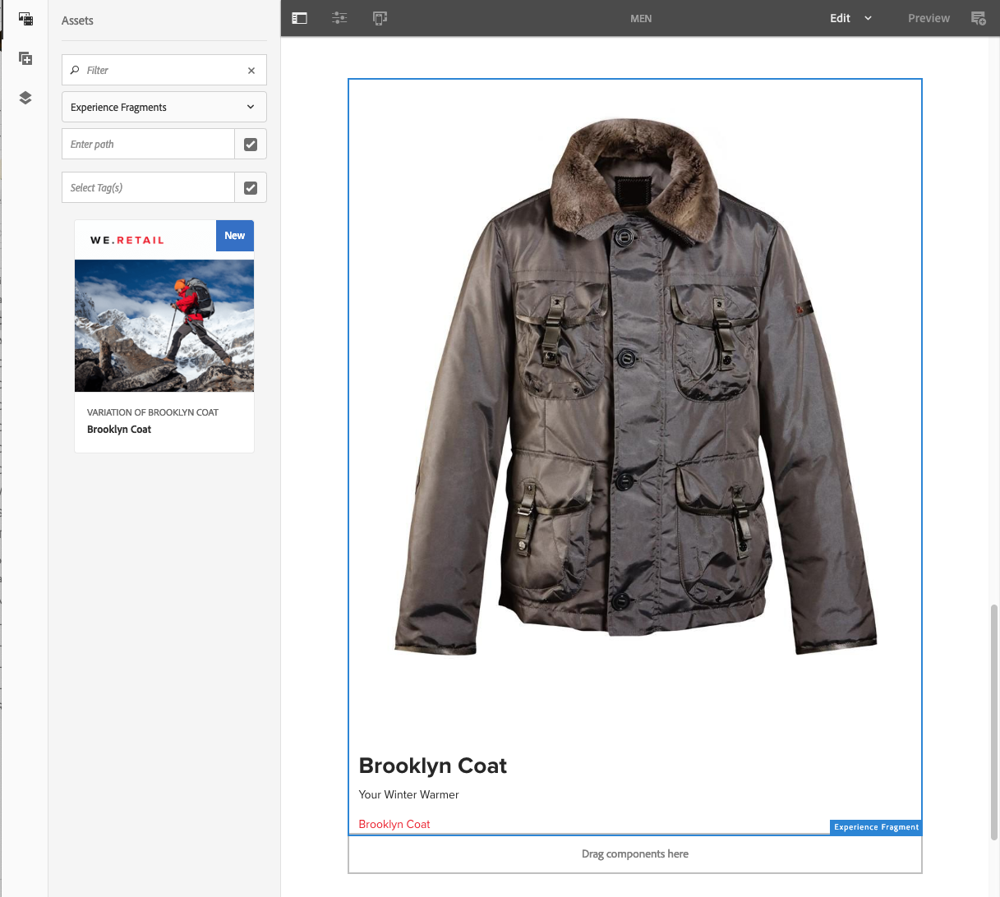

# Fragmentos de experiencias{#experience-fragments}

Un fragmento de experiencias es un grupo de uno o varios componentes que incluye contenido y diseño que se puede consultar dentro de las páginas. Estos pueden contener cualquier componente.

Un fragmento de experiencia:

* Forma parte de una experiencia (página).
* Se puede utilizar en varias páginas.
* Se basa en una plantilla (solo editable) para definir la estructura y los componentes.
* Se compone de uno o varios componentes, con diseño, en un sistema de párrafos.
* Puede contener otros fragmentos de experiencias.
* Se puede combinar con otros componentes (incluidos otros fragmentos de experiencias) para formar una página completa (experiencia).
* Puede tener diferentes variaciones y compartir el contenido o los componentes.
* Se puede desglosar en bloques de construcción que se pueden utilizar en varias variaciones del fragmento.

Puede utilizar los fragmentos de experiencias:

* Si un autor quiere volver a utilizar partes (el fragmento de una experiencia) de una página, debe copiar y pegar ese fragmento. Crear y mantener estas experiencias de copia y pegado es un proceso laborioso y es posible que el usuario cometa errores. Los fragmentos de experiencias eliminan la necesidad de copiar y pegar.
* Para admitir el caso práctico de CMS descentralizado. Los autores quieren utilizar AEM solo para la creación, pero no para la entrega al cliente. Un punto de contacto o sistema de terceros consumiría esa experiencia y luego la entregaría al usuario final.

>[!NOTE]
>
>La escritura de acceso para fragmentos de experiencias requiere que la cuenta de usuario se registre en el grupo:
>
>    `experience-fragments-editors`
Si tiene algún problema, póngase en contacto con el administrador del sistema.

## ¿Cuándo se deben utilizar los fragmentos de experiencias?   {#when-should-you-use-experience-fragments}

Los fragmentos de experiencias deben usarse en los siguientes casos:

* Cuando desee reutilizar experiencias.

   * Experiencias que se reutilizarán con un contenido igual o similar

* Cuando se utiliza AEM como plataforma de distribución de contenido de terceros.

   * Cualquier solución que desee utilizar AEM como plataforma de distribución de contenido
   * Incrustación de contenido en puntos de contacto de terceros

* Si tiene una experiencia con diferentes variaciones o representaciones.

   * Variaciones de canal o específicas de contexto
   * Experiencias que tiene sentido agrupar (por ejemplo, una campaña con distintas experiencias en diferentes canales)

* Al utilizar el comercio omnicanal.

   * Uso compartido de contenido relacionado con el comercio en canales de [redes sociales](/help/sites-developing/experience-fragments.md#social-variations) a escala
   * Convertir los puntos de contacto en transaccionales

## Organización de los fragmentos de experiencias {#organizing-your-experience-fragments}

Se recomienda:
* usar carpetas para organizar los fragmentos de experiencias,

* [configurar las plantillas permitidas en estas carpetas](#configure-allowed-templates-folder).

La creación de carpetas permite:

* crear una estructura significativa para los fragmentos de experiencias; por ejemplo, según la clasificación.

   >[!NOTE]
   No es necesario alinear la estructura de los fragmentos de experiencias con la estructura de página del sitio.

* [asignar las plantillas permitidas en el nivel de carpeta](#configure-allowed-templates-folder)

   >[!NOTE]
   Puede utilizar el [editor de plantillas](/help/sites-authoring/templates.md) para crear su propia plantilla.

El proyecto WKND estructura algunos fragmentos de experiencias según `Contributors`. La estructura utilizada también ilustra cómo se pueden utilizar otras funciones, como la Administración de varios sitios (incluidas las copias de idiomas).

Consulte:

`http://localhost:4502/aem/experience-fragments.html/content/experience-fragments/wknd/language-masters/en/contributors/kumar-selveraj/master`

## Creación y configuración de una carpeta para los fragmentos de experiencias {#creating-and-configuring-a-folder-for-your-experience-fragments}

Para crear y configurar una carpeta para los fragmentos de experiencias, se recomienda:

1. [Crear una carpeta](/help/sites-authoring/managing-pages.md#creating-a-new-folder).

1. [Configurar las plantillas de fragmento de experiencia permitidas para esa carpeta](#configure-allowed-templates-folder).

>[!NOTE]
También es posible configurar las plantillas [permitidas para su instancia](#configure-allowed-templates-instance), pero este método **no se recomienda**, ya que los valores se pueden sobrescribir tras la actualización.

### Configurar las plantillas permitidas para la carpeta {#configure-allowed-templates-folder}

>[!NOTE]
Este es el método recomendado para especificar las **plantillas permitidas**, ya que los valores no se sobrescriben tras la actualización.

1. Vaya a la carpeta de **fragmentos de experiencias** necesaria.

1. Seleccione la carpeta y, a continuación, vaya a **Propiedades**.

1. Especifique la expresión regular para recuperar las plantillas necesarias en el campo **Plantillas permitidas**.

   Por ejemplo:
   `/conf/(.*)/settings/wcm/templates/experience-fragment(.*)?`

   Consulte:
   `http://localhost:4502/mnt/overlay/cq/experience-fragments/content/experience-fragments/folderproperties.html/content/experience-fragments/wknd`

   

   >[!NOTE]
   Para obtener más información, consulte [Plantillas para fragmentos de experiencias](/help/sites-developing/experience-fragments.md#templates-for-experience-fragments).

1. Seleccione **Guardar y cerrar**.

### Configure las plantillas permitidas para la instancia {#configure-allowed-templates-instance}

>[!CAUTION]
No se recomienda cambiar las **plantillas permitidas** por este método, ya que las plantillas especificadas se pueden sobrescribir tras la actualización.
Utilice este cuadro de diálogo únicamente con fines informativos.

1. Vaya a la consola de **fragmentos de experiencias** indicada.

1. Seleccione las **opciones de configuración**:

   

1. Especifique las plantillas necesarias en el cuadro de diálogo **Configurar fragmentos de experiencias**:

   

   >[!NOTE]
   Para obtener más información, consulte [Plantillas para fragmentos de experiencias](/help/sites-developing/experience-fragments.md#templates-for-experience-fragments).

1. Seleccione **Guardar**.

## Creación de un fragmento de experiencia {#creating-an-experience-fragment}

Para crear un fragmento de experiencia:

1. Seleccione fragmentos de experiencias desde la navegación global.

   

1. Vaya a la carpeta indicada y seleccione **Crear**.

   

1. Seleccione **Fragmento de experiencia** para abrir el asistente **Crear fragmento de experiencia**.

   Seleccione la **plantilla** adecuada y, a continuación, **Siguiente**:

   

1. Introduzca las **propiedades** del **fragmento de experiencia**.

   Es obligatorio escribir un **título**. Si el **nombre** se deja en blanco, se derivará del **título**.

   

1. Haga clic en **Crear**.

   Se mostrará un mensaje. Seleccione:

   * **Listo** para volver a la consola

   * **Abrir** para abrir el editor de fragmentos

## Edición del fragmento de experiencia {#editing-your-experience-fragment}

El editor de fragmentos de experiencias ofrece funcionalidades similares a las del editor de páginas.

>[!NOTE]
Consulte [Edición del contenido de una página](/help/sites-authoring/editing-content.md) para obtener más información acerca de cómo utilizar el editor de páginas.

El siguiente procedimiento de ejemplo ilustra cómo crear un teaser para un producto:

1. Arrastre y suelte un **teaser** desde el [explorador de componentes](/help/sites-authoring/author-environment-tools.md#components-browser).

   

1. Seleccione **[Configurar](/help/sites-authoring/editing-content.md#edit-configure-copy-cut-delete-paste)** en la barra de herramientas del componente.
1. Agregue el **recurso** y defina las **propiedades** según sea necesario.
1. Confirme las definiciones con **Listo** (icono de marca de graduación).
1. Agregue más componentes según sea necesario.

## Creación de una variación de fragmento de experiencia {#creating-an-experience-fragment-variation}

Puede crear varias variaciones para este fragmento de experiencia en función de sus necesidades:

1. Abra la página para su [edición](/help/sites-authoring/experience-fragments.md#editing-your-experience-fragment).
1. Abra la pestaña **Variaciones**.

   

1. La opción **Crear** le permite crear:

   * **Variación**
   * **Variación como Live Copy**.

1. Defina las propiedades requeridas:

   * **Plantilla**
   * **Título**
   * **Nombre**; si se deja en blanco, se deriva del título
   * **Descripción**
   * **Etiquetas de variación**

   

1. Confirme con **Listo** (icono de marca de graduación) y la nueva variación se mostrará en el panel:

   

## Uso de los fragmentos de experiencias {#using-your-experience-fragment}

Ahora puede utilizar el fragmento de experiencia para crear páginas:

1. Abra cualquier página para su edición.

   Por ejemplo: [https://localhost:4502/editor.html/content/we-retail/language-masters/en/products/men.html](https://localhost:4502/editor.html/content/we-retail/language-masters/en/products/men.html)

1. Para crear una instancia del componente Fragmento de experiencias, arrastre el componente del explorador de componentes al sistema de párrafos de la página:

   

1. Agregue el fragmento de experiencia real a la instancia de componente; o bien:

   * Arrastre el fragmento necesario desde el explorador de activos y colóquelo en el componente
   * Seleccione **Configurar** en la barra de herramientas del componente y especifique el fragmento que quiere utilizar; confirme con **Listo** (marca de graduación)

   

   >[!NOTE]
   La opción Editar, en la barra de herramientas del componente, funciona como un método abreviado para abrir el fragmento en el editor de fragmentos.

## Componentes {#building-blocks}

Puede seleccionar uno o varios componentes para crear un bloque de creación y así reciclarlo en el fragmento:

### Crear un bloque de creación {#creating-a-building-block}

Para crear un nuevo bloque de creación:

1. En el editor de fragmentos de experiencias, seleccione los componentes que quiere reutilizar:

   

1. En la barra de herramientas de componentes, seleccione **Convertir en bloque de creación**:

   

1. Escriba el nombre del **bloque de creación** y confirme con **Convertir**:

   

1. El **bloque de creación** se mostrará en la pestaña y se podrá seleccionar en el sistema de párrafos:

   

#### Administración de un bloque de creación {#managing-a-building-block}

El bloque de creación se puede ver en la pestaña **Bloques de creación**. Para cada bloque, están disponibles las siguientes acciones:

* Ir a la variación principal: abrir la variación principal en una nueva pestaña
* Cambiar nombre
* Eliminar

#### Uso de un bloque de creación {#using-a-building-block}

Puede arrastrar el bloque de creación al sistema de párrafos de cualquier fragmento, como con cualquier componente.

## Detalles del fragmento de experiencia {#details-of-your-experience-fragment}

Se pueden ver los detalles del fragmento:

1. Los detalles se muestran en todas las vistas de la consola de **fragmentos de experiencias**, con una **vista de lista**[ que incluye los detalles de una exportación a destino](/help/sites-administering/experience-fragments-target.md):

   

1. Al abrir las **propiedades** del fragmento de experiencia:

   

   Las propiedades están disponibles en varias pestañas:

   >[!CAUTION]
   Estas pestañas se muestran al abrir **Propiedades** desde la consola fragmentos de experiencias.
   Si se selecciona **Abrir propiedades** al editar un fragmento de experiencia, se muestran las [propiedades de página](/help/sites-authoring/editing-page-properties.md) correspondientes.

   

   * **Básico**

      * **Título**: obligatorio

      * **Descripción**
      * **Etiquetas**
      * **Número total de variantes**: solo información

      * **Número de variantes web**: solo información
      * **Número de variantes que no son de web**:**solo información**

      * **Número de páginas que utilizan este fragmento**: solo información
   * **Cloud Services**

      * **Configuración de nube**
      * **Configuraciones de Cloud Service**
      * **ID de página de Facebook**
      * **Tablero de Pinterest**
   * **Referencias**

      * Una lista de referencias.
   * **Estado de medios sociales**

      * Detalles de las variaciones de las redes sociales.

## Representación HTML sin formato {#the-plain-html-rendition}

Uso del selector de `.plain.` en la URL; puede acceder a la representación HTML sin formato desde el explorador.

>[!NOTE]
Aunque esta opción está disponible directamente desde el explorador, [el objetivo principal es permitir a otras aplicaciones (por ejemplo, aplicaciones web de terceros o implementaciones móviles personalizadas) acceder al contenido del fragmento de experiencia directamente, únicamente mediante la URL](/help/sites-developing/experience-fragments.md#the-plain-html-rendition).

## Exportación de fragmentos de experiencias    {#exporting-experience-fragments}

De forma predeterminada, los fragmentos de experiencias se envían en formato HTML. Los canales de AEM y los canales similares de terceros pueden usar esta opción.

Para la exportación a Adobe Target, también se puede utilizar JSON. Consulte [Target Integration with Experience Fragments](/help/sites-administering/experience-fragments-target.md) (Integración de objetivos con fragmentos de experiencias) para obtener información completa.
