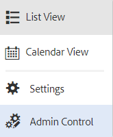

# Su bandeja de entrada{#your-inbox}

AEM Puede recibir notificaciones de varias áreas de la, incluidos flujos de trabajo y proyectos; por ejemplo, acerca de:

* Tareas:

   * AEM estas también se pueden crear en varios puntos de la interfaz de usuario de la interfaz de usuario de la aplicación, por ejemplo, en **Proyectos**,
   * pueden ser el producto de un flujo de trabajo **Crear tarea** o **Crear tarea del proyecto** paso.

* Flujos de trabajo:

   * elementos de trabajo que representan acciones que debe realizar en el contenido de la página;

      * estos son el producto del flujo de trabajo **Participante** pasos

   * elementos de error, para permitir que los administradores reintenten el paso con errores.

Estas notificaciones las recibe en su propia bandeja de entrada, donde puede verlas y realizar acciones.

>[!NOTE]
>
>AEM La configuración predeterminada viene precargada con tareas administrativas asignadas al grupo de usuarios del administrador. Consulte [Tareas administrativas listas para usar](#out-of-the-box-administrative-tasks) para obtener más información.

>[!NOTE]
>
>Para obtener más información sobre los tipos de elementos, consulte también:
>
>* [Proyectos](/help/sites-authoring/touch-ui-managing-projects.md)
>* [Proyectos: trabajo con tareas](/help/sites-authoring/task-content.md)
>* [Flujos de trabajo](/help/sites-authoring/workflows.md)
>* [Forms](/help/forms/using/introduction-aem-forms.md)
>

## Bandeja de entrada en el encabezado {#inbox-in-the-header}

Desde cualquiera de las consolas, en el encabezado se muestra el número actual de elementos de la bandeja de entrada. El indicador también se puede abrir para proporcionar acceso rápido a las páginas que requieren acciones o acceso a la bandeja de entrada:

>[!NOTE]
>
>Algunas acciones también se mostrarán en la [vista de tarjeta del recurso adecuado](/help/sites-authoring/basic-handling.md#card-view).

## Tareas administrativas listas para usar  {#out-of-the-box-administrative-tasks}

AEM La aplicación predeterminada viene precargada con cuatro tareas asignadas al grupo de usuarios del administrador.

* [Configurar Analytics y Targeting](/help/sites-administering/opt-in.md)
* [Aplicar la lista comprobación de seguridad de AEM](/help/sites-administering/security-checklist.md)
* Activar recopilación de estadísticas de uso agregadas
* [Configurar HTTPS](/help/sites-administering/ssl-by-default.md)

## Apertura de la bandeja de entrada    {#opening-the-inbox}

Para abrir la bandeja de entrada de notificaciones AEM:

1. Haga clic en el indicador de la barra de herramientas.

1. Seleccione **Ver todo**. El **AEM Bandeja de entrada de** abre. La bandeja de entrada muestra elementos de flujos de trabajo, proyectos y tareas.
1. La vista predeterminada es [Vista de lista](#inbox-list-view), pero también puede cambiar a [Vista de calendario](#inbox-calendar-view). Esto se realiza con el selector de vistas (barra de herramientas, arriba a la derecha).

   Para ambas vistas también puede definir lo siguiente [Configuración de vista](#inbox-view-settings); las opciones disponibles dependen de la vista actual.

   

>[!NOTE]
>
>La bandeja de entrada actúa como una consola, por lo que se aconseja utilizar [Navegación global](/help/sites-authoring/basic-handling.md#global-navigation) o [Buscar](/help/sites-authoring/search.md) para desplazarse a otra ubicación cuando haya terminado.

### Bandeja de entrada: vista de lista {#inbox-list-view}

Esta vista enumera todos los elementos, junto con información clave relevante:

### Bandeja de entrada: vista de calendario {#inbox-calendar-view}

Esta vista presenta los elementos según su posición en el calendario y la vista exacta que haya seleccionado:

Puede hacer lo siguiente:

* seleccionar una vista específica; **Cronología**, **Columna**, **Lista**

* especificar las tareas para mostrar según **Programación**; **Todo**, **Planificado**, **En curso**, **Vence pronto**, **Ya ha vencido**

* explorar en profundidad un elemento para obtener información más detallada
* seleccione un intervalo de fechas en el que centrar la vista:

### Bandeja de entrada - Configuración {#inbox-view-settings}

Para ambas vistas (Lista y Calendario) puede definir la siguiente configuración:

* **Vista de calendario**

  Para **Vista de calendario** puede configurar lo siguiente:

   * **Agrupar por**
   * **Programa** o **Ninguno**
   * **Tamaño de la tarjeta**

  

* **Vista de lista**

  Para **Vista de lista** puede configurar el mecanismo de ordenación:

   * **Campo de ordenación**
   * **Orden de clasificación**

  

### Bandeja de entrada - Control de administración {#inbox-admin-control}

La opción Admin Control permite a los administradores lo siguiente:

* AEM Personalizar las columnas de la bandeja de entrada

* Personalizar el texto y el logotipo del encabezado

* Controlar la visualización de los vínculos de navegación disponibles en el encabezado

La opción Control de administración solo está visible para los miembros del `administrators` o `workflow-administrators` grupo.

* **Personalización de columnas** AEM : personalice una bandeja de entrada de para cambiar el título predeterminado de una columna, reordenar la posición de una columna y mostrar columnas adicionales basadas en los datos de un flujo de trabajo.
   * **Agregar columna** AEM : seleccione una columna para añadirla a la bandeja de entrada de la.
   * **Editar columna**: Pase el ratón sobre el título de la columna y seleccione  para introducir un nombre para mostrar en la columna.
   * **Eliminar columna**: seleccione la  AEM para eliminar la columna de la bandeja de entrada de la.
   * **Mover columna**: arrastre el  AEM para mover una columna a una nueva posición en la bandeja de entrada de la bandeja de entrada de la.

  

* **Personalización de marca**

   * **Personalizar el texto del encabezado:** Especifique el texto que se mostrará en el encabezado para reemplazar el predeterminado **Adobe Experience Manager** texto.

   * **Personalizar logotipo:** Especifique la imagen que se mostrará en el encabezado como logotipo. Cargue una imagen en Digital Asset Management (DAM) y consulte esa imagen en el campo.

* **Navegación del usuario**
   * **Ocultar opciones de navegación:** Seleccione esta opción para ocultar las opciones de navegación disponibles en el encabezado. Las opciones de navegación incluyen vínculos a otras soluciones de, vínculos de ayuda y las opciones de creación disponibles al pulsar el logotipo o el texto de Adobe Experience Manager.
* **Guardar:** Haga clic en esta opción para guardar la configuración.

## Acción en un elemento {#taking-action-on-an-item}

>[!NOTE]
>
>Aunque es posible seleccionar más de un elemento, las acciones solo se pueden realizar en un elemento a la vez.

1. Para realizar una acción sobre un elemento, seleccione la miniatura correspondiente al elemento en cuestión. Los iconos de las acciones aplicables a ese elemento se muestran en la barra de herramientas:

   

   Las acciones son apropiadas para el elemento y entre ellas se incluyen:

   * **Completar** acción; por ejemplo, una tarea o un elemento de flujo de trabajo.
   * **Reasignar**/**Delegar** un elemento.
   * **Abrir** un elemento; en función del tipo de elemento, esta acción puede:

      * mostrar las propiedades del elemento
      * abra un tablero o un asistente apropiado para realizar más acciones
      * abrir documentación relacionada

   * **Retroceder un paso** a un paso anterior.
   * Consultar la carga útil de un flujo de trabajo.
   * Cree un proyecto a partir del elemento.

   >[!NOTE]
   >
   >Para obtener más información, consulte lo siguiente:
   >
   >* Elementos de flujo de trabajo: [Participación en flujos de trabajo](/help/sites-authoring/workflows-participating.md)

1. En función del elemento seleccionado, se inicia una acción; por ejemplo:

   * se abrirá un cuadro de diálogo apropiado para la acción.
   * se iniciará un asistente de acciones.
   * se abrirá una página de documentación.

   Por ejemplo, **Reasignar** abre un cuadro de diálogo:

   

   En función de si ha abierto un cuadro de diálogo, un asistente o una página de documentación, puede:

   * Confirme la acción adecuada; por ejemplo, Reasignar.
   * Cancele la acción.
   * Flecha hacia atrás; por ejemplo, si se ha abierto un asistente de acciones o una página de documentación, puede volver a la Bandeja de entrada.

## Creación de una tarea {#creating-a-task}

Desde la bandeja de entrada puede crear las siguientes tareas:

1. Seleccione **Crear** y a continuación, **Tarea**.
1. Rellene los campos necesarios en la **Básico** y **Avanzadas** pestañas; solo las pestañas **Título** es obligatorio, el resto son opcionales:

   * **Básico**:

      * **Título**
      * **Proyecto**
      * **Usuario asignado**
      * **Contenido**; similar a Carga útil, es una referencia de la tarea a una ubicación del repositorio
      * **Descripción**
      * **Prioridad de tareas**
      * **Fecha de inicio**
      * **Fecha de vencimiento**

   

   * **Avanzado**

      * **Nombre**: se utiliza para formar la dirección URL; si está en blanco, se basa en **Título**.

   

1. Seleccione **Enviar**.

## Creación de un proyecto    {#creating-a-project}

Para determinadas tareas, puede crear un [Proyecto](/help/sites-authoring/projects.md) basado en esa tarea:

1. Seleccione la tarea adecuada pulsando o haciendo clic en la miniatura.

   >[!NOTE]
   >
   >Para crear un proyecto, solo se pueden utilizar las tareas que se crearon con la opción **Crear** de la **bandeja de entrada**.
   >
   >Los elementos de trabajo (de un flujo de trabajo) no se pueden utilizar para crear un proyecto.

1. Seleccione **Crear proyecto** en la barra de herramientas para abrir el asistente.
1. Seleccione la plantilla apropiada y, a continuación, **Siguiente**.
1. Especifique las propiedades necesarias:

   * **Básico**

      * **Título**
      * **Descripción**
      * **Fecha de inicio**
      * **Fecha de vencimiento**
      * **Usuario** y función

   * **Avanzado**

      * **Nombre**

   >[!NOTE]
   >
   >Consulte [Creación de un proyecto](/help/sites-authoring/touch-ui-managing-projects.md#creating-a-project) para obtener información completa.

1. Seleccione **Crear** para confirmar la acción.

## Filtrado de elementos en la bandeja de entrada AEM    {#filtering-items-in-the-aem-inbox}

Puede filtrar los elementos enumerados:

1. Abra la **Bandeja de entrada AEM**.

1. Abra el selector de filtros:

   

1. Puede filtrar los elementos enumerados según un rango de criterios, muchos de los cuales se pueden refinar; por ejemplo:

   

   >[!NOTE]
   >
   >Con [Configuración de vista](#inbox-view-settings) también puede configurar el orden cuando se utiliza la [Vista de lista](#inbox-list-view).
