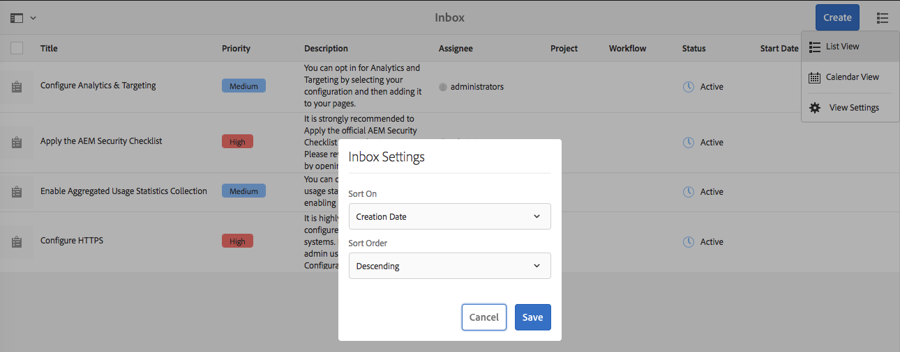

# Su bandeja de entrada{#your-inbox}

Puede recibir notificaciones desde varias áreas de AEM, incluidos flujos de trabajo y proyectos. Por ejemplo, acerca de:

* Tareas:

   * estas también se pueden crear en distintos puntos de la IU de AEM, por ejemplo, en **Proyectos**,
   * estas pueden ser el producto del paso **Crear tarea** o **Crear tarea del proyecto** de un flujo de trabajo.

* Flujos de trabajo:

   * elementos de trabajo que representan acciones que debe realizar en el contenido de la página;

      * estos pueden ser producto del paso **Participante** del flujo de trabajo
   * elementos con errores, que permiten a los administradores volver a intentar realizar un paso que ha fallado.

Estas notificaciones se reciben en su propia bandeja de entrada, donde podrá consultarlas y llevar a cabo las acciones correspondientes.

>[!NOTE]
>
>La versión de AEM lista para usar incluye tareas administrativas que se asignan al grupo de usuarios administradores. Consulte [Tareas administrativas de fábrica](#out-of-the-box-administrative-tasks) para obtener más detalles.

>[!NOTE]
>
>Para obtener más información sobre los tipos de elemento, consulte también:
>
>* [Proyectos](/help/sites-authoring/touch-ui-managing-projects.md)
>* [Proyectos: trabajando con tareas](/help/sites-authoring/task-content.md) 
>* [Flujos de trabajo](/help/sites-authoring/workflows.md)
>* [Formularios](/help/forms/home.md)
>

## Bandeja de entrada en el encabezado {#inbox-in-the-header}

Desde cualquiera de las consolas, en el encabezado se mostrará el número actual de elementos de su bandeja de entrada. También se puede abrir el indicador para acceder rápidamente a las páginas que requieran acciones o acceder a la bandeja de entrada:

>[!NOTE]
>
>Algunas acciones también se mostrarán en la [vista de tarjeta del recurso adecuado](/help/sites-authoring/basic-handling.md#card-view).

## Tareas administrativas de fábrica  {#out-of-the-box-administrative-tasks}

De fábrica, AEM incluye cuatro tareas asignadas al grupo de usuarios administradores.

* [Configuración de Analytics y Targeting](/help/sites-administering/opt-in.md)
* [Aplicación de la lista comprobación de seguridad de AEM](/help/sites-administering/security-checklist.md)
* Activar recopilación de estadísticas de uso agregadas
* [Configurar HTTPS](/help/sites-administering/ssl-by-default.md)

## Apertura de la bandeja de entrada {#opening-the-inbox}

Para abrir la bandeja de entrada de notificaciones AEM:

1. Toque o haga clic en el indicador de la barra de herramientas.

1. Seleccione **Ver todo**. Se abrirá la **bandeja de entrada AEM.** La bandeja de entrada muestra elementos de flujos de trabajo, proyectos y tareas.
1. La vista predeterminada es [Vista de lista](#inbox-list-view), pero también puede cambiar a [Vista de calendario](#inbox-calendar-view). Esto se lleva a cabo con el selector de vista (barra de herramientas, en la parte superior derecha).

   Para ambas vistas también puede definir una [Configuración de vista](#inbox-view-settings); las opciones disponibles dependen de la vista actual.

   

>[!NOTE]
>
>The Inbox operates as a console, so use [Global Navigation](/help/sites-authoring/basic-handling.md#global-navigation) or [Search](/help/sites-authoring/search.md) to navigate to another location when you are finished.

### Bandeja de entrada: Vista de lista {#inbox-list-view}

En esta vista se muestra una lista de todos los elementos, así como información relevante clave:

### Bandeja de entrada: Vista de calendario {#inbox-calendar-view}

En esta vista se presentan los elementos en función de su posición en el calendario y de la vista precisa que ha seleccionado:

Puede hacer lo siguiente:

* seleccionar una vista específica; **Cronograma**, **Columna**, **Lista**

* especificar las tareas para mostrar según **Programa****Todos**, **Planeado**, **En curso**, **Vence pronto**, **Ya ha vencido**

* desplazarse hacia abajo para obtener más información sobre un elemento
* seleccionar un intervalo de fechas en el que centrar la vista:

### Bandeja de entrada: Configuración de vista {#inbox-view-settings}

Puede definir la configuración para ambas vistas (lista y calendario):

* **Vista de calendario**

   Para **Vista de calendario** puede configurar:

   * **Agrupar por**
   * **Programa** o **Ninguno**
   * **Tamaño de la tarjeta**
   

* **Vista de lista**

   En **Vista de lista** puede configurar el mecanismo de ordenación:

   * **Ordenar en**
   * **Orden**
   

## Acción en un elemento {#taking-action-on-an-item}

1. Para realizar una acción en un elemento, seleccione la miniatura correspondiente al elemento en cuestión. En la barra de herramientas se mostrarán iconos para las acciones aplicables a dicho elemento:

   

   Las acciones son apropiadas para el elemento y entre ellas se incluyen:

   * Acción **Completar**; por ejemplo, una tarea o un elemento del flujo de trabajo.
   * **Reasignar**/**Delegar** un elemento.
   * **Abrir** un elemento; en función del tipo de elemento, esta acción puede:

      * mostrar las propiedades del elemento
      * abrir un tablero o un asistente apropiado para llevar a cabo acciones adicionales
      * abrir documentación relacionada
   * **Retroceder** a una etapa anterior.
   * Consultar la carga útil de un flujo de trabajo.
   * Crear un proyecto a partir de un elemento.
   >[!NOTE]
   >
   >Para obtener más información, consulte:
   >
   >* Elementos del flujo de trabajo - [Participación en flujos de trabajo](/help/sites-authoring/workflows-participating.md)

1. Dependiendo del elemento seleccionado, se iniciará una acción; por ejemplo:

   * se abrirá un cuadro de diálogo apropiado para la acción.
   * se iniciará un asistente de acciones.
   * se abrirá una página de documentación.
   Por ejemplo, la opción **Reasignar** abrirá el siguiente cuadro de diálogo:

   

   En función de si ha abierto un cuadro de diálogo, un asistente o una página de documentación, podrá:

   * Confirmar la acción adecuada; por ejemplo, Reasignar.
   * Cancelar la acción.
   * Flecha hacia atrás; por ejemplo, si ha abierto un asistente de acciones o una página de documentación, podrá regresar a la bandeja de entrada.

## Creación de una tarea {#creating-a-task}

Desde la bandeja de entrada, puede crear tareas:

1. Seleccione **Crear** y, a continuación, **Tarea**.
1. Complete los campos necesarios en las fichas **Básico** y **Avanzado**; el único campo obligatorio es **Título**, el resto son opcionales:

   * **Básico**:

      * **Título**
      * **Proyecto**
      * **Usuario asignado**
      * **Contenido**; similar a Carga útil, es una referencia de la tarea a una ubicación del repositorio
      * **Descripción**
      * **Prioridad de tareas**
      * **Fecha de inicio**
      * **Fecha de vencimiento**
   

   * **Avanzado**

      * **Nombre:** este se usará para formar la dirección URL; si este está en blanco, se basará en el **Título**.
   

1. Seleccione **Enviar**.

## Creación de un proyecto {#creating-a-project}

Para determinadas tareas, puede crear un [proyecto](/help/sites-authoring/projects.md) basado en dicha tarea:

1. Seleccione la tarea adecuada haciendo clic/tocando la miniatura correspondiente.

   >[!NOTE]
   >
   >Only tasks created using the **Create** option of the **Inbox** can be used to create a project.
   >
   >Los elementos de trabajo (de un flujo de trabajo) no se puede utilizar para crear un proyecto.

1. Seleccione **Crear proyecto** en la barra de herramientas para abrir el asistente.
1. Seleccione la plantilla adecuada y, a continuación, **Siguiente**.
1. Especifique las propiedades requeridas:

   * **Básico**

      * **Título**
      * **Descripción**
      * **Fecha de inicio**
      * **Fecha de vencimiento**
      * **Usuario** y función
   * **Avanzado**

      * **Nombre**
   >[!NOTE]
   >
   >Consulte [Creación de un proyecto](/help/sites-authoring/touch-ui-managing-projects.md#creating-a-project) para obtener toda la información.

1. Seleccione **Crear** para confirmar la acción.

## Filtrado de elementos en la bandeja de entrada AEM {#filtering-items-in-the-aem-inbox}

Puede filtrar los elementos enumerados:

1. Abra la **Bandeja de entrada AEM**.

1. Abra el selector de filtros:

   

1. Puede filtrar los elementos enumerados según un rango de los criterios, muchos de los cuales se pueden refinar; por ejemplo:

   

   >[!NOTE]
   >
   >Con [Configuración de vista](#inbox-view-settings) también puede configurar el orden cuando se utiliza la [Vista de lista](#inbox-list-view).

