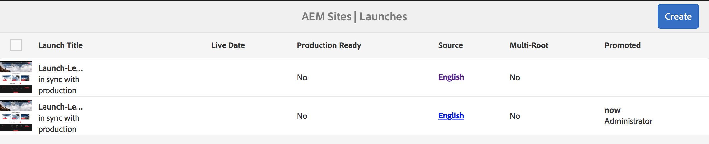

# Promoción de lanzamientos{#promoting-launches}

Debe promocionar las páginas de lanzamiento para devolver el contenido al origen (producción) antes de publicarlo. Cuando se promociona una página de lanzamiento, la página correspondiente de las páginas de origen se reemplaza con el contenido de la página promocionada. Las siguientes opciones están disponibles para promocionar una página de lanzamiento:

* Promocionar solo la página actual o todo el lanzamiento.
* Promocionar las páginas secundarias de la página actual.
* Promocionar el lanzamiento completo o solo las páginas que han cambiado.
* Si se elimina el lanzamiento después de promocionarlo.

>[!NOTE]
>
>Tras promocionar las páginas de lanzamiento al destino (**producción**), puede activar las páginas de **producción** como entidad (para que el proceso sea más rápido). Añada las páginas a un paquete de workflow y úselo como carga útil para un workflow que active un paquete de páginas. Debe crear el paquete de workflow antes de promocionar el lanzamiento. Consulte [Procesamiento de páginas promocionadas mediante AEM Workflow](#processing-promoted-pages-using-aem-workflow).

>[!CAUTION]
>
>Un solo lanzamiento no se puede promocionar de forma simultánea. Esto significa que dos acciones de promoción en el mismo lanzamiento al mismo tiempo pueden resultar en un error - `Launch could not be promoted` (junto con errores de conflicto en el registro).

>[!CAUTION]
>
>Cuando se promocionan los lanzamientos de las páginas *modificadas*, se tienen en cuenta las modificaciones en las ramas de lanzamiento y origen.

## Promocionar páginas de lanzamiento {#promoting-launch-pages}

>[!NOTE]
>
>Esta sección trata sobre la operación manual de promocionar las páginas de lanzamiento cuando solo hay un nivel de lanzamiento. Consulte:
>
>* [Promover un lanzamiento anidado](#promoting-a-nested-launch) cuando haya más de un lanzamiento en la estructura.
>* [Lanzamientos: el orden de los eventos](/help/sites-authoring/launches.md#launches-the-order-of-events) para obtener más información sobre la promoción y la publicación automáticas.

>

Puede promocionar los lanzamientos desde la consola **Sitios** o la consola **Lanzamientos**:

1. Abra:

   * la consola **Sitios**:

      1. Abra el [carril de referencias](/help/sites-authoring/author-environment-tools.md#showingpagereferences) y seleccione la página de origen requerida utilizando [modo de selección](/help/sites-authoring/basic-handling.md) (o seleccione y abra el carril de referencias, el orden no es importante). Todas las referencias se mostrarán.

      1. Seleccione **Lanzamientos** (por ejemplo, Lanzamientos [1]) para mostrar una lista de los lanzamientos específicos.
      1. Seleccione el lanzamiento específico para mostrar las acciones disponibles.
      1. Seleccione **Promocionar lanzamiento** para abrir el asistente.
   * la consola **Lanzamientos**:

      1. Seleccione su lanzamiento (toque o haga clic en la miniatura).
      1. Seleccione **Promocionar**.

1. En el primer paso, puede especificar:

   * **Destino**

      * **Eliminar el lanzamiento después de la promoción**
   * **Ámbito**

      * **Promocionar lanzamiento completo**
      * **Promocionar las páginas modificadas**
      * **Promocionar página actual**
      * **Promocionar la página actual y sus páginas secundarias**

   Por ejemplo, al seleccionar para promocionar solo las páginas modificadas:

   

   >[!NOTE]
   >
   >Esto abarca un lanzamiento único, si ha anidado lanzamientos consulte [Promocionar un lanzamiento anidado](#promoting-a-nested-launch).

1. Seleccione **Siguiente** para continuar.
1. Puede revisar las páginas que se promocionarán, que dependerán del intervalo de páginas que haya elegido:

   

1. Seleccione **Promocionar**.

## Promocionar las páginas de lanzamiento al editar {#promoting-launch-pages-when-editing}

Cuando está editando una página de lanzamiento, la acción **Promocionar lanzamiento** también está disponible en **Información de la página**. Esta acción abrirá el asistente para recopilar la información necesaria.

>[!NOTE]
>
>Esto se encuentra disponible para los [lanzamientos anidados](#promoting-a-nested-launch) y únicos.

## Promocionar un lanzamiento anidado  {#promoting-a-nested-launch}

Después de crear un lanzamiento anidado, puede promocionarlo a cualquiera de los orígenes, incluido el origen raíz (producción).

1. Al igual que con [Crear un lanzamiento anidado](#creatinganestedlaunchlaunchwithinalaunch), localice y seleccione el lanzamiento requerido en la consola **Lanzamientos** o en el raíl de **referencias**.
1. Seleccione **Promocionar lanzamiento** para abrir el asistente.

1. Introduzca la información necesaria:

   * **Destino**

      * **Destino promocional**: puede promocionar a cualquiera de los orígenes.

      * **Eliminar el lanzamiento después de la promoción** Después de la promoción, se eliminará el lanzamiento seleccionado y los lanzamientos anidados en él.
   * **Ámbito**: aquí puede seleccionar si debe promocionar el lanzamiento completo o solo las páginas que realmente se han editado. En este último caso, puede seleccionar incluir/excluir páginas secundarias. La configuración predeterminada es promocionar solo los cambios de página para la página actual:

      * **Promocionar lanzamiento completo**
      * **Promocionar las páginas modificadas**
      * **Promocionar página actual**
      * **Promocionar la página actual y sus páginas secundarias**

   

1. Seleccione **Siguiente**.
1. Revise los detalles de la promoción antes de seleccionar **Promocionar**:

   

   >[!NOTE]
   >
   >Las páginas que se muestran dependerán del **ámbito** que haya definido y, posiblemente, de las páginas que realmente se han editado.

1. Los cambios se promocionarán y reflejarán en la consola **Lanzamientos**:

   

## Procesamiento de páginas promocionadas mediante el flujo de trabajo de AEM {#processing-promoted-pages-using-aem-workflow}

Utilice modelos de flujo de trabajo para realizar procesamientos masivos de páginas de lanzamiento promocionadas:

1. Cree un paquete de flujo de trabajo.
1. Cuando los creadores promocionan páginas de lanzamiento, las guardan en el paquete de flujo de trabajo.
1. Inicie un modelo de flujo de trabajo con el paquete como carga útil.

Para iniciar un flujo de trabajo automáticamente cuando se promocionen páginas, [configure un lanzador de flujos de trabajo](/help/sites-administering/workflows-starting.md#workflows-launchers) para el nodo del paquete.

Por ejemplo, puede generar solicitudes de activación de páginas automáticamente cuando los creadores promocionan páginas de lanzamiento. Configure un lanzador de flujo de trabajo para iniciar el flujo de trabajo de activación de solicitud cuando se modifique el nodo de paquete.

