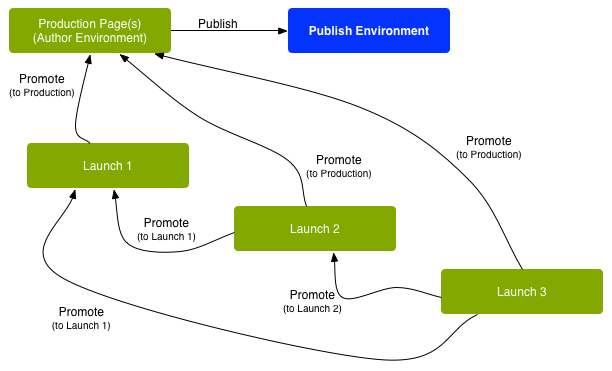

# Lanzamientos{#launches}

Los lanzamientos le permiten desarrollar con eficacia contenido para una versión futura. 

Un lanzamiento se crea para permitir que se realicen cambios preparados para una publicación futura (a la vez que se mantienen las páginas actuales). Después de editar y actualizar las páginas de lanzamiento, estas se vuelven a promocionar al origen y luego se activan las páginas de origen (nivel superior). La promoción duplica el contenido del lanzamiento en las páginas de origen y se puede realizar de forma manual o automática (según los campos establecidos a la hora de crear y editar el lanzamiento).

Por ejemplo, las páginas de productos de temporada de un almacén en línea se actualizan cada trimestre para que los productos mostrados coincidan con la temporada correspondiente. Para preparar la próxima actualización trimestral, se puede crear un lanzamiento de las páginas web correspondientes. Durante el trimestre, se acumulan los cambios siguientes en la copia de lanzamiento:

* Cambios en las páginas de origen que se producen como resultado de tareas de mantenimiento normales. Estos cambios se duplican automáticamente en las páginas de lanzamiento.
* Ediciones que se realizan en las páginas de lanzamiento directamente en preparación para el trimestre siguiente.

Cuando llegue el trimestre siguiente, las páginas de lanzamiento se promocionan de forma que se puedan publicar las páginas de origen (que contienen el contenido actualizado). Puede promocionar todas las páginas o solamente aquellas que se han modificado. 

También se puede realizar lo siguiente:

* Crear lanzamientos para varias ramas de raíz. Si bien puede crear el lanzamiento para todo el sitio (y realizar los cambios allí), este método es poco práctico, ya que es necesario copiar todo el sitio. Cuando se trata de cientos o incluso miles de páginas, los requisitos del sistema y el rendimiento de este se ven afectados tanto por la acción de copia como por las comparaciones posteriores necesarias para las tareas de promoción.
* Crear lanzamientos anidados (un lanzamiento dentro de otro lanzamiento). Esto permite crear un lanzamiento a partir de un lanzamiento existente, de modo que los autores puedan aprovechar los cambios ya realizados, en lugar de tener que realizar los mismos cambios varias veces para cada lanzamiento.

En esta sección se describe cómo crear, editar y promocionar (y, si fuera necesario[ eliminar](/help/sites-authoring/launches-creating.md#deleting-a-launch)) páginas de lanzamiento dentro de la consola Sitios o la [consola Lanzamientos](#the-launches-console):

* [Creación de lanzamientos](/help/sites-authoring/launches-creating.md)
* [Edición de lanzamientos](/help/sites-authoring/launches-editing.md)
* [Promoción de lanzamientos](/help/sites-authoring/launches-promoting.md) 

## Lanzamientos: orden de eventos {#launches-the-order-of-events}

Los lanzamientos permiten desarrollar contenido con eficacia para una versión futura de una o más páginas web activadas.

Los lanzamientos permiten realizar lo siguiente:

* Cree una copia de las páginas de origen:

   * La copia es su lanzamiento.
   * Las páginas de origen de nivel superior se denominan **Producción**.

      * Las páginas de origen puedan obtenerse de varias ramas (separadas).

   

* Edite la configuración de lanzamiento:

   * Adición o eliminación de páginas o ramas en el lanzamiento.
   * Editar propiedades de lanzamiento; como **Título**, **Fecha de lanzamiento** e indicador **Listo para la producción**.

* Es posible promocionar y publicar el contenido de forma manual o automática:

   * Manualmente:

      * Promocione de nuevo el contenido del lanzamiento en el **Destino** (páginas de origen) cuando esté listo para su publicación.
      * Publique el contenido de las páginas de origen (tras volver a promocionarlo).
      * Promocione todas las páginas o solamente las páginas modificadas.
   * Automáticamente. Esto implica lo siguiente:

      * El campo **Fecha**(**Live**) **de lanzamiento**: esto se puede establecer al crear o editar un lanzamiento. 

      * El indicador **Producción lista**: esto solo se puede establecer al editar un lanzamiento.
      * Si se establece el indicador **Producción lista**, el lanzamiento se promocionará automáticamente a las páginas de producción según el valor del campo **Fecha**(**Live**) **de lanzamiento**. Después de la promoción, las páginas de producción se publican automáticamente.\
         Si no se ha establecido ninguna fecha, el indicador no tiene ningún efecto.

* Actualice las páginas de origen y de lanzamiento en paralelo:

   * Los cambios que se realicen en las páginas de origen se implementan automáticamente en la copia de lanzamiento (si está configurada con herencia; es decir, como Live Copy). 
   * Los cambios en la copia de lanzamiento se pueden realizar sin interrumpir las actualizaciones automáticas o las páginas de origen. 

   

* [Crear un lanzamiento anidado](/help/sites-authoring/launches-creating.md#creating-a-nested-launch): lanzamiento dentro de un lanzamiento.

   * El origen es un lanzamiento existente.
   * Puede [promocionar un lanzamiento anidado](/help/sites-authoring/launches-promoting.md#promoting-a-nested-launch) a cualquier destino; esto puede ser un lanzamiento principal o bien las páginas de origen de nivel superior (producción).

   

   >[!CAUTION]
   >
   >Al eliminar un lanzamiento, se quitarán el lanzamiento en sí y todos los lanzamientos anidados descendentes.

>[!NOTE]
>
>La creación y edición de lanzamientos requiere derechos de acceso a `/content/launches`, como con el grupo predeterminado `content-authors`.
>
>Si experimenta algún problema, póngase en contacto con el administrador del sistema. 

>[!CAUTION]
>
>No se admite la reordenación de componentes en una página de Launch.
>
>Cuando se promocione la página, se reflejarán los cambios de contenido, pero las posiciones de los componentes no cambiarán.

### Consola Lanzamientos {#the-launches-console}

En la consola Lanzamientos se proporciona información general sobre los lanzamientos. La consola se puede utilizar para tomar medidas sobre los lanzamiento indicados. Se puede acceder a la consola desde: 

* La consola **Herramientas**: **Herramientas**, **Sitios** **Lanzamientos**.

* O directamente con [https://localhost:4502/libs/launches/content/launches.html](https://localhost:4502/libs/launches/content/launches.html)

## Lanzamientos en las referencias (consola Sitios) {#launches-in-references-sites-console}

1. En la consola **Sitios**, vaya al origen de los lanzamientos.
1. Abra el carril **Referencias** y seleccione la página de origen.
1. Seleccione **Lanzamientos**. Se mostrarán los lanzamientos existentes:

   

1. Pulse o haga clic en el lanzamiento adecuado. Se mostrará una lista de acciones posibles:

   
