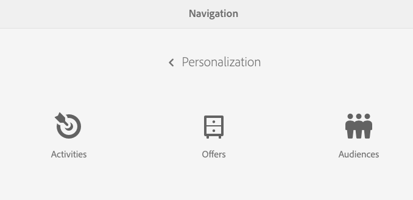

# Administrar audiencias{#managing-audiences}

La consola de audiencias permite crear, organizar y administrar las audiencias de la cuenta de Adobe Target o administrar segmentos de ContextHub o Client Context:

* Añadir audiencias: audiencias de Adobe Target o segmentos de ContextHub.
* Administre audiencias.

An Audience, called *segment* in ContextHub and Client Context, is a class of visitors defined by specific criteria, which then determines who sees a targeted activity. Al segmentar una actividad, puede seleccionar la audiencia directamente en el proceso de segmentación o crear una nueva en la consola de audiencias.

En la consola de audiencias, las audiencias se organizan según la marca.

Audiences are available in Targeting mode for [authoring targeted content](/help/sites-authoring/content-targeting-touch.md), where you can also create audiences (but you need to create Adobe Target audiences in the Audiences console). Las audiencias creadas en el modo Segmentación aparecen en la consola de audiencias.

Las audiencias se muestran con una etiqueta que describe qué tipo de audiencia está definida:

* CH: segmento de ContextHub
* CC: segmento del contexto del cliente
* AT: audiencia de Adobe Target

## Crear un segmento de ContextHub en la consola de audiencias {#creating-a-contexthub-segment-in-the-audiences-console}

Puede crear un segmento de ContextHub en la consola de audiencias o durante el proceso de segmentación.

Para crear un segmento de ContextHub en la consola de audiencias:

1. En la consola de navegación, haga clic o pulse **Personalización**. Click or tap **Audiences**.
1. Haga clic o pulse **Crear segmento de ContextHub**.

   

1. En cuadro de diálogo **Nuevo segmento de ContextHub**, introduzca un título, ajuste el aumento y haga clic en **Crear**. El nuevo segmento de ContextHub aparece en la lista de audiencias.

   >[!NOTE]
   >
   >You can sort the modified list by tapping or clicking **Modified** to sort by descending order to see any newly created audiences.

Para obtener más información sobre cómo crear segmentos con ContextHub, consulte la documentación de [Configurar la segmentación con ContextHub](/help/sites-administering/segmentation.md).

## Crear una audiencia de Adobe Target mediante la consola de audiencias {#creating-an-adobe-target-audience-using-the-audience-console}

Puede crear audiencias de Adobe Target directamente en AEM mediante la consola de audiencias.

Las audiencias se definen mediante reglas que determinan quién se incluye o excluye de una actividad de destino. Una definición de audiencia puede incluir varias reglas y cada regla puede incluir varios parámetros.

Al utilizar más de una regla, estas reglas se combinan según el operador booleano Y (AND), lo que significa que cualquier posible miembro de la audiencia debe cumplir todas las condiciones que se detallaron para ser incluido en la actividad. Por ejemplo, si define una regla de sistema operativo Y (AND) una regla de explorador, solo se incluyen en la actividad los visitantes que usan el sistema operativo definido Y (AND) el explorador definido.

>[!NOTE]
>
>If you do not see **Create Target Audience **in the **Create** menu, you do not have the necessary permissions to create an audience. You need write permissions under **/etc/segmentation** to be able to create audiences. El grupo de contenido-autores tiene permisos de escritura de forma predeterminada.

Para crear una audiencia de Adobe Target:

1. En la consola de navegación, haga clic o pulse **Personalización**. Click or tap **Audiences**.

   

1. In the Audiences console, tap or click **Create** and then** Create Target Audience**.

   

1. En el cuadro de diálogo **Configuración de Adobe Target**, seleccione la configuración de destino y haga clic o pulse **Aceptar**.
1. En el área de la Regla n.º 1, haga clic o pulse el tipo de atributo e introduzca la información de atributo en los campos que están disponibles. Cuando termine, seleccione la marca de verificación situada a la derecha del atributo para guardarlo. Consulte [Atributos y sus opciones](#attributes-and-their-options) para obtener más información acerca de todos los atributos.
1. Haga clic en **Añadir regla** para añadir otra regla. Especifique tantas reglas como necesite. Las reglas se combinan con el operador booleano Y (AND), lo cual significa que la audiencia debe cumplir todos los requisitos de cada regla para poder realizar una actividad.
1. Haga clic o pulse **Siguiente**.
1. Especifique un nombre para la audiencia y haga clic o pulse **Guardar**.
1. Tap or click **Save**. La audiencia se enumera en la lista de audiencias.

### Atributos y sus opciones {#attributes-and-their-options}

Puede crear reglas de segmentación para cada uno de los atributos siguientes:

| **Atributo** | **Descripción** | **Para obtener más información** |
|---|---|---|
| **Móvil** | Establezca como objetivo los dispositivos móviles en función de parámetros como dispositivo móvil, tipo de dispositivo, proveedor de dispositivos, dimensiones de pantalla (en píxeles) y más. | Consulte la documentación [de](https://marketing.adobe.com/resources/help/en_US/target/target/c_mobile.html) Mobile en Adobe Target. |
| **Personalizado** | Los parámetros personalizados son parámetros de mbox. Si pasa algún parámetro mbox a mboxes, o usa la función targetPageParams, ese parámetro aparece aquí para su uso en audiencias. | Consulte la documentación [Parámetros](https://marketing.adobe.com/resources/help/en_US/target/target/c_custom_parameters.html) personalizados en Adobe Target. |
| **SO** | Puede dirigirse a visitantes que utilicen un determinado sistema operativo. | Usuarios de Target que usen Linux, Macintosh o Windows. |
| **Páginas del sitio** | Diríjase a visitantes que estén en una página específica o que tengan un parámetro de mbox específico. | Consulte la documentación [Páginas](https://marketing.adobe.com/resources/help/en_US/target/target/c_site_pages.html) del sitio en Adobe Target. |
| **Explorador** | Puede dirigirse a usuarios que utilicen un navegador específico o opciones específicas del navegador cuando visiten la página. | Consulte la documentación [sobre las opciones del explorador en](https://marketing.adobe.com/resources/help/en_US/target/target/c_browser_options.html)Adobe Target. |
| **Perfil del visitante** | Diríjase a visitantes que cumplan parámetros de perfil específicos. | Consulte la documentación [de perfil del](https://marketing.adobe.com/resources/help/en_US/target/target/c_visitor_profile.html) visitante en Adobe Target. |
| **Fuentes de tráfico** | Establezca como objetivo a los visitantes en función del motor de búsqueda o de la página de aterrizaje que los lleve a su sitio. | Consulte la documentación [de fuentes de](https://marketing.adobe.com/resources/help/en_US/target/target/c_traffic_sources.html) tráfico en Adobe Target. |

## Modificar una audiencia en la consola de audiencias {#modifying-an-audience-in-the-audiences-console}

>[!NOTE]
>
>Solo puede editar las audiencias de Adobe Target que se crearon en la misma instancia de AEM en la cual realizó las modificaciones. Las audiencias de destino que se crearon en diferentes entornos de AEM no se pueden editar.

Puede editar cualquier audiencia de ContextHub o Client Context desde la consola de audiencias. Asimismo, también puede editar audiencias de Adobe Target, pero solo aquellos que se hayan creado en AEM:

1. En la consola de navegación, haga clic o pulse **Personalización**. Click or tap **Audiences**.
1. Haga clic o pulse el icono que está al lado del segmento de ContextHub o Client Context que desea editar, y haga clic o pulse **Editar**.
1. Haga los cambios necesarios en el editor de segmentos. Consulte la documentación de [Client Context](/help/sites-administering/campaign-segmentation.md) o [ContextHub](/help/sites-administering/contexthub-config.md).
