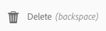

# Crear y organizar páginas {#creating-and-organizing-pages}

En esta sección se describe cómo crear y administrar páginas con Adobe Experience Manager AEM () para poder [crear contenido](/help/sites-authoring/editing-content.md) en esas páginas.

>[!NOTE]
>
>Su cuenta necesita el [derechos de acceso adecuados](/help/sites-administering/security.md) y [permissions](/help/sites-administering/security.md#permissions) para realizar acciones en páginas como crear, copiar, mover, editar y eliminar.
>
>Si se producen problemas, le sugerimos que se ponga en contacto con el administrador del sistema.

>[!NOTE]
>
>Existen varios [métodos abreviados del teclado](/help/sites-authoring/keyboard-shortcuts.md) que puede utilizar desde la consola de sitios web, y que le permitirán organizar las páginas de forma más eficaz.

## Organizar el sitio web {#organizing-your-website}

Como creador, deberá organizar el sitio web dentro de AEM. Esto implica crear y asignar un nombre a las páginas de contenido para que:

* Pueda encontrarlas con facilidad en el entorno de creación
* Los usuarios que visiten el sitio web puedan explorarlas fácilmente en el entorno de publicación

También puede usar [carpetas](#creating-a-new-folder) para organizar el contenido.

La estructura de un sitio web se puede considerar como una estructura de árbol que contiene las páginas de contenido. Los nombres de estas páginas de contenido se utilizan para formar las direcciones URL, mientras que el título se muestra cuando se visualiza el contenido de la página.

A continuación, se muestra un ejemplo del sitio de We.Retail, donde una página de shorts de senderismo ( `desert-sky-shorts`) se accede a:

* Entorno de creación
  `https://localhost:4502/editor.html/content/we-retail/us/en/products/equipment/hiking/desert-sky-shorts.html`

* Entorno de publicación
  `https://localhost:4503/content/we-retail/us/en/products/equipment/hiking/desert-sky-shorts.html`

Según la configuración de la instancia, utilice `/content` puede ser opcional en el entorno de publicación.

```xml
 /content
 /we-retail
  /us
   /en
    /products
     /equipment
      /hiking
       /desert-sky-shorts
       /hiking-poles
       /...
      /running...
      /surfing...
      /...
     /seasonal...
     /...
    /about-us
    /experience
    /...
   /es...
  /de...
  /fr...
  /...
 /...
```

Esta estructura puede verse desde la consola **Sitios**, donde puede [desplazarse por las páginas de su sitio web](/help/sites-authoring/basic-handling.md#navigating) y llevar a cabo acciones en las páginas. También puede crear sitios nuevos y [páginas nuevas](#creating-a-new-page).

Desde cualquier punto, podrá ver la rama hacia arriba desde las rutas en la barra de encabezado:


### Convenciones de nomenclatura de páginas {#page-naming-conventions}

Al crear una nueva página, hay dos campos de claves:

* **[Título](#title)**:

   * Se muestra al usuario en la consola, en la parte superior del contenido de la página al editar. 
   * Este campo es obligatorio.

* **[Nombre](#name)**:

   * Se usa para generar la URI.
   * La entrada del usuario para este campo es opcional. Si no se especifica, el nombre se obtiene a partir del título. Consulte la siguiente sección [Restricciones de nombres de páginas y Prácticas recomendadas](/help/sites-authoring/managing-pages.md#page-name-restrictions-and-best-practices) para obtener más detalles.

#### Restricciones de nombres de páginas y prácticas recomendadas {#page-name-restrictions-and-best-practices}

El **título** y el **nombre** de la página se pueden crear por separado, pero están relacionados:

* Al crear una página, solo se precisa el campo **Título**. Si no se proporciona ningún **nombre** durante la creación de la página, AEM genera un nombre a partir de los 64 primeros caracteres del título (observe el conjunto de validación a continuación). Solo se utilizan los 64 primeros caracteres para ofrecer compatibilidad con la práctica recomendada de nombres de página cortos.

* Si el autor especifica manualmente un nombre de página, el límite de 64 caracteres no se aplica. Sin embargo, es posible que se produzcan otras limitaciones técnicas en la longitud del nombre de la página.

>[!NOTE]
>
>Al definir un nombre de página, se recomienda que sea lo más corto y expresivo posible para que el lector pueda entenderlo con facilidad. Para obtener más información, consulte la [guía de estilo W3C](https://www.w3.org/Provider/Style/TITLE.html) para el elemento de `title`.
>
>Además, recuerde que algunos exploradores (por ejemplo, las versiones anteriores de IE) solo aceptan URL con una longitud determinada, por lo que también existen motivos técnicos para mantener los nombres de las páginas cortos. 

Al crear una página nueva, AEM [valida su nombre según las convenciones](/help/sites-developing/naming-conventions.md) que establecen tanto AEM como JCR.

El mínimo permitido de caracteres es:

* de &#39;a&#39; a &#39;z&#39;
* De &#39;A&#39; a &#39;Z&#39;
* De &#39;0&#39; a &#39;9&#39;
* `_` (guion bajo)
* `-` (guion/signo menos)

Para obtener toda la información sobre los caracteres permitidos, consulte las [convenciones de nomenclatura](/help/sites-developing/naming-conventions.md).

>[!NOTE]
>
>AEM Si se está ejecutando un [Implementación del administrador de persistencia MongoMK](/help/sites-deploying/recommended-deploys.md), los nombres de página están limitados a 150 caracteres.

#### Título {#title}

Si proporciona solo un **título** de página al crear una nueva página, AEM derivará el **nombre** de página de esta cadena y lo [validará según las convenciones](/help/sites-developing/naming-conventions.md) impuestas por AEM y JCR. Se acepta un campo de **Título** con caracteres no válidos, pero los caracteres no válidos se sustituirán en el nombre derivado. Por ejemplo:

| Título | Nombre derivado |
|---|---|
| Schön | schoen.html |
| SC%&amp;&#42;ç+ | sc---c-.html |

#### Nombre {#name}

Al indicar un valor **Nombre** cuando se crea una página, AEM [validará el nombre según las convenciones](/help/sites-developing/naming-conventions.md) impuestas por AEM y JCR. No se pueden enviar caracteres no válidos desde el campo **Nombre**. AEM Cuando se detecta la existencia de caracteres no válidos, el campo se resalta con un mensaje explicativo.


>[!NOTE]
>
>Evite utilizar un código de dos letras como nombre de página, tal como se indica en la norma ISO-639-1, a menos que sea la raíz de un idioma.
>
>Consulte [Preparación de contenido para su traducción](/help/sites-administering/tc-prep.md) para obtener más información.

### Plantillas {#templates}

En AEM, una plantilla especifica un tipo de página especializado. Se utilizará una plantilla como base para cualquier página nueva que se cree.

La plantilla define la estructura de una página, incluida una imagen en miniatura y otras propiedades. Por ejemplo, puede tener plantillas independientes para páginas de productos, mapas del sitio e información de contacto. Las plantillas están formadas por [componentes](#components).

AEM incluye varias plantillas listas para usar de forma predeterminada. Las plantillas disponibles dependen del sitio web individual. Los campos principales son:

* **Título** El título se muestra en la página web resultante.

* **Nombre** Se utiliza al dar nombre a la página.

* **Plantilla** Una lista de plantillas disponibles para usar durante la generación de la nueva página.

>[!NOTE]
>
>Si así se ha configurado en la instancia, los [autores de plantillas podrán crear plantillas con el editor de plantillas](/help/sites-authoring/templates.md).  

### Componentes {#components}

Componentes son los elementos ofrecidos por AEM para que pueda añadir tipos de contenido específicos. AEM viene con una gama de [componentes listos para usar](/help/sites-authoring/default-components-console.md) que proporcionan una funcionalidad completa. Estos incluyen:

* Texto
* Imagen
* Presentación de diapositivas
* Vídeo
* Y muchos más

Una vez que haya creado y abierto una página, puede [añadir contenido mediante los componentes](/help/sites-authoring/editing-content.md#insertinganewparagraph) que están disponibles en el [explorador de componentes](/help/sites-authoring/author-environment-tools.md#componentbrowser).

>[!NOTE]
>
>La [consola Componentes](/help/sites-authoring/default-components-console.md) aporta una visión general de los componentes de la instancia.

## Administrar páginas {#managing-pages}

### Creación de una nueva página {#creating-a-new-page}

A menos que se hayan creado todas las páginas por adelantado, antes de empezar a crear contenido, debe crear una página:

1. Abra la consola Sitios (por ejemplo, [https://localhost:4502/sites.html/content](https://localhost:4502/sites.html/content)).
1. Desplácese hasta la ubicación en la que desee crear la nueva página.
1. Abra el selector desplegable seleccionando **Crear** en la barra de herramientas y, a continuación, seleccione **Página** en la lista:

   

1. En el primer paso del asistente puede realizar una de las acciones siguientes:

   * Seleccione la plantilla que desea utilizar para crear la nueva página y, a continuación, toque o haga clic en **Siguiente** para continuar.

   * **Haga clic en Cancelar** para anular el proceso.

   

1. En el último paso del asistente puede realizar una de las acciones siguientes:

   * Utilice las tres pestañas para especificar las [propiedades de página](/help/sites-authoring/editing-page-properties.md) que desee asignar a la nueva página; a continuación, pulse o haga clic en **Crear** para crear la página.

   * Utilice **Atrás** para volver a la selección de plantilla.

   Los campos clave son los siguientes:

   * **Título**:

      * Se muestra al usuario y es obligatorio.

   * **Nombre**:

      * Se usa para generar la URI. Si no se especifica, el nombre se obtiene a partir del título.
      * Al indicar un valor **Nombre** cuando se cree una página, AEM [validará el nombre según las convenciones](/help/sites-developing/naming-conventions.md) impuestas por AEM y JCR.

      * **No se pueden enviar caracteres no válidos** desde el campo **Nombre**. AEM Cuando detecta caracteres no válidos, se resalta el campo y se muestra un mensaje explicativo para indicar los caracteres que deben eliminarse o reemplazarse.

   >[!NOTE]
   >
   >Consulte [Convenciones de asignación de nombres a páginas](#page-naming-conventions).

   La información mínima necesaria para crear una página nueva es el **Título**.

   

1. Utilice **Crear** para completar el proceso y crear la nueva página. El cuadro de diálogo de confirmación le preguntará si desea **abrir** la página inmediatamente o volver a la consola (**Listo**): 

   

   >[!NOTE]
   >
   >Si crea una página con un nombre que ya existe en la ubicación, el sistema generará automáticamente una variación del nombre añadiéndole un número. Por ejemplo, si `winter` ya existe, la página nueva pasará a llamarse `winter0`.

1. Al volver a la consola, podrá ver la nueva página:

   

>[!CAUTION]
>
>Una vez creada una página, su plantilla no se puede cambiar, a menos que [creación de un lanzamiento con una plantilla nueva](/help/sites-authoring/launches-creating.md#create-launch-with-new-template), aunque esto perderá cualquier contenido que ya exista.

### Abrir una página para su edición {#opening-a-page-for-editing}

Después de crear una página o desplazarse a una página existente (en la consola), puede abrirla para editarla:

1. Abra la consola **Sitios**.
1. Desplácese hasta que encuentre la página que desea editar.
1. Seleccione la página mediante:

   * [Acciones rápidas](/help/sites-authoring/basic-handling.md#quick-actions)
   * [El modo de selección](/help/sites-authoring/basic-handling.md#navigatingandselectionmode) y la barra de herramientas

   A continuación, seleccione el icono **Editar**:

   

1. Se abrirá la página, y podrá [editarla](/help/sites-authoring/editing-content.md#touchoptimizedui) si es necesario.

>[!NOTE]
>
>Solo se puede navegar a otras páginas desde el editor de páginas en el modo de previsualización, ya que los vínculos no están activos en el modo Editar.

### Copiar y pegar una página    {#copying-and-pasting-a-page}

Puede copiar una página y todas sus subpáginas en una nueva ubicación:

1. En la consola **Sitios**, desplácese hasta que encuentre la página que desea copiar.
1. Seleccione la página mediante lo siguiente:

   * [Acciones rápidas](/help/sites-authoring/basic-handling.md#quick-actions)
   * [El modo de selección](/help/sites-authoring/basic-handling.md#navigatingandselectionmode) y la barra de herramientas

   Y luego el icono de página **Copiar**:

   

   >[!NOTE]
   >
   >Si está en modo de selección, esto se abandona automáticamente en cuanto se copia la página.

1. Desplácese hasta la ubicación de la copia nueva de la página.
1. El icono **Pegar** está disponible con una flecha desplegable directamente a la derecha:

   

   Puede:
   * Seleccione el icono **Pegar** página: En esta ubicación, se creará una copia de la página original y de las páginas secundarias.
   * Seleccione la flecha desplegable para mostrar la opción **Pegar sin elementos secundarios**. Se creará una copia de la página original en esta ubicación; las páginas secundarias no se copiarán.

   >[!NOTE]
   >
   >Si copia la página en una ubicación en la que ya existe una página con el mismo nombre que el original, el sistema genera automáticamente una variación del nombre adjuntándole un número. Por ejemplo, si `winter` ya existe, `winter` pasa a llamarse `winter1`.

### Mover una página o cambiarle el nombre {#moving-or-renaming-a-page}

>[!NOTE]
>
>Cambiar el nombre de una página también está sujeto a las [Convenciones de nomenclatura de páginas](#page-naming-conventions) al especificar el nuevo nombre de página.

>[!NOTE]
>
>Una página solo se puede mover a una ubicación en la que la plantilla en la que se basa esté permitida. Consulte [Disponibilidad de plantillas](/help/sites-developing/templates.md#template-availability) para obtener más información.

El procedimiento para mover o cambiar el nombre de una página es básicamente el mismo y lo gestiona el mismo asistente. Con este asistente puede:

* Cambiar el nombre de una página sin moverla.
* Mover la página sin cambiar su nombre.
* Moverla y cambiarle el nombre al mismo tiempo.

AEM le ofrece la funcionalidad de actualizar cualquier vínculo interno que haga referencia a la página que se está moviendo o cambiando de nombre. Esto se puede hacer página por página para proporcionar una flexibilidad total.

1. Desplácese hasta que encuentre la página que desea mover.
1. Seleccione la página mediante lo siguiente:

   * [Acciones rápidas](/help/sites-authoring/basic-handling.md#quick-actions)
   * [El modo de selección](/help/sites-authoring/basic-handling.md#navigatingandselectionmode) y la barra de herramientas

   A continuación, seleccione el icono **Mover página**:

   

   Se abrirá el asistente para mover páginas.

1. En el paso **Cambiar nombre** del asistente puede realizar una de las acciones siguientes:

   * Especifique el nombre que desea que tenga la página cuando se haya desplazado y, a continuación, toque o haga clic en **Siguiente** para continuar.

   * **Haga clic en Cancelar** para anular el proceso.

   

   El nombre de página puede ser el mismo si solo mueve la página.

   >[!NOTE]
   >
   >Si mueve una página a una ubicación en la que ya existe una página con el mismo nombre, el sistema generará automáticamente una variación del nombre adjuntándole un número. Por ejemplo, si `winter` ya existe, `winter` pasa a llamarse `winter1`.

1. En el paso **Seleccionar destino** del asistente puede realizar una de las acciones siguientes:

   * Utilice la [vista de columna](/help/sites-authoring/basic-handling.md#column-view) para desplazarse a la nueva ubicación de la página:

      * Seleccione el destino haciendo clic en la miniatura de destino.
      * Haga clic en **Siguiente** para continuar.

   * Utilice **Volver** para volver al apartado para especificar el nombre de la página.

   >[!NOTE]
   >
   >De forma predeterminada, el elemento principal de la página que está moviendo o cambiando de nombre se selecciona como destino.

   

   >[!NOTE]
   >
   >Si mueve una página a una ubicación en la que ya existe una página con el mismo nombre, el sistema generará automáticamente una variación del nombre adjuntándole un número. Por ejemplo, si `winter` ya existe, `winter` pasa a llamarse `winter1`.

1. Si la página está vinculada, si se hace referencia a ella o si se ha publicado, los detalles aparecen en el paso **Ajustar/Volver a publicar**.

   Puede indicar qué debería ajustarse o volverse a publicar, según proceda.

   >[!NOTE]
   >
   >Si la página no está vinculada ni se hace referencia a ella, este paso no estará disponible.

   

1. Si selecciona **Mover** se completará el proceso y moverá o cambiará el nombre de la página según corresponda.

>[!NOTE]
>
>Si la página ya se ha publicado, al mover la página se cancelará la publicación automáticamente. De forma predeterminada, se volverá a publicar cuando se complete el movimiento, pero esto puede cambiar desmarcando la opción **Volver a publicar** en el campo **Ajustar/volver a publicar** paso.

>[!NOTE]
>
>Si no se hace referencia a la página, se omitirá el paso **Ajustar/volver a publicar**.

#### Acciones asincrónicas {#asynchronous-actions}

Las acciones de movimiento de página siempre se procesan asincrónicamente, lo que permite al usuario continuar la creación en la IU sin impedimentos.

* El usuario debe definir cuándo se debe realizar la operación asincrónica
   * **Ahora** comienza la ejecución del trabajo asincrónico de inmediato.
   * **Más tarde** permite al usuario definir cuándo se iniciará el trabajo asincrónico.

  

El estado de los trabajos asincrónicos se puede comprobar en el panel [**Estado de los trabajos asincrónicos** ](/help/sites-administering/asynchronous-jobs.md#monitor-the-status-of-asynchronous-operations)en **Navegación global** -> **Herramientas** -> **Operaciones** -> **Trabajos**

>[!NOTE]
>
>Para obtener más información sobre el procesamiento asincrónico de trabajos y cómo configurar el límite para las acciones de mover y cambiar el nombre de la página, consulte la [Trabajos asincrónicos](/help/sites-administering/asynchronous-jobs.md) en la guía del usuario de Administración.

>[!NOTE]
>
>AEM El procesamiento asincrónico de movimiento de página requiere la versión 6.5.3.0 o superior de la.

### Eliminar una página {#deleting-a-page}

1. Desplácese hasta que vea la página que desea eliminar.
1. Uso [modo de selección](/help/sites-authoring/basic-handling.md#viewing-and-selecting-resources) para seleccionar la página requerida, luego utilice **Eliminar** en la barra de herramientas:

   

   >[!NOTE]
   >
   >Como medida de seguridad, el icono **Eliminar** página no está disponible como acción rápida.

1. Un cuadro de diálogo solicitará confirmación, utilice:

   * **Cancelar** para anular la acción
   * **Eliminar** para confirmar la acción:

      * Si la página no tiene referencias, se eliminará la página.
      * Si la página dispone de referencias, un cuadro de mensaje le informa de que **Se hace referencia a una o varias páginas.** Puede seleccionar **Forzar eliminación** o **Cancelar**.

>[!NOTE]
>
>Si una página ya se ha publicado, se cancela su publicación automáticamente antes de eliminarla.

### Bloquear una página   {#locking-a-page}

Puede [bloquear/desbloquear una página](/help/sites-authoring/editing-content.md#locking-a-page) desde una consola o al editar una página individual. La información sobre las páginas bloqueadas también se muestra en ambas ubicaciones.

 

### Crear una nueva carpeta {#creating-a-new-folder}

Puede crear carpetas para organizar archivos y páginas.

>[!NOTE]
>
>Las carpetas también están sujetas a las [Convenciones de asignación de nombres a páginas](#page-naming-conventions) al especificar el nuevo nombre de carpeta.

>[!CAUTION]
>
>* Las carpetas solo se pueden crear directamente en **Sitios** o en otras carpetas. No se pueden crear en una página.
>* Las acciones estándar mover, copiar, pegar, eliminar, publicar, cancelar publicación y las propiedades de ver/editar se pueden ejecutar en una carpeta.
>* Las carpetas no están disponibles para la selección en una Live Copy.
>

1. Abra la consola **Sitios** y vaya hasta la ubicación deseada.
1. Para abrir la lista de opciones, seleccione **Crear** en la barra de herramientas
1. Seleccione **Carpeta** para abrir el cuadro de diálogo. Aquí puede indicar el **Nombre** y el **Título**:

   

1. Seleccione **Crear** para crear la carpeta.
