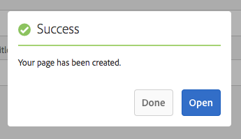
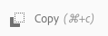
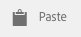

# Crear y organizar páginas{#creating-and-organizing-pages}

En esta sección se describe cómo crear y administrar páginas con Adobe Experience Manager (AEM) para luego poder [crear contenido](/help/sites-authoring/editing-content.md) en esas páginas.

>[!NOTE]
>
>Su cuenta necesita los [derechos de acceso](/help/sites-administering/security.md) y [permisos](/help/sites-administering/security.md#permissions) adecuados para realizar acciones en las páginas, como crear, copiar, mover, eliminar o editar.
>
>Si se producen problemas, le sugerimos que se ponga en contacto con el administrador del sistema.

>[!NOTE]
>
>Existen varios [ métodos abreviados del teclado](/help/sites-authoring/keyboard-shortcuts.md) que puede utilizar desde la consola de sitios web, y que le permitirán organizar las páginas de forma más eficaz.

## Organizar el sitio web {#organizing-your-website}

Como creador, deberá organizar el sitio web dentro de AEM. Esto implica crear y dar nombre a las páginas de contenido para que:

* Pueda encontrarlas con facilidad en el entorno de creación
* Los usuarios que visiten el sitio web puedan explorarlas fácilmente en el entorno de publicación

También puede usar [carpetas](#creating-a-new-folder) para organizar el contenido.

La estructura de un sitio web se puede considerar como una estructura de árbol que alberga las páginas de contenido. Los nombres de estas páginas de contenido se usan para formar las direcciones URL, y el título se muestra cuando se visualiza el contenido de la página.

The following shows an example from the We.Retail site, where a hiking shorts page ( `desert-sky-shorts`) is accessed:

* Entorno de creación
   `https://localhost:4502/editor.html/content/we-retail/us/en/products/equipment/hiking/desert-sky-shorts.html`

* Entorno de publicación
   `https://localhost:4503/content/we-retail/us/en/products/equipment/hiking/desert-sky-shorts.html`

Depending on the configuration of your instance, use of `/content` might be optional on the publish environment.

```xml
 /content
 /we-retail
  /us
   /en
    /products
     /equipment
      /hiking
       /desert-sky-shorts
       /hiking-poles
       /...
      /running...
      /surfing...
      /...
     /seasonal...
     /...
    /about-us
    /experience
    /...
   /es...
  /de...
  /fr...
  /...
 /...
```

This structure can be viewed From the **Sites** console, where you can [navigate through the pages of your website](/help/sites-authoring/basic-handling.md#navigating) and perform actions on the pages. También puede crear sitios nuevos y [páginas nuevas](#creating-a-new-page).

Desde cualquier punto, podrá ver la rama hacia arriba desde las rutas en la barra de encabezado:


### Convenciones de nomenclatura de páginas {#page-naming-conventions}

Cuando se crea una nueva página aparecen dos campos clave:

* **[Título](#title)**:

   * Se muestra al usuario en la consola, en la parte superior del contenido de la página al editar. 
   * Este campo es obligatorio.

* **[Nombre](#name)**:

   * Se usa para generar la URI.
   * Es opcional que el usuario especifique algo en este campo. Si no se especifica, el nombre se deriva del título. Consulte la siguiente sección [Restricciones de nombres de páginas y Prácticas recomendadas](/help/sites-authoring/managing-pages.md#page-name-restrictions-and-best-practices) para obtener más detalles.

#### Restricciones de nombres de páginas y prácticas recomendadas {#page-name-restrictions-and-best-practices}

El **título** y el **nombre** de la página se pueden crear por separado, pero están relacionados:

* Al crear una página, solo es necesario el campo **Título**. Si no se proporciona ningún **nombre** durante la creación de la página, AEM genera un nombre a partir de los 64 primeros caracteres del título (observe el conjunto de validación a continuación). Solo se utilizan los 64 primeros caracteres para ofrecer compatibilidad con la práctica recomendada de nombres de página cortos.

* Si el autor especifica manualmente un nombre de página, el límite de 64 caracteres no se aplica. Sin embargo, es posible que se produzcan otras limitaciones técnicas en la longitud del nombre de la página.

>[!NOTE]
>
>Al definir un nombre de página, se recomienda que sea lo más corto y expresivo posible para que el lector pueda entenderlo con facilidad. See the [W3C style guide](https://www.w3.org/Provider/Style/TITLE.html) for the `title` element for more information.

>Además, recuerde que algunos exploradores (por ejemplo, las versiones anteriores de IE) solo aceptan URL con una longitud determinada, por lo que también existen motivos técnicos para mantener los nombres de las páginas cortos.
>
Al crear una página nueva, AEM [valida el nombre de la página según las convenciones](/help/sites-developing/naming-conventions.md) que establecen tanto AEM como JCR.

El mínimo permitido de caracteres es:

* De la &quot;a&quot; a la &quot;z&quot;
* De la &quot;A&quot; a la &quot;Z&quot;
* De &quot;0&quot; a &quot;9&quot;
* `_` (guion bajo)
* `-` (guion/signo menos)

Para obtener toda la información sobre los caracteres permitidos, consulte las [convenciones de nomenclatura](/help/sites-developing/naming-conventions.md).

>[!NOTE]
Si AEM se ejecuta en una [implementación del administrador de persistencia de MongoMK](/help/sites-deploying/recommended-deploys.md), los nombres de página se limitan a 150 caracteres.

#### Título {#title}

Si proporciona solo un **título** de página al crear una nueva página, AEM derivará el **nombre** de página de esta cadena y lo [validará según las convenciones](/help/sites-developing/naming-conventions.md) impuestas por AEM y JCR. A **Title** field containing invalid characters will be accepted, but the name derived will have the invalid characters subsituted. Por ejemplo:

| Título | Nombre derivado |
|---|---|
| Schön | schoen.html |
| SC%&amp;*ç+ | sc---c-.html |

#### Nombre {#name}

Al indicar un valor **Nombre** cuando se crea una página, AEM [validará el nombre según las convenciones](/help/sites-developing/naming-conventions.md) impuestas por AEM y JCR. No se pueden enviar caracteres no válidos desde el campo **Nombre**. Cuando AEM detecta caracteres que no son válidos en el campo, se resaltarán con un mensaje explicativo.


>[!NOTE]
Evite utilizar un código de dos letras como nombre de página, tal como se indica en la norma ISO-639-1, a menos que sea la raíz de un idioma.
Consulte [Preparación de contenido para su traducción](/help/sites-administering/tc-prep.md) para obtener más información.

### Plantillas {#templates}

En AEM, una plantilla especifica un tipo de página especializado. Todas las páginas nuevas se basarán en una plantilla.

La plantilla define la estructura de una página (así como una imagen en miniatura y otras propiedades). Por ejemplo, puede tener plantillas diferentes para páginas de producto, mapas del sitio e información de contacto. Las plantillas están compuestas de [componentes](#components).

AEM incluye varias plantillas listas para usar. Las plantillas disponibles dependen del sitio web individual. Los campos principales son:

* **Título** El título se muestra en la página web resultante.

* **Nombre** Se utiliza al dar nombre a la página.

* **Plantilla** Una lista de plantillas disponibles para usar durante la generación de la nueva página.

>[!NOTE]
Si así se ha configurado en la instancia, los [autores de plantillas podrán crear plantillas con el editor de plantillas](/help/sites-authoring/templates.md).  

### Componentes {#components}

Components are the elements provided by AEM so that you can add specific types of content. AEM comes with a range of [out-of-the-box components](/help/sites-authoring/default-components-console.md) that provide comprehensive functionality. These include:

* Texto
* Imagen
* Presentación de diapositivas
* Vídeo
* Y muchos más

Una vez que haya creado y abierto una página, puede [añadir contenido mediante los componentes](/help/sites-authoring/editing-content.md#insertinganewparagraph), que están disponibles [en el explorador de componentes](/help/sites-authoring/author-environment-tools.md#componentbrowser).

>[!NOTE]
La [consola Componentes](/help/sites-authoring/default-components-console.md) aporta una visión general de los componentes de la instancia.

## Administrar páginas {#managing-pages}

### Creación de una nueva página {#creating-a-new-page}

A menos que alguien haya creado todas las páginas con antelación, antes de poder empezar a crear contenido, debe crear una página:

1. Open the Sites console (for example, [https://localhost:4502/sites.html/content](https://localhost:4502/sites.html/content)).
1. Desplácese a la ubicación en la que desee crear la nueva página.
1. Abra el selector desplegable seleccionando **Crear** en la barra de herramientas y, a continuación, seleccione **Página** en la lista:

   

1. En el primer paso del asistente puede realizar una de las acciones siguientes:

   * Seleccione la plantilla que desea utilizar para crear la nueva página y, a continuación, toque o haga clic en **Siguiente** para continuar.

   * **Haga clic en Cancelar** para anular el proceso.
   

1. En el último paso del asistente puede realizar una de las acciones siguientes:

   * Utilice las tres fichas para especificar las [propiedades de página](/help/sites-authoring/editing-page-properties.md) que desee asignar a la nueva página; a continuación, toque o haga clic en **Crear** para crear la página.

   * Utilice **Atrás** para volver a la selección de plantillas.
   Los campos clave son:

   * **Título**:

      * Se muestra al usuario y es obligatorio.
   * **Nombre**:

      * Se usa para generar la URI. Si no se especifica, el nombre se deriva del título.
      * Si se proporciona un valor **Nombre** al crear una página, AEM [validará el nombre según las convenciones](/help/sites-developing/naming-conventions.md) impuestas por AEM y JCR.

      * No **se pueden enviar caracteres no válidos** desde el campo **Nombre**. Cuando AEM detecte caracteres no válidos, el campo se resaltará y aparecerá un mensaje explicativo para indicar qué caracteres se deben eliminar o reemplazar.
   >[!NOTE]
   Consulte [Convenciones de nomenclatura para las páginas](#page-naming-conventions).

   La información mínima necesaria para crear una página nueva es el **Título**.

   

1. Utilice **Crear** para completar el proceso y crear la nueva página. El cuadro de diálogo de confirmación le preguntará si desea **abrir** la página inmediatamente o volver a la consola (**Listo**): 

   

   >[!NOTE]
   Si crea una página con un nombre que ya existe en la ubicación, el sistema generará automáticamente una variación del nombre añadiéndole un número. Por ejemplo, si `winter` ya existe, la página nueva pasará a llamarse `winter0`.

1. Al volver a la consola, podrá ver la nueva página:

   

>[!CAUTION]
Después de crear una página, su plantilla no se puede modificar, a menos que [cree un lanzamiento con una plantilla nueva](/help/sites-authoring/launches-creating.md#create-launch-with-new-template), aunque así se perderá el contenido existente.

### Abrir una página para su edición {#opening-a-page-for-editing}

Tras crear una página o desplazarse a una página existente (en la consola), puede abrirla para editarla:

1. Abra la consola **Sitios**.
1. Desplácese hasta que encuentre la página que desea editar.
1. Seleccione la página mediante:

   * [Acciones rápidas](/help/sites-authoring/basic-handling.md#quick-actions)
   * [El modo de selección](/help/sites-authoring/basic-handling.md#navigatingandselectionmode) y la barra de herramientas
   And then select the **Edit** icon:

   

1. Se abrirá la página, y podrá [editarla](/help/sites-authoring/editing-content.md#touchoptimizedui) si es necesario.

>[!NOTE]
Solo se puede navegar a otras páginas desde el editor de páginas en el modo de previsualización, ya que los vínculos no están activos en el modo Editar.

### Copiar y pegar una página {#copying-and-pasting-a-page}

Puede copiar una página y todas sus subpáginas en una nueva ubicación:

1. En la consola **Sitios**, desplácese hasta que encuentre la página que desea copiar.
1. Seleccione la página mediante una de las acciones siguientes:

   * [Acciones rápidas](/help/sites-authoring/basic-handling.md#quick-actions)
   * [El modo de selección](/help/sites-authoring/basic-handling.md#navigatingandselectionmode) y la barra de herramientas
   A continuación, seleccione el icono de la página **Copiar**:

   

   >[!NOTE]
   Si se encuentra en el modo de selección, se saldrá del mismo automáticamente en cuanto se copie la página.

1. Desplácese a la ubicación de la copia nueva de la página.
1. Utilice el icono **Pegar** de la página:

   

   Se creará una copia de la página original y de las páginas secundarias en esta ubicación.

   >[!NOTE]
   Si copia la página en una ubicación en la que ya existe una página con el mismo nombre que el original, el sistema generará automáticamente una variación del nombre adjuntándole un número. For example if `winter` already exists `winter` will become `winter1`.

### Mover una página o cambiarle el nombre {#moving-or-renaming-a-page}

>[!NOTE]
A la hora de especificar un nombre nuevo, las opciones para cambiar el nombre de una página también están sujetas a las [convenciones de nomenclatura para las páginas](#page-naming-conventions).

>[!NOTE]
Las páginas solo se pueden mover a ubicaciones en las que se permitan las plantillas en las que está basada dicha página. See [Template Availability](/help/sites-developing/templates.md#template-availability) for more information.

El procedimiento para mover o cambiar el nombre de una página es básicamente el mismo y se controla mediante el mismo asistente. Con este asistente puede:

* Cambiar el nombre de una página sin moverla.
* Mover la página sin cambiar su nombre.
* Moverla y cambiarle el nombre al mismo tiempo.

AEM le ofrece la funcionalidad de actualizar los vínculos internos que hagan referencia a la página que está moviendo o cuyo nombre está cambiando. Esto puede hacerse página por página para proporcionar flexibilidad completa.

1. Desplácese hasta encontrar la página que desee mover.
1. Seleccione la página mediante una de las acciones siguientes:

   * [Acciones rápidas](/help/sites-authoring/basic-handling.md#quick-actions)
   * [El modo de selección](/help/sites-authoring/basic-handling.md#navigatingandselectionmode) y la barra de herramientas
   A continuación, seleccione el icono **Mover página**:

   

   Esta acción abrirá el asistente para desplazar páginas.

1. En el paso **Cambiar nombre** del asistente puede efectuar una de las acciones siguientes:

   * Especifique el nombre que desea que tenga la página cuando se haya desplazado y, a continuación, toque o haga clic en **Siguiente** para continuar.

   * **Haga clic en Cancelar** para anular el proceso.
   

   El nombre de la página puede seguir siendo el mismo si solo va a mover la página.

   >[!NOTE]
   Si mueve una página a una ubicación en la que ya existe una página con el mismo nombre, el sistema generará automáticamente una variación del nombre adjuntándole un número. For example if `winter` already exists `winter` will become `winter1`.

1. En el paso **Seleccionar destino** del asistente puede realizar una de las acciones siguientes:

   * Utilice la [vista de columna](/help/sites-authoring/basic-handling.md#column-view) para desplazarse a la nueva ubicación de la página:

      * Seleccione el destino haciendo clic en la miniatura de destino.
      * Haga clic en **Siguiente** para continuar.
   * Utilice **Volver** para volver al apartado para especificar el nombre de la página.
   >[!NOTE]
   De forma predeterminada, el elemento principal de la página que está moviendo o cuyo nombre va a cambiar se selecciona como destino.

   

   >[!NOTE]
   Si mueve una página a una ubicación en la que ya existe una página con el mismo nombre, el sistema generará automáticamente una variación del nombre adjuntándole un número. For example if `winter` already exists `winter` will become `winter1`.

1. Si la página está vinculada, si se hace referencia a ella o si se ha publicado, los detalles aparecen en el paso **Ajustar/Volver a publicar**.

   Puede indicar qué debería ajustarse o volverse a publicar, según proceda.

   >[!NOTE]
   Si la página no está vinculada ni se hace referencia a ella, este paso no estará disponible.

   

1. Si selecciona **Mover**, se completará el proceso y la página se moverá o cambiará de nombre, según el caso.

>[!NOTE]
Si la página ya se había publicado, la acción de mover la página provocará que se cancele su publicación automáticamente. De forma predeterminada, se volverá a publicar una vez finalizado su desplazamiento, pero esto puede cambiar si se desmarca el campo **Volver a publicar** en el paso **Ajustar/volver a publicar**.

>[!NOTE]
Si no se hace referencia a la página, se omitirá el paso **Ajustar/volver a publicar**.

### Eliminar una página {#deleting-a-page}

1. Desplácese hasta que vea la página que desee eliminar.
1. Utilice el [modo de selección](/help/sites-authoring/basic-handling.md#viewing-and-selecting-resources) para seleccionar la página necesaria; luego, utilice **Eliminar** de la barra de herramientas:

   

   >[!NOTE]
   Como medida de seguridad, el icono de página **Eliminar** no está disponible como acción rápida.

1. Aparecerá un diálogo que le pedirá que confirme la acción. Realice una de las acciones siguientes:

   * Seleccione **Cancelar** para cancelar la acción.
   * Seleccione **Eliminar** para confirmar la acción:

      * Si la página no dispone de referencias, se eliminará.
      * Si la página dispone de referencias, un cuadro de mensaje le informará de que **Se hace referencia a una o varias páginas.** Puede seleccionar **Forzar eliminación** o **Cancelar**.

>[!NOTE]
Si la página ya se ha publicado, se cancelará su publicación automáticamente antes de la eliminación.

### Bloquear una página {#locking-a-page}

Puede [bloquear o desbloquear una página](/help/sites-authoring/editing-content.md#locking-a-page) desde una consola o bien editando una página en concreto. En ambas ubicaciones también se mostrará información sobre si una página está bloqueada o no.

 

### Crear una nueva carpeta {#creating-a-new-folder}

Puede crear carpetas para organizar archivos y páginas.

>[!NOTE]
A la hora de especificar un nombre nuevo, las opciones para cambiar el nombre de las carpetas están también sujetas a las [convenciones de nomenclatura de páginas](#page-naming-conventions).

>[!CAUTION]
* Las carpetas solo se pueden crear directamente en **Sitios** o en otras carpetas. No se pueden crear en una página.
* Las acciones estándar mover, copiar, pegar, eliminar, publicar, cancelar la publicación y ver/editar propiedades se pueden realizar en una carpeta.
* Las carpetas no están disponibles para la selección en una Live Copy.


1. Abra la consola **Sitios** y vaya hasta la ubicación deseada.
1. Para abrir la lista de opciones, seleccione **Crear** en la barra de herramientas.
1. Seleccione **Carpeta** para abrir el cuadro de diálogo. Aquí puede indicar el **Nombre** y el **Título**:

   

1. Seleccione **Crear** para crear la carpeta.
