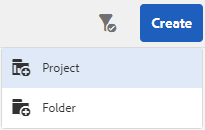
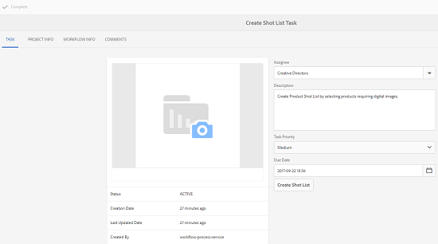
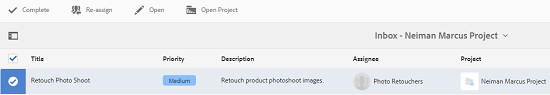
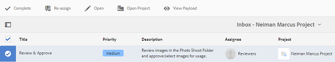
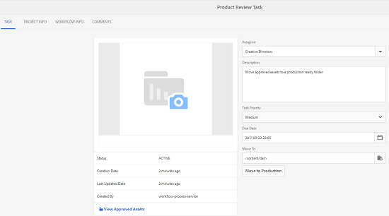
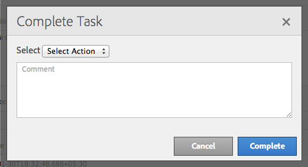

# Creative Project e integración PIM{#creative-project-and-pim-integration}

Si es un especialista en marketing o un profesional creativo, puede utilizar las herramientas de Creative Project de Adobe Experience Manager (AEM) para administrar la fotografía de productos relacionada con el comercio electrónico y los procesos creativos asociados dentro de su organización.

En concreto, puede utilizar Proyecto creativo para agilizar las tareas siguientes en el flujo de trabajo de la sesión fotográfica:

* Creación de una solicitud de sesión fotográfica
* Carga de una sesión fotográfica
* Colaborar en una sesión fotográfica
* Recursos aprobados para el empaquetado

>[!NOTE]
>
>Consulte [Funciones de usuario del proyecto](/help/sites-authoring/projects.md#user-roles-in-a-project) para obtener información sobre la asignación de funciones de usuario y flujos de trabajo a ciertos tipos de usuarios.

## Explorar los flujos de trabajo de la sesión fotográfica del producto  {#exploring-product-photo-shoot-workflows}

Creative Project ofrece varias plantillas de proyecto para cumplir los distintos requisitos del proyecto. La plantilla **Proyecto de sesión fotográfica del producto** está disponible y lista para usar. Esta plantilla incluye los flujos de trabajo de la sesión fotográfica que le permiten iniciar y administrar las solicitudes de sesión fotográfica del producto. También incluye una serie de tareas que le permiten obtener las imágenes digitales para los productos a través de procesos de revisión y aprobación apropiados.

La plantilla incluye los siguientes flujos de trabajo:

* **Flujo de trabajo de la sesión fotográfica del producto (integración del comercio)**: este flujo de trabajo aprovecha la integración del comercio en el sistema de administración de la información del producto (PIM) para generar automáticamente una lista de tomas para los productos seleccionados (jerarquía). Puede ver los datos del producto como parte de los metadatos de recursos una vez completado el flujo de trabajo.
* **Flujo de trabajo de la sesión fotográfica del producto**: este flujo de trabajo le permite proporcionar una lista de tomas en lugar de depender de la integración del comercio. Asigna las imágenes cargadas en un archivo CSV de la carpeta de recursos del proyecto.

>[!NOTE]
>
>El archivo CSV que se carga en la tarea Cargar lista de tomas del flujo de trabajo de sesión fotográfica del producto debe tener el nombre de archivo shotlist.csv.

## Crear un proyecto de sesión fotográfica del producto {#create-a-product-photo-shoot-project}

1. In the **Projects** console, tap/click **Create** and then choose **Create Project** from the list.

   

1. En la página **Crear proyecto**, seleccione la plantilla de proyecto de sesión fotográfica y toque o haga clic en **Siguiente**.

   

1. Introduzca los detalles del proyecto, incluido el título, la descripción y la fecha de caducidad. Añada usuarios y asígneles diversas funciones. También puede añadir una miniatura para el proyecto.

   

1. Toque o haga clic en **Crear**. Un mensaje de confirmación notifica que el proyecto se ha creado.
1. Tap/click **Done** to return to the **Projects** console. Alternatively, tap/click **Open** to view the assets within the photoshoot project.

## Comenzar a trabajar en un proyecto de sesión fotográfica del producto {#starting-work-in-a-product-photo-shoot-project}

Para iniciar una solicitud de sesión fotográfica, toque o haga clic en un proyecto y, a continuación, toque o haga clic en **Añadir trabajo** en la página de detalles del proyecto para iniciar un flujo de trabajo.


Un proyecto de sesión fotográfica del producto incluye los siguientes flujos de trabajo listos para usarse:

* Flujo de trabajo de la sesión fotográfica del producto (integración del comercio)
* Flujo de trabajo de la sesión fotográfica del producto

Utilice el flujo de trabajo de la sesión fotográfica del producto (integración del comercio) para asignar los recursos de imagen a los productos de AEM. Este flujo de trabajo aprovecha la integración del comercio para vincular las imágenes aprobadas a los datos del producto existentes en la ubicación */etc/commerce*.

El flujo de trabajo de la sesión fotográfica del producto (Integración del comercio) incluye las siguientes tareas:

* Crear lista de tomas
* Cargar sesión fotográfica
* Retocar sesión fotográfica
* Revisar y aprobar
* Mover a la tarea de producción

Si la información del producto no está disponible en AEM, utilice el flujo de trabajo de la sesión fotográfica del productopara asignar los recursos de imagen a los productos de acuerdo con los datos que haya cargado en un archivo CSV. El archivo CSV debe contener información del producto básica, como el identificador, la categoría y una descripción del producto. El flujo de trabajo obtiene recursos aprobados para los productos.

Este flujo de trabajo incluye las tareas siguientes:

* Cargar lista de tomas
* Cargar sesión fotográfica
* Retocar sesión fotográfica
* Revisar y aprobar
* Mover a la tarea de producción

Puede personalizar este flujo de trabajo mediante la opción de configuración de flujo de trabajo.

Ambos flujos de trabajo incluyen pasos para vincular productos a los recursos aprobados. Cada flujo de trabajo incluye los pasos siguientes:

* Configuración de flujo de trabajo: describe las opciones para personalizar el flujo de trabajo.
* Iniciar un flujo de trabajo del proyecto: explica cómo iniciar una sesión fotográfica del producto.
* Información sobre las tareas de flujo de trabajo: proporciona información sobre las tareas disponibles en el flujo de trabajo.

## Seguimiento del progreso del proyecto {#tracking-project-progress}

Para realizar un seguimiento del progreso de un proyecto, puede controlar las tareas activas/terminadas de un proyecto.

Utilice la información siguiente para controlar el progreso de un proyecto:

* **Tarjeta de la tarea**

* **Lista de tareas**

La tarjeta Tarea muestra el progreso general del proyecto. Aparece en la página Detalles del proyecto solo si el proyecto tiene alguna tarea relacionada. La tarjeta de la tarea muestra el estado de finalización del proyecto actual de acuerdo con el número de tareas completadas. No incluye las tareas futuras.

La tarjeta de la tarea proporciona la información siguiente:

* Porcentaje de tareas activas
* Porcentaje de tareas completadas


La lista de tareas proporciona información detallada sobre la tarea para el proyecto que actualmente tiene un flujo de trabajo activo. Para mostrar la lista, toque o haga clic en la tarjeta de la tarea. La lista de tareas también muestra metadatos como, por ejemplo, fecha de inicio, fecha de caducidad, usuario asignado, prioridad y estado de la tarea.


## Configuración de flujo de trabajo {#workflow-configuration}

Esta tarea consiste en asignar pasos del flujo de trabajo a los usuarios según sus funciones.

Para configurar el flujo de trabajo de la **sesión fotográfica del producto**:

1. Navigate to **Tools** > **Workflows**, and then tap the **Models** tile to open the **Workflow Models** page.
1. Select the **Product Photo Shoot** workflow, and the tap the **Edit** icon from the toolbar to open it in edit mode.

   

1. In the **Product Photo Shoot Workflow** page, open a project task. Por ejemplo, abra la tarea **Cargar lista de tomas**.

   

1. Haga clic en la pestaña **Tarea** para configurar las opciones siguientes:

   * Nombre de la tarea.
   * Usuario predeterminado (función) que recibe la tarea.
   * Prioridad predeterminada de la tarea, que se muestra en la lista de tareas del usuario.
   * Descripción de una tarea que se mostrará cuando el usuario asignado abra la tarea.
   * Fecha de caducidad de una tarea, que se calcula en función del momento en que la tarea comenzó.

1. Haga clic en **OK** para guardar las opciones de configuración.

   De manera similar, puede configurar las tareas siguientes para el flujo de trabajo de la **sesión fotográfica del producto**:

   * Cargar sesión fotográfica
   * Retocar la sesión fotográfica del producto
   * Revisión de sesión fotográfica
   * Mover a producción
   Perform a similar procedure to configure the tasks in the **Product Photo Shoot (Commerce Integration) workflow**.

En esta sección se describe cómo integrar la administración de la información del producto en su proyecto creativo.

## Iniciar un flujo de trabajo del proyecto {#starting-a-project-workflow}

1. Navigate to a Product Photo Shoot project, and tap/click the **Add Work** icon on the **Workflows** card.
1. Seleccione la tarjeta del flujo de trabajo de la **sesión fotográfica del producto (integración del comercio)** para iniciar el flujo de trabajo de la sesión fotográfica del producto (integración del comercio). If the product information isn&#39;t available under /etc/commerce, select the **Product Photo Shoot** workflow and start the Product Photo Shoot workflow.

   

1. Toque o haga clic en **Siguiente** para iniciar el flujo de trabajo en el proyecto.
1. Introduzca la información del flujo de trabajo en la página siguiente.

   

   Haga clic en **Enviar** para iniciar el flujo de trabajo de la sesión fotográfica. Se muestra la página de información del proyecto para el proyecto de sesión fotográfica.

   

### Información de las tareas de flujo de trabajo {#workflow-tasks-details}

El flujo de trabajo de la sesión fotográfica incluye varias tareas. Cada una de ellas se asigna a un grupo de usuarios en función de la configuración definida para la tarea.

#### Tarea Crear lista de tomas {#create-shot-list-task}

La tarea **Crear lista de tomas** permite al propietario del proyecto seleccionar los productos para los que se requieren imágenes. De acuerdo con la opción seleccionada por el usuario, se genera un archivo CSV que contiene la información del producto básica.

1. In the project folder, tap/click the ellipses in the [Tasks Card](#tracking-project-progress) to view the task item in the workflow.

   

1. Select the **Create Shot List** task, and then tap/click the **Open** icon from the toolbar.

   

1. Revise la información de la tarea y, a continuación, toque o haga clic en el botón **Crear lista de tomas**.

   

1. Seleccione los productos para los que existen datos del producto sin imágenes asociadas.

   

1. Tap/click the **Add To Shotlist** icon to create a CSV file that contains a list of all such products. Un mensaje confirma que se ha creado la lista de tomas para los productos seleccionados. Haga clic en **Cerrar** para completar el flujo de trabajo.
1. Después de crear una lista de tomas, se muestra el vínculo **Ver lista de tomas**. To add more products to the shot list, tap/click **Add to Shot List**. En este caso, los datos se añaden a la lista de tomas creada inicialmente.

   

1. Toque o haga clic en **Ver lista de tomas** para ver la nueva lista de tomas.

   

   Para editar los datos existentes o añadir datos nuevos, toque o haga clic en **Editar** en la barra de herramientas. Only the **Product **and **Description** fields are editable.

   

   After you update the file, tap/click **Save** on toolbar to save the file.

1. After adding the products, tap/click the **Complete** icon on the **Create Shot List **task details page to mark the task as completed. Puede añadir un comentario opcional.

   La finalización de la tarea presenta los siguientes cambios en el proyecto:

   * Los recursos correspondientes a la jerarquía del producto se crean en una carpeta con el mismo nombre que el título del flujo de trabajo.
   * Los metadatos para los recursos se convierten en editables mediante la consola Recursos, incluso antes de que el fotógrafo proporcione las imágenes.
   * Se crea una carpeta de la sesión fotográfica en que se almacenan las imágenes que el fotógrafo proporciona. La carpeta de la sesión fotográfica contiene las subcarpetas para cada entrada del producto en la lista de tomas.
   Cargar lista de tomas es la primera tarea del flujo de trabajo de la sesión fotográfica del producto (sin integración del comercio). Toque o haga clic en **Cargar lista de tomas** para cargar un archivo **shotlist.csv**. El archivo CSV debe contener el identificador del producto. Los demás campos son opcionales. Puede utilizarlos para asignar recursos a los productos.

### Tarea Cargar lista de tomas {#upload-shot-list-task}

Esta tarea forma parte del flujo de trabajo de la sesión fotográfica del producto. Esta tarea se realiza si la información del producto no está disponible en AEM. En este caso, se carga una lista de productos en un archivo CSV para el que se necesitan recursos de imagen. En función de los detalles del archivo CSV, los recursos de imagen se asignan a los productos.

Utilice el vínculo **Ver lista de tomas** en la tarjeta del proyecto del procedimiento anterior para descargar un archivo CSV de muestra. Revise el archivo de muestra para saber cuál es el contenido habitual de un archivo CSV.

La lista de productos o el archivo CSV pueden contener campos, tales como **Categoría, Identificador del producto, Descripción** y **Ruta de acceso**. El campo **Identificador** es obligatorio y contiene el identificador del producto. Los demás campos son opcionales.

Un producto puede pertenecer a una categoría determinada. La categoría del producto puede aparecer en el CSV debajo de la columna **Categoría**. El campo **Producto** contiene el nombre del producto. En el campo **Descripción**, introduzca la descripción del producto o las instrucciones para el fotógrafo.

>[!NOTE]
>
>The name of images to be uploaded should start with &quot;**&lt;ProductId>_&quot;** where Product ID is referenced from the **Id** field in the *shotlist.csv* file. For example, for a product in the shot list with **Id 397122**, you can upload files with names **397122_highcontrast.jpg**, **397122_lowlight.png**, and so on.

1. In the project folder, tap/click the ellipses in the [Tasks Card](#tracking-project-progress) to view the list of tasks in the workflow.
1. Select the **Upload Shot List** task, and then tap/click the **Open** icon from the toolbar.

   

1. Review the task details and then tap/click the **Upload Shot List** button.

   

1. Tap/click the **Upload Shot List** button to upload the CSV file with filename shotlist.csv. El flujo de trabajo reconoce este archivo como origen que se utilizará para extraer los datos del producto para la tarea siguiente.
1. Cargue un archivo CSV que contenga la información del producto en el formato adecuado. The **View Uploaded Assets** link appears under the card after the CSV file is uploaded.

   

   Click the **Complete** icon to complete the task.

1. Tap/click the **Complete** icon to complete the task.

### Tarea Cargar sesión fotográfica {#upload-photo-shoot-task}

If you are an Editor, you can upload shots for the products listed in the **shotlist.csv** file that is created or uploaded in the previous task.

The name of images to be uploaded should begin with **&quot;&lt;productId>_&quot;** where Product ID is referenced from the **Id** field in the **shotlist.csv** file. Por ejemplo, para un producto con un **identificador 397122** en la lista de tomas, puede cargar archivos con nombres **397122_highcontrast.jpg**, **397122_lowlight.png**, etcétera.

Puede cargar las imágenes directamente o cargar un archivo ZIP que contenga las imágenes. De acuerdo con sus nombres, las imágenes se encuentran en carpetas de productos respectivas dentro de la carpeta **Sesión fotográfica**.

1. Under the project folder, tap/click the ellipses in the [Task Card](#tracking-project-progress) to view the task item in the workflow.
1. Select the **Upload Photo Shoot** task, and then tap/click the **Open** icon from the toolbar.

   

1. Tap/click **Upload Photo Shoot** and upload the photo shoot images.
1. Toque o haga clic en el icono **Completar** de la barra de herramientas para completar la tarea.

### Tarea Retocar sesión fotográfica {#retouch-photo-shoot-task}

Si tiene derechos de edición, realice la tarea Retocar sesión fotográfica para editar las imágenes cargadas en la carpeta de la sesión fotográfica.

1. Under the project folder, tap/click the ellipses in the [Task Card](#tracking-project-progress) to view the task item in the workflow.
1. Select the **Retouch Photo Shoot** task, and then tap/click the **Open** icon from the toolbar.

   

1. Tap/click the **View Uploaded Assets** link in the **Retouch Photo Shoot** page to browse the uploaded images.

   

   Si es necesario, edite las imágenes mediante una aplicación de Adobe Creative Cloud.

   

1. Toque o haga clic en el icono **Completar** de la barra de herramientas para completar la tarea.

### Revisar y aprobar la tarea {#review-and-approve-task}

En esta tarea, las imágenes de la sesión fotográfica cargadas por un fotógrafo se revisan y se marcan como aprobadas para usarse.

1. Under the project folder, tap/click the ellipses in the [Task Card](#tracking-project-progress) to view the task item in the workflow.
1. Select the **Review &amp; Approve** task, and then tap/click the **Open** icon from the toolbar.

   

1. In the **Review &amp; Approve** page, assign the review task to role, for example Reviewers, and then tap/click **Review **to start reviewing the uploaded product images.

   

1. Seleccione una imagen del producto y toque o haga clic en el icono Aprobar de la barra de herramientas para marcarla como aprobada.

   

   Una vez aprobada una imagen, se muestra sobre ella un letrero aprobado.

   >[!NOTE]
   Puede dejar algunos productos sin ninguna imagen. Más adelante, puede volver a visitar la tarea y marcarla como completada cuando haya terminado.

1. Toque o haga clic en **Completar**. Las imágenes aprobadas están vinculados a los recursos vacíos que se han creado.

Puede navegar a los recursos del proyecto a través de la IU de Recursos y verificar las imágenes aprobadas.

Toque o haga clic en el nivel siguiente para ver los productos de acuerdo con su jerarquía de datos del producto.

Creative Project asocia los recursos aprobados al producto utilizado como referencia. Los metadatos de recursos se actualizan con la referencia del producto y la información básica en la pestaña **Datos del producto**; en las propiedades de recursos, aparecen en la sección Metadatos de recursos de AEM.

>[!NOTE]
En el flujo de trabajo de la sesión fotográfica del producto (sin integración del comercio), las imágenes aprobadas no están asociadas a los productos.

### Mover a la tarea de producción {#move-to-production-task}

Esta tarea mueve los recursos aprobados a la carpeta lista para la producción para que estén disponibles para usarse.

1. Under the project folder, tap/click the ellipses in the [Task Card](#tracking-project-progress) to view the task item in the workflow.
1. Select the **Move to Production** task, and then tap/click the **Open** icon from the toolbar.

   

1. Para ver los recursos aprobados de la sesión fotográfica antes de moverlos a la carpeta lista para la producción, haga clic en el vínculo **Ver recursos aprobados** debajo de la miniatura del proyecto en la página de la tarea **Mover a producción**.

   

1. Enter the path of the production-ready folder in the **Move To** field.

   

   Tap/click **Move to Production**. Cierre el mensaje de confirmación. Los recursos se desplazan a la ruta de acceso mencionada y se crea automáticamente un conjunto de giros para los recursos aprobados para cada producto de acuerdo con la jerarquía de carpetas.

1. Toque o haga clic en el icono **Completar** de la barra de herramientas. El flujo de trabajo termina cuando el último paso se marca como completado.

## Visualización de los metadatos de recursos DAM {#viewing-dam-asset-metadata}

Una vez los apruebe, los recursos se vinculan a los productos correspondientes. La [página de propiedades](/help/assets/managing-assets-touch-ui.md#editing-properties) de los recursos aprobados ahora tiene una pestaña **Datos de producción (información del producto vinculada)** adicional. En esta pestaña se muestra la información del producto, el número de SKU y otros datos relacionados con el producto que vinculan el recurso. Toque o haga clic en el icono **Editar** para actualizar las propiedades de un recurso. La información relacionada con el producto es de solo lectura.

Toque o haga clic en el vínculo que aparece para desplazarse a la página correspondiente de información del producto en la consola de productos a la que el recurso está asociado.

## Personalizar los flujos de trabajo de la sesión fotográfica del proyecto {#customizing-the-project-photo-shoot-workflows}

Puede personalizar los flujos de trabajo de la sesión fotográfica del proyecto en función de los requisitos. Esta es una tarea opcional, basada en las funciones, que se lleva a cabo para establecer el valor de una variable dentro del proyecto. Posteriormente, se puede utilizar el valor configurado para tomar una decisión.

1. Click/tap the AEM logo, and then navigate to **Tools** > **Workflow** > **Models** to open the Workflow Models page.
1. Seleccione el flujo de trabajo de la **sesión fotográfica del producto (integración del comercio)** o el flujo de trabajo de la **sesión fotográfica del producto** y toque o haga clic en **Editar** en la barra de herramientas para abrir el flujo de trabajo en modo de edición.
1. Abra las tareas **Proyectos** en la barra de tareas y arrastre el paso **Crear tarea de proyecto basada en funciones** al flujo de trabajo.

   

1. Open the **Role Based Task** step.
1. En la pestaña **Tarea**, especifique un nombrepara la tarea que se mostrará en la lista **Tarea**. También puede asignar la tarea a una función, establecer la prioridad predeterminada, proporcionar una descripción y especificar la hora en la que debe realizarse la tarea.

   

1. En la pestaña **Enrutamiento**, especifique las acciones para la tarea. Para agregar varias acciones, toque o haga clic en el vínculo **Agregar elemento **link.

   

1. After adding the options click **OK** to add the changes to the step.

   >[!NOTE]
   Tapping/clicking **OK** does not save the changes in the workflow. To save changes in the workflow, tap/click **Save**.

1. Open the **Workflow** tasks from side kick, and add a **Goto** task.
1. Abra la tarea **Ir a** y toque o haga clic en la pestaña **Proceso**.
1. Especifique el código siguiente en el cuadro **Script**:

```
   function check() {

   if (workflowData.getMetaDataMap().get("lastTaskAction","") == "Reject All") {

   return true

   }

   // set copywriter user in metadata

   var previousId = workflowData.getMetaDataMap().get("lastTaskCompletedBy", "");

   workflowData.getMetaDataMap().put("copywriter", previousId);

   return false;

   }
```

>[!NOTE]
For details around scripting in workflow steps, see [Defining a Rule for an OR Split](/help/sites-developing/workflows-models.md).


1. Tap/click **OK**.

1. Tap/click **Save** to save the workflow.

   

1. A new Project owner acceptance task now comes up after the [Move to Production task](#move-to-production-task) is completed and is assigned to the owner.

   El usuario con la función de propietario puede completar la tarea y seleccionar una acción (de la lista de acciones añadidas a las opciones de configuración del paso del flujo de trabajo) en la lista de la ventana emergente de comentarios.

   

   Seleccione la opción adecuada y haga clic en **Completar** para ejecutar el **paso Ir a** en el flujo de trabajo.

>[!NOTE]
When you start a server, the Project task list servlet caches the mappings between task types and URLs defined under `/libs/cq/core/content/projects/tasktypes`. You can then perform the usual overlay and add custom task types by placing them under `/apps/cq/core/content/projects/tasktypes`.

