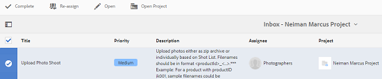

# Creative Project e integración PIM {#creative-project-and-pim-integration}

Si es un experto en marketing o un profesional creativo, puede utilizar las herramientas de Creative Project en Adobe Experience Manager AEM () para administrar la fotografía de productos relacionada con el comercio electrónico y los procesos creativos asociados dentro de su organización.

Puede utilizar Creative Project para racionalizar las siguientes tareas en el flujo de trabajo de la sesión fotográfica:

* Creación de una solicitud de sesión fotográfica
* Carga de una sesión fotográfica
* Colaborar en una sesión fotográfica
* Recursos aprobados para el empaquetado

>[!NOTE]
>
>Consulte [Funciones de usuario del proyecto](/help/sites-authoring/projects.md#user-roles-in-a-project) para obtener información sobre la asignación de funciones de usuario y flujos de trabajo a ciertos tipos de usuarios.

## Flujos de trabajo de sesión fotográfica del producto  {#exploring-product-photo-shoot-workflows}

Creative Project ofrece varias plantillas de proyecto para cumplir los distintos requisitos del proyecto. La plantilla **Proyecto de sesión fotográfica del producto** está disponible y lista para usar. Esta plantilla incluye los flujos de trabajo de la sesión fotográfica que le permiten iniciar y administrar las solicitudes de sesión fotográfica del producto. También incluye una serie de tareas que le permiten obtener las imágenes digitales para los productos a través de procesos de revisión y aprobación apropiados.

## Crear un proyecto de sesión fotográfica de producto {#create-a-product-photo-shoot-project}

1. En el **Proyectos** consola, toque o haga clic en **Crear** y luego elija **Crear proyecto** de la lista.

   

1. En el **Crear proyecto** , seleccione la **Proyecto de sesión fotográfica del producto** y toque o haga clic en **Siguiente**.

   

1. Introduzca los detalles del proyecto, incluido el título, la descripción y la fecha de caducidad. Añada usuarios y asígneles diversas funciones. También puede añadir una miniatura para el proyecto.

   

1. Haga clic o pulse en **Crear**. Un mensaje de confirmación notifica que el proyecto se ha creado.
1. Haga clic o pulse **Listo** para volver a la **Proyectos** consola. También puede tocar o hacer clic en **Abrir** para ver los recursos del proyecto.

## Comenzar a trabajar en un proyecto de sesión fotográfica del producto {#starting-work-in-a-product-photo-shoot-project}

Para iniciar una solicitud de sesión fotográfica, toque o haga clic en un proyecto y luego toque o haga clic en **Añadir trabajo** en la página de detalles del proyecto para iniciar un flujo de trabajo.


A **Proyecto de sesión fotográfica del producto** incluye los siguientes flujos de trabajo predeterminados:

* **Flujo de trabajo de la sesión fotográfica del producto (integración comercial)**: este flujo de trabajo aprovecha la integración comercial con el sistema de administración de la información del producto (PIM) para generar automáticamente una lista de tomas para los productos seleccionados (jerarquía). Puede ver los datos del producto como parte de los metadatos de recursos una vez completado el flujo de trabajo.
* **Flujo de trabajo de sesión fotográfica del producto**: Este flujo de trabajo permite proporcionar una lista de tomas en lugar de depender de la integración comercial. Asigna las imágenes cargadas en un archivo CSV de la carpeta de recursos del proyecto.

Utilice el **Sesión fotográfica del producto (integración comercial)** AEM flujo de trabajo para asignar recursos de imagen con los productos en la. Este flujo de trabajo aprovecha la integración comercial para vincular las imágenes aprobadas a los datos de productos existentes en la ubicación `/etc/commerce`.

El **Sesión fotográfica del producto (integración comercial)** El flujo de trabajo de incluye las siguientes tareas:

* Crear lista de tomas
* Cargar sesión fotográfica
* Retocar sesión fotográfica
* Revisar y aprobar
* Mover a la tarea de producción

AEM Si la información del producto no está disponible en la documentación de la aplicación, utilice la variable de configuración de la aplicación **Sesión fotográfica del producto** flujo de trabajo para asignar recursos de imagen a los productos en función de los detalles que cargue en un archivo CSV. El archivo CSV debe contener información del producto básica, como el identificador, la categoría y una descripción del producto. El flujo de trabajo obtiene recursos aprobados para los productos.

Este flujo de trabajo incluye las tareas siguientes:

* Cargar lista de tomas
* Cargar sesión fotográfica
* Retocar sesión fotográfica
* Revisar y aprobar
* Mover a la tarea de producción

Puede personalizar este flujo de trabajo mediante la opción de configuración de flujo de trabajo.

Ambos flujos de trabajo incluyen pasos para vincular productos a los recursos aprobados. Cada flujo de trabajo incluye los pasos siguientes:

* Configuración de flujo de trabajo: describe las opciones para personalizar el flujo de trabajo.
* Inicio de un flujo de trabajo de proyecto: explica cómo iniciar una sesión fotográfica del producto
* Información sobre las tareas de flujo de trabajo: proporciona información sobre las tareas disponibles en el flujo de trabajo.

## Seguimiento del progreso del proyecto {#tracking-project-progress}

Para realizar un seguimiento del progreso de un proyecto, puede controlar las tareas activas/terminadas de un proyecto.

Utilice la información siguiente para controlar el progreso de un proyecto:

* Tarjeta de la tarea
* Lista de tareas

La tarjeta de tareas muestra el progreso general del proyecto. Aparece en la página de detalles del proyecto sólo si el proyecto tiene tareas relacionadas. La tarjeta de tareas muestra el estado de finalización actual del proyecto en función del número de tareas completadas. No incluye las tareas futuras.

La tarjeta de tareas proporciona los siguientes detalles:

* Porcentaje de tareas activas
* Porcentaje de tareas completadas


La lista de tareas proporciona información detallada sobre la tarea de flujo de trabajo activa actualmente para el proyecto. Para mostrar la lista, toque o haga clic en la tarjeta de tareas. La lista de tareas también muestra metadatos como la fecha de inicio, la fecha de vencimiento, el usuario asignado, la prioridad y el estado de la tarea.


## Configuración de flujo de trabajo {#workflow-configuration}

Esta tarea consiste en asignar pasos del flujo de trabajo a los usuarios según sus funciones.

Para configurar el flujo de trabajo de la **sesión fotográfica del producto**:

1. Vaya a **Herramientas** > **Flujos de trabajo** y, a continuación, pulse el botón **Modelos** mosaico para abrir **Modelos de flujo de trabajo** página.
1. Seleccione el **Sesión fotográfica del producto** y, a continuación, pulse el botón **Editar** en la barra de herramientas para abrirlo en modo de edición.

   

1. En el **Flujo de trabajo de sesión fotográfica del producto** , abra una tarea de proyecto. Por ejemplo, abra la tarea **Cargar lista de tomas**.

   

1. Haga clic o pulse en **Tarea** para configurar lo siguiente:

   * Nombre de la tarea.
   * Usuario predeterminado (función) que recibe la tarea.
   * Prioridad predeterminada de la tarea, que se muestra en la lista de tareas del usuario.
   * Descripción de una tarea que se mostrará cuando el usuario asignado abra la tarea.
   * Fecha de caducidad de una tarea, que se calcula en función del momento en que la tarea comenzó.

1. Haga clic en **OK** para guardar las opciones de configuración.

Puede configurar las tareas adicionales para el **Sesión fotográfica del producto** flujo de trabajo de forma similar.

Siga los mismos pasos para configurar las tareas de la **Flujo de trabajo de la sesión fotográfica del producto (integración comercial)**.

## Iniciar un flujo de trabajo del proyecto {#starting-a-project-workflow}

En esta sección se describe cómo integrar la administración de la información del producto en su proyecto creativo.

1. Vaya al proyecto de sesión fotográfica de un producto y toque o haga clic en **Añadir trabajo** en el menú **Flujos de trabajo** Tarjeta de.
1. Seleccione el **Sesión fotográfica del producto (integración comercial)** tarjeta de flujo de trabajo para iniciar **Sesión fotográfica del producto (integración comercial)** flujo de trabajo. Si la información del producto no está disponible en `/etc/commerce`, seleccione la **Sesión fotográfica del producto** flujo de trabajo e inicio del **Sesión fotográfica del producto** flujo de trabajo.

   

1. Haga clic o pulse **Siguiente** para iniciar el flujo de trabajo en el proyecto.
1. Introduzca la información del flujo de trabajo en la página siguiente.

   

1. Haga clic o pulse **Enviar** para iniciar el flujo de trabajo de la sesión fotográfica. Se muestra la página de información del proyecto para el proyecto de sesión fotográfica.

   

### Información de las tareas de flujo de trabajo {#workflow-tasks-details}

El flujo de trabajo de la sesión fotográfica incluye varias tareas. Cada una de ellas se asigna a un grupo de usuarios en función de la configuración definida para la tarea.

#### Tarea Crear lista de tomas {#create-shot-list-task}

La tarea **Crear lista de tomas** permite al propietario del proyecto seleccionar los productos para los que se requieren imágenes. De acuerdo con la opción seleccionada por el usuario, se genera un archivo CSV que contiene la información del producto básica.

1. En la carpeta del proyecto, toque o haga clic en el botón de puntos suspensivos en la parte inferior derecha de la [Tarjeta de tareas](#tracking-project-progress) para ver el elemento de tarea en el flujo de trabajo.

   

1. Seleccione el **Crear lista de tomas** y, a continuación, pulse o haga clic en **Abrir** de la barra de herramientas.

   

1. Revise la información de la tarea y, a continuación, toque o haga clic en el botón **Crear lista de tomas**.

   

1. Seleccione los productos para los que existen datos del producto sin imágenes asociadas.

   

1. Haga clic o pulse en **Añadir a la lista de tomas** para crear un archivo CSV que contenga una lista de todos estos productos. Un mensaje confirma que se ha creado la lista de tomas para los productos seleccionados. Haga clic en **Cerrar** para completar el flujo de trabajo.

1. Después de crear una lista de tomas, se muestra el vínculo **Ver lista de tomas**. Para agregar más productos a la lista de tomas, toque o haga clic en **Añadir a la lista de tomas**. En este caso, los datos se añaden a la lista de tomas creada inicialmente.

   

1. Haga clic o pulse **Ver lista de tomas** para ver la nueva lista de tomas.

   

   Para editar los datos existentes o añadir datos nuevos, toque o haga clic en **Editar** en la barra de herramientas. Solo el **Producto **y **Descripción** Los campos de son editables.

   

   Después de actualizar el archivo, toque o haga clic en **Guardar** en la barra de herramientas para guardar el archivo.

1. Después de agregar los productos, toque o haga clic en **Completar** en el menú **Crear lista de tomas** página de detalles de la tarea para marcar la tarea como completada. Puede añadir un comentario opcional.

La finalización de la tarea presenta los siguientes cambios en el proyecto:

* Los recursos correspondientes a la jerarquía del producto se crean en una carpeta con el mismo nombre que el título del flujo de trabajo.
* Los metadatos para los recursos se convierten en editables mediante la consola Recursos, incluso antes de que el fotógrafo proporcione las imágenes.
* Se crea una carpeta de sesión fotográfica que almacena las imágenes que proporciona el fotógrafo. La carpeta de la sesión fotográfica contiene subcarpetas para cada entrada de producto de la lista de tomas.

### Tarea Cargar lista de tomas {#upload-shot-list-task}

Esta tarea forma parte del flujo de trabajo de la sesión fotográfica del producto. Esta tarea se realiza si la información del producto no está disponible en AEM. En este caso, se carga una lista de productos en un archivo CSV para el que se necesitan recursos de imagen. Según los detalles del archivo CSV, los recursos de imagen se asignan a los productos. El archivo debe ser un archivo CSV denominado `shotlist.csv`.

Utilice el vínculo **Ver lista de tomas** en la tarjeta del proyecto del procedimiento anterior para descargar un archivo CSV de muestra. Revise el archivo de muestra para saber cuál es el contenido habitual de un archivo CSV.

La lista de productos o el archivo CSV pueden contener campos, tales como **Categoría, Identificador del producto, Descripción** y **Ruta de acceso**. El campo **Identificador** es obligatorio y contiene el identificador del producto. Los demás campos son opcionales.

Un producto puede pertenecer a una categoría determinada. La categoría del producto puede aparecer en el CSV debajo de la columna **Categoría**. El campo **Producto** contiene el nombre del producto. En el campo **Descripción**, introduzca la descripción del producto o las instrucciones para el fotógrafo.

1. En la carpeta del proyecto, toque o haga clic en el botón de puntos suspensivos en la parte inferior derecha de la [Tarjeta de tareas](#tracking-project-progress) para ver la lista de tareas del flujo de trabajo.
1. Seleccione el **Cargar lista de tomas** y, a continuación, toque o haga clic en **Abrir** de la barra de herramientas.

   

1. Revise los detalles de la tarea y toque o haga clic en **Cargar lista de tomas** botón.

   

1. Haga clic o pulse en **Cargar lista de tomas** para cargar el archivo CSV. El flujo de trabajo reconoce este archivo como origen que se utilizará para extraer los datos del producto para la tarea siguiente.
1. Cargue un archivo CSV que contenga la información del producto en el formato adecuado. El **Ver recursos cargados** El vínculo aparece en la tarjeta de después de cargar el archivo CSV.

   

   Haga clic en **Completar** para completar la tarea.

1. Pulse o haga clic en **Completar** para completar la tarea.

### Tarea Cargar sesión fotográfica {#upload-photo-shoot-task}

Si es editor, puede cargar capturas de los productos enumerados en la **shotlist.csv** que se crea o se carga en la tarea anterior.

El nombre de las imágenes que se van a cargar debe comenzar por `<ProductId_>` donde `ProductId` se hace referencia a desde el **Id** en el campo `shotlist.csv` archivo. Por ejemplo, para un producto de la lista de tomas con **Id** `397122`, cargaría archivos con nombres `397122_highcontrast.jpg`, `397122_lowlight.png`, etc.

Puede cargar las imágenes directamente o cargar un archivo ZIP que contenga las imágenes. En función de sus nombres, las imágenes se colocan dentro de las respectivas carpetas de producto dentro de la carpeta de la sesión fotográfica.

1. En la carpeta del proyecto, toque o haga clic en el botón de puntos suspensivos en la parte inferior derecha de la [Tarjeta de tarea](#tracking-project-progress) para ver el elemento de tarea en el flujo de trabajo.
1. Seleccione el **Cargar sesión fotográfica** y, a continuación, toque o haga clic en **Abrir** de la barra de herramientas.

   

1. Haga clic o pulse **Cargar sesión fotográfica** y cargue las imágenes de la sesión fotográfica.
1. Haga clic o pulse en **Completar** de la barra de herramientas para completar la tarea.

### Tarea Retocar sesión fotográfica {#retouch-photo-shoot-task}

Si tiene derechos de edición, realice la **Retocar la sesión fotográfica** para editar las imágenes cargadas en la carpeta de la sesión fotográfica.

1. En la carpeta del proyecto, toque o haga clic en el botón de puntos suspensivos en la parte inferior derecha de la [Tarjeta de tarea](#tracking-project-progress) para ver el elemento de tarea en el flujo de trabajo.
1. Seleccione el **Retocar la sesión fotográfica** y, a continuación, pulse o haga clic en **Abrir** de la barra de herramientas.

   

1. Haga clic o pulse en **Ver recursos cargados** vínculo en el **Retocar la sesión fotográfica** para examinar las imágenes cargadas.

   

   Si es necesario, edite las imágenes mediante una aplicación de Adobe Creative Cloud.

   

1. Haga clic o pulse en **Completar** de la barra de herramientas para completar la tarea.

### Revisar y aprobar la tarea {#review-and-approve-task}

En esta tarea, las imágenes de la sesión fotográfica cargadas por un fotógrafo se revisan y se marcan como aprobadas para usarse.

1. En la carpeta del proyecto, toque o haga clic en el botón de puntos suspensivos en la parte inferior derecha de la [Tarjeta de tarea](#tracking-project-progress) para ver el elemento de tarea en el flujo de trabajo.
1. Seleccione el **Revisar y aprobar** y, a continuación, toque o haga clic en **Abrir** de la barra de herramientas.

   

1. En el **Revisar y aprobar** , asigne la tarea de revisión a un rol y, a continuación, toque o haga clic en **Revisar** para empezar a revisar las imágenes de producto cargadas.

   

1. Seleccione una imagen de producto y toque o haga clic en **Aprobar** en la barra de herramientas para marcarlo como aprobado. Una vez aprobada una imagen, se muestra sobre ella un letrero aprobado.

   

1. Haga clic o pulse **Completar**. Las imágenes aprobadas están vinculados a los recursos vacíos que se han creado.

Puede dejar algunos productos sin ninguna imagen. Más adelante, puede volver a visitar la tarea y marcarla como completada cuando haya terminado.

Puede navegar a los recursos del proyecto a través de la IU de Recursos y verificar las imágenes aprobadas.

Toque o haga clic en el siguiente nivel para ver los productos según la jerarquía de datos del producto.

Creative Project asocia los recursos aprobados al producto utilizado como referencia. Los metadatos de recursos se actualizan con la referencia del producto y la información básica en la pestaña **Datos del producto**; en las propiedades de recursos, aparecen en la sección Metadatos de recursos de AEM.

>[!NOTE]
>
>En el **Flujo de trabajo de sesión fotográfica del producto** (sin integración comercial), las imágenes aprobadas no tienen ninguna asociación con los productos.

### Mover a la tarea de producción {#move-to-production-task}

Esta tarea mueve los recursos aprobados a la carpeta lista para la producción para que estén disponibles para usarse.

1. En la carpeta del proyecto, toque o haga clic en el botón de puntos suspensivos en la parte inferior derecha de la [Tarjeta de tarea](#tracking-project-progress) para ver el elemento de tarea en el flujo de trabajo.
1. Seleccione el **Mover a producción** y, a continuación, toque o haga clic en **Abrir** de la barra de herramientas.

   

1. Para ver los recursos aprobados de la sesión fotográfica antes de moverlos a la carpeta lista para la producción, haga clic en el vínculo **Ver recursos aprobados** debajo de la miniatura del proyecto en la página de la tarea **Mover a producción**.

   

1. Introduzca la ruta de la carpeta lista para la producción en la **Mover a** field.

   

1. Haga clic o pulse **Mover a producción**. Cierre el mensaje de confirmación. Los recursos se mueven a la ruta mencionada y se crea automáticamente un conjunto de giros para los recursos aprobados para cada producto en función de la jerarquía de carpetas.

1. Toque o haga clic en el icono **Completar** de la barra de herramientas. El flujo de trabajo termina cuando el último paso se marca como completado.

## Visualización de los metadatos de recursos DAM {#viewing-dam-asset-metadata}

Una vez los apruebe, los recursos se vinculan a los productos correspondientes. La [página de propiedades](/help/assets/manage-assets.md#editing-properties) de los recursos aprobados ahora tiene una pestaña **Datos de producción (información del producto vinculada)** adicional. En esta pestaña se muestra la información del producto, el número de SKU y otros datos relacionados con el producto que vinculan el recurso. Haga clic o pulse en **Editar** para actualizar una propiedad de recurso. La información relacionada con el producto es de solo lectura.

Toque o haga clic en el vínculo que aparece para ir a la página de detalles del producto correspondiente en la consola de producto con la que está asociado el recurso.

## Personalizar los flujos de trabajo de la sesión fotográfica del proyecto {#customizing-the-project-photo-shoot-workflows}

Puede personalizar la variable **Sesión fotográfica del proyecto** flujos de trabajo basados en sus necesidades. Esta es una tarea opcional, basada en las funciones, que se lleva a cabo para establecer el valor de una variable dentro del proyecto. Posteriormente, se puede utilizar el valor configurado para tomar una decisión.

1. AEM Pulse o haga clic en el logotipo de la y, a continuación, vaya a **Herramientas** > **Flujo de trabajo** > **Modelos** para abrir **Modelos de flujo de trabajo** página.
1. Seleccione el **Sesión fotográfica del producto (integración comercial)** flujo de trabajo para **Sesión fotográfica del producto** y pulse o haga clic en **Editar** en la barra de herramientas para abrir el flujo de trabajo en modo de edición.
1. Abra el panel lateral y busque **Crear tarea de proyecto basada en roles** y arrástrelo al flujo de trabajo.

   

1. Abra el **Tarea basada en roles** paso.
1. En el **Tarea** pestaña, proporcione un nombre para la tarea que se mostrará en la lista de tareas. También puede asignar la tarea a un rol, establecer la prioridad predeterminada, proporcionar una descripción y especificar una hora en la que vence la tarea.

   

1. En el **Enrutamiento** , especifique las acciones de la tarea. Para agregar varias acciones, toque o haga clic en **Agregar elemento** vínculo.

   

1. Después de añadir las opciones, haga clic en **OK** para agregar los cambios al paso.

1. De nuevo en **Modelo de flujo de trabajo** toque o haga clic en ventana **Sincronización** para guardar los cambios de todo el flujo de trabajo. Toque o haga clic **OK** para el paso no guarda los cambios en el flujo de trabajo. Para guardar los cambios en el flujo de trabajo, toque o haga clic en **Sincronización**.

1. Abra el panel lateral y busque **Paso Ir a** y arrástrelo al flujo de trabajo.

1. Abra el **Ir a** y toque o haga clic en **Proceso** pestaña.

1. Seleccione el **Paso de destino** para ir a y especificar que la variable **Expresión de enrutamiento** es un script ECMA. A continuación, proporcione el siguiente código en **Script** campo:

   ```javascript
   function check() {
   
   if (workflowData.getMetaDataMap().get("lastTaskAction","") == "Reject All") {
   
   return true
   
   }
   
   // set copywriter user in metadata
   
   var previousId = workflowData.getMetaDataMap().get("lastTaskCompletedBy", "");
   
   workflowData.getMetaDataMap().put("copywriter", previousId);
   
   return false;
   
   }
   ```

   >[!TIP]
   >
   >Para obtener más información sobre los scripts en los pasos del flujo de trabajo, consulte [Definición de una regla para una división O](/help/sites-developing/workflows-models.md).

   

1. Haga clic o pulse **OK**.

1. Haga clic o pulse **Sincronización** para guardar el flujo de trabajo.

Ahora aparece una nueva tarea después de [Mover a la tarea de producción](#move-to-production-task) se completa y se asigna al propietario.

El usuario en la **Propietario** Esta función puede completar la tarea y seleccionar una acción (de la lista de acciones añadidas en las configuraciones de paso del flujo de trabajo) en la lista de la ventana emergente de comentarios.

>[!NOTE]
>
>Cuando se inicia un servidor, el servlet de lista de tareas de Project almacena en caché las asignaciones entre tipos de tareas y direcciones URL definidas en `/libs/cq/core/content/projects/tasktypes`. A continuación, puede realizar la superposición habitual y agregar tipos de tareas personalizadas colocándolos debajo de `/apps/cq/core/content/projects/tasktypes`.
