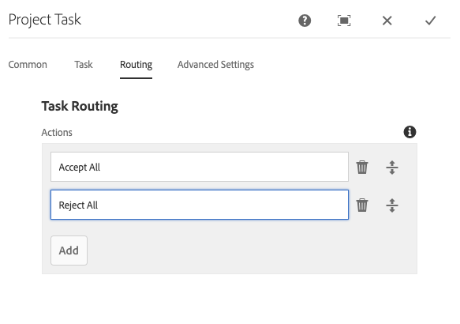

# Integración de Creative Project y PIM {#creative-project-and-pim-integration}

Si es un experto en marketing o un profesional creativo, puede utilizar las herramientas de Creative Project en Adobe Experience Manager (AEM) para administrar la fotografía de productos relacionada con el comercio electrónico y los procesos creativos asociados dentro de su organización.

Puede utilizar Creative Project para optimizar las siguientes tareas del flujo de trabajo de la sesión fotográfica:

* Generación de una solicitud de sesión fotográfica
* Carga de una sesión fotográfica
* Colaboración en una sesión fotográfica
* Empaquetando recursos aprobados

>[!NOTE]
>
>Consulte [Funciones de usuario del proyecto para obtener información](/help/sites-authoring/projects.md#user-roles-in-a-project) sobre la asignación de funciones de usuario y flujos de trabajo a determinados tipos de usuarios.

## Flujos de trabajo de sesión fotográfica del producto  {#exploring-product-photo-shoot-workflows}

Creative Project proporciona varias plantillas de proyecto para satisfacer los distintos requisitos del proyecto. La plantilla **Proyecto de sesión fotográfica de producto** está disponible de forma predeterminada. Esta plantilla incluye flujos de trabajo de sesión fotográfica que le permiten iniciar y administrar solicitudes de sesión fotográfica de productos. También incluye una serie de tareas que le permiten obtener imágenes digitales para los productos a través de procesos de revisión y aprobación adecuados.

## Crear un proyecto de sesión fotográfica de producto {#create-a-product-photo-shoot-project}

1. En la consola **Proyectos**, haga clic en **Crear** y, a continuación, elija **Crear proyecto** en la lista.

   

1. En la página **Crear proyecto**, seleccione la plantilla **Proyecto de sesión fotográfica de producto** y haga clic en **Siguiente**.

   

1. Escriba los detalles del proyecto, incluido el título, la descripción y la fecha de vencimiento. Agregue usuarios y asígneles diversas funciones. También puede agregar una miniatura para el proyecto.

   

1. Haga clic en **Crear**. Un mensaje de confirmación notifica que se ha creado el proyecto.
1. Haga clic en **Listo** para volver a la consola **Proyectos**. También puede hacer clic en **Abrir** para ver los recursos del proyecto.

## Iniciar el trabajo en un proyecto de sesión fotográfica de producto {#starting-work-in-a-product-photo-shoot-project}

Para iniciar una solicitud de sesión fotográfica, haga clic en un proyecto y luego en **Agregar trabajo** dentro de la página de detalles del proyecto para iniciar un flujo de trabajo.


Un **proyecto de sesión fotográfica de producto** incluye los siguientes flujos de trabajo predeterminados:

* **Flujo de trabajo de sesión fotográfica del producto (integración de Commerce)**: este flujo de trabajo utiliza la integración comercial con el sistema de administración de la información del producto (PIM) para generar automáticamente una lista de tomas para los productos seleccionados (jerarquía). Una vez completado el flujo de trabajo, puede ver los datos del producto como parte de los metadatos del recurso.
* **Flujo de trabajo de sesión fotográfica del producto**: este flujo de trabajo le permite proporcionar una lista de tomas en lugar de depender de la integración comercial. Asigna las imágenes cargadas a un archivo CSV en la carpeta de recursos del proyecto.

Utilice la sesión fotográfica de **producto (integración de Commerce)** para asignar recursos de imagen con los productos de AEM. Este flujo de trabajo utiliza la integración comercial para vincular las imágenes aprobadas a los datos de productos existentes en la ubicación `/etc/commerce`.

El flujo de trabajo **Sesión fotográfica del producto (integración de Commerce)** incluye las siguientes tareas:

* Crear lista de tomas
* Cargar sesión fotográfica
* Retocar la sesión fotográfica
* Revisar y aprobar
* Mover a la tarea de producción

Si la información del producto no está disponible en AEM, utilice el flujo de trabajo **Sesión fotográfica del producto** para asignar recursos de imagen con los productos en función de los detalles que cargue en un archivo CSV. El archivo CSV debe contener información básica del producto, como el ID del producto, la categoría y la descripción. El flujo de trabajo recupera los recursos aprobados para los productos.

Este flujo de trabajo incluye las siguientes tareas:

* Cargar lista de tomas
* Cargar sesión fotográfica
* Retocar la sesión fotográfica
* Revisar y aprobar
* Mover a la tarea de producción

Puede personalizar este flujo de trabajo mediante la opción de configuraciones del flujo de trabajo.

Ambos flujos de trabajo incluyen pasos para vincular productos con sus recursos aprobados. Cada flujo de trabajo incluye los siguientes pasos:

* Configuración del flujo de trabajo: describe las opciones para personalizar el flujo de trabajo
* Inicio de un flujo de trabajo de proyecto: explica cómo iniciar una sesión fotográfica del producto
* Detalles de tareas de flujo de trabajo: proporciona detalles de las tareas disponibles en el flujo de trabajo

## Seguimiento del progreso del proyecto {#tracking-project-progress}

Puede realizar un seguimiento del progreso de un proyecto controlando las tareas activas o completadas dentro de un proyecto.

Utilice lo siguiente para monitorizar el progreso de un proyecto:

* Tarjeta de tarea
* Lista de tareas

La tarjeta de tareas muestra el progreso general del proyecto. Aparece en la página de detalles del proyecto sólo si el proyecto tiene tareas relacionadas. La tarjeta de tareas muestra el estado de finalización actual del proyecto en función del número de tareas completadas. No incluye tareas futuras.

La tarjeta de tareas proporciona los siguientes detalles:

* Porcentaje de tareas activas
* Porcentaje de tareas completadas


La lista de tareas proporciona información detallada sobre la tarea de flujo de trabajo activa actualmente para el proyecto. Para mostrar la lista, haga clic en la tarjeta de tareas. La lista de tareas también muestra metadatos como la fecha de inicio, la fecha de vencimiento, el usuario asignado, la prioridad y el estado de la tarea.


## Configuración del flujo de trabajo {#workflow-configuration}

Esta tarea implica asignar pasos del flujo de trabajo a los usuarios según sus funciones.

Para configurar el flujo de trabajo **Sesión fotográfica del producto**:

1. Vaya a **Herramientas** > **Flujos de trabajo** y, a continuación, seleccione el mosaico **Modelos** para abrir la página **Modelos de flujo de trabajo**.
1. Seleccione el flujo de trabajo **Sesión fotográfica del producto** y luego seleccione el icono **Editar** de la barra de herramientas para abrirlo en modo de edición.

   

1. En la página **Flujo de trabajo de sesión fotográfica del producto**, abra una tarea de proyecto. Por ejemplo, abra la tarea **Cargar lista de tomas**.

   

1. Haga clic en la ficha **Tarea** para configurar lo siguiente:

   * Nombre de la tarea
   * Usuario (función) predeterminado que recibe la tarea
   * Prioridad predeterminada de la tarea, que se muestra en la lista de tareas del usuario
   * Descripción de tarea que se mostrará cuando el usuario asignado abra la tarea
   * Fecha de vencimiento para una tarea, que se calcula según la hora en que se inició la tarea

1. Haga clic en **Aceptar** para guardar la configuración.

Puede configurar las tareas adicionales para el flujo de trabajo **Sesión fotográfica del producto** de manera similar.

Siga los mismos pasos para configurar las tareas del **flujo de trabajo de la sesión fotográfica del producto (integración de Commerce)**.

## Iniciar un flujo de trabajo de proyecto {#starting-a-project-workflow}

En esta sección se describe cómo integrar la administración de la información del producto con el proyecto creativo.

1. Vaya a un proyecto de sesión fotográfica del producto y haga clic en el icono **Agregar trabajo** de la tarjeta **Flujos de trabajo**.
1. Seleccione la tarjeta de flujo de trabajo **Sesión fotográfica del producto (integración de Commerce)** para iniciar el flujo de trabajo **Sesión fotográfica del producto (integración de Commerce)**. Si la información del producto no está disponible en `/etc/commerce`, seleccione el flujo de trabajo **Sesión fotográfica del producto** e inicie el flujo de trabajo **Sesión fotográfica del producto**.

   

1. Haga clic en **Siguiente** para iniciar el flujo de trabajo en el proyecto.
1. Introduzca los detalles del flujo de trabajo en la página siguiente.

   

1. Haga clic en **Enviar** para iniciar el flujo de trabajo de la sesión fotográfica. Se muestra la página de detalles del proyecto para el proyecto de la sesión fotográfica.

   

### Detalles de tareas de flujo de trabajo {#workflow-tasks-details}

El flujo de trabajo de la sesión fotográfica incluye varias tareas. Cada tarea se asigna a un grupo de usuarios en función de la configuración definida para la tarea.

#### Crear tarea de lista de tomas {#create-shot-list-task}

La tarea **Crear lista de tomas** permite al propietario del proyecto seleccionar los productos para los que se requieren imágenes. En función de la opción seleccionada por el usuario, se genera un archivo CSV que contiene información básica del producto.

1. En la carpeta del proyecto, haga clic en el botón de puntos suspensivos en la parte inferior derecha de [Tarjeta de tareas](#tracking-project-progress) para ver el elemento de tarea en el flujo de trabajo.

   

1. Seleccione la tarea **Crear lista de tomas** y luego haga clic en el icono **Abrir** de la barra de herramientas.

   

1. Revisa los detalles de la tarea y haz clic en el botón **Crear lista de tomas**.

   

1. Seleccione productos para los que existen datos de productos sin imágenes asociadas.

   

1. Haga clic en el botón **Agregar a la lista de tomas** para crear un archivo CSV que contenga una lista de todos esos productos. Un mensaje confirma que la lista de tomas se ha creado para los productos seleccionados. Haga clic en **Cerrar** para completar el flujo de trabajo.

1. Después de crear una lista de tomas, aparece el vínculo **Ver lista de tomas**. Para agregar más productos a la lista de tomas, haz clic en **Agregar a la lista de tomas**. En este caso, los datos se anexan a la lista de tomas creada inicialmente.

   

1. Haga clic en **Ver lista de tomas** para ver la nueva lista de tomas.

   

   Para editar los datos existentes o agregar nuevos datos, haz clic en **Editar** en la barra de herramientas. Solo se pueden editar los campos **Product &#x200B;** y **Description**.

   

   Después de actualizar el archivo, haz clic en **Guardar** en la barra de herramientas para guardar el archivo.

1. Después de agregar los productos, haz clic en el icono **Completar** de la página de detalles de la tarea **Crear lista de tomas** para marcar la tarea como completada. Puede agregar un comentario opcional.

La finalización de la tarea introduce los siguientes cambios dentro del proyecto:

* Los Assets correspondientes a la jerarquía de productos se crean en una carpeta con el mismo nombre que el título del flujo de trabajo.
* Los metadatos de los recursos se pueden editar mediante la consola de Assets, incluso antes de que el fotógrafo proporcione las imágenes.
* Se crea una carpeta de sesión fotográfica que almacena las imágenes que proporciona el fotógrafo. La carpeta de la sesión fotográfica contiene subcarpetas para cada entrada de producto de la lista de tomas.

### Cargar tarea de lista de tomas {#upload-shot-list-task}

Esta tarea forma parte del flujo de trabajo Sesión fotográfica del producto. Esta tarea se realiza si la información del producto no está disponible en AEM. En este caso, se carga una lista de productos en un archivo CSV para los que se requieren recursos de imagen. Según los detalles del archivo CSV, los recursos de imagen se asignan a los productos. El archivo debe ser un archivo CSV denominado `shotlist.csv`.

Use el vínculo **Ver lista de tomas** de la tarjeta de proyecto del procedimiento anterior para descargar un archivo CSV de ejemplo. Revise el archivo de muestra para conocer el contenido habitual de un archivo CSV.

La lista de productos o el archivo CSV pueden contener campos como **Categoría, Producto, Id, Descripción** y **Ruta**. El campo **Id** es obligatorio y contiene el ID del producto. Los demás campos son opcionales.

Un producto puede pertenecer a una categoría en particular. La categoría del producto se puede enumerar en el archivo CSV debajo de la columna **Category**. El campo **Producto** contiene el nombre del producto. En el campo **Descripción**, escriba la descripción del producto o las instrucciones para el fotógrafo.

1. En la carpeta del proyecto, haga clic en el botón de puntos suspensivos en la parte inferior derecha de [Tarjeta de tareas](#tracking-project-progress) para ver la lista de tareas en el flujo de trabajo.
1. Seleccione la tarea **Cargar lista de tomas** y, a continuación, haga clic en el icono **Abrir** de la barra de herramientas.

   

1. Revisa los detalles de la tarea y haz clic en el botón **Cargar lista de tomas**.

   

1. Haga clic en el botón **Cargar lista de tomas** para cargar el archivo CSV. El flujo de trabajo reconoce este archivo como un origen que se utilizará para extraer los datos del producto para la siguiente tarea.
1. Cargue un archivo CSV que contenga información del producto en el formato adecuado. El vínculo **Ver Assets cargado** aparece en la tarjeta después de cargar el archivo CSV.

   

   Haga clic en el icono **Completar** para completar la tarea.

1. Haga clic en el icono **Completar** para completar la tarea.

### Cargar tarea de sesión fotográfica {#upload-photo-shoot-task}

Si es editor, puede cargar las tomas de los productos enumerados en el archivo **shotlist.csv** que se creó o subió en la tarea anterior.

El nombre de las imágenes que se van a cargar debe comenzar con `<ProductId_>`, donde se hace referencia a `ProductId` desde el campo **Id** en el archivo `shotlist.csv`. Por ejemplo, para un producto de la lista de tomas con **Id** `397122`, cargaría archivos con los nombres `397122_highcontrast.jpg`, `397122_lowlight.png`, etc.

Puede cargar las imágenes directamente o cargar un archivo ZIP que contenga las imágenes. En función de sus nombres, las imágenes se colocan dentro de las respectivas carpetas de producto dentro de la carpeta de la sesión fotográfica.

1. En la carpeta del proyecto, haga clic en el botón de puntos suspensivos en la parte inferior derecha de [Task Card](#tracking-project-progress) para ver el elemento de tarea en el flujo de trabajo.
1. Seleccione la tarea **Cargar sesión fotográfica** y, a continuación, haga clic en el icono **Abrir** de la barra de herramientas.

   

1. Haga clic en **Cargar sesión fotográfica** y cargue las imágenes de la sesión fotográfica.
1. Haga clic en el icono **Completar** de la barra de herramientas para completar la tarea.

### Retocar tarea de sesión fotográfica {#retouch-photo-shoot-task}

Si tiene derechos de edición, realice la tarea **Retocar sesión fotográfica** para editar las imágenes cargadas en la carpeta de la sesión fotográfica.

1. En la carpeta del proyecto, haga clic en el botón de puntos suspensivos en la parte inferior derecha de [Task Card](#tracking-project-progress) para ver el elemento de tarea en el flujo de trabajo.
1. Seleccione la tarea **Retocar sesión fotográfica** y, a continuación, haga clic en el icono **Abrir** de la barra de herramientas.

   

1. Haga clic en el vínculo **Ver Assets cargado** en la página **Retocar sesión fotográfica** para examinar las imágenes cargadas.

   

   Si es necesario, edite las imágenes mediante una aplicación de Adobe Creative Cloud.

   

1. Haga clic en el icono **Completar** de la barra de herramientas para completar la tarea.

### Revisar y aprobar la tarea {#review-and-approve-task}

En esta tarea, se revisan las imágenes de la sesión fotográfica cargadas por un fotógrafo y se marcan las imágenes como aprobadas para su uso.

1. En la carpeta del proyecto, haga clic en el botón de puntos suspensivos en la parte inferior derecha de [Task Card](#tracking-project-progress) para ver el elemento de tarea en el flujo de trabajo.
1. Seleccione la tarea **Revisar y aprobar** y, a continuación, haga clic en el icono **Abrir** de la barra de herramientas.

   

1. En la página **Revisar y aprobar**, asigne la tarea de revisión a un rol y luego haga clic en **Revisar** para comenzar a revisar las imágenes de productos cargadas.

   

1. Seleccione una imagen de producto y haga clic en el icono **Aprobar** de la barra de herramientas para marcarla como aprobada. Una vez aprobada una imagen, aparece un banner aprobado sobre ella.

   

1. Haga clic en **Completar**. Las imágenes aprobadas se vinculan con los recursos vacíos creados.

Puede omitir algunos productos sin ninguna imagen. Más adelante, puede volver a visitar la tarea y marcarla como completada una vez completada.

Puede navegar a los recursos del proyecto mediante la interfaz de usuario de Assets y comprobar las imágenes aprobadas.

Haga clic en el nivel siguiente para ver los productos según la jerarquía de datos del producto.

Creative Project asocia los recursos aprobados con el producto de referencia. Los metadatos del recurso se actualizan con la referencia del producto y la información básica en la ficha **Datos del producto** en las propiedades del recurso, cuando aparecen en la sección Metadatos del recurso de AEM.

>[!NOTE]
>
>En el **flujo de trabajo de la sesión fotográfica del producto** (sin integración comercial), las imágenes aprobadas no tienen ninguna asociación con los productos.

### Mover a la tarea de producción {#move-to-production-task}

Esta tarea mueve los recursos aprobados a la carpeta lista para la producción para que estén disponibles para su uso.

1. En la carpeta del proyecto, haga clic en el botón de puntos suspensivos en la parte inferior derecha de [Task Card](#tracking-project-progress) para ver el elemento de tarea en el flujo de trabajo.
1. Seleccione la tarea **Mover a producción** y, a continuación, haga clic en el icono **Abrir** de la barra de herramientas.

   

1. Para ver los recursos aprobados para la sesión fotográfica antes de moverlos a la carpeta listo para la producción, haga clic en el vínculo **Ver Assets aprobado** situado debajo de la miniatura del proyecto en la página de tareas **Mover a producción**.

   

1. Escriba la ruta de la carpeta lista para la producción en el campo **Mover a**.

   

1. Haga clic en **Mover a producción**. Cierre el mensaje de confirmación. Los recursos se mueven a la ruta mencionada y se crea automáticamente un conjunto de giros para los recursos aprobados para cada producto en función de la jerarquía de carpetas.

1. Haga clic en el icono **Completar** de la barra de herramientas. El flujo de trabajo se completa cuando el último paso se marca como completado.

## Visualización de metadatos de recursos DAM {#viewing-dam-asset-metadata}

Después de la aprobación, los recursos se vinculan a los productos correspondientes. La [página de propiedades](/help/assets/manage-assets.md#editing-properties) de los recursos aprobados ahora tiene una ficha **Datos del producto** adicional (información del producto vinculada). Esta pestaña muestra los detalles del producto, el número de SKU y otros detalles relacionados con el producto que vinculan el recurso. Haga clic en el icono **Editar** para actualizar una propiedad de recurso. La información relacionada con el producto sigue siendo de solo lectura.

Haga clic en el vínculo que aparece para desplazarse a la página de detalles del producto correspondiente en la consola de producto con la que está asociado el recurso.

## Personalizar los flujos de trabajo de sesión fotográfica del proyecto {#customizing-the-project-photo-shoot-workflows}

Puede personalizar los flujos de trabajo de **Sesión fotográfica del proyecto** en función de sus necesidades. Es una tarea opcional basada en funciones que se realiza para establecer el valor de una variable dentro del proyecto. Posteriormente, puede utilizar el valor configurado para llegar a una decisión.

1. Haga clic en el logotipo de AEM y, a continuación, vaya a **Herramientas** > **Flujo de trabajo** > **Modelos** para abrir la página **Modelos de flujo de trabajo**.
1. Seleccione el flujo de trabajo **Sesión fotográfica del producto (integración de Commerce)** o el flujo de trabajo **Sesión fotográfica del producto** y haga clic en **Editar** en la barra de herramientas para abrir el flujo de trabajo en modo de edición.
1. Abra el panel lateral, busque el paso **Crear tarea de proyecto basada en roles** y arrástrelo al flujo de trabajo.

   

1. Abra el paso **Tarea basada en roles**.
1. En la ficha **Tarea**, proporcione un nombre para la tarea que se mostrará en la lista de tareas. También puede asignar la tarea a un rol, establecer la prioridad predeterminada, proporcionar una descripción y especificar una hora en la que vence la tarea.

   

1. En la ficha **Enrutamiento**, especifique las acciones de la tarea. Para agregar varias acciones, haga clic en el vínculo **Agregar elemento**.

   

1. Después de agregar las opciones, haga clic en **Aceptar** para agregar los cambios al paso.

1. En la ventana **Modelo de flujo de trabajo**, haga clic en **Sincronizar** para guardar los cambios de todo el flujo de trabajo. Al tocar o hacer clic en **Aceptar** para el paso, no se guardan los cambios en el flujo de trabajo. Para guardar los cambios en el flujo de trabajo, haz clic en **Sincronizar**.

1. Abra el panel lateral, busque el flujo de trabajo **Ir al paso** y arrástrelo al flujo de trabajo.

1. Abra la tarea **Ir a** y haga clic en la ficha **Proceso**.

1. Seleccione el **Paso de destino** al que dirigirse y especifique que la **Expresión de enrutamiento** es un script ECMA. Luego proporcione el siguiente código en el campo **Script**:

   ```javascript
   function check() {
   
   if (workflowData.getMetaDataMap().get("lastTaskAction","") == "Reject All") {
   
   return true
   
   }
   
   // set copywriter user in metadata
   
   var previousId = workflowData.getMetaDataMap().get("lastTaskCompletedBy", "");
   
   workflowData.getMetaDataMap().put("copywriter", previousId);
   
   return false;
   
   }
   ```

   >[!TIP]
   >
   >Para obtener más información sobre los scripts en los pasos del flujo de trabajo, consulte [Definición de una regla para una división OR](/help/sites-developing/workflows-models.md).

   

1. Haga clic en **OK**.

1. Haga clic en **Sincronizar** para guardar el flujo de trabajo.

Ahora aparece una nueva tarea después de que [Mover a la tarea de producción](#move-to-production-task) se complete y se asigne al propietario.

El usuario con el rol **Owner** puede completar la tarea y seleccionar una acción (de la lista de acciones agregadas en las configuraciones del paso del flujo de trabajo) en la lista de la ventana emergente de comentarios.

>[!NOTE]
>
>Cuando se inicia un servidor, el servlet de lista de tareas de Project almacena en caché las asignaciones entre los tipos de tareas y las direcciones URL definidas en `/libs/cq/core/content/projects/tasktypes`. A continuación, puede realizar la superposición habitual y agregar tipos de tareas personalizadas colocándolos bajo `/apps/cq/core/content/projects/tasktypes`.
