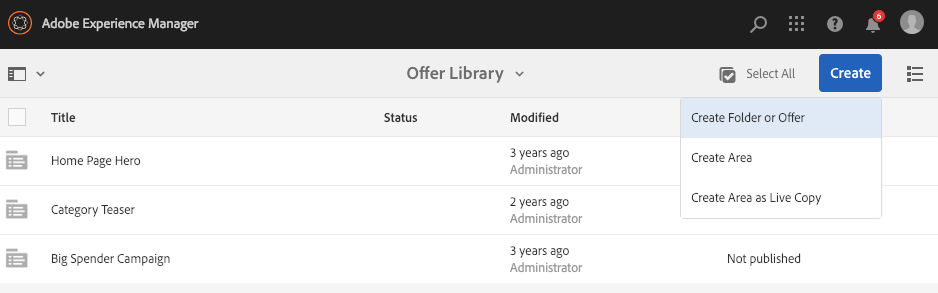

# Creación y administración de ofertas{#creating-and-managing-offers}

Utilice la consola Ofertas para crear ofertas que se pueden [usar en las experiencias de actividad](/help/sites-authoring/content-targeting-touch.md). La creación de ofertas en la consola Ofertas ahorra tiempo cuando varias experiencias requieren la misma oferta:

* Cree una oferta una vez en la biblioteca y utilícela en varias experiencias de las actividades de marca.
* Al cambiar la oferta en la biblioteca, el cambio afecta a todas las experiencias que la utilizan.

La consola Ofertas organiza las ofertas por marca. En cada marca se incluye una biblioteca de ofertas que se pueden utilizar en las experiencias de una marca. Utilice carpetas para definir una estructura jerárquica y organizar las ofertas en cada biblioteca. Una estructura lógica de carpetas permite a los autores buscar ofertas fácilmente. Además, las herramientas de etiquetado y búsqueda permiten a los autores buscar ofertas.

## Añadir una marca mediante la consola de ofertas {#add-a-brand-using-the-offers-console}

Cree una marca con la que asociar las ofertas. Abra una marca en la consola de ofertas para acceder a la biblioteca de ofertas, donde podrá crear carpetas y ofertas.

Cuando cree una marca mediante la consola de ofertas, esta también aparecerá en la [consola de actividades](/help/sites-authoring/activitylib.md) donde podrá añadir y administrar actividades para la marca.

1. En la consola de navegación, haga clic o pulse **Personalización** > **Ofertas**.

   

1. Click or tap **Create** and then **Create** **Brand**.
1. Seleccione la plantilla de marca y haga clic o pulse **Siguiente**.
1. Escriba un título para la marca tal y como desea que aparezca en las consolas de actividades y de ofertas. De forma opcional, escriba o seleccione una o más etiquetas para asociarlas a la marca.
1. Haga clic o pulse **Crear**.

## Añadir una carpeta a una biblioteca de ofertas {#add-a-folder-to-an-offer-library}

Añada una carpeta a la biblioteca de ofertas de una marca para organizar y para almacenar las ofertas. Puede crear una carpeta en la marca o en otras carpetas.

1. En la consola de ofertas, abra la ubicación en la que desea crear la carpeta. Por ejemplo, abra la marca para crear una carpeta de nivel superior o abra otra carpeta en la biblioteca.
1. Haga clic o pulse **Crear** > **Crear carpeta u oferta**.

   

1. Seleccione **Carpeta** y haga clic en **Siguiente**.
1. Escriba un título para la carpeta tal y como desea que aparezca en la biblioteca de ofertas y escriba o seleccione las etiquetas.

   

1. Haga clic o pulse **Crear**.

## Añadir una oferta a una biblioteca de ofertas {#add-an-offer-to-an-offer-library}

Añada una oferta a la biblioteca de ofertas de la marca para poder añadirla a las experiencias de la marca. Cuando se añade una oferta, es necesario escribir un título. También puede asociar la oferta a una o más etiquetas para incrementar la capacidad de búsqueda.

Una vez que haya creado la oferta, puede abrirla para la creación de contenido.

1. En la consola de ofertas, abra la ubicación en la que desea crear la oferta. Por ejemplo, abra la marca para crear una oferta de nivel superior o abra otra carpeta en la biblioteca.
1. Haga clic o pulse **Crear** > **Crear carpeta u oferta**.

   

1. Seleccione la plantilla **Página de oferta** y, a continuación, haga clic o pulse **Siguiente**.
1. Escriba un título para la oferta y, opcionalmente, seleccione o escriba una o varias etiquetas para asociarlas a la oferta; a continuación, haga clic o pulse **Crear**.
1. En el cuadro de diálogo de confirmación, para abrir la oferta y editarla, haga clic o pulse **Abrir página**.

## Editar una oferta {#editing-an-offer}

Abra una oferta y edite el contenido tal como desee que aparezca en las experiencias que lo utilizan. Cuando edite una oferta que se utilice en cualquier experiencia, los cambios se mostrarán en las experiencias.

Puede abrir una oferta desde una carpeta de una biblioteca de ofertas o desde los resultados de la búsqueda. También puede abrir una oferta desde una experiencia que use esa oferta.

1. En la consola de ofertas, haga clic o pulse el icono junto a la oferta y haga clic o pulse **Editar**.
1. Añada componentes a la oferta y edite el contenido del componente de la forma habitual.

## Eliminar una oferta {#deleting-an-offer}

Eliminar una oferta cuando ya no sea necesaria. Cuando intente eliminar una oferta que se usó en una experiencia, se le pedirá que confirme la eliminación. Confirmar esta opción eliminará la oferta y la quitará de las experiencias.

Puede eliminar una oferta a la vez que consulta el contenido de una carpeta en una biblioteca de ofertas, o busca resultados.

1. En la consola de ofertas, haga clic o pulse el icono junto a la oferta y haga clic o pulse **Eliminar**.

   Seleccione la oferta y haga clic o pulse **Eliminar**.

1. En el cuadro de diálogo que aparece, haga clic o pulse **Eliminar** para confirmar la eliminación.
1. Si la oferta se usa en una o más experiencias, aparece un cuadro de diálogo que indica que se hace referencia a la oferta:

   * Para eliminar la oferta y quitarla de las experiencias, haga clic o pulse **Forzar eliminación**.
   * Para mantener la oferta, haga clic o pulse **Cancelar**.

## Buscar ofertas {#searching-for-offers}

Busque las ofertas de cualquier marca mediante las palabras clave que coincidan con el título.

Los criterios de búsqueda actuales aparecen junto a los resultados de búsqueda. También puede ordenar los resultados según las columnas, en orden ascendente o descendente. Puede realizar una búsqueda desde cualquier carpeta de la biblioteca de ofertas. Los resultados de la búsqueda son los mismos independientemente de la carpeta actual.

Para buscar ofertas:

1. En la parte superior de la consola de ofertas, pulse o haga clic en el icono de la lupa. De forma predeterminada, la búsqueda se limita a las ofertas.
1. Especifique las palabras clave para buscar ofertas. Seleccione cualquiera de los resultados.
