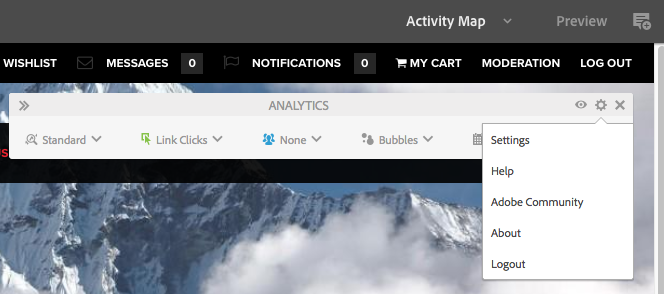
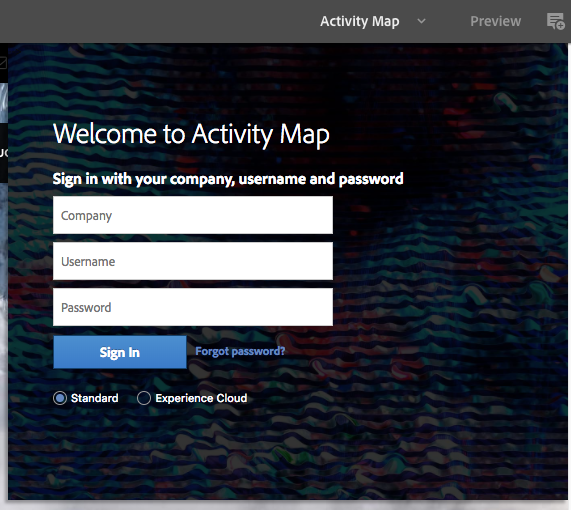

# Visualización de datos de análisis de la página{#seeing-page-analytics-data}

Utilice los datos de análisis de la página para medir la eficacia del contenido de la página.

## Analytics visible desde la consola {#analytics-visible-from-the-console}

Los datos de análisis de página se muestran en [Vista de lista](/help/sites-authoring/basic-handling.md#list-view) de la consola Sitios . Cuando las páginas se muestran en formato de lista, las siguientes columnas están disponibles de forma predeterminada:

* Vistas de la página
* Visitantes únicos
* Tiempo empleado en la página

Cada columna muestra un valor para el período de informe actual y también indica si el valor ha aumentado o disminuido desde el período de informe anterior. Los datos que ve se actualizan cada 12 horas.

>[!NOTE]
>
>Para cambiar el periodo de actualización, [configuración del intervalo de importación](/help/sites-administering/adobeanalytics-connect.md#configuring-the-import-interval).

1. Abra el **Sitios** consola; por ejemplo [http://localhost:4502/sites.html/content](http://localhost:4502/sites.html/content)
1. En el extremo derecho de la barra de herramientas (esquina superior derecha), toque o haga clic en el icono para seleccionar **Vista de lista** (el icono mostrado dependerá de la variable [vista actual](/help/sites-authoring/basic-handling.md#viewing-and-selecting-resources)).

1. De nuevo, en el extremo derecho de la barra de herramientas (esquina superior derecha), toque o haga clic en el icono y seleccione **Configuración de vista**. La variable **Configurar columnas** se abrirá. Realice los cambios necesarios y confirme con **Actualizar**.

   

### Selección del período de informe {#selecting-the-reporting-period}

Seleccione el período de informe para el que los datos de Analytics aparecen en la consola Sitios :

* Datos de los últimos 30 días
* Datos de los últimos 90 días
* Datos de este año

El período de informe actual aparece en la barra de herramientas de la consola Sitios (a la derecha de la barra de herramientas superior). Utilice la lista desplegable para seleccionar el período de informe requerido.

### Configuración de las columnas de datos disponibles {#configuring-available-data-columns}

Los miembros del grupo de usuarios administradores de análisis pueden configurar la consola Sitios para permitir que los autores vean columnas de Analytics adicionales.

>[!NOTE]
>
>Cuando un árbol de páginas contiene elementos secundarios asociados a distintas configuraciones de nube de Adobe Analytics, no se pueden configurar las columnas de datos disponibles para las páginas.

1. En la vista de lista, utilice los selectores de vista (derecha de la barra de herramientas) y seleccione **Configuración de vista** y luego **Añadir datos de análisis personalizados**.

   

1. Seleccione las métricas que desee exponer a los autores en la consola Sitios y, a continuación, haga clic en **Agregar**.

   Las columnas que aparecen se recuperan de Adobe Analytics.

   

### Apertura de perspectivas de contenido desde sitios {#opening-content-insights-from-sites}

Apertura [Perspectiva de contenido](/help/sites-authoring/content-insights.md) desde la consola Sitios para investigar más a fondo la eficacia de la página.

1. En la consola Sitios , seleccione la página para la que desea ver Perspectivas de contenido.
1. En la barra de herramientas, haga clic en el icono Analytics y Recommendations .

   

## Analytics visible desde el Editor de páginas (Activity Map) {#analytics-visible-from-the-page-editor-activity-map}

>[!NOTE]
>
>Esto se mostrará si la variable [Se ha configurado el Activity Map](/help/sites-administering/adobeanalytics-connect.md#configuring-for-the-activity-map) para su sitio web.

>[!NOTE]
>
>Los datos del Activity Map se toman de Adobe Analytics.

Cuando el sitio web se haya [configurado para Adobe Analytics](/help/sites-administering/adobeanalytics-connect.md), puede usar la variable [Activity Map de modo](/help/sites-authoring/author-environment-tools.md#page-modes) para ver los datos relevantes. Por ejemplo:

### Acceso al Activity Map {#accessing-the-activity-map}

Después de seleccionar la variable [Activity Map](/help/sites-authoring/author-environment-tools.md#page-modes) , se le solicitará que introduzca sus credenciales de Adobe Analytics.

La variable **Analytics** se muestra la barra de herramientas flotante; aquí puede:

* cambiar el formato de la barra de herramientas con las dos flechas (**>>**)
* Alternar detalles de página (icono de ojo)
* Configuración del Activity Map (icono de engranaje)
* Seleccione el análisis que desea mostrar (varios selectores desplegables)
* Salga del Activity Map y cierre la barra de herramientas (x)

### Selección de Analytics para mostrar {#selecting-the-analytics-to-show}

Puede seleccionar los datos analíticos que se van a mostrar y cómo se deben mostrar, utilizando los distintos criterios:

* **Estándar**/**Activo**

* tipo de evento
* grupo de usuarios
* **Burbujas**/**Degradación**/**Ganadores y perdedores**/**Off**

* período que se va a mostrar

### Configuración del Activity Map {#configuring-the-activity-map}

Utilice la variable **Mostrar configuración** para abrir **Configuración del Activity Map** diálogo.

La variable **Configuración del Activity Map** proporciona una gama de opciones en tres fichas:

* General

   * Grupo de informes
   * Nombre de página
   * Idioma
   * La etiqueta se superpone con
   * Tamaño de fuente de la etiqueta
   * Color de degradado
   * Color de burbuja
   * Degradación de color según
   * Transparencia de degradación

* Estándar

   * Visualización (tipo y número de vínculos)
   * Oculte las superposiciones de los vínculos que no hayan recibido ninguna visita

* Activo

   * Mostrar principales (ganadores o perdedores)
   * Excluir inferior %
   * Actualización automática (datos y periodo)
