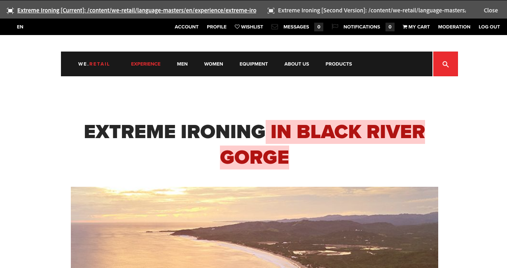

# Diferencias de página  {#page-diff}

## Introducción {#introduction}

La creación de contenido es un proceso iterativo. La creación con eficiencia de contenido requiere poder ver qué ha cambiado de una iteración a otra. Visualizar la versión de la página y luego otra es un proceso poco eficaz y propenso a errores. Un autor desea poder comparar fácilmente la página actual en paralelo con la otra versión.

La función Diferencias de página permite realizar una cómoda comparación en paralelo de dos páginas con las diferencias resaltadas.

>[!TIP]
>
>Consulte [Desarrollo y diferencia de página](/help/sites-developing/pagediff.md#operation-details) para obtener más información técnica sobre esta función.

## Uso de {#use}

La comparación de diferencias en paralelo permite comparar lo siguiente:

* [Versiones](/help/sites-authoring/working-with-page-versions.md#comparing-a-version-with-current-page): versión anterior de una página con el estado actual.
* [Live Copies](/help/sites-administering/msm-livecopy.md#comparing-a-live-copy-page-with-a-blueprint-page): Live Copy con su modelo.
* [Lanzamientos](/help/sites-authoring/launches-editing.md#comparing-a-launch-page-to-its-source-page): lanzamiento con su origen.
* [Copias de idioma](/help/sites-administering/tc-manage.md#comparing-language-copies): una página antes y después de la traducción.

Consulte los temas respectivos sobre cómo iniciar la comparación de diferencias dentro de esos contextos.

### Presentación de diferencias   {#presentation-of-differences}

Independientemente del contenido que se va a comparar, la presentación de las diferencias sigue siendo la misma.

* El contenido seleccionado al iniciar la comparación de diferencias se muestra a la izquierda (punto de entrada de las diferencias).
* El contenido con el que se va a comparar se muestra a la derecha (elemento con el que se compara el contenido seleccionado).

Por ejemplo, si se comparan versiones, la versión actual se muestra a la izquierda y la versión anterior se muestra a la derecha.

El origen de ambas páginas se muestra claramente en la barra de encabezado de la parte superior de la ventana del navegador.

La comparación de diferencias detecta los cambios en el nivel de componente y de HTML. Los elementos modificados se resaltan con colores diferentes.

**Cambios en los componentes**

* Verde claro: componente añadido
* Rosa: componente eliminado

**Cambios en HTML**

* Verde oscuro: HTML añadido
* Rojo: HTML eliminado

>[!NOTE]
>
>Al comparar las copias de idioma, el resaltado está desactivado, ya que en una traducción todo cambia y el resaltado no proporcionará ninguna ventaja.

### Pantalla completa y salida   {#fullscreen-and-exiting}

Para centrarse en un contenido determinado, puede hacer clic en el icono de pantalla completa para que cualquier &quot;lado&quot; de la comparación de diferencias en paralelo se amplíe en la ventana completa del explorador.

El lado seleccionado llenará toda la ventana, pero la barra permanecerá en la parte superior para que pueda cambiar entre las dos páginas.

También puede cerrar la vista de pantalla completa haciendo clic en el icono para salir del modo de pantalla completa.

Puede salir de la comparación de diferencias en paralelo en cualquier momento haciendo clic en el botón Cerrar del encabezado.

## Restricciones   {#limitations}

Hay algunas situaciones en las que la comparación de diferencias de la página quizás no detecte una diferencia de la forma esperada.

* Al diferenciar versiones y lanzamientos, la comparación de diferencias no tiene en cuenta componentes dinámicos como rutas de exploración, menús, listas de productos o logotipos (componentes que dependen de la estructura del sitio para procesar su contenido).
* Para las versiones, la comparación de diferencias no vuelve a crear la política de control de acceso ni las relaciones de Live Copy.
* Si se mueve una página, ya no se puede realizar una diferencia con ninguna versión hecha antes del movimiento.

   * Si tiene problemas con una comparación de diferencias, consulte la [Cronología](/help/sites-authoring/basic-handling.md#timeline) de la página para ver si la página se ha movido.

>[!NOTE]
>
>Las versiones no se pueden comparar entre sí. Solo la versión actual se puede comparar con otras versiones de la página. La versión actual siempre es la versión que se resalta con los cambios.

>[!NOTE]
>
>Para obtener más información sobre el funcionamiento del mecanismo de diferencia de página y las limitaciones que pueden afectar a dicho mecanismo, consulte la [documentación para desarrolladores](/help/sites-developing/pagediff.md) de esta función.
