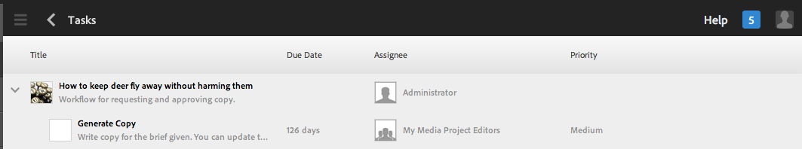

# Uso de flujos de trabajo de proyecto{#working-with-project-workflows}

Entre los flujos de trabajo de proyecto disponibles de fábrica se incluye lo siguiente:

* **Flujo de trabajo** de aprobación de proyectos: este flujo de trabajo le permite asignar contenido a un usuario, revisarlo y aprobarlo.
* **Inicio** de solicitud: flujo de trabajo que solicita un inicio.
* **Solicitud de página** de aterrizaje: este flujo de trabajo solicita una página de aterrizaje.
* **Solicitar correo electrónico**: flujo de trabajo para solicitar un correo electrónico.
* **Sesión fotográfica del producto y sesión fotográfica del producto (comercio)**: se asignan recursos a productos.
* **Crear y traducir copia DAM y Crear copia de idioma DAM**: crea elementos binarios, metadatos y etiquetas traducidos para los recursos y las carpetas.

Según la plantilla Proyecto que seleccione, tendrá a su disposición determinados flujos de trabajo:

|  | **Proyecto simple** | **Proyecto multimedia** | **Proyecto de sesión fotográfica del producto** | **Proyecto de traducción** |
|---|:-:|:-:|:-:|:-:|
| Solicitar copia |  | x |  |  |
| Sesión fotográfica del producto |  | x | x |  |
| Captura de fotos del producto (comercio) |  |  | x |  |
| Aprobación del proyecto | x |  |  |  |
| Solicitar lanzamiento | x |  |  |  |
| Solicitar página de aterrizaje | x |  |  |  |
| Solicitar correo electrónico | x |  |  |  |
| DAM Crear copia&amp;amp de idioma;último; |  |  |  | x |
| DAM Crear y traducir copia y registro de idioma;último; |  |  |  | x |

>[!NOTE]
>
>&amp;ast; These workflows are not started from the **Workflow** tile in Projects. Consulte [Creación de copias de idioma para recursos](/help/sites-administering/tc-manage.md). 

Las etapas para iniciar y completar flujos de trabajo no son las mismas, independientemente del flujo de trabajo que se elija. Solo las etapas cambian.

Un flujo de trabajo se inicia directamente en Proyectos (excepto Crear copia de idioma DAM y Crear y traducir copia de idioma DAM). La información sobre cualquier tarea pendiente de un proyecto aparece en el mosaico **Tareas**. Las notificaciones para las tareas que se deben completar aparecen junto al icono de usuario.

Para obtener más información sobre el uso de flujos de trabajo en AEM, consulte lo siguiente:

* [Participación en flujos de trabajo](/help/sites-authoring/workflows-participating.md)
* [Aplicación de flujos de trabajo a páginas](/help/sites-authoring/workflows-applying.md)
* [Configuración de flujos de trabajo](/help/sites-administering/workflows.md) 

En esta sección se describen los flujos de trabajo disponibles para Proyectos.

## Flujo de trabajo Solicitar copia {#request-copy-workflow}

Este flujo de trabajo permite solicitar un manuscrito de un usuario y, a continuación, aprobarlo. Para iniciar el flujo de trabajo Solicitar copia:

1. En el proyecto multimedia, seleccione el signo **+** en el mosaico **Flujos de trabajo** y seleccione **Flujo de trabajo Solicitar copia**.
1. Introduzca un título para el manuscrito y un breve resumen de lo que se solicita. Si fuera necesario, introduzca un recuento de palabras de destino, la prioridad de las tareas y una fecha de vencimiento.

   

1. Haga clic en **Crear**. Se inicia el flujo de trabajo. La tarea aparece en el mosaico **Tareas**.

   

## Flujo de trabajo de la sesión fotográfica del producto {#product-photo-shoot-workflow}

Los flujos de trabajo Sesión fotográfica del producto (comercio y sin comercio) se describen detalladamente en los [Proyecto creativo](/help/sites-authoring/managing-product-information.md).

## Flujo de trabajo Aprobación del proyecto {#project-approval-workflow}

En el flujo de trabajo Aprobación del proyecto, se asigna contenido a un usuario, el contenido se revisa y luego se aprueba.

1. In your Simple project, select the **`+`** sign in the **Workflows** tile and select **Project Approval Workflow**.
1. Introduzca un título y seleccione a quién asignarlo de la lista del equipo. Si fuera necesario, introduzca una descripción, ruta de contenido, prioridad de las tareas y una fecha de vencimiento.

   

1. Haga clic en **Crear**. Se inicia el flujo de trabajo. La tarea aparece en el mosaico **Tareas**.

   

## Flujo de trabajo Solicitar lanzamiento {#request-launch-workflow}

Este flujo de trabajo permite solicitar un lanzamiento.

1. En el proyecto sencillo, seleccione el signo **+** en el mosaico **Flujos de trabajo** y seleccione **Flujo de trabajo Solicitar lanzamiento**.
1. Introduzca un título para el lanzamiento y proporcione la ruta de origen de este. También puede añadir una descripción y la fecha de lanzamiento, si procede. Seleccione Heredar datos en directo de la página de origen o Excluir páginas secundarias según el comportamiento deseado del lanzamiento.

   

1. Haga clic en **Crear**. Se inicia el flujo de trabajo. **El flujo de trabajo aparece en la lista** Flujos **de trabajo (haga clic en elipses**... en el mosaico **Flujos de trabajo** para acceder a esta lista).

## Flujo de trabajo Solicitar página de aterrizaje {#request-landing-page-workflow}

Este flujo de trabajo permite solicitar una página de aterrizaje.

1. En el proyecto sencillo, seleccione el signo **+** en el mosaico **Flujos de trabajo** y seleccione Flujo de trabajo Solicitar página de aterrizaje.
1. Introduzca un título para la página de aterrizaje y la ruta principal. Si fuera necesario, introduzca una fecha de lanzamiento o elija un archivo para la página de aterrizaje.

   

1. Haga clic en **Crear**. Se inicia el flujo de trabajo. La tarea aparece en el mosaico **Tareas**.

## Flujo de trabajo Solicitar correo electrónico {#request-email-workflow}

Este flujo de trabajo permite solicitar un correo electrónico. Es el mismo flujo de trabajo que aparece en el mosaico **Correo electrónico**.

1. En el proyecto sencillo o multimedia, seleccione el signo **+** en el mosaico **Flujos de trabajo** y seleccione **Flujo de trabajo Solicitar correo electrónico**.
1. Introduzca un título de correo electrónico, así como las rutas de la campaña y la plantilla. Además, puede proporcionar un nombre, una descripción y una fecha de lanzamiento.

   

1. Haga clic en **Crear**. Se inicia el flujo de trabajo. La tarea aparece en el mosaico **Tareas**.

   

## Crear (y traducir) el flujo de trabajo de copia de idioma de los activos {#create-and-translate-language-copy-workflow-for-assets}

Los flujos de trabajo **Crear copia de idioma** y **Crear y traducir copia de idioma** se cubren con detalle en el artículo [Creating Language Copies for Assets (Creación de copias de idioma para los activos).](/help/assets/translation-projects.md)
