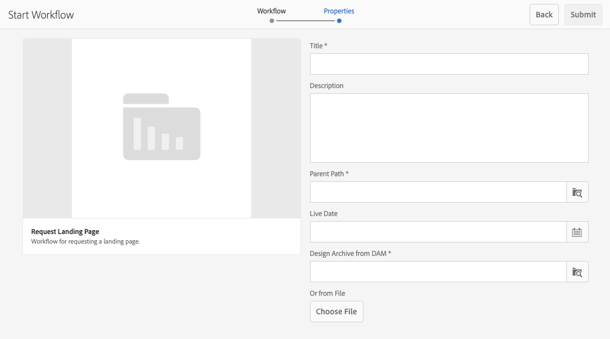
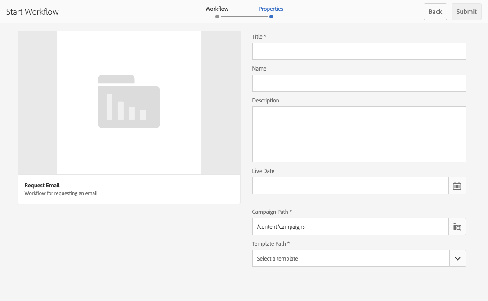

# Uso de flujos de trabajo de proyecto {#working-with-project-workflows}

Los flujos de trabajo de proyecto disponibles de forma predeterminada incluyen lo siguiente:

* **Flujo de trabajo de aprobación del proyecto**: este flujo de trabajo le permite asignar contenido a un usuario, revisarlo y aprobarlo.
* **Solicitar lanzamiento**: un flujo de trabajo solicita un lanzamiento.
* **Solicitar página de destino**: este flujo de trabajo solicita una página de destino.
* **Solicitar correo electrónico**: flujo de trabajo para solicitar un correo electrónico.
* **Sesión fotográfica del producto y Sesión fotográfica del producto (Commerce)**: asigna recursos con productos
* **Crear y traducir copia DAM y crear copia de idioma DAM**: crea archivos binarios, metadatos y etiquetas traducidos para archivos y carpetas.

Según la plantilla Proyecto que seleccione, tendrá a su disposición determinados flujos de trabajo:

|   | **Proyecto simple** | **Proyecto de medios** | **Proyecto de sesión fotográfica del producto** | **Proyecto de traducción** |
|---|:-:|:-:|:-:|:-:|
| Solicitar copia |  | x |  |  |
| Sesión fotográfica del producto |  | x | x |  |
| Sesión fotográfica del producto (Commerce) |  |  | x |  |
| Aprobación del proyecto | x |  |  |  |
| Solicitar lanzamiento | x |  |  |  |
| Solicitar página de destino | x |  |  |  |
| Solicitar correo electrónico | x |  |  |  |
| Creación de copia de idioma de DAM&ast; |  |  |  | x |
| Creación y traducción de copia de idioma de DAM&ast; |  |  |  | x |

>[!NOTE]
>
>&ast; Estos flujos de trabajo no se inician desde el mosaico **Flujo de trabajo** en Proyectos. Consulte [Creación de copias de idioma para Assets.](/help/sites-administering/tc-manage.md)

Los pasos para iniciar y completar flujos de trabajo son los mismos independientemente del flujo de trabajo que se elija. Solo cambian los pasos.

Puede iniciar un flujo de trabajo directamente en los proyectos (excepto Crear copia de idioma DAM o Crear y traducir copia de idioma DAM). La información sobre cualquier tarea pendiente en un proyecto aparece en el mosaico **Tareas**. Las notificaciones de las tareas que se deben completar aparecen junto al icono del usuario.

Para obtener más información sobre cómo trabajar con flujos de trabajo en AEM, consulte los siguientes documentos:

* [Participación en flujos de trabajo](/help/sites-authoring/workflows-participating.md)
* [Aplicación de flujos de trabajo a páginas](/help/sites-authoring/workflows-applying.md)
* [Configuración de flujos de trabajo &#x200B;](/help/sites-administering/workflows.md)

En esta sección se describen los flujos de trabajo disponibles para Proyectos.

## Solicitar copia de flujo de trabajo {#request-copy-workflow}

Este flujo de trabajo permite solicitar un manuscrito a un usuario y aprobarlo. Para iniciar el flujo de trabajo de copia de solicitud:

1. En un proyecto multimedia, haga clic en las comillas angulares hacia abajo en la parte superior derecha del mosaico **Flujos de trabajo** y seleccione **Iniciar flujo de trabajo**.
1. En el asistente del flujo de trabajo, seleccione **Solicitar copia** y haga clic en **Siguiente**.
1. Escriba un título de manuscrito y un breve resumen de lo que está solicitando. Si procede, introduzca un recuento de palabras objetivo, una prioridad de tarea y una fecha de vencimiento.

   

1. Haga clic en **Enviar**.

Se inicia el flujo de trabajo. La tarea aparece en la tarjeta **Tareas**.

## Flujo de trabajo de sesión fotográfica del producto {#product-photo-shoot-workflow}

Los flujos de trabajo de la **sesión fotográfica del producto** (tanto comerciales como sin comerciales) se tratan en detalle en el documento [Proyectos de Creative](/help/sites-authoring/managing-product-information.md)

## Flujo de trabajo de aprobación del proyecto {#project-approval-workflow}

En el flujo de trabajo **Aprobación del proyecto**, asigna contenido a un usuario, lo revisa y lo aprueba.

1. En un proyecto sencillo, haga clic en las comillas angulares hacia abajo en la parte superior derecha del mosaico **Flujos de trabajo** y seleccione **Iniciar flujo de trabajo**.
1. En el asistente del flujo de trabajo, seleccione **Flujo de trabajo de aprobación del proyecto** y haga clic en **Siguiente**.
1. Introduzca un título y seleccione a quién asignarlo. Si procede, introduzca una descripción, una ruta de contenido, una prioridad de tarea y una fecha de vencimiento.

   

1. Haga clic en **Enviar**.

Se inicia el flujo de trabajo. La tarea aparece en la tarjeta **Tareas**.

## Solicitar flujo de trabajo de lanzamiento {#request-launch-workflow}

Este flujo de trabajo permite solicitar un lanzamiento.

1. En un proyecto sencillo, haga clic en las comillas angulares hacia abajo en la parte superior derecha del mosaico **Flujos de trabajo** y seleccione **Iniciar flujo de trabajo**.
1. En el asistente del flujo de trabajo, seleccione **Solicitar flujo de trabajo de inicio** y haga clic en **Siguiente**.
1. Escriba un título para el lanzamiento y proporcione la ruta de origen del lanzamiento. También puede añadir una descripción y la fecha de lanzamiento, si procede. Seleccione Heredar datos en directo de la página de origen o excluir páginas secundarias según cómo desea que se comporte el lanzamiento.

   

1. Haga clic en **Enviar**.

Se inicia el flujo de trabajo. El flujo de trabajo aparece en la lista **Workflows**.

## Solicitar flujo de trabajo de página de aterrizaje {#request-landing-page-workflow}

Este flujo de trabajo le permite solicitar una página de aterrizaje.

1. En un proyecto sencillo, haga clic en las comillas angulares hacia abajo en la parte superior derecha del mosaico **Flujos de trabajo** y seleccione **Iniciar flujo de trabajo**.
1. En el asistente del flujo de trabajo, seleccione **Solicitar página de aterrizaje** y haga clic en **Siguiente**.
1. Escriba un título para la página de aterrizaje y la ruta principal. Si procede, introduzca una fecha de lanzamiento o elija un archivo para la página de aterrizaje.

   

1. Haga clic en **Enviar**.

Se inicia el flujo de trabajo. La tarea aparece en la tarjeta **Tareas**.

## Solicitar flujo de trabajo de correo electrónico {#request-email-workflow}

Este flujo de trabajo le permite solicitar un correo electrónico. Es el mismo flujo de trabajo que aparece en el mosaico **Correos electrónicos**.

1. En un proyecto sencillo, haga clic en las comillas angulares hacia abajo en la parte superior derecha del mosaico **Flujos de trabajo** y seleccione **Iniciar flujo de trabajo**.
1. En el asistente del flujo de trabajo, seleccione **Solicitar correo electrónico** y haga clic en **Siguiente**.
1. Introduzca un título de correo electrónico y las rutas de campaña y plantilla. Además, puede proporcionar un nombre, una descripción y una fecha de lanzamiento.

   

1. Haga clic en **Enviar**.

Se inicia el flujo de trabajo. La tarea aparece en la tarjeta **Tareas**.

## Crear (y traducir) el flujo de trabajo de copia de idioma de los activos {#create-and-translate-language-copy-workflow-for-assets}

Los flujos de trabajo **Crear copia de idioma** y **Crear y traducir copia de idioma** se tratan en detalle en el documento [Creación de copias de idioma para Assets.](/help/assets/translation-projects.md)
