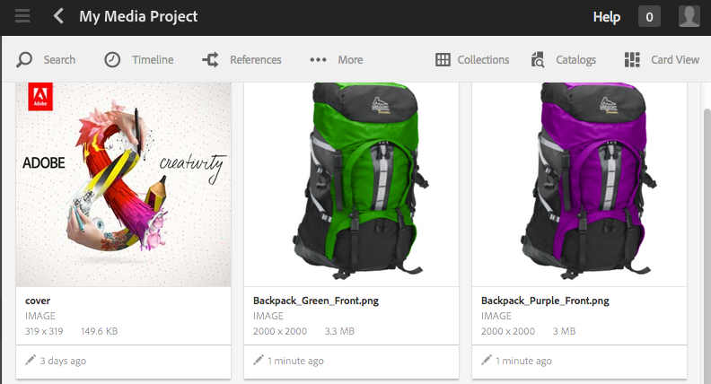

# Proyectos{#projects}

Los proyectos le permiten agrupar los recursos en una entidad. Un entorno común y compartido facilita la administración de los proyectos. Los tipos de recursos que puede asociar con un proyecto se mencionan en AEM como Mosaicos. Los mosaicos pueden incluir información sobre el proyecto y el equipo, recursos, flujos de trabajo y otros tipos de información, tal como se describe detalladamente en [Mosaicos del proyecto.](#project-tiles)

>[!CAUTION]
>
>Para que los usuarios de los proyectos puedan ver otros usuarios/grupos mientras utilizan la funcionalidad Proyectos , como crear proyectos, crear tareas/flujos de trabajo, ver y administrar el equipo, dichos usuarios deben tener acceso de lectura en **/home/users** y **/home/groups**. La forma más sencilla de implementar esto es dar al grupo **projects-users** acceso de lectura a **/home/users** y**/home/groups**.

Como usuario, puede hacer lo siguiente:

* Crear proyectos
* Asociar carpetas de contenido y recursos a un proyecto
* Eliminar proyectos
* Quitar vínculos de contenido del proyecto

Consulte los siguientes temas adicionales:

* [Administración de proyectos](/help/sites-authoring/touch-ui-managing-projects.md)
* [Uso de tareas](/help/sites-authoring/task-content.md)
* [Uso de flujos de trabajo de proyecto](/help/sites-authoring/projects-with-workflows.md)
* [Integración de proyectos y PIM creativos](/help/sites-authoring/managing-product-information.md) 

## Consola Proyectos {#projects-console}

La consola Proyectos permite acceder a los proyectos en AEM y administrarlos.

* Seleccione **Escala de tiempo** y elija un proyecto para ver su escala de tiempo.
* Pulse o haga clic en **Seleccionar** para entrar en el modo Selección.
* Haga clic en **Crear** para añadir proyectos.
* La opción **Alternar proyectos activos** permite cambiar entre todos los proyectos y solamente los que están activos.
* La opción **Mostrar vista de estadísticas** permite ver estadísticas del proyecto relacionadas con las tareas completadas.

## Mosaicos del proyecto  {#project-tiles}

Con la consola Proyectos, se asocian distintos tipos de información a los proyectos. Estos se llaman **Mosaicos**. En esta sección se describe cada uno de los mosaicos y el tipo de información que contienen.

Puede tener los siguientes mosaicos asociados al proyecto. Cada uso de ellos se describe en las secciones siguientes:

* Recursos y colecciones de recursos
* Experiencias
* Vínculos
* Información del proyecto
* Equipo
* Páginas de aterrizaje
* Correo electrónico
* Flujos de trabajo
* Lanzamientos
* Tareas

### Assets {#assets}

En el mosaico **Recursos**, puede reunir todos los recursos que utilice para un proyecto determinado.

Los recursos se cargan directamente en el mosaico. Además, si dispone del complemento Dynamic Media, puede crear conjuntos de imágenes, conjuntos de giros o conjuntos de medios mixtos.

### Colecciones de recursos {#asset-collections}

Del mismo modo que con los recursos, puede agregar [colecciones de recursos](/help/assets/manage-collections.md) directamente al proyecto. Puede definir colecciones de recursos.

Para añadir una colección, haga clic en **Agregar colección** y seleccione la colección adecuada de la lista.

### Experiencias  {#experiences}

El mosaico **Experiencias** permite añadir aplicación móvil, un sitio web o una publicación al proyecto.

Los iconos indican qué tipo de experiencia se representa: sitio web, aplicación móvil o publicación. Para agregar experiencias, haga clic en el signo + o en **Agregar experiencia** y seleccione el tipo de experiencia.

Seleccione la ruta para las miniaturas y, si fuera necesario, cambie la miniatura de la experiencia. Las experiencias se agrupan en el mosaico **Experiencias.**

### Vínculos {#links}

El mosaico Vínculos permite asociar vínculos externos al proyecto.

Puede asignar al vínculo un nombre fácil de reconocer, así como cambiar la miniatura.

### Información del proyecto {#project-info}

El mosaico Información del proyecto proporciona información general sobre el proyecto; por ejemplo, una descripción, el estado del proyecto (activo o inactivo), una fecha de vencimiento y los miembros. Además, puede añadir una miniatura de proyecto que se muestra en la página principal Proyectos.

Desde este mosaico, así como el mosaico Equipo, se pueden asignar o eliminar miembros, así como cambiar la función de estos.

### Trabajo de traducción {#translation-job}

En el mosaico Trabajo de traducción puede iniciar una traducción y también puede ver el estado de las traducciones. Para configurar la traducción, consulte [Creación de proyectos de traducción](/help/assets/translation-projects.md).

Haga clic en los puntos suspensivos en la parte inferior de la tarjeta **Translation Job** para ver los recursos en el flujo de trabajo de traducción. En la lista de trabajos de traducción también se muestran las entradas para los metadatos y las etiquetas de los recursos. Estas entradas indican que los metadatos y las etiquetas de los recursos también se traducen.

### Equipo {#team}

En este mosaico puede especificar los miembros del equipo del proyecto. Durante la edición puede introducir el nombre del miembro del equipo y asignar la función de usuario.

Puede añadir y eliminar miembros en el equipo. Además, puede editar la [función de usuario](#userroles) asignada al miembro.

### Páginas de aterrizaje {#landing-pages}

El mosaico **Páginas de aterrizaje** permite solicitar una nueva página de aterrizaje.

Este flujo de trabajo se describe en [Creación de un flujo de trabajo de página de aterrizaje](/help/sites-authoring/projects-with-workflows.md#request-landing-page-workflow).

### Correo electrónico  {#emails}

El mosaico **Correo electrónico** permite administrar las solicitudes por correo electrónico. Inicia la ventana Solicitud de correo electrónico.

Puede obtener más información en [Flujo de trabajo de solicitud de correo electrónico.](/help/sites-authoring/projects-with-workflows.md#request-email-workflow) 

### Flujos de trabajo {#workflows}

Puede asignar el proyecto para hacer un seguimiento de determinados flujos de trabajo. Si hay flujos de trabajo en ejecución, su estado se muestra en el mosaico **Flujos de trabajo** de Proyectos.

Puede asignar el proyecto para hacer un seguimiento de determinados flujos de trabajo. Según el proyecto que elija, tiene diferentes flujos de trabajo disponibles.

Estos se describen en [Uso de flujos de trabajo del proyecto.](/help/sites-authoring/projects-with-workflows.md) 

### Lanzamientos {#launches}

El mosaico Lanzamientos muestra los lanzamientos que se hayan solicitado con un [flujo de trabajo de solicitud de lanzamiento.](/help/sites-authoring/projects-with-workflows.md) 

### Tareas {#tasks}

En Tareas puede supervisar el estado de cualquier tarea relacionada con el proyecto, incluidos los flujos de trabajo. Las tareas se tratan en detalle en [Trabajo con Tareas](/help/sites-authoring/task-content.md).

## Plantillas de proyecto {#project-templates}

En AEM se incluyen tres plantillas predefinidas de fábrica:

* Un proyecto simple: una muestra de referencia para cualquier proyecto que no se ajuste a otras categorías (un captador global). Incluye tres funciones básicas (propietarios, editores y observadores) y cuatro flujos de trabajo (Aprobación del borrador, Solicitud de lanzamiento, Solicitud de página de aterrizaje y Solicitud de correo electrónico).
* Un proyecto de medios : un proyecto de muestra de referencia para actividades relacionadas con los medios. Incluye varias funciones relacionadas con contenido multimedia del proyecto (fotógrafos, editores, redactores, diseñadores, propietarios y observadores). También incluye dos flujos de trabajo relacionados con el contenido multimedia: Solicitar copia (para solicitar y revisar texto) y Sesión fotográfica del producto (para administrar la fotografía relacionada con el producto)
* [Proyecto Sesión fotográfica del producto](/help/sites-authoring/managing-product-information.md) : una muestra de referencia para administrar la fotografía del producto relacionada con el comercio electrónico. Incluye funciones para fotógrafos, editores, retocadores, propietarios, directores creativos, comerciales de redes sociales, directores de marketing, revisores y observadores.
* [Proyecto de traducción](/help/sites-administering/translation.md): una muestra de referencia para la administración de las actividades relacionadas con la traducción. Incluye tres funciones básicas (propietarios, editores y observadores). Incluye dos flujos de trabajo a los que se accede en la interfaz de usuario Flujos de trabajo.

En función de la plantilla seleccionada, dispone de distintas opciones en relación con las funciones de usuario y los flujos de trabajo.

## Funciones de usuario en un proyecto  {#user-roles-in-a-project}

Las diferentes funciones de usuario se establecen en una plantilla de proyecto y se utilizan por dos motivos principales:

1. Permisos. Las funciones de usuario se incluyen en una de las tres categorías enumeradas: Observador, Editor, Propietario. Por ejemplo, puede que un fotógrafo o redactor tenga los mismos derechos que un editor. Los permisos determinan lo que un usuario puede hacer con el contenido de un proyecto.
1. Flujos de trabajo. Los flujos de trabajo determinan a quién se asignan tareas en un proyecto. Las tareas se pueden asociar a una función del proyecto. Por ejemplo, una tarea puede asignarse a los fotógrafos, de manera que todos los miembros del equipo con la función Fotógrafo recibirán la tarea.

Todos los proyectos admiten las siguientes funciones predeterminadas para que pueda administrar los permisos de seguridad y control:

<table>
 <tbody>
  <tr>
   <td>
<strong>Función</strong>
 </td>
   <td>
<strong>Descripción</strong>
 </td>
   <td>
<strong>Permisos</strong>
 </td>
   <td>
<strong>Pertenencia a grupos</strong>
 </td>
  </tr>
  <tr>
   <td>
Observador
 </td>
   <td>
Un usuario con esta función puede ver los detalles de un proyecto, incluido el estado del proyecto.
 </td>
   <td>
Permisos de lectura de un proyecto
 </td>
   <td>
grupo de flujo de trabajo-usuarios
 </td>
  </tr>
  <tr>
   <td>
Editor
 </td>
   <td>
Un usuario con esta función puede cargar y editar el contenido de un proyecto.
 
 
 </td>
   <td>
    <ul>
     <li>Acceso de lectura y escritura en un proyecto, metadatos asociados y recursos relacionados.</li>
     <li>Privilegios para cargar una lista de tomas, realizar una sesión fotográfica, y revisar y aprobar recursos</li>
     <li>Permiso de escritura en /etc/commerce</li>
     <li>Disponen de permiso de modificación en un proyecto específico</li>
    </ul> </td>
   <td>
grupo de flujo de trabajo-usuarios
 </td>
  </tr>
  <tr>
   <td>
Propietario
 </td>
   <td>
Un usuario con esta función puede iniciar un proyecto. Un propietario puede crear un proyecto, iniciar el trabajo en un proyecto y también mover los recursos aprobados a la carpeta de producción. El propietario también puede realizar y visualizar todas las demás tareas del proyecto.
 </td>
   <td>
    <ul>
     <li>Permiso de escritura en /etc/commerce</li>
    </ul> </td>
   <td>
    <ul>
     <li>Grupo de usuarios DAM (para poder crear un proyecto)</li>
     <li>grupo de administradores de proyectos (para poder crear un proyecto y mover recursos)</li>
    </ul> </td>
  </tr>
 </tbody>
</table>

Para proyectos creativos, también se proporcionan funciones adicionales, como por ejemplo, fotógrafos. Puede utilizar estas funciones para derivar funciones personalizadas para un proyecto específico.

>[!NOTE]
>
>Al crear el proyecto y agregar usuarios a las distintas funciones, los grupos asociados con el proyecto se crean automáticamente para administrar los permisos asociados. Por ejemplo, un proyecto llamado Myproject tendría tres grupos: **Propietarios de Myproject**, **Editores de Myproject**, **Observadores de Myproject**. Sin embargo, si se elimina el proyecto, esos grupos no se eliminarán automáticamente. Un administrador debe eliminar manualmente los grupos en **Herramientas** > **Seguridad** > **Grupos**.
