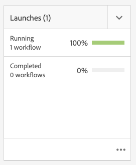

# Proyectos {#projects}

Los proyectos permiten agrupar los recursos en una entidad. Un entorno común y compartido facilita la administración de sus proyectos. Los tipos de recursos que puede asociar a un proyecto se denominan Mosaicos en AEM. Los mosaicos pueden incluir información sobre el proyecto y el equipo, los recursos, los flujos de trabajo y otro tipo de información, tal como se describe detalladamente en [Mosaicos del proyecto.](#project-tiles)

Como usuario, puede:

* Creación y eliminación de proyectos
* Asociación de carpetas de contenido y recursos a un proyecto
* Eliminación de vínculos de contenido del proyecto

## Requisitos de acceso {#access-requirements}

AEM Los proyectos son una característica de la estándar y no requieren ninguna configuración adicional.

Sin embargo, para que los usuarios de los proyectos puedan ver a otros usuarios o grupos mientras utilizan Proyectos como, por ejemplo, al crear proyectos, crear tareas/flujos de trabajo o ver y administrar el equipo, dichos usuarios necesitan tener acceso de lectura en `/home/users` y `/home/groups`.

La forma más sencilla de hacerlo es conceder acceso de lectura al grupo **projects-users** a `/home/users` y `/home/groups`.

## Consola Proyectos {#projects-console}

La consola Proyectos es donde se accede a los proyectos y se administran dentro de AEM.

AEM La consola Proyectos es similar a otras consolas en, permite realizar varias acciones en proyectos individuales y ajustar la vista de los proyectos en la que se encuentran.

### Alternar el modo {#modes}

Puede utilizar el selector de carril para cambiar entre los modos de la consola.

#### Solo contenido {#content-only}

Solo contenido es el modo predeterminado al abrir la consola. Se mostrarán todos los proyectos.

#### Escala de cronología {#timeline}

La vista de cronología permite seleccionar un proyecto individual y ver la actividad en él. Utilice el selector de carril o la tecla de función `alt+1` para cambiar a esta vista.

### Alternar la vista {#views}

Puede utilizar el selector de vista para cambiar entre la visualización de proyectos como mosaicos grandes (el valor predeterminado), la visualización como una lista o en un calendario.

### Filtrar la vista {#filter}

Puede utilizar el filtro para alternar entre todos los proyectos y solo aquellos que están activos.

### Selección y visualización de proyectos {#selecting}

Para seleccionar un proyecto, pase el ratón sobre el mosaico del proyecto y haga clic en la marca de verificación.

Vea los detalles de un proyecto haciendo clic en él para profundizar en ellos.

### Creación de nuevos proyectos {#creating}

Haga clic en **Crear** para agregar un nuevo proyecto.

## Mosaicos del proyecto {#project-tiles}

Los proyectos están formados por diferentes tipos de información que desea administrar juntos. Esta información está representada por diferentes **Mosaicos**.

Puede tener los siguientes mosaicos asociados al proyecto.

* [Recursos](#assets)
* [Colecciones de recursos](#asset-collections)
* [Experiencias](#experiences)
* [Vínculos](#links)
* [Información del proyecto](#project-info)
* [Equipo](#team)
* [Páginas de destino](#landing-pages)
* [Correos electrónicos](#emails)
* [Flujos de trabajo](#workflows)
* [Lanzamientos](#launches)
* [Tareas](#tasks)

Haga clic en el menú desplegable en la parte superior derecha de cualquier mosaico para agregar más datos al mosaico.

Haga clic en el botón de puntos suspensivos en la parte inferior derecha de cualquier mosaico para abrir los datos del mosaico en la consola asociada.

### Assets {#assets}

En el mosaico **Recursos**, puede recopilar todos los recursos que utilice para un proyecto en particular.

Puede cargar recursos directamente en el mosaico.

### Colecciones de recursos {#asset-collections}

Del mismo modo que con los recursos, puede agregar [colecciones de recursos](/help/assets/manage-collections.md) directamente al proyecto. Las colecciones se definen en Recursos.

Agregue una colección haciendo clic en **Agregar colección** y seleccionando la colección adecuada en la lista.

### Experiencias {#experiences}

El mosaico **Experiencias** le permite agregar una aplicación móvil, sitio web o publicación al proyecto.

Los iconos indican qué tipo de experiencia se representa.

* Sitio web
* aplicación móvil

### Vínculos {#links}

El mosaico **Vínculos** le permite asociar vínculos externos con su proyecto.

Puede asignar al vínculo un nombre fácil de reconocer y cambiar la miniatura.

### Información del proyecto {#project-info}

El mosaico **Información del proyecto** proporciona información general sobre el proyecto, incluida una descripción, el estado del proyecto (inactivo o activo), una fecha de vencimiento y los miembros. Además, puede añadir una miniatura de proyecto, que se muestra en la página principal Proyectos.

### Trabajo de traducción {#translation-job}

En el mosaico **Trabajo de traducción** es donde se inicia una traducción y también se ve el estado de las traducciones.

Para configurar la traducción, consulte el documento [Creación de proyectos de traducción.](/help/assets/translation-projects.md)

### Equipo {#team}

En este mosaico, puede especificar los miembros del equipo del proyecto. Durante la edición, puede introducir el nombre del miembro del equipo y asignar la función de usuario.

Puede añadir y eliminar miembros en el equipo. Además, puede editar la [función de usuario](#userroles) asignada al miembro del equipo.

### Páginas de destino {#landing-pages}

El mosaico **Páginas de aterrizaje** le permite solicitar una nueva página de aterrizaje.

Este flujo de trabajo se describe en el documento[Crear un flujo de trabajo de página de aterrizaje.](/help/sites-authoring/projects-with-workflows.md#request-landing-page-workflow)

### Correos electrónicos {#emails}

El mosaico **Correos electrónicos** le ayuda a administrar las solicitudes de correo electrónico. Inicia el flujo de trabajo **Solicitud de correo electrónico**.

Encontrará más información en el flujo de trabajo [Solicitar correo electrónico.](/help/sites-authoring/projects-with-workflows.md#request-email-workflow)

### Flujos de trabajo {#workflows}

Puede iniciar flujos de trabajo para el proyecto. Si hay flujos de trabajo en ejecución, su estado se mostrará en el mosaico **Flujos de trabajo**.

En función del proyecto que cree, hay diferentes flujos de trabajo disponibles.

Se describen en [Uso de flujos de trabajo de proyectos.](/help/sites-authoring/projects-with-workflows.md)

### Lanzamientos {#launches}

El mosaico **Lanzamientos** muestra todos los lanzamientos solicitados con un flujo de trabajo [Solicitar lanzamiento.](/help/sites-authoring/projects-with-workflows.md)

### Tareas {#tasks}

Las tareas permiten monitorizar el estado de cualquier tarea relacionada con el proyecto, incluidos los flujos de trabajo. Las tareas se describen detalladamente en [Uso de tareas](/help/sites-authoring/task-content.md).

## Plantillas de proyecto {#project-templates}

Las plantillas sirven de base para iniciar el proyecto. AEM proporciona estas plantillas de proyecto estándar.

* **Proyecto de medios**: este es un proyecto de muestra de referencia para actividades relacionadas con medios. Incluye varias funciones de proyecto relacionadas con medios y también flujos de trabajo relacionados con contenido de medios.
* **[Proyecto de sesión fotográfica de producto](/help/sites-authoring/managing-product-information.md)**: es una muestra de referencia para administrar la fotografía de productos relacionada con el comercio electrónico.
* **[Proyecto de traducción](/help/sites-administering/translation.md)**: este es un ejemplo de referencia para administrar actividades relacionadas con la traducción. Incluye funciones básicas e incluye flujos de trabajo para administrar la traducción.
* **Proyecto simple**: es una muestra de referencia para cualquier proyecto que no se ajuste a otras categorías. AEM Incluye tres funciones básicas y cuatro flujos de trabajo generales de.

En función de la plantilla que seleccione, tendrá diferentes opciones disponibles dentro del proyecto, como las funciones de usuario y los flujos de trabajo proporcionados.

## Funciones de un usuario en un proyecto {#user-roles-in-a-project}

Las diferentes funciones de usuario se definen en la plantilla de proyecto y se utilizan por dos motivos principales:

1. Permisos: las funciones de usuario se encuentran en una de las tres categorías enumeradas: observador, editor, propietario. Por ejemplo, un fotógrafo o redactor tendrá los mismos privilegios que un editor. Los permisos determinan lo que un usuario puede hacer con el contenido de un proyecto.
1. Flujos de trabajo: los flujos de trabajo determinan a quién se asignan las tareas de un proyecto. Las tareas se pueden asociar a una función del proyecto. Por ejemplo, se puede asignar una tarea a los fotógrafos de modo que todos los miembros del equipo que tengan la función de fotógrafo obtengan la tarea.

Todos los proyectos admiten las siguientes funciones predeterminadas para permitirle administrar los permisos de seguridad y control.

| Función | Descripción | Permisos | Miembros del grupo |
|---|---|---|---|
| Observador | Un usuario con esta función puede ver los detalles del proyecto, incluido su estado. | Permisos de solo lectura en un proyecto | grupo `workflow-users` |
| Editor | Un usuario con esta función puede cargar y editar el contenido de un proyecto. | Acceso de lectura y escritura en un proyecto, metadatos asociados y recursos relacionados Privilegios para cargar una lista de tomas, una sesión de fotos y revisar y aprobar recursos Permiso de escritura en `/etc/commerce` Modificar permisos en un proyecto específico | grupo `workflow-users` |
| Propietario | Un usuario con esta función puede crear un proyecto, iniciar el trabajo en un proyecto y mover los recursos aprobados a la carpeta de producción. El propietario también puede realizar y visualizar todas las demás tareas del proyecto. | Permiso de escritura en `/etc/commerce` | `dam-users` grupo para poder crear un proyecto `projects-administrators` grupo para poder crear un proyecto y mover recursos |

Para proyectos creativos, también se proporcionan funciones adicionales, como fotógrafos. Puede utilizar estas funciones para derivar funciones personalizadas para un proyecto específico.

### Creación automática de grupos {#auto-group-creation}

Al crear el proyecto y agregar usuarios a las distintas funciones, los grupos asociados con el proyecto se crean automáticamente para administrar los permisos asociados.

Por ejemplo, un proyecto llamado Myproject tendría tres grupos: **Propietarios de Myproject**, **Editores de Myproject**, **Observadores de Myproject**.

Si se elimina el proyecto, esos grupos sólo se eliminarán si selecciona la opción adecuada [&#x200B; al eliminar el proyecto.](/help/sites-authoring/touch-ui-managing-projects.md#deleting-a-project) Un administrador también puede eliminar manualmente los grupos de **Herramientas** > **Seguridad** > **Grupos**.

## Recursos adicionales {#additional-resources}

Para obtener más información sobre el uso de proyectos, consulte los siguientes documentos adicionales:

* [Administración de proyectos](/help/sites-authoring/touch-ui-managing-projects.md)
* [Uso de tareas](/help/sites-authoring/task-content.md)
* [Uso de flujos de trabajo de proyecto](/help/sites-authoring/projects-with-workflows.md)
* [Integración de Creative Project y PIM](/help/sites-authoring/managing-product-information.md)
