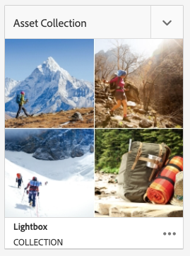

# Proyectos {#projects}

Los proyectos le permiten agrupar los recursos en una entidad. Un entorno común y compartido facilita la administración de los proyectos. Los tipos de recursos que puede asociar con un proyecto se mencionan en AEM como Mosaicos. Los mosaicos pueden incluir información sobre el proyecto y el equipo, los recursos, los flujos de trabajo y otro tipo de información, tal como se describe detalladamente en [Mosaicos del proyecto.](#project-tiles)

Como usuario, puede:

* Crear y eliminar proyectos
* Asociar carpetas de contenido y recursos a un proyecto
* Quitar vínculos de contenido del proyecto

## Requisitos de acceso {#access-requirements}

Planifica una función de AEM estándar y no requiere ninguna configuración adicional.

Sin embargo, para que los usuarios de los proyectos puedan ver a otros usuarios/grupos mientras utilizan Proyectos como, por ejemplo, al crear proyectos, crear tareas/flujos de trabajo, o al ver y administrar el equipo, dichos usuarios deben tener acceso de lectura en `/home/users` y `/home/groups`.

La forma más sencilla de hacerlo es dar a la variable **usuarios de proyectos** acceso de lectura de grupo a `/home/users` y `/home/groups`.

## Consola Proyectos {#projects-console}

La consola Proyectos permite acceder a los proyectos en AEM y administrarlos.

La consola Proyectos es similar a otras consolas de AEM, permite realizar una serie de acciones en proyectos individuales y ajusta la vista de los proyectos.

### Alternar modo {#modes}

Puede utilizar el selector de raíl para cambiar entre los modos de la consola.

#### Solo contenido {#content-only}

Solo contenido es el modo predeterminado al abrir la consola. Mostrará todos sus proyectos.

#### Escala de cronología {#timeline}

La vista de línea de tiempo permite seleccionar un proyecto individual y ver la actividad en él. Utilice el selector de raíl o la tecla de acceso directo `alt+1` para cambiar a esta vista.

### Alternar la vista {#views}

Puede utilizar el selector de vista para cambiar entre ver proyectos como mosaicos grandes (el predeterminado), verlos como una lista o en un calendario.

### Filtrar la vista {#filter}

Puede utilizar el filtro para alternar entre todos los proyectos y solo los que están activos.

### Selección y visualización de proyectos {#selecting}

Para seleccionar un proyecto, pase el ratón sobre el mosaico del proyecto y haga clic en la marca de verificación.

Vea los detalles de un proyecto haciendo clic en él para profundizar en sus detalles.

### Creación de nuevos proyectos {#creating}

Haga clic en **Crear** para agregar un nuevo proyecto.

## Mosaicos del proyecto {#project-tiles}

Los proyectos están formados por diferentes tipos de información que desea administrar juntos. Esta información está representada por diferentes **Mosaicos**.

Puede tener los siguientes mosaicos asociados al proyecto.

* [Assets](#assets)
* [Colecciones de recursos](#asset-collections)
* [Experiencias](#experiences)
* [Vínculos](#links)
* [Información del proyecto](#project-info)
* [Equipo](#team)
* [Páginas de aterrizaje](#landing-pages)
* [Correo electrónico](#emails)
* [Flujos de trabajo](#workflows)
* [Lanzamientos](#launches)
* [Tareas](#tasks)

Haga clic en el menú desplegable en la parte superior derecha de cualquier mosaico para agregar más datos al mosaico.

Haga clic en el botón de elipses en la parte inferior derecha de cualquier mosaico para abrir los datos del mosaico en su consola asociada.

### Recursos {#assets}

En el mosaico **Recursos**, puede reunir todos los recursos que utilice para un proyecto determinado.

Los recursos se cargan directamente en el mosaico.

### Colecciones de recursos {#asset-collections}

Del mismo modo que con los recursos, puede agregar [colecciones de recursos](/help/assets/manage-collections.md) directamente al proyecto. Puede definir colecciones de recursos.

Agregue una colección haciendo clic en **Agregar colección** y seleccionando la colección adecuada en la lista.

### Experiencias {#experiences}

La variable **Experiencias** el mosaico le permite agregar una aplicación móvil, un sitio web o una publicación al proyecto.

Los iconos indican qué tipo de experiencia se representa.

* Sitio web
* Aplicación móvil

### Vínculos {#links}

La variable **Vínculos** mosaico permite asociar vínculos externos al proyecto.

Puede asignar al vínculo un nombre fácil de reconocer, así como cambiar la miniatura.

### Información del proyecto {#project-info}

La variable **Información del proyecto** el mosaico proporciona información general sobre el proyecto, incluida una descripción, el estado del proyecto (inactivo o activo), una fecha de vencimiento y los miembros. Además, puede añadir una miniatura de proyecto que se muestra en la página principal Proyectos.

### Trabajo de traducción {#translation-job}

La variable **Trabajo de traducción** mosaico es donde se inicia una traducción y también donde se ve el estado de las traducciones.

Para configurar la traducción, consulte el documento [Creación de proyectos de traducción.](/help/assets/translation-projects.md)

### Equipo {#team}

En este mosaico puede especificar los miembros del equipo del proyecto. Durante la edición puede introducir el nombre del miembro del equipo y asignar la función de usuario.

Puede añadir y eliminar miembros en el equipo. Además, puede editar la [función de usuario](#userroles) asignada al miembro del equipo.

### Páginas de aterrizaje {#landing-pages}

El mosaico **** Páginas de aterrizaje permite solicitar una nueva página de aterrizaje.

Este flujo de trabajo se describe en el documento[Creación de un flujo de trabajo de página de aterrizaje .](/help/sites-authoring/projects-with-workflows.md#request-landing-page-workflow)

### Correo electrónico {#emails}

El mosaico **Correo electrónico** permite administrar las solicitudes por correo electrónico. Inicia el **Solicitud de correo electrónico** flujo de trabajo.

Puede obtener más información en [Flujo de trabajo de solicitud de correo electrónico.](/help/sites-authoring/projects-with-workflows.md#request-email-workflow) 

### Flujos de trabajo {#workflows}

Puede iniciar flujos de trabajo para el proyecto. Si se está ejecutando algún flujo de trabajo, su estado se muestra en la sección **Flujos de trabajo** mosaico.

Según el proyecto que cree, hay diferentes flujos de trabajo disponibles.

Estos se describen en [Uso de flujos de trabajo del proyecto.](/help/sites-authoring/projects-with-workflows.md) 

### Lanzamientos {#launches}

La variable **Lanzamientos** el mosaico muestra los lanzamientos que se han solicitado con un [Flujo de trabajo Solicitar lanzamiento .](/help/sites-authoring/projects-with-workflows.md)

### Tareas {#tasks}

En Tareas puede supervisar el estado de cualquier tarea relacionada con el proyecto, incluidos los flujos de trabajo. Las tareas se describen detalladamente en [Uso de tareas](/help/sites-authoring/task-content.md).

## Plantillas de proyecto {#project-templates}

Las plantillas sirven de base para iniciar el proyecto. AEM proporciona estas plantillas de proyecto estándar.

* **Proyecto multimedia** - Este es un proyecto de muestra de referencia para actividades relacionadas con los medios. Incluye varias funciones de proyecto relacionadas con los medios y también flujos de trabajo relacionados con el contenido de los medios.
* **[Proyecto de sesión fotográfica del producto](/help/sites-authoring/managing-product-information.md)** - Esta es una muestra de referencia para administrar la fotografía de producto relacionada con el comercio electrónico.
* **[Proyecto de traducción](/help/sites-administering/translation.md)** - Esta es una muestra de referencia para administrar las actividades relacionadas con la traducción. Incluye funciones básicas e incluye flujos de trabajo para administrar la traducción.
* **Proyecto simple** - Esta es una muestra de referencia para cualquier proyecto que no se ajuste a otras categorías. Incluye tres funciones básicas y cuatro flujos de trabajo AEM generales.

En función de la plantilla que seleccione, dispondrá de distintas opciones dentro del proyecto, como las funciones de usuario y los flujos de trabajo proporcionados.

## Funciones de usuario en un proyecto {#user-roles-in-a-project}

Las diferentes funciones de usuario se definen en la plantilla del proyecto y se utilizan por dos motivos principales:

1. Permisos: Las funciones de usuario se dividen en una de las tres categorías enumeradas: observador, editor, propietario. Por ejemplo, un fotógrafo o redactor de copias tendrá los mismos privilegios que un editor. Los permisos determinan lo que un usuario puede hacer con el contenido de un proyecto.
1. Flujos de trabajo: Los flujos de trabajo determinan a quién se asignan tareas en un proyecto. Las tareas se pueden asociar a una función del proyecto. Por ejemplo, se puede asignar una tarea a los fotógrafos, de modo que todos los integrantes del equipo que tengan la función de fotógrafo obtengan la tarea.

Todos los proyectos admiten las siguientes funciones predeterminadas para que pueda administrar los permisos de seguridad y control.

| Función | Descripción | Permisos | Miembros del grupo |
|---|---|---|---|
| Observador | Un usuario con esta función puede ver los detalles de un proyecto, incluido el estado del proyecto. | Permisos de lectura de un proyecto | grupo `workflow-users` |
| Editor | Un usuario con esta función puede cargar y editar el contenido de un proyecto. | Acceso de lectura y escritura en un proyecto, metadatos asociados y recursos relacionados Privilegios para cargar una lista de tomas, sesión fotográfica y revisar y aprobar recursos Permiso de escritura en `/etc/commerce` Modificar el permiso de un proyecto específico | grupo `workflow-users` |
| Propietario | Un usuario con esta función puede crear un proyecto, iniciar el trabajo en un proyecto y mover los recursos aprobados a la carpeta de producción. El propietario también puede ver y realizar todas las demás tareas del proyecto. | Permiso de escritura en `/etc/commerce` | `dam-users` para poder crear un proyecto `project-administrators` para poder crear un proyecto y mover recursos |

Para proyectos creativos, también se proporcionan funciones adicionales como fotógrafos. Puede utilizar estas funciones para derivar funciones personalizadas para un proyecto específico.

### Creación automática de grupos {#auto-group-creation}

Al crear el proyecto y agregar usuarios a las distintas funciones, los grupos asociados con el proyecto se crean automáticamente para administrar los permisos asociados.

Por ejemplo, un proyecto llamado Myproject tendría tres grupos: **Propietarios de Myproject**, **Editores de Myproject**, **Observadores de Myproject**.

Si se elimina el proyecto, esos grupos solo se eliminarán si selecciona la opción adecuada [al eliminar el proyecto.](/help/sites-authoring/touch-ui-managing-projects.md#deleting-a-project) Un administrador también puede eliminar manualmente los grupos en **Herramientas** > **Seguridad** > **Grupos**.

## Recursos adicionales {#additional-resources}

Para obtener más información sobre el uso de los proyectos, consulte los siguientes documentos adicionales:

* [Administración de proyectos](/help/sites-authoring/touch-ui-managing-projects.md)
* [Uso de tareas](/help/sites-authoring/task-content.md)
* [Uso de flujos de trabajo de proyecto](/help/sites-authoring/projects-with-workflows.md)
* [Creative Project e integración PIM](/help/sites-authoring/managing-product-information.md)
