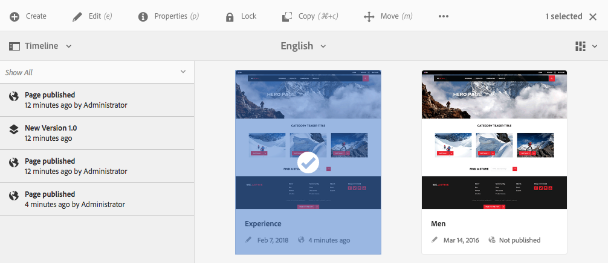

# Publicar páginas {#publishing-pages}

Cuando haya creado y revisado el contenido en el entorno de creación, el objetivo consiste en que [esté disponible en su sitio web público](/help/sites-authoring/author.md#concept-of-authoring-and-publishing) (su entorno de publicación).

Esta acción se conoce como publicar una página. Si desea quitar una página del entorno de publicación, la acción es la de cancelar la publicación. Tanto al publicar como al cancelar la publicación, la página permanece disponible en el entorno de creación para realizar cualquier cambio, hasta que decida eliminarla.

También puede publicar una página (o cancelar su publicación) inmediatamente o en un momento posterior predefinido.

>[!NOTE]
>
>Algunos términos relacionados con la publicación pueden llevar a confusión:
>
>* **Publicar / Cancelar la publicación**
   >  Estos son los términos principales para las acciones que hacen que el contenido esté disponible para el público en su entorno de publicación (o no).
   >
   >
* **Activar/Desactivar**
   >  Estos términos son sinónimos de Publicar/Cancelar la publicación.
   >
   >
* **Replicar / Replicación**
   >  Son los términos técnicos que describen el movimiento de datos (p. ej., contenido de página, archivos, código, comentarios del usuario) de un entorno a otro, como al publicar o replicar a la inversa los comentarios del usuario.
>

>[!NOTE]
>
>Si no dispone de los privilegios necesarios para publicar en una página concreta:
>
>* Se activará un flujo de trabajo para notificar a la persona adecuada la solicitud de publicación.
>* Este [flujo de trabajo puede haber sido personalizado](/help/sites-developing/workflows-models.md#main-pars-procedure-6fe6) por el equipo de desarrollo.
>* Se mostrará brevemente un mensaje para notificarle que el flujo de trabajo se ha activado.
>

## Publicar páginas {#publishing-pages-1}

En función de su ubicación, puede publicar:

* [Desde el editor de páginas](/help/sites-authoring/publishing-pages.md#publishing-from-the-editor)
* [Desde la consola Sitios](/help/sites-authoring/publishing-pages.md#publishing-from-the-console)

### Publicar desde el editor {#publishing-from-the-editor}

Si está editando una página, puede publicarla directamente desde el editor.

1. Select the **Page Information** icon to open the menu and then the **Publish Page** option.

   

1. En función de si la página tiene referencias que es necesario publicar:

   * La página se publicará directamente si no hay ninguna referencia por publicar.
   * Si la página tiene referencias que es necesario publicar, estas se enumerarán en el asistente **Publicar**, donde puede:

      * Specify which of the assets/tags/etc. you want to publish together with the page, then use **Publish** to complete the process.

      * Utilizar **Cancelar** para anular la acción.
   

1. Selecting **Publish** will replicate the page to the publish environment. En el editor de páginas se mostrará un mensaje que confirma la acción de publicación.

   

   Al ver la misma página en la consola, se muestra el estado actualizado de publicación.

   

>[!NOTE]
>
>La publicación desde el editor no es profunda; es decir, solo se publica la página o páginas seleccionadas, y no las páginas secundarias.

### Publicar desde la consola {#publishing-from-the-console}

En la consola Sitios hay dos opciones para la publicación:

* [Publicación rápida](/help/sites-authoring/publishing-pages.md#quick-publish)
* [Administrar publicación](/help/sites-authoring/publishing-pages.md#manage-publication)

#### Publicación rápida {#quick-publish}

**Publicación** rápida es para casos sencillos y publica las páginas seleccionadas inmediatamente sin ninguna interacción adicional. Por este motivo, cualquier referencia no publicada se publica también automáticamente.

Para publicar una página con Publicación rápida:

1. Select the page or pages in the sites console and click on the **Quick Publish** button.

   

1. In the Quick Publish dialogue, confirm the publication by clicking on **Publish** or cancel by clicking on **Cancel**. Recuerde que cualquier referencia sin publicar se publicará también automáticamente.

   

1. Cuando la página esté publicada, se mostrará un aviso de confirmación.

>[!NOTE]
>
>La Publicación rápida no es profunda; es decir, solo se publica la página o páginas seleccionadas, y no las páginas secundarias.

#### Administrar publicación {#manage-publication}

**Administrar publicación** ofrece más opciones que Publicación rápida, lo que permite incluir páginas secundarias, personalizar las referencias e iniciar cualquier flujo de trabajo aplicable, además de ofrecer la opción de publicar posteriormente.

Para publicar o cancelar la publicación de una página con Administrar publicación:

1. Select the page or pages in the sites console and click on the **Manage Publication** button.

   

1. The **Manage Publication** wizard starts. The first step, **Options**, allows you to:

   * Elija si publica o cancela la publicación de las páginas seleccionadas.
   * Elija si la acción se realizará ahora o en una fecha posterior.
   Posponer la publicación inicia un flujo de trabajo que publicará la página o páginas seleccionadas en el momento especificado. Por su parte, cancelar la publicación inicia un flujo de trabajo para anular la publicación de la página o páginas seleccionadas en un momento especificado.

   Si desea cancelar una acción de publicación/cancelación de la publicación posteriormente, vaya a la [consola Flujo de trabajo](/help/sites-administering/workflows.md) para finalizar el flujo de trabajo correspondiente.

   

   Haga clic en **Siguiente** para continuar.

1. In the next step of the Manage Publication wizard, **Scope**, you can define the scope of the publication/unpublication such as including to include child pages and/or including references.

   

   You can use the **Add Content** button to add additional pages to the list of pages to be published in case you neglected to select one before starting the Manage Publication wizard.

   Al hacer clic en el botón Añadir contenido se inicia el [navegador de rutas](/help/sites-authoring/author-environment-tools.md#path-browser) para que pueda seleccionar contenido.

   Select the required pages and then click **Select** to add the content to the wizard or **Cancel **to cancel the selection and return to the wizard.

   De nuevo en el asistente, puede seleccionar un elemento de la lista para configurar las demás opciones, por ejemplo:

   * Incluir sus elementos secundarios.
   * Eliminarlo de la selección.
   * Gestionar sus referencias publicadas.
   

   Clicking **Include Children** opens a dialogue allowing you to:

   * Incluir solo los elementos secundarios inmediatos.
   * Incluir solo las páginas modificadas.
   * Incluir solo las páginas ya publicadas.
   Click **Add** to add the children pages to the list of pages to be published or unpublished based on the selection options. Click **Cancel** to cancel the selection and return to the wizard.

   

   Al volver al asistente verá las páginas añadidas en función de su elección de opciones en el cuadro de diálogo Incluir elementos secundarios.

   You can view and modify the references to be published or unpublished for a page by selecting it and then clicking the **Published References** button.

   

   The **Published References** dialogue displayes the references for the selected content. De forma predeterminada, todas se seleccionan y se publican/dejan de publicar, pero puede anular la marca de selección de las que no desee, de modo que no se incluyan en la acción.

   Click **Done** to save your changes or **Cancel** to cancel the selction and return to the wizard.

   En el asistente, la columna **Referencias** se actualizará para reflejar su selección de referencias a publicar o dejar de publicar.

   

1. Click **Publish** to complete.

   En la consola Sitios, un mensaje de notificación confirmará la publicación.

1. If the published pages are associated with workflows, they may be shown in a final **Workflows** step of the publication wizard.

   >[!NOTE]
   >
   >The **Workflows** step will be shown based on what rights your user may or may not have. See the [previous note on this page](/help/sites-authoring/publishing-pages.md#main-pars-note-0-ejsjqg-refd) regarding publishing privileges as well as [Managing Access to Workflows](/help/sites-administering/workflows-managing.md) and [Applying Workflows to Pages](/help/sites-authoring/workflows-applying.md#main-pars-text-5-bvhbkh-refd) for details.

   Los recursos se agrupan por los flujos de trabajo activados y cada uno ofrece opciones para:

   * Definir el título del flujo de trabajo.
   * Keep the workflow package, provided that the workflow has [multi-resource support](/help/sites-developing/workflows-models.md#configuring-a-workflow-for-multi-resource-support).
   * Definir un título para el paquete de flujos de trabajo si se eligió la opción para mantener dicho paquete.
   Click **Publish** or **Publish Later** to complete the publication.

   

## Cancelar la publicación de páginas {#unpublishing-pages}

Si se cancela la publicación de una página, se eliminará del entorno de publicación y ya no estará disponible para los lectores.

In a [manner similar to publishing](/help/sites-authoring/publishing-pages.md#publishing-pages), one or more pages can be unpublished:

* [Desde el editor de páginas](/help/sites-authoring/publishing-pages.md#unpublishing-from-the-editor)
* [Desde la consola Sitios](/help/sites-authoring/publishing-pages.md#unpublishing-from-the-console)

### Cancelación de la publicación desde el editor {#unpublishing-from-the-editor}

Si desea cancelar la publicación de una página que está editando, seleccione **Cancelar publicación de página** en el menú **Información de página**, de un modo similar a como haría para [publicar la página](/help/sites-authoring/publishing-pages.md#publishing-from-the-editor).

### Cancelación de la publicación desde la consola {#unpublishing-from-the-console}

Al igual que [utiliza la opción Administrar publicación para publicar](/help/sites-authoring/publishing-pages.md#manage-publication), puede usarla para cancelar la publicación.

1. Select the page or pages in the sites console and click on the **Manage Publication** button.
1. The **Manage Publication** wizard starts. In the first step, **Options**, select to **Unpublish** instead of the default option of **Publish**.

   

   Igual que posponer la publicación inicia un flujo de trabajo para publicar esta versión de la página en el momento especificado, desactivar más tarde inicia un flujo de trabajo para cancelar la publicación de la página o páginas seleccionadas en un momento concreto.

   Si desea cancelar una acción de publicación/cancelación de la publicación posteriormente, vaya a la [consola Flujo de trabajo](/help/sites-administering/workflows.md) para finalizar el flujo de trabajo correspondiente.

1. Para completar la cancelación de la publicación, complete el asistente como haría para [publicar la página](/help/sites-authoring/publishing-pages.md#manage-publication).

## Publicar y cancelar la publicación de un árbol {#publishing-and-unpublishing-a-tree}

Cuando haya introducido o actualizado una cantidad considerable de páginas de contenido (todas ellas residentes dentro de la misma página raíz), puede ser más fácil publicar el árbol entero con una sola acción.

Para hacerlo, puede utilizar la opción [Administrar publicación](/help/sites-authoring/publishing-pages.md#manage-publication) de la consola Sitios.

1. En la consola Sitios, seleccione la página raíz de árbol que desea publicar o dejar de publicar y seleccione **Administrar publicación**.
1. The **Manage Publication** wizard starts. Elija si desea publicar o cancelar la publicación, y cuándo debe producirse la acción, y seleccione **Siguiente** para continuar.
1. En el paso **Ámbito**, elija la página raíz y seleccione **Incluir elementos secundarios**.

   

1. En el cuadro de diálogo **Incluir elementos secundarios**, desmarque las siguientes opciones:

   * Incluir solo los elementos secundarios inmediatos
   * Incluir solo las páginas ya publicadas
   Estas opciones están seleccionadas de forma predeterminada, por lo que debe acordarse de anular su selección. Haga clic en **Añadir** para confirmar y añadir el contenido a la publicación/cancelación de publicación.

   

1. El asistente **Administrar publicación** enumera el contenido del árbol para su revisión. Puede personalizar aún más la selección añadiendo páginas adicionales o eliminando las seleccionadas.

   

   Remember that you can also review the references to be published via the **Published References** option.

1. [Continúe con el asistente Administrar publicación de forma normal](#manage-publication) para completar la publicación o cancelación de publicación del árbol.

## Determinar el estado de publicación {#determining-publication-status}

Puede determinar el estado de la publicación de una página:

* En la [información general de recursos de la consola Sitios](/help/sites-authoring/basic-handling.md#viewing-and-selecting-resources)

   

   El estado de publicación se indica en las vistas de [tarjeta](/help/sites-authoring/basic-handling.md#card-view), [columna](/help/sites-authoring/basic-handling.md#column-view) y [lista](/help/sites-authoring/basic-handling.md#list-view) de la consola Sitios.

* In the [timeline](/help/sites-authoring/basic-handling.md#timeline)

   

* In the [Page Information menu](/help/sites-authoring/author-environment-tools.md#page-information) when editing a page

   
